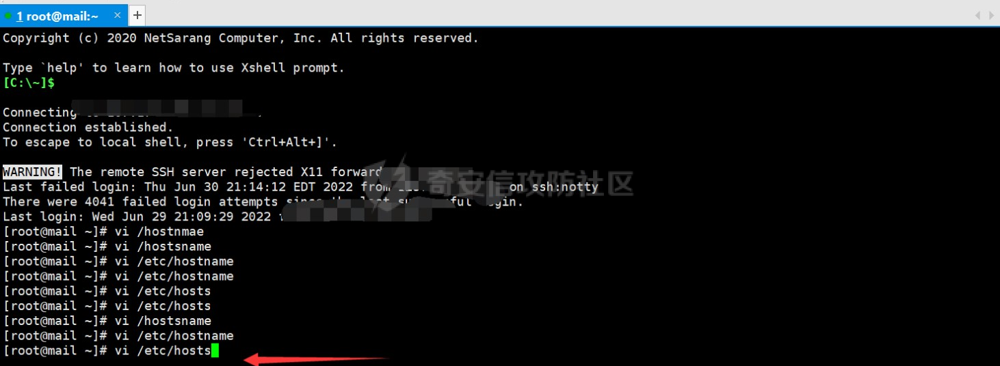
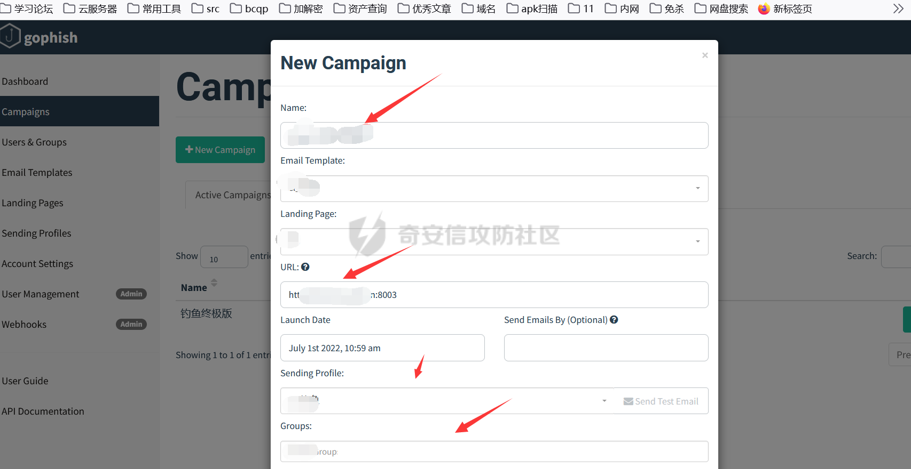

# 奇安信攻防社区-从零开始的钓鱼养成-(gophish+ewomail)

### 从零开始的钓鱼养成-(gophish+ewomail)

详细讲解钓鱼搭建流程

# 0x00 前景

由于马上开始护网了,公司想要在护网前对公司员工进行钓鱼意识培训,所以要我搞一下钓鱼,好久没搞了,还是在网上找了下资料,本次使用ewomail和gophish联动,最后总算还是完成了任务,下面我对本次钓鱼实战进行下详细步骤复盘,以后要搞也方便,希望和师傅们多交流交流,有啥更好的方法可以给我留言,当然还是那句话,该篇文章只做学习交流使用,犯罪等一切行为与本文作者无关。

# 0x01 域名购买

1.本次演练由于是内部演练,未申请国外的域名,使用的是国内腾讯云的域名,注册购买也很简单,购买后进入我的域名进行解析,下一节配置邮箱的时候对着我的配置配就行了。

# 0X02 ewomail安装

1.关闭selinux

vi /etc/sysconfig/selinux

SELINUX\\=enforcing 改为 SELINUX\\=disabled

2.使用git进行安装

这里我们的vps是国外的,所有安装域名后面加空格加en，例如 sh ./start.sh ewomail.cn en,注意ewomail.cn替换为我们注册的邮件域名。

yum -y install git

cd /root

git clone [https://github.com/gyxuehu/EwoMail.git](https://github.com/gyxuehu/EwoMail.git)

cd /root/EwoMail/install

需要输入一个邮箱域名，不需要前缀，列如下面的ewomail.cn，域名后面要加空格加en

sh ./start.sh ewomail.cn en

3.访问地址

邮箱管理后台,默认口令admin,ewomail123!

[http://IP:8010](http://ip:8010/)

web邮件系统

[http://IP:8000](http://ip:8000/)

4.配置邮箱

1.在购买的dns解析处配置,这里用腾讯云的配置,配置dkim值(DKIM是电子邮件验证标准，域名密钥识别邮件标准，主要是用来防止被判定为垃圾邮件)需要到服务器使用命令

amavisd -c /etc/amavisd/amavisd.conf showkeys

2.安装完成后邮箱系统配置如下马赛克的地方为你的域名。

2.修改/etc/hostsname的配置文件,把主机改为mail.xxx,/etc/hosts里配置 127.0.0.1 mail.xxx smtp.xxx imap.xxx 这里的xxx为你的域名,设置完后重启生效。

5.添加邮箱用户,添加完毕可以点击右上角的web邮件系统,如果域名配置正确,这里地址应该变为域名:8000。  

# 0x03 gophish配置

1.安装gophish

这里采用docker快捷安装

docker pull gophish/gophish

docker run -it -d --rm --name gophish -p 3333:3333 -p 8003:80 -p 8004:8080 gophish/gophish

docker logs gophish(查看安装日志中的登录密码)

2.配置gophish

1.访问地址,登录账号admin,密码为日志中的密码gophish

[https://VPS:3333](https://vps:3333/)

2.依次配置gophish的各个模块.如下:

1.设置Sending ProfileS,这里是添加发送邮箱服务器的地方,from:填写你刚才ewomail添加的邮箱账号,host:填写你注册域名:25,username:也是填写ewomail添加的邮箱账号,密码;填写添加邮箱账号是设置的密码,保存即可。

2.设置Landing Pages.该页面为用于钓鱼的页面

1.这里系统自带的importsite可以直接输入要copy的网站地址,但是这种方法我尝试了一些网站,有许多网站都不能完美copy,这里我介绍一种方法,使用火狐带的插件,save page可以完美把网页给copy下来,然后把copy下的页面源码贴在HTML的位置就行了,这里我随便找个后台演示下。

  
3.配置Email Templates

这里使用import Email导入已经写好的.eml后缀的邮件原文,可以先配置好钓鱼邮件内容,然后自己测试发送下,到收件人那里获取邮件原文导入即可。

这里以qq邮箱为例,我们找到一封QQ邮件,在下图所示位置,打开邮件原文,复制里面的内容导入即可。

注意勾选Change Links to Point这个选项,后面我们针对邮件模板里的a href="xxxxxx"可以将xxxx替换为{{.URL}},这样邮件里面的钓鱼链接就会被系统自动替代了。

4.配置用户和组

这里主要是配置要发送的人,可以使用csv导入,如果是xlxs文件是不行的需要进行转换,只有要使用excel自带的另存为csv带逗号格式的就行了。

5.这里配置Campains,这个模块主要就是拿来钓鱼了,依次勾选上诉这里我们配置好的选项就好了,ULR要设置为hppt://(这里可以为域名或者vps的Ip,具体看需求):8003,配置好就可以愉快钓鱼了。

# 0x04 钓鱼结果展示

1.这里点击图中所示可以看到钓鱼详情,值得一提的是我是前一天发的,第二天发现只有9个人点击,但是其中5个人都上当提交了数据,虽然可以交差,但是总感觉哪里不对,为啥点击的这么少,最后才发现我那邮箱服务器一个时间内发送邮件数量太多会导致很多邮件被退回。。。,所以如果要发送大量邮件,服务器配置不行话,建议定个时间分组发送了。

设置下分组再发有调了几个,哈哈,等今晚在看估计更多了,交差溜了。

