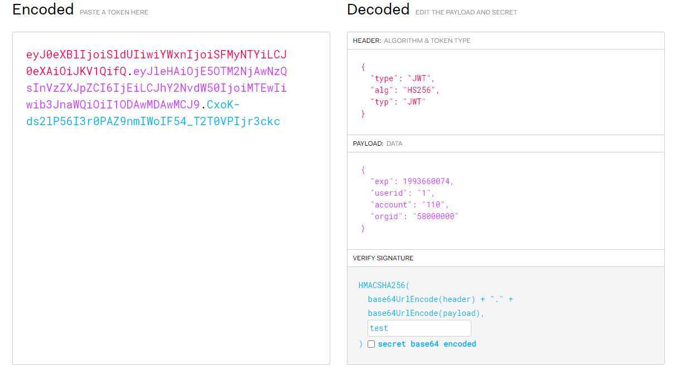

# 奇安信攻防社区-任意用户登录漏洞挖掘思路

### 任意用户登录漏洞挖掘思路

任意用户登录漏洞以利用漏洞利用难度低、危害高、奖金高已经成为src/众测漏洞挖掘中的香饽饽，本文将分享一下众测/src中任意用户登录漏洞的挖掘思路。

# 任意用户登录漏洞挖掘思路

## 前言

任意用户登录漏洞以利用漏洞利用难度低、危害高、奖金高已经成为src/众测漏洞挖掘中的香饽饽，本文将分享一下众测/src中任意用户登录漏洞的挖掘思路。

## 1.手机验证码问题导致的任意用户登录

### 1.1 验证码爆破

​ 当登录流程使用手机验证码登录，没有图片验证码/图片验证码可重用/图片验证码简单可识别（可以使用captcha-killer-modified插件）且后端没有限制手机验证码验证错误次数时，可以尝试爆破手机验证码登录其他用户。

​ 4位验证码的爆破老生常谈不再赘述；随着厂商们服务器性能的提高，服务器的rps的上升也使得6位验证码的爆破越来越快，可以使用如下方法爆破（！！！需留意服务器的rps以及测试厂商的注意事项，rps低的老系统或者厂商禁止批量爆破的项目谨慎使用6位验证码的爆破！！！）：

​ 使用burpsuite的Turbo Intruder插件，编写如下脚本：

```php
import re

def queueRequests(target, wordlists):
    engine = RequestEngine(endpoint=target.endpoint,
                           concurrentConnections=30,
                           requestsPerConnection=30,
                           pipeline=True
                           )

    for i in range(1000000):                            #生成六位验证码字典
        number = "{:06d}".format(i)
        engine.queue(target.req, number.rstrip())

def handleResponse(req, interesting):
    # currently available attributes are req.status, req.wordcount, req.length and req.response
    if req.status <404:
        '''res = re.findall('Msg":"(.*?)"',req.response)[0]    
        if len(res)>18:'''                              #六位数的验证码爆破结果展示列太多，可根据实际情况自行筛选展示
        table.add(req)
```

成功案例如下：


### 1.2 验证码明文返回

​ 获取手机验证码时，验证码直接在返回包里


### 1.3 存在万能验证码

​ 一般是测试为了功能测试方便，设置了诸如000000，123456（六位验证码爆破能发现）之类的万能验证码，项目上线时忘记下掉，导致任意用户登录

### 1.4 验证码未绑定用户

​ a.后端仅验证了验证码是否正确，没有验证验证码与获取手机号的对应关系，导致可以先输入自己的手机号A获取验证码，再输入他人手机号B获取验证码后，填写自己手机号A接收到的验证码，达到登录手机号B的目的

​ b.后端仅验证码了手机号与验证码是否一致，并未校验手机号是否为号主本人的,导致可以使用自己的手机号+验证码绕过。常见于用户绑定的功能处。举个栗子：

某系统输入商户号与手机号可绑定到该用户


通过用户注册的功能处，输入自己的手机号获取验证码


返回绑定功能处，输入任意验证码抓包，将手机号与验证码字段改为自己的手机号+验证码


成功登录他人账号


### 1.5 获取验证码的手机号字段可双写

​ 输入手机号获取验证码时抓包，双写手机号字段，使得两个手机号获取到同一个验证码，便可以登录其他用户


输入自己的手机号抓包，将手机字段后面加一个逗号或者分号后再加一个手机号，或者双写手机号字段phone=13333333333&phone=18888888888，当两个手机号均收到一个验证码时大概率漏洞存在。使用自己的手机号便可以任意登录其他手机号


### 1.6 验证码为空/任意验证码可成功验证

​ 比较奇葩的例子，验证码为空时，手机号正确则成功登录（账号密码登录体系也发现过这种情况，空密码的情况下账号存在即登录）

## 2.凭证安全问题导致的任意用户登录

### 2.1 凭证泄露

#### 2.1.1 页面缓存被搜索引擎抓取

​ 搜索引擎搜索该域名，发现有登录后的页面被抓取，直接访问登录目标账户


#### 2.1.2 httptrace/druid等组件中的凭证泄露

##### httptrace

​ spring的httptrace端点往往会记录用户的会话信息，若发现spring未授权访问且存在类似端点可以访问的话，可尝试获取用户凭证进行登录


##### durid

​ druid的session监控若发现有效的会话信息时，可以通过此登录任意用户，将druid的未授权中危漏洞提升至高危


#### 2.1.2 sessionkey泄露

​ 微信小程序官方提供了一套微信快捷登录的登录逻辑，用户授权手机号快捷登录时，会将本地的手机号使用sessionkey和iv进行aes加密，后端解密后返回该手机号的登录凭证。当sessionkey发生泄露时，攻击者便可以伪造手机号登录任意手机号


修改任意手机号，利用sessionkey和iv重新加密数据


成功登录他人账号


#### 2.1.3 其他接口中的信息泄露

这个一般发现于js或者api-docs中的某些特殊接口，例如getToken之类的，有没有取决于开发有没有开发类似的功能接口


### 2.2 凭证可伪造

#### 2.2.1 jwt未验参/弱密钥

系统使用jwt作为认证字段，且其中关键用户信息字段可以遍历时，若未验参或者使用弱密钥时，便可以将用户信息字段进行更改，删除/爆破弱密钥重新生成签名，到达任意用户登录

##### jwt未验参

删除签名部分(或者更改头部中的alg为none再删除签名)，访问登录后的接口成功访问，说明jwt未验参()


遍历data字段即可登录其他用户（此处的data为用户id）

##### jwt弱密钥

jwt使用了弱密钥时，爆破到弱密钥后同样修改jwt中的用户信息字段，使用密钥重新生成签名即可获取到其他用户的jwt字段




#### 2.2.2 弱cookie

系统使用cookie认证，且cookie字段可伪造


### 2.3 凭证过早返回

​ 一般正常的登录流程为服务端校验完用户身份后，返回用户凭证，但某些系统由于登录前会有很多的查询用户信息类的功能请求，经常导致在登录验证前就返回了用户凭证。

某金融项目，输入手机号会先去查询手机号是否为已注册用户，是的话进入用户信息查询的逻辑，再跳转登录。在信息查询的阶段过早返回了sessionid,导致任意用户登录


## 3.逻辑漏洞导致的任意用户登录

### 3.1 登录完全依赖数据包中的参数且参数可控

​ 最常规的任意用户登录漏洞，常见于两步/多步登录的登录逻辑处

​ 以两步登录为例，登录输入账号密码/手机号验证码/其他的凭证信息后第一个请求校验其正确性后，第二个请求根据后端返回的账号/手机号/用户id等字段去获取用户凭证的登录逻辑。

​ 只要修改第一个请求中的返回包或者修改第二个请求中的字段即可

#### 修改第一个请求的返回包

​ 当请求字段加密时，此方法非常便捷

​ 以下为例

​ 分析登录流程为，第一个请求请求微信接口获取用户手机号，返回到一个请求的返回包中

​ 第二个请求获取返回包中的手机号加密发给服务端，返回其登录凭证


所以此处只需要替换第一个请求包的返回包中的手机号即可


#### 修改第二个请求的请求包

如下登录数据包，直接更改其中手机号即可


### 3.2 更改登录type

部分系统有免密登录/快捷登录之类的功能，只要一个账号就能登录，当遇到登录数据包中含有type之类的字段时，可以尝试此方法


### 3.3 账号数据覆盖

常见于用账号信息更新处，例如修改手机号、账户重新绑定功能、修改账号等功能点处

以修改手机号为例，此处修改需要输入新手机号与新手机号的验证码


修改请求中的oldmobile字段为其他手机号，成功将其他用户的账户数据覆盖到新手机号中，达到任意用户登录
