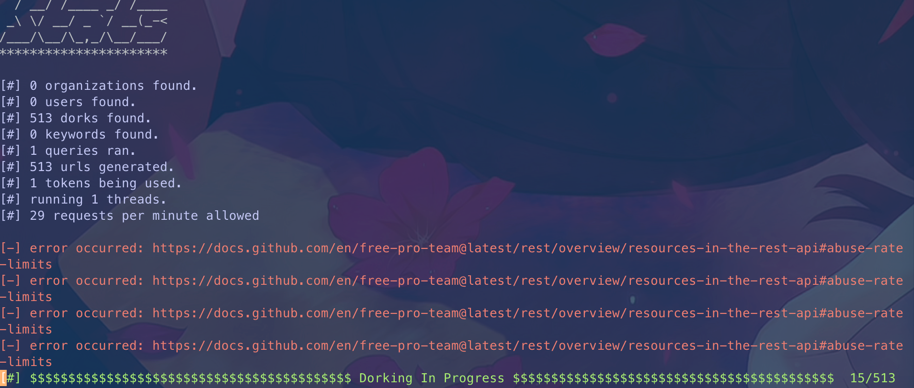
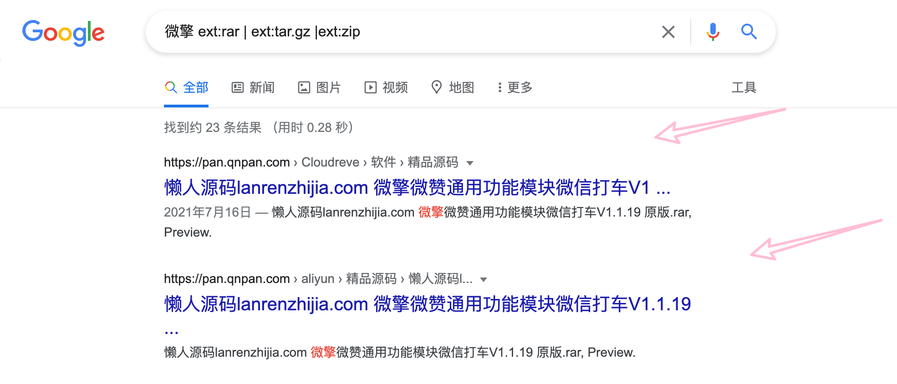
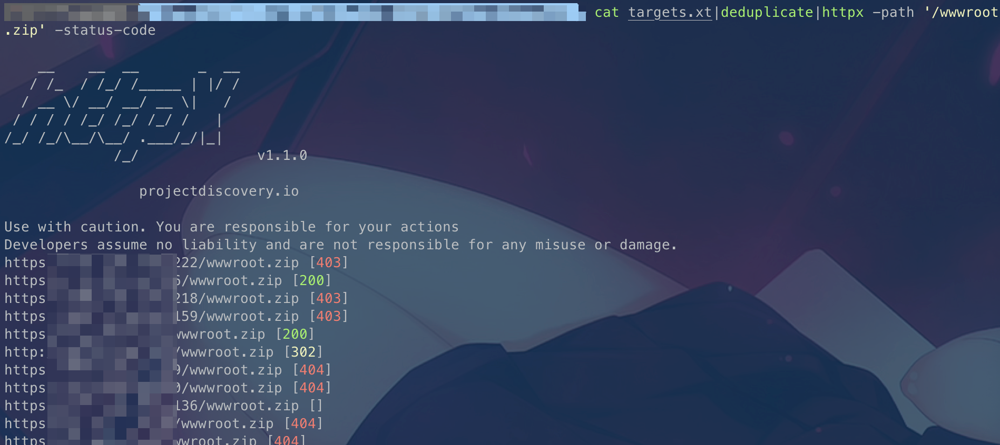
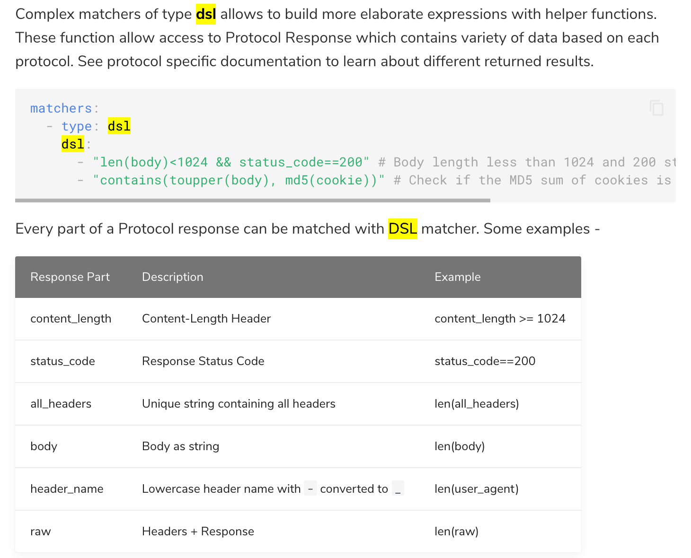
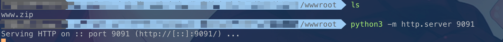
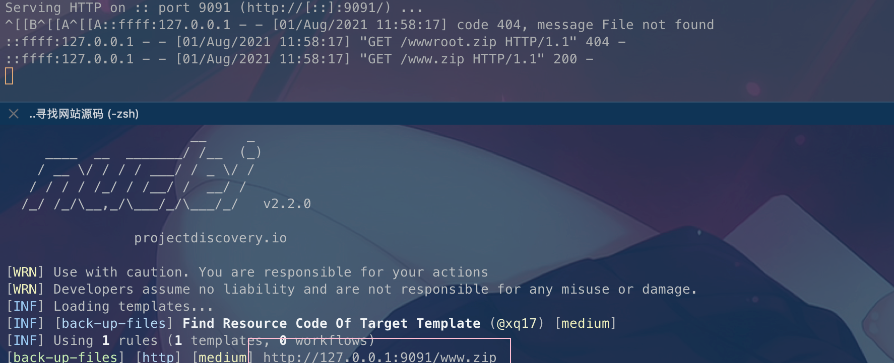
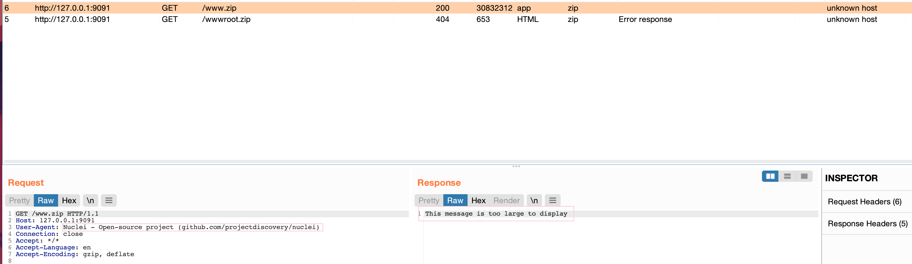

# 奇安信攻防社区-优雅地寻找网站源码(一)

### 优雅地寻找网站源码(一)

\# 优雅地寻找网站源码(一) ## 0x0 前言 ​ 渗透过程中如果能获取到网站的源代码，那么无疑开启了上帝视角。虽然之前出现过不少通过搜索引擎查找同类网站，然后批量扫备份的思路，但是却没...

# 优雅地寻找网站源码(一)

## 0x0 前言

​ 渗透过程中如果能获取到网站的源代码，那么无疑开启了上帝视角。虽然之前出现过不少通过搜索引擎查找同类网站，然后批量扫备份的思路，但是却没人分享其具体过程，这里笔者便整理了自己开发分布式扫描器的目录扫描模块的一些尝试的思路，同时分享一些寻找源码的其他手段，希望能给读者带来一些新的体验。

## 0x1 搜索技巧

### 0x1.1 代码托管平台

国外的github和国内的gitee都是第三方代码托管平台，通过一些搜索技巧，我们可以从中发现很多泄露的敏感信息，其中就包括一些程序的源代码。

这里笔者对码云平时用的不多，故对此只是简单提提，下面，则重点介绍github的用法:

> 学习这个用法就我个人而言最大的好处是，遇到返回大量数据的时候，可以根据一些特点来过滤掉一些垃圾数据。

Github的搜索页面:[https://github.com/search](https://github.com/search)

(1) quick cheat sheet

基础查询:

| This search | Finds repositories with… |
| --- | --- |
| cat stars:>100 | 查找star数目超过100的与cat相关的仓库 |
| user:defunkt | 找到defunkt用户的所有仓库 |
| tom location:"San Francisco, CA" | 查找位于"San Francisco, CA"的tom用户 |
| join extension:coffee | 在coffer后缀文件的代码中查找join的所有实例 |
| NOT cat | 排除所有包含cat的结果 |

搜索仓库:

| This search | Finds repositories with… |
| --- | --- |
| node.js forks:<200 | 查找所有forks少于200的node.js仓库 |
| jquery size:1024..4089 | 查找大小在1024-4089之间的jquery仓库 |

搜索代码:

| This search | Finds repositories with… |
| --- | --- |
| install repo:charles/privaterepo | 在charles/privaterepo仓库中搜索带有install的代码实例 |
| shogun user:heroku | 在heroku用户公开仓库查找shogun的引用 |
| system size:>1000 | 在大于1000kbs的代码文件中查找system实例 |
| examples path:/docs/ | 在/docs/路径中查找examples |
| replace fork:true | 在forks的源代码中查找replace |

搜索用户:

| This search | Finds repositories with… |
| --- | --- |
| fullname:"Linus Torvalds" | 查找 "Linus Torvalds" 用户. (用户名非账户名) |
| chris followers:100..200 | 查找follower数目在100-200的chris用户 |
| ryan repos:>10 | 查找仓库数目大于10的ryan用户s |

(2)个人查询Dork

```php
filename:config.php dbpasswd
filename:.bashrc password
shodan_api_key language:python
path:sites datab ases password
"baidu.com" ssh language:yaml
filename:file.php admin in:path
org:companyname "AWS_ACCESS_KEY_ID:"
```

(3)针对某个关键词查询

用双引号括起来,如`"qq.com"`

(4)可以使用GitDorker来自定义dork，实现自动化查询。

```php
git clone https://github.com/obheda12/GitDorker.git
cd GitDorker
docker build -t gitdorker .
docker run -it gitdorker
docker run -it -v $(pwd)/tf:/tf gitdorker -tf tf/TOKENSFILE -q tesla.com -d dorks/DORKFILE -o tesla
docker run -it -v $(pwd)/tf:/tf xshuden/gitdorker -tf tf/TOKENSFILE -q tesla.com -d dorks/DORKFILE -o tesla
```

免安装使用:

```php
python3 GitDorker.py -tf ./TF/TOKENSFILE -q ximalaya.com -d ./Dorks/alldorksv3 -o x mly
```



参考:

[https://github.com/techgaun/github-dorks](https://github.com/techgaun/github-dorks)

[https://infosecwriteups.com/github-dork-553b7b84bcf4](https://infosecwriteups.com/github-dork-553b7b84bcf4)

### 0x1.2 搜索引擎

Google:

```php
XX源码
XX完整包
xx安装程序
xx备份
xx代码
xx开源
xx源程序
xx框架
xx ext:rar | ext:tar.gz |ext:zip
```



### 0x1.3 网盘搜索

[https://www.feifeipan.com/](https://www.feifeipan.com/)

[https://www.dalipan.com/](https://www.dalipan.com/)

[https://www.chaonengsou.com/](https://www.chaonengsou.com/) 这个网站做了个集合，比较全。


## 0x2 曲线思路

​ 如果如0x1所述，依然没办法找到源码，说明目标系统是那种小众或者商业类型的，导致没有在互联网流传广泛，故没办法搜索到。

​ 这个时候，我们便可以采用曲线思路，通过寻找本网站根目录下的备份文件，源代码包进行下载，如果仍然没有找到，则去寻找同套系统的其他网站，扫描这些网站目录下的备份文件和源代码包，从而获取到系统源码。

​ 我们不能做思想上的巨人，行动上的矮子，那么如何高效地完成这一过程呢? 可以划分为下面几个步骤来完成。

### 0x2.1 提取特征

关于特征，重点收集主页特征，即直接访问域名显示的页面，因为主页是最容易被搜索引擎爬虫爬到的，次之，则是收集主页可访问到的其他标志性页面特征。

(1) logo 特征

请求favicon.ico获取hash


(2) 关键词特征

网站title、网站版权信息、j avas cript关键字信息、html源码结构信息、http返回头特征。

### 0x2.2 资产收集

关于资产收集，除了调度自己写的脚本集成fofa,shodan,zoomeye三个平台之外，我还很喜欢使用一个工具，因为它的功能比较丰富且运行也较为稳定-----fofaviewer。

下载地址:[https://github.com/wgpsec/fofa\_viewer](https://github.com/wgpsec/fofa_viewer)


### 0x2.3 简单fuzz

收集到资产之后，前期，我喜欢用httpx进行一些路径的简单探测

`cat targets.xt|deduplicate|httpx -path '/wwwroot.zip' -status-code`



相当于做一层简单的过滤，来帮助nuclei减少请求的量。

### 0x2.4 编写nuclei插件

阅读和学习编写插件的官方文档:[Guide](https://nuclei.projectdiscovery.io/templating-guide/)可知:

**编写插件第一步: 插件信息**

新建`back-up-files.yaml`文件，写入如下内容

参考:[https://nuclei.projectdiscovery.io/templating-guide/#template-detail](https://nuclei.projectdiscovery.io/templating-guide/#template-detail) 可知

id是必须的，不能包含空格，一般与文件名相同

info区域是动态的，除了**name**, **author**, **des cription**, **severity** and **tags**，也可以添加其他`key:value`，tags是支持用于nuclei检索调用的，可参照同类插件来写。

```yaml
id: back-up-files

info:
  name: Find Resource Code Of Target Template
  author: xq17
  severity: medium
  tags: exposure,backup
```

**编写插件的第二步:发送请求**

参考:[https://nuclei.projectdiscovery.io/templating-guide/protocols/http/](https://nuclei.projectdiscovery.io/templating-guide/protocols/http/) 可知

> 1.HTTP Requests start with a `request` block which specifies the start of the requests for the template.
> 
> 2.Request method can be **GET**, **POST**, **PUT**, **DELETE**, etc depending on the needs.
> 
> 3.Redirection conditions can be specified per each template. By default, redirects are not followed. However, if desired, they can be enabled with `redirects: true` in request d etails.
> 
> 4.The next part of the requests is the **path** of the request path. Dynamic variables can be placed in the path to modify its behavior on runtime.
> 
> Variables start with `{{` and end with `}}` and are case-sensitive.
> 
> **{{b aseURL}}** - This will replace on runtime in the request by the original URL as specified in the target file.
> 
> **{{Hostname}}** - Hostname variable is replaced by the hostname of the target on runtime.
> 
> 5.Headers can also be specified to be sent along with the requests. Headers are placed in form of key/value pairs. An example header configuration looks like this:
> 
> ```yaml
> # headers contains the headers for the request
> headers:
>  # Custom user-agent header
>  User-Agent: Some-Random-User-Agent
>  # Custom request origin
>  Origin: https://google.com
> ```
> 
> 6.Body specifies a body to be sent along with the request. (发送POST包需要用到)
> 
> 7.To maintain cookie b ased browser like session between multiple requests, you can simply use `cookie-reuse: true` in your template, Useful in cases where you want to maintain session between series of request to complete the exploit chain and to perform authenticated scans.(Session重用，作用是串联攻击链，实现登录验证再攻击)
> 
> ```yaml
> # cookie-reuse accepts boolean input and false as default
> cookie-reuse: true
> ```
> 
> 8.Request condition allows to check for condition between multiple requests for writing complex checks and exploits involving multiple HTTP request to complete the exploit chain.
> 
> with DSL matcher, it can be utilized by adding `req-condition: true` and numbers as suffix with respective attributes, `status_code_1`, `status_code_3`, and`body_2` for example.(编写复杂攻击链)
> 
> ```php
>   req-condition: true
>    matchers:
>      - type: dsl
>        dsl:
>          - "status_code_1 == 404 && status_code_2 == 200 && contains((body_2), 'secret_string')"
> ```
> 
> ...还有许多高级用法比如支持raw http，race之类的，但是这里用不上，文档这个东西，够用就行。

```yaml
requests:
  - method: GET
    path:
    - "{{b aseURL}}/wwwroot.zip"
    - "{{b aseURL}}/www.zip"
```

**编写插件的第三步: 判断返回内容**

参考:[https://nuclei.projectdiscovery.io/templating-guide/operators/matchers/](https://nuclei.projectdiscovery.io/templating-guide/operators/matchers/) 知

> Multiple matchers can be specified in a request. There are basically 6 types of matchers:
> 
> status(状态码) size(返回包大小) word(字符串) regex(正则匹配) binary(二进制文件)
> 
> 还有一个dsl，高度自定义验证返回内容，可以对返回内容做一些操作(这里暂时用不上)
> 
> 
> 
> 可用的辅助函数: [https://nuclei.projectdiscovery.io/templating-guide/helper-functions/](https://nuclei.projectdiscovery.io/templating-guide/helper-functions/),
> 
> 对于`words and regexes`,可以对返回内容的多个匹配条件用`AND`或`OR`进行组合。
> 
> Multiple words and regexes can be specified in a single matcher and can be configured with different conditions like **AND** and **OR**
> 
> 可以对返回的包，选定match的区域，默认是`body`，也支持选择`header`等任意地方。
> 
> Multiple parts of the response can also be matched for the request, default matched part is `body` if not defined.
> 
> 支持对条件取反，这个就是反证法的妙处了。
> 
> All types of matchers also support negative conditions, mostly useful when you look for a match with an exclusions. This can be used by adding `negative: true` in the **matchers** block.
> 
> 支持使用多个matchers
> 
> Multiple matchers can be used in a single template to fingerprint multiple conditions with a single request.
> 
> 支持`matchers-condition`
> 
> While using multiple matchers the default condition is to follow OR operation in between all the matchers, AND operation can be used to make sure return the result if all matchers returns true.

结合上面文档的介绍，可以写入如下的判断。

```yaml
    matchers-condition: and
    matchers:
      - type: binary
        binary:
          - "504B0304"  # zip
        part: body
      - type: dsl
        dsl:
          - "len(body)>0"
      - type: status
        status:
          - 200
```

**编写插件的第四步: 链接起各个部分**

上面的代码内容按顺序链接起来，则是如下:

```yaml
id: back-up-files

info:
  name: Find Resource Code Of Target Template
  author: xq17
  severity: medium
  tags: exposure,backup

requests:
  - method: GET
    path:
    - "{{b aseURL}}/wwwroot.zip"
    - "{{b aseURL}}/www.zip"
    matchers-condition: and
    matchers:
      - type: binary
        binary:
          - "504B0304"  # zip
        part: body
      - type: dsl
        dsl:
          - "len(body)>0"
      - type: status
        status:
          - 200
```

### 0x2.5 测试插件

本地起一个靶机，进行调试:

```bash
python3 -m http.server 9091
```



然后调试:

```php
echo 'http://127.0.0.1:9091' | nuclei -t back-up-files.yaml -debug -timeout 2 -stats -proxy-url http://127.0.0.1:8080/
```



发包过程:



可以看到nuclei应用上插件之后，可以快速Fuzz出网站备份文件。

## 0x3 总结

​ 第一篇主要是介绍了一些思路和nuclei插件编写简单思路，用于帮助新手快速入门，第二篇则是关于如何增强该插件，增加扫描目录列表，更精确的判断返回值等内容(这里建议读者，可以先自行阅读下nuclei-template的文档，这样学习效果更佳!),第三篇则是运用前两篇的知识点和增强型插件，来完成一次真实的寻找网站源码之旅。
