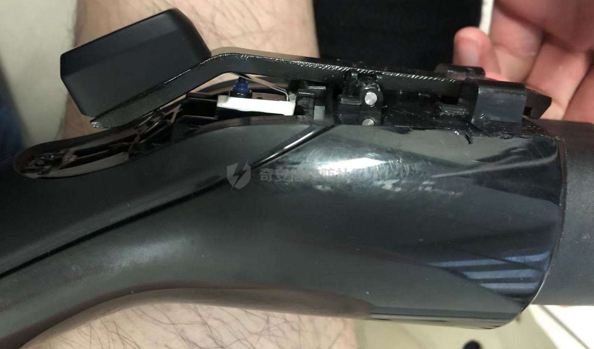
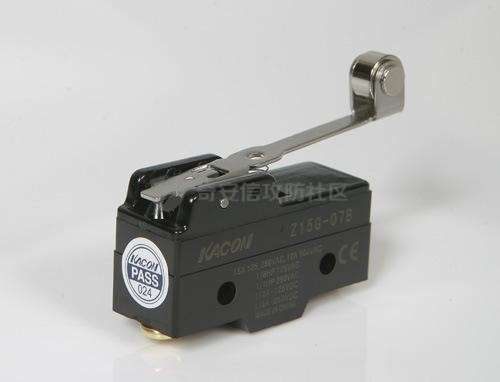
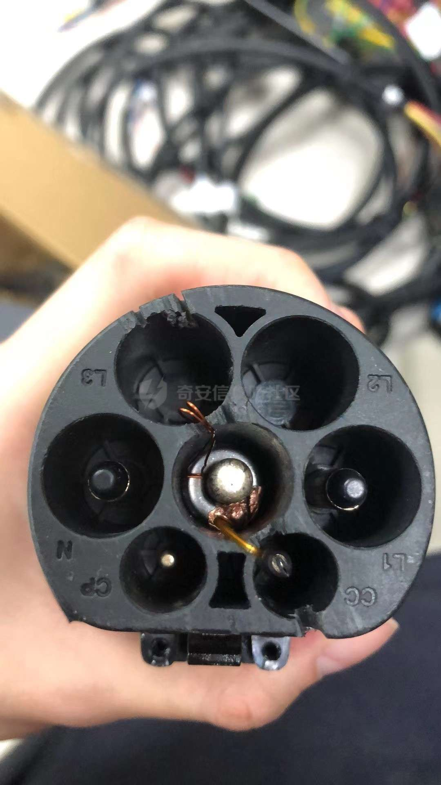

# 奇安信攻防社区-充电枪勒索攻击

### 充电枪勒索攻击

本文章中所提及的技术以及方法汇总于以本文作者为共同一作发表于NDSS2023--VehicleSec2023 会议上Demo，在本文中作者提出了在会议上没有展示的新技术。Demo文章链接：https://dx.doi.org/10.14722/vehiclesec.2023.23024

# 充电枪勒索攻击

## Introduction

相信大家对勒索攻击并不陌生，勒索这个词语出现在几千年以前，可能从土匪、强盗诞生的那一刻起，便有了勒索的这个词。经过几千年的发展，直到我们进入了21世纪，勒索变得形势更加多样了。在网络领域中的勒索攻击，大家可能比较熟悉的是电脑上的勒索软件···勒索攻击在车联网安全领域，各位也可能比较熟悉的是针对车辆操作系统的“锁车”攻击软件。  
今天，在本文中我给大家带来一种新的车联网安全勒索攻击技术，这种技术包含软件以及硬件——通过智能电车的充电桩实现勒索攻击。

## Motivation

因为近一段时间以来各大企业加大了在智能电车领域的投入，市场中涌现出来了越来越多的智能电车，电车已经逐渐从代步工具变成人们生活、享受的地方。为此，车联网安全也逐渐被各大厂商以及安全公司重视起来，我们实验室可以说是紧跟时代脚步，将目光着眼于车联网安全，想寻找一些漏洞汇报给相关厂商以帮助他们及时做出补丁以及修改，提高行业整体安全水平。  
说起来理想是宏伟的，真正开始漏洞挖掘，我们便发现在智能汽车上挖漏洞并不容易。相比于IOT漏洞或者传统Web领域漏洞来说，“挖洞”成本大大增加了，对于个人希望找到智能网联汽车相关的漏洞需要先自行完成测试“靶场”的架设，翻译一下就是需要我们自行采购一套设备lol 一辆汽车？？？可能成本有点过于高昂，可能这也就是为什么豪车被报的漏洞数量少于相较成本低一些的汽车的根本原因。戏谑地讲，相信各位要是可以搞到战斗机、火箭，甚至是火星探测车···这些设备的漏洞不一定比我们日常生活中可以接触到的设备安全。  
加之车辆的固件相对于IOT设备的固件来说获取更加困难，车辆自身系统也更加封闭，我们可以获取到的攻击面直接就被限制成了屈指可数的那几个。不过，好在对车联网安全目前的研究还没有像其他领域那样的成熟，为此，我们还是可以从现在开始涉足这个领域，并得到一些还可以的研究成果的。  
扯远了，讲一下我们为什么要选择充电桩来挖掘漏洞呢？我们通过对智能电车的攻击面进行分析得到了下面的这张车联网安全攻击全景图：（针对主流以及顶会论文的提及技术的汇总）

其中，我们不难发现很多针对智能电车的攻击，是通过无线信号开展的，包括Wi-Fi、蓝牙、射频，目前只有充电桩是智能电车与外界唯一的有线连接端口，尚未有很多研究者涉足；同时，我们发现这个接口不管是对高级豪车，还是对普通的智能电车来说都是不可或缺的一部分（电车是需要充电维持的）。因此，我们觉得如果可以找到充电桩的漏洞，并成功加以利用，那么这个技术（或攻击场景）将可以对全智能电车行业产生威胁，而不囿于某一款车型，某一种电车操作系统。  
实话讲，“挖”到这种漏洞所带来的成就感，还是有些不同的。基于充电桩通信协议上的漏洞，实现一种所谓“通杀”的效果，相比于仅仅针对某一款车、某一种操作系统的攻击要有意思一些。

## CPRA

充电桩的固件相对于汽车固件来讲几乎是在网上直接获取不到的，固件的体量相对于车辆具有操作系统的固件要小很多。厂商没有必要也不能公开（有可能会被快速复刻），无论是假装以任何身份试图通过销售等人员获取都还是比较麻烦的。为此，我们放弃了社会工程学，想着利用技术手段自行得到固件。  
感谢实验室导师的支持，我们直接采购了相关品牌的充电桩，通过对买回来的充电桩进行拆解、MCU提取、固件逆向等手段，我们得到了充电桩RTOS系统的代码。再通过逆向工程技术，了解到了充电桩与主站沟通时所使用的协议，再协议中我们发现整个通信缺少必要的认证漏洞（伪造通信的基础）。在此基础上，我们通过伪造报文的方法成功模拟了充电桩与服务器主站的通信流程。也就是任何人在了解充电桩通信报文的格式后都可以伪造身份与主站进行通信，向主站发送错误的状态报文，使得后台服务器在用户的手机终端上得到错误的充电桩状态。不仅如此，因为错误状态报文的发送，服务器主站还会终止真正的充电桩以及用户手机终端正在进行的进程···  
我们将此技术命名为**Charging Pile Ransom Attack(CPRA)**，即充电桩勒索攻击。据我们所知，这项技术是最先公开的充电桩勒索攻击技术。这个技术有3个层面的意义，对电车用户、对充电桩厂商以及对智能电车充电站整个行业。我们可以使用CPRA 停掉正在使用充电桩充电的车主，威胁到了车主的正常使用；进而，我们还可以伪造状态报文实现任意充电桩（存在漏洞）的免费充电效果，影响了充电桩厂商；最终，CPRA勒索攻击不挑选车型，所有使用（存在漏洞）充电桩充电的车辆都有可能成为被勒索的对象，降低了用于使用对应充电桩的信任程度。  
当然，我们的目的不是勒索本身，而是希望通过一系列场景让厂商了解到危害性，进而做出修正。

### 攻击前提条件

假设攻击者已经通过逆向微控制器(MCU)固件获得了充电桩应用层协议的消息格式以及弱身份验证漏洞。进而，攻击者可以假装成目标充电桩，通过网络与服务器进行通信，使目标充电桩停止工作。  
同时讲一下供电的安全注意事项：在安全的充电过程，不允许车辆断开充电连接器。研究发现有一些车辆的充电枪在充电过程中与车辆会处于一种死锁状态，直到充电桩停止充电（车辆充电口会弹出卡扣）；而有一些相对功能更加丰富的车辆一旦检测到外界想拔除充电连接器就会接触死锁（这一类车辆我们特意研制了物理插件来保障勒索攻击的成功，后续会讲）。强制断开连接，例如剪断电缆，可能会导致电击风险，而损坏公共充电桩可能会引发法律纠纷。

**攻击目标**  
使正常充电的电动汽车用户无法停止充电进程或离开充电桩桩，除非受害者向攻击者支付赎金。

### 攻击过程

#### 常规CPRA

CPRA过程如下图所示：

（1）停用攻击：攻击者向服务器发送虚假状态报文，将目标充电桩的服务器端状态更改为离线，从而取消App上受害者的充电订单，然后攻击者停止停用攻击。这一步目的是断开车主对车辆的控制。  
（2）在充电桩恢复在线状态后，攻击者启动一个新订单来接管充电过程。与此同时攻击者可选择使用脚本向充电桩服务器发送伪造的心跳包，这样攻击者就可以不花费一分钱控制车辆的充电进程了。接管充电进程之后，用户将无法使用充电桩app再主动停止或解锁。  
（3）之后，攻击者通过App上的通信渠道（app预留的车友交流对话框）匿名发送赎金信息给受害者。抓取报文中cookie，便可以构造任意勒索短信。  
（4）受害者看到短信，直到赎金被支付。攻击者才会停止充电过程、并告知解锁方法，放车辆离开。

实验证实，我们的CPRA攻击场景对大众ID.4以及中国的大部分公共第三方充电桩，包括TELD和Starcharge，都是有效的。  
对于大众ID4这个车型来说，强行在充电过程中拔枪会造成充电枪死锁，充电口会亮红灯，是拔不下来的。这种死锁状态保障CPRA的成功性。

#### CPRA & 物理插件

不过，在我们的实验中，我们发现有一些车型，比方Tesla、荣威等品牌，用户可以随时在车辆充电的过程中将充电枪把下来。没有上述充电进程中的死锁机制，这使得我们的CPRA不会对Tesla、荣威这一系列的车型产生相应影响。  
为此，我们便开始了硬件设备的“逆向”工作，为了研究出为什么上述车型可以在充电过程拔出充电枪，而不是“死锁”的原因。

**充电枪结构**  
首先看一下市面上慢冲枪的结构：  
  
这种慢冲枪的型号属于中国国标充电枪（GB/T），这种充电枪在枪口处有7个凹槽，但只有5个凹槽是存在功能的，分别是CC、CP、L、N和PE线，如下图：  
  
其中L、N和PE线属于能源部分，主要是给电车传输能源的,这个我们先不关注。我们主要关注一下CC（Charging Confirmation）和CP(Control Pilot)两根线的功能，看看可不可以在这两根线上做一些“文章”。  
机缘巧合我们在实验过程中，通过反复按压充电枪上的开关，时常能听到“咔哒、咔哒”的声音，为此我们对充电枪进行了拆解，如下图：  
  
发现了为什么像Tesla这类车用户可以在充电过程中，直接把充电枪拔出来的根本原因。“咔哒”的声音来源于充电枪物理开关下的行程开关。什么是行程开关呢？来看一下下面这张图：  
  
当我们把行程开关上面的按钮按下去之后这个开关会闭合，松开之后开关会闭合。那么让我们看一下这个行程开关所在电路图的样子：  
  
可以看到CC线到地线，也就是PE线，就是一个简单的电阻电路。当我们按下充电枪的开关之后会带动行程开关闭合，进而使开关把两个串联电阻的其中一个电阻“短路”了。  
CC线电路信号在用户按压充电枪上的开关之后发生变化，而Tesla在充电过程中会检测CC线信号，一旦车辆检测到CC线“异常”出于保护用户的考虑会自行中断充电进程，而停止充电的信号则是通过另一根CP信号线向充电桩传输的。一方面车辆解除了对充电枪的“锁”，另一方面充电桩停止了充电，用户便可以拔枪。下图展示的是车辆充电状态的转台变化图：  
  
一旦检测CC线阻抗对应不是220Ω，车辆便会弹回充电口处的“锁”，释放充电枪。

**CC信号欺骗攻击**  
我们发现一些电动汽车型号，例如荣威RX5和特斯拉Model S，通过检测充电连接器的充电确认（CC）信号来控制接口的死锁状态，具体是通过检测该路径的电路阻抗。  
下面是死锁状态车辆充电口的样子：  
  
当按下充电连接器上的开关时，CC信号会发生变化，这类电动汽车会退出死锁状态。为了使我们的CPRA对这些型号有效，我们设计了一个隐藏的物理插件，这款插件可以在不影响正常充电功能的同时安装在充电枪上，起到欺骗电车充电接口接收信号的作用。换句话说，这个物理插件通过固定CC电路阻抗来使充电枪上的开关失效，即这些电动汽车尽管可以通过检测CC信号，但由于CC信号不发生任何变化，进而车辆充电口也无法解锁死锁状态。  
  
上述“物理插件”如上图所示，该插件由金属环、特殊电缆和绝缘套管组成。电缆设计有特定的电阻（例如GB/T交流充电枪阻抗是220Ω），用于保持CC信号的恒定。这种插件安装在正常的充电枪上既不影响充电桩的正常功能，并且在外部看不到。实验证明，这个插件对前面提到的电动汽车型号是有效的。  
组装到充电枪上之后：  
  
在充电枪外侧是看不到的，保障了隐蔽性。

**实验结果**

|     | CPRA 成功影响车型 |
| --- | --- |
| 常规情况 | 大众ID 4 |
| 安装物理插件后 | Tesla model S & 荣威 rx5 |

**存在上述利用漏洞的充电桩品牌**：特来电充电桩 & 星星充电充电桩

下图展示的是勒索信息发送以及在用户支付赎金之后解锁之后的状态：  

**PWM 信号“劫持”**  
除了“CC信号线欺骗攻击”，通过研究我们也发现CP线负责控制充电功率的大小。通俗来讲，充电桩与智能电车之间先是利用CC线信号明确二者的连接情况，再通过CP线传输PWM信号来调节充电桩的功率输出，即在保障电池温度的情况下，在电池电量处于低点时车辆向充电桩传输占空比大的PWM信号，使充电桩输出功率增加；在电池即将充满的时候，向充电桩传输占空比小的PWM信号以减缓充电速率。

上图的树莓派Pico 便可以完成PWM信号生产，然而实际情况要使用体积更小一些的MCU以及自行设计PCB（充电枪没有那么大的改造空间）。  
基于上述条件以及CPRA攻击场景，我们不难想到一种进阶攻击场景——智能电车的车主正常把车停在充电站（存在漏洞），正常开始给自己的电车充电，期待第二天早上可以驾驶一辆充满电的电车去上班。这时我们通过进入充电站后台，看到了车主的信息，了解到目标充电桩的序列号（ID）。攻击者通过运行自己的EXP脚本，向充电桩后台服务器发送“错误”状态报文终止用户正在进行的充电进程；再用另一个账户开始另一端充电进程，让智能电车的充电状态脱离车主的控制。  
我们不光改变CC线路同时也对CP线电路进行修改。具体而言，就是除了加上我们用于“欺骗”CC信号的物理插件之外，还要利用MCU和射频芯片组成的遥控PWM波生成器来代替车辆真正的CP线信号与充电桩通信，使充电效率一直处于最低点（或为0）。这样第二天一早车主不仅看到自己的电车被“锁住”同时电量只充上了一点。车主便仅能在绝望中度过这样一个早上了。  
不过对于攻击者来说设计一款电路，既可以“欺骗”CC信号，又可以生成虚假PWM还是比较困难的。因为充电枪预留给攻击者可以改动的空间几乎为零。目前，我们的设计也是在原有充电枪上套上我们的改造电路。相比于正常的充电枪我们的充电枪要长一些，不过也可以成功地插在车上实现充电的功能。但是距离实际攻击来说还是需要进一步研究改进的。

## Discussion

**伦理考虑**  
我们已经向GeekPwn竞赛组委会报告了这类公共充电桩的漏洞，并上报了CNVD获得了漏洞编号。所有经过测试的电动汽车都是作者所拥有的，我们的测试没有影响任何其他用户。

**固件提取**  
我们获取充电桩固件的方式比较直接且暴力。选择直接将充电桩拆开，手动使用热风枪将设备的MCU吹下来，进行固件提取。实际情况是，MCU上虽然会预留一些调试烧录口我们可以通过飞线的方式使用Jtag/SWD将固件读取出来，不过，“针线活”还是需要一些技巧的，我们发现针对不同的MCU，如144pin等封装等芯片还是直接吹下来购置对应的芯片烧录座，再使用Jtag/SWD或ST意法公司的烧录器来的更加稳妥、可靠。提取固件之后就是逆向工程，需要多多练习。

## Future Plan

相信各位从我上面的介绍中对于车联网安全有了一些新的认识、新的研究想法。对于充电桩的研究还有很多方面可以深入去了解、研究，本文仅仅起到“抛砖引玉”的作用。对于RTOS系统需要实时处理数据做出快速的反应，相对于其他操作系统来说使用密钥的patch方案可能需要再想一下。不过，我们已经把这个漏洞汇报给了相关厂商相信厂商一定会针对漏洞提出一些修改方案的。  
对demo感兴趣的朋友，我们提供了视频演示（1）CPRA的过程和（2）物理插件在我们的YouTube频道上，具体详情可以访问[https://github.com/Moriartysherry/ransom](https://github.com/Moriartysherry/ransom)

**参考文献：**  
\[1\]M.Wolf,R.Lambert,T.Enderle,andA.Schmidt,“Wannadrive?feasible attack paths and effective protection against ransomware in modern vehicles,” in Proc. ESCAR Europe, 2017.
