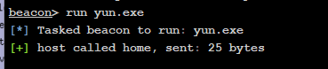
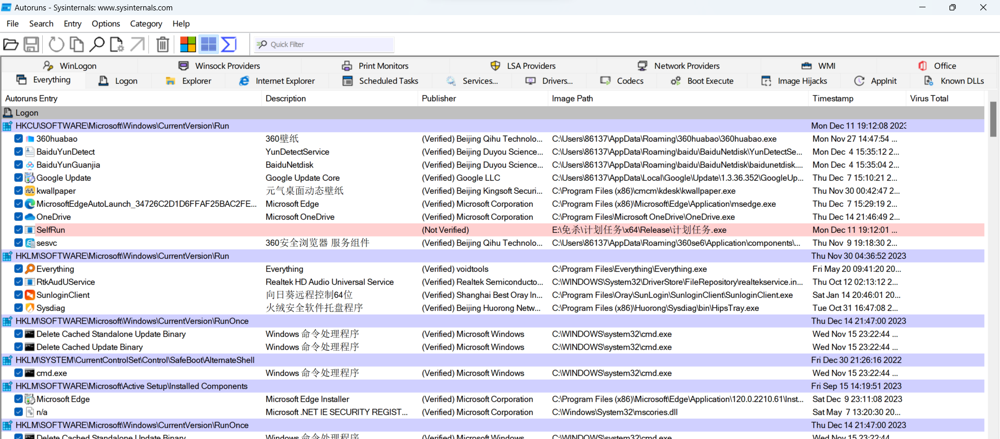

# 奇安信攻防社区-基于被钓鱼主机的快速应急响应

### 基于被钓鱼主机的快速应急响应

作者:凝 前言 对于linux而言,除了rootkit,大部分的后门均可以使用工具快速排查,但是对于被钓鱼的终端,我们却很难进行有效排查,因此写这篇文章分享一下自己对于windows操作系统应急响应的一些看...

作者:凝

前言

对于linux而言,除了rootkit,大部分的后门均可以使用工具快速排查,但是对于被钓鱼的终端,我们却很难进行有效排查,因此写这篇文章分享一下自己对于windows操作系统应急响应的一些看法和心得

首先说钓鱼,钓鱼无异于是进入内网最便捷有效的一种方式

一般来说,一个合格的木马是具备权限维持的一些功能,即添加计划任务或者自启动等等,这也为我们的应急响应增添了不少的难度

实验木马:

cs的免杀马+添加自启动


我们运行改exe程序-->弹框 同时cs上线


接下来我们假装什么都不知道,对该电脑进行应急响应

#### 任务资源管理器

我们先说传统的一些套路,通过任务资源管理器查看


可以看到,在我们不进行操作的情况下,我们的恶意exe文件在任务资源管理器中几乎是难以发觉的

这里我仔细翻找了一下


但是想要在上百台机器中去定位他还是很有难度的,首先是任务资源管理器的不断跳到,其次上百上千个进程中,我们很难快速去定位到一个有问题的exe程序

#### 我们再说netstat -ano

这里截取部分,还是有很多外联


这里我们可以借助工具快速分析


同时我们可以提取IP,然后丢人威胁情报平台判断是否有恶意ip,然后去定位恶意程序


#### TCPview

接下来介绍一下TCPview,一款非常好用的工具


双击即可运行

Process name：应用名称。

Process id：顾名思义是pid，代表进程ID。

Protocol：协议，分别是TCP或UDP。

State：状态。

Local Address：本地地址。

Local port：本地端口。

Remote address：远程地址。

Remote port：远程端口。

Create time：创建时间。

Module name：模块名。


可以看到效果非常的明显

比如说,我在这台PC端中找到了一个域管或者域用户的进程,我对其进行进程注入,就可以获取其凭证,这里我以lsass文件为例

提权之后我注入lsass进程


此时我们再通过TCPview进行分析

同时需要注意的是,cs的心跳特性,也就是sleep设置,在没有派发任务时是不会有外联提示的


除此之外,在选定进程后,我们可以强制kill


#### 火绒剑分析外连


#### 进程链分析工具-Process Explorer

对于一个正常的exe来说,他的父进程应该是explort,但是当我们的exe上线后我们去执行一些命令

以cs为例,cs有两种方式:一种是shell 一种是run

首先我们要明白,shell走的是fork&run的方式,在360晶核环境下可能直接死

而run方法则是在beacon内执行,缺点也很明显,如果run执行崩溃会导致

比如说我使用

shell whoami

他的调用链则是:QQ音乐补丁包.exe-->cmd.exe-->whoami.exe

因此实战中我们要避免shell的使用

比如说我这里用QQ音乐补丁包.exe去执行一个yun.exe



然后我们使用工具去分析

Process Explorer

可以看到最上方的父进程都是explorer.exe

然后是我们的QQ音乐补丁包.exe,其子进程是yun.exe


在真实环境中,我们一样可以通过分析恶意的进程调用链去定位可以的exe程序

#### 启动项分析

首先是用户层的自启动

```php
\HKEY_CURRENT_USER\Software\Microsoft\Windows\CurrentVersion\Run
\HKEY_CURRENT_USER\Software\Microsoft\Windows\CurrentVersion\RunOnce
```

系统层面

```php
\HKEY_LOCAL_MACHINE\SOFTWARE\Microsoft\Windows\CurrentVersion\Run
\HKEY_LOCAL_MACHINE\SOFTWARE\Microsoft\Windows\CurrentVersion\RunOnce
\HKEY_LOCAL_MACHINE\SOFTWARE\WOW6432Node\Microsoft\Windows\CurrentVersion\Run\HKEY_LOCAL_MACHINE\SOFTWARE\WOW6432Node\Microsoft\Windows\CurrentVersion\RunOnce
```

#### AutoRuns-启动项分析工具



我们可以很明显的看到标红的地方-->这里讲恶意的exe改名成了计划任务


#### 火绒剑

火绒剑也是分析启动项很好用的一款工具


#### 计划任务查杀思路

计划任务这个概念我们都不陌生,首推的就是这款


我们勾选计划任务然后开始采集


很有利于我们的快速分析

以上也是个人在实际被钓鱼下的应急响应中不断思考形成的自己的一些应急思路,希望能给各位一些帮助
