# 奇安信攻防社区-微软产品里的‘小惊喜’：两个有趣漏洞浅析

### 微软产品里的‘小惊喜’：两个有趣漏洞浅析

最近，微软更新了一批安全补丁。其中CVE-2023-36563（Microsoft WordPad Information Disclosure Vulnerability）和CVE-2023-24955（Microsoft SharePoint Server Remote Code Execution Vulner...

最近，微软更新了一批安全补丁。其中CVE-2023-36563（Microsoft WordPad Information Disclosure Vulnerability）和CVE-2023-24955（Microsoft SharePoint Server Remote Code Execution Vulnerability）比较有意思，现将国内外的一些研究成果汇总一下，看看如何从微软严苛的SDL中带着镣铐跳舞。

# Bindiff一下 你就知道

对最近爆出的nDay漏洞进行分析时，对更新补丁进行差异化分析是非常有效的技术手法，常见的工具便是Bindiff和IDA Pro。由于微软的安全补丁描述中阐述了该漏洞会导致NTLM Hash的泄漏，可以管中窥豹得出该漏洞可能和SMB请求或者UNC路径有关联。


另外，由于该补丁作用于WordPad程序，可得该漏洞的触发点可能与RTF文件的格式有关，思路有了就开始进行技术分析。

打补丁之前的MD5:bd05d1b9fba2f5f\*\*b6fbb59d3a78d84

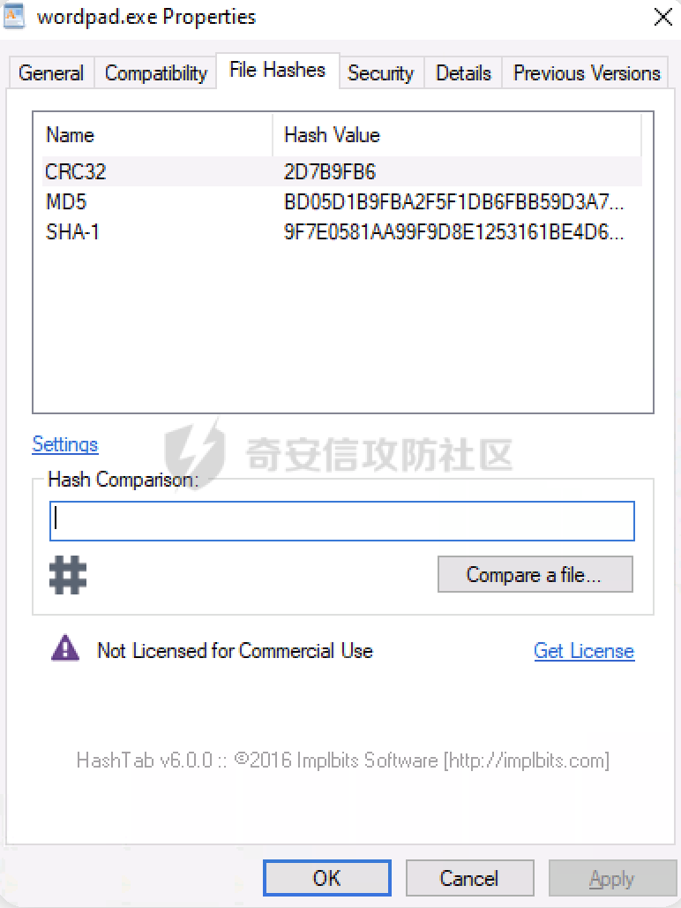

打补丁之后的MD5:e46d2a1e4836b\*\*d00eeccc0e1db0f52


通过IDA Pro + BinDiff的组合可以看到补丁后两者的函数变动，其中一个名叫LoadImageResource的函数引起了注意，和图像交互的地方涉及解析图片，可能会是漏洞的锚点。

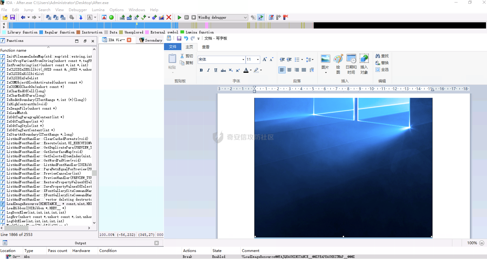

尝试在此函数上设置了一个断点，运行程序，发现在预览图像时触发了该断点。

通过BinDiff可以看到，打过补丁后的WordPad程序添加了一个名为QueryConvert OLELinkCallback的新函数，通过ChatGTP 4.0的帮助，我们尝试分析这个新函数的作用。

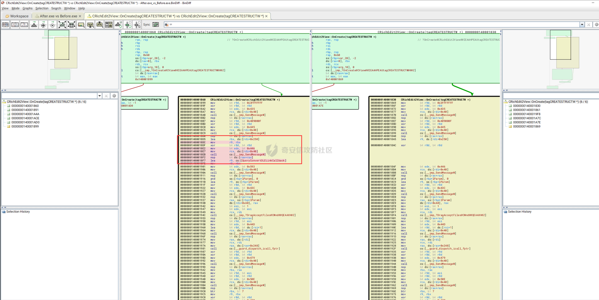

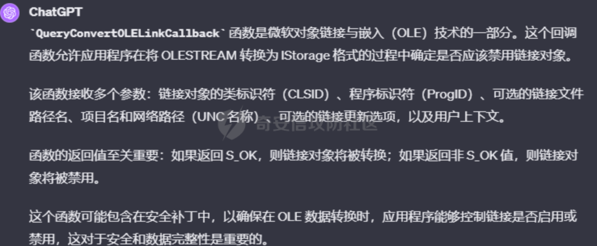  
通过GPT的帮助，了解到该漏洞可能与 Microsoft 的对象链接和嵌入 (Object Linking and Embedding) 格式有关。本质上，OLE 允许将对象和文件嵌入到 Windows 上的其他文件中。比如可以将微软画图（mspaint）创建的画图对象嵌入到RTF等富文本文件中。

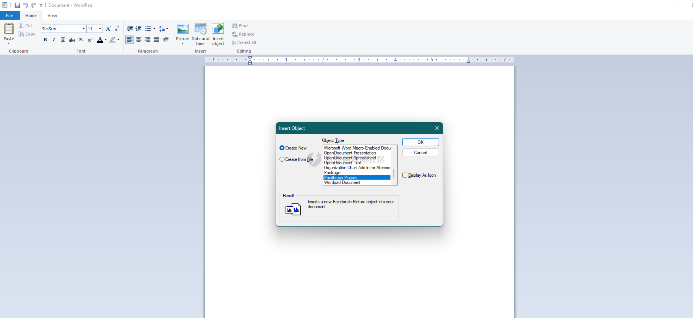

而使用二进制编辑器打开测试文件，可以明显地看到有一个\\objdata包含嵌入对象的十六进制数据的标记。

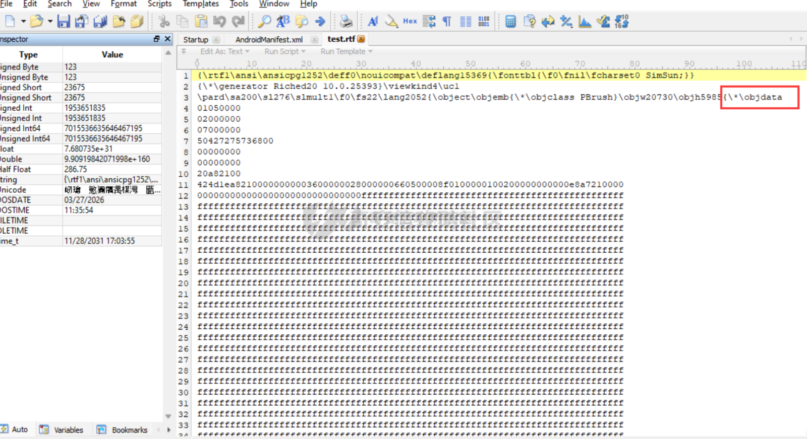

# 探索OLE的奥义

近年来，微软针对OLE技术修复了多个高风险漏洞，包括远程代码执行漏洞。这些漏洞允许攻击者在用户系统上执行任意代码，通常是通过社工钓鱼工程手段诱导用户连接到C2服务器或打开恶意文件实现。臭名昭著的CVE-2022-30190便是通过OLE组件攻击用户，攻击者通常会创建一个包含对恶意OLE对象链接的MS Office文档。这个OLE对象通常是一个位于远程服务器上的HTML文件，链接使用特殊的URI方案在HTML文件中嵌入恶意脚本。当用户打开这个文档时，即使在受保护模式下且宏被禁用的情况下，攻击者创建的文档也会运行MSDT（Microsoft Windows支持诊断工具），并通过一系列参数向这个工具传递命令，该命令将以打开文档用户的权限在受害者的系统上执行。而OLE 的大部分功能都是由ole32.dl的动态链接库实现的。

老规矩，通过BinDiff的分析后发现可以清晰地看到，补丁后的ole32.dll添加了五个新函数。

```php
CheckOLELinkConversionRegistrySetting
FindStringInMultiString
IsAppExcludedFromOLELinkConversionRegistrySetting
OleConvertOLESTREAMToIStorage2
OleConvertOLESTREAMToIStorageEx2
```

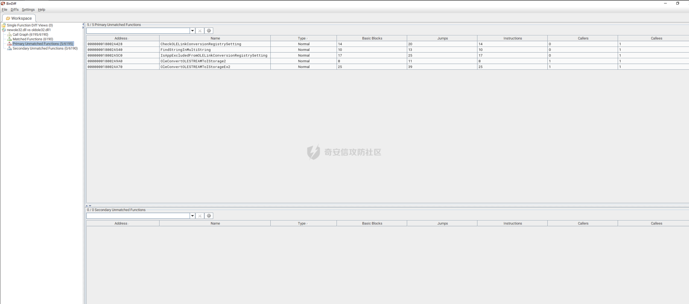

通过微软的[官方文档](https://learn.microsoft.com/en-us/windows/win32/stg/oleconvertolestreamtoistorage2)可以看到OleConvertOLESTREAMToIStorage2与OleConvertOLESTREAMToIStorageEx2的定义。

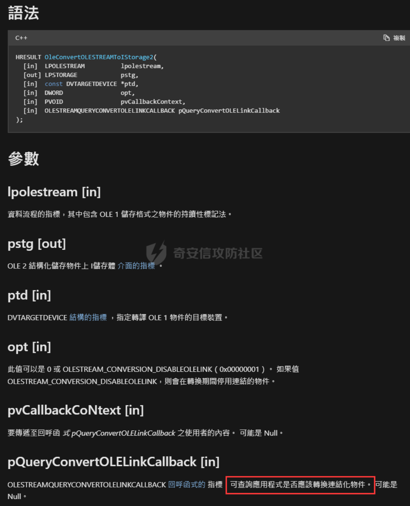

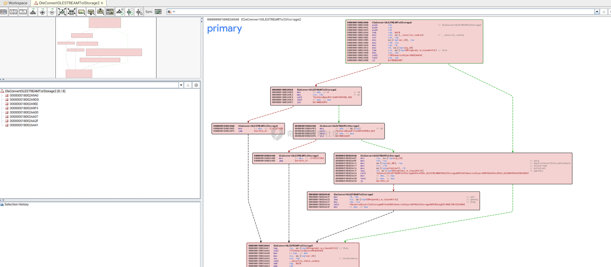  
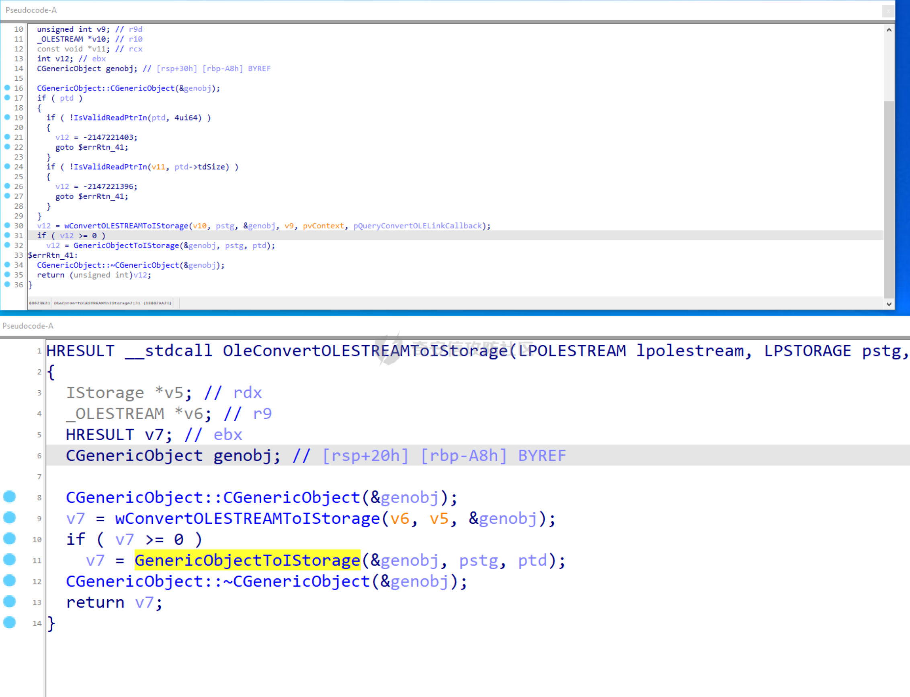  
从IDA的分析中不难看出，新的OleConvertOLESTREAMToIStorage2 函数进行了额外的新参数有效性检查，这可以防止无效或恶意的内存访问，而ole漏洞的触发点在[微软官方文档](https://winprotocoldoc.blob.core.windows.net/productionwindowsarchives/MS-OLEDS/%5BMS-OLEDS%5D.pdf)中也给出了，是LinkedObject。


温故而知新，CVE-2017-11882的原理与这个洞非常相似，当winword.exe加载RTF文件并解析RTF文件格式后，会调用函数ole32!OleConvertOLESTREAMToIStorage将指定的对象从OLE 1存储模型转换为OLE 2结构化存储对象。其内部调用的ole32! wConvert OLESTREAMTOIStorage负责从RTF文件中解析，转换OLE 1对象到OLE 2存储对象，最后ole32! GenericObjectToIStorage函数负责将OLE 2存储对象通过剪切板的方式传送给EquEdt32.exe进程处理。

# 构造Payload

复杂问题简单化，现在只需要构造一个恶意OLE对象，触发LinkedObject中的不安全转换机制，导致Windows强制进行NTLM身份验证，即可证明危害性。顺便说一句，由于近几年爆发高危0day多是NTLM引起的，微软计划打算在最新的Insider版本中逐步停止使用使用Kerberos而非NTLM。Kerberos提供了比NTLM更强的安全保，避免像NTLM那样容易受到中间人攻击和重放攻击。


下载[oletools](https://www.kitploit.com/2017/04/oletools-tools-to-analyze-ms-ole2-files.html?m=0)解析rtf文件，可以清晰地看到，FormatID值为0x2，查看微软官方文档可知 ，若 OLE 对象的类型为LinkedObject，则该TopicName字段应指向链接文件的 UNC 路径：

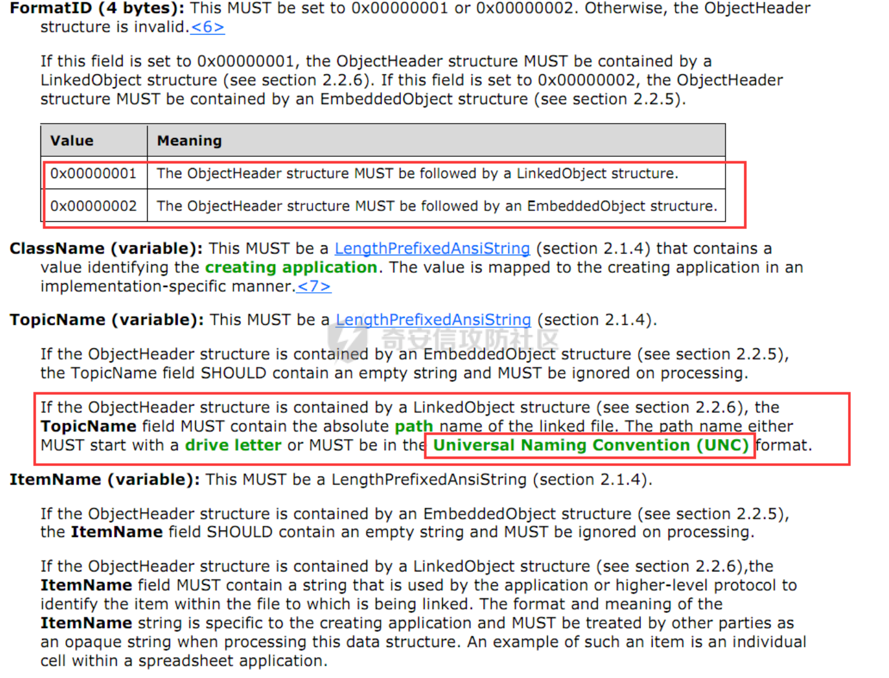

除了将TopicName设置为SMB目标外，还需要删除NativeDataSize和NativeData的chunk，因为LinkedObject结构不包含它们。

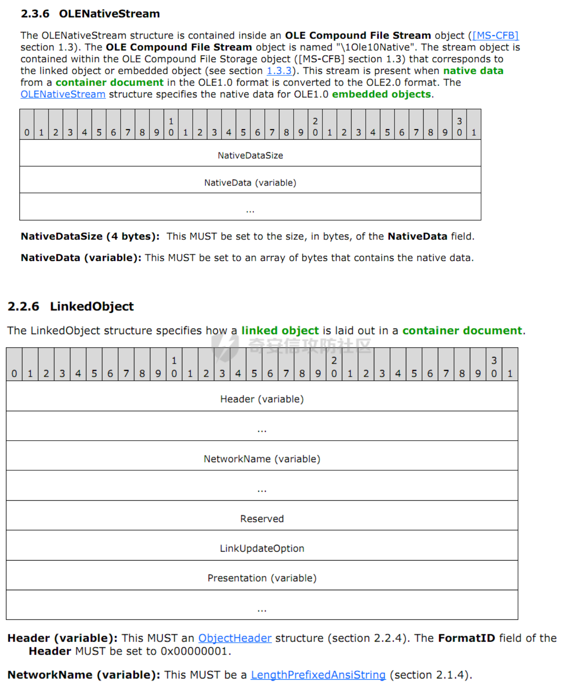  
美中不足的是会有一个提示框，这是微软MotW（Mark of the Web）功能在起作用，它是Windows内置的安全功能，会针对从互联网上下载的文件给予一个MoTW标签，当开启具有MoTW标签的文件，Windows就会显示警告，要求使用者小心。

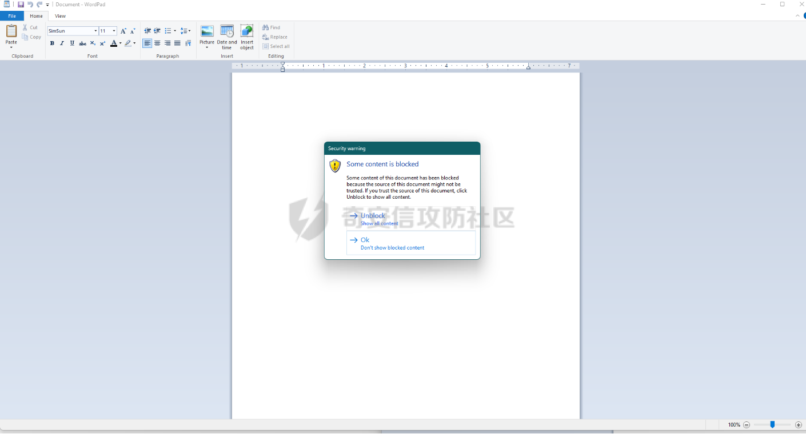

好消息是，虽然Wordpad弹了个框，不过受害者机器已经向攻击者的服务器发起了NTLM身份验证。

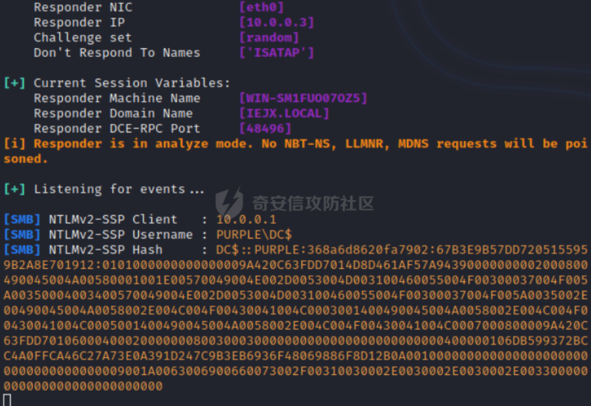

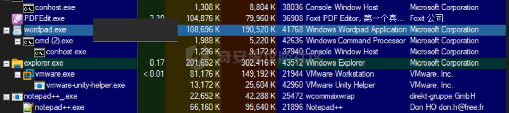

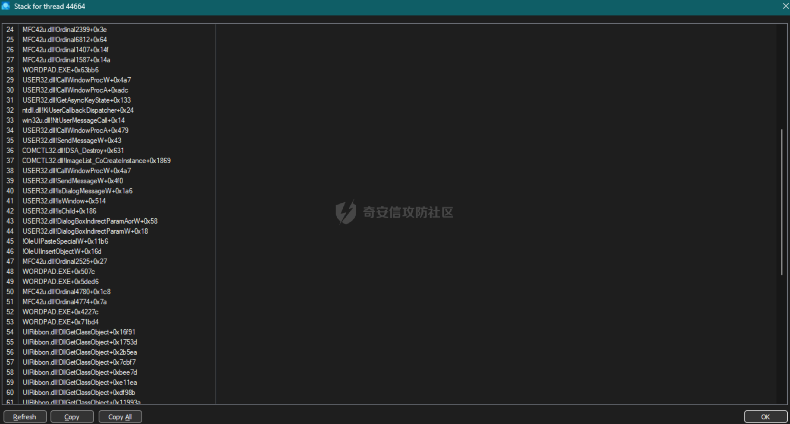

# 总结

在高危漏洞层出不穷的今天，保持安全意识有一说一比较困难，比如WinRAR和Notepad都会出现因为栈溢出导致的RCE，真的是防不胜防。OLE组件的远程代码执行（RCE）漏洞和Excel中通过动态数据交换（DDE）功能引起的CSV注入漏洞。这些漏洞展示了攻击者如何利用复杂的数据交换机制和文档功能来执行未授权的代码，这些漏洞都和我们用户朝夕相处，而且很具有迷惑性，比如这次提到的漏洞当弹框出现的时候，你的NTLM已经被窃取了。还是要保持最小权限原则，对各种渠道收到的不明文件保持警惕，定期更新杀毒软件与系统版本，坚持最小权限原则，每个人都是自己网络安全的第一责任人，通过结合技术修复和安全意识提升，我们可以更好地保护自己免受这些漏洞的威胁。
