# 奇安信攻防社区-[攻防实战]外网突破

### \[攻防实战\]外网突破

在经历了多年的攻防对抗之后，大量目标单位逐渐认识到安全防护的重要性。因此，他们已采取措施尽可能收敛资产暴露面，并加倍部署各种安全设备。但安全防护注重全面性，具有明显的短板...

# 1、供应链

在经历了多年的攻防对抗之后，大量目标单位逐渐认识到安全防护的重要性。因此，他们已采取措施尽可能收敛资产暴露面，并加倍部署各种安全设备。但安全防护注重全面性，具有明显的短板效应，一处出现短板，整个防护体系就可能瞬间崩溃。而目标单位的供应链往往是这些薄弱点的集中体现。这些供应链不仅暴露在外，而且由于复杂的关系，使得对它们的监控和管理变得更为困难。因此，攻击团队通常会选择从供应链着手，以一种迂回的方式绕过目标单位强大的防御体系，获得对目标单位的控制权限。

通过在搜索引擎上搜索"系统名称"目标单位

  
找到相关的供应商信息，通过对供应商进行攻击，获取目标单位的数据及权限。!

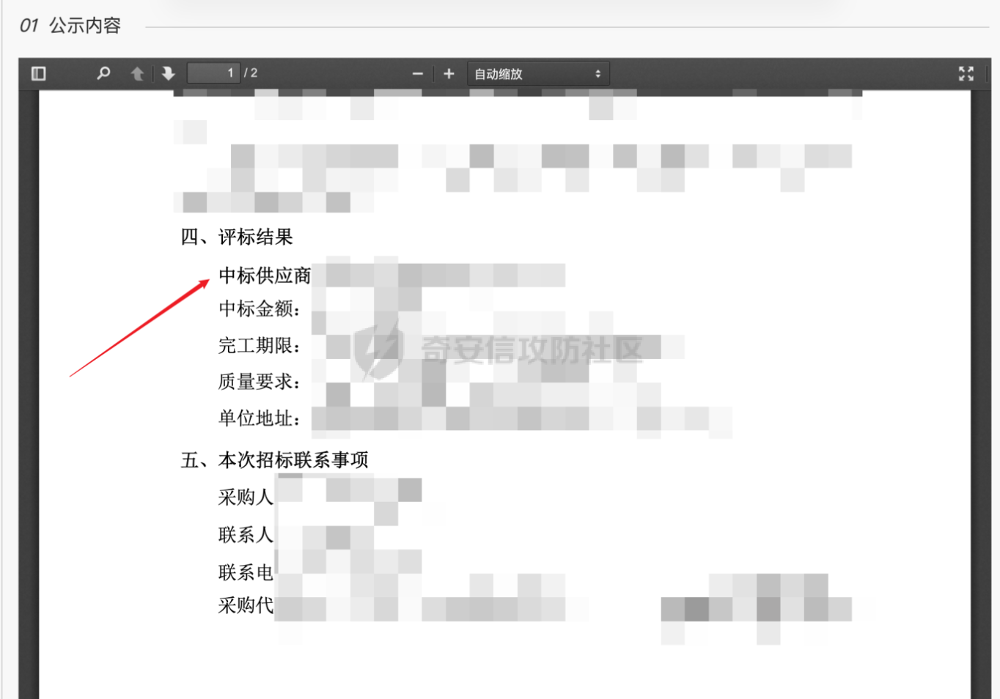

## 1.1、heapdump泄露

通过对供应商资产进行渗透，发现某资产admin目录下存在heapdump文件泄露

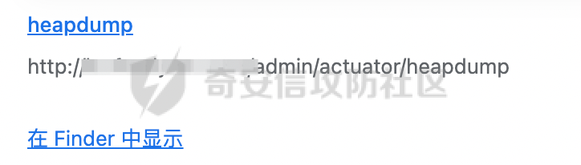

对于heapdump的利用方式这里就不太赘述，有许多文章对其原理和利用都进行了深入的研究，特定情况下还可以直接进行RCE，这里泄露了大量敏感信息，密码信息加入密码本

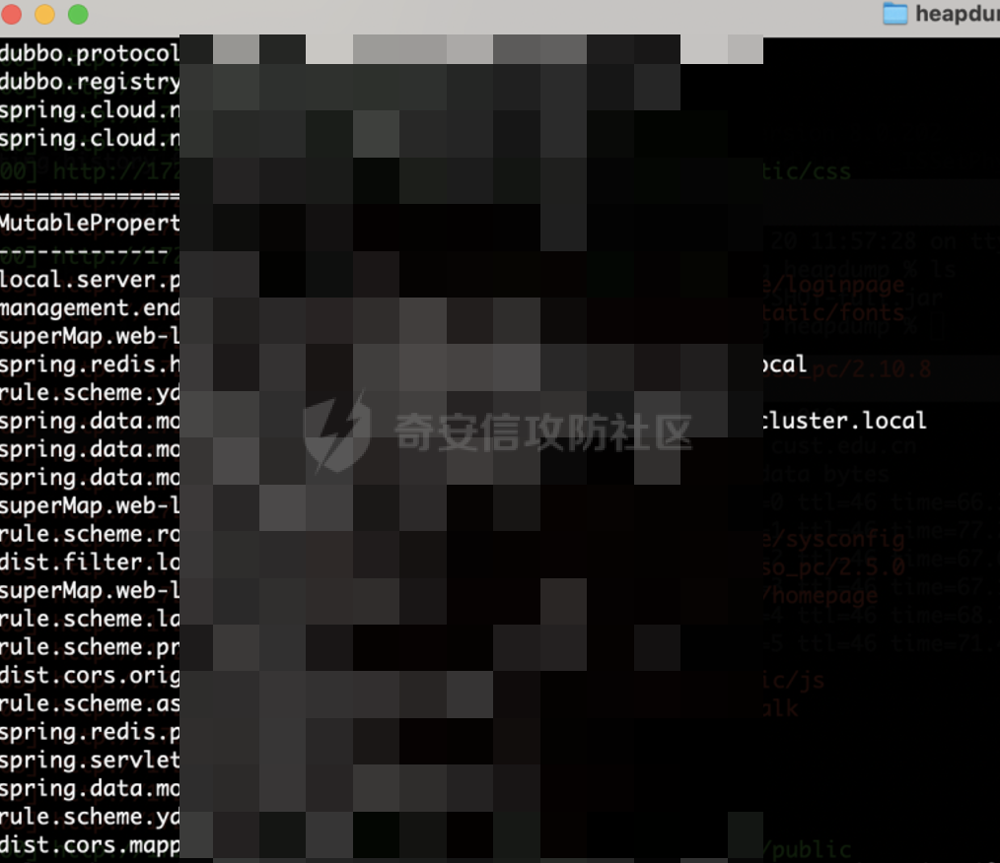

登录MinIO，发现大量所属目标单位的敏感信息，也存在其它单位的敏感信息

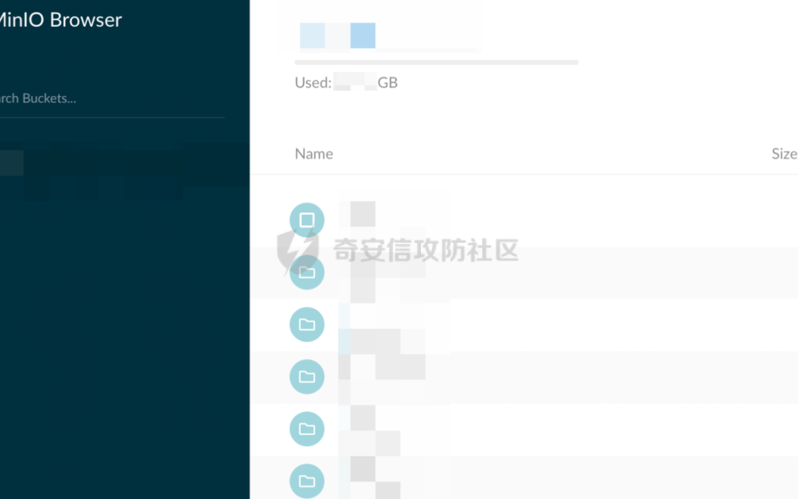

登录Nacos，大量配置文件，密码信息加入密码本!\[\]

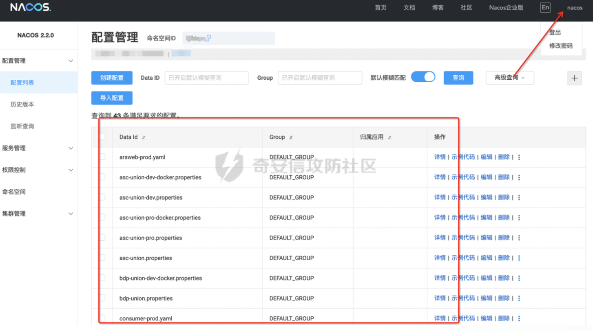  
登录OSS，发现大量所属目标单位的敏感信息

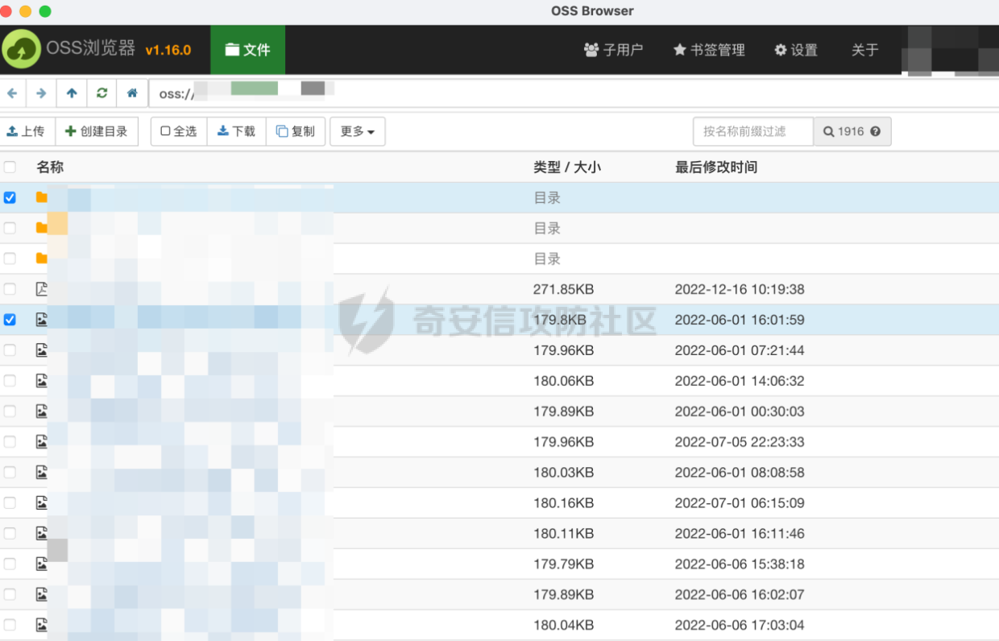

## 1.2、微信小程序接口未授权

### 1.2.1、微信小程序解包

想要对微信小程序进行解包操作，首先是要获取目标小程序的wxapkg文件。wxapkg文件是微信小程序的安装包文件格式，用于将小程序的代码、资源以及其他必要的文件打包成一个单独的文件。但是Windows环境下的wxapkg文件中的js代码和资源文件一般是被加密的，需要使用专门设计的解密工具先进行解密，再进行解包操作，获取文件内容。iOS和Android平台下可直接进行解包操作。

#### 1.2.1.1、获取wxapkg文件

在获取wxapkg文件时，最好将文件夹中的文件先删除，然后再重新打开小程序，防止其它文件干扰

iOS wxapkg 文件存放路径为：

```php
/var/mobile/Containers/Data/Application/{系统UUID}/Library/WechatPrivate/{user哈希值}/WeApp/LocalCache/release/{小程序的AppID}
```

Android wxapkg 文件存放路径为：

```php
/data/data/com.tencent.mm/MicroMsg/{user哈希值}/appbrand/pkg/
```

Windows wxapkg 文件存放路径为：

```php
C:\Users\{系统用户名}\Documents\WeChat Files\Applet\{小程序的AppID}\
```

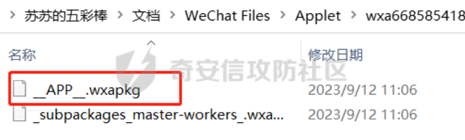

#### 1.2.1.2、解密操作

下面两个github项目都可以进行解密操作

[https://github.com/superdashu/pc\_wxapkg\_decrypt\_python](https://github.com/superdashu/pc_wxapkg_decrypt_python)  
[https://github.com/BlackTrace/pc\_wxapkg\_decrypt](https://github.com/BlackTrace/pc_wxapkg_decrypt)

解密原理

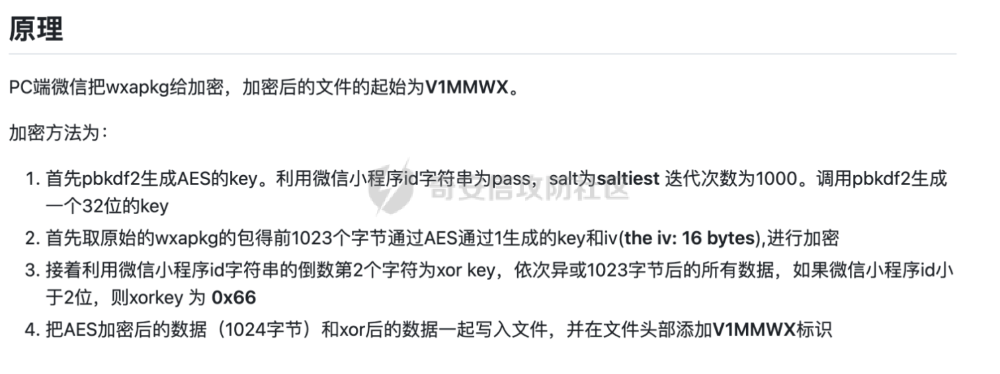  
成功解密

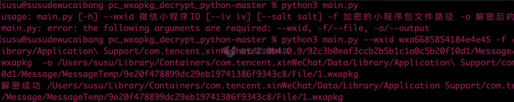

#### 1.2.1.2、解包操作

国光大佬提供的工具下载链接

[https://sqlsec.lanzoub.com/i1NEP0mx694f](https://sqlsec.lanzoub.com/i1NEP0mx694f)

```php
node wuWxapkg.js 1.wxapkg
```

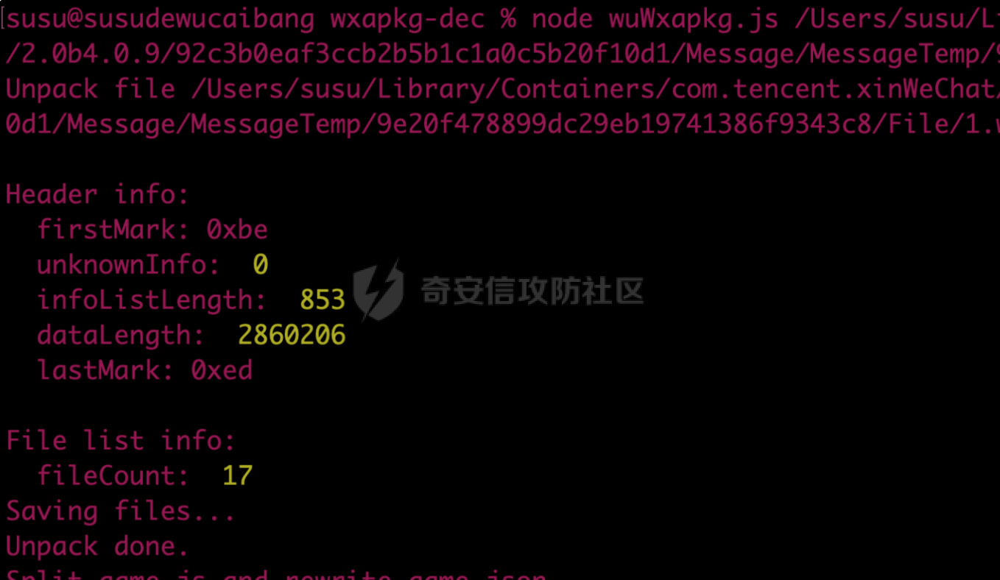

对小程序进行解包操作，获取到前端JS代码后中，从中进行提取获得接口

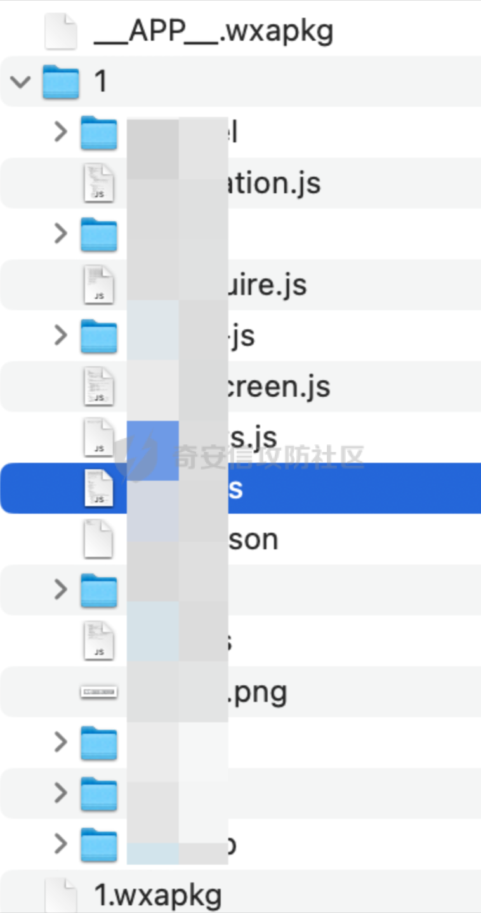

直接访问目标接口，前端页面虽然显示初始化失败

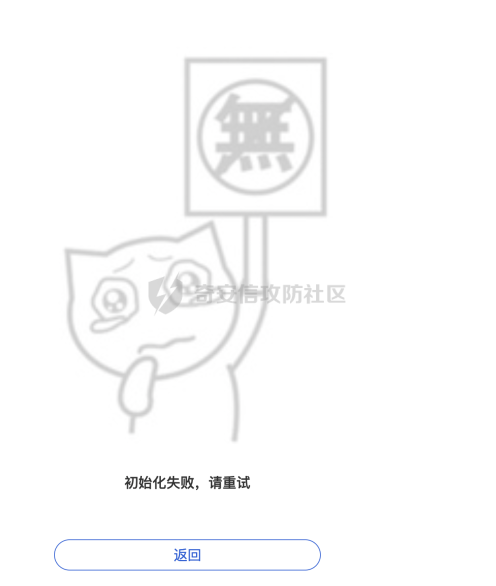  
但流量包中已获取数据，近千万条目标单位敏感信息

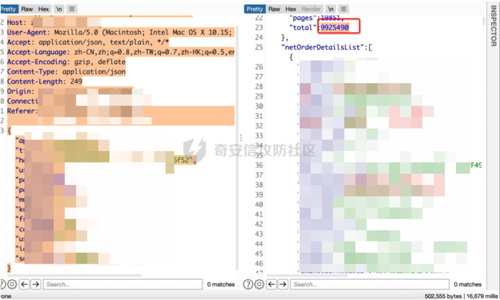

## 1.3、web程序越权

通过上述收集到的密码，撞密码撞出一个账号，但是此账号为最低权限，无任何操作权限，点击搜索组织架构，此时无任何返回信息  
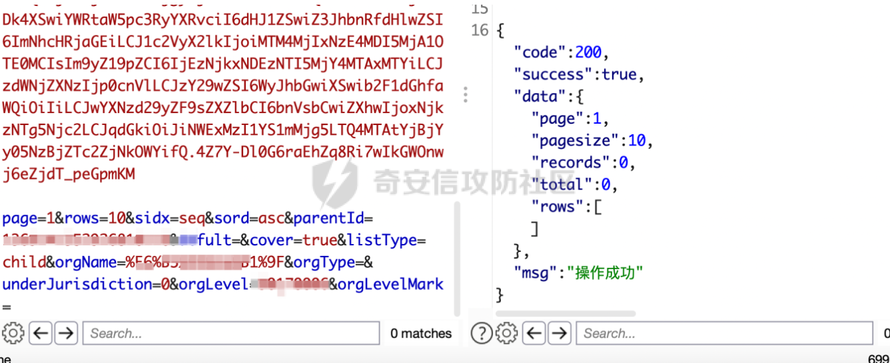

抓包将parentId和orgLevel去除，再发包，即可越权看到全员组织架构

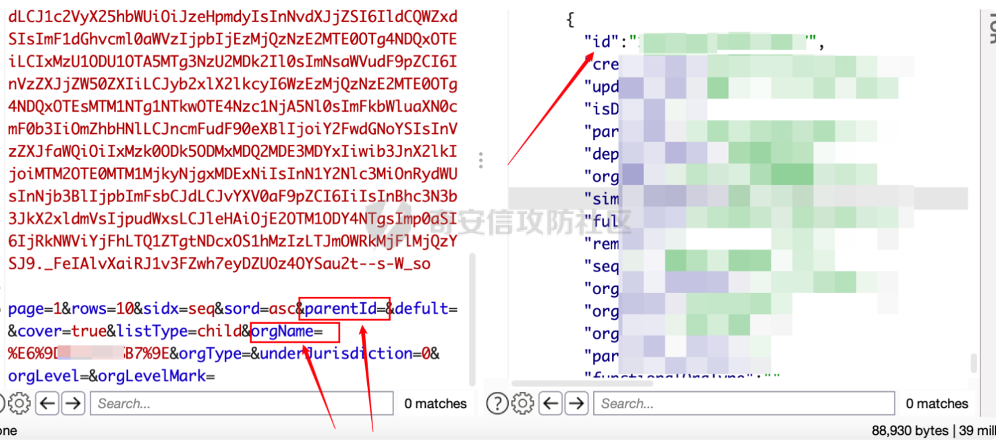

点击修改密码，然后将上述获取到的roleId添加进去，即可获取全部权限

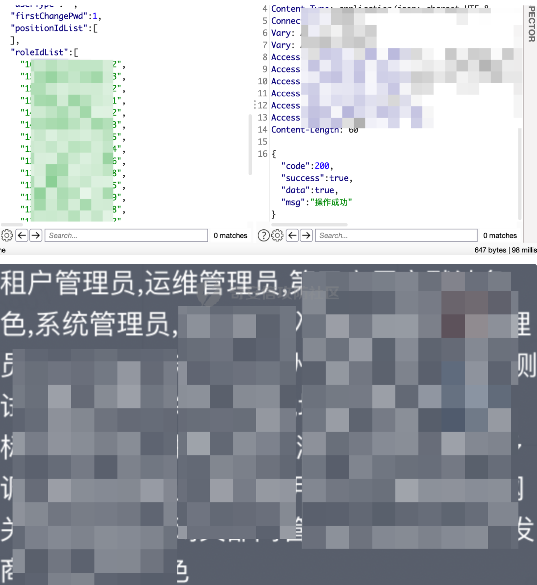

获取到大量数据

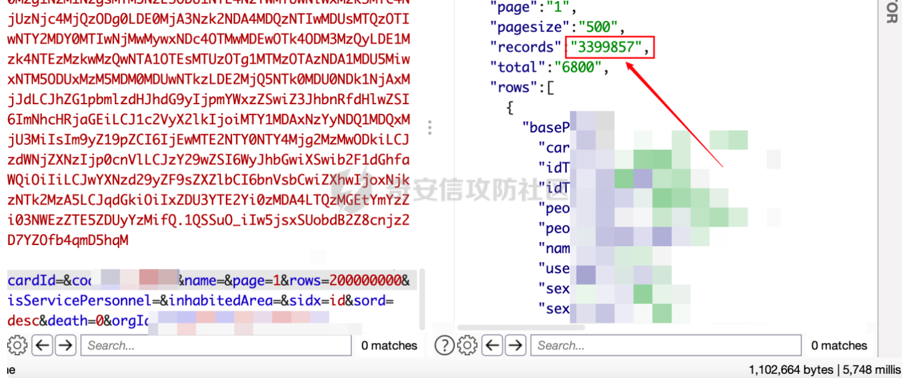

## 1.4、公众号

js泄露密码，密码可撞库目标单位公众号

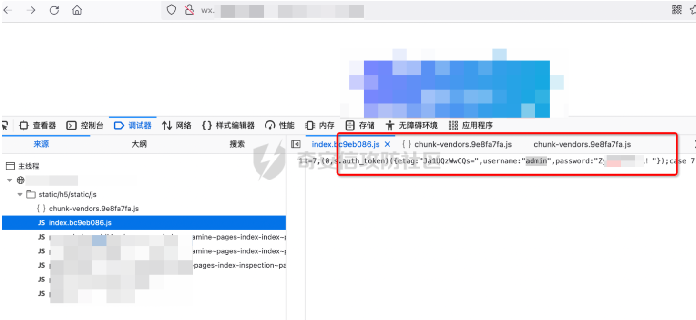

# 2、云原生安全

容器化部署和微服务架构为应用程序开发和部署提供了更好的灵活性、可伸缩性、可维护性和性能，受到了越来越多厂商的使用，新的应用就会引入新的攻击面，如容器逃逸、服务间攻击、API滥用等。攻击者可以利用这些新的入口点来攻击应用程序和数据。并且在云原生环境下管理用户和服务的身份验证和授权变得更加复杂。许多应用开发商在追求容器化和云原生架构的便利性和效率时，安全性常常被忽视或放在次要位置。这就直接导致了云原生环境的脆弱，容易受到各种安全威胁和攻击。

## 2.1、Harbor 镜像仓库

Harbor是一个开源的容器镜像仓库管理器，旨在帮助组织存储、管理和分发Docker容器镜像，但是Harbor存在一个充满争议的“漏洞”：任意用户能够直接获取public的镜像。

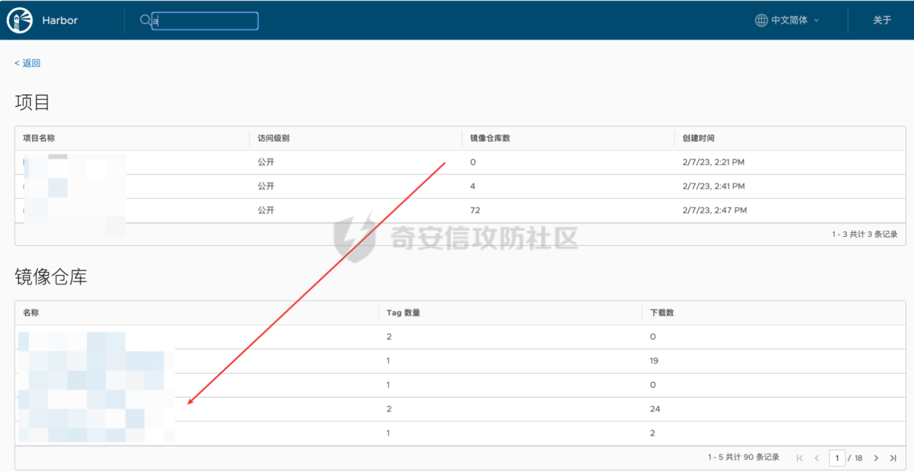

可以直接拉取下载镜像文件，可以利用脚本批量下载

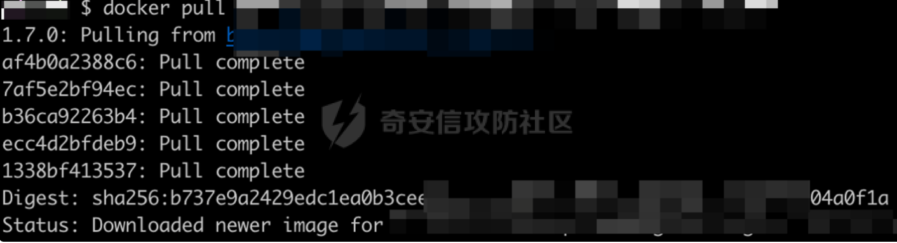

## 2.2、疑似后门

通过镜像文件获取jar包，获取配置文件等敏感信息，对jar包的class文件进行反编译，进行代码审计获取到一个类似后门的漏洞，该接口只需要使用用户名，即可登录系统后台。管理员权限配合文件上传获取服务器权限。

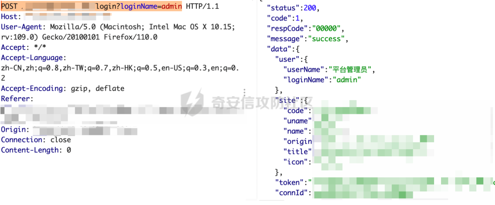

通过配置文件连接数据库等

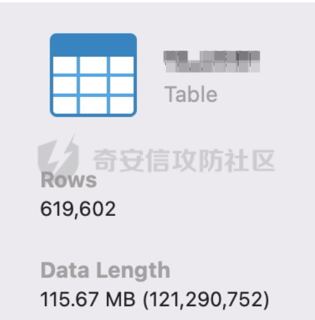

## 2.3、docker未授权

### 2.3.1、 registry api未授权访问

在 Docker Registry API 中，认证和授权通常是基于访问令牌（Access Token）或者用户名和密码的。如果未正确设置访问控制权限，即会造成未授权访问漏洞，攻击者可直接下载registry仓库的所有镜像容器。

访问/v2/\_catalog接口即可查看全部仓库内容

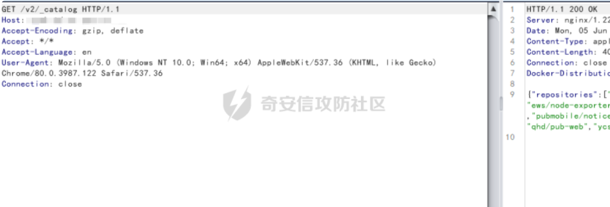  
[https://github.com/Soufaker/docker\_v2\_catalog](https://github.com/Soufaker/docker_v2_catalog)

利用上述工具可直接下载镜像

### 2.3.2、 Docker Remote API未授权访问

为了管理容器集群，Docker允许Daemon作为后台守护进程执行通过管理接口发送的Docker命令，使用参数-H 0.0.0.0:2375启动Docker Daemon时，将开放2375端口接收来自远程Docker客户端的命令。在这种情况下，2375端口被作为非加密端口暴露出来，并且不存在任何形式的身份验证，攻击者可以直接使用Docker命令连接到Docker Daemon，并对容器进行直接操作，配合根目录挂载即可实现容器逃逸。

```php
#查看容器
docker -H tcp://<target>:2375 ps -a
```

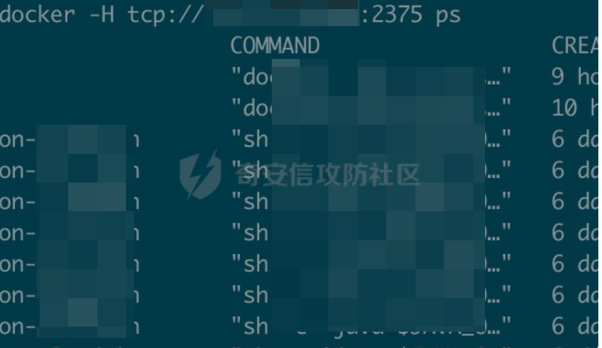

```php
#挂载宿主机的根目录到容器内的mnt目录
docker -H tcp://<target>:2375 run -it -v /:/mnt nginx:latest /bin/bash
#反弹shell
echo '反弹shell命令' >> /mnt/var/spool/cron/crontabs/root
```

## 2.4、Nacos

Nacos是一个开源的动态服务发现、配置管理和服务管理平台，它提供了注册中心、配置中心和服务管理等功能，帮助开发人员实现微服务架构中的服务注册、配置管理以及服务发现等需求。

作为一个开源工具，漏洞还是被披露不少的，

**未授权访问：**[/nacos/v1/auth/users?pageNo=1&pageSize=1](http://192.168.80.131:8848/nacos/v1/auth/users?pageNo=1&pageSize=1) 直接查看用户

**任意用户添加**：POST [/nacos/v1/auth/users](http://192.168.80.131:8848/nacos/v1/auth/users?pageNo=1&pageSize=1) username= & password=

**任意用户密码修改**：curl -X PUT '[http://127.0.0.1:8848/nacos/v1/auth/users?accessToken](http://127.0.0.1:8848/nacos/v1/auth/users?accessToken)\\=' -H 'User-Agent:Nacos-Server' -d 'username\\=test1&newPassword\\=test2'

**弱口令**：nacos/nacos

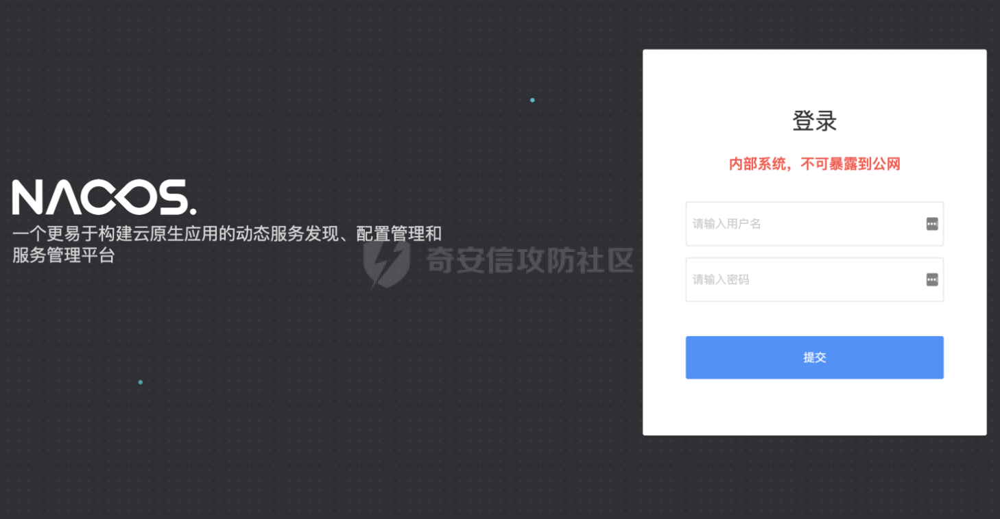

通过编排密码爆破进后台，发现大量配置文件，但敏感信息均被加密

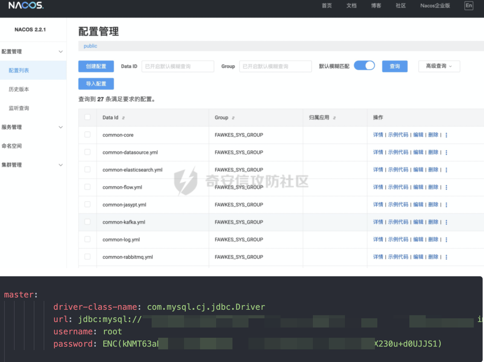

### 2.4.1、Jasypt加密

Spring 的配置文件中会有一些敏感信息，如数据库密码，因此有时我们希望将敏感信息加密，Jasypt 就是其中比较方便的工具，Jasypt 是一个 Java 库，用于简化敏感数据（如密码、API 密钥等）的加密和解密操作。

加密的内容需要用 ENC(..) 括起来，加密用的密码通过 jasypt.encryptor.password 指定。

```php
spring:
  datasource:
    username: your-username
    password: ENC(encrypted-password)
```

因为必须要解密，密码就需要放在配置文件里，或者放在代码中：

```php
# application.yml

jasypt:
  encryption:
    password: 密码
    algorithm: 加密方式
```

解密数据：使用解密器的 decrypt 方法对加密的数据进行解密操作。

```php
import org.jasypt.util.text.BasicTextEncryptor;

public class DecryptionExample {
    public static void main(String[] args) {
        String encryptionKey = "yourEncryptionKey"; // 加密密钥
        BasicTextEncryptor textEncryptor = new BasicTextEncryptor();
        textEncryptor.setPassword(encryptionKey);

        String encryptedText = "encryptedText"; // 加密后的数据
        String decryptedText = textEncryptor.decrypt(encryptedText);

        System.out.println("Decrypted Text: " + decryptedText);
    }
}
```

但是客户端加密的安全性主要依赖于客户端代码的保护和可信任性，当密码泄露后，加密也就自然失效了，在ncaos一个文件中发现jasypt加密密码，可以直接进行解密操作

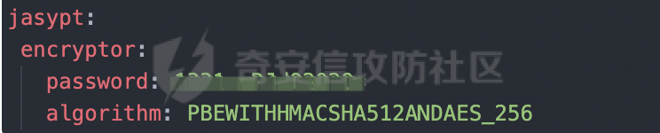  
成功连接OSS

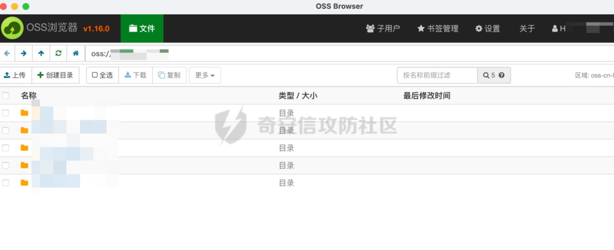

成功连接数据库

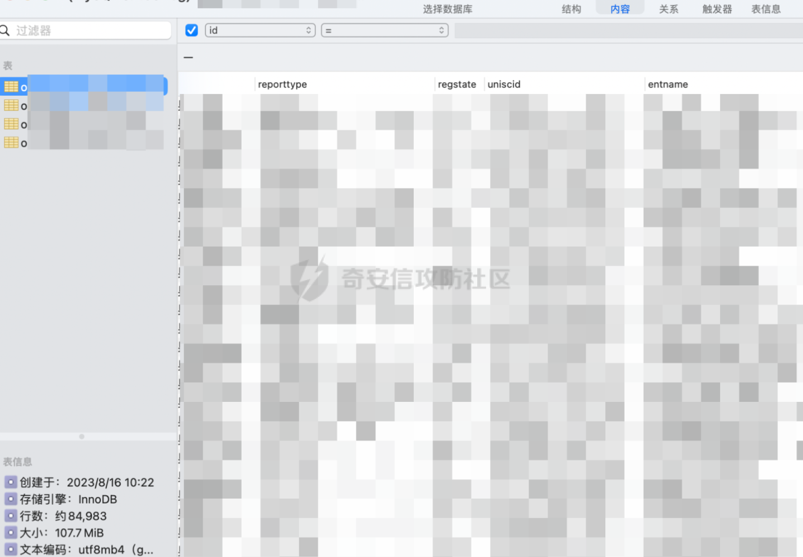

小程序token，接管小程序

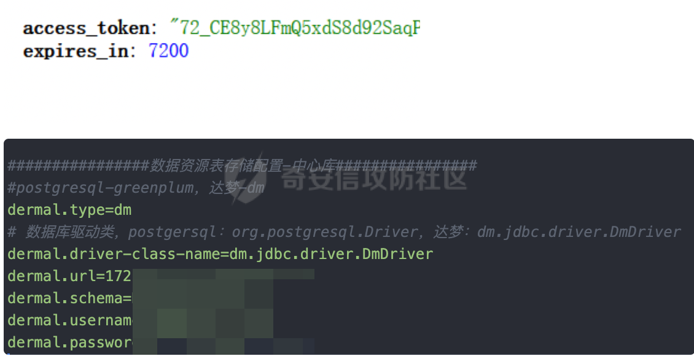

达梦数据库是国产化的关系型数据库，使用下面工具可以进行连接

[https://github.com/864381832/x-RdbmsSyncTool/releases/tag/v0.0.3](https://github.com/864381832/x-RdbmsSyncTool/releases/tag/v0.0.3)

# 3、Nday

## 3.1、yongyouNC jsInvoke rce漏洞

漏洞利用方法，通过Java反射机制创建一个javax.naming.InitialContext对象，并使用LDAP协议连接到指定的IP地址和端口，然后调用"nc.itf.iufo.IBaseSPService"服务中的"saveXStreamConfig"方法，接受对象和字符串作为参数，达到命令执行的效果。

命令执行成功，但是目标系统存在杀软，无法直接上传文件

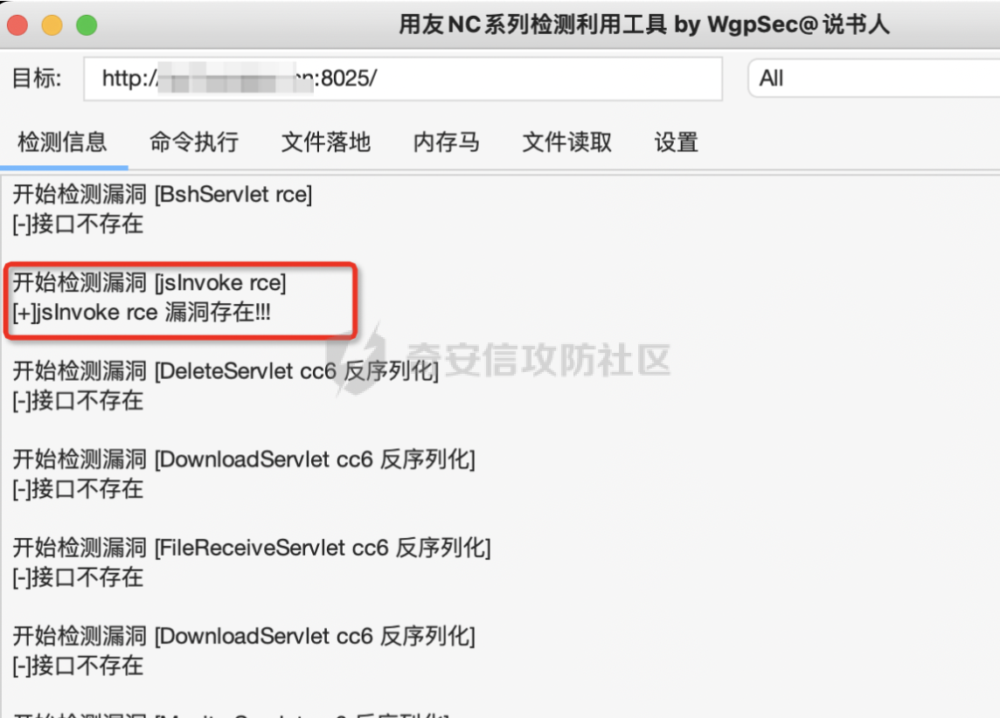

### 3.1.1、certutil

certutil 是 Windows 操作系统中的一个命令行工具，主要用于处理证书和加密相关的操作，利用 certutil的解密操作可以绕过杀软。

```php
echo bash64编码后的免杀马 > myfile.jsp
```

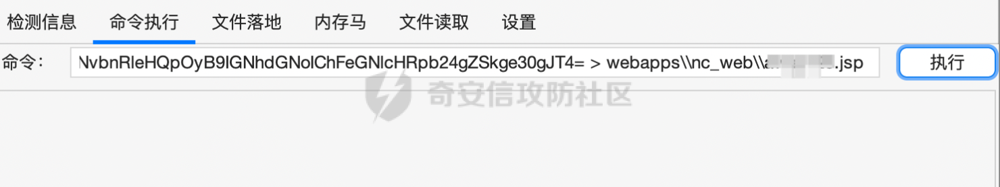

使用certutil进行解码

```php
certutil -decode 木马相对路径 解码后的木马相对路径
```

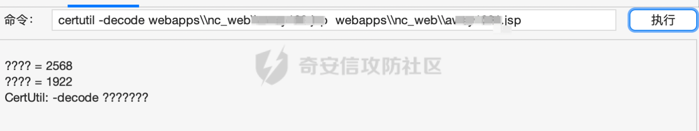

冰蝎上线并上线CS

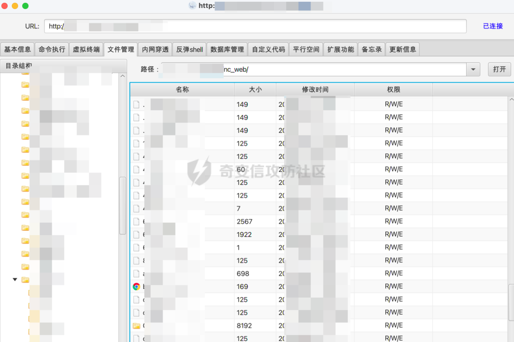

## 3.2、若依二开

shiro的洞修复了，找到一个前台信息泄露漏洞

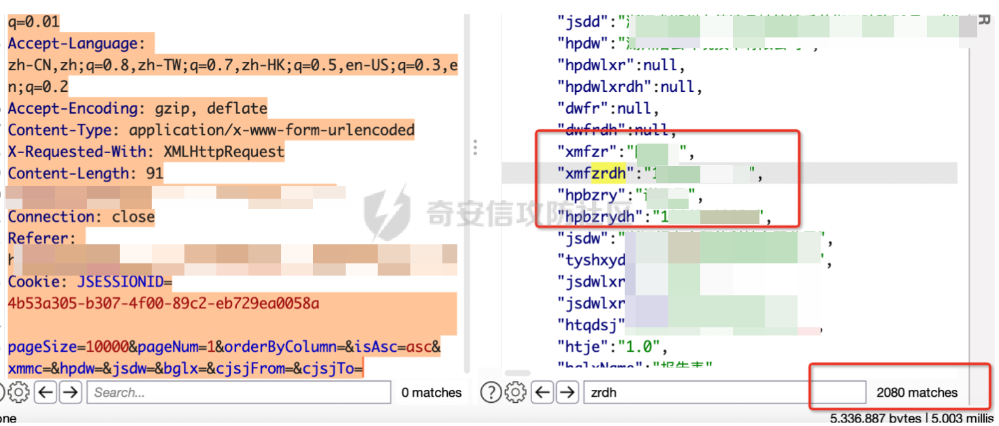

通过获取到的用户名，使用弱口令进入后台，普通权限


再次对公告发布人员猜解密码，成功登录后台，多了系统管理权限，直接添加用户赋予最高权限

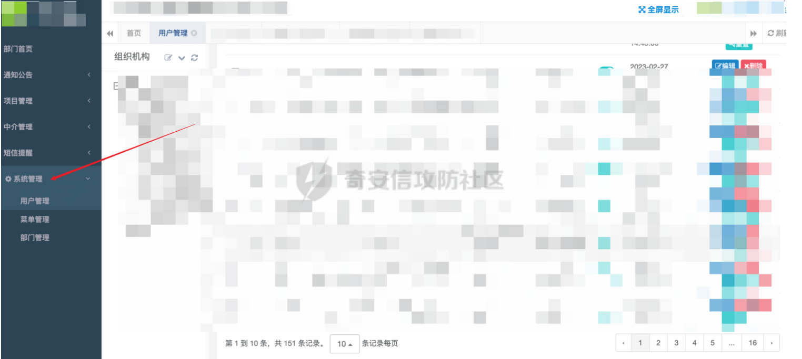

新增用户登录，发现定时任务功能，直接使用定时任务执行命令

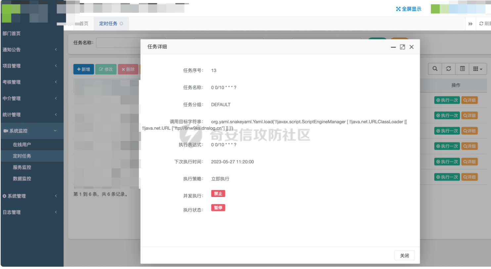

## 3.3、shiro

目标路径在被访问时，会先跳转到统一认证登录，导致大部分都忽视了该路径是存在shiro反序列化漏洞的


本着试一试的心态进行了shiro的扫描，默认密钥，直接获取权限

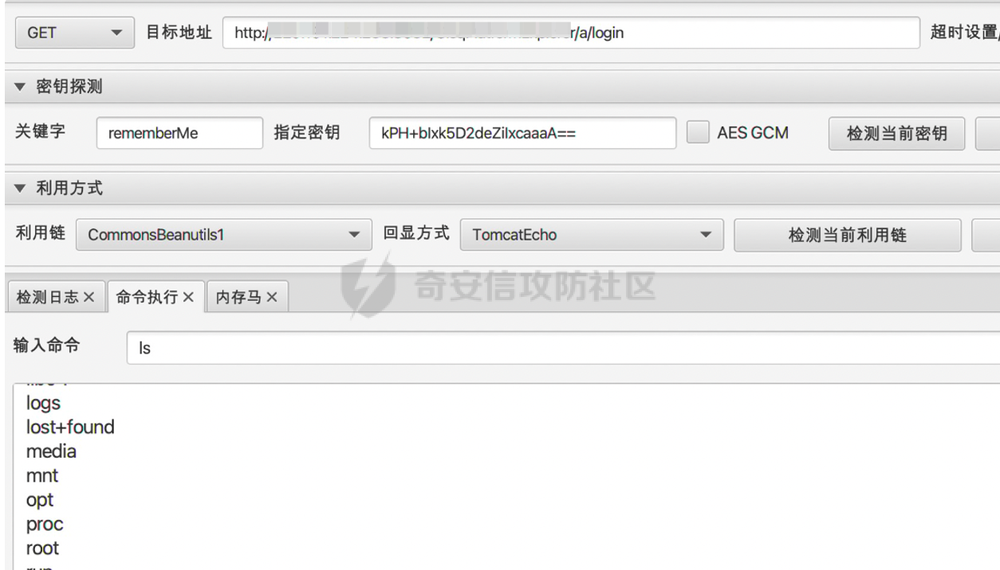
