# 奇安信攻防社区-某cms模板渲染导致rce漏洞分析

### 某cms模板渲染导致rce漏洞分析

模板渲染是网站开发中常用的技术，可以实现动态生成页面内容。然而，如果模板渲染过程中存在安全漏洞，则可能会导致远程代码执行（RCE）等严重后果。

模板渲染是网站开发中常用的技术，可以实现动态生成页面内容。然而，如果模板渲染过程中存在安全漏洞，则可能会导致远程代码执行（RCE）等严重后果。

# 0x01 前置知识

通过审计发现这个cms是基于thinkphp5版本来进行开发的

在 ThinkPHP 中，使用模板使得前端视图与后端逻辑分离。渲染模板最常用的是使用`\think\View`类的`fetch`方法，并且可以通过自定义模板引擎标签来扩展和定制渲染标签。

在模板的编译阶段，是由`compiler`进行编译完成的，主要是解析当前模板文件中的**模板标签语法**为PHP可执行代码，然后生成一个php文件并执行


`TagLib`（标签库）的作用是提供一种机制，让开发者可以自定义和扩展模板引擎中的标签。标签库允许您定义自己的模板标签，以便在模板中使用这些标签来执行特定的操作或输出特定的内容。

例如在这个cms中，通过继承`TagLib`类来自定义模板引擎标签来扩展和定制渲染标签

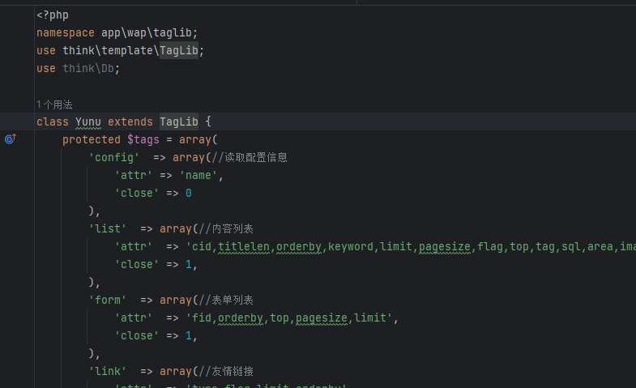

并且在config中配置使用了自定义标签

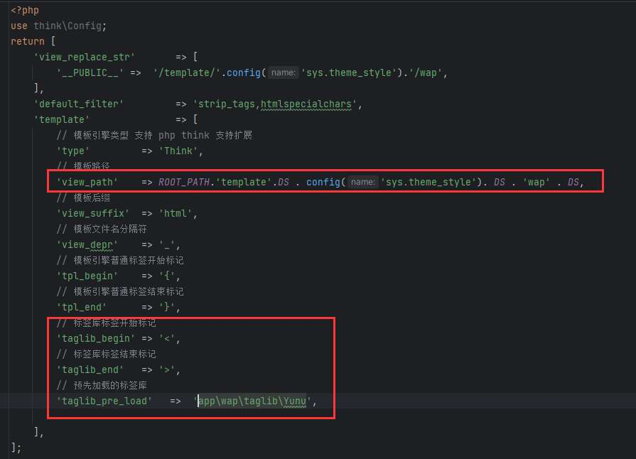

例如这里自定义了标签库的开始结束标记，模板的路径和加载的标签库。

# 0x02 漏洞分析

通过查看继承了`TagLib`的`Yunu`类，我们发现了他定义了很多处理各种标签的方法

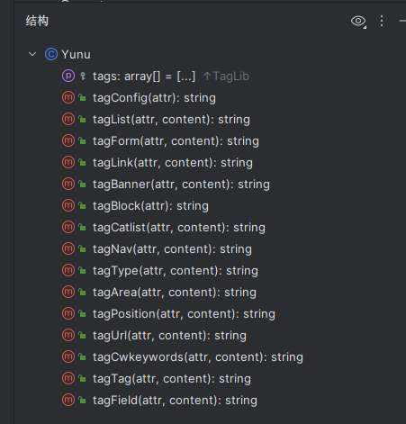

这里调用的方法是通过thinkphp框架中的`TabLib`中的`parseTag`方法来进行动态调用的，

具体调用栈如下：

会调用 `fetch` 方法来渲染模板，然后使用`compiler`来编译模板，然后其中又使用`parse`来解析标签

```php
TagLib.php:181, think\template\TagLib->parseTag()
Template.php:685, think\Template->parseTagLib()
Template.php:397, think\Template->parse()
Template.php:333, think\Template->compiler()
Template.php:182, think\Template->fetch()
Think.php:86, think\view\driver\Think->fetch()
View.php:163, think\View->fetch()
Controller.php:120, think\Controller->fetch()
Index.php:16, app\wap\controller\Index->index()
App.php:343, ReflectionMethod->invokeArgs()
App.php:343, think\App::invokeMethod()
App.php:611, think\App::module()
App.php:457, think\App::exec()
App.php:139, think\App::run()
start.php:19, require()
index.php:8, {main}()
```

在`parseTag`方法中，分别对闭合标签和自闭合标签进行处理和替换对应的php代码

例如这里的自闭合标签为例，我们寻找到处理自闭合标签的代码：

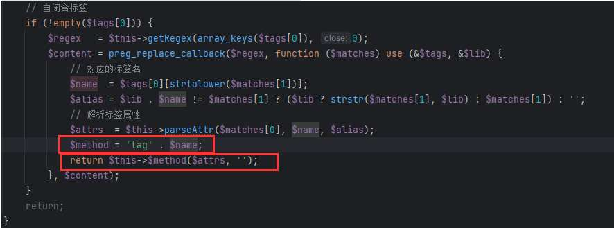

以下图为例，就是通过模板中获取标签名和name和值组成的数组，这样他就会调用`tagConfig`方法，并将获取到的键值对传入方法


由于在这些处理标签的方法中，会对标签的类型进行判断，并将对应的内容转换成php代码，所以我们寻找漏洞的思路就是查看这个方法中是否有可控参数或可控方法从而造成php代码执行。

所以首先处理自闭合标签的方法，从`app/wap/taglib/Yunu.php`中查找`close`值0的标签，这里找到4个

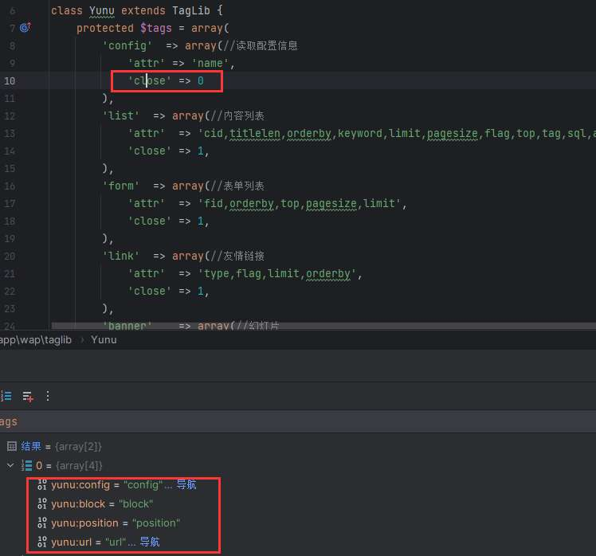

那我们就在这4个函数中寻找利用点。我们搜索`$_GET`，`$_POST`和`$_SERVER`看看是否又可控制的点

在这里找到一处

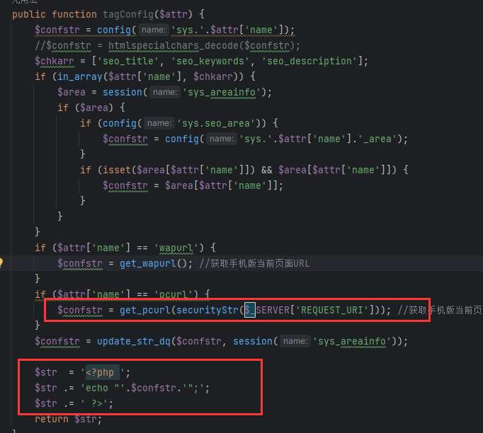

但随后又发现这里使用了`securityStr`方法，他对一些关键字进行了一些过滤

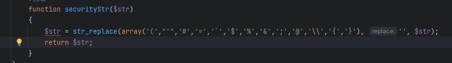

随后注意到上面的wapurl中，调用了`get_wapurl`获取手机版的当前页面URL。

在通过`get_wapurl`，由于默认状态下开启了动态域名并且关闭WAP独立域名，所以会进入else语句中并最终在最下面的三元判断式中取到完整的url

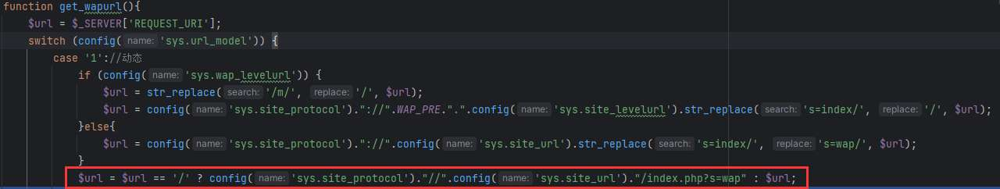

最终将url赋值给`$confstr`，拼接到下面的php代码中，这里构造payload主要要闭合前面的双引号，并且用注释符注释后面的语句。

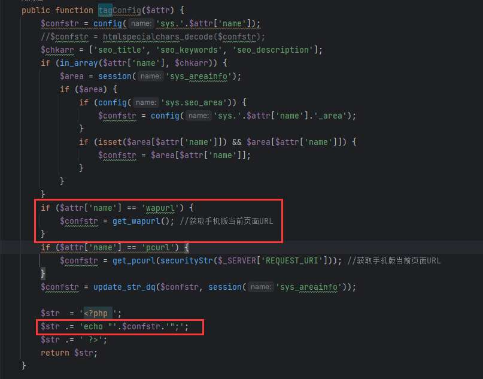

由于在`tagConfig`标签下，且需要`name`为`wapurl`的标签，所以我们在模板文件的目录下搜索`<yunu:config name='wapurl'`


发现很多地方使用了此标签查看模板文件，发现

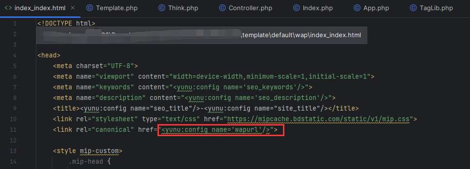

# 0x03 漏洞利用

此模板文件在wap/index\_index.html，所以构造payload为

```php
http://127.0.0.1/index.php?s=wap/index/index&asdasd=aa";phpinfo();//
```

然而在浏览器访问的时候发现并没有执行对应的代码，通过查看源代码，发现浏览器默认会对参数进行url编码，导致闭合双引号失败


使用burp或者yakit发包就没问题了

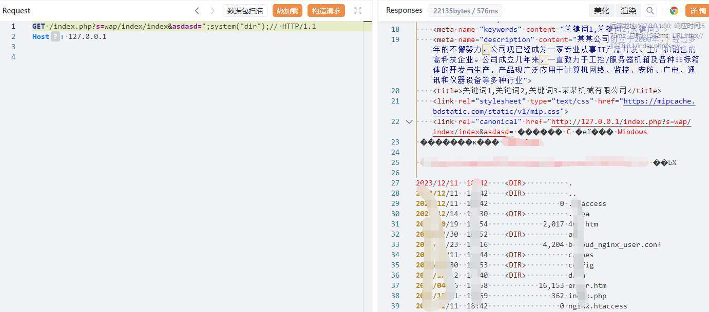
