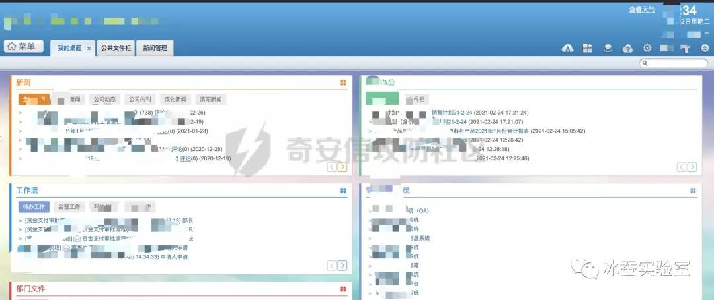
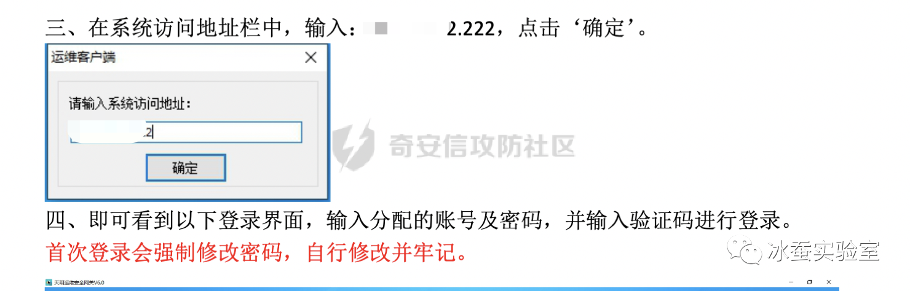
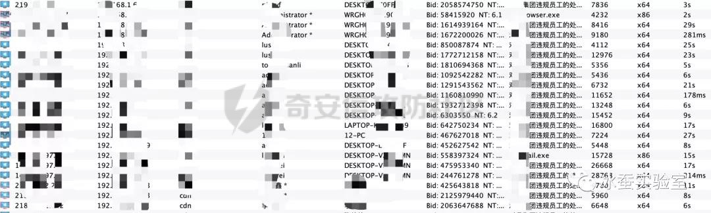
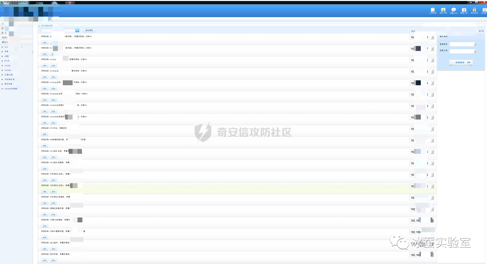
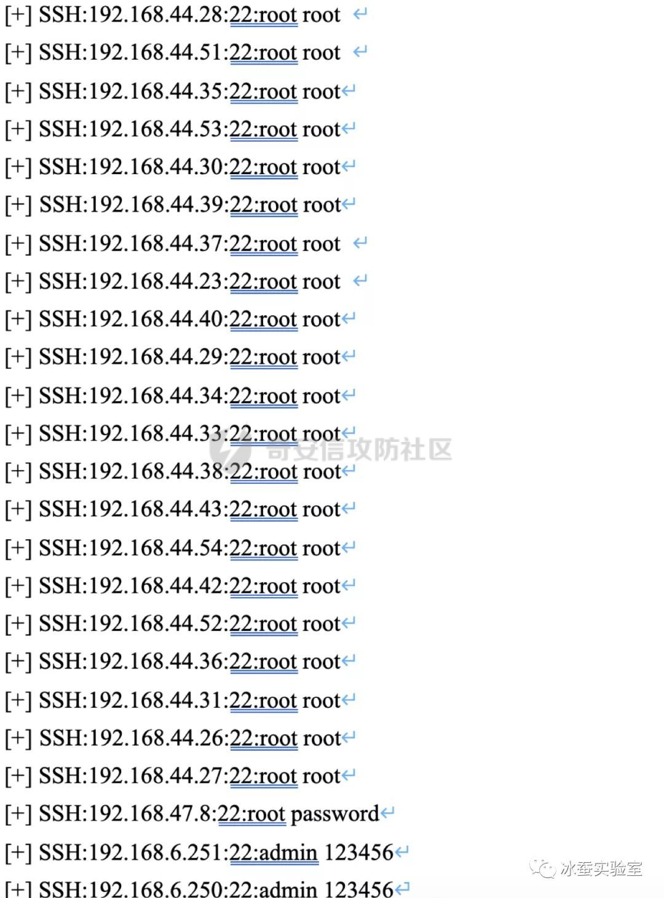
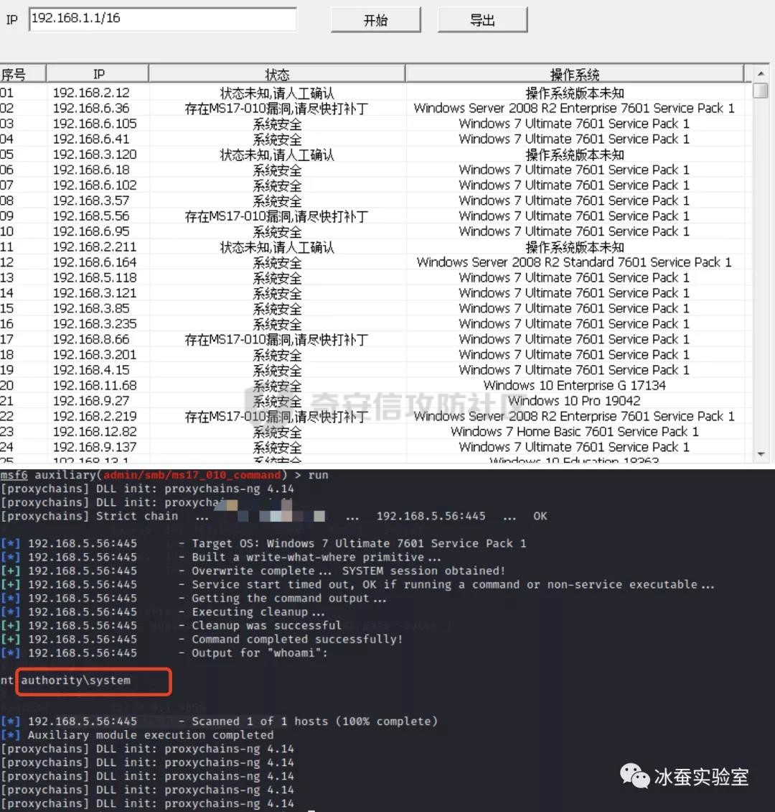
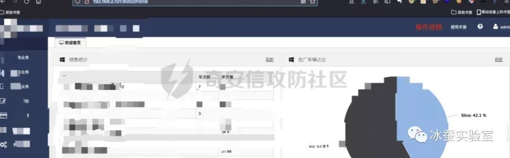
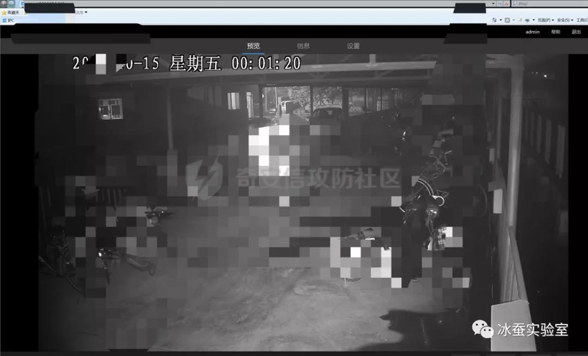

# 奇安信攻防社区-某攻防演练案例分享

### 某攻防演练案例分享

\# 写在前头 此次案列为某地方攻防演练的一个案例，目的分享一下笔者自己的渗透思路，不介绍过多的漏洞知识和其他实现原理，同时里面涉及的内容比较敏感，所以打码可能比较多。影响各位读者体验...

本文转载于公众号：冰蚕实验室

# 写在前头

此次案列为某地方攻防演练的一个案例，目的分享一下笔者自己的渗透思路，不介绍过多的漏洞知识和其他实现原理，同时里面涉及的内容比较敏感，所以打码可能比较多。影响各位读者体验，请谅解。

# 渗透路径说明

1.  通过旧版OA漏洞进入后台系统，获得管理员权限
2.  通过邮件发送进行第一次钓鱼，获得一些内部员工PC控制权限（上线极少，并无太多敏感信息）通过对上线的用户和旧版oa后台信息搜集，获得新版oa地址和新版oa存在默认口令
3.  利用搜集的信息登陆新版OA，获得新版OA用户权限（某部门管理层用户），登陆后通过guot账号获得新版OA堡垒机信息，但无法进入内网连接堡垒机
4.  遂进行第二次钓鱼，获得众多公司内部PC控制权限，进入内网
5.  对上线主机进行信息搜集，获得一些账号、密码，登陆内网系统，获得权限
6.  对内网存活主机、端口、服务进行收集，获得一些数据库、后台、主机系统权限

# 通达OA权限的获取

通达OA是一套办公系统。2020年04月17日, 通达OA官方在更新了一个v11版本安全补丁, 其中修复了一个任意用户伪造登录漏洞。该漏洞类型为任意用户伪造，未经授权的远程攻击者可以通过精心构造的请求包进行任意用户伪造登录。

漏洞利用POC：

[https://github.com/PeiQi0/PeiQi-WIKI-POC/blob/PeiQi/PeiQi\_Wiki/OA%E4%BA%A7%E5%93%81%E6%BC%8F%E6%B4%9E/%E9%80%9A%E8%BE%BEOA/%E9%80%9A%E8%BE%BEOA%20v11.x-v11.5%E4%BB%BB%E6%84%8F%E7%94%A8%E6%88%B7%E7%99%BB%E5%BD%95.md](https://github.com/PeiQi0/PeiQi-WIKI-POC/blob/PeiQi/PeiQi_Wiki/OA%E4%BA%A7%E5%93%81%E6%BC%8F%E6%B4%9E/%E9%80%9A%E8%BE%BEOA/%E9%80%9A%E8%BE%BEOA%20v11.x-v11.5%E4%BB%BB%E6%84%8F%E7%94%A8%E6%88%B7%E7%99%BB%E5%BD%95.md)

通过获取的cookie登陆后台系统，权限：管理员

由于该系统服务器上存在其他waf和杀毒，无法对其有效的getshell，随后只好利用信息搜集进行一波钓鱼。

# 第一次钓鱼+信息搜集

钓鱼方式采用邮件钓鱼，由于OA系统中无法直接使用邮件通信功能，之后伪造用户对通讯录内的人员进行钓鱼，后来因为OA是旧的OA系统，通讯录不全面，所以钓鱼效果并不是很好。

钓鱼信息大概为：经集团领导班子决定，我集团于2021年底进行薪资调整。。。。。。具体薪资调整的人群、调整范围、调整方法，请详细阅读附件中的文档。另有其他疑问，请联系企业人士部门。  

此时其实就可以挂代理打内网了，但是当时应该是在打别的点，也就先放这了，但是回过头要打的时候这几台服务器陆续掉线。无奈只能放弃（当拥有时，我没有珍惜；失去时才追悔莫及）

失去了这些主机，可以从其他信息入手，比如集团内新OA。先贴几张旧OA中收集到的一些其他敏感信息。

  

系统管理员还是挺贴心的，普通用户一看就懂。

# 新OA权限获取+信息搜集+第二次钓鱼

通过在通达OA上信息搜集，获取到关键消息，账号、密码和通讯录。使用通讯录上的用户信息登陆新oa后台

同样的OA内部信息搜集一波  

同样的OA内部信息搜集一波

同样的很贴心，但是没有一个shell，也无法进入内网。于是有了第二次钓鱼，此次钓鱼可以使用OA内部自带邮箱，发送邮件木马（这种方式尽量不要使用，因为很容易被发现）

钓鱼内容：对我集团违规员工的处罚通告

近期收到举报，发现我集团内部员工存在违法集团规定的行为，对我集团形象造成了极大影响，现对违规员工通报批评，并解除劳务合同。令其他员工，认真阅读通告内容，并引以为戒，集团对任何违规成员采取零容忍。

大致是这样的，记得不是很清楚了。贴张成果图  

有了内网主机，维持权限、挂代理；具体实现过程不说了，贴几张成果图吧

**堡垒机**  

**Linux主机**

**windows-ms17**

**ftp**

**web后台**

**监控**

# 总结

纵观整个渗透过程，除了初期打点使用了oa的漏洞以外，其他路径上用到的漏洞点非常少。其中信息搜集和钓鱼占绝大部分比重，仅靠搜集的信息便获取到了内网众多系统、服务器权限，并且拿下了集团内部OA系统的服务器权限。

简单的利用手段背后也侧面反映出企业在安全意识上面的脆弱性。企业在做内部安全建设时，不仅仅需要将服务器端主机端的漏洞修复，同时还要对员工进行安全意识普及，定时学习安全方面常识，严防被社工。
