# 奇安信攻防社区-某次实战代码审计出sql注入漏洞记录

### 某次实战代码审计出sql注入漏洞记录

某次项目中朋友拿到了一份web的源码让帮忙看下，通过审计发现多处注入，挑选一处记录一下

# 前言

某次项目中朋友拿到了一份web的源码让帮忙看下，通过审计发现多处注入，挑选一处记录一下

cms源码解压查看目录格式如下

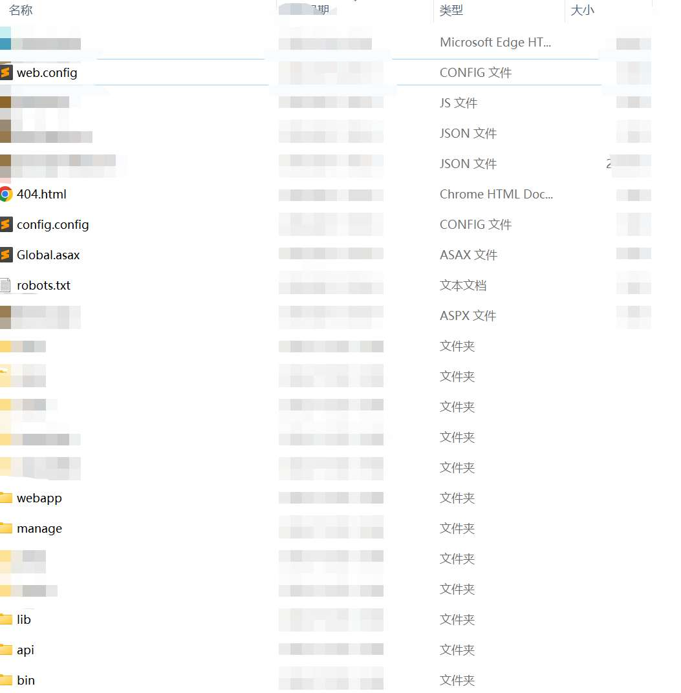

系统使用asp.net运行环境

故先来看看Global.asax和web.config文件

```php
PS:

Global.asax是一个文本文件,它提供全局可用代码。这些代码包括应用程序的事件处理程序以及会话事件、方法和静态变量。通常ASP.NET的全局过滤代码就是在这里面。

web.config是基于XML的文件，可以保存到Web应用程序中的任何目录中，用来储存数据库连接字符、身份安全验证等
```

Global.asax基本没有啥有效的信息，在web.config中发现了使用的URL Rewrite（URL Rewrite是截取传入Web 请求并自动将请求重定向到其他URL的过程）

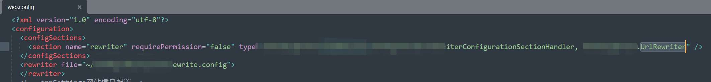


例如在处理请求/api/a/b/c之类的请求时，将其他转发给/api/a/b/c.ashx文件进行处理，通过测试目标站点时bp的history,找到代码位置


api目录下有三个目录，其中manage与user目录均需要登录，目标站点又没有注册的功能，也没找到注册的接口，故只能找找common中看有没有利用的点

/api

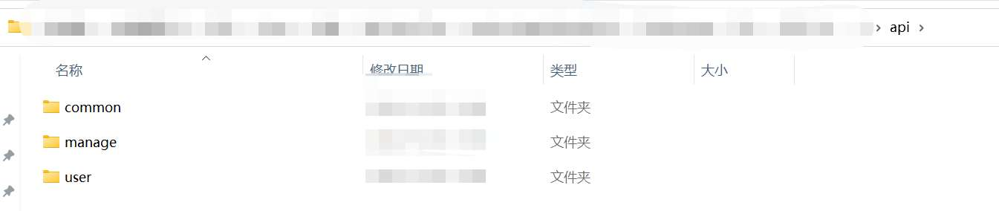

/api/user


/api/manager

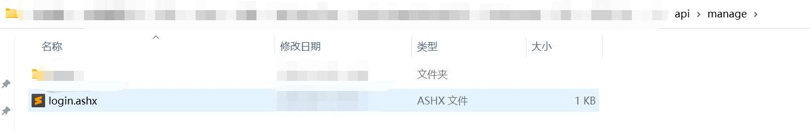

/api/common

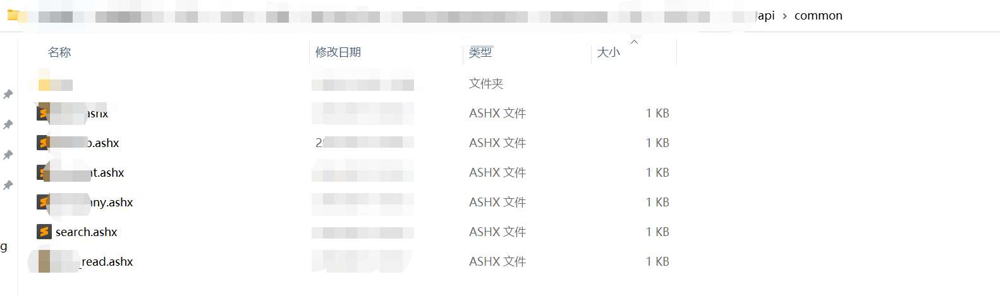

对其中的功能逐一分析，最终在search.ashx中发现漏洞，分析过程如下

首先了解下.net的必备知识

```php
ASPX.cs是页面后的代码，aspx负责显示，服务器端的动作就是在aspx.cs定义的。
.cs是类文件，公共类
.ashx是一般处理程序，主要用于写web handler,可以理解成不会显示的aspx页面，不过效率更高
dll就是cs文件编译之后的程序集，一般在/bin目录下
```

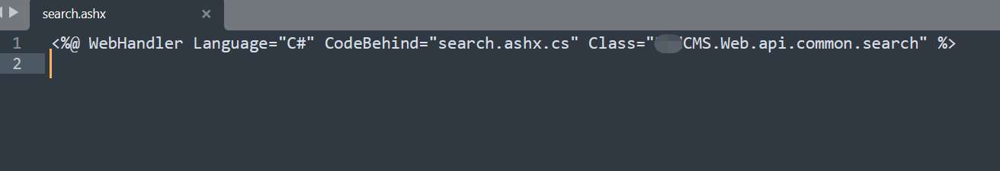

通过查看search.ashx，发现其后端代码位置在xxxxcms.web.dll中

将api/bin/xxxxcms.web.dll放入dnspy中，查看代码


ProcessRequest()方法中，获取url中action的值，当其为search\_tip时，调用GetsearchTip()方法，否则返回请求无效

跟进GetsearchTip()方法


使用PostTagValue()方法获取并处理post请求包请求体中val参数的值，接着使用UnEscape()方法对其进行处理

同时判断了请求体中types的值如果为空则设置为“content”

最后将val参数拼接到了condition数组中，执行ResultSet方法，分析发现ResultSet方法经过多次重载后最终将condition数组中的值未过滤拼接后调用“SelectRecords”存储过程带入数据库中执行查询

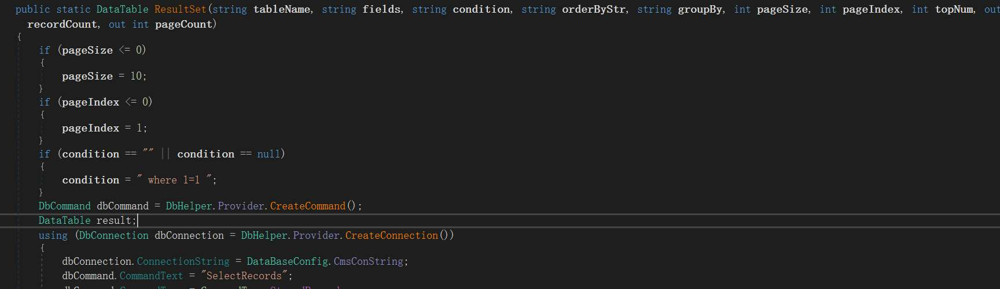

SelectRecords存储过程(可以在源码中的数据库安装文件install.sql中找到)

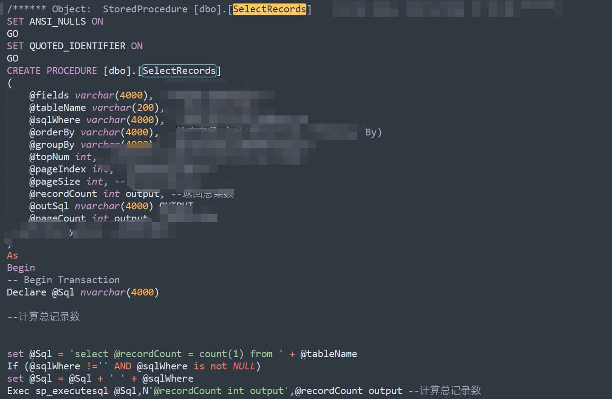

所以只要我们的传参经过PostTagValue()和UnEscape()处理后没有被拦截，那么此处至少是存在一个sql注入的

接着着重看这俩方法做了什么

其中PostTagValue()函数跟进发现为过滤函数

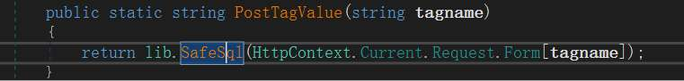

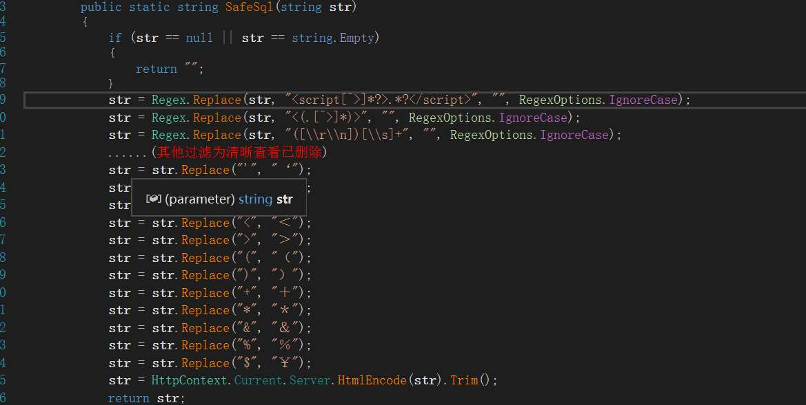

过滤了单引号等大量危险字符等之后返回，本来看到这以为基本凉凉了

接着经过UnEscape()函数处理


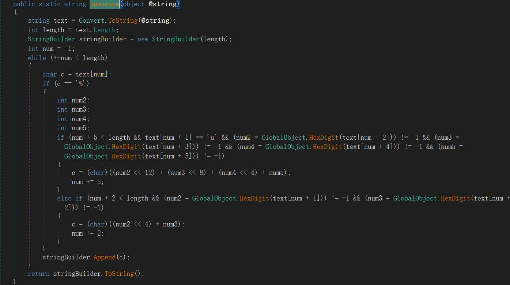

​ 该方法会遍历输入字符串的每个字符，如果遇到 '%' 字符，则会判断后面的字符是否符合转义字符的格式。

-   如果字符 '%' 后面紧跟着字符 'u'，并且接下来的四个字符都是有效的十六进制数字，则将这五个字符解析为一个 Unicode 字符，并将其添加到 StringBuilder 中。（unicode解码，不过识别的是%u开头，而不是\\u开头的）
-   如果字符 '%' 后面紧跟着两个有效的十六进制数字，则将这两个字符解析为一个字符，并将其添加到 StringBuilder 中（url解码）

​ 是的，就是这么抽象，这个解码的操作居然放在了过滤函数的后面，那么就可以利用该函数的解码操作，将数据先编码绕过PostTagValue()其中的危险字符检查，再经过UnEscape()解码直接拼接sql注入的payload。

​ 那么就可以通过将sql语句进行url编码&&unicode编码（并将反斜杠替换为%号）进行绕过关键字的检测。

​ 值得注意的是，当使用Content-Type:为application/x-www-form-urlencoded的请求体进行传参的时候，后端会默认先对请求体进行一次url解码，所以当我们直接把sql语句unicode编码一次，并将反斜杠替换为%号，并不能执行成功


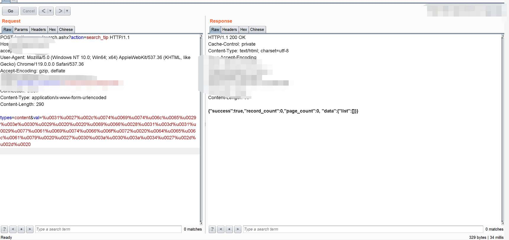

因为此时后端先将请求体进行了url解码，把其中的百分号当成url编码的百分号了

只需再将数据url编码一次即可

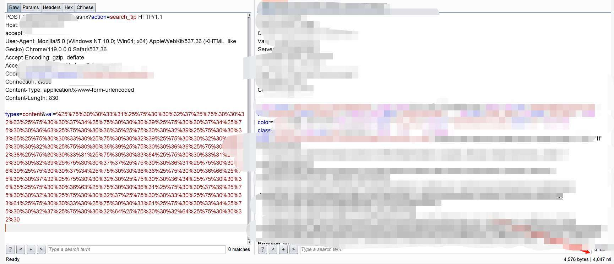

当然，post请求的传参往往可以将请求体改成上传格式的来绕过一些过滤不严格的waf,此处发现该系统也同样可以接收并处理上传格式的数据，由于上传格式的请求体并不会默认url解码一遍，所以利用上传格式的数据包直接将语句进行url编码&&unicode编码（并将反斜杠替换为%号）即可

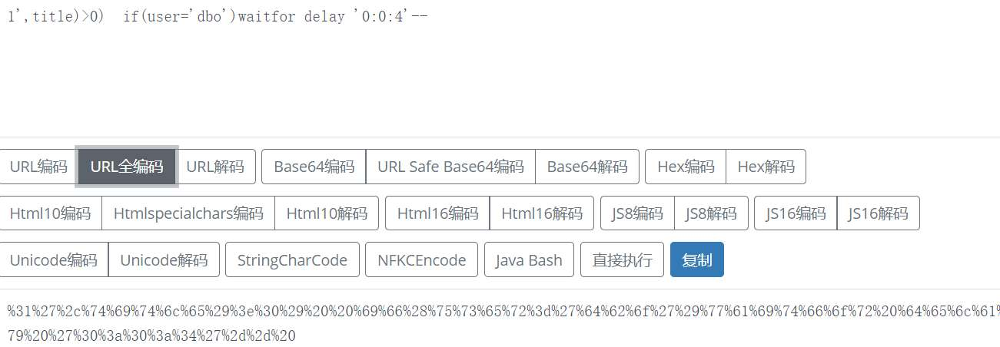

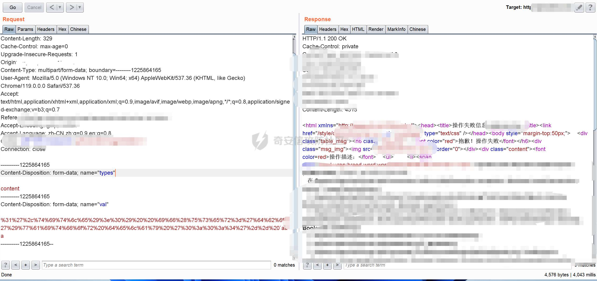
