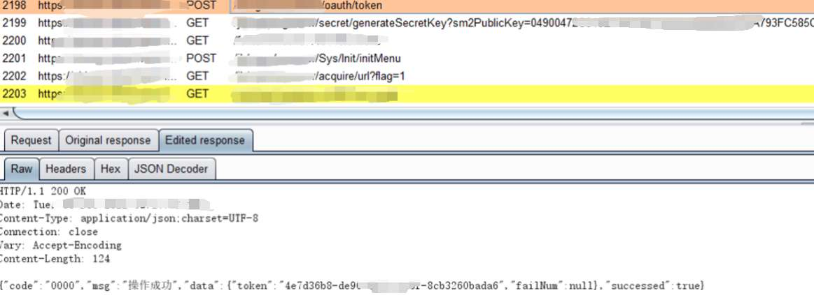
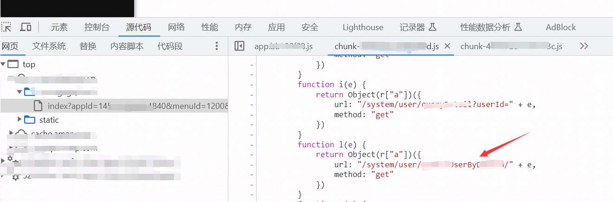
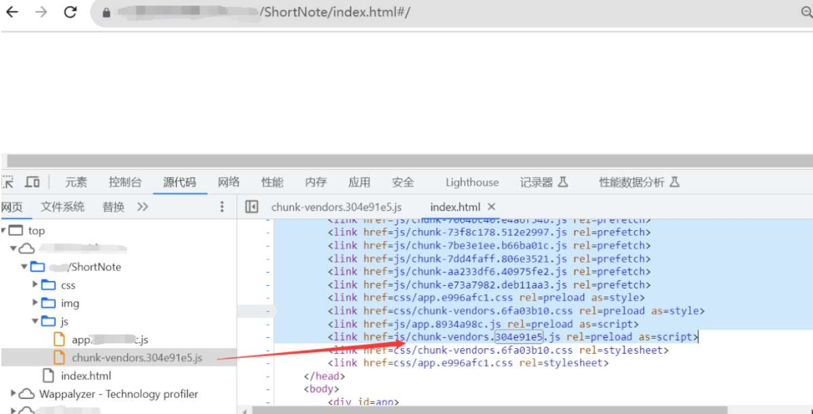
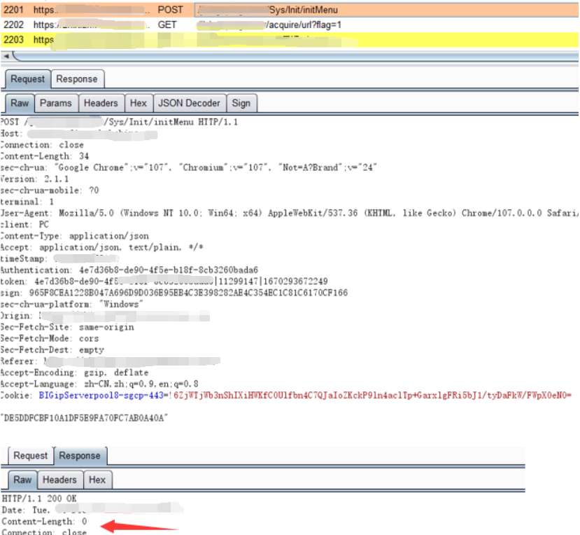
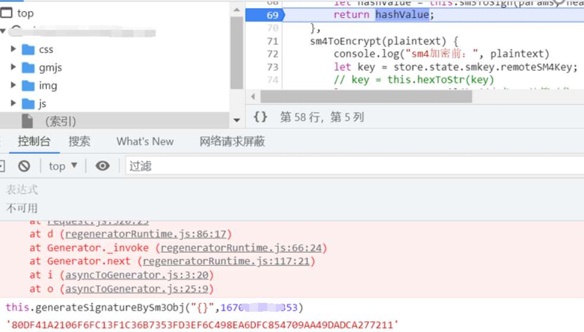
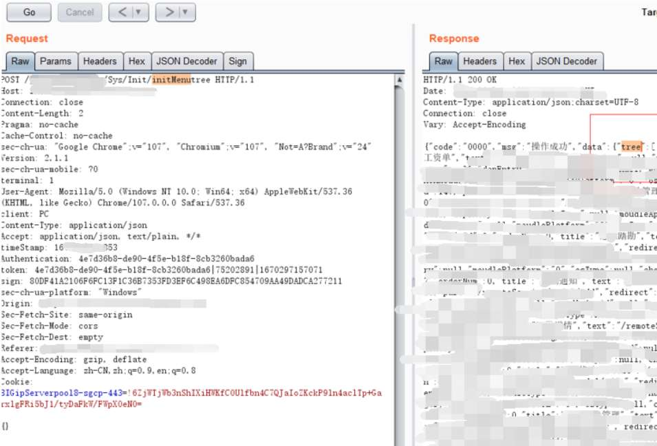
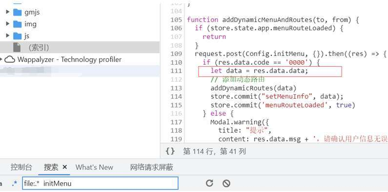
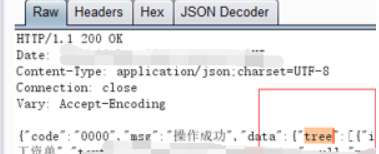
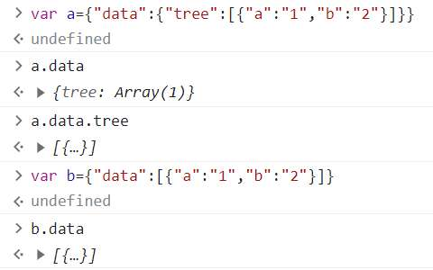

# 奇安信攻防社区-某次测试从前台登录页到渲染后台功能

### 某次测试从前台登录页到渲染后台功能

某次测试目标仅给了一个后台系统

某次测试目标给了一个后台系统

# 1.后台权限获取

打开一看，平平无奇的后台系统，也没有提供测试账号，爆破了一番弱口令未果，尬住。

也遇到过很多这种只有一个登录页面且没有账号的情况下，想了想为了以后测试起来效率高一点，总结了下经验大概有这么几种思路去获取后台权限。

1.爆破常见弱口令

2.寻找是否有硬编码的账密

3.分析js中登录逻辑的判断，是否为前端认证（例如依赖返回包中的某个字段值）或者是否有认证缺陷（例如只要有某某header就行）

4.获取其他登录角色/登录体系的认证字段，看认证是否共用能否越权（例如同系统下的普通用户角色和机构用户角色/前台可注册的用户和后台用户等）

5.寻找是否有隐藏的注册点，直接注册

6.js寻找敏感接口，对接口尝试访问利用

7.登录口尝试注入，注出账号密码或者使用万能密码登录

8.中间件/组件漏洞

最终收集到一个与web系统同名的微信小程序，发现域名和认证的字段用的都是同一个，直接尝试微信小程序手机号快捷登录接口获取的返回包替换web后台登录接口的请求返回包，成功登录。

成功触发了后台请求

但是浏览器页面上是空的，啥也没有。

# 2.获取后台接口

这种登录后空页面的情况，一般都是账号权限不够导致后端没有返回高权限接口的数据导致前端无法正常渲染页面导致的。

## 2.1 js翻找接口

最常规的测试思路当然就是去翻js里面的接口了，虽然账号权限不足没有功能页面，但是很多情况下js里面是含有后台高权限的接口的，可以直接尝试构造参数访问利用。

翻js也是有讲究的，js里找接口大家都知道，但是有一点要注意的是翻的js全不全。

例如下面这个例子，默认的页面只加载了部分js

对已加载的接口名进行搜索，发现其实还是有很多js没有加载出来的，收集一下，写个脚本批量请求把js全部加载出来，便能测试到更多的接口。

这种方式简单无脑，但弊端是如果部分接口的传参没有直接写在js里，导致就算拿到了接口构造参数也比较麻烦。

## 2.2寻找接口文档

接口文档往往包含全部的接口以及参数信息，拿到后测试起来比较方便。

除了fuzz类似swagger这种组件的接口文档以外，还可以观察下登录的数据包，看加载菜单的接口的名称，寻找名称与其类似的。

例如登录后获取菜单的请求url为loadlist,则可以搜索js中有没有adminlist,getlist等相关接口，也可以拿到接口信息。这样替换其返回包就可以在页面上渲染出功能点来测试了。

回到我们遇到的情况，分析得出是该接口返回为空导致页面没有东西的

从接口名称“initMenu”也可以知道这是一个获取功能菜单的接口，返回为空，所以导致页面上没有任何功能点。

先看看这个接口的传值是啥

浏览器寻找并打上断点获取明文（断点调试网上文章很多了不再赘述）

可以看到传的值也是空的，那么改请求参数获取更多返回基本是行不通了。

尝试全局搜Menu的菜单的关键字寻找是否有其他菜单有关的接口，发现了一处Menutree接口，应该是有全部功能页面数据的！

直接访问返回400，没关系，模仿initMenu接口的请求包和传值post访问下（数据包有签名断点调试生成即可，测试时一开始忘了加密body了，没想到后端也可以正常处理==）

成功得到了菜单页面的数据，复制该返回包，登录我们的账号，替换到initMenu这个请求的返回包中应该就可以出现功能页面了。

但是失败总是贯穿人生始终，返回的页面还是空的。

# 3.生成功能页面

继续分析js对initMenu接口的返回的处理

原来页面生成时，取的是res.data.data

而initMenutree接口返回的我们需要的值在res.data.data.tree中，所以前端渲染不了。

如下修改一下字段就好

替换后成功生成功能页面

后续抓包测试，发现多处垂直越权及其他漏洞，较为常规不再赘述。
