# 奇安信攻防社区-某系统模板注入分析

### 某系统模板注入分析

某系统前阵子公开了模板注入的漏洞，漏洞点在于程序对传入的sql语句处理时使用了freemarker模板渲染导致的问题。代码对该接口传参的处理先经过sql关键字的过滤，且分析中发现了一处可用的sql注入的payload,故先从sql注入开始介绍。

# 某系统模板注入漏洞分析

某系统前阵子公开了模板注入的漏洞，漏洞点在于程序对传入的sql语句处理时使用了freemarker模板渲染导致的问题。代码对该接口传参的处理先经过sql关键字的过滤，且分析中发现了一处可用的sql注入的payload,故先从sql注入开始介绍。

# 1.sql注入

下载源码后导入idea运行（使用mysql数据库）

先来看一眼公开的模板注入的payload，传参的字段和接口名称让人不免怀疑此处是否还有sql注入，于是看看接口逻辑

```php
POST /jeecg-boot/jmreport/queryFieldBySql HTTP/1.1
Host: localhost:8080
Content-Type: application/json
Content-Length: 100

{"sql":"select '<#assign value=\"freemarker.template.utility.Execute\"?new()>${value(\"whoami\")}'"}
```

反编译漏洞依赖包后导入idea，全局搜索queryFieldBySql定位漏洞代码如下

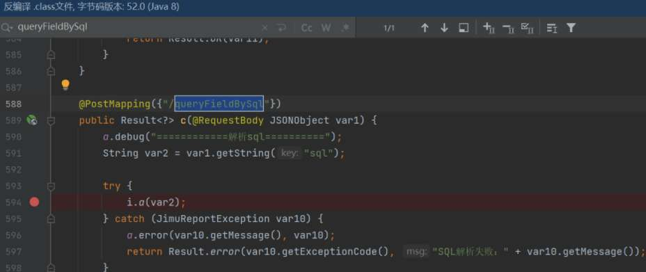

打上断点，bp发送payload({"sql":"select 1 from demo"})，开始调试

进入i.a()方法

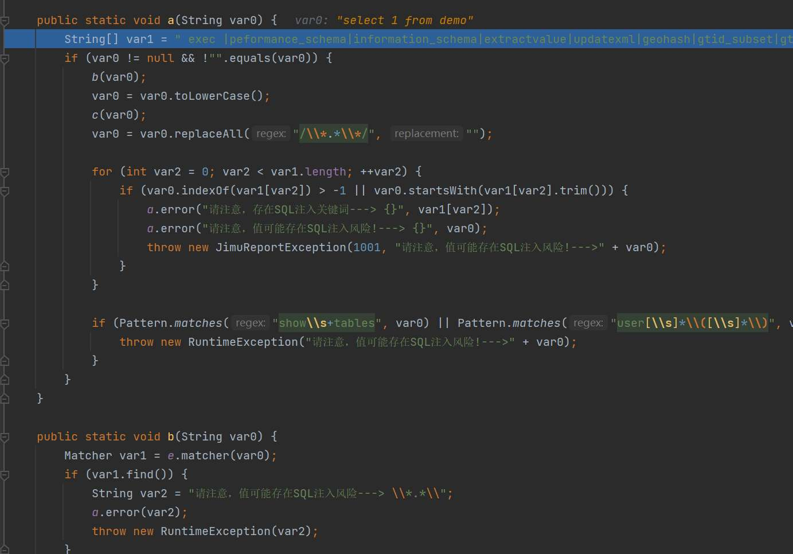

定义了黑名单的sql关键字

String\[\] var1 = " exec |peformance\_schema|information\_schema|extractvalue|updatexml|geohash|gtid\_subset|gtid\_subtract| insert | alter | delete | grant | update | drop | chr | mid | master | truncate | char | declare |user()|".split("\\|");

先调用b()方法匹配是否存在内联注释，在把传入的值全部转化为小写，在调用c（）方法判断是否有sleep()函数的关键字，接着挨个和黑名单数组中的关键字逐一匹配，匹配到了则拦截并抛出异常

接着经过一大段基础配置的调用来到此方法，步入


又初始化了一些基本配置，由于此处paramArray传入为空，来到如下函数

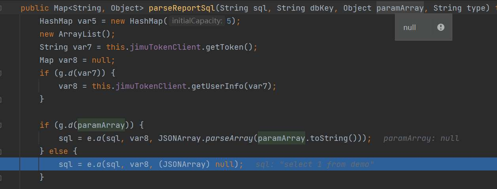

跟进

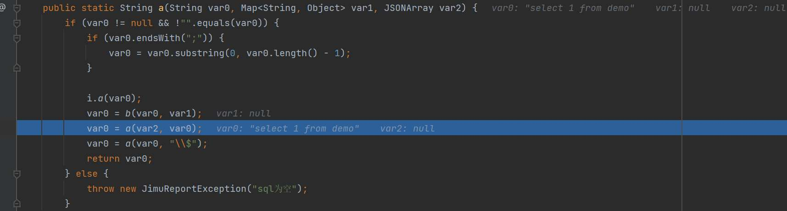

步入发现函数去除了传入参数末尾的分号（如果有的话），又进行了一遍i.a()方法的拦截sql关键字。后由于传入var1为空，直接进入

var0 = a(var2,var0)


正则匹配 ”${“ 和 “}“ 之间的字符串存入hashmap中，我们的注入的payload此次明显是匹配不到的，接着进到如下方法


freemarker模板的方法，此处分析sql注入，暂时跳出

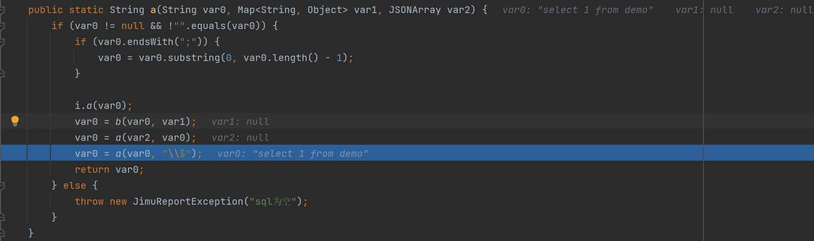

跟进

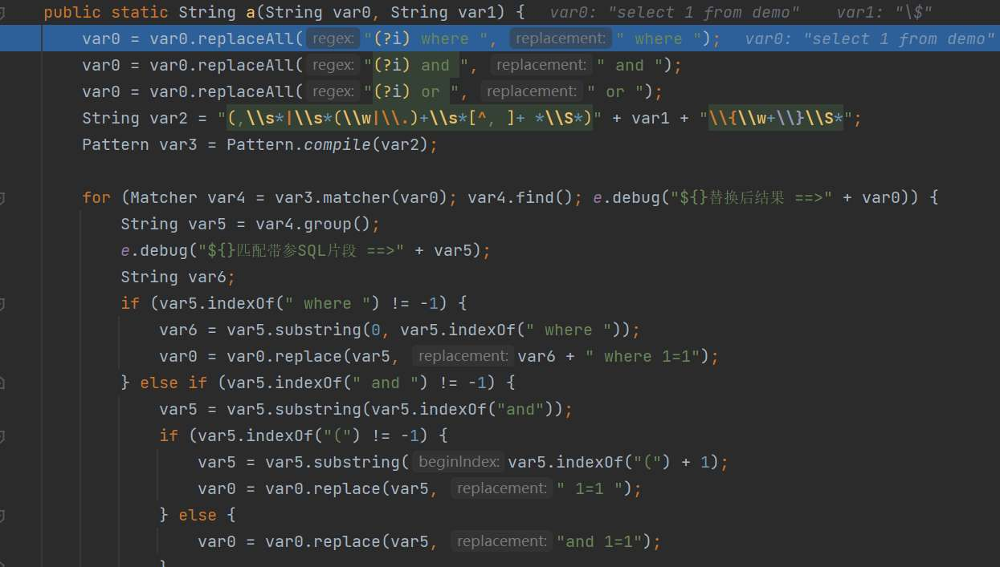

又是一些处理sql拦截的代码，匹配诸如 where/and/or/=等字符进行相应的过滤，接着回到此处向下执行


最终调用jeeecg的minidao层服务执行sql语句

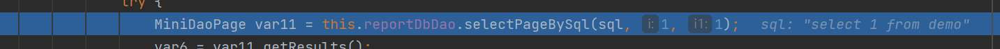

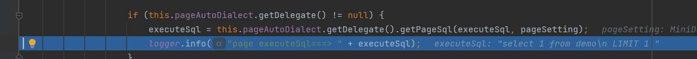

分析下来发现程序对sql的传参基本只做了黑名单过滤，但是其中漏掉了exp()函数关键字的匹配，使用exp()函数即可实现报错注入


# 2.模板注入

接着分析上面提到的调用freemarker函数的地方，我们的payload “sql”参数的值作为var1 传入

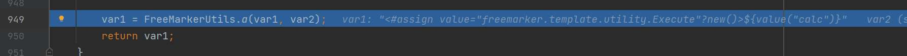

跟进函数调用，默认var0为空，进行一些初始化后来到如下函数

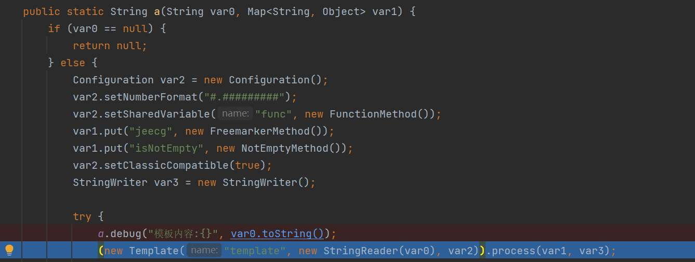

创建一个名为"template"的模板对象，使用模板对象对var1和var3进行处理，故跟进process()方法

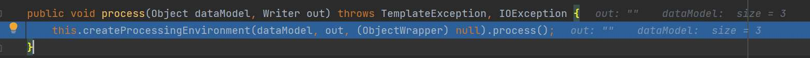

继续跟进process()

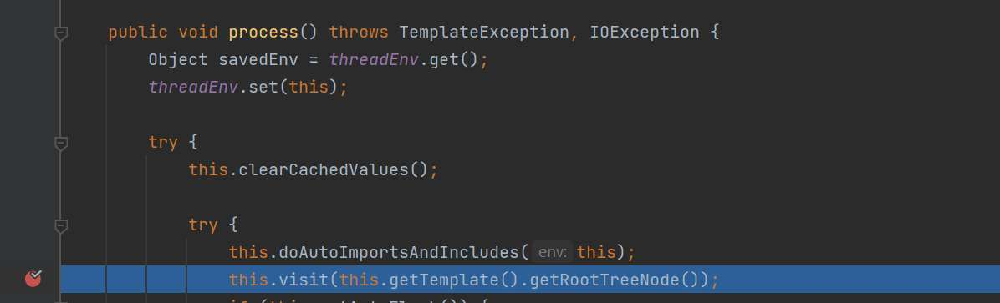

跟进this.visit(this.getTemplate().getRootTreeNode())

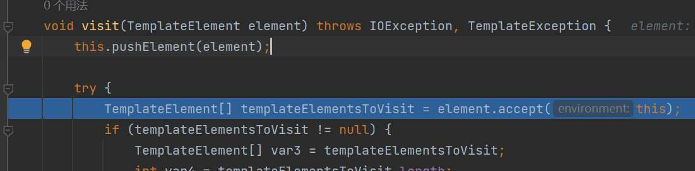

accept()方法匹配到ftl表达式，将插值和插值的传参赋值给templateElementsToVisit

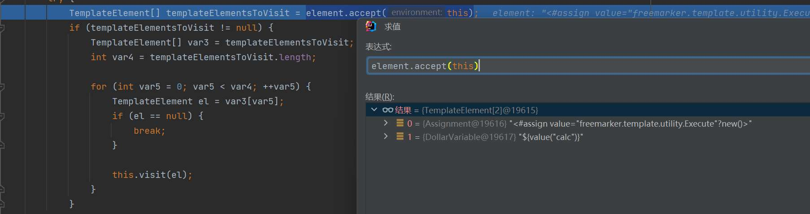

而后第一次调用this.visit(el)；（el此时为freemaker表达式中的插值，即“<#assign value=\\"freemarker.template.utility.Execute\\"?new()>”），顺带提一下，在freemarker模板中，<#assign value=\\"freemarker.template.utility.Execute\\"?new()>语句可以创建一个继承自 freemarker.template.TemplateModel 类的变量

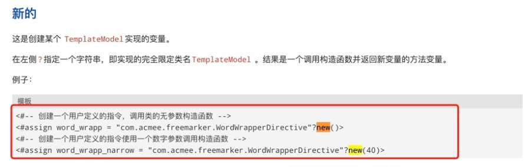

继续跟进一系列方法到此处

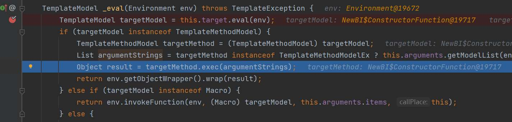

经过freemaker处理ftl语句后

targetMethod就是构造的ftl语句中传入的需要使用的命令执行的类freemarker.template.utility.Execute

即freemarker.template.utility.Execute.exec(argumentStrings),当然此处argumentStrings的值为空，还没有真正命令执行

接着进入visit()的第二次调用，传入ftl语句中插值的赋值，即“${value(\\"calc\\")}”

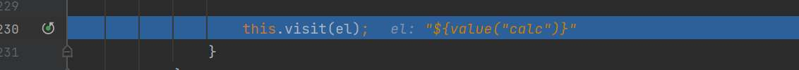

接着进到关键调用exec(),将获取到的ftl语句中value的值传入

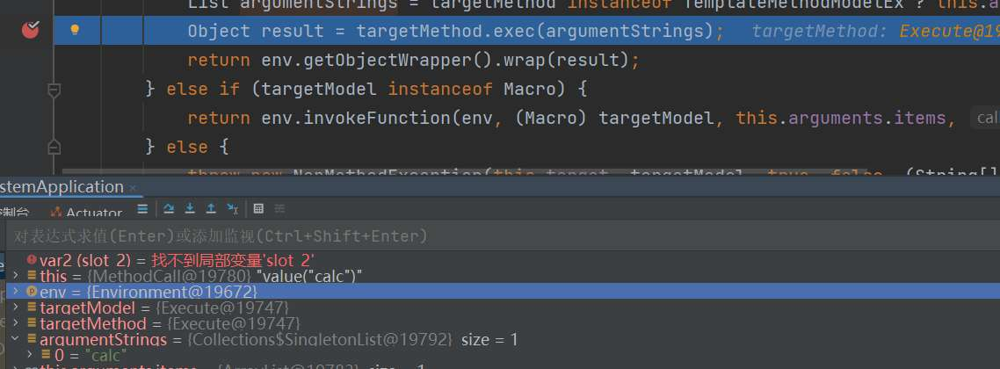

跟进exec()方法使用系统命令执行我们ftl语句中对value的赋值

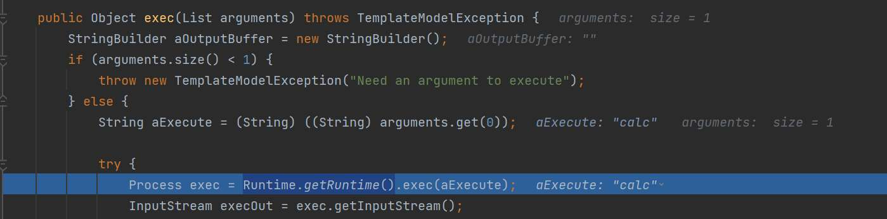

# 3.修复

目前官方在最新版本使用了

setNewBuiltinClassResolver(TemplateClassResolver.SAFER\_RESOLVER)


禁用了freemarker模板注入中常用三个类的解析


