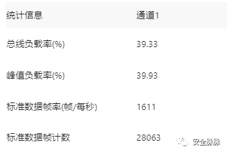
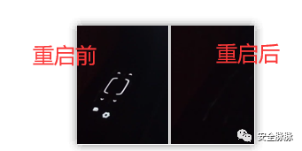

# 奇安信攻防社区-汽车CAN总线-02 攻击

### 汽车CAN总线-02 攻击

“ 免责声明：本文涉及到的所有技术仅用来学习交流，严禁用于非法用途，未经授权请勿非法渗透。否则产生的一切后果自行承担！一旦造成后果请自行承担！如有侵权烦请告知，我们会立即删除并致歉，谢谢！” 本专题文章将分为三部分： 介绍、攻击、演示，本文为第二部分汽车CAN总线攻击 。

针对汽车CAN总线的攻击方式多样，其中重放攻击、DoS攻击、UDS探测和模糊攻击是比较常见的几种。下面我会详细介绍这些攻击类型：

### **重放攻击 (Replay Attack)**

在重放攻击中，攻击者捕获车辆CAN总线上的有效数据包，然后在不同的时间重新发送这些数据包，目的是重现或篡改车辆的正常行为。

重放攻击可以测试当前被测对象是否有做关于数据来源真实性校验的安全防护措施，若没有则被测对象将会执行恶意重放报文的控制行为。现在车辆大多有做网关隔离，OBD 口收不到敏感的CAN报文，一般用于从其他点获得零部件权限，在域内抓取控车CAN报文，这里会涉及逆向分析can报文，一般用二分法逆向。

### **DoS攻击 (Denial of Service)**

CAN总线的Dos攻击方式可以分为以下几种：

**（1）过载Dos攻击**

在总线发生大量数据包造成总线过载，进行攻击。

图1 DoS攻击时总线负载率图

**（2）优先级Dos攻击**

根据CAN总线仲裁机制，消息ID越小优先级越高，越优先处理。利用这一特性，构造大量高优先级ID的消息到总线上，造成总线阻塞，实现Dos攻击。

**（3）远程帧Dos攻击**

对单个ECU发送大量远程请求帧，使目标ECU无法处理正常消息，实现Dos攻击。

**（4）错误帧Dos攻击**

利用CAN总线错误帧机制，构造一些可以导致总线错误的报文，如位错误，当错误报文帧达到一定次数后，总线将进入busoff状态，关闭并拒绝服务，实现Dos攻击。

### **UDS探测 (Unified Diagnostic Services)**

UDS诊断协议是在汽车电子ECU环境下的一种诊断通信协议。UDS报文与普通报文不同，通常情况下在CAN总线中不会存在大量的UDS报文；当用户需要对ECU请求服务时，才会向CAN总线发送UDS报文，在接收到UDS报文后，ECU会以相应的正响应或负响应进行回复，可以将这一过程理解为一种问答式的通信方式。基于这种问答式的通信，用户可以在CAN总线上实现基于ISO 14229协议中的许多服务，如诊断会话控制服务、通过ID读数据服务、暴力破解安全访问服务，进一步得到用户或者厂家的私密信息。

### **模糊攻击 (Fuzzing Attack)**

模糊攻击是一种通过发送随机或异常CAN数据到车辆系统，以发现未知漏洞的方法。

例如对车辆can总线开始fuzz，发现某数据会使车辆左侧门控重启

