# 奇安信攻防社区-浅谈SpringWeb中获取当前请求路径的方式

### 浅谈SpringWeb中获取当前请求路径的方式

在实际业务中，为了防止越权操作，通常会根据对应的URL进行相关的鉴权操作。浅谈SpringWeb中获取当前请求路径的方式。

# 0x00 前言

在实际业务中，为了防止越权操作，通常会根据对应的URL进行相关的鉴权操作。

例如下面的例子使用了SpringSecurity来实现了鉴权/认证的流程。对于/admin下的路由必须拥有ADMIN角色才能访问，除了login接口以外，所有的接口都必须经过登陆认证才能访问。

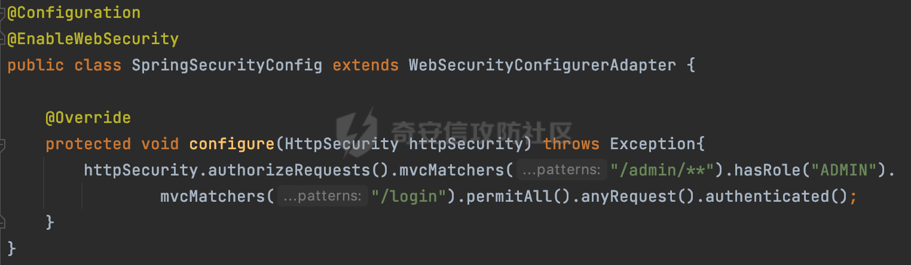

但是，SpringSecurity有一定的使用成本。很多时候开发者可能会选择使用自定义的filter或interceptor来实现相应的权限控制。这样可以更灵活地定制对应逻辑，适应项目的特定需求。实现方式也可能更轻量级，对于一些小型项目或特殊需求而言，可能更加合适。减少了开发和维护的成本。最常见的就是就是通过获取当前请求URL，然后根据对应的白名单以及权限控制表进行匹配，完成对应的鉴权功能。

# 0x01 常见的权限绕过案例

一般情况下，自定义的filter或interceptor来实现相应的权限控制通常是获取到当前URI/URL，然后跟需要鉴权的接口进行比对，或者直接结合startsWith()或者endsWith()方法，设置对应的校验名单。例如下面的例子：

以/login开头的不需要校验(登陆接口每个人都可以访问)，所有.do/.action结尾的接口均需要做登陆检查，防止未授权访问：

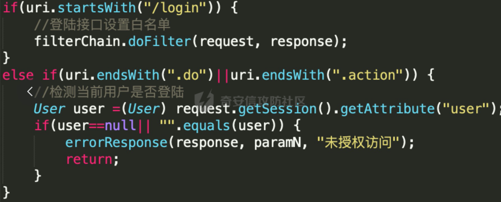

若获取到的uri没有进行一些规范化的处理，那么结合下面Spring Web URL匹配的一些特性，可能会存在绕过鉴权措施的风险。

## 1.1 Spring Web URL匹配特性

下面是Spring在URL匹配时的一些特性，更具体的分析可见[https://forum.butian.net/share/2209](https://forum.butian.net/share/2209)

### 1.1.1 SuffixPatternMatch（后缀匹配模式）

使用PathMatchConfigurer.setUseSuffixPatternMatch(Boolean suffixPatternMatch)设置是否使用后缀匹配。Spring Boot下默认是false。

**若设置为true则路径/xx和/xx.\*是等效的**。

```Plaintext
/detail
/detail.aaa 
```

在之前版本默认设置为true，5.3后相关useSuffixPatternMatch的默认值会由true变为false,[https://github.com/spring-projects/spring-framework/issues/23915](https://github.com/spring-projects/spring-framework/issues/23915) 。高版本使用PathPattern解析时不再受该属性影响。

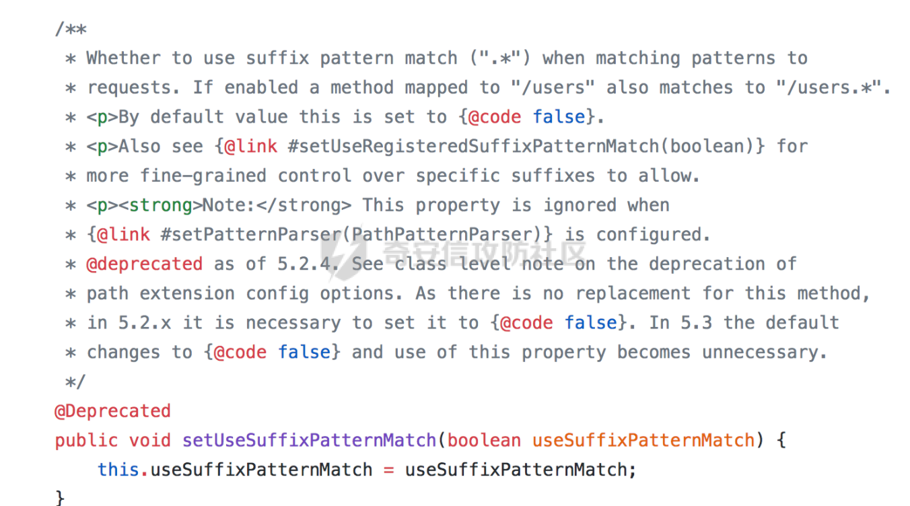

### 1.1.2 TrailingSlashMatch（结尾匹配模式）

使用PathMatchConfigurer.setUseTrailingSlashMatch(Boolean trailingSlashMatch)设置是否使用尾随斜线匹配。

**若设置为true，则路径/xx和/xx/等效**，Spring MVC下默认是开启的。

高版本使用PathPattern解析时，在最后会根据matchOptionalTrailingSeparator（此参数为true时，默认为true）进行一定的处理，如果Pattern尾部没有斜杠，请求路径有尾部斜杠也能成功匹配（类似TrailingSlashMatch的作用）。

```Plaintext
/admin/info.do?param=value
/admin/info.do/?param=value
```

### 1.1.3 alwaysUseFullPath

当Spring Web< 5.3.x 时，在路由匹配时会进行路径标准化（使用getPathWithinServletMapping处理），包括对%2e解码，将//替换为/以及处理跨目录等。

而5.3.x版本会使用getPathWithinApplication进行处理：

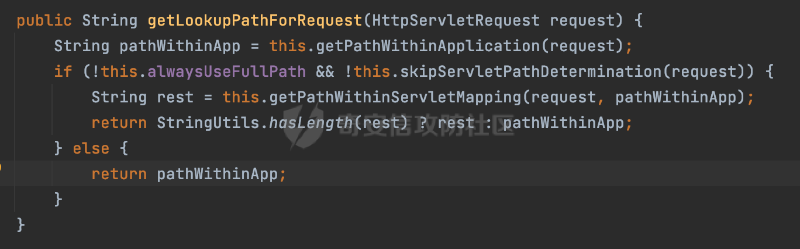

getPathWithinApplication主要通过request.getRequestURI()方法获取当前request中的URI/URL，除了简单的url解码，处理`;`以及多个`///`外，并不会对类似`../`跨目录请求进行处理。

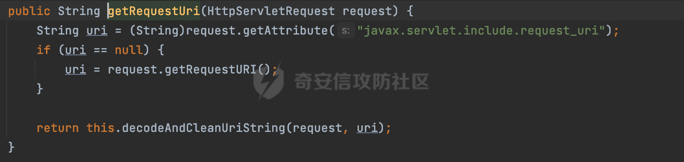

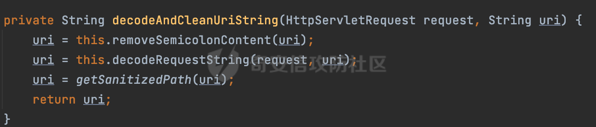

### 1.1.4 AntPathMatcher和PathPattern的区别

SpringWeb在解析时会在在initLookupPath方法中初始化请求映射的路径，而AntPathMatcher和PathPattern两种解析模式是不一样的：

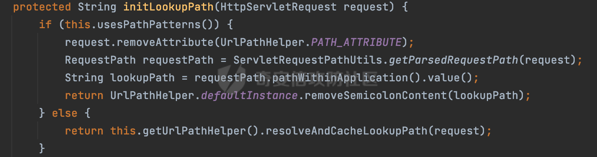

使用AntPathMatcher的话会调用resolveAndCacheLookupPath进行处理，这里会调用getLookupPathForRequest方法，根据alwaysUseFullPath的值进行不同程度的路径净化处理：

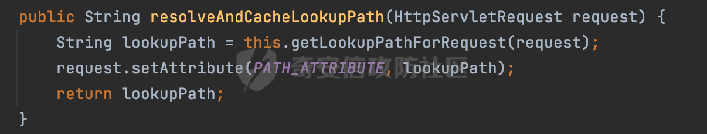

而当使用PathPattern时，仅仅只是调用removeSemicolonContent移除URL路径中分号之后还有移除URL路径中的JSESSIONID参数：

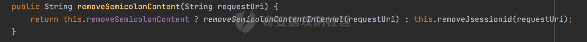

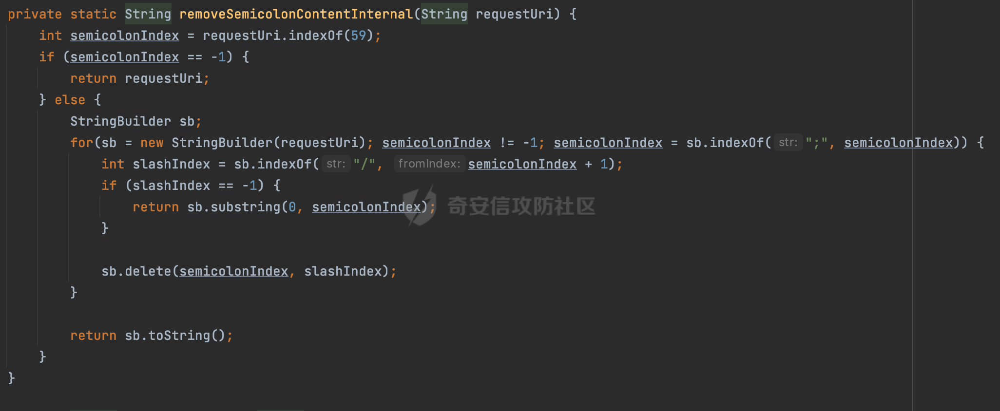

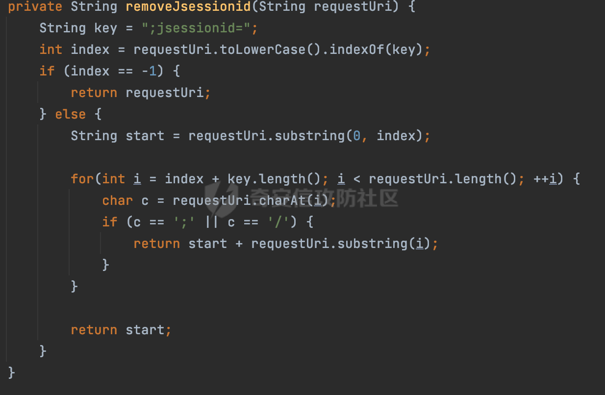

但是在后面进行Controller匹配时，会对路径中的URL编码进行解码操作：

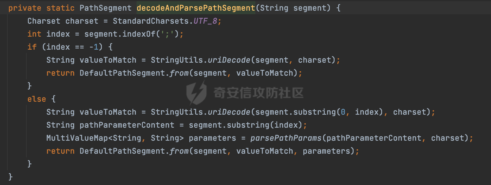

也就是说，对于URL编码以及`;`相关的内容，PathPattern模式还是可以处理的。

结合Spring Web URL匹配的特点，同样是上面的例子，若获取到的请求路径没有经过规范化处理的话，下面是一些常见绕过的方式：

-   若能解析路径穿越符的话，类似/login/../xx.do的请求即可绕过
-   可以结合URL编码的方式，类似/xx.%64%6f（do的url编码）的请求即可绕过
-   使用分隔符，类似/xx.do;
-   结合结尾匹配模式，类似/xx.do/的请求即可绕过
-   ......

# 0x02 获取当前请求路径的方式

前面提到了，在实际的鉴权组件中，通常会获取当前请求的路径进行操作。获取到的请求路径没有经过规范化处理的话，结合对应的鉴权逻辑（白名单，模式匹配等）可能存在绕过的风险。在SpringWeb中，一般获取当前请求路径主要有以下方式

-   通过`javax.servlet.http.HttpServletRequest`来获取请求的上下文
-   SpringWeb中自带的方法

下面详细看看具体的请求方式以及可能存在的风险：

## 2.1 使用javax.servlet.http.HttpServletRequest

### 2.1.1 request.getRequestURI()&request.getRequestURL()

这两个方法是开发者最常用的，都是在在Java Servlet中用于获取客户端请求的URL相关信息的方法。只是两者返回的信息会有不同：

-   request.getRequestURI会返回一个包含请求的URI的字符串。URI是指统一资源标识符，包括请求的路径和查询参数，但不包括请求的协议、主机和端口。
-   request.getRequestURL会返回一个StringBuffer对象，包含客户端请求的完整URL，包括协议、主机、端口、路径和查询参数。

但是两者均没有对获取到的path进行归一化处理,以request.getRequestURI为例，可以看到：


-   没有对类似../等进行规范化处理
-   使用&连接的参数键值对是获取不到的，但是参数分隔符（;）及内容是可以获取到的
-   不会对URL进行解码操作

这种情况下获取到的path是存在风险的，结合前面提到的方法在某些场景下可以绕过现有的鉴权措施。


### 2.1.2 request.getServletPath()&request.getPathInfo()

-   `getServletPath()` 方法返回请求的Servlet路径。Servlet路径是请求的相对于上下文根的部分，不包括任何额外的路径信息。这个方法通常用于获取处理请求的Servlet或Controller的路径。
-   `getPathInfo()` 方法返回与请求关联的额外路径信息。额外路径信息是请求URL中Servlet路径之后的部分。它通常用于提取额外的路径参数或信息。

两者一般配合使用：

```Java
request.getServletPath()+(request.getPathInfo()==null? "" : request.getPathInfo())
```

跟前面通过request.getRequestURI的方式获取请求路径做对比，获取到的请求path为/index，可以看到这里进行了一定的规范化处理，对path进行了解码，处理了分隔符以及路径穿越符：


### 2.1.3 其他

HttpServletRequest更多的API使用可以参考：[https://stackoverflow.com/questions/4931323/whats-the-difference-between-getrequesturi-and-getpathinfo-methods-in-httpservl](https://stackoverflow.com/questions/4931323/whats-the-difference-between-getrequesturi-and-getpathinfo-methods-in-httpservl)

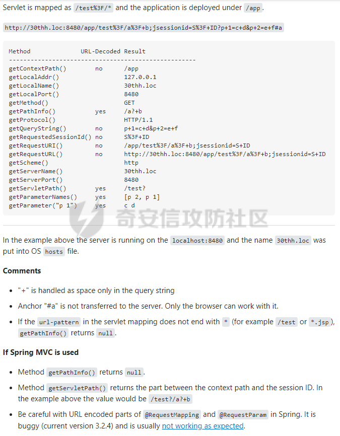

## 2.2 SpringWeb中自带的方法

下面看看SpringWeb中自带的获取请求路径的方法,一般会配合拦截器interceptor使用：

### 2.2.1 ServletRequestPathUtils

`org.springframework.web.util.ServletRequestPathUtils` 是 Spring Framework 提供的一个工具类，用于处理`ServletRequest`（通常是`HttpServletRequest`）的请求路径信息。主要用于从请求中获取有关路径的信息，并提供了一些方法来处理和解析路径：

```Java
ServletRequestPathUtils.getCachedPath(request)
```

使用getCachedPath获取请求路径实际上是从UrlPathHelper的PATH\_ATTRIBUTE或者是ServletRequestPathUtils的PATH\_ATTRIBUTE属性获取：

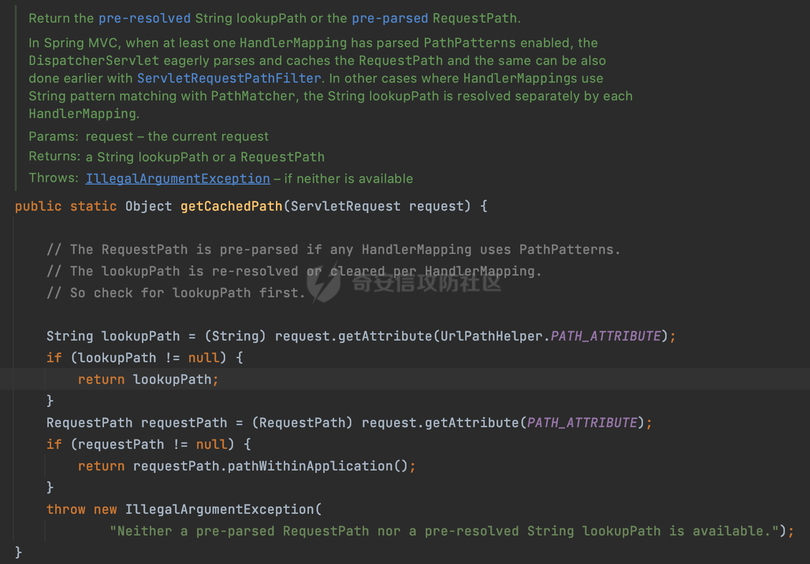

分情况进行分析：

-   **UrlPathHelper.PATH\_ATTRIBUTE**

首先是UrlPathHelper.PATH\_ATTRIBUTE，SpringWeb在解析时会在在initLookupPath方法中初始化请求映射的路径，当使用AntPathMatcher进行解析时，会调用UrlPathHelper的resolveAndCacheLookupPath方法进行解析：

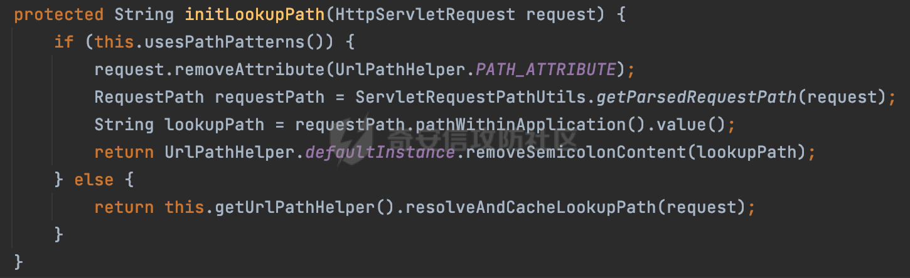

在resolveAndCacheLookupPath方法中，会调用getLookupPathForRequest进行处理，然后设置UrlPathHelper.PATH\_ATTRIBUTE的值：

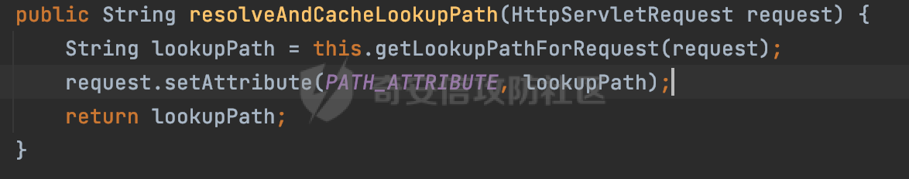

也就是说，UrlPathHelper.PATH\_ATTRIBUTE的值跟alwaysUseFullPath是息息相关的：

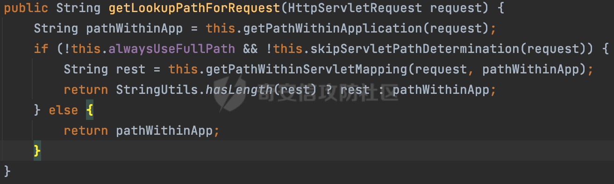

当alwaysUseFullPath为false时，在路由匹配时会进行路径标准化（使用getPathWithinServletMapping处理），包括对%2e解码，将//替换为/以及处理跨目录等。否则会调用getPathWithinApplication方法通过request.getRequestURI()方法获取当前request中的URI/URL，除了简单的url解码，处理分隔符;以及多个///外，并不会对类似../跨目录请求进行处理。

以请求`/demo/demo/../../%69%6e%64%65%78;test`为例（Spring-Web版本5.3.27），alwaysUseFullPath默认为true，获取到的请求path调用了getPathWithinApplication进行处理：


-   **ServletRequestPathUtils.PATH\_ATTRIBUTE**

当使用PathPattern时，因为会移除UrlPathHelper.PATH\_ATTRIBUTE的值，所以最后是从ServletRequestPathUtils.PATH\_ATTRIBUTE获取的：


ServletRequestPathUtils.PATH\_ATTRIBUTE处理过程如下：

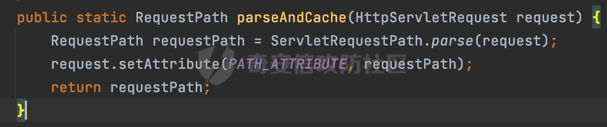

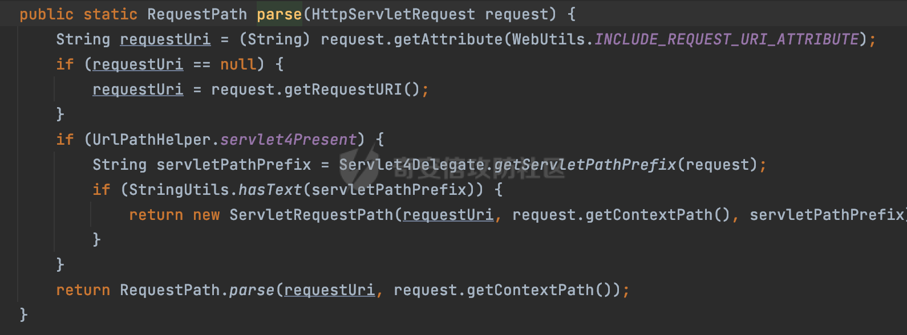

同样的没有对获取到的请求path进行过多的规范化处理，所以以请求`/demo/demo/../../%69%6e%64%65%78;test`为例，返回内容跟调用request.getRequestURI()类似：

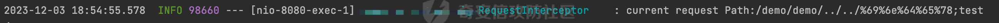

同理，使用`ServletRequestPathUtils.getParsedRequestPath(request)`跟getCachedPath的结果是类似的，因为都是从ServletRequestPathUtils的PATH\_ATTRIBUTE属性获取：

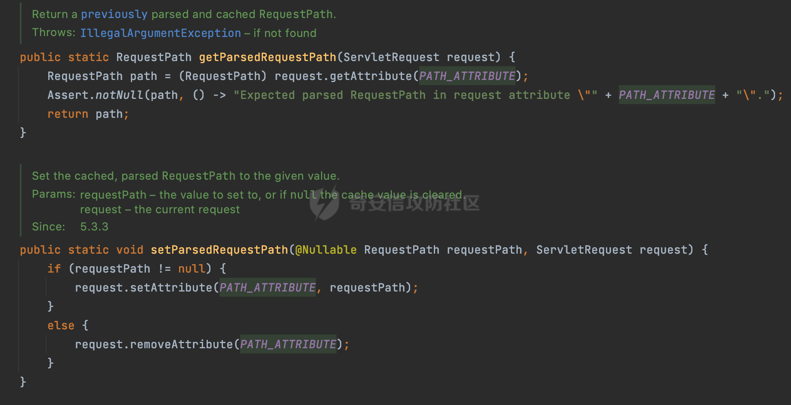

### 2.2.2 RequestContextHolder.getRequestAttributes

`RequestContextHolder` 是 Spring Framework 提供的一个工具类，用于在当前线程中持有和访问请求相关的信息。`RequestContextHolder` 可以用于获取当前请求的上下文信息，包括 `HttpServletRequest` 和 `HttpSession` 等。

可以通过`RequestContextHolder.getRequestAttributes()` 方法获取当前请求的属性，在 Web 应用程序中，通常是 `ServletRequestAttributes` 的实例。例如下面的例子：

```Java
((ServletRequestAttributes) RequestContextHolder.getRequestAttributes()).getRequest().getRequestURL().toString()
```

实际上这里跟直接调用request.getRequestURI()方法一样。所以返回内容也是没有经过规范化处理的。就不再赘述了。

### 2.2.3 ServletUriComponentsBuilder.fromCurrentRequest()

`ServletUriComponentsBuilder` 是 Spring Framework 提供的一个用于构建 URI 的工具类，专门用于在 Servlet 环境中构建 URI。它是 `UriComponentsBuilder` 的一个变种，提供了一些额外的功能，以便更容易地在 Web 应用程序中构建 URI。

例如下面方法返回的是包含查询参数的完整 URI。

```Java
ServletUriComponentsBuilder.fromCurrentRequestUri()
```

实际上也是对request.getRequestURI()的封装，所以返回内容也是没有经过规范化处理的：

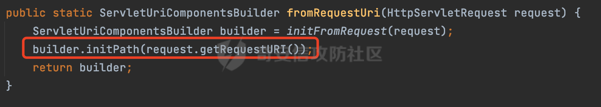

### 2.2.4 HandlerMapping属性

HandlerMapping 是 Spring Framework 中用于处理请求映射的核心接口之一。它定义了一种策略，用于确定请求应该由哪个处理器（Handler）来处理。HandlerMapping 接口提供了一组方法，用于获取与请求相关的处理器。

其中定义了一些常用的属性，这些属性在请求处理过程中会有相应的作用：

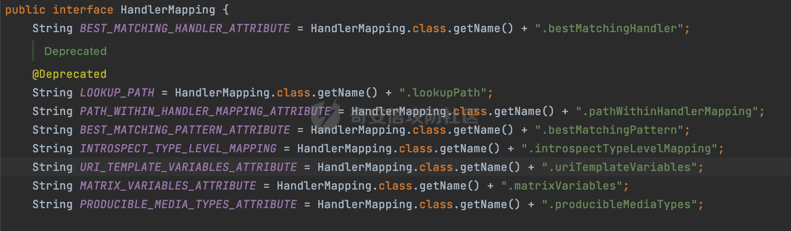

其中常用来获取路径的属性如下，可以通过类似`request.getAttribute(HandlerMapping.`*`PATH_WITHIN_HANDLER_MAPPING_ATTRIBUTE`*`)`进行调用：

-   **PATH\_WITHIN\_HANDLER\_MAPPING\_ATTRIBUTE**

Spring在获取到请求路径后，会调用lookupHandlerMethod方法，首先直接根据路径获取对应的Mapping，获取不到的话调用addMatchingMappings遍历所有的ReuqestMappingInfo对象并进行匹配：

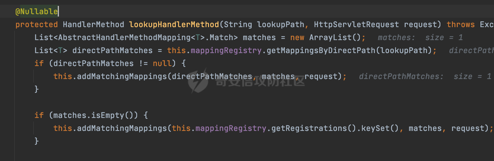

匹配完成后，会存储请求相对于Controller映射的路径：

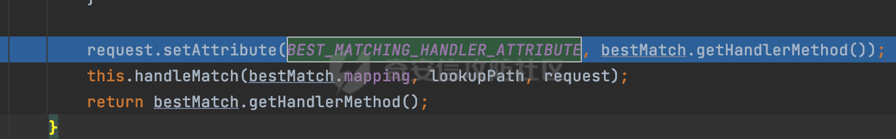

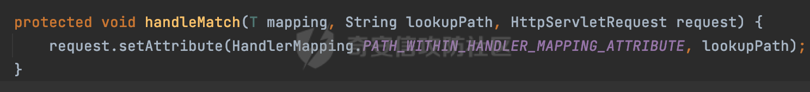

这里存储的lookupPath实际上还是从initLookupPath方法获取的：

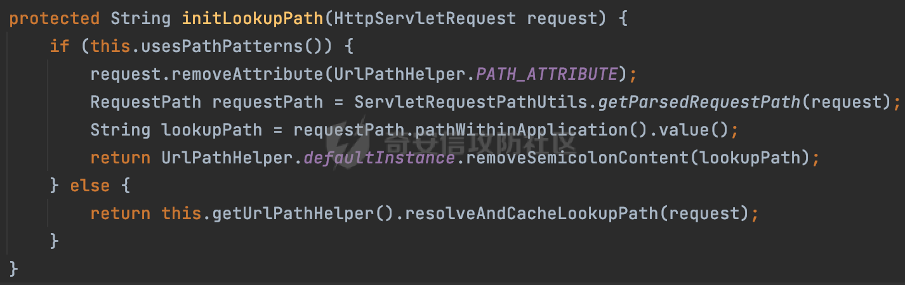

当使用PathPattern进行解析时，仅会移除URL路径中分号之后还有移除URL路径中的JSESSIONID参数。所以当对请求Path进行URL编码时，以请求`/demo/%69%6e%64%65%78;`为例，获取到的Path并不会进行URL解码处理（解码操作仅仅在PathPattern链式匹配时才会进行）：


同时，虽然PathPattern模式下，会根据`/`分割模块逐层匹配，类似多层`///`一般情况下会无法找到资源，但是若匹配模式为`@GetMapping("/**")`时，在匹配到Controoler资源的同时，获取到的路径也是没有处理掉多层`///`的，在特定情况下可能存在绕过的风险：


-   **BEST\_MATCHING\_PATTERN\_ATTRIBUTE**

与PATH\_WITHIN\_HANDLER\_MAPPING\_ATTRIBUTE不同的是，在处理请求时，Spring会尝试找到最适合处理请求的Controller。该属性存储了在这个过程中找到的最佳匹配的Controller。也就是类似`@GetMapping("/**")`的`/**`。这个属性的好处是无论请求path内容如何，只会返回配置的Controller对应的路径信息，避免了归一化规范处理不足的问题。同时直接强关联匹配的资源，方便匹配权限控制表。是个不错的选择。

# 0x03 其他

以上是SpringWeb中常见的获取当前请求路径的方式。在实际代码审计过程中可以根据不同的方式，结合实际场景判断是否存在绕过的可能。

此外，在Spring Security中提供了一个HttpFirewall接口，用于处理掉一些非法请求。目前一共有两个实现类：

-   StrictHttpFirewall（严格模式，默认使用）
-   DefaultHttpFirewall

在严格模式下对一些不规范的URL内容进行了拦截，包括前面提到的路径穿越符、多重/，分隔符等：

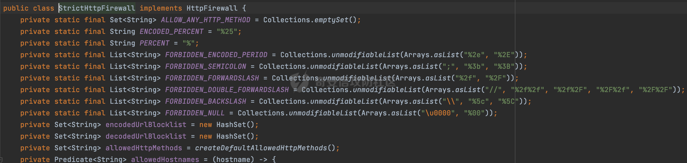

所以在设计自定义鉴权措施时，可以参考该接口对非法请求进行相关的拦截。同时还可以对相关接口访问进行标准化处理，剔除不相关的元素，例如../,分隔符(;)后的内容等。可以通过ESAPI的canonicalize方法进行集成，对相关输入进行规范化处理：

```Java
ESAPI.encoder().canonicalize(URI)
//同时在对应的配置文件ESAPI.properties禁用双重uri编码（默认开启）:
Encoder.AllowMultipleEncoding=false
```

避免由于获取到的请求路径没有经过规范化处理导致的权限绕过风险。
