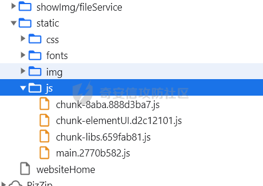
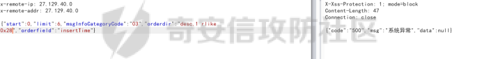
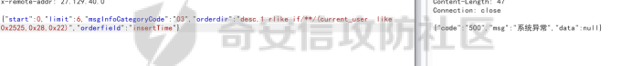

# 奇安信攻防社区-记一次前端加解密到sql注入过waf的实战

### 记一次前端加解密到sql注入过waf的实战

记一次前端加解密到sql注入过waf的实战

### 信息收集阶段

- - -

开启日常渗透工作，第一步，打开爱企查、天眼查、对准测试资产开始狂飙！找到一个授权范围内的资产，按理说应该收集一波域名、跑一下子域名的，再fofa、hunter搞起的。那天心血来潮直接访问了一下主站，没想到burp一上来就开始飙绿\\~~~~

我的burp安装了HaE插件，自定义了一些容易出洞的关键字。发现这个主站，出现了很多排序的关键字，而且还没做映射（挺随意的）。（排序注入是sql注入中，高频出洞模块，目前mybatis对排序的方案中，只能使用${}传入排序字段，所以必定有注入。除非接口做了映射，例如：用户只能传 枚举类型参数 ，后台代码程序把这个 枚举类型参数 使用case when转化为排序关键字拼接到mybatis的xml文件中，不在 枚举中的参数，直接拼装default参数）

- - -

### 发现验签

- - -

查看排序注入是否存在，直接重放接口，返回正常

排序字段加 ,0 ,1 看看是否有报错

验签了，碰到验签，按经验来说，盲猜是sign这个头。Fuzz一下，Sign去掉后报错，不能为空！  
Sign:  
Sign: 1  
Sign: 2  
Sign: test

这些都有可能绕过验签，因为开发前期测试的时候肯定不会改一下参数，还自己去计算一下sign值的。如果请求头有 encryptType:1 这种参数也可以试着修改，一般这个参数控制着后台加密类型。具体这个绕过参数是啥？要么就去fuzz，要么就去看一下js源码，可能会有。我这个案例没这么幸运，没绕过，只能开启 F12 硬刚。

- - -

### 开启 F12 ，vue的前端

- - -

全局搜索关键字 Sign，找到一处可疑点

打上断点，成功命中！（如果没有命中的话，可以在network中搜索请求的url关键字，看一下调用栈，找一下sign生成点函数）

分析代码，它其实只用到了 2 个参数，post请求体（或者url传的参数）+时间戳。进行了一下字符串组装，然后md5加密转大写。

- - -

原理知道了，接下来就是 “一点点的工作”。

-   方案一  
    我的目的是：burp-repeater 模块重放数据包，因为我要修改里面的参数，所以每次修改完之后，必须要重新计算sign值。接下来就是构思下数据流程：python启动一个flask，相当于一个web服务，作用是拆解出 我所需要的 timestamp 和 post请求体（或者url的传参）；并且会把参数发给node服务，node服务返回计算结果，python程序替换sign值。Node启动一个web服务，计算这个sign值。

使用 burp-autodecoder插件，把repeater里面的数据包发给我的 python程序，python程序提取一下我所需要的 timestamp 和 post请求体（或者url的传参），然后把数据发给webstorm程序（这个程序就是node启动一个web服务）

Autodecoder：

Python启动：

Node启动：

测试一下，老铁给力不

验签搞定了，而且存在注入（ps：oder排序注入，查询结果必须要有数据，空表查询的话，payload不会被触发）。使用布尔注入

-   方案二
    
    | 直接使用 jsrpc，在内存中直接调用这个加密函数，因为这个插件技术是后期才接触到的，所以用了方案一（有丢丢复杂）。方案二适合网页版，可打断点的场景。方案一适合知道加密原理但是不好打断点的场景，例如分包小程序。 |
    | --- |
    
    ### sql注入阶段
    
    - - -
    

看看if能不能用

看看 iif 能不能用

看看case when能不能用

还发现有个waf

都不能用，使用大招 rlike 报错

可行可行，构建条件语句

又是waf，试试注释符号绕过

完美！！！！！

好了！Payload搞定了，接下来就是注出用户名就行了！！！！！

因为怕触发waf直接使用常量 like

注入出数据库用户名：jr\_% 收工收工。
