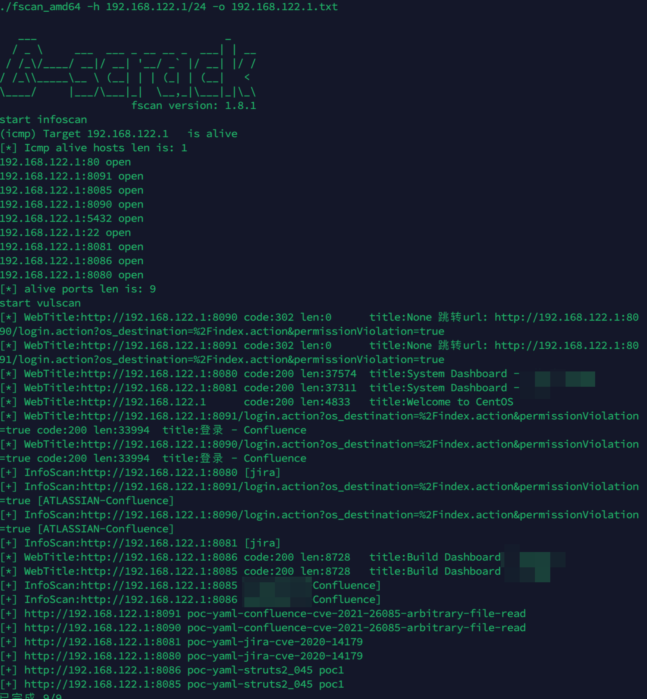

# 奇安信攻防社区-记一次攻防演练之vcenter后渗透利用

### 记一次攻防演练之vcenter后渗透利用

很早之前的一次攻防演练，主要是从web漏洞入手，逐渐学习vcenter后利用技术。过程由于太长，很多细节都省略了，中间踩坑、磕磕绊绊的地方太多了。。。 由于敏感性，很多地方都是打码或者是没有图，按照回忆整理的，见谅！

本文未经作者授权，禁止转发到公众号等平台！！！

# 0x00. 说明

很早之前的一次攻防演练，主要是从`web`漏洞入手，逐渐学习`vcenter`后利用技术。过程由于太长，很多细节都省略了，中间踩坑、磕磕绊绊的地方太多了。。。

由于敏感性，很多地方都是打码或者是没有图，按照回忆整理的，见谅！

# 0x01. confluence漏洞

根据打点的记录，找到了一个`confluence`的界面：


## 1.1 反弹shell

经过验证，存在`cve-2022-26134`漏洞，直接利用漏洞反弹`shell`到`vps`：


经过分析，当前为实体机，但是权限较低，这也正常，大部分都是这个权限。

## 1.2 提权

先进行信息搜集，看下内核版本之类的：


看到了当前为`centos`，尝试使用`cve-2021-4034`进行提权，将文件传到机器上之后，再进行编译，然后执行：


此时顺利获取到了`root`权限。 在此期间，发现机器中还有的门罗币的一些操作：


因为当前机器仅支持密钥登录，在密钥中看到了明显的入侵痕迹。所以就不进行登陆了。 至此，入口机的操作到此结束。

# 0x02. 内网扫描

在入口机上发现了一共有两个有效子网ip，对其分别进行了扫描，发现如下：


对`192.168.122.1/24`扫描，只发现了一个ip，也就是当前正在使用的ip地址，虽然发现了一些其他的漏洞，但是参考意义不大：

 对`10.110.11.1/24`段进行扫描的时候，发现了一些有用的漏洞，其中包含`vcenter`的，由于内容太多，在这里分享一部分：

```php

[+\] NetInfo:
[\*\]10.110.11.10
[\->\]a1\-dc
[\->\]10.110.11.10
[+\] https://10.110.11.30 poc\-yaml\-vmware\-vcenter\-unauthorized\-rce\-cve\-2021\-21972 
```

在这里发现了一台`dc`（自己标注的主机名）和一个`cve-2021-21972`漏洞的机器，那下面就转战`vcenter`了。毕竟`vcenter`被称为小域控。 当然，在这里还需要搭建隧道等，我在这里就对此省略不提了。

# 0x03. vcenter漏洞

对于这种`vcenter`漏洞和后渗透来说，先拿到`shell`，提权到`root`，进后台，操作机器。 一般进后台有三种方法：

1.  找到`mdb`文件，生成证书文件，再生成`cookie`，进后台。
2.  `root`权限添加新用户。
3.  重置管理员密码，使用新账密进入后台。

## 3.1 版本探测

首先是版本探测：


当前版本是`6.7.2`，虽然扫出来的是`21972`漏洞，但是很多时候这种机器有概率存在`cve-2021-22005`漏洞，之所以尝试`22005`，主要是`21972`获得的权限不是`root`的，到时候还需要提权，很麻烦。

## 2.2 getshell

在这里使用的是`cve-2021-22005`，挂上代理之后，先上传作者的木马上去，直接一把梭：


这样的好处是作者的木马是网页版的命令执行，有些时候会显示似乎是已经上传成功了，但是验证的时候没有回显，以前遇到过好多次都是误报。


证明确实存在`22005`这个漏洞，那就上传自己的马儿上去：


在这里上传的是蚁剑的，因为在这里最初尝试过哥斯拉的，发现上传了无法连接，最后蚁剑是忽略了`https`证书才能连接：


当前权限是`root`。 理论上接下来就是获取`cookie`到后台，再操作机器。。。。。

整个流程看起来非常的流畅。但是坑的点随之而来~

## 3.3 获取cookie（失败）

以下的操作可以参考这个链接，我都是在这个链接和s老板的基础上学习到的：

[https://daidaitiehanhan.github.io/2022/04/18/vCenter2021%E5%87%A0%E4%B8%AA%E6%BC%8F%E6%B4%9E%E5%8F%8A%E5%90%8E%E6%B8%97%E9%80%8F/#%E6%8F%90%E6%9D%83](https://daidaitiehanhan.github.io/2022/04/18/vCenter2021%E5%87%A0%E4%B8%AA%E6%BC%8F%E6%B4%9E%E5%8F%8A%E5%90%8E%E6%B8%97%E9%80%8F/#%E6%8F%90%E6%9D%83)

不懂的，可以先看这个。

流程就是：

在这里获取`cookie`之后，然后直接登录`vcenter`的网页版后台（想着都很美） 一般来说，对`mdb`数据操作，有两种方法：

-   一个是在`vcenter`机器上用脚本获取
-   第二种是下载到本地用脚本获取。

### 3.3.1 本地执行脚本

找到`mdb`数据，然后解密：

```php
/storage/db/vmware-vmdir/data.mdb
```

在执行的时候，在蚁剑上使用命令行执行会特别慢，只能获取到一个文件，因为当前`vcenter`的机器出网，所以直接反向弹到`vps`上，用`root`权限的交互式命令行来执行，同样的问题，执行反馈特别慢，而且执行会出现一些莫名其妙的错误：


直接告诉我证书为空，我尼玛。。。 最后发现，可能的原因是`mdb`文件太大了，文件1个G还要多，没法搞（只是怀疑），一般攻防里面这种文件大概不超过`100M`。


### 3.3.2 本地执行

挂隧道，用小水管，把文件慢慢慢慢慢慢慢下载到本地来，再试试本地：


直接g，看来这种方法肯定是不行了。

## 3.4 添加用户（失败）

按照大佬的方法，此时来添加新用户到`vcenter`后台，用户添加脚本：  
[https://github.com/3gstudent/Homework-of-Python/blob/master/vCenterLDAP\_Manage.py](https://github.com/3gstudent/Homework-of-Python/blob/master/vCenterLDAP_Manage.py)


看似很轻松的操作，我开始按照提示先添加账号，再添加到管理组：


在添加到管理组的时候，和别的师傅不一定的点就是在这里发生了报错：


果然，登录的时候直接g。。。

## 3.5 重置密码（成功）

没有办法了，来重置密码吧，虽然还有其他的路子（菜）

充值秘密会修改管理员的密码，所以这个操作需要谨慎

首先查询域名，再在`shell`中执行重置密码的功能：  
查询域名：

```php
/usr/lib/vmware-vmafd/bin/vmafd-cli get-domain-name --server-name localhost
```

重置密码，在`shell`中执行：

`/usr/lib/vmware-vmdir/bin/vdcadmintool`

选择3，输入用户名：`Administrator@xxxxx`，然后回车即可：


终于，进入后台了，一共`99`台机器，其中那个`dc`机器也在里面：


到这就结束了吗？更大的困难还在后面。。。

眼看dc机器在里面，那就想办法登录上去，由于dc机器正在运行，且锁屏，所以就有了下文去想办法获取dc机器的`hash`。

# 0x04. dc机器hash获取

在这里获取`hash`有两个大方向：

-   做快照，下载快照，用`Volatility`来取证获取`hash`（适合流量无线和下载比较快的）
-   做克隆，`cd`盘启动，抓`hash`

## 4.1 打快照下载法

这种适合网速不错、能短时间下载下来的。


然后再dc中找到自己的存储位置，再去找对应的存储，下载文件：


将`vmem`文件下载下来：


当前下载非常的慢，所以找了一个`winxp`的试试：

获取信息，然后`hashdump`：


淦

## 4.2 克隆虚拟机法

在这里发现dc机器上锁屏了，而且是`winserver2016`的机器，那就试试克隆之后，使用cd引导来破除密码啥的，意思就是你电脑关机了，再开机的时候，先把usb或者cd启动，把密码抹掉，类似于我们使用的大白菜装机大师。

### 4.2.1 kon-boot文件上传

先看下dc机器的位置，把你做好的`大白菜u盘`（类比的说法而已）传上去，在这里传的是`kon-boot`的`iso`文件。


可以从网上下载老版本的：

链接：[https://pan.baidu.com/s/14\\\_OP\\\_nePf-HUlkZxzwXkXw](https://pan.baidu.com/s/14%5C_OP%5C_nePf-HUlkZxzwXkXw)

提取码：k32k


思路是：

将`KON-BOOT`的`iso`镜像（非常的小）上传到`vcenter`的某一个磁盘中，克隆虚拟机，将克隆的`CD/DVD`处镜像更换成`KON-BOOT`的`iso`文件，再启动。


在这里选择上传，当前上传的话，有几个说法，一个是需要下载安装`vcenter`的证书才能上传，否则无权限；另外一个说法是直接上传，如果失败的话，多上传几次。。。

在这里我没安装证书，而是直接上传的，一次就上去了（可能是因为文件很小）


### 4.2.2 克隆虚拟机

在这里选择克隆到虚拟机：


起个名字，然后放在下面，下一步：


随便放，下一步：


选择存储桶，在这选择刚上传`iso`文件的镜像，也是`dc`机器的硬盘，这样拷贝啥的快：


在这里选择克隆选项：


把网卡都取消：


此时就差不多了：


点击`finish`之后，克隆需要等待一会，因为要复制文件啥的，大概从1分钟到数分钟不等（取决于是什么盘，不知道为啥变成了`2012`的）


### 4.2.3 开启机器

在开启之前，编辑设置，对`vm`虚拟机设置：


添加虚拟机设置，我的没有cd驱动器选项，所以需要添加，如果你有的话，你就不需要添加：（不清楚刚刚的操作出了啥问题，反正检查下，保险点）


开机就会进入`bios`界面，选择`cd`优先启动之后，再使用 `F10` 保存。 开机之后，选择启动`web`控制台：


启动之后，在`bios`界面，使用`+-`符号来移动顺序，`mac`上只能用`-`来移动，将`cd`作为第一个，然后`f10`保存即可。


启动之后会有界面：


到这个界面之后，5下`shift`进入，也有空密码（相当于置空密码了）可以进入，但是这个估计不太行（`win10`以上的机器应该都不行）。


5次`shift`之后：


新建用户，然后登录：


目前是进去了，但是没法获取到里面其他用户的信息，所以需要重启挂载`iso`文件，读取`hash`：


### 4.2.4 制作iso文件

刚刚挂载是为了进去，但是奈何`win10`以上的用户，没法置空密码进去，所以只能新建用户进去，但是无法获取原来的账密信息，所以需要挂载新的`iso`进去，在这里使用`UltralISO`制作`iso`启动盘： 参考方法：

[https://blog.csdn.net/bcbobo21cn/article/details/116347346](https://blog.csdn.net/bcbobo21cn/article/details/116347346)

因为很简单，就不截图了。 将原来的环境关机，替换`iso`文件：


配置之后，重启设备：


打开之后，就抓到了密码：


# 0x05. dc机器抓hash

在克隆机器登录dc机器之后，只能获取到一个`system`权限的shell，幸好里面使用的是`Windows defender`，如果用其他杀软的话，加用户都比较困难，在这里讨论下抓原机器`hash`的方法。

## 5.1 上线c2

在这里获取到一个`system`的`shell`之后，需要给该克隆的机器分配一个网络，如果可以的话，使用`certutil`或者是`ps`指令上线`c2`，再抓原来的密码，这个我没有试过，理论可行。

当然，也可以用`certutil`直接下载`mimikatz`来抓取`hash`（可能需要免杀）

## 5.2 抓注册表

这个方法是比较合理的，在`4.2.4`中只抓了当前用户的`hash`，无法抓取其他用户的`hash`，所以可以使用注册表方法抓取。

### 5.2.1 本地Windows10实验

为了验证可行性，在这里以本地`Windows10`环境为基础（后期补充的），操作看下，以下操作在本地：

**目的是尝试抓取**`**admin**`

**用户的**`**hash**`

新建账号之后，使用新账号登录:


当前使用`test`用户登录，只能抓到登录账号的账密`hash`：


但是如果对注册表操作的话，在这里对注册表操作：

```php

reg save HKLM\\SYSTEM system.hiv

reg save HKLM\\SAM sam.hiv

reg save hklm\\security security.hiv

在本地使用mimikatz执行：

mimikatz.exe "lsadump::sam /system:system.hiv /sam:sam.hiv" exit
```


抓到了`admin`用户的`hash`，这就证实了对注册表操作是可以抓到原来用户的账密`hash`的。

### 5.2.2 注册表抓取


此时抓到了：


# 0x06. 总结

漏洞第一时间同步给客户进行了修复。

当前以`confluence`的`web`漏洞，再到`linux`提权，再到`vcenter`的漏洞，再到机器的克隆和`hash`获取等，整个流程非常的漫长，而且磕磕绊绊的地方非常多，当然还有很多没有解决的问题：

-   比如`vcenter`为啥没有添加上用户
-   注册表抓`hash`为啥没有抓到当前登录用户
-   `linux`系统如何抓关键信息等等。。。

后续再慢慢学习吧，东西太多了。
