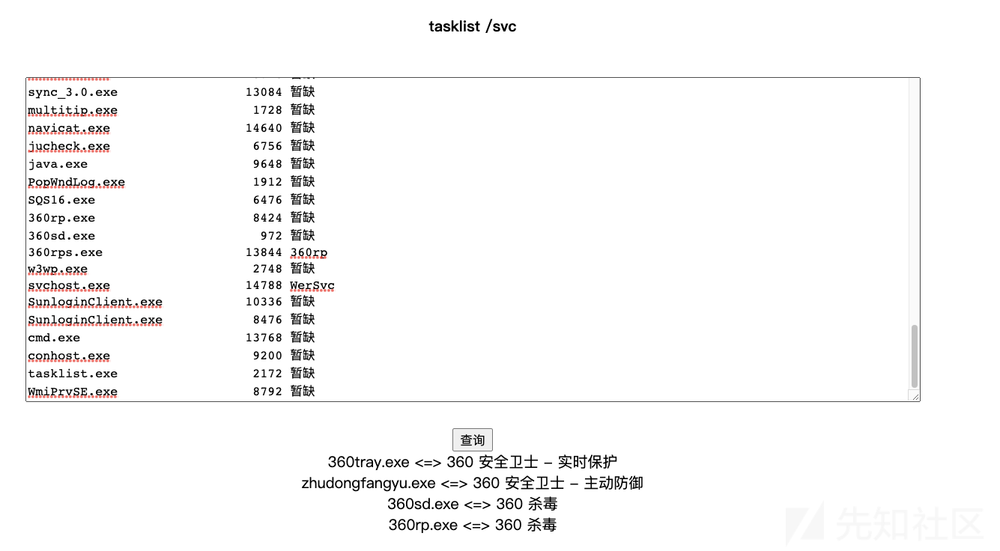

# 奇安信攻防社区-记首次HW|某地级市攻防演练红队渗透总结

### 记首次HW|某地级市攻防演练红队渗透总结

团队协作，我们打上了云，打进了IOT！

**申明：文章仅供技术交流，请自觉遵守网络安全相关法律法规，切勿利用文章内的相关技术从事非法活动，如因此产生的一切不良后果与文章作者无关**

# 0x00 前言

上周参加了某地级市为期七天的网络攻防演练对抗赛，总共14支攻击队。大概情况是：第一天多为弱口令和应用层漏洞攻击且有攻击队申请高危漏洞攻击，之后想必都开始了高危漏洞利用，内网攻击，第四天就有攻击队开始使用0 day,Nday,社工钓鱼攻击，从第五天凌晨起进入混打乱斗模式，所有目标都变为公共目标，第七天18点停止对所有攻击队的授权，所有攻击队停止攻击，演练结束。最终评判结果是第三名五万多分，第二名六万多分，第一名七万多分！！！太太太......太卷了！！！

作为一只初次参加HW的菜鸟选手，在惊叹的同时也在思考和摸索着红队渗透该怎么玩？他们是怎么打得那么快的？他们为什么能打穿内网，能单兵APT？陷入了对生命终极回答的思考：我是谁？我在哪？我要如何去往红队之路？

总的来说，在此次HW行动中还是学到了不少东西。故才有了本文，意在对此次HW进行复盘，总结在这次HW中学到的东西以及自己的不足与改进方法，也想做一次分享，希望能同安全圈的各位师傅们一同探讨红队之路怎么走，在攻防演练中作为攻击方我们应当做些什么才能达到HW演练所要达到的效果。以下是本人的总结与思考：

# 0x01 对某目标攻击的复盘

由于HW中涉及的目标都很敏感，故本文截图较少，且都已进行脱敏处理。有些内容可能不太完整，望见谅~  
就拿得分最高也是最有意思的一个目标来做下复盘吧，整个的攻击过程和方法是这样的：

## 1.Web打点

目标是一个asp.net的网站，能解析asp,aspx代码，访问时就只能看到一个登录框。大佬A的一顿操作发现了未授权访问(算是0day了吧，采用此程序搭建的其他系统都存在这个问题，且似乎只有我们团队发现了这个)，此程序存在未授权用户查看、添加、编辑和删除。通过未授权访问用户修改界面(用户uid=1)， 可以看到密码已填充，以\*号显示，通过前端代码可以查看到明文，于是获得后台管理员账号密码并成功登录，获得200分。

在未授权用户编辑界面有一个上传头像的功能，此处存在文件上传漏洞，上传图片马，burp抓包将后缀改为asp即可绕过，返回状态码为500，但实际上文件是上传成功了的。

这是怎么知道文件上传成功了的呢？通过目录遍历漏洞找到文件上传路径：  

通过时间比对找到我们上传的木马文件是哪个，接下来就是常规操作，用蚁剑连接成功。又获得200分！

不得不说，未授权访问-->文件上传-->目录遍历-->拿到webshell，大佬A强啊！！！

## 2.上免杀马反弹shell(Failed)

拿到的是一个IIS权限，自然是要反弹到Metasploit、CobaltStrike这类集成框架来进行后渗透、提权打内网了（虽然内网也没啥主机，但就是想打）。执行Systeminfo查看到是一台winserver 2012 R2的服务器，打了153个补丁，通过执行tasklist /svc查看当前主机上运行的进程，将结果拷贝到在线杀软识别平台进行比对，发现目标主机上装了360。

感觉有戏，于是我之前花了两天研究的C语言免杀派上用场了，上传了免杀360的马，是shellcode分离免杀的，目标上提示命令执行成功但没反弹回来，但在自己环境中能执行上线。不是被拦截原因，后面有场景会说明（相信有大佬大概知道什么原因了）。反弹失败，还是我菜的原因啊~

## 3.信息收集，数据库提权

通过信息收集，发现了这套程序还搭建在了其他目标上，于是大佬A又用之前的方法拿到了一台主机的webshell，通过比对，发现装了火绒。

于是再次用我的免杀马尝试CobaltStrike上线，这次成功了!!!

接下来提权，拿到的也是一台winserver 2012 R2的服务器，打了150个补丁，我加载了taowu和Lodan插件(20211024版，应该是开源的最后一版了吧)，试过了里面常用的提权插件都未成功，烂土豆提权失败，因为条件不满足；ms14-058反弹回来的是一样的权限。（这是拿到数据库服务器，演练快结束时的事了:将会话移交给MSF，使用MSF内置的CVE-2020-0787提权未成功，使用post/windows/gather/enum\_patches模块来收集补丁信息，显示补丁都是在2021.12.1日打的；使用post/multi/recon/local\_exploit\_suggester 来查询哪些EXP可用，并没有显示有可用EXP。）

陷入窘境，大佬B通过信息收集翻到了数据库配置文件，原来这是一台站库分离的系统，数据库在另外一台外网服务器上(阿里云服务器)，配置文件中泄露了数据库服务器IP，端口，账号，密码，为SA权限，使用Navicat尝试连接，居然成功了!!! 获得400分  
大佬C立马来个xp\_cmdshell提权，成功拿到System权限，再获得200分！

System权限是在数据库中，为了方便接下来的渗透，思路是将System权限上线到CobaltStrike上，在此处执行了从自己的VPS上下载免杀木马并执行的操作，显示执行成功，但并未上线。猜测这是台阿里云的ECS，对出站端口进行了限制，所以反弹不回来。

## 4.拿下数据库云服务器

Shell反弹不回来，就不能对云服务器做更好的控制，不能算完全拿下，于是在大佬D的指导下，利用System权限创建一个管理员账户，然后3389远程桌面连接(没错3389开着，还没对连接地址做限制)，再利用Procdump+mimikatz获取到Administrator账户的明文密码。(因为是win2008的服务器，所以可以获取到明文密码，08之后的服务器获取到的就是密文的了)。这样才算是完全控制了这台云服务器。

为了探究为什么执行木马的命令提示成功了，但shell却没反弹回来的真正原因，在图形化下的 cmd窗口执行木马，惊人发现：提示缺少了某140D.dll，这才恍然大悟，这情况去年做python免杀实验时也遇到过，原来这是生成exe文件时的配置问题，当我们生成Release版本的时候，运行库选择MT；当生成Debug版本时，运行库选择MTD。 不然的话就会造成在自己电脑上执行没问题，但在其他电脑上执行可能会提示缺少dll文件。于是重新生成了木马，再次在Navicat里执行，它居然上线了！它上线了！上线了！

真实作战环境，看到自己的CobaltStrike上线了一台System权限的主机，就感觉很刺激~

那之前有360防护的那台，是不是也是这个原因了，于是重新生成了木马，但传上去提示500错误，怎么肥事？后来在自己的虚拟机里用360查杀了下( 正经人谁会在自己物理机上装360，狗头)，我的马已经不免杀了，因为距离上次传的马，已经过了一天了。

## 5.内网横向(云内漫游？)

接下来自然是横向移动了，由于这是台存储数据的服务器(内网地址10.26.179.186)，猜测这应该是个数据库段，要是把内网整个拿下，那分数不得蹭蹭往上涨，在进行了常规的端口扫描之后（扫描中提示可能有防火墙），发现确实存在好几台内网机器，且基本都开放的80,443端口，一两台还开放了21,22端口。咦？不对呀，内网横向常见的135,139,445端口没了？那只能通过内网的web渗透来拿权限了？于是搭建了个代理，在本机上挂上代理通过浏览器去逐个访问网站，不对呀，与HW完全不搭边呐，都是别的地方的东西，还有个个人博客，通过admin/123456进入了后台。我看刑，有判头。

至此，裁判评分：

打得这么辛苦，就1000分？

## 6.咋就打进了IOT？

大佬B再次对拿下的云服务器进行信息收集，远程登录Administrator账户，通过谷歌浏览器收集到了访问某个站点的账号密码，是个单点登录，登录进去看到了这样的字眼：登录成功，您已成功登录中央认证系统。又通过服务器上的向日葵远控到另一台主机，上面还显示着某些运行情况。  
裁判评分：

看到这个IOT整个团队一开始都有点懵的，后面想明白了，这个数据库服务器是很多个系统的数据存放地，可以说是个集群数据库了，有20多个G，而向日葵又远程着另一台服务器，上面监控着运行情况。

## 7.疑似境外攻击？

当我在复盘此次HW攻击过程时，在与大佬B交流过程中，他说他当时通过netstat发现了一个与美国的连接，还将连接情况本地保存了一下，我瞬间感觉有点不太妙，查了下这个ip:

通过威胁情报中心查询到的结果：

立即将情况上报给警官  
维护国家网络安全，人人有责！

# 0x02 知识点总结

## 1.未授权访问

未授权访问漏洞，是在攻击者没有获取到登录权限或未授权的情况下，或者不需要输入密码，即可通过直接输入网站控制台主页面地址或者不允许查看的链接便可进行访问，同时进行操作。  
一个页面对用户身份的判断基于两种方式：一种是将身份验证代码写入当前文件；另一种是写一个身份验证的代码文件，然后其他页面需要调用时，直接包含进来即可。  
当写了身份验证代码，但开发者在开发时忘了将身份验证的代码文件包含进来，就会造成未授权访问，asp/aspx的网站通常会有这样的问题。

## 2.SQL Server xp\_cmdshell提权

xp\_cmdshell是一个开放接口，可以让SQLserver调用cmd命令。此存储过程在SQLserver2000中默认开启，2005本身及之后的版本默认禁止，所以想要使用该存储过程，就需要拥有SA账号相应权限，使用sp\_configure将其开启。

启用xp\_cmdshell:  
EXEC sp\_configure 'show advanced options', 1  
RECONFIGURE;  
EXEC sp\_configure 'xp\_cmdshell', 1;  
RECONFIGURE;

执行命令：  
EXEC master.dbo.xp\_cmdshell 'whoami'

### 注：

2005的xp\_cmdshell的权限一般是system，而2008多数为nt authority\\network service。故xp\_cmdshell的提权前提为两个：(1)拿到sa权限的账户密码；（2）sqlserver服务未降权  
SQL Server提权详情请参考：[https://blog.csdn.net/u014029795/article/details/116910134](https://blog.csdn.net/u014029795/article/details/116910134)

## 3.Procdump+mimikatz配合抓取密码

Procdump是微软官方工具，不会被杀软查杀，其抓取密码的原理是获取内存文件 lsass.exe 进程 (它用于本地安全和登陆策略) 中存储的明文登录密码并存储到lsass.dmp文件中，之后我们就可以使用mimikatz去读取lsass.dmp获取到明文密码。  
win10或2012R2以上操作要麻烦一些，具体请参考：  
[https://blog.csdn.net/qq\_44881113/article/details/120315448](https://blog.csdn.net/qq_44881113/article/details/120315448)

### 小tip:

在进行远程桌面时，为了能够将我们本地的程序或文件拷贝到远程的主机上，应在本地资源中勾选上驱动器：  

## 4.木马文件执行时提示缺少某个dll文件

前面说到过当生成C的exe文件时，如果要生成Release版本，运行库选择MT；生成Debug版本时，运行库选择MTD。那么原理是什么呢？可以参考这篇文章：[https://blog.csdn.net/Celestial\_empire/article/details/106795200](https://blog.csdn.net/Celestial_empire/article/details/106795200)  
简单的理解就是MT,MTD是静态链接，它把程序运行时所需要的dll库文件都打包好，MT适用Release,MTD适用Debug。MD,MDD是动态链接，会在运行的电脑上去动态加载所需的dll库文件，如果没有的话，就会提示缺少库文件。

## 5.CobaltStrike从内存加载.NET程序集

当我想使用MS16-075烂土豆提权时，最初的想法是将提权的exe脚本传到目标主机然后执行，但目标主机有火绒，MS16-075早已被杀烂，网上找到的代码也都是c#的，看不懂，不知咋改。这时请教了木佬，才知道可以不用做免杀。

原来，在CobaltStrike中有一个名为”execute-assembly”的命令，能够从内存中加载.NET程序集。这个功能不需要向硬盘写入文件，十分隐蔽，可以用来躲避杀软。我们用的CobaltStrike提权插件也是基于这个来实现的。具体的原理有待好好研究，这里给出从网上找到的三篇文章，给想研究的师傅们做个参考：  
[https://3gstudent.github.io/%E4%BB%8E%E5%86%85%E5%AD%98%E5%8A%A0%E8%BD%BD.NET%E7%A8%8B%E5%BA%8F%E9%9B%86(execute-assembly)%E7%9A%84%E5%88%A9%E7%94%A8%E5%88%86%E6%9E%90](https://3gstudent.github.io/%E4%BB%8E%E5%86%85%E5%AD%98%E5%8A%A0%E8%BD%BD.NET%E7%A8%8B%E5%BA%8F%E9%9B%86(execute-assembly)%E7%9A%84%E5%88%A9%E7%94%A8%E5%88%86%E6%9E%90)  
[https://www.freeaihub.com/post/59039.html](https://www.freeaihub.com/post/59039.html)  
[https://www.anquanke.com/post/id/220456](https://www.anquanke.com/post/id/220456)

## 6.CobaltStrike与Metasploit之间的会话传递

CobaltStrike与Metasploit作为红队评估的两大常用框架，各有其优缺点：Metasploit模块众多，但一次只能接受一个反弹回来的shell，显得有些笨重，不适合团队作战；CobaltStrike一个监听器可同时接收多个反弹回来的shell，适合团队作战，但其后渗透模块少，即使使用插件也难以弥补这个缺点，所以经常会需要在这两者之间进行会话传递。具体的原理和操作，可以参考这篇文章：  
[http://blog.leanote.com/post/snowming/43cef4b64cbd](http://blog.leanote.com/post/snowming/43cef4b64cbd)

# 0x03 两个待解决的问题

## 1.只允许本地连接的SQL Server数据库提权

在我们拿到的WEBServer主机上其实有一个只允许本地连接的SQL Server数据库，翻阅目录可以查看到连接的账号密码，权限为SA，我在webshell中使用命令行连接工具osql和sqlcmd尝试去连，都提示sa用户登录失败(账号密码无误)，在冰蝎的数据库管理模块能连上，但执行提权操作时卡了；在蚁剑中也是能连上，执行提权操作时提示“ODBC 驱动程序不支持所需的属性错误”，按照这篇文章改了蚁剑的代码也没能成功：[https://blog.csdn.net/Ca3tie1/article/details/103605485](https://blog.csdn.net/Ca3tie1/article/details/103605485)

最后大佬D上传了一个大马就提权成功了，不过拿到的是nt authority\\network service，所以本地的SQL Server是降权运行的。这里的问题是同样都是本地，为什么osql,sqlcmd命令连不上数据库，蚁剑和冰蝎提权失败，使用大马就可以？

## 2.关于云服务器

拿到的云服务器有个内网环境，但内网里的主机上的业务与拿下的目标完全搭不上边，可以说是完全不相关的系统。我们知道，我们自己买的云服务器都会有个内网地址，这是不是说云服务器都有一个内网环境，我们可以通过自己的这台云服务器访问到其所处内网主机的一些资源？但这些内网主机又不是共享一个外网地址？我们知道，当我们反弹回连shell的时候，输入我们自己的VPS地址是能确切的回连到我们的云服务器的，那如果这些内网主机不共享一个外网地址，又为什么会将这些主机组成一个内网呢？想不明白，这是不是涉及到了云架构、云安全领域？

上面两个问题如果有知道的师傅还请麻烦解答一下，我将思考和探究这两个问题，如果解决了后续会在公众号发文。

# 0x04 关于红队渗透的探索与想法

红队渗透我认为是目前在合法范围内最贴近于实际的，效果真实猛烈，以拿权限，打穿为目的来评估系统的安全防护能力。那么红队的打法流程是怎样的呢？我这里没啥经验，暂时不敢妄加言论，之前看到Teamssix师傅的文章有谈到过这个问题，这里先附上师傅之前的连载文章：  
1.浅谈红队中的外网信息收集：  
[https://mp.weixin.qq.com/s/oKDDrFz180tmaTecQog8qA](https://mp.weixin.qq.com/s/oKDDrFz180tmaTecQog8qA)  
2.浅谈红队中的打点：  
[https://mp.weixin.qq.com/s/y6VyyJJUFzD8sQom-1Cn6Q](https://mp.weixin.qq.com/s/y6VyyJJUFzD8sQom-1Cn6Q)  
3.浅谈红队中的权限维持：  
[https://mp.weixin.qq.com/s/3RhX3wiJt4cwLx73\_wcjyw](https://mp.weixin.qq.com/s/3RhX3wiJt4cwLx73_wcjyw)  
4.浅谈红队中的提权：  
[https://mp.weixin.qq.com/s/wtVDjDxwpJyHStoJfNzDRg](https://mp.weixin.qq.com/s/wtVDjDxwpJyHStoJfNzDRg)

对于此次攻防演练的反思，我觉得红队在这个过程当中不能仅仅痴迷于拿权限，打穿内网，还有重要的一点就是当我们拿下一个目标之后，能否寻找下目标之前是否有被攻击过的痕迹？查看下是否有异常的对外连接，异常的进程？公安部每年牵头举办的HW行动，其初衷是想通过业内大佬的专业评估来寻找到政府、国企、央企、事业单位等重要系统薄弱环节，帮助其提升防护能力，避免受到来自外界尤其是国外APT组织的恶意攻击。HW不应成为各个公司激烈角逐的战场，更不应是安全从业者的噩耗(据说每年HW中总会猝死那么一两个)。

上面仅是一个菜鸟选手对HW红队渗透的一点小想法，大佬不喜，请轻喷~

# 0x05 不足与改进方法

参加此次攻防演练，从中发现了自己许多不足的地方，特此提出来以期下次改进：

## 1.漏洞发现，外网打点能力弱

在整个HW过程中，自己仅发现一个普通权限的sql盲注，同事能找到弱口令登入后台，能找到shiro反序列化，而我却一个弱口令都没碰到。  
改进：有时可能不是技术上的问题，是想法和思路的问题。这个只能在平时的渗透中多注意、多思考一些，也可以通过对SRC的挖掘来提升这方面能力。

## 2.知识遗忘或掌握不牢固

相关知识点有学过，也实操过，遗忘了，没想到或者在用到时发现自己其实对于这方面知识点其实也不太熟  
改进方法：平时空闲时多做一些靶机测试，多练，熟悉从外网打点到提权，内网横向获取内网所有主机权限的这一套流程。据我所知，相关不错的靶场国内的有红日安全ATT&CK系列靶场，暗月靶场，国外的有vulnhub，hackthebox。这点得向dayu师傅学习，之前天天打HTB

## 3.攻击方式单一

这不仅是我，也是我们整个团队所存在的问题，都是通过传统的web来撕开口子。  
改进：多学习了解红队的一些打法，学学钓鱼、社工，平常做做实验。

如果有想一起讨论红队渗透，一起走向红队之路的师傅们，欢迎通过关注公众号：沃克学安全，添加小编微信好友哦~，感谢关注与支持，您的点赞是我最大的动力。

注：原文首发于先知社区，原文链接：[记首次HW|某地级市攻防演练红队渗透总结 - 先知社区 (aliyun.com)](https://xz.aliyun.com/t/11300)
