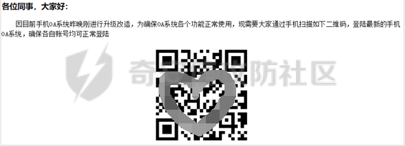
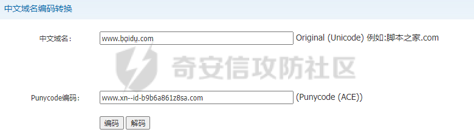

# 奇安信攻防社区-邮件可信其二内容可信

### 邮件可信其二内容可信

本篇文章简单总结了邮件钓鱼常见的手法，列举了一些常见的钓鱼场景。重点讲述了邮件内容可信里面包含的可信的邮件发件人、可信的邮件内容、可信的邮件附件以及邮件内容的合规。相信你看完能了解到如何让你的恶意邮件看起来更加可信，并且有意识的研究邮件钓鱼与邮件网关防护对抗技术。

# 0x00 前言

> 守内安与 ASRC 研究中心针对去年邮件安全汇整，相较于2020年，**2021年度的垃圾邮件总量增长幅度约为8%，但垃圾邮件的大小却增长了43%**，这对邮件服务器的储存空间，以及邮件扫描过滤的效能带来了不小负担；但垃圾邮件乱枪打鸟式的滥发滥寄情况，却呈现下降的趋势。威胁邮件的部分：利用可以快速生成钓鱼页面的免费平台进行的\*\*钓鱼攻击增长了210%；一般诈骗邮件上升了近60%；伪冒为快递、邮政相关诈骗增长了近25倍；针对企业交易时所进行的BEC（Business Email Compromise）商务邮件欺诈，攻击数量，则较2020年增长了近8倍。\*\*在WFH（居家办公）的工作形态下，伪冒、诈骗等社交工程手法的攻击变得更加猖獗；多数企业也察觉了这样的趋势，因此，**2021年企业内部实施社交工程演练的邮件量较2020年上升了近90%。**

在2022年的今天，邮件钓鱼屡见不鲜。钓⻥攻击（Phishing）已经成为对抗中⼀种必不可少且非常有效的攻击⼿法。邮件钓鱼是指黑客伪装成同事、合作伙伴、朋友、家人等用户信任的人，通过发送电子邮件的方式，诱使用户回复邮件、点击嵌入邮件正文的恶意链接或者打开邮件附件以植入木马或间谍程序，进而窃取用户敏感数据、个人银行账户和密码等信息，或者在设备上执行恶意代码实施进一步的网络攻击活动。显然邮件钓鱼只是钓鱼攻击中利用了邮件交流的这一渠道，还有其他社交平台交流钓鱼的。但传统来说使用邮件交流的人数在社交方式中仍然有很大一部分的占比。并且邮件钓鱼低成本、高自定义、成功率高的特点非常受广大黑客喜爱。  
本篇文章简单总结了邮件钓鱼常见的手法，列举了一些常见的钓鱼场景。重点讲述了邮件内容可信里面包含的可信的邮件发件人、可信的邮件内容、可信的邮件附件以及邮件内容的合规。相信你看完能了解到如何让你的恶意邮件看起来更加可信，并且有意识的研究邮件钓鱼与邮件网关防护对抗技术。

# 0x01 声明

请严格遵守网络安全法相关条例！此分享主要用于交流学习，请勿用于非法用途，一切后果自付。  
一切未经授权的网络攻击均为违法行为，互联网非法外之地。

# 0x02 钓鱼目的

邮件的内容往往跟钓鱼邮件的目的难舍难分，根据不同的目的、不同的行业、不同的身份等因素，使用不同的邮件钓鱼手法。当然我们在发送钓鱼邮件的前提就是信息收集，我们应该要有清晰的目标，根据信息收集情况调整战术，具体的信息收集方法本篇不进行阐述。不论信息收集的详细度如何，我们通常出发点有以下三种：

## 1、获取账号凭据

如果我们希望获得受害者的邮箱账号、OA账号、Auth门户账户等，我们可以发送带有伪造好的页面，也可以发送带有发送邮件功能的HTML作为邮件附件。获取账号凭据重置密码、安全警告、输入密码查看内容是永恒的主题，但然我们可以拓展自己的思路，在什么情况下我们会输入自己的账号同密码？你可以将你的想法用以实战检验。  
如果我们通过某种方式获得了企业邮箱服务的账号，那么我们大可以给运维部的发送某台服务器的密码需要重置成什么什么密码。获取信息往往不是唯一，要求指定行为当然也是可行的，尤其是你获得的身份权限高。但要注意一点，即使你身份权限高，但在公司内部你的身份并不是管理受害者部门时，往往会受到安全人员的关注，导致你的钓鱼行动以失败告终。

## 2、获取主机权限

获取主机权限是我们最理想的情况，一旦受害者成功上线，那么你将会在他们的企业内部网络。红蓝对抗越加普遍及重要，甚至成为了大型赛事，随之⽽来的是防守方大量部署安全设备，如FW、WAF、IDS、IPS等，想要从Web端深⼊到对⽅内⽹已经困难重重。但是，⼈永远是最⼤的弱点，在日渐增多的防护设备⾯前，钓⻥攻击已经成为对抗中⼀种必不可少且非常有效的攻击⼿法，一旦有人中招，攻击队就直接能进⼊目标办公⽹，这也是钓⻥的魅⼒之⼀。  
通常我们想要达成这个目的，就必须让机器执行我们的恶意脚本或者软件。尽管安全邮件网关检测拒绝了大部分的恶意文件，但如今技术仍然能绕过大部分安全邮件网关检测。为什么这么说？因为如今的邮件附件往往是无害的，因为恶意的文件放在云端。甚至都不设置邮件附件，转而使用第三方可信的存储平台、可信的网页制作站点、可信的第三方邮件服务等，例如网盘、文档笔记、快速建站。比如将带有ShellCode图片放在图床，比如将恶意程序放在第三方网盘等。  
甚至不在第三方。在攻防演练中，往往能碰到一种情况——任意文件上传不能被解析只能下载。这很尴尬，拿不到WebShell的任意文件上传但能下载。这个时候就可以将我们恶意的文件上传到该企业的服务器上，这样能大大减少安全邮件网关检测邮件链接从而拒绝的概率。

## 3、获取相关人物信息

在我们无法通过公网收集到企业内部信息时，我们可以通过这个目的来做好信息收集。出于这种目的我们可以选择使用第三方的问卷服务（问卷星...）、信息填写服务（腾讯文档...）、制作表单网页服务（凡科...）等，并将分享的二维码、链接放置于邮件内容中去。以上几种都为举例，还有其他的选择需要发挥你的想象力，但要注意第三方是可信的。  
为了达成这种目的，我们甚至可以不需要考虑发件人是不是企业员工，我们只需要确保邮件能发送到对方的邮箱中，并且你的邮件不在垃圾邮件分类里面。在日常生活中，我们的邮箱会收到各种广告链接，我们可以伪装成这些广告，或者你自己创建假的企业发布对应行业的广告，并且我们可以以不同企业身份发送各种不同的广告。但凡有一条邮件被受害者看到，并对广告内容感兴趣，点开填写了信息，我们的邮件钓鱼目的就达到了。有点类似于广撒网，值得注意的是，高频率发送邮件最好更换不同的发件服务器。

**无论出于何种目的，你的行为都要在合法授权的范围内。**

# 0x03 邮件钓鱼技战法

在攻防演练中邮件钓鱼百花齐放，下面举例了一些邮件钓鱼相关的技战法，都是以人为核心构造话术，困难重重的防御环境造就不一样的钓鱼手法。相关的信息参考《HW2020-攻击方优秀技战法汇编》。

## 1、QQ群组迂回作战

攻防演练中，基础针对企业资产进行信息收集。发现互联网上的邮箱、OA、VPN资产。先针对邮箱服务进行弱口令尝试。先是通过邮箱命名规则批量生成账号表，用SMTP协议的RCPT TO指令判断邮箱是否存在，利用该方式快速验证地址存活。然后根据社工库泄漏的密码组合成新密码，用企业域名、简拼、办公电话、客服电话、常见年份等组成弱口令。  
通过利用弱口令进入互联网上的邮箱和OA资产。现在想获取 VPN 账号信息，准备通过 VPN 进入内网探索。在OA系统中发现企业QQ群，伪装分公司同事加入。伪造业务流程相同的高交互钓鱼平台钓取二次验证口令，拿到有效的Cookie或Token直接访问系统。通过下发钓鱼APP（钓鱼平台）来实现二次验证设备的屏幕信息，通过邮件服务发送**钓鱼邮件（VPN密码重置）**。  
受害者将登陆A站下载VPN客户端C，使用钓鱼拿到口令登陆，需要短信验证，将钓鱼平台修改，再次利用钓鱼突破二次验证。钓鱼平台模拟统一认证系统B，员工输入账号密码后跳转到短信验证码页面，此时未发送验证码，钓鱼平台调用微信接口即时发送消息给攻击队员，攻击队员迅速在VPN客户端C上登陆该账号密码，VPN客户端C发送短信验证码给员工，员工在钓鱼平台输入验证码后，攻击成员利用钓鱼平台记录的短信验证码成功登陆。

### 社工QQ群组

如何寻找目标群？通过关键词搜索，以下列举了一些常见的关键词：

-   全称搜索
-   目标缩写、简写
-   下属单位、子公司
-   搜索目标确定部门
-   搜索目标确定业务线
-   搜索目标业务系统
-   搜索目标地域线

如果是“允许游客入群”那么可直接进入。如果不是就要通过信息收集，伪造真实身份。

## 2、伪装HR突破

第一步锁定目标人员，可以为IT运维或开发人员，中层技术管理人员。 第二部准备社交账号，脉脉、领英等账号运营一个虚假的知名企业HR，添加微信增加信任，介绍公司小道、福利政策等，拉近与目标人员的距离。 第三步实施钓鱼，构造Office木马文件，发送**钓鱼邮件（邀请面试通知）**。

### 邮件突破

第一步免杀木马准备。一核三冲木马：一个功能完善、自动权限维持的远控程序，三种不同语言编制的轻量级、不易被查杀的可获取系统权限的木马。 第二步邮箱伪造。虽然邮箱侧会利用SPF（校验发件服务器IP，防止发件人篡改）、DKIM（校验邮件标头签名，防止内容篡改）、DMARC（两者组合），但可利用传递过程中产生的差异性绕过。如发信通信时告知伪造地址+真实发信地址，部分服务器会接受两个发信地址但发件人指挥看到第一个伪造地址给收件客户端。 **即使用多个发件人，希望简单的邮件过滤器能找到它喜欢的发件人从而不拒绝该封邮件。** 第三步发送邮件将简历和木马通过[GoFileBinder](https://github.com/Yihsiwei/GoFileBinder)做成附件，随邮件投递。

## 3、社工客服

客服弱点：往往是外包来做，安全意识培训不足；客服联系方式一般都公布在官网上，**像部委这种单位没有客服，可以从供应商的客服迂回**；客服人员工作时间固定，回复速度快，攻击效率高。面对客服一般是以用户的身份，要获取获取信任一个比较好的办法是，通过情绪表达。比如系统崩溃了，**通过邮件发送截图压缩包（Link钓鱼）**。如果在线客服可以测试是否存在XSS漏洞，发送链接给客服，骗取客服点击，获取客服的Cookie 。

## 4、自上而下定制化钓鱼攻击

针对第三方供应链以及构造情景化的虚假后台进行钓鱼。  
供应链攻击隐蔽性强、默认信任、后门模块免杀、官方有效数字证书签名等优势。  
获取目标单位的邮箱权限，针对目标单位及VPN供应商接口人开展攻击。构造标题为《某公司SSL VPN漏洞通报》的钓鱼文档，将木马捆绑至SSL VPN客户端的安装包中发送给目标企业员工进行钓鱼。一方面，等待目标企业员工上钩；另一方面，通过目标企业员工对该通报感到疑惑，从而向供应商发起协助请求，污染其上游供应链。  
发现相同出口IP主机上线，无直接利用的高权限。出现不同出口IP主机上线，经确认为VPN供应商对目标单位接口人的主机。**说明，用户向供应厂商发起协助请求，在未确定样本是否包含木马的情况下直接发样本送给VPN供应商，导致接口人沦陷。** 接口人导出了目标单位VPN的配置文件，通过其配置文件及解密算法获取了目标单位员工VPN密码及二次认证服务的Secret Key。

### 下游至上游供应链污染钓鱼

-   安全服务提供商，可构造样本分析需求的邮件，诱使其在虚拟机上动态分析。
    
-   设备供应商，可构造如软硬件故障文案、某安装压缩包无法打开的请求协助等方式尝试获取接口人的权限。
    
-   开发商，攻击其相关资产，获取SVN、Git的权限后在代码中污染投毒。
    
    | 5、应急情景化虚拟后台钓鱼 |
    | --- |
    
    目标单位会关闭暴露在互联网上的业务系统管理后台、中间件管理后台等登陆页面。攻击方前期信息收集，构造诸如网站后台、设备后台、OA等目标单位的内部应用页面，以公开渠道“通知”目标单位后台暴露，目标单位自乱阵脚，急于应急，暴露身份凭证。  
    发现攻击方与目标单位成员在一个技术交流群，制作了仿制目标单位系统虚假管理后台，故意放在公网，攻击队员截图故意发到群里，将“目标单位管理后台暴露”信息发到群中，然后假意撤回，使目标单位队员信以为真，截图快速传播，一群管理员纷纷陷入圈套，使用密码登陆确认。
    
    ### 网络薄弱点突破
    
    梳理母公司、子公司、集团公司的关系，找到网络互通的点，如针对集团自有开发公司、运维公司作为突破点。  
    梳理招投标信息、采购信息，理清合作方关系，通过合作方接入集团网络。
    
    ### 隐藏恶意文件举例
    
-   将应用程序伪造成 word 文档，让看到的附件看似是个正常的 word 文档，然后被双击运行。
    
-   使用 RLO 字符，让排序方式改为从右到左，精心构造字符串，是文档看起来是 test\_exe.doc，伪造成 doc 后缀的可执行文件。
    
-   在 test.xls.exe 中 xls 后面加入大量空白字符，用 windows 长文件名忽略后缀方式隐藏。
    
-   将快捷方式伪装成 word 文档，快捷方式不显示文件后缀。然后给恶意文件添加隐藏属性。
    
    # 0x04 邮件钓鱼手法类型
    
    邮件钓鱼手法变化层出不穷，但都离不开以下几种类型。当我们对邮件的身份验证通过后，我们就要关注邮件中的相关内容，而这些才是我们重点关注的地方，也是各大提供安全邮件服务的厂商关注的地方。
    
    > 模板类型中招率和使用率对比  
    > 易念科技的钓鱼系统通常把钓鱼形式分为 3 大类：超链接钓鱼、恶意附件钓鱼和二维码钓鱼。在基准测试中中招率和使用率对比如下图，其中超链接钓 鱼的使用率最高为 58.80％，中招率为 21.10％；二维码钓鱼的中招率最高为 26.70％，使用率最低为 12.10％。恶意附件钓鱼的中招率相对较低为 17.80%，使用率为 29.10％。 二维码钓鱼中招率比较高的主要原因：其一是国内二维码普及和接受率远超世界其他地区；其二是二维码钓鱼可以有效的规避鼠标悬停对邮件中链接的 检查，增加识别钓鱼邮件的困难度。虽然此类钓鱼邮件的中招率很高，但通常企业对于这种钓鱼形式的接受程度却不是很高，他们潜意识中更倾向于使 用传统点击超链接的钓鱼方式去做演练测试。
    


## 1、通过诱导链接钓鱼

通过诱导链接钓鱼是一种最常见也最基础的攻击方式，通常就是在邮件正文中通过一些诱导性的文字诱导用户点击攻击者精心构造的钓鱼链接，点击后将会进入一个伪造的网站或者一个恶意程序下载页面等。当然，在实际的攻击实施过程中，攻击者往往会结合一些上面叙述的诸如一些近期热点事件、公司内部系统升级等场景，以提高内容可信度，诱导用户点击链接，同时恶意链接部分也常会进行一系列伪装，这里我们以 [http://www.taobao.com](http://www.taobao.com/) 为例：

| **伪装手法** | **示例** |
| --- | --- |
| 1.近似URL | [http://www.taoba0.com/](http://www.taoba0.com/) |
| 2.仿冒子域名 | [http://secure-taobao.com/](http://secure-taobao.com/) |
| 3.利用链接的显示与实际不同进行欺骗 | 点击此处跳转淘宝（真实地址为钓鱼链接：[www.diaoyu.com）](http://www.diaoyu.com)/) |
| 4.短链接 | [http://dwz.date/dr6m（实际为http://www.diaoyu.com](http://dwz.date/dr6m%EF%BC%88%E5%AE%9E%E9%99%85%E4%B8%BAhttp://www.diaoyu.com)） |
| 5.利用URL特性 | [http://www.taobao.com@baidu.com(实际访问的是www.baidu.com](http://www%2Etaobao%2Ecom@baidu.xn--com(www-1l6mk99etk1be20c3szaj6a.baidu.com/)) |

### 利用常见信任第三方工具

利用第三方工具可以减少一些搭建服务的工作，还能提高可信度的同时达到隐匿的目的。现在有不少诈骗分子使用第三方在线网页制作做了很多抽奖、银行资料填写之类的表单页面。有很多服务提供商并不是免费的，按照需求购买服务。  
问卷：[问卷星](https://www.wjx.cn/)、[调查工厂](https://survey.work/survey/)等  
填表：[金山在线文档](https://plus.wps.cn/home?utm_term=plushome2)、[腾讯文档](https://docs.qq.com/)等  
在线网站制作：[微微二维码](https://wangye.wwei.cn/)、[凡科建站](https://fkw.com/)等

## 2、恶意附件

通过恶意附件钓鱼可以算是另一类最为常见的钓鱼手法了。攻击者通过在邮件附件中添加木马、后门或软件漏洞的利用EXP等攻击程序，再辅以诱导性的文字诱导用户下载运行，从而达到窃取敏感信息，甚至是控制上钩者电脑的目的。常见的木马、后门程序的载体有直接的文档、图片、压缩包、脚本程序（exe、vbs、bat）等。  
  
从下面那张图可以看到威胁邮件附件类型统计中，压缩文件排行第一。因为附件加密压缩可以绕过防病毒检测。事实上，只要对附件进行了加密与压缩，任何的防病毒检测工具便失效了，因为其无法探测到加密文件的内部情况。而攻击者还会通过恶意附件类型仿冒（.docx.exe）、利用空格延长恶意附件文件名等手段，进行恶意附件的免杀处理，“巧妙”绕过各类反病毒、云沙箱等杀毒产品的防线。  


## 3、仿冒邮件

通过自己构建的发件服务器，可以实现隐藏真实发件人信息，伪装成知名企业内部邮箱进行对外发件。当遇到这种“高仿”邮件，收件人不经确认很容易掉入陷阱。如何伪造发件人在文章后面的内容里会提及到。  
如果通过邮箱直接攻击B单位人员无法成功，那么攻击B单位的上级单位或者有较强业务往来的A单位人员邮箱，然后利用B对A的可信度，伪造邮件向其索要一些敏感信息或者要求安装一些异常软件等。实际的对抗中确实有某攻击队通过此方式直接获得了目标单位全员信息（姓名、电话、邮箱、住址）。

## 4、BEC钓鱼邮件

BEC诈骗又被叫商务邮件诈骗，攻击者通过将邮件发件人伪装成领导、同事、商业伙伴、客服，以此骗取商业信息、钱财、或者获取其他重要资料。一般情况下，受害者是这样遭受BEC诈骗的：收到一封包含钓鱼链接的电子邮件，点击链接后，会下载运行恶意软件。恶意软件会自动收集受害者的密码和财务账号信息等。  
BEC钓鱼场景举例：

-   伪造邮件、电话，要求转账到另一个账户；
    
-   高管的email被盗用，像财务部门发送资金申请的邮件；
    
-   员工email被盗用，向所有联系人发送付款要求；
    
-   | 诈骗者冒充律师来处理机密或时间紧急的事件，或资金转移。这种形式会给受害者带来心里压力，通常发生在工作日快结束时，或财务机构快关门时。 5、二维码钓鱼邮件 |
    | --- |
    
    邮件中附带二维码，既可以使用和链接型相同的利用方式，还可以利用软件漏洞进行二维码劫持攻击。关键是二维码可以减少针对邮箱链接的检查，代价是在某些邮箱服务中，图片可能不会第一时间显示出来，当然如果你的邮件身份足够可信那么大抵是没有这个担忧的。  
    当用户处于内网，无法向外网发送信息时，骗子就会引诱收件人扫描邮件中的二维码进行攻击，利用个人手机获得信息和反馈。  
    在骗子手上的实际应用可以看下方链接。  
    [扫描二维码领取补贴？假的!诈骗型钓鱼邮件正在活跃！](https://www.cacter.com/news/672)
    
    # 0x05 邮件钓鱼场景
    
    邮件钓鱼场景其实没有统一的模板，因为每一次攻防演练针对不同的企业，不同的人物，不同的信息情况下确立的钓鱼模板，即是应变化而变化。以下总结了一些类型，这并不是完全的。只是就目前公网的一些研究报告、学术文章等浅总结了一些。
    

| 类型  | 场景  |
| --- | --- |
| 工作相关 | 1、伪装公司运营下发节假日通知、福利问卷等<br/>2、伪装上级领导下发团建、年终考核、信息填写、值班安排、……的请示、……同志任免通知、、……领导关于、……事件的批示等<br/>3、伪装财务薪资调整、公积金调整、**发放补贴**等<br/>4、伪装公司洽谈合作 |
| 系统相关 | 1、维修、整改、更新、升级、安装补丁、漏洞修复工具<br/>2、安装软件，例如U盾证书安装、Flash安装 |
| 错误的信息引导 | 1、发送账户信息相关变更通知，如密码过期等<br/>2、自身安全相关，服务器被攻陷通知、内网服务开放在公网等<br/>3、投诉举报<br/>4、简历投递 |
| 第三方名义 | 1、营销广告<br/>2、抽奖中奖 |
| 结合时事热点 | 例如感染新冠肺炎后为员工发放药品、节假日上班补贴等 |

> 模板主题中招率和使用率对比  
> 在易念科技的钓鱼演练中，我们为客户提供了匹配真实场景的各类主题模板，我们通常把主题分为 4 大类：OA 升级类；员工福利类；第三方通知类和 热点场景类。通过比较不同主题模板的钓鱼邮件使用率和中招率，数据表明，“员工福利类”和“OA 升级类”主题在基准测试中获得了较高的钓鱼邮 件中招率分别为 27.70％和 21.10％，“OA 升级类”和“员工福利类”使用率也分别高达 37.10％和 31.20％。除了这两个主题以外，热点场景类的主题 模板因为国内疫情的原因，PFR 为 16.90％排名第三，使用率在 21.48％左右。排名最后的是第三方通知类的模板中招率为 7.12％，使用率为 10.21％。 基准测试中，如果员工在办公室收到以公司名义发送的 OA 升级或者员工福利相关的电子邮件，点击查看的概率很高。相反，因为国内以第三方名义发 送的营销广告和钓鱼邮件泛滥，员工看到以第三方名义发送的邮件甚至连打开邮件的想法都没有，导致第三方通知类模板的中招率并不理想。再看热点 场景类的模板，今年以疫苗预约接种和疫苗接种情况调查为主题的模板比较常见，但同样的模板放到免费接种结束后效果就不是很理想，这表明这类模 板有极强的时效性，需要不断根据现实场景更改内容来保证演练效果。  
> 
> 
> ## 场景案例
> 
> 根据不同的场景构造了一些带有可信措辞的钓鱼模板，参考于网络。这些案例只是为了激发读者的想象力。用读者数十年深谙网络爆款十万+文章的蹭热点精髓来构造专属的钓鱼模板。
> 
> ### 场景一：最新时事
> 
> 以最近某段时间的最新时事展开钓鱼，比如：2020年广为人知的新冠肺炎疫情，以它为一个钓鱼点，发送相关的钓鱼邮件，获取员工相关账号和密码，或者员工的个人敏感信息，如姓名、电话、身份证号、家庭住址、家庭情况等敏感信息。构造如下的这样一封钓鱼邮件，通过利用大家对新冠肺炎疫情的实时关注，在邮件中放入钓鱼链接，可轻松获取大量人员敏感信息：  
> 
> 
> ### 场景二：OA升级
> 
> 邮件通知公司全员：公司常用系统升级，需要通过新的系统进行相关操作。比如构造如下的一封钓鱼邮件，通知公司全员，手机OA系统升级，需要通过扫描二维码重新进入，从而诱导员工扫描钓鱼二维码，钓取员工相关的账号和密码等敏感信息：  
> 
> 
> ### 场景三：安装补丁
> 
> 通过信息收集获取到公司安全或运维部门的邮箱时，可根据最新爆发的漏洞给全体员工发送补丁更新通知，可将最新漏洞的补丁（exe为免杀的远控木马等）作为邮件附件，并提示大家下载后运行进行补丁修复，比如这样的一封钓鱼邮件：  
>   
> 根据最新爆发的漏洞，然后以伪造公司安全运维管理部门的钓鱼邮箱给全体员工发送为防范最新漏洞，现已将最新漏洞补丁通过邮件附件形式发放，需要大家下载附件中最新漏洞补丁（exe为免杀的远控木马等）如：  
> 
> 
> ### 场景四：修改密码
> 
> 通过伪造公司服务器被攻击，账号密码泄露等理由进行邮件钓鱼攻击。比如下面这封钓鱼邮件：  
> 
> 
> ### 场景五：命令员工
> 
> 由于公司高职人员相关信息往往在互联网上都有披露，在拿到公司高职人员的相关信息后可通过模仿高职人员向下属部门或人员发送邮件，比如通过模仿公司领导去钓运维人员，从而获取到领导个人的相关账号密码等信息：  
> 
> 
> ### 场景六：账户过期
> 
> 亲爱的同事们：  
> 近期，公司监控系统捕捉到某些VPN账号存在数次异常操作行为，根据我司(集团)网络安全规定，为确保账号安全，现需要所有具有VPN登录权限的同事配合(无VPN登录权限的同事可直接忽略此邮件)，尽快重新登录VPN系统以完成VPN账号安全检查，登录VPN系统自动检查账号安全性，检查过程将全程自动进行，无需人工干预，具体操作如下图所示，注：逾期未进行安全自检的VPN账号将全部被收回或锁定，系统邮件，请勿回复。
> 
> ### 场景七：绩效结算
> 
> 关于2021年度绩效结算个人所得税税收优化的情况通报各单位：  
> 根据《关于延续实施全年一次性奖金等个人所得税优惠政策的公告》（财政部税务总局2021年第42号公告），全年一次性奖金单独计税优惠政策，执行期限延长至2023年12月31日。  
> 为确保广大职工充分享受该项税收优惠政策，2021年底计财处对每一名职工的全年工薪收入和各类扣除情况进行了分析测算，按政策将大部分职工年底发放的部分绩效结算金额按全年一次性奖金优化计税。优化后，有78.2%的职工可节约税金。在2022年2月底申报期完成全年一次性奖金纳税申报后，计财处会按程序将节约的税金发至职工银行卡上。  
> 需要说明：经过对职工全年应缴税额和已扣税额对比，有部分职工需要补税（名单见附件），补税的金额将在后续发放的绩效中扣除。产生补税的原因主要是部分职工在2021年12月通过个人所得税APP修改了专项附加扣除，由于操作不当，导致全年专项附加扣除额度减少，从而应缴税额增加。建议这部分职工在使用个人所得税年度APP进行汇算清缴时，将专项附加扣除修改正确，可申请退回这部分税金。  
> 附件名称：2021年度本单位职工个税补缴名单.rar
> 
> ### 场景八：诱导二维码
> 
> 构造钓鱼二维码，诱导员工扫描钓鱼二维码，钓员工相关的账号和密码。  
> 
> 
> ### 场景九：账号恢复
> 
> 通过告知受害者账号有被盗取的风险，诱导受害者点击提供的恶意链接输入账号密码，从达到邮件钓鱼获取支付宝账号信息的目的。  
> 
> 
> ### 场景十：补贴通知
> 
> Q1，CAC邮件安全大数据中心&中睿天下邮件安全响应中心监测到一批来自黑产组织的钓鱼邮件，主题为【工资补贴通知】【《2022财务补贴声明》】等，该组织通过诱导受害者输入敏感信息进行实时诈骗，中睿天下该邮件进行了深度溯源，邮件正文是工资补贴通知，在正文中放置了一张二维码图片，诱导收件人扫描正文中二维码。邮件附件的内容和邮件正文一样，并未携带病毒和可执行文件。  
>   
>   
> 上面的措辞是响应国家政策，不过我觉得下面这封可能更加合理。  
> 
> 
> # 0x06 可信的邮件发件人
> 
> 在邮件防范中，第一步就是观察邮件发件人身份。那么邮件发件人一般由三部分组成，类似于这样`发件人名称@域名`。其中我们尤为关注的是域名，即邮件服务地址。如果这个域名是企业邮箱服务器域名或者近似，那么我们邮件的可信度将大大提高。邮件本身即可伪造邮件发件人，目前以及有很多种成熟的手段校验邮件发送人了。那么我们可以怎么去欺骗受害者的眼睛，然他们信任我们。
> 
> ## 注册近似域名
> 
> 有了文案，怎么能让邮件看起来真实性更高呢？最简单的就是用超链接，把元素内容改成想要仿冒的域名，在邮箱页面上，就会直接显示元素的内容，我们可以使用一些与目标相似的域名。但这种手法在现在的安全邮件网关中早有检测。  
> 那么我们可以怎么样起一个同公司或者子公司相似的域名？  
> 我们可以用字母代替数字、用数字代替字母。比如用 0 代替 o，用 1 代替 l，用 vv 代替 w 等等，这就需要发挥你的想象来寻找相似的域名。  
> 常见的域名模拟方式有以下三种：

1.  替换一个字符，例如：abcde.com 替换为 abode.com
    
2.  添加一个字符，例如：hige.com 改为 hinge.com
    
3.  添加 inc./int.，例如：packaging.com 改为 packaginginc.com ### 注册 IDN 域名
    
    如果找不到这样形似的域名或者这种域名比较贵的情况下，可以尝试一些更骚的操作，例如使用国际域名这样的域名是怎么注册的呢？在了解怎么注册一个这样的域名前，需要先了解什么是国际域名 IDN。  
    是指在域名中包含至少一个特殊语言字母的域名，特殊语言包括中文、法文、拉丁文等。在 DNS 系统工作中，这种域名会被编码成 ASCII 字符串，并通过 Punycode 进行翻译。Punycode 是一个根据 RFC 3492 标准而制定的编码系统，主要用于把域名从地方语言所采用的 Unicode 编码转换成为可用於 DNS 系统的编码。  
    目前，因为操作系统的核心都是英文组成，DNS 服务器的解析也是由英文代码交换，所以 DNS 服务器上并不支持直接的中文域名解析，所有中文域名的解析都需要转成 punycode 码，然后由 DNS 解析 punycode 码。其实目前所说的各种主流浏览器都完美支持 IDN 域名，浏览器里面会自动对 IDN 域名进行 Punycode 转码，而地址栏依旧显示的是原始输入的 IDN 域名。  
    它的核心是通过把 Unicode 字符转化成可以被 DNS 解析的域名。例如我们将 `www.baidu.com`用 Unicode 字符近似的[拉丁字符扩展](https://decodeunicode.org/en/u+1E00)代替成 `www.bᾳidṳ.com`。然后通过[Punycode 在线转换工具](http://tools.jb51.net/punycode/index.php)将它编码，我们得到了 `www.xn--id-b9b6a861z8sa.com`。我们只需要注册这个域名就能达到这种欺骗受害者眼睛的目的。  
      
    我们可以到中文域名注册商[西部数码](https://www.west.cn/main/whois.asp)，查询 `xn--id-b9b6a861z8sa.com`的注册情况。  
    
    
    | 可信邮件代发 |
    | --- |
    
    寻找相关机构可以帮助你更好的发送邮件，解决身份验证难题，增加邮件送达的概率。  
    Webpower是中国大陆区使用最多的邮件服务商，很多的B2C企业都用了它的服务。  
    Web Power（威勃庞尔）成立于1999年，一直致力于邮件营销领域的产品研究、服务创新和业务咨询，始终站在跨界理论创新前沿并引领了欧洲乃至全球范围内邮件营销应用的不断升级，目前已成长为全球领先的邮件营销解决方案提供商，其分支机构分布在多个国家/地区，包括荷兰、德国、波兰、瑞典、中国、新加坡等地。  
    官网：[http://www.webpower.asia](http://www.webpower.asia/)
    
    | 如何提高伪造发件人可信 |
    | --- |
    
    列举如今防范伪造发件人常见技术，如果我们想伪造企业邮件发件人，那么我们第一重要绕过的就是最基本的 SPF 设置。尽管 SPF 能力很大，但是很多企业设置并不是 `-all` 俗称硬失败。也就是我们还有绕过的可能性。
    
    > Although a soft fail (~all) is recommended in order to prevent false positives, a hard fail (-all) cloud decreases the load on the receiving party's e-mail infrastructure (depending on their configuration) since the e-mail can be dropped immediately when the e-mail is send by a host or IP-address that is not listed in the SPF record.  
    >   
    > 关于SPF的**软失败**，前文说过配置了软失败的。**~all前缀代表软拒绝**，对接收方来说，遇到有软拒绝的域名没有通过SPF校验，**通常采取的策略是放行或者标记为垃圾邮件**。当收件人收到这种配置有软失败的时候，处置策略是放行或者标记为垃圾邮件，垃圾邮件不是我们所追求的。
    

## 未设置 SPF DNS 记录

未设置 SPF DNS 记录就相当于无防护，但这并不是完全的。因为还有 DKIM 邮件数字签名验证，只是它们一般是同时使用。如果未设置 SPF DNS 记录一般也没有设置 DKIM。关于查询域名的 TXT 记录，我们可以直接打开命令行窗口输入`nslookup -type=txt qq.com`将`qq.com`替换成你想查询的域名即可。  
  
可以看到`qq.com`设置了 SPF 且是硬拒绝。下面的`3t.cn`这种情况就是没有设置SPF，我们完全可以伪造一个为`hr@3t.cn`的邮件发件人。  


## 利用 Form 进行中转

在邮件头信息中，有两个比较重要的字段，Sender 和 From。  
Sender字段，代表的是邮件的实际发送者，邮件接收方会对它的邮件域名进行SPF检测，确认是否包含了发信人的IP地址。From字段，代表的是邮件发送人，即邮件里所显示的发件人，容易被伪造。在SPF配置有效的情况下，Sender必须通过SPF检验，所以我们可以设置为正常的邮件服务器地址，然后对From字段进行伪造。  
这里我使用了 sendmail 作为演示，可以看到我们在设置 Sender 和 From 的时候使用了与当前邮件服务器相同的域名，其中 Sender 是可以不相同，也就是可以任意写，比如写 `no-reply@google.com`。

```php
sendmail xxxx@qq.com
Sender: admin@xxxx.com
From: hr@xxxx.com
To: xxxx@qq.com
Hi.I'm Tina.What I'm worried about has happened, please reply me.
.
```

  
可以看到我们自定义的代发  
  
如果是使用 Swaks 将显示发件人为`no-reply@google.com`会有 DMARC 防御，但是如果显示`163.com`就不会有问题。只是如果是这种方式会进入到垃圾邮件。很明显这不是我们想要的。

```php
sudo ./swaks --to 67*****28@qq.com  --from admin@evil.com  --h-From: '=?GB2312?B?UVHTys/kudzA7dSx?= <admin@qq.com>' --ehlo evil.com --body hello --header "Subject: test"

其中参数：
--from   <实际发件人，对应Sender字段>
--h-From <邮件显示的发件人，对应From字段>
```

  
偶然见看到网上有传这种邮件，由`scoutcamp.bounces.google.com`代发的，上面的测试可以知道`google.com`是有 DMARC 防御所以一般没办法伪造代发。然后下面这封邮件很明显是垃圾邮件，笔者暂未知道如何做到的，猜测可能 Google 的某个邮件服务器被黑客攻破了。  


> 我们可以使用 Maltego 工具（kali自带）收集用户信息。用 Swaks 伪造邮件，如遇SPF，可在 SWaks 加上邮件托管服务平台 SMTP2GO 绕过 SPF 监测。这个技术请读者自行查阅其他文章这里不再赘述。  
> 了解如何绕过SPF：[https://www.freebuf.com/articles/system/238215.html](https://www.freebuf.com/articles/system/238215.html)

# 0x07 可信的邮件书写内容

邮件书写内容包括了邮件正文、邮件签名，邮件正文我们可以直接套用钓鱼模板，也可以我们自己制作。对于互联网收悉者来说，HTML+CSS＋JS 应该是必备的基础知识，它们并不难。下面简单介绍了如何快速制作精美邮件，以及邮件签名如何设置。

## 邮件正文

一封成功的钓鱼邮件，一个好的文案是必须的，一个让人看了后可能会去点的文案，需要具备以下几个要素：

-   重要性，首先得让体现出来邮件的重要性，来驱使目标去查看邮件。
    
-   合理性，其次文案得基本合理，这个就需要结合目标的身份，日常习惯，所在公司的情况及业务进行综合考量，来编写出一个合理的文案。
    
-   紧迫性，最后文案最好有一些紧迫性，来促使目标尽快的去按照文案引导，进行点击、输入等操作。
    
    ### 如何快速制作精美邮件
    
    在邮件内容中我们是可以使用 HTML 让我们的邮件变得非常精美的，尽管 HTML 和 CSS 语言非常简单，但是为了快速达到制作精美 HTML 邮件的目的，我们可以借助第三方在线制作网站。  
    类似于[微微二维码](https://wangye.wwei.cn/)、[凡科建站](https://fkw.com/)，不过他们都是制作电脑或者手机版本的。我们需要邮件适应的。我发现了一个国外 `beefree.io/templates/`这个网站提供了许多精美的邮件 HTML。  
      
    并且它能够支持拖放组件来简单又便捷的完成我们想要的邮件。  
      
    我们编辑完后无需注册即可下载。解压后有 HTML 同 images 文件。在发送邮件的时候直接将 HTML 文件代码复制到编辑器里面，我拿QQ邮箱举例：  
      
    返回可视化编辑后我们会发现图片无法显示，这里有两种方式解决，我们可以直接将图片放到互联网存储，也可以将图片转换成 Base64 格式。这里我选择第二种。  
      
    我使用了Google Chrome 插件 FeHelper，里面有将图片转换成 Base64 格式的工具。  
      
    把输出的 Base64 全部粘贴到 IMG 标签 SRC 属性里面去即可。  
      
    如何不了解 HTML 语法请自行查阅相关文档，这里不在赘述。
    
    ### 增加紧迫性
    
    例如：“如果您不在48小时内回复，您的帐户将被关闭”。  
    这些消息传达了紧迫性，因此您将会不假思索地立即回复。网络钓鱼电子邮件甚至可能会声称，需要您的回复是因为您的帐户可能已经被泄露。
    
    | 邮件签名 |
    | --- |
    
    邮件签名是在你发的每一封邮件内容中加入一段自定义的内容，这个内容是用来表明身份的。可以设置个信的邮件签名，当然你可以手动在内容底部添加，但是如果是设置好签名的话，那么每次直接选择你想要的邮件签名即可，会方便很多。
    
    ### 加上公司特有的邮件签名
    
    如果你发送的邮件里面携带了企业专属的邮件签名，那么可信度将会大大提高。要获取企业专属邮件签名我们可以怎么做？如果你是在做邮件钓鱼演练，那么你可以直接同客户说明。如果你是在攻防演练，那么你可以通过网上收集（Google Hack、网盘搜索），但一般收集不到就是了。我们可以让企业用户给我们发一封携带了邮件签名的邮件即可，据我所知这种一般会用于商业用途，但不妨碍我们发挥想象力。比如给收集到的邮箱用户发送合作洽谈请求，或者是让 HR 发送 Office 邮件。尽管你不是互联网从业者也可以使用[千邮](https://qy.hiwelink.com/)快速制作邮件签名。类似于下面这种：  
      
    拿QQ邮箱进行举例，可以在个性签名里添加，这里同样可以使用 HTML 编辑。  
      
    设置后在发送邮件的编辑文本框下方有签名的选项，选择刚才创建好的签名即可。  
      
    使用不同邮箱服务有着不同的设置方式，具体可以看邮件服务提供商公开的文档。
    
    # 0x08 可信的邮件附件
    
    邮件附件往往是邮件网关检查的重点对象，在以往我们常常会发送携带有恶意代码的文件当作邮件附件钓鱼。如今检测方式日新月异，我们还有多种手段逃避检测，其中就包含了ShellCode 加载文件分离、远程加载 ShellCode。这些都是免杀领域里面的，这里不进行赘述。
    
    | 利用合法空间掩护攻击目的 |
    | --- |
    
    越来越多的免费文档储存、程序存储空间、免费的网页生成，被用来寄放恶意攻击程序，或一页式的网络钓鱼页面，攻击者再将这些恶意链接,通过钓鱼邮件的方式进行发送以进行攻击。由于这些网站本体都是合法的，只是某一页、某个文档不怀好意，因此，井不能直接将这些网站封锁；而特定的某个恶意页面或某个恶意文档的存活时间也不长，但新的恶意页面与文档却不停地快速生成。
    
    # 0x09 可信的邮件发送时间
    
    一天中在什么时间段做钓鱼测试中招率会比较高？我们收集的数据指出，在工作日，除了发送完钓鱼邮件后的 1 到 2 小时内必然会有一个最高的中招峰 值，通常员工登录邮箱主要有 10 点和 14 点为波峰的两个高峰期，逻辑上推测为上班不久和午休结束。所以，选择上班之后的 1-2 个小时，比如公司 8 点上班，测试时间可以定在 9 点-10 点，或者午休结束后的 1-2 小时，比如 13 点吃完午饭午休结束，测试时间可以定在 14 点-15 点做钓鱼演练可能会 得到比较令人满意的数据结果。  
    
    
    # 0x10 邮件内容合规
    
-   是否包含危险的HTML元素，如JavaScript、iframes、嵌入内容或者applet小程序
    
-   是否所有图片都拥有alt属性
    
-   是否使用了网址缩短系统
    
-   是否包含List-Unsubscribe 标头
    
    -   如果您发送大量电子邮件，则需要 List-Unsubscribe 标头，它使用户可以轻松地从您的邮件列表中取消订阅。
-   是否有隐藏文本
    
-   是否有使用非常见端口的链接
    
-   是否有使用非域名的链接
    

要测试是否通过这些合规内容，可以利用[垃圾邮件测试](https://www.mail-tester.com/)网站进行检测。

# 0x11 提高送达成功率的小技巧

-   适当控制发信的频率，如果短时间内向同一个邮箱地址发信，也会容易被标记为垃圾邮件。最好向同一邮箱发信间隔在2-5天
    
-   将较大的收件人列表分割成若干个小的，分时间段发送
    
-   # 使用变量，一般来说，邮件服务器多次收到来自同一个邮件IP地址的相同内容邮件，很容易就被判定为垃圾邮件。在进行邮件编辑时，多采用变量设置，像公司名、收件人，可以进行变量添加，避免邮件内容完全一致 0x12 思维导图
    
    
    
    # 0x13 参考感谢
    
    [蓝队视角下的“HVV利剑”-钓鱼攻击案例分享与总结](https://mp.weixin.qq.com/s?__biz=MzU2NDgzOTQzNw==&mid=2247486397&idx=1&sn=b1c1c22682d251f68da776fc237ecf1f&chksm=fc459edfcb3217c969250b1235dd9eb908e67af9855bb7970f8d076904476a278471a8dd8ad0&mpshare=1&scene=1&srcid=1229PDnwPHQyHJHmYBCQ9LEc&sharer_sharetime=1672298360635&sharer_shareid=5e08af8dcf55691ef7c730a07bc8c004&key=3c578c8fd9f5bfde8547cb990c18591cdc4b1e1b7df0177dda7ee77cf4e2e55d95f41a6257c8079a611dbe9ca79e6f587fe234e9be3ba4f571cbba8ee2df2ad1247461456b8e3f6f32c685c11b45f793d2966e6776a471214bd5f2c1613d75089c2cbf881e662de053c0d06a12a960c83170d091544b0801587336e9865ab916&ascene=1&uin=MTgyMzY2MDgz&devicetype=Windows+10+x64&version=63080029&lang=zh_CN&exportkey=n_ChQIAhIQE6v%2BrvU8KUChlHklLdcdHRLpAQIE97dBBAEAAAAAACRmKUu7U1AAAAAOpnltbLcz9gKNyK89dVj0%2B0rXW2P4esu8VBC5LeIyNCsWhpKtMjKNrSqDqE3GdZWW%2Fb3Cj8CL2H9AkXznLljzyKDICJP2Ag9BQq1VUghcFlaE4eftsKazxd8%2BKOnXMYL9FmaiRKEB%2FIVru%2BfUkmuqS6S39LNBrY84MDA06SRSPWx7EP0JydgEDRPQ0OKpyoFJgRN5NcsJgSlzHzDSXfkfOciBPMNWI%2FDlZrEUwuyoCbNeyIEXi0Xf8yMoBJPggew1kzvACsewtvBhJeDa%2Ffiuw8YQ&acctmode=0&pass_ticket=nIa935ZYIENCUDRzCpYL2HFbI48a3W%2FU7MPYYxxuWmfKdYCqRhQbC2glZafp2s6ydDTMvaGVRUtI1peE7AodCA%3D%3D&wx_header=1&fontgear=2)  
    [钓鱼攻击整理-不知攻,焉知防](https://mp.weixin.qq.com/s?__biz=MzU1NjgzOTAyMg==&mid=2247498970&idx=1&sn=8dd30228891f2c53e0f31bbbc35145ff&chksm=fc3c45dbcb4bcccdb972c6e36a6b263599eb4c9245db7de2b86af4b7d7b9f7d5c9b1642bda00&cur_album_id=2350477449316450304&scene=189#wechat_redirect)  
    [涨姿势！邮件安全还能这么玩？](https://mp.weixin.qq.com/s/RPbvCJCAvbT7QyDcEpXHfw)  
    [邮件钓鱼入门到入土 - FreeBuf网络安全行业门户](https://www.freebuf.com/articles/web/260391.html)  
    [邮件钓鱼平台搭建以及基础使用场景 - SecPulse.COM | 安全脉搏](https://www.secpulse.com/archives/147030.html)  
    [红蓝对抗之邮件钓鱼攻击](https://paper.seebug.org/1329/#21-src)  
    [攻防总结：某大型攻防演练中红队钓鱼邮件攻击手法复盘\_ITPUB博客](http://blog.itpub.net/69999973/viewspace-2772312/)  
    [浅谈邮件钓鱼|钓的是人，也是人心](https://mp.weixin.qq.com/s/dBl6MUGCWzlZShBb2L1jlA)  
    [钓鱼邮件的投递和伪造 - 先知社区](https://xz.aliyun.com/t/6325#toc-8)
