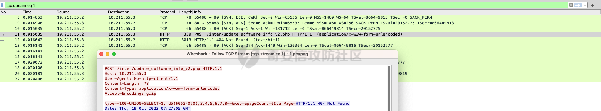
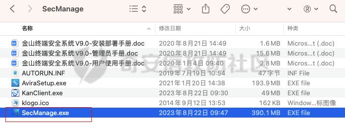
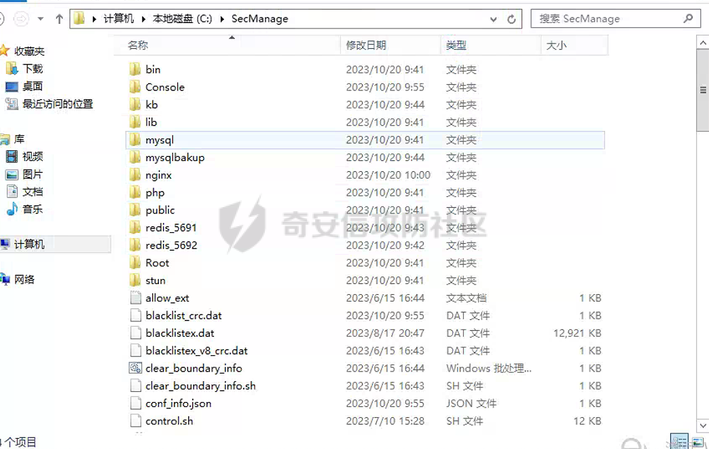
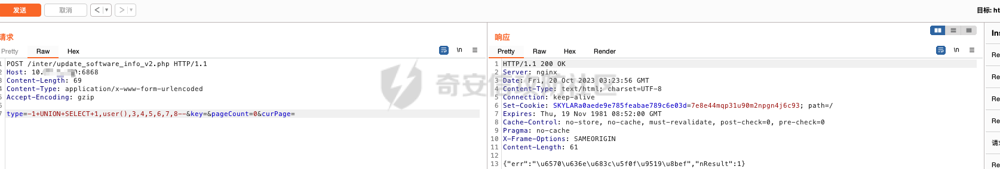
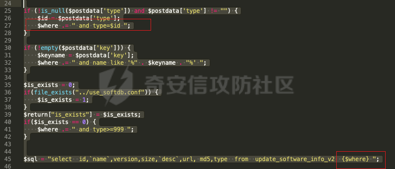
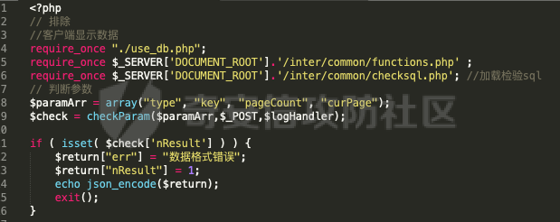
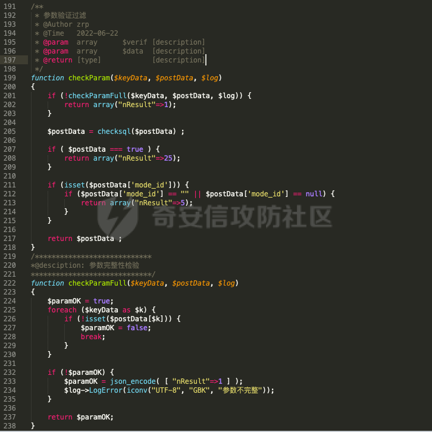
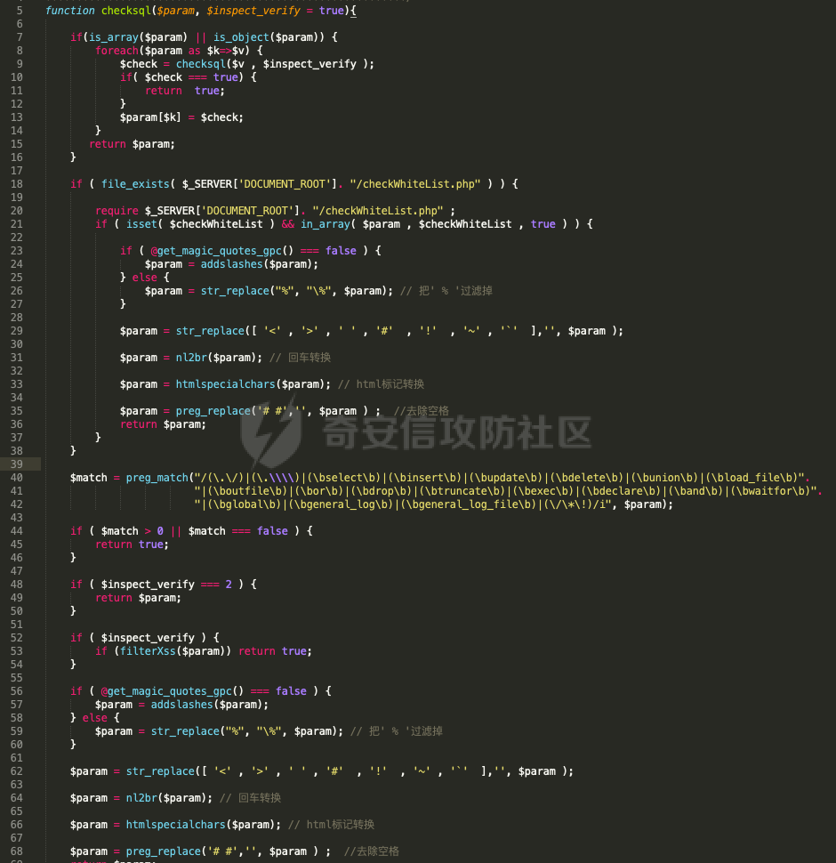
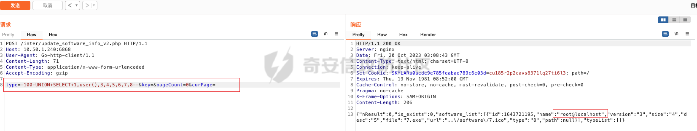

# 奇安信攻防社区-金山终端安全系统V9.0 SQL注入漏洞

### 金山终端安全系统V9.0 SQL注入漏洞

近期，长亭科技监测到猎鹰安全（原金山安全）官方发布了新版本修复了一处SQL注入漏洞。xpc可以检测该漏洞，就想着获取一下poc，并且分析一下漏洞原理。

# 一、漏洞介绍

近期，长亭科技监测到猎鹰安全（原金山安全）官方发布了新版本修复了一处SQL注入漏洞。xpc可以检测该漏洞，就想着获取一下poc，并且分析一下漏洞原理。

# 二、poc获取

xpoc虽然不开源，但是发包总是可以抓的。所以就进行了扫描，然后抓包，结果异常的顺利拿到了poc。

# 三、漏洞原理

1.  首先官网下载试用安装包。
    
    下载网址：[http://duba-011.duba.net/netversion/Package/SecManage.iso](http://duba-011.duba.net/netversion/Package/SecManage.iso)
    
2.  解压安装居然挑环境，只能在windows sever上进行安装，所以这里又在下载了windows sever 2012的镜像，重新安装顺利成功。
    
    iso解压之后SecManage.exe就是管理中心的安装包，在对应系统上安装就可以了。
    
    
    
    安装成功之后登陆界面如下，访问6868端口：
    
    
    
3.  安装过程中可以看到文件释放的位置C:\\SecManage下面。
    
    
    
4.  安装好了，也可以登录了，当然是验证一下存不存在漏洞，流量代理到burp
    
    
    
    发现无论怎么尝试都是返回`数据格式错误`。版本是V9.SP1.E1001 ，版本是包含在漏洞版本之内的。
    
5.  反正都是要看代码的，所以就直接找到C:\\SecManage\\Console\\inter\\update\_software\_info\_v2.php出现漏洞的文件。
    
    出现问题的代码就在这里， 当$postdata\['type'\] 是否不为 null 且不为空字符串。如果满足条件，它会将 $postdata\['type'\]的值赋给$id 变量，然后将 "and type=$id" 添加到 SQL 查询条件的 $where 中。而下面sql语句就是直接将$where拼接而成，猜测就是这里没有过滤导致可以触发sql注入漏洞。
    
    
    
    回到这段代码开始部分，首先定义了一个 $paramArr 数组，其中包含了需要检查的参数名。然后，它使用 checkParam 函数来检查这些参数。在检查后，如果 $check 数组中存在 nResult 键，那么它会意味着参数检查失败，会设置一个包含错误信息的 JSON 响应，并退出脚本。看到了返回`数据格式错误`字段。
    
    
    
6.  全局搜索checkParam函数，找到路径C:\\SecManage\\Console\\inter\\common\\checksql.php文件
    
    checkParam函数，它用于检查传递给它的参数数组 $postData 中是否包含指定的键，以及一些其他的验证。checkParamFull 函数用于检查参数的完整性，它会遍历 $keyData 数组中指定的键，并检查是否都存在$postData 数组中。如果有任何一个键缺失，它将返回 false，否则返回 true。如果参数不完整，它还会记录错误日志。
    
    
    
    接下来，它调用 checksql 函数来检查 $postData 数组中的值是否包含SQL注入，如果检查到SQL注入，它返回一个包含 "nResult" 键值为25的数组，表示SQL注入检测到。
    
    看一下具体代码：
    
    首先，它检查传入的参数 $param 是否为数组或对象。如果是数组或对象，它会递归调用 checksql 函数，以确保所有数组元素或对象属性都经过相同的检查。
    
    接下来，它检查是否存在名为 "checkWhiteList.php" 的文件，并在该文件中定义了$checkWhiteList 变量。如果文件存在并且$param 的值在白名单中，它会执行一系列操作，包括添加反斜杠转义、删除一些特殊字符、处理换行符、将HTML标签转义等。这些操作旨在防止一些常见的攻击。
    
    然后，它使用正则表达式检查 $param 是否包含潜在的SQL注入攻击字符串，如果匹配到，返回 true。则提示错误信息。
    
    
    
7.  所以到这里也就结束了，可以从代码中猜测，存在漏洞的版本应该是没有对参数做单独的sql注入检测或者检测注入的方式不对，导致存在漏洞，而现在官网下载的版本，虽然在受影响范围内，但是已经修复了该漏洞。当去掉这里的检测是可以触发该漏洞。
    
    
    

# 参考链接：

[https://blog.csdn.net/qq\_41904294/article/details/133914831](https://blog.csdn.net/qq_41904294/article/details/133914831)

[https://mp.weixin.qq.com/s/Dd6BZglv6OYXveJOAvoawA](https://mp.weixin.qq.com/s/Dd6BZglv6OYXveJOAvoawA)
