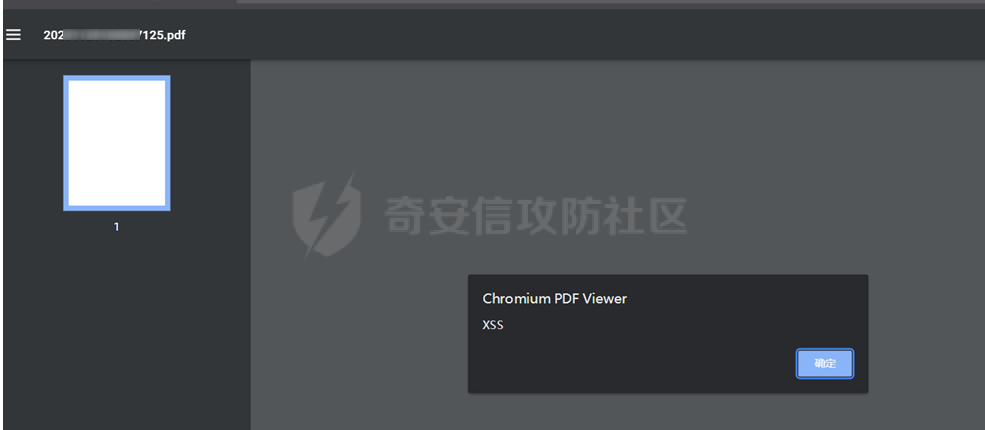

# 奇安信攻防社区-非常规环境下编辑器的一些Bypass思路

### 非常规环境下编辑器的一些Bypass思路

在一些非常规环境下编辑器不固定路径，往往漏洞在后台，为了完成渗透任务，如何出一些未授权的漏洞或者Bypass？ 在一些众测项目、运营商项目、攻防比赛中，经常遇到内容管理系统，然而这样的web使用到eweb、ue等编辑器可能性很大，但常常做了一些优化，如二改、修改路径、做了策略限制，于是总结了一些Bypass

### **1#一年的历程**

转眼又年底了,;去年底感触挺深,11月、12月打了两场攻防，拿了两个第一,回来后状态好又卷了edu的年榜排名。觉得今年还差点意思  
考了个证,花了近一个月,结束后打了靶场,参加了一些众测,拿了些赏金,其余时间全投入项目的大大小小测试了,没花多少时间学习。  

年终了写点东西,非常规环境中编辑器的Byass。  
为什么怎么说呢,在一些众测项目、运营商项目、攻防比赛中，经常遇到内容管理系统，然而这样的web使用到eweb、ue等编辑器可能性很大，但常常做了一些优化，如二改、修改路径、做了策略限制，于是总结了一些Bypass,有几个案例很典型很有意思,便记录下来了  
以下环境均来自二改站点或者路径修复过的站点

### **2#测试过程**

#### 2.1 某jupyter编辑器Bypass

背景:在给某运营商测试站点,发现了下面的指纹

  
很明显,是个jupyter,同时web是在dsspublic这下面  
然后收集漏洞,发现未授权就一种打法，CVE-2019-9644  
就是访问/tree? 是未授权的  
但,当我构造访问/dsspublic/tree?返回了403,如下图,

  
这是不是说明漏洞修复了呢？或者不存在未授权？403的页面带有明显jupyter，很可能是jupyter在鉴权,然后我在想,既然目录做了鉴权，会不会功能点有问题？  
未授权后想要利用RCE需要访问/terminals目录,这里提供一个/terminals/1或者/terminals/2会怎么样呢？  
于是,构造/dsspublic/terminals/1

  
绕过了,后面收集信息发现这应该是nginx做的鉴权，如果jupyter做鉴权是有密码的。  
这也是项目上比较重要的一个RCE了。

#### 2.2 某ewebeditor编辑器Bypass

背景: ewebeditor，是在参加某些排名比赛遇到的,但这是一个废弃站点，很少人关注但他还是存在着，某单位核心系统  
测试的时候爬虫爬到了该地址

  
通过链接，可以看到，网站的存储分为两种，一种是存储在/ewebeditor/uploadfile/下面，另一种是直接上传到UploadFiles  
ewebeditor是二级目录下的，站点中间件做了限制，不是访问存在的资源文件统一返回404

  
这也基本宣布了打eweb后台弱口令或者未授权是条死路,但排名的规则也是收取反射XSS的  
我想到eweb这类编辑器pdf是在白名单下的，可以利用pdf来弹个窗，  
但网上没有任何关于eweb弹XSS的资料，于是到官方站点做了测试

  
从官方资料查看大概是这个位置，因为他是aspx所以/ewebeditor/aspx/upload.aspx  
测试发现目标也是存在的，可能有戏  
  
通常来说，改为post加模块就能达到未授权上传，但这里直接返回了200，无回显  
  
说明上传失败了，在一些特定情况下post上传需要携带一些参数，就像shiro有时候检测post检测不出来，需要发复杂的http请求。  
这里的fuzz参数过程有点复杂，就是挨个测试,完整的参数是action=mfu&style=&type=&cusdir=&key=&0=&blockflag=end  
  
弹窗SUCCESS  

#### 2.3 某ewebeditor编辑器Bypass-2

背景: 还是在给某运营商做测试,这也是项目的第一个RCE,很有意思  
在测试某个web,指纹是打包JS站点，通过一些小技巧,有时候后端JS会优先加载,比如抓取/manger,拿到了manger下面JS,扫描JS发现了ewebeditor的指纹  

  
通过指纹来看,ewebeditor的位置在/manager/ewebeditor/ 目录下  
然后通过信息收集,ewebeditor大部分都是后台洞,通过弱口令上传GETSHELL  
然后路径通常为  
ewebeditor/admin/login.asp  
ewebeditor/login\_admin.asp  
/admin/eweb/login\_admin.asp  
/admin/editor/login\_admin.asp

然后扫描全部都是404,通过长时间查找,发现全是清一流的ewebeditor/admin/login.asp,  
包括官方，但我在其他目录扫描发现了springboot,也就是说这站点应该是jsp的站。  
很可能这ewebeditor是以前更新留下的废弃，忘记删除了而已。  
然后,随手把payload改为了ewebeditor/admin/login.jsp  
  
....  
结果成了，同时账号密码还是admin/admin/,给我整无语了，后续部署GETSHELL,这也验证了一句话，只要猜不到后台地址,即使是amdin/admin也是安全的，即是这站点很多人在测。

#### 2.4 某ueditor编辑器Bypass

背景: 某比赛中，遇到ueditor出网做了限制，同时站点有检测文件content。

  
远程抓取source=\[\]发现站点出网有限制，返回了类似“由于连接方没有响应，连接尝试失败”的字段  
想到让catchimage通过抓取本机图片马处理，先通过uploadimage上传到本机，然后通过catchimage来读取  

  
source参数抓取本机ueditor图片目录，这里测试了本机127.0.0.1的端口失败了，但能读取本机域名下图片

绕过成功，

#### 2.5 某ueditor编辑器

背景: 还是在某排名比赛中,规则是反射XSS也能达到不少分数，很多人不知道ueditor能打XSS。  
如果环境限制了catchimage,还可以试试uploadfile

  

  
如果环境限制了XML文件的读取，还可以试试pdf弹窗，但uploadfile不能触发，可以通过catchimage触发，如果对方出网

这个就有点老生长谈了，不多论述。

### **3#某情报滞后性**

结尾谈一些安全情报的滞后性  
最近新出的某文档I doc view 大概是12月开始，各大公众号都在报道这个漏洞,当作0day来处理，其实关注安全情报，这漏洞早在11月中旬就出poc了。  
... 这时候有人想拿去刷src，其实已经晚很多了，能刷的基本没了。

  
包括某Jeecms，其实早在2021就出过一个未授权文件上传，

  
但如今网上的资料全是后台上传，在一些苛刻的环境下，比如二改，几乎没有后台路径或者做了限制，这样的情报很容易就错失一个高危，写这么多也只是感叹  
下当前资料的肤浅罢了，今年第一次马这么多字.....
