# 奇安信攻防社区-验证码渗透最全总结

### 验证码渗透最全总结

对于图形验证码以及短信验证码的总结

# ​验证码渗透最全总结

\> 不少人在碰见验证码的时候，大多数只是看了一眼就过去了，没想到验证码还有啥可测试的。但其实验证码也能在项目中导致**高危**,并且验证码漏洞能在一定情况下造成危害。

## 验证码总结

验证码分为两块内容，一块是图形验证码，一块是短信验证码。下面是对这些技巧总结的思维导图。

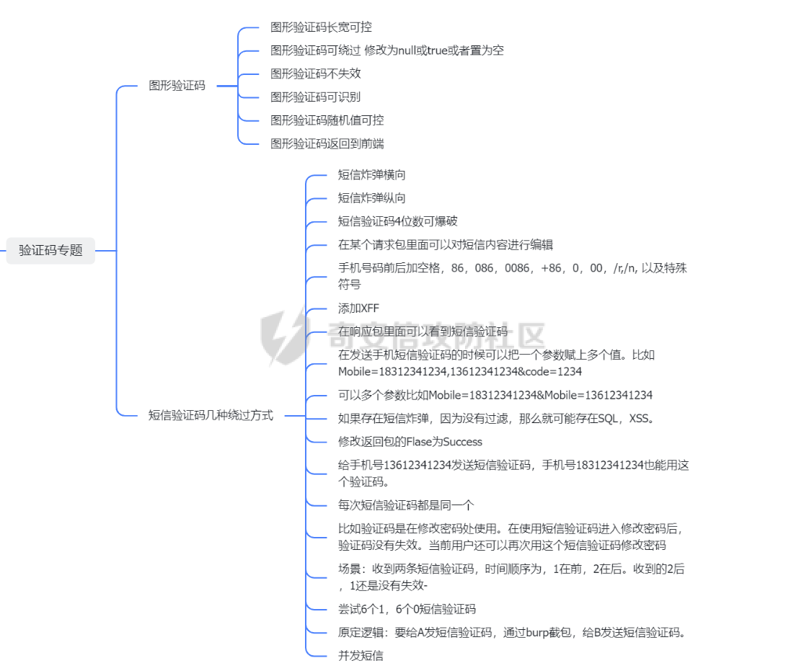

### 图形验证码

#### 图形验证码长宽可控

简单测试方法，就是看到一个登录框，然后新建打开图片链接，在图片链接中就有机会看到两个参数值，一个是 width，一个是 length。这两个参数是计算图片验证码的长宽，如果长宽过高就会过度消耗的是服务器的 CPU 资源。

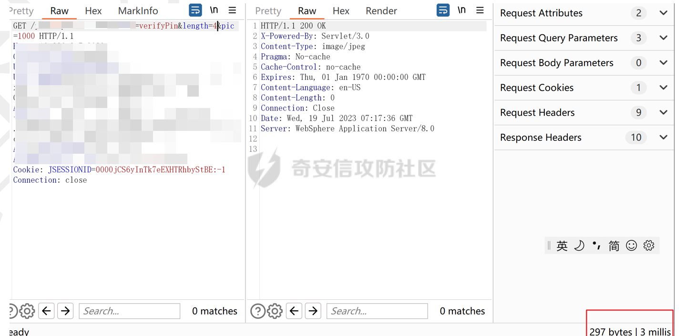  
当length为比较大的时候，响应时间为2767millis  
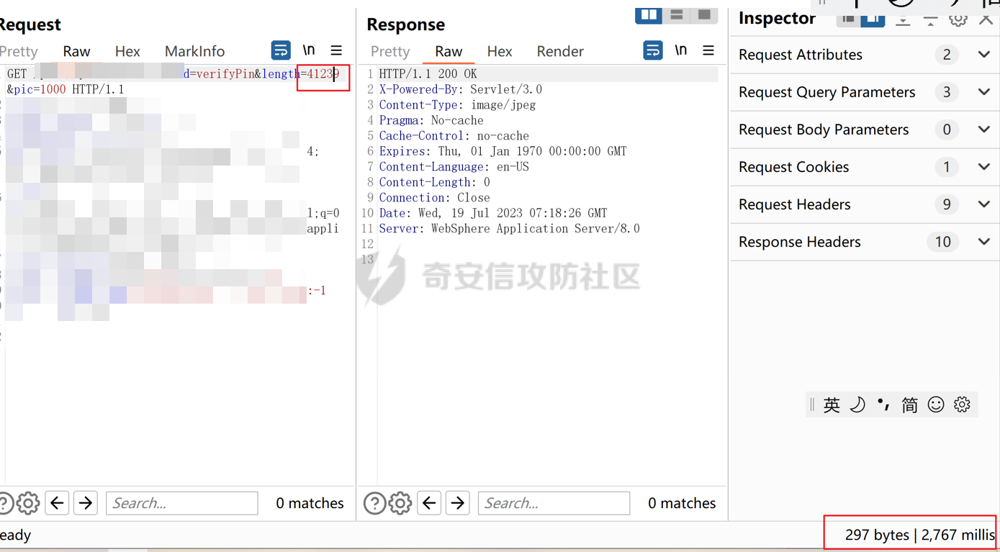  
**注意**：该漏洞能造成服务器拒绝服务攻击。有的 SRC 里面注明了，禁止使用 DDOS 攻击，这种漏洞是不收的，如果提交了漏洞，很有可能面临**法律责任**。

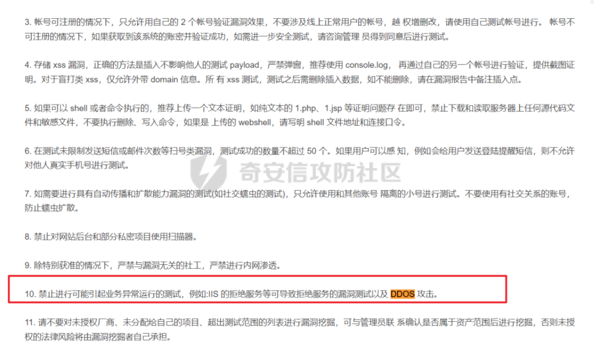

#### 图形验证码可绕过

有时候开发，会写两套图形验证码流程，一套是在生产运行阶段必须使用正确验证码才能通过服务器校验。另外一套是在测试 SIT 环境下，把验证码设置为只要是 null 或者是空都可以登录验证码置为空，提高开发工作效率。还有的时候，将验证码修改为 true 就好了。这个是因为开发在进行图形验证码判断的时候，只要是验证码收到的是 true 就会通过。具体测试过程已经找不到了，大概写一下吧。

#### 图形验证码不失效

简单易懂，图形验证码没有对应的失效机制。导致图形验证码能被多次利用。图形验证码在使用后未失效，发送短信时抓包，发送到Repeter中进行重放，可以发送成功!

#### 图形验证码可识别

这个就是开发在制作图形验证码功能的时候，没有将图形验证码加入足够多的噪点，使验证码能够被现有的工具进行识别。一般是项目硬凑数用的，SRC 全部都不收。具体不做解释

#### 图形验证码随机值可控

都知道图形验证码是后端随机生成的。那么随机生成的时候，有没有可能是能控制这个随机值？有可能! 生成验证码的随机值被写在了 url 里面  
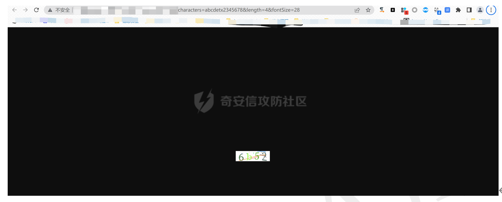

将characters固定为aaaa，可以看到图形验证码为aaaa  

#### 图形验证码返回到前端

测试过程已经找不到了，口头描述下大致就是登录后会在响应包中返回了下次图形验证码的内容。

### 短信验证码

我们已经写完了图形验证码部分，现实情况下短信验证码也是比较多。短信验证码的漏洞技巧要比图形验证码**多很多**

#### 短信炸弹纵向

在一个限制时间的情况下对一个手机号，发送的短信验证码条数超过发送预期，这种漏洞我们都称为`短信炸弹`or`短信轰炸`or`短信炸弹纵向`  
  
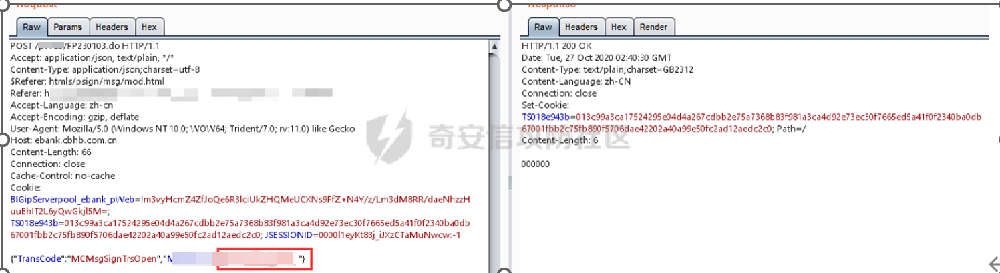  
不停点击repeter或者放到intruder里面，就可以实现一个手机号接收到多条短信  

#### 短信炸弹横向

上面我们提到了在限定时间内，对一个手机号发送超过预期的短信条数是短信轰炸。造成的结果就是浪费短信资源。如果开发把这个漏洞给改了，那么还有没有漏洞？还有？不能给一个人发送短信验证了，那么给其他人发送验证码一样的。  
  
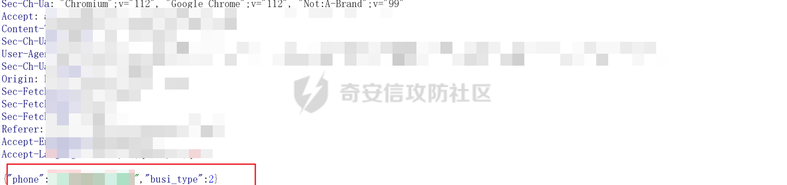  
将phone设置成变量，进行遍历  
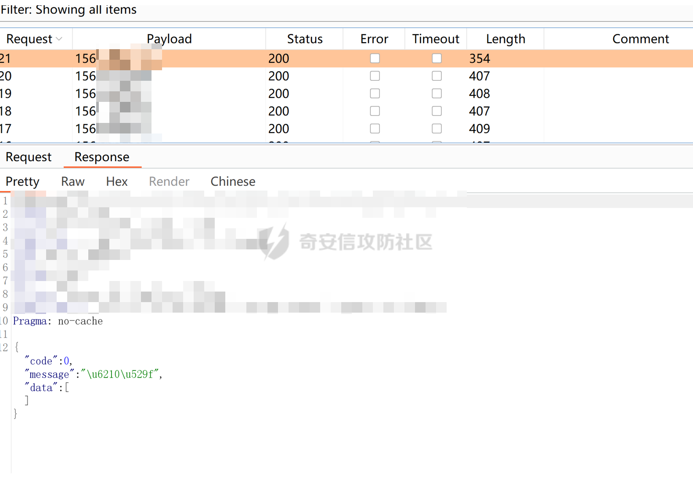

#### 短信验证码可爆破

我们讲了 2 个发送短信验证码，都知道验证码通常 4 位数或者 6 位数的数字验证码。如果服务器没有限制提交的验证码的次数，那么我们可以爆破这个验证码。并且如果有 4 位验证码被爆破成功的话，在 SRC 里面通常是按照高危处理。

#### 短信验证码可编辑

我们讲了发送短信验证码以及爆破短信验证码。我们知道短信验证码功能发送的是短信，那么我们就有可能把短信内容给更改。  
  
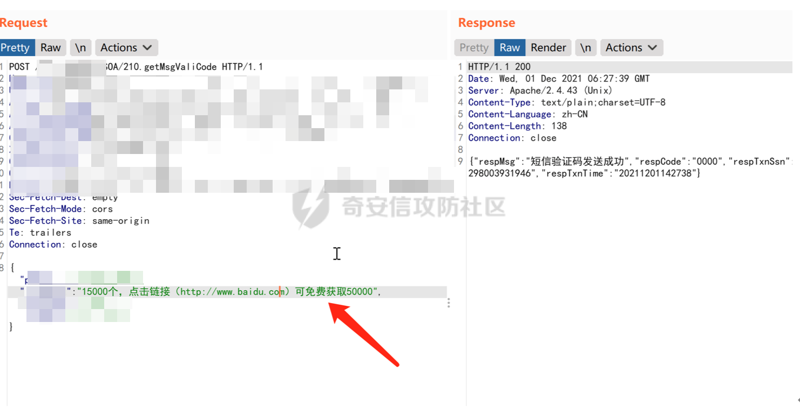  
通过修改transAmt 参数内容，可随意修改短信内容  
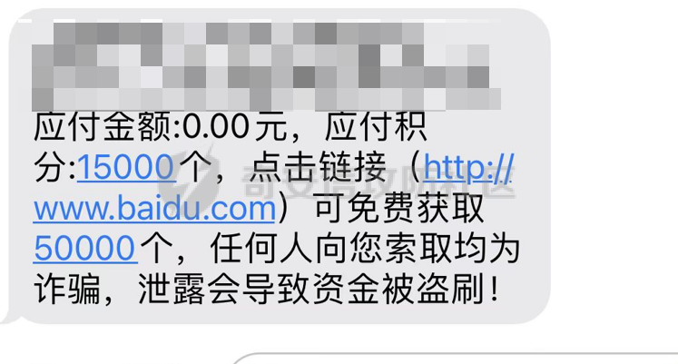

### 短信炸弹的绕过技巧

我们在了解基础短信验证码的漏洞后，相应的开发也会进行了解。那么我们就需要增加技巧来绕过这些东西。

#### 短信炸弹的绕过技巧 1--特殊字符

通常，开发在发送短信验证码的时候，没有对特殊字符进行过滤。比如在手机号是 15312341234。我们加上+86，变成+8615312341234，这样的话服务器就有可能判定为两个手机号了。

在 mobile=15312341234 的前面，加`空格`，`86`，`086`，`0086`，`+86`，`0`，`00`，`/r,/n`,`?`,`#`,`!`,`,`...只要想法多就有可能绕过。  
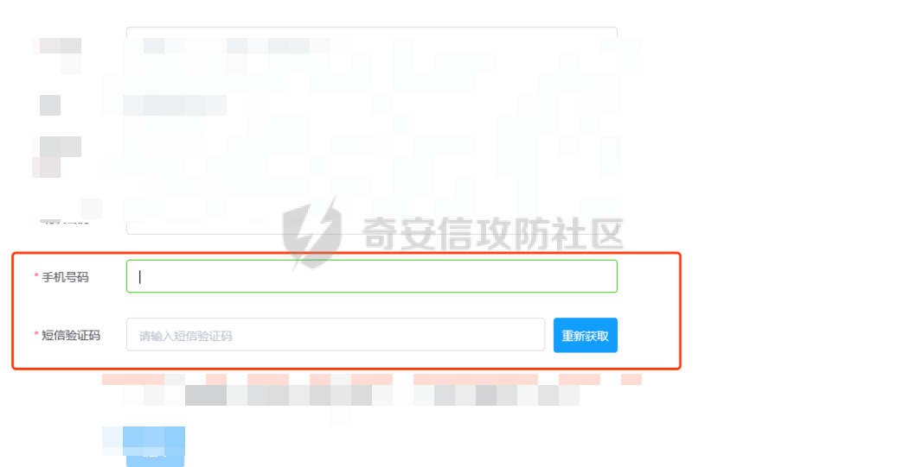

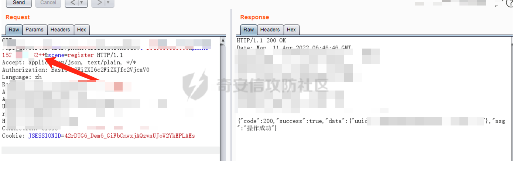  
控制phone参数进行攻击  
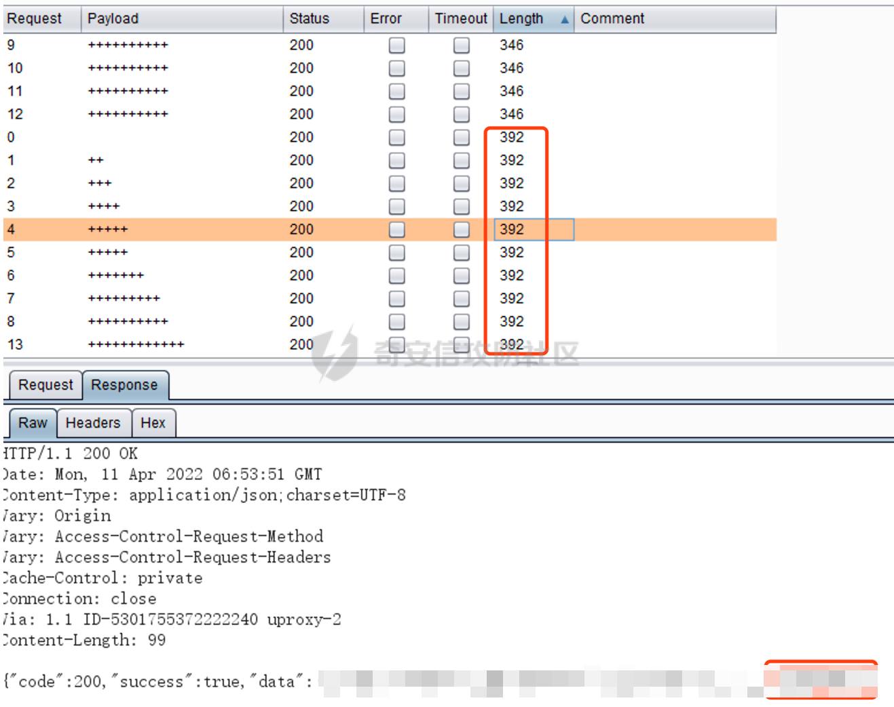

#### 短信炸弹的绕过技巧 2--添加 XFF

在请求包中添加XFF头，有的时候服务器是按照IP地址进行判定的。

#### 短信炸弹的绕过技巧 3--添加多个值

在发送手机短信验证码的时候可以把一个参数赋上多个值。比如 Mobile=18312341234,13612341234&code=1234

#### 短信炸弹的绕过技巧 4--添加多个参数

比如 Mobile=18312341234&Mobile=13612341234

#### 短信炸弹的绕过技巧 5--修改返回包

在发送短信验证码的数据包，修改返回包的 Flase 为 Success

#### 短信炸弹的绕过技巧 6--并发

对短信验证码的数据包进行并发，有机会绕过限制

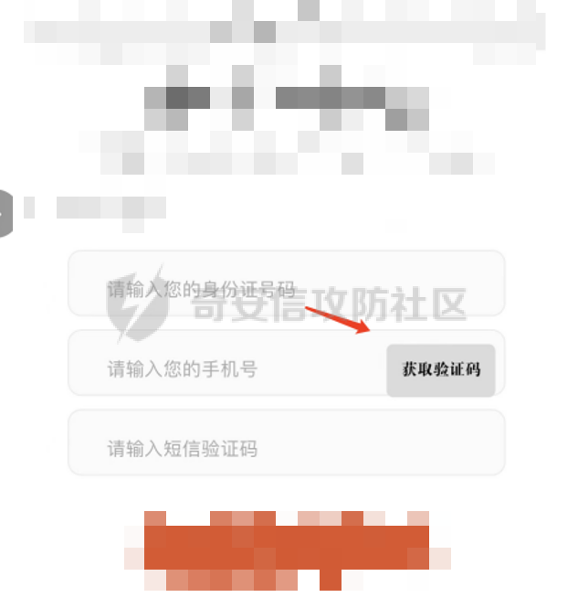  

#### 在响应包里面可以看到短信验证码

在抓取短信验证码的数据包后，在 response 可以看到短信验证码

#### 提交别人的验证码

假设有一个需要短信验证码功能点。给自己手机号 13512341234 发送验证码为 111111，给别人手机号 18312341234 收到验证码为 222222。那么自己手机号使用 222222 验证码，也能正常登录

#### 每次短信验证码都是同一个

一个手机号，点击 2 次发送短信验证码，验证码都是同一个。这样的情况下，可以试试爆破验证码，如果爆破次数无限制，还是存在验证码固定这样漏洞的

#### 验证码不失效 1

比如验证码是在修改密码处使用。在使用短信验证码进入修改密码后，验证码没有失效。当前用户还可以再次用这个短信验证码修改密码

#### 验证码不失效 2

场景：收到两条短信验证码，时间顺序为，1 在前，2 在后。收到的 2 后，1 还是没有失效-

#### 验证码绕过技巧

项目在上线前，只是写好验证码接口，不会调用短信资源。因而为了功能登录会把验证码设计成固定的比如尝试 6 个 1，6 个 0 短信验证码

#### 验证码技巧

在找回密码方面，填写完账号名，要给A发短信验证码，通过burp拦截包，给B发送短信验证码。这样的话，就能用B的验证码提交给A用，造成任意账号密码重置

本文仅用于技术讨论与学习，利用此文所提供的信息而造成的任何直接或者间接的后果及损失，均由使用者本人负责，文章作者及本公众号不为此承担任何责任。
