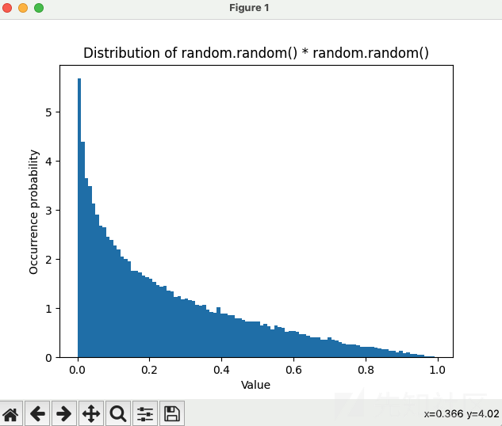

# 如何实现一个 fuzzer - 先知社区

如何实现一个 fuzzer

* * *

## 前言

最近读了 go fuzz 源码，好几处细节不太理解为什么要这么写。决定自己造个轮子，完成一个 fuzzer，加深自己的理解。先是读完了 [Build simple fuzzer](https://carstein.github.io/2020/04/18/writing-simple-fuzzer-1.html) 系列，师傅写的非常诙谐，文章娓娓道来，受益良多。师傅是用 python 实现了一个能够 fuzz C 或 C++ 可执行文件的 fuzzer，并把 [vsf 源码](https://github.com/carstein/vsf/releases) 托管到了 github 上，有 4 个 tag，和文章一一对应。

首先我会把师傅的最终代码进行事无巨细的分析，并把师傅的 binary ninja 自动下断点的代码改成 ida 脚本插件版本，更方便我们配合 ida 进行使用。最后我会说下我对师傅的变异算法的解读，并试图优化一下师傅的变异策略。在最后完成 go 的部分[重构](https://github.com/pic4xiu/SomethingToPlay/blob/main/fuzzer/tagOne/main.go)。

## [vsf](https://github.com/carstein/vsf/releases) 整体 fuzz 流程

1.  声明要 fuzz 的对象、语料库、断点等
2.  语料读入，初始化变异器
3.  变异器进行迭代
4.  执行 fuzz 逻辑
5.  记录根据当前变异器得到的文件所能观察到的块
6.  更新 corpus
7.  用户是否发出终止命令，发出了就保存 crash 文件，否则就回 3 继续执行

## vsf 代码解读

> [https://github.com/carstein/vsf/releases](https://github.com/carstein/vsf/releases)

建议先把师傅的源码流程过一遍，互相调用不算少

### 变异器类：

```plain
class Mutator:
  def __init__(self, core):#它接受一个参数 core 作为核心样本集
    # core set of samples
    self.core = core#核心样本集，存储一组样本。

    # Data format = > (array of bytearrays, coverage)
    self.trace = set() # Currently observed blocks
    #当前观察到的块集合，使用set数据结构存储。
    self.corpus =   [] # Corpus of executed samples
    #执行过的样本集，使用列表[]存储。
    self.pool =     [] # Mutation pool
    #变异池，使用列表[]存储。
    self.samples =  [] # Mutated samples
    #变异后的样本集，使用列表[]存储。

  def __iter__(self):
    # Initiate mutation round
    self._fit_pool()
    self._mutate_pool()
    return self

  def __next__(self):
    if not self.samples:
      self._fit_pool()
      self._mutate_pool()

    global stop_flag
    if stop_flag:
      raise StopIteration
    else:
      return self.samples.pop()
```

这个类实现了`__iter__`方法，返回一个迭代器对象。在这个方法中，首先调用`_fit_pool`方法和`_mutate_pool`方法，用于初始化变异池和进行变异操作。然后返回 self 作为迭代器对象。这个类还实现了`__next__`方法，用于返回下一个变异后的样本。在这个方法中，首先判断变异后的样本集 self.samples 是否为空，如果为空，则调用`_fit_pool`方法和`_mutate_pool()`方法，用于初始化变异池和进行变异操作。然后判断全局变量 stop\_flag 的值，如果为 True，则抛出 StopIteration 异常，表示迭代结束；否则，返回 `self.samples.pop()`，弹出并返回变异后的样本。

简单来说，这个类是一个用于变异操作的类，通过构造函数初始化一些实例变量，包括核心样本集、当前观察到的块集合、执行过的样本集、变异池和变异后的样本集。通过实现`__iter__`方法返回一个迭代器对象，以及实现`__next__`方法返回下一个变异后的样本。这个类可以用于生成变异后的样本集。

之后就是我们的初始化变异池函数：

```plain
def _fit_pool(self):
    # fit function for our genetic algorithm
    # Always copy initial corpus
    print('### Fitting round\t\t')
    for sample in self.core:
      self.pool.append((sample, []))
    # 遍历核心样本集 self.core，将每个样本和一个空列表作为元组 (sample, []) 添加到变异池 self.pool 中
    print('Pool size: {:d} [core samples promoted]'.format(len(self.pool)))

    # Select elements that uncovered new block
    for sample, trace in self.corpus:
    # 执行过的样本集self.corpus中的每个样本和对应的观察到的块集合
      if trace - self.trace: 
        self.pool.append((sample, trace))
    # 如果该样本观察到的块集合与当前观察到的块集合self.trace有不同
    # 则将该样本和块集合添加到变异池self.pool中

    print('Pool size: {:d} [new traces promoted]'.format(len(self.pool)))

    # Backfill to 100
    if self.corpus and len(self.pool) < 100:
    # 如果执行过的样本集self.corpus非空，并且变异池self.pool的大小小于100，那么会进行补充
      self.corpus.sort(reverse = True, key = lambda x: len(x[1]))
      #首先对执行过的样本集进行降序排序，按照观察到的块集合的长度进行比较
      for _ in range(min(100-len(self.pool), len(self.corpus))):
        # Exponential Distribution
        v = random.random() * random.random() * len(self.corpus)
        # 通过这种方式，随机选择一些样本并将其添加到变异池中，这里留个印象，这就是遗传算法的变异策略

        self.pool.append(self.corpus[int(v)])
        self.corpus.pop(int(v))
        # 添加后，从执行过的样本集中移除这些样本
      print('Pool size: {:d} [backfill from corpus]'.format(len(self.pool)))
    print('### End of round\t\t')

    # Update trace info
    for _, t in self.corpus:
      self.trace |= t

    # Drop rest of the corpus
    self.corpus = []
```

在方法的最后，遍历执行过的样本集 self.corpus，将每个样本对应的观察到的块集合与当前观察到的块集合进行合并操作，更新 self.trace 的值。之后将执行过的样本集 self.corpus 清空，即删除其中的所有样本。

总结起来，这个方法用于根据当前的观察到的块集合和执行过的样本集，将样本添加到变异池中。首先会将核心样本集中的样本添加到变异池中。然后，根据执行过的样本集中观察到的新块，将样本和块集合添加到变异池中。接着，如果变异池的大小小于 100，则根据 random 乘 random 的方式从执行过的样本集中“随机”选择一些样本进行补充。最后，更新当前观察到的块集合，并清空执行过的样本集。

```plain
def _mutate_pool(self):
    # Create samples by mutating pool
    while self.pool:# 池子里有东西就弹出
      sample,_ = self.pool.pop()
      for _ in range(10):## 把弹出的 sample 执行变异，当成 samples 填入
        self.samples.append(Mutator.mutate_sample(sample))


  def update_corpus(self, data, trace = None):
    self.corpus.append((data, trace))## 更新语料库
```

这两个函数比较简单，见注释，其中 `update_corpus` 函数我们会在 main 函数调用来更新 corpus

之后就是师傅写的变异的具体函数了，首先是一个派发具体要调用哪个变异方法的函数，也就是上文：`mutate_sample`

```plain
@staticmethod
  def mutate_sample(sample):
    _sample = sample[:] # Copy sample


    methods = [##这些方法都是之后要使用的具体变异函数
      Mutator.bit_flip,
      Mutator.byte_flip,
      Mutator.magic_number,
      Mutator.add_block,
      Mutator.remove_block,
    ]


    f = random.choice(methods)# 选哪个方法
    idx = random.choice(range(0, len(_sample)))# 选索引
    f(idx, _sample)


    return _sample
```

```plain
SIZE = [4, 8, 16, 32, 64]
FLIP_ARRAY = [1, 2, 4, 8, 16, 32, 64, 128]
MAGIC_VALS = [
  [0xFF],
  [0x7F],
  [0x00],
  [0xFF, 0xFF], # 0xFFFF
  [0x00, 0x00], # 0x0000
  [0xFF, 0xFF, 0xFF, 0xFF], # 0xFFFFFFFF
  [0x00, 0x00, 0x00, 0x00], # 0x00000000
  [0x00, 0x00, 0x00, 0x80], # 0x80000000
  [0x00, 0x00, 0x00, 0x40], # 0x40000000
  [0xFF, 0xFF, 0xFF, 0x7F], # 0x7FFFFFFF
]

...

  @staticmethod
  def bit_flip(index, _sample):# 选和哪个FLIP_ARRAY进行异或
    num = random.choice(SIZE)
    for idx in random.choices(range(len(_sample)), k = num):
      _sample[idx] = _sample[idx] ^ random.choice(FLIP_ARRAY)

  @staticmethod
  def byte_flip(index, _sample):# 选和那个random.getrandbits(8)进行异或，算是加强版的bit_flip
    num = random.choice(SIZE)
    for idx in random.choices(range(len(_sample)), k = num):
      _sample[idx] = _sample[idx] ^ random.getrandbits(8)

  @staticmethod
  def magic_number(index, _sample):
    selected_magic = random.choice(MAGIC_VALS)

    # guard clause, we don't want to go off by one
    if index > (len(_sample) - len(selected_magic)): # 做个防越界
      index = len(_sample) - len(selected_magic)

    for c, v in enumerate(selected_magic):
      _sample[index + c] = v

  @staticmethod
  def add_block(index, _sample):## 添加和移除块，四四方方的移除
    size = random.choice(SIZE)
    _sample[index:index] = bytearray((random.getrandbits(8) for i in range(size)))

  @staticmethod
  def remove_block(index, _sample):
    size = random.choice(SIZE)

    _sample = _sample[:index] + _sample[index+size:]
```

### 防止 ASLR 随机化

> 让造成程序 crash 的样本单一化

这里解释一下为什么要搞个这个函数：首先得到了造成程序 crash 的文件是很好，但是贪多就不行了，假如对于每个能够造成程序 crash 的文件我们都进行记录的话，这会造成我们保存文件过多，反而不利于我们分析，因此需要去重。而对于 linux 程序来说，aslr 已然是必备了，所以必须使用到绝对地址减去内存映射的方式。用这种方式，把造成程序 crash 的指针记住，每次出现 crash 时候都去看，如果有的话就直接跳过就好了，没有的话就注册并更新。

```plain
def get_base(vmmap):
  for m in vmmap:
    ## 如果有可执行权限，并且后缀是我们这个文件名的，就返回他的起始地址
    if 'x' in m.permissions and m.pathname.endswith(os.path.basename(config['target'])):
      return m.start
```

类似这种形式：

```plain
06:0030│     0x7fffffffe1d8 ◂— 0x6887a0b1d2b37c3e
07:0038│     0x7fffffffe1e0 —▸ 0x555555555060 (_start) ◂— endbr64 
─────────────────────────────────────────────────────────────────────────────────────────────────────────────────────[ BACKTRACE ]──────────────────────────────────────────────────────────────────────────────────────────────────────────────────────
 ► 0   0x555555555149 main
   1   0x7ffff7df3083 __libc_start_main+243
────────────────────────────────────────────────────────────────────────────────────────────────────────────────────────────────────────────────────────────────────────────────────────────────────────────────────────────────────────────────────────
pwndbg> vmmap
LEGEND: STACK | HEAP | CODE | DATA | RWX | RODATA
             Start                End Perm     Size Offset File
    0x555555554000     0x555555555000 r--p     1000      0 /home/main
    0x555555555000     0x555555556000 r-xp     1000   1000 /home/main
    0x555555556000     0x555555557000 r--p     1000   2000 /home/main
    0x555555557000     0x555555558000 r--p     1000   2000 /home/main
    0x555555558000     0x555555559000 rw-p     1000   3000 /home/main
    0x7ffff7dcf000     0x7ffff7df1000 r--p    22000      0 /usr/lib/x86_64-linux-gnu/libc-2.31.so
    0x7ffff7df1000     0x7ffff7f69000 r-xp   178000  22000 /usr/lib/x86_64-linux-gnu/libc-2.31.so
    0x7ffff7f69000     0x7ffff7fb7000 r--p    4e000 19a000 /usr/lib/x86_64-linux-gnu/libc-2.31.so
    0x7ffff7fb7000     0x7ffff7fbb000 r--p     4000 1e7000 /usr/lib/x86_64-linux-gnu/libc-2.31.so
    0x7ffff7fbb000     0x7ffff7fbd000 rw-p     2000 1eb000 /usr/lib/x86_64-linux-gnu/libc-2.31.so
    0x7ffff7fbd000     0x7ffff7fc3000 rw-p     6000      0 [anon_7ffff7fbd]
    0x7ffff7fcb000     0x7ffff7fce000 r--p     3000      0 [vvar]
    0x7ffff7fce000     0x7ffff7fcf000 r-xp     1000      0 [vdso]
    0x7ffff7fcf000     0x7ffff7fd0000 r--p     1000      0 /usr/lib/x86_64-linux-gnu/ld-2.31.so
    0x7ffff7fd0000     0x7ffff7ff3000 r-xp    23000   1000 /usr/lib/x86_64-linux-gnu/ld-2.31.so
    0x7ffff7ff3000     0x7ffff7ffb000 r--p     8000  24000 /usr/lib/x86_64-linux-gnu/ld-2.31.so
    0x7ffff7ffc000     0x7ffff7ffd000 r--p     1000  2c000 /usr/lib/x86_64-linux-gnu/ld-2.31.so
    0x7ffff7ffd000     0x7ffff7ffe000 rw-p     1000  2d000 /usr/lib/x86_64-linux-gnu/ld-2.31.so
    0x7ffff7ffe000     0x7ffff7fff000 rw-p     1000      0 [anon_7ffff7ffe]
    0x7ffffffde000     0x7ffffffff000 rw-p    21000      0 [stack]
0xffffffffff600000 0xffffffffff601000 --xp     1000      0 [vsyscall]
```

### 获取断点函数

> 从我们给的文件中挑出偏移断点，打断点的 ida 插件在后边有提到

```plain
def get_bpmap(path):
  bpmap = []


  if path and os.path.isfile(path):
    with open(path, "r") as fh:
      for line in fh.readlines():## 按 16进制 保存
        bpmap.extend(list(map(lambda x: int(x.strip(), 16), line.split())))
  else:
    print("No breakpoint map; trace won't be generated")


  return bpmap
```

### 单个 fuzz 流程

```plain
def execute_fuzz(dbg, data, bpmap):
  trace = set()
  cmd = [config['target'], config['file']]
  pid = debugger.child.createChild(cmd, no_stdout=True, env=None)
  proc = dbg.addProcess(pid, True)
  base = get_base(proc.readMappings())# 得基础地址


  # Insert breakpoints for tracing
  if bpmap:
    for offset in bpmap:
      proc.createBreakpoint(base + offset)# 设置断点

  while True:
    proc.cont()# 继续跑
    event = dbg.waitProcessEvent()
    # 等事件
    if event.signum == signal.SIGSEGV:
      crash_ip = proc.getInstrPointer() - base - 1 # getInstrPointer() always returns instruction + 1
      if crash_ip not in crashes:# 唯一化保存
        crashes[crash_ip] = data
      proc.detach()# 脱调试，直接 break 出去
      break
    elif event.signum == signal.SIGTRAP:# 断点
      ip = proc.getInstrPointer()
      br = proc.findBreakpoint(ip-1).desinstall()# 命中就取消
      proc.setInstrPointer(ip-1) # Rewind back to the correct code
      trace.add(ip - base - 1)
    elif event.signum == signal.SIGINT:
      print('Stoping execution')
      proc.detach()
      break
    elif isinstance(event, debugger.ProcessExit):
      proc.detach()
      break
    else:
      print('Something went wrong -> {}'.format(event))

  # Program terminated
  return trace
```

整体看下来，就是把要 fuzz 的和要打断点的一个个打上，然后一个永真，不断执行下去，最后出错了就保存造成 crash 的数据，不然就更新自己的 trace。最后返回的是 trace，也就是程序命中的断点数目

### main 函数执行过程

```plain
for sample in mutator:
    save_file(sample)
    trace = execute_fuzz(dbg, sample, bp_map)
    mutator.update_corpus(sample, trace)
    counter += 1


    print('#{:3d} Coverage {:.2f}%\r'.format(
        counter, (len(trace)/len(bp_map)) * 100), end='')
```

保存文件，执行 fuzz ，然后根据 trace 不断更新变异器的过程。

### ida 脚本插件

师傅在这里用 binary ninja 写了个自动下断脚本，我把它改成 ida 脚本的形式，效果完全相同：

```plain
import idaapi
import idautils
skip_func = ['__libc_csu_init', 
             '__libc_csu_fini', 
             '_fini',
             '__do_global_dtors_aux',
             '_start',
             '_init',
             'sub_1034']

min_ea = idaapi.cvar.inf.min_ea
max_ea = idaapi.cvar.inf.max_ea
bv = idaapi.get_bytes(idaapi.get_fileregion_offset(min_ea), max_ea - min_ea)
base = idaapi.get_segm_by_name(".text").start_ea

for func_ea in idautils.Functions(base,  idaapi.get_segm_by_name(".text").end_ea):
    func_name = idaapi.get_func_name(func_ea)
    if func_name in skip_func:
        continue
    func=idaapi.get_func(func_ea)
    if func_name is None or func.flags & idaapi.FUNC_LIB:
        continue
    output = ""
    for bb in idaapi.FlowChart(idaapi.get_func(func_ea)):
        output += "0x{:x} ".format(bb.start_ea - base)
    print(output)
```

在这里可以改成保存成文件的形式，方便之后加载到我们的断点中，这段代码的作用是遍历二进制文件中的所有函数，并输出每个函数的基本块地址。

首先，`min_ea` 和 `max_ea` 分别获取了当前二进制文件的起始地址和结束地址。然后，`idaapi.get_bytes()` 函数获取了整个二进制文件的字节流，并将其存储在 `bv` 变量中。接下来，`base` 获取了名为 `.text` 的段的起始地址，用于计算每个函数的基本块地址。`idautils.Functions()` 函数遍历了 `.text` 段中的所有函数，并将其存储在 `func_ea` 变量中。在循环中，首先使用 `idaapi.get_func_name()` 函数获取当前函数的名称，并检查是否在 `skip_func` 列表中。如果在列表中，则跳过当前函数。然后，使用 `idaapi.get_func()` 函数获取当前函数的 `func_t` 结构体，并检查是否为导入函数或无效函数。如果是，则跳过当前函数。最后，使用 `idaapi.FlowChart()` 函数获取当前函数的控制流程图，并遍历其中的所有基本块。对于每个基本块，计算其相对于 `.text` 段的偏移量，并将其添加到 `output` 变量中。最后，输出 `output` 变量，即当前函数的所有基本块地址。

改写的这个插件可以得到每个函数的基本块地址，以便进行后续的分析和调试。

## 变异算法

### 变异算法分析

师傅在处理遗传算法的时候用的是这个算法：

```plain
# Backfill to 100
    if self.corpus and len(self.pool) < 100:
    # 如果执行过的样本集self.corpus非空，并且变异池self.pool的大小小于100，那么会进行补充
      self.corpus.sort(reverse = True, key = lambda x: len(x[1]))
      #首先对执行过的样本集进行降序排序，按照观察到的块集合的长度进行比较
      for _ in range(min(100-len(self.pool), len(self.corpus))):
        # Exponential Distribution
        v = random.random() * random.random() * len(self.corpus)
        # 通过该方式，随机选择一些样本并将其添加到变异池中，这里留个印象，这就是遗传算法的变异策略

        self.pool.append(self.corpus[int(v)])
        self.corpus.pop(int(v))
        # 添加后，从执行过的样本集中移除这些样本
      print('Pool size: {:d} [backfill from corpus]'.format(len(self.pool)))
    print('### End of round\t\t')
```

事实上，我们可以画个直方图看下具体分布情况：

```plain
In [84]: import random
    ...: import matplotlib.pyplot as plt
    ...: data = [random.random() * random.random() for _ in range(100000)]
    ...: plt.hist(data, bins=100, density=True)
    ...: plt.xlabel('Value')
    ...: plt.ylabel('Occurrence probability')
    ...: plt.title('Distribution of random.random() * random.random()')
    ...: plt.show()
```

[](https://xzfile.aliyuncs.com/media/upload/picture/20230626164159-50804aca-13fd-1.png)

看上去似乎是合理的，因为索引越靠前的越容易被我们选中，而我们也根据 sort 让他把命中更多的放到了前边。但是试想一下：假如我们的 corpus 命中的 trace 是100、1、1、1、1、1、1、1。也就是说，索引为 0 的代表 100，其余所有都是一个很小的 trace：1，trace 为 1 所占比例甚至还大于我们的 100，这显然不是很合理。当然我说的很极端的情况，但也足够说明。因此我们需要真正把 trace 量化到具体遗传变异策略中，而不是通过一个索引的方式解决。我觉得对于该算法，使用[轮盘赌](https://zhuanlan.zhihu.com/p/140418005)是更合理的，类似这种：

### 变异算法优化

```plain
import random

def roulette_wheel_selection(population, fitness):
    # 计算适应度总和
    total_fitness = sum(fitness)

    # 计算每个个体的选择概率
    probabilities = [fit / total_fitness for fit in fitness]

    # 构建累积概率列表
    cumulative_probabilities = [sum(probabilities[:i+1]) for i in range(len(probabilities))]

    # 选择一个随机数
    random_num = random.random()

    # 根据随机数选择一个个体
    for i, prob in enumerate(cumulative_probabilities):
        if random_num <= prob:
            return population[i]

    # 如果未能选择，则返回最后一个个体
    return population[-1]

# 示例用法
population = ['A', 'B', 'C', 'D', 'E']
fitness = [100, 1, 1, 1, 1]

selected_individual = roulette_wheel_selection(population, fitness)
print("Selected individual:", selected_individual)
```

这种情况下更加合理，这样的话，A，也就是命中更多断点的样例获得了更大的选择概率：100/104。如果是之前的形式，优良的样例 A，选择概率甚至还没有命中 trace 为 1 的概率高：4/5。

## 重构部分代码

我把师傅的 0.1 版本完成了 go 的重构，整体 fuzzer 的整体思路也基本敲明白了，之后没事了再开发，把代码敲到 GitHub 里。

逐行看一下：需要创建造成 crashes 的文件夹，之后从命令行中得到需要 fuzz 的语料，之后使用 getBytes 得到原始文件，然后设置 fuzz 的整体轮数，将原始文件先拷贝到 data 中，之后产生一个变异。下一行，师傅把变异结果放到了一个新的文件中（createNew 函数），之后就是真正要执行的 executeFuzz。

```plain
func main() {
    if _, err := os.Stat("crashes"); os.IsNotExist(err) {
        if err := os.Mkdir("crashes", 0755); err != nil {
            fmt.Printf("创建文件夹失败：%v\n", err)
            os.Exit(1)
        }
    }
    if len(os.Args) < 2 {
        usage()
    } else {
        filename := os.Args[2]
        // fmt.Println(filename)
        origData := getBytes(filename)
        counter := 0
        for counter < 100 {//代数，可以随便改，也可以不写死，按照参数的方式传进来
            data := make([]byte, len(origData))
            copy(data, origData)
            mutatedData := mutate(data)
            createNew(mutatedData) // 直接读内存的mutatedData也行
            executeFuzz(mutatedData, counter)

            if counter%10 == 0 {
                fmt.Printf("Counter: %d\n", counter)
            }

            counter++
        }
    }
}
```

### executeFuzz

executeFuzz函数严格意义上可以使用 `cmd.SysProcAttr = &syscall.SysProcAttr{Ptrace: true}` 的父子进程调试的方式，但因为接收信号过于方便，就用了信号量的方式）。

```plain
func executeFuzz(data []byte, counter int) {
    cmd := exec.Command("./main", "data/mutated.jpg")

    // 启动子进程
    if err := cmd.Start(); err != nil {
        fmt.Printf("启动子进程失败：%v\n", err)
        os.Exit(1)
    }

    // 等待子进程退出
    done := make(chan error, 1)
    go func() {
        done <- cmd.Wait()
    }()
    if err := <-done; err != nil {
            if err := writeDataToFile(counter, data); err != nil {//有错误的话，直接写一个 crash，程序继续进行
                fmt.Printf("写入文件失败：%v\n", err)
                os.Exit(1)
            }

            fmt.Println("写入文件成功！")
            fmt.Printf("子进程退出：%v\n", err)
        }
    }
}
```

### mutate 函数

```plain
const FLIP_RATIO = 0.01

var FLIP_ARRAY = []byte{1, 2, 4, 8, 16, 32, 64, 128}//进行异或
var MAGIC_VALS = [][]byte{//期望能够输入最大值或最小值来让程序陷入边界条件判定
    {0xFF},
    {0x7F},
    {0x00},
    {0xFF, 0xFF},
    {0x00, 0x00},
    {0xFF, 0xFF, 0xFF, 0xFF},
    {0x00, 0x00, 0x00, 0x00},
    {0x00, 0x00, 0x00, 0x80},
    {0x00, 0x00, 0x00, 0x40},
    {0xFF, 0xFF, 0xFF, 0x7F},
}

...

func mutate(data []byte) []byte {
    flips := int(float64(len(data)-4) * FLIP_RATIO)
    flipIndexes := rand.Perm(len(data) - 8)[:flips]//这块想了半天，最后决定就这样吧。让底下加二也可以
    // fmt.Println(len(flipIndexes))


    for _, idx := range flipIndexes {
        method := rand.Intn(2)


        if method == 0 {
            data[idx+2] = bitFlip(data[idx+2])
        } else {
            magic(data, idx+2)
        }
    }


    return data
}


// func bitFlip(b byte) byte {
//  return b ^ 0x01
// }


func bitFlip(byteVal byte) byte {
    flipVal := FLIP_ARRAY[rand.Intn(len(FLIP_ARRAY))]
    return byteVal ^ flipVal
}


func magic(data []byte, idx int) {
    pickedMagic := MAGIC_VALS[rand.Intn(len(MAGIC_VALS))]


    for i, m := range pickedMagic {
        data[idx+i] = m
    }
}
```

`getBytes` 和 `writeDataToFile` 这种功能性函数不与赘述，详见[源码](https://github.com/pic4xiu/SomethingToPlay/blob/main/fuzzer/tagOne/main.go)
