# 如何给海淘电子产品挑一根「合格」电源线 - 少数派

喜欢海淘的朋友们，你是否碰到过「买来的数码产品或家用小电器自带的电源插头不是中国大陆标准，不得不自己再配一根国标线却不知道该搜什么关键词」的尴尬时刻呢？实际上这些电源线都是有统一标准的，这个标准被称为 IEC 60320，所有的电源线都可以通过这个标准找到唯一的那一根「国标版」。

本文就简单科普一下海淘中和电源线有关的小知识，希望能帮助到你选购一根合适的电源线，保证用电安全。

## 海淘中电压和插头的秘密

经常海淘电器产品的朋友一定知道，在购买时一定要确认好产品是支持宽电压（100V～240V）输入的。这是因为目前世界各国所使用的电压大体有两种，分别为交流 100V～130V，与交流 220～240V 两个大类。100V、110～ 130V 可简单理解为低压，如美国、日本等地以及船上的电压，注重的是安全；220～240V 可简单理解为高压，包括中国、英国和多数欧洲国家，注重的是能源转换效率。如果你将低压电器直接插入高压电网会直接导致电器损坏，高压电器插入低压电网时绝大部分也会不工作。

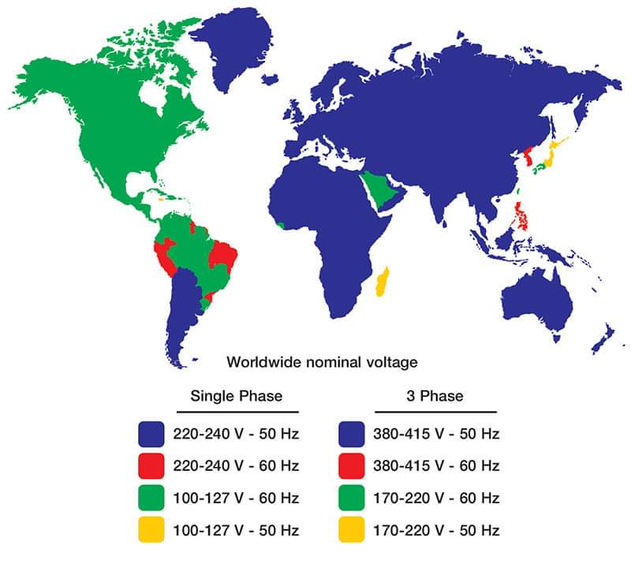

比如日本有不少家电都只支持 110V 电压，买回国内如果不经过变压器转换电压，直接插入 220V 的中国电网，绝大多数电器都会直接损坏，所以这也是为什么海淘时一定要关注电压的原因。

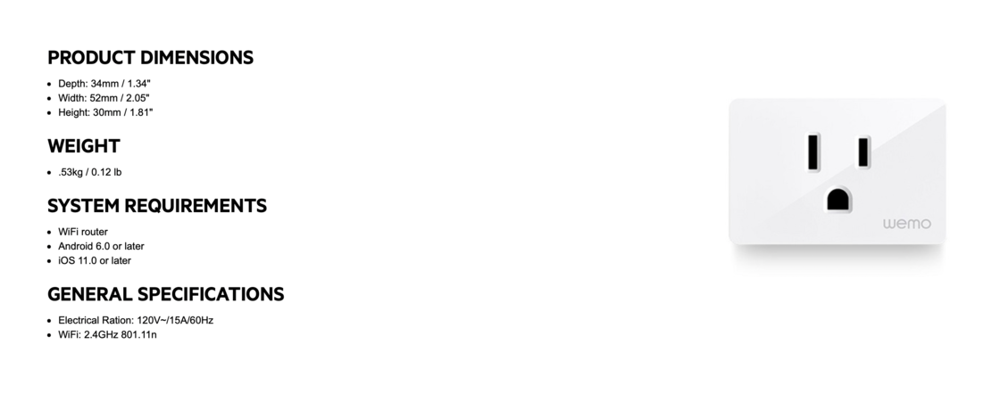

比如 Belkin 的这个智能插座就是不能在国内使用的

除了电压，海淘中我们还要关注插头。插头分为从 A 到 P 的若干种类型 1：中国大陆使用的是 D 型和 J 型两种，也就是俗称的两脚插头和三脚插头，需要注意的是三脚插头还分为 10A 的普通型和 16A 的空调型 2。北美大陆和日本使用 A 和 B 型，香港地区使用英标的 I 型，德国、法国使用 E、F 和 G 型。

不过好在海淘买到手后，只需买一根符合国内标准插头的电源线即可使用这些设备了，甚至有些国家的两脚插头也能在大陆直接用，比如：澳大利亚、新西兰使都用国标头，可以完美直接用；

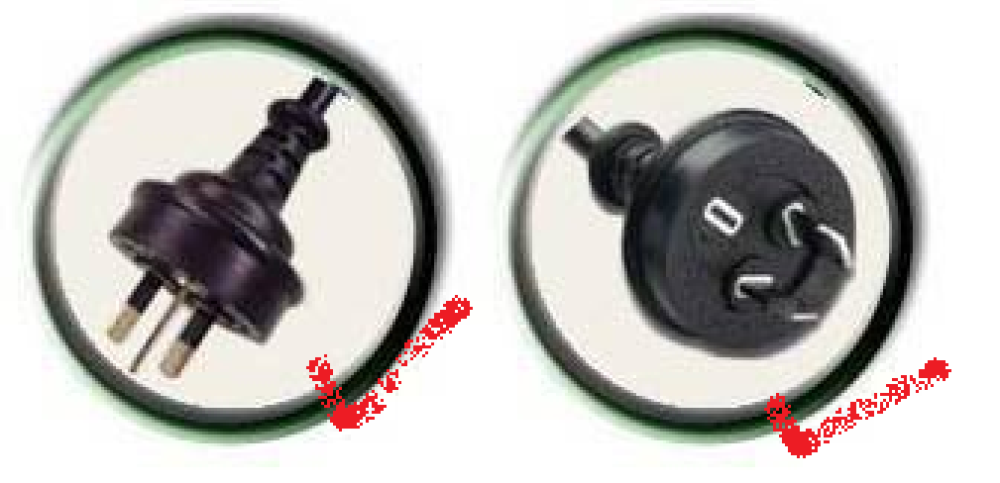

而美国、加拿大、日本、巴西、菲律宾、泰国等国家使用的美标插头，如果是两脚的（上图中的 A 型），也可以直接用（我用的 AppleTV 就是美版两脚插头，使用没有任何问题）；

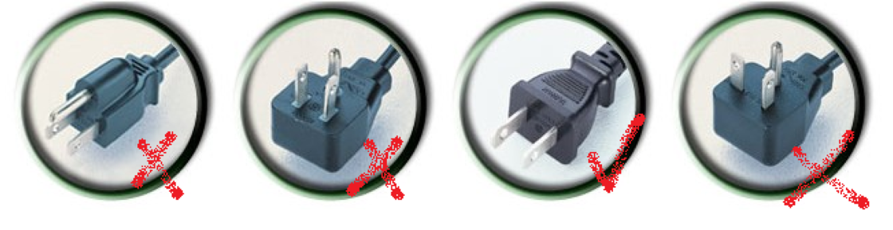

欧标 (德标) 插头也同理，两脚的（上图中 E、F 型）可以直接用（我在德亚淘的胶囊咖啡机就是欧标两脚插），不过带有接地的欧标我的建议还是另购一根国标的线缆更为靠谱；

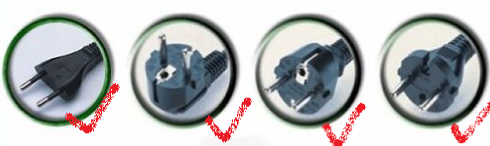

如果不幸买到英标头（英亚海淘、港行设备等），那就老老实实自己配根电源线吧！

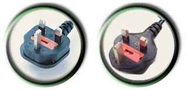

不太建议用英标转国标的转换插头，除非是质量特别好的，不然存在安全隐患，体积也大

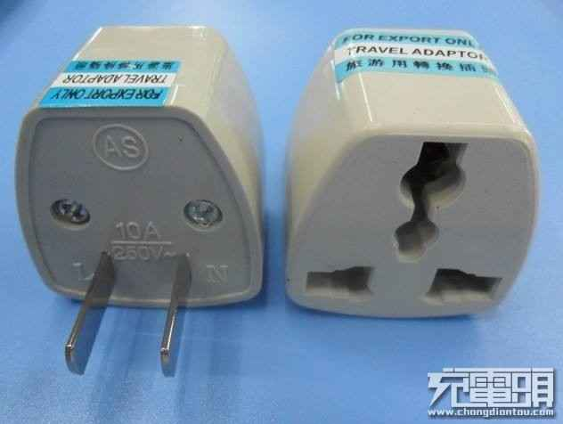

图源：充电头网

上图这种二合一转换插头早已经被法规禁止了，由于兼容多造成了这种插头接触面积会很小，接触面小电阻就会大，电阻大了过电流就会发热，就会有安全隐患。但很多人家里可能都还有一两个当年港行设备盛行时候遗留下来的，切记不要再使用了。

## 输入交流电的电器

连接到交流电的那一部分，将会使用 IEC（国际电工委员会）60320 标准，电源线的一头总是插头（plug），另一头总是连接器（connector），而连接器指与电源线连接且带有母（female）插孔插套的部分。

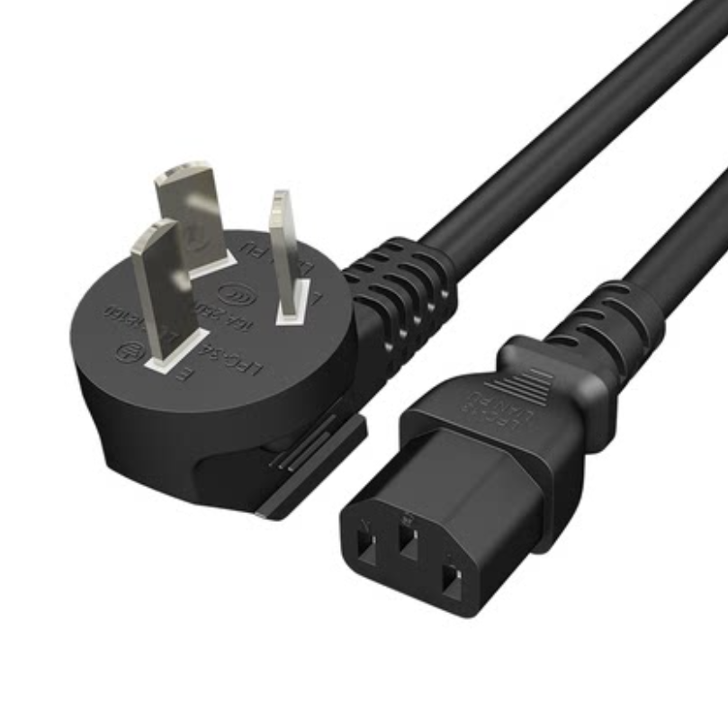

由于绝大多数的家电都会内置或者外置一个电源转换器，将交流电转换为直流电，为家电供电；因此我们海淘到家电以后，只需要将这根线换成国内标准插头+对应的**连接器**就可以正常使用这些家电了。

IEC 60320 标准是由国际电工委员会（IEC）制定的一套标准，此标准涉及到了电工器件、家用电气设备综合，连接器、家用电气基础标准与通用方法、低压电气综合等方面，规定了插头，连接器，插头连接器，器具输入插座、器具输出插座、电线组件、互连电线组件等相关器件的电压，最高电压可达 250V。

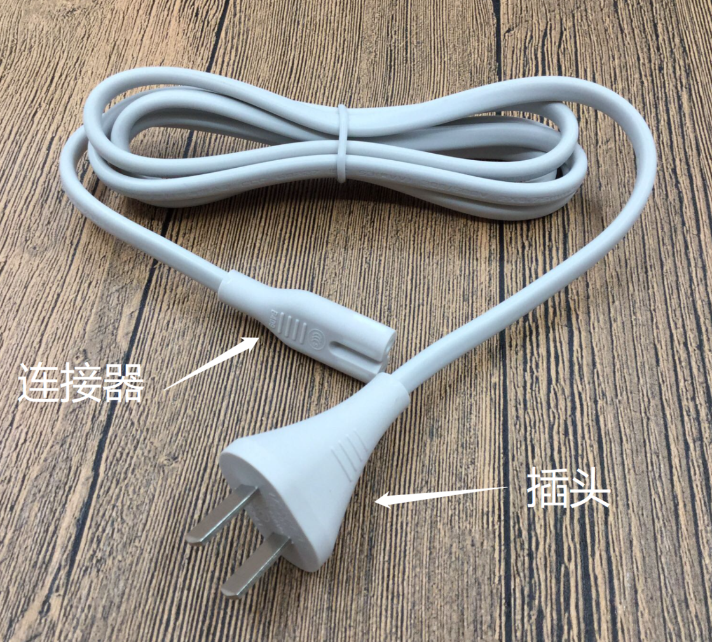

不同类型的 IEC 60320 连接器主要区别在于形状和大小，但这些形状和大小又关系着不同的**电流、温度和接地要求**。IEC 60320 没有为电压编码，用户必须确认设备的额定电压是符合供应电源的电压，这也是为什么在文章的开头要确认好产品是支持宽电压的。

虽说各个国家都有不同的电源线标准及类型，但是 IEC 60320 标准是大多数国家使用的国际标准。以下是根据电流、电压的不同对连接器进行的分类，其中 「C」 代表 IEC 60320 制造的连接器代码标准。IEC 60320 此前的标准是 IEC 320，如果买电源线时看到卖家这样写，能知道其实是同一个东西就行了。

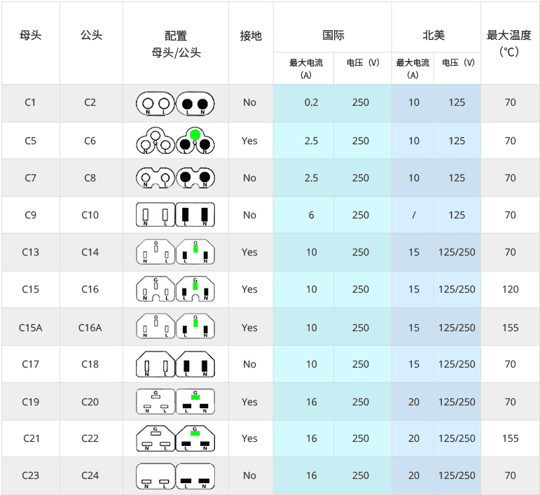

注意：同一个标号，国际标准和北美的电压电流都是不同的

第一列的 C1、C5、C7……C23 都是母头，也就是固定在电器上的那一端；

第二列的 C2、C6、C8……C24 都是公头，也就是电源线两端中与插头相对的那一端；

公头插入母头，就完成了电源线和电器的连接。

上图中标绿的那一个端子是地线，有接地线的电源线，插头一定是三脚的。

### 值得注意的北美标准

细心的朋友可能注意到了国际标准和北美标准是分开列出的。这主要是因为北美的电压等级是 125V，只有国际标准的一半，为了达到相同的功率，在电压更低的情况下需要更大的电流。

所以美国的评级机构([CSA](https://sspai.com/link?target=https%3A%2F%2Fen.wikipedia.org%2Fwiki%2FCanadian_Standards_Association), [NOM-ANCE](https://sspai.com/link?target=https%3A%2F%2Fen.wikipedia.org%2Fwiki%2FNorma_Oficial_Mexicana), 和 [UL](https://sspai.com/link?target=https%3A%2F%2Fen.wikipedia.org%2Fwiki%2FUnderwriters_Laboratories)) 会为 IEC 60320 电源线提供更大电流的检定认证，其中 UL（美国保险商实验室） 的认证甚至比表中列出的更高，比如 C5/C6 常见的北美标准是 10A，而 UL 可以认证到 13A。在这种情况下，北美标准的电流值即便换算到相同电压也普遍比国际标准的大几倍。

所以，当你从美国海淘了一个电器回来，不能简单地按电源线连接器形状或线材上凸印的连接器代码直接购买国标线，因为买来很可能是按国际标准的电流值生产的，电流达不到美标那么大，会给用电安全带来隐患。那么在搜索时就要记得加上「美标」的后缀，并和卖家确认电流值，因为国内电压是 220V，所以只要线的电流值有美版线规格的一半即可：

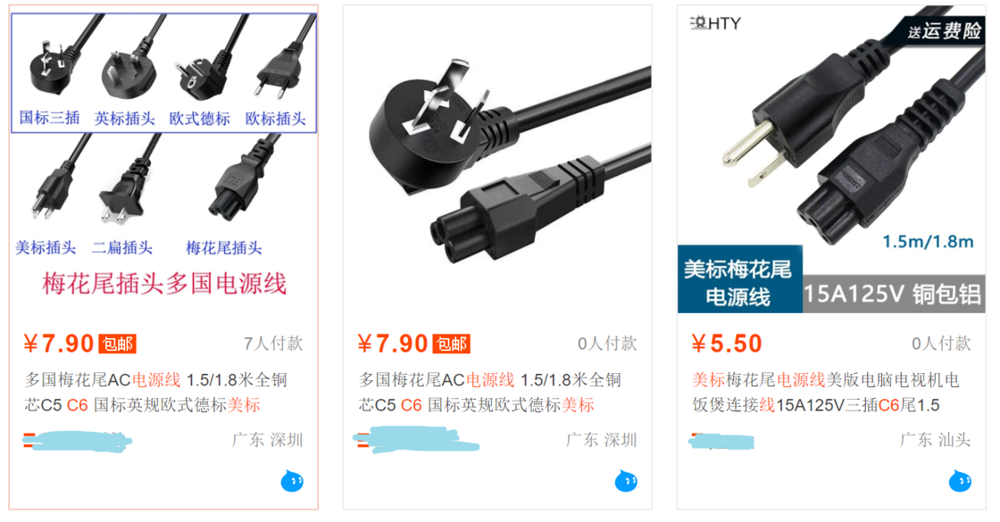

记得一定要和卖家确认电流值，保留维权证据

而有些常见的连接器类型可能还会有一些特殊的叫法，这些说法同样可以买到正确的线缆：

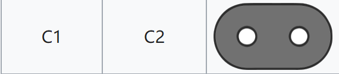

常见于电动剃须刀

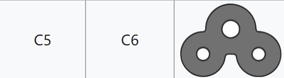

俗称米老鼠头，很形象

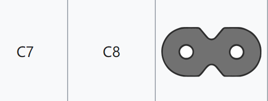

极为常见的 8 字尾插头，大量 Apple 产品都爱使用如 Apple TV、Mac mini

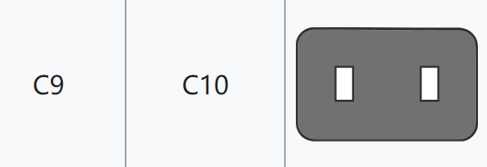

多见于音乐设备，如 Hi-Fi 设备

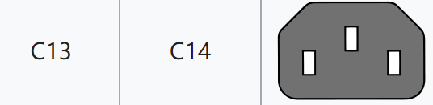

最常见的连接器，几乎所有的家用电脑、笔记本电脑变压器都是这个

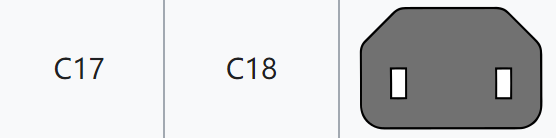

Xbox One 的插头

### 有点特殊的 Apple

值得一提的是，Apple 自己魔改了一种 C7/C8 连接器，用于老款 iPad 和 Macbook，方便全球旅行者自由更换 [当地标准的插头](https://www.apple.com.cn/shop/product/MD837FE/A)。 C7/C8 本来是不带接地的，经过 Apple 魔改后，用适配器上的一个小钉子充当接地触点，加上魔改的延长线或者转换器就可以实现接地功能。

这种电源适配器都由三部分组成：连接器和适配器、交流电源线以及交流插头（鸭嘴插头）。

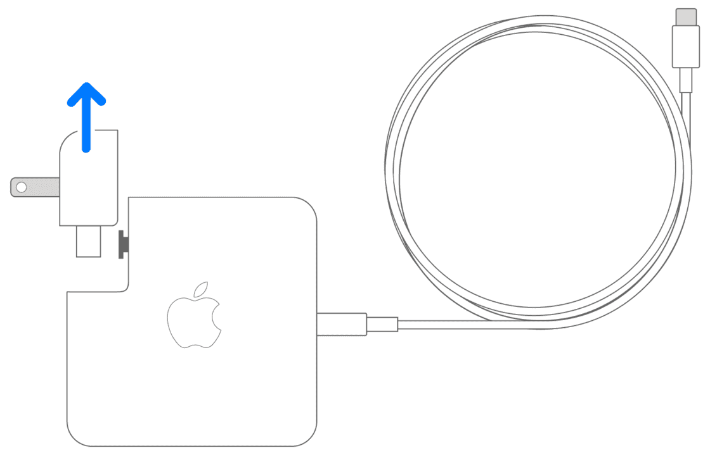

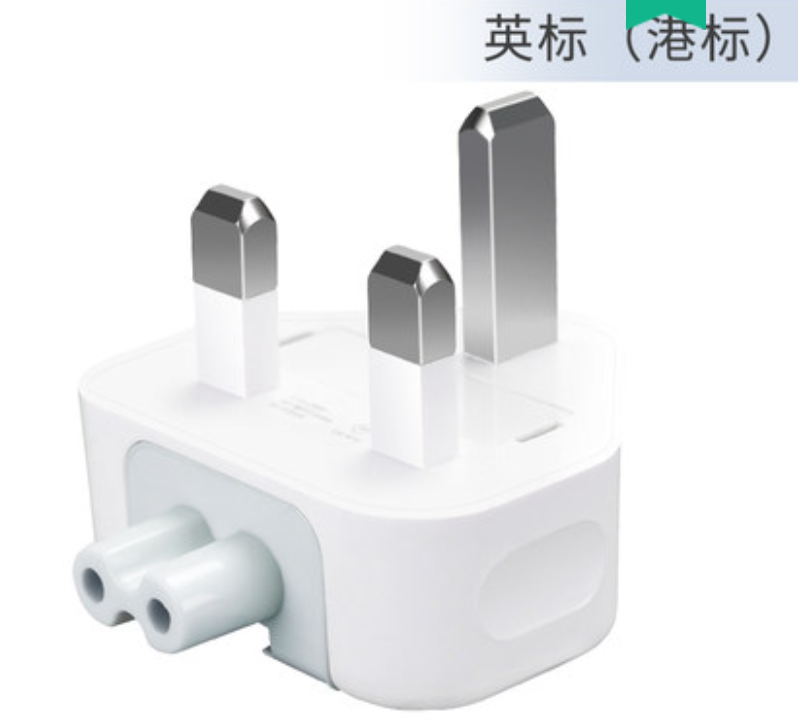

连接器端其实都是 C7 连接器

下图是一根延长线，通过连接器上方的独有装置可以为两脚插头也额外添加接地的功能：

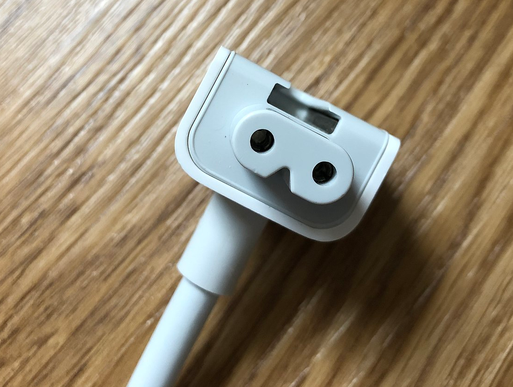

如果不用延长线就没有接地，也就是 Macbook 的金属外壳会有点麻手

## 输入直流电的电器

少数海淘到的家电既没有内置的电源转换器，也不需要大大的外置电源转换器，只需要一个和插头集成在一起的电源转换器就可以输出直流电给这部分家电就可以了，这类家电通常包括了路由器、可视门铃等。

输出直流电的连接器的另一头通常是圆柱状的；但比起标准相对明晰的交流电，直流电的标准就是另外一副景象了，不仅接头种类五花八门，长得也很像难以区分。所以很多时候我们只能依靠形状和尺寸来区分，总的来说有如下类型的直流电连接器：

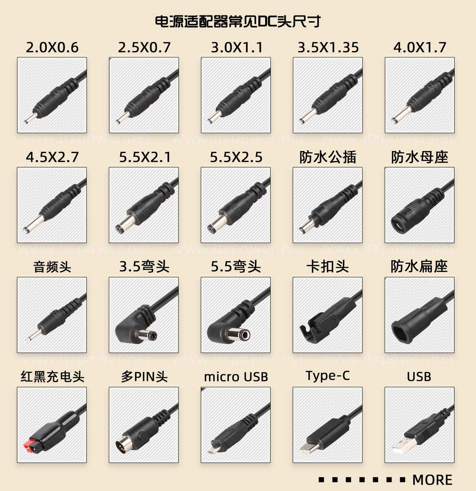

没错，USB 家族也是 DC 头

你在上图中所看到的 `数字X数字` 是按照外径和内径进行划分，前一个数字和后一个数字分别对应着外径和内径，通常情况下只需要测量一个外径即可。除了上述的图表中展示出来的，还有一些不常见的有点烟器头、F 头、 T 头、DC 直插母头、航空头、防水头、3 芯 / 4 芯 / 5 芯 / 8 芯连接头、鳄鱼夹、S 端子、 冰箱头、香蕉头等等。

**但好在不管哪个国家的产品，除了接口都是按电压电流来区分的**，只要参照适配器上标注的电压和电流来选购对应的接口就可以放心使用。

以这段开头提到的路由器为例，除了一些顶级路由器之外，绝大多数路由器适配器的 DC 头都是 5.5mm\*2.5mm 规格的，输出电压和电流也多在 9V/0.6A~12V1A 之间，此时只要非原装的适配器 DC 头，输出电压和原装适配器相同，而输出电流大于或者等于原装适配器的输出电流，那就能放心使用。

以上就是本文的全部内容了，希望可以帮助到海淘电子产品以后的你。

\> 下载 [少数派 2.0 客户端](https://sspai.com/page/client)、关注 [少数派公众号](https://sspai.com/s/J71e)，解锁全新阅读体验 📰

\> 实用、好用的 [正版软件](https://sspai.com/mall)，少数派为你呈现 🚀

-   1世界上存在两种字母分型，下文中为笔者认为最清晰方便辨认的一种
-   2中国标准插头（三扁）按 GB 2099-1，GB1002-1 标准执行，接受 CCC 认证，插头为扁三角类似澳标插头，电气参数有 10A 和 16A 之分，中国要求插头，连接器，耦合器和电缆需要强制接受中国电工委委员会批准合格的电气设备 CCC 标志认证。
