# 如何设计2.5G家用内网，聊聊我的选购安装思路 - 少数派

笔者家中网络上次升级后，是以软路由做主路由，然后三台MX4200+1台MX2001 无线MESH完成的无线覆盖。但是领势MX系列的固件只能在路由模式下开启无线Mesh。这样即便是光猫桥接软路由拨号，无线接入的设备也是多了一层NAT。而华硕在AP模式下的可自定义设置项是远远高于其他两家，而且AiMesh 2.0完全可以工作在AP模式下，所以本次升级还是将目光瞄准了华硕ASUS/玩家国度ROG的路由器，完成无线组网。有游戏下载需求一定要降低NAT类型，也就是减少路由层级。

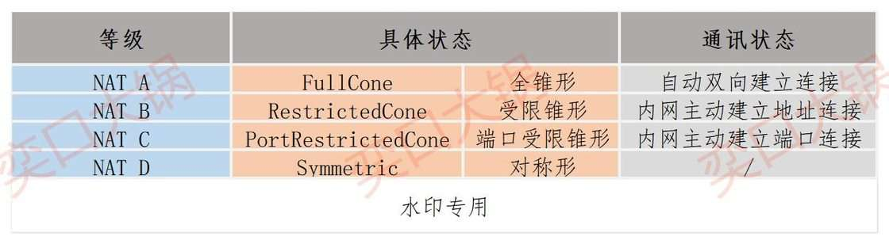

申请公网IP、光猫改桥接、路由拨号一套组合拳下来，就没啥问题了。多一层路由转发，就降低一层。先前是主路由拨号+无线路由固定IP的模式，但给了公网IP所以还算可用。如果是NAT D这种，不管是打游戏还是P2P下载就都不灵了，基本上也就只能刷刷视频。当然对于Xbox、Switch、Play Station这类的游戏影音设备，记得开启路由的Upnp功能，要不然还是不能玩。

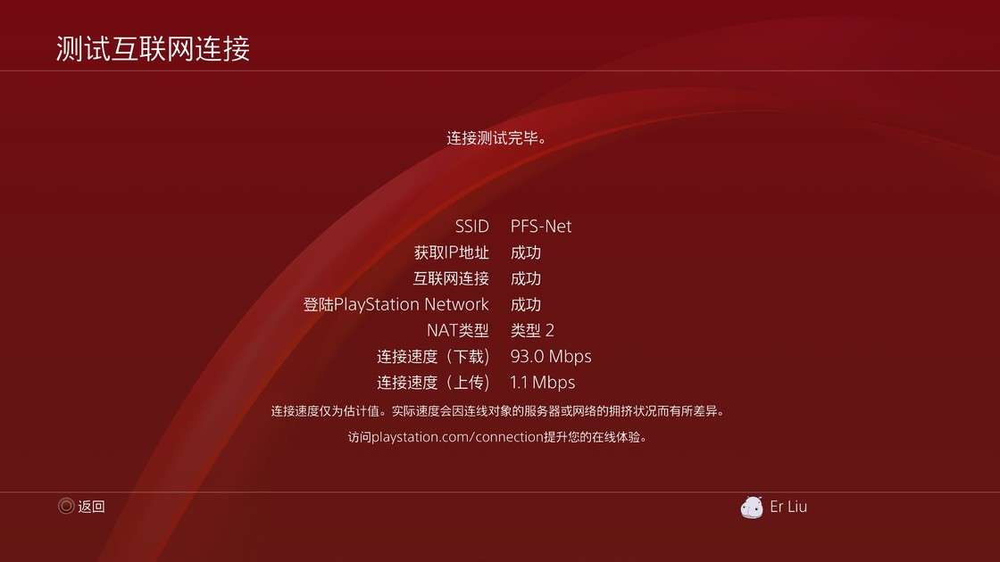

选型要根据具体需求确定，现阶段规划思路就是保证正房的100平米保证2.5Gbps有线+满血2.4Gbps的Wi-Fi 6下全覆盖，东西厢房、主院与东小院保证500Mbps左右的的无线覆盖。

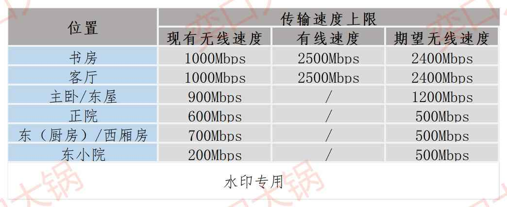

而且采用AiMesh2.0的话，后续升级扩大覆盖高速率面积，只需要添加足够的节点就能够保证网速达标。国内很多家庭在装修之时都没有考虑网络覆盖的问题，所以有一阵信号放大/中继器的销量就不低，但是无线中继的层级越多，网速越慢延迟越高。因为Wi-Fi本质是个半双工的传输模式，每过一层速度都要减半。Mesh就是规避无线中继的逐级减半问题，才应运而生的。双频Mesh实际也存在多级掉速的问题，而且这些双频AX路由器基本都是中低端的价格和配置。所以主节点和主干子节点最好还是要选择三频的，其他边缘节点可以选择双频这些更便宜的。各家的三频路由都是单有一路无线回程，在保证你主干节点全速传输的同时，边缘节点不会空有链接速度而实际传输速度上不去的情况。

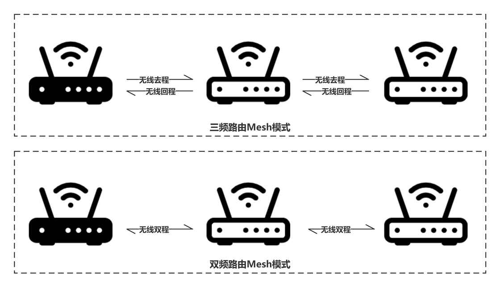

## **1.内网拓扑规划思路**

**更换2.5G光猫**，原有的光猫虽然是10GPON，但是4个LAN口都是千兆，下行速度最高就是千兆网口理论上限。考虑到带宽预留和看北京这边自行更换光猫的用户实测，跑到1200-1300Mbps还是没问题的，算下来就是20%的提升。笔者家中需要使用IPTV和固话，所以先前包括猫棒在内的众多设备，都没走到替换光猫这一步。基于以上需求，加上运营商是北京联通，最后是￥599入手了中兴G7615这台光猫，提供了1个2.5G有线网口与3个千兆有线网口，现在小黄鱼上已经降到￥199-299这个范围了。

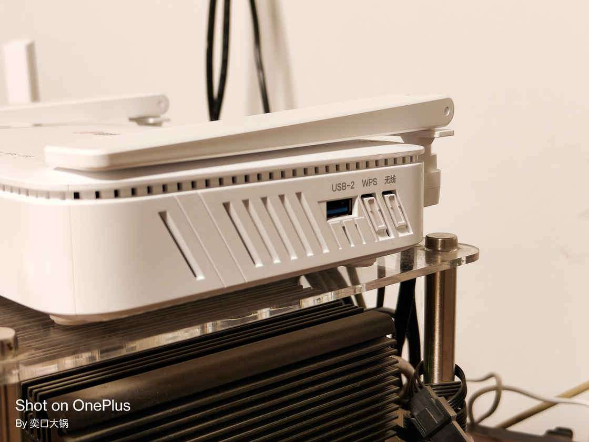

**SSID转移，**原来家中设置了3个SSID分别供高速接入、智能家居与库房使用。高速接入和智能家居这俩肯定是要保留的，库房覆盖这个直接改掉就OK。整体替换后的SSID设置具体情况如下表，之后还会针对智能家居布置中枢网关，打算之后再研究下具体如何布设。

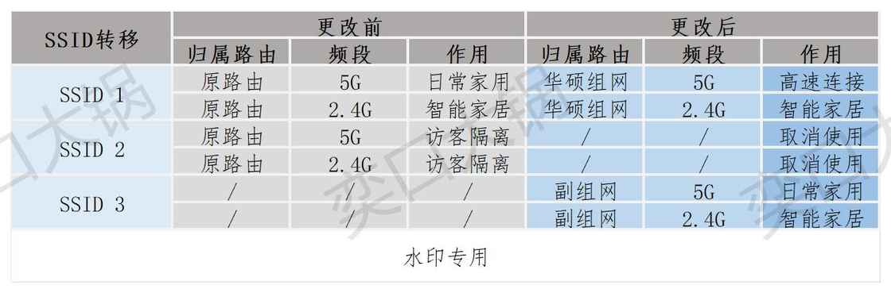

**软路由设置，**新光猫虽然是套用旧光猫的所有设置，但是为了方便远程调试，还是得对软路由进行修改，将IP段从变更到192.168.0.X，将先前192.168.1.X的让渡给光猫。变更IP段之后，像是NAS、打印机这些先前固定IP的设备，就必须要手动重设了。这个部分就纯手工了，后续更换主路由还得再重新配置一遍。

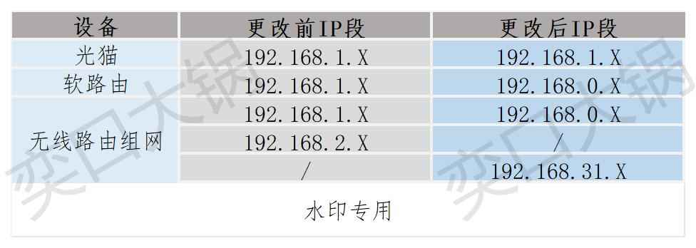

**路由模式设定，**需要主节点以AP模式运行，二级子节点通过AiMesh 2.0以无线回程方式完成组网。后续升级的话，可以使用主节点修改为路由模式置换软路由，这样Mesh的拓扑不需要改动。或者用支持BE的主路由替换软路由，主节点重设为子节点，也可以通过后续可能上的让渡功能，免于二次配置的繁琐。

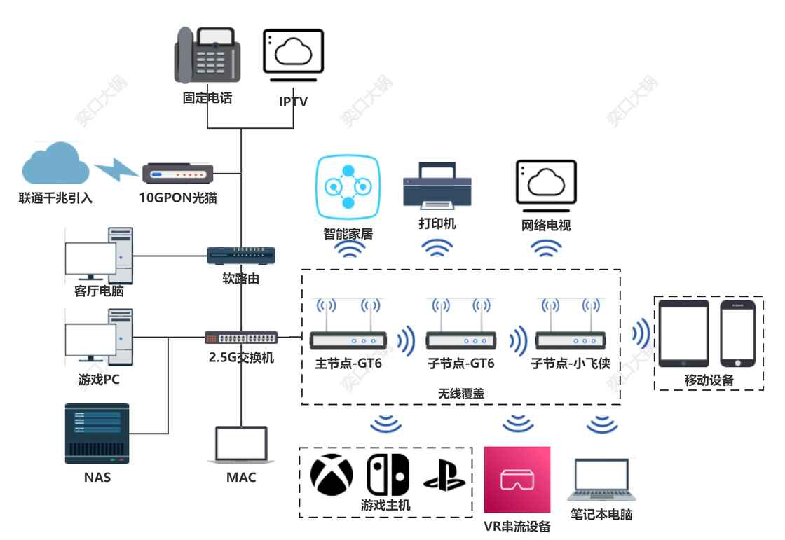

## **2.主要设备选型与实际拓扑**

有线2.5Gbps对设备的要求不算高，设备集中到交换机就行了。但考虑到2.4Gbps的无线覆盖，AP或者主路由还是得有对应的2.5G WAN/LAN接口。原来是N5095四2.5G网口的软路由，下挂一路到书房2.5Gbps交换机，有线这部分就完成了。像是华硕ROG电竞系列的硬路由，更多是单/双2.5/10G网口（BE96你往后站站，我组网时候你还没出来），所以更建议高速口直接挂高速交换机，进而接入其他高速网络设备。

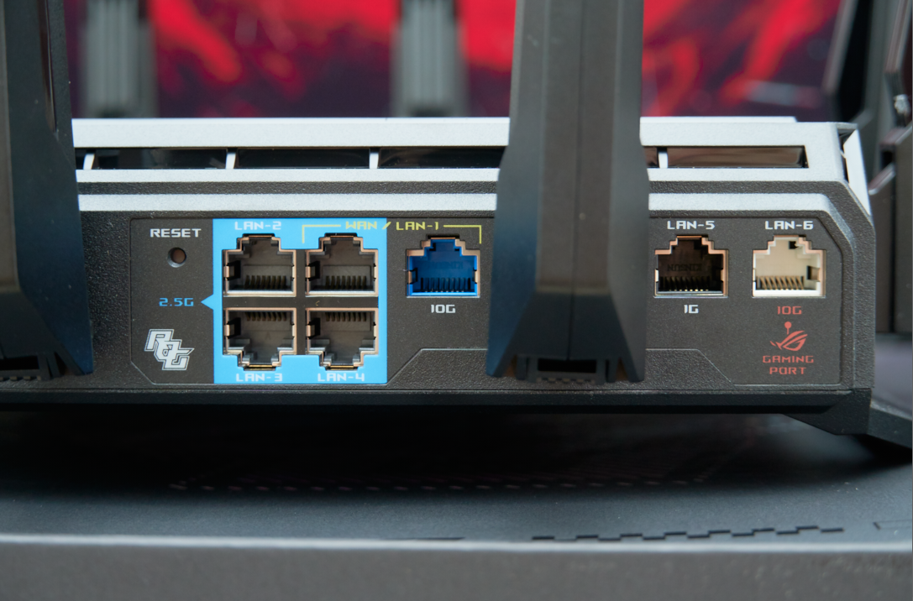

x86的软路由可玩性都很高，但是都比较挑内存和固态。arm的软路由价格又居高不下，配置2.5G的价格就令人难以接受了。现在4口2.5G的N6005软路由准系统，￥600就能搞定了，自己配一根内存和固态也就再多个一二百。要是能接受J4125、N5095这些处理器的话还能便宜点。

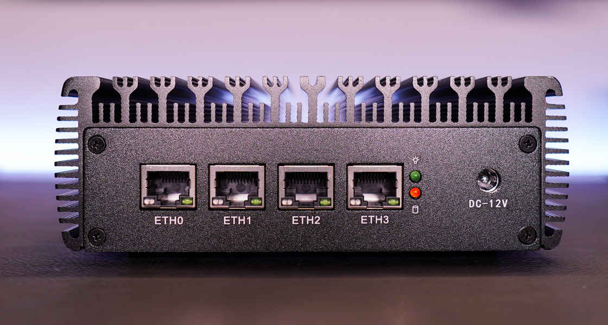

已经有了主路由了，下面就只需要考虑AP节点了，只需要完成无线覆盖，不需要进行NAT转发。ROG路由器的实际联机体验，确实更稳定、更低延迟，为了打游戏付出这部分溢价也是值得的。所以综合考虑了价格因素和后续升级，最终选择了玩家国度ROG魔方幻双支套装作为主覆盖，华硕ASUS小飞侠通过无线Mesh补全边边角角的无线覆盖，保留后续的升级空间。

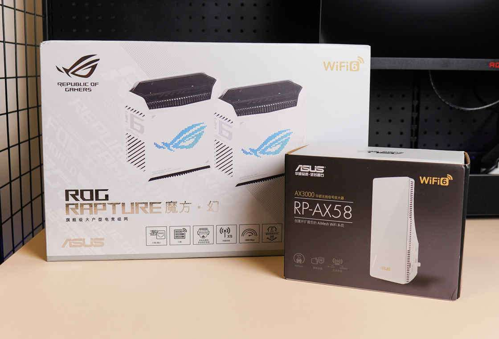

已经把光猫换成桥接，用主路由拨号了，别自己再套一层了。设备选型的要求是，必须能在AP模式下完成Mesh组网，那就只需要考虑华硕的AiMesh 2.0了。不管是御三家，还是先后下场消费级的新老势力，搞出的各种Mesh协议，基本都要搞个非AP的主节点组网。 加上考虑配合之后更换主路由，所以ROG魔方幻双支套装，来完成Wi-Fi 6频段的无线覆盖。

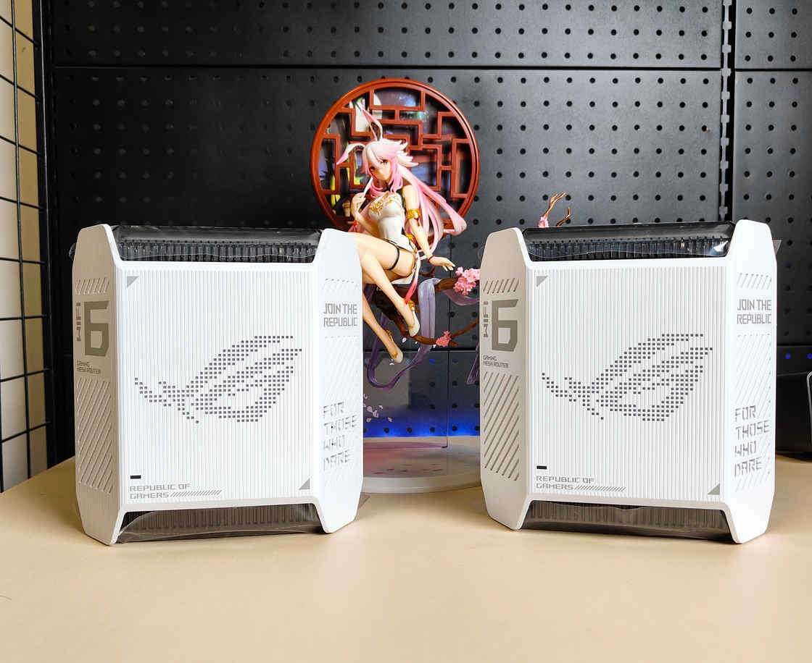

ROG魔方幻套装是出厂就已经完成预配对，并且在主节点背后有对应的指示贴纸。把主节点调整到AP模式，再将其他子节点连接到主节点，完成无线覆盖。后续更换ROG电竞主路由之后，就需要二次重置将这俩都作为子节点使用了。

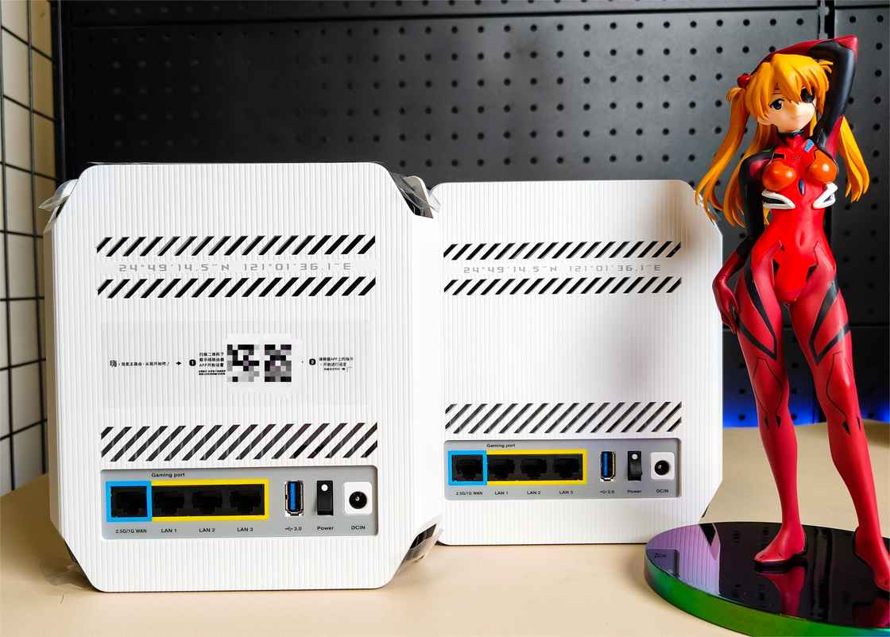

ROG魔方幻内置了9根增益天线，专门为电竞需求优化了无感漫游，专门4804Mbps电竞无线回程频段。后面实测数据也可以看到延迟表现相当优秀。毕竟是ROG血统的路由器，硬件级的优化能够进一步降低延迟，针对ROG自家设备还有更进一步的优化。当然，就和笔者之前测Killer网卡一样，这些功能在网络环境差的时候，提升感才更明显。电竞加速应该是在无线环境较差时候，才能发挥出更明显的作用，如果你的电脑/手机是无线连接的话，效果应该会很不错。宿舍先前用的是小米AX3000T，主卧电脑桌那里打游戏，时不时的就丢个包卡一下，真的很难受。

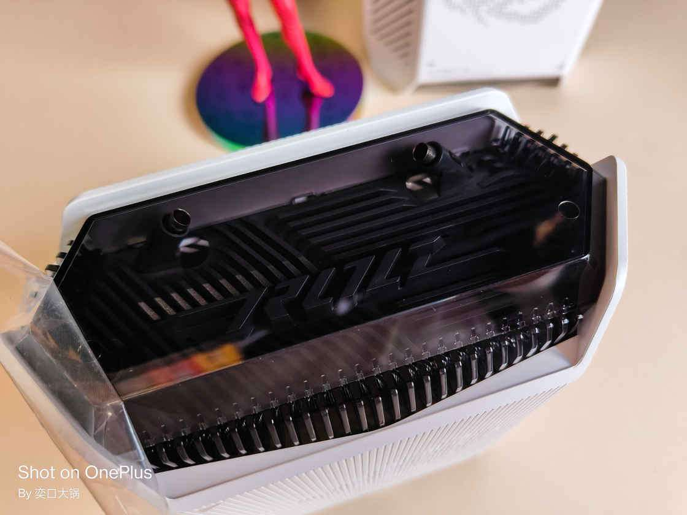

华硕的玩法就有点意思了，还是在5G频段下，AX3000的设备都是2T2R，可以匀出一条空间流‘中继’，能够保证1.2Gbps的传输能力。理想的节点布置方式能够保证，即便多次Mesh过后网速也不会降太多。而AX5400这些，能够拉出一路2T2R的空间流，从而保证2.4Gbps的传输能力。而我们的无线终端，像是手机和电脑更换的无线网卡，顶天也就是2T2R最高2.4Gbps。而AX10000/11000的设备就更狠了，两路4T4R的空间流，直接保证4.8Gbps的传输能力。

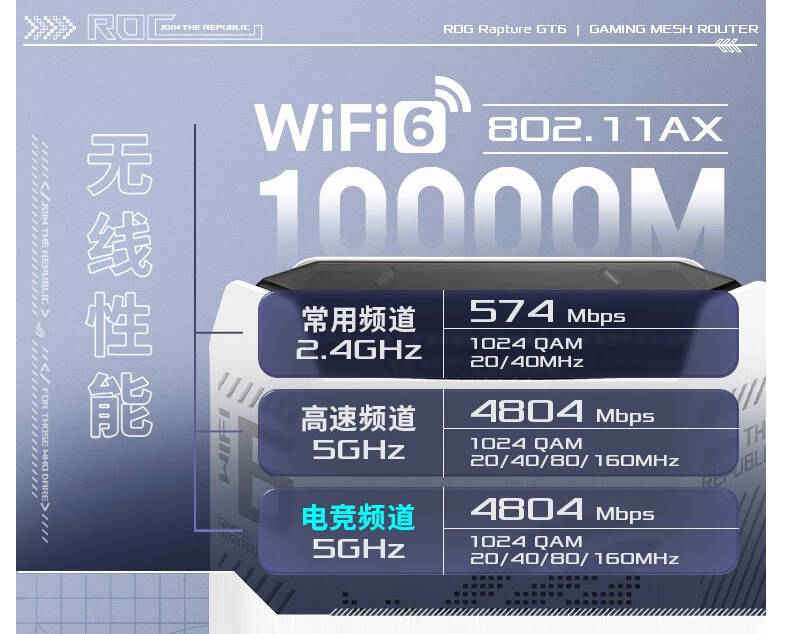

单从连接速度上说，2T2R的2.4Gbps基本上足够和2.5G的有线网口持平了，旗舰级产品的实测传输速率是能到280-290MB/s的。而且ROG魔方幻只有1个2.5G WAN口，LAN口均为千兆，但正巧布置点只能走无线回程，以AP模式工作正好。后续更换的主路由，需要像现在软路由一样，至少有一进一出的2个2.5G网口，LAN口直接接到2.5G交换机上扩展，保留现有的结构。

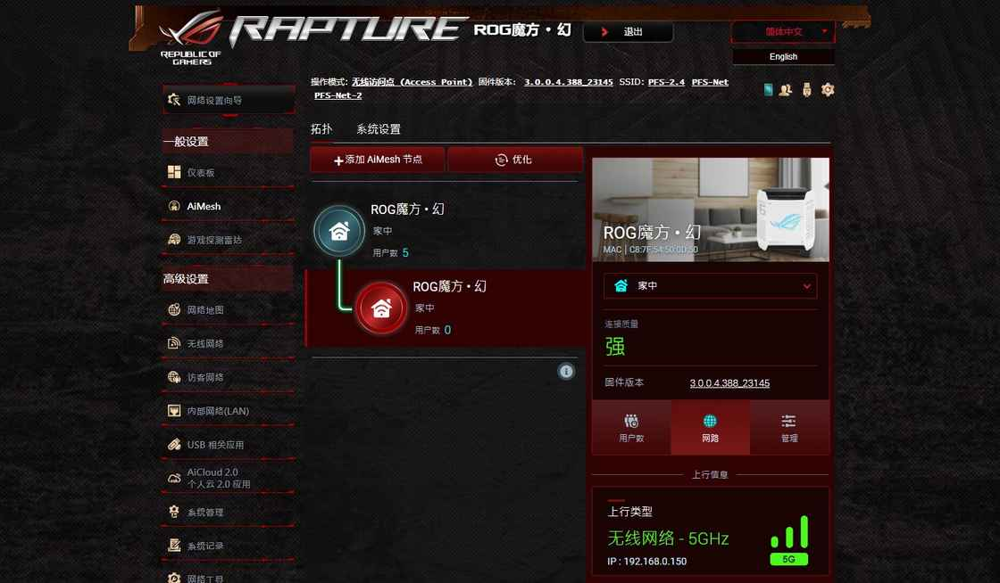

现在的主路由还是之前的N5105软路由，不过也就是正常跑OpenWRT，实际上没跑什么插件。而且这个小主机的散热很成问题，现在考虑后续换个ROG GT-AX6000或者最新一代八爪鱼，游戏加速直接用内置的插件跑就好了。去广告的插件现在没啥配置简单又好用的，几个需要更新规则用着解析速度都挺慢。

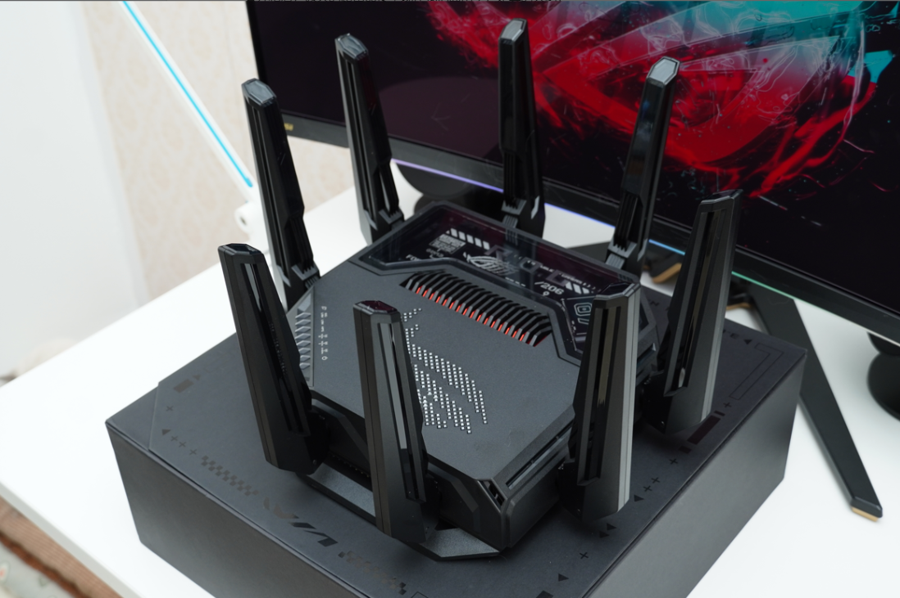

当然这就是下一步搞万兆内网的事了，毕竟手里有了锤子看什么都像钉子。不过对于大部分人而言，2.5G内网是绝对绝对够用了，笔者单纯就是玩心重，总想搞点有的没的，这样的习惯太费钱了。

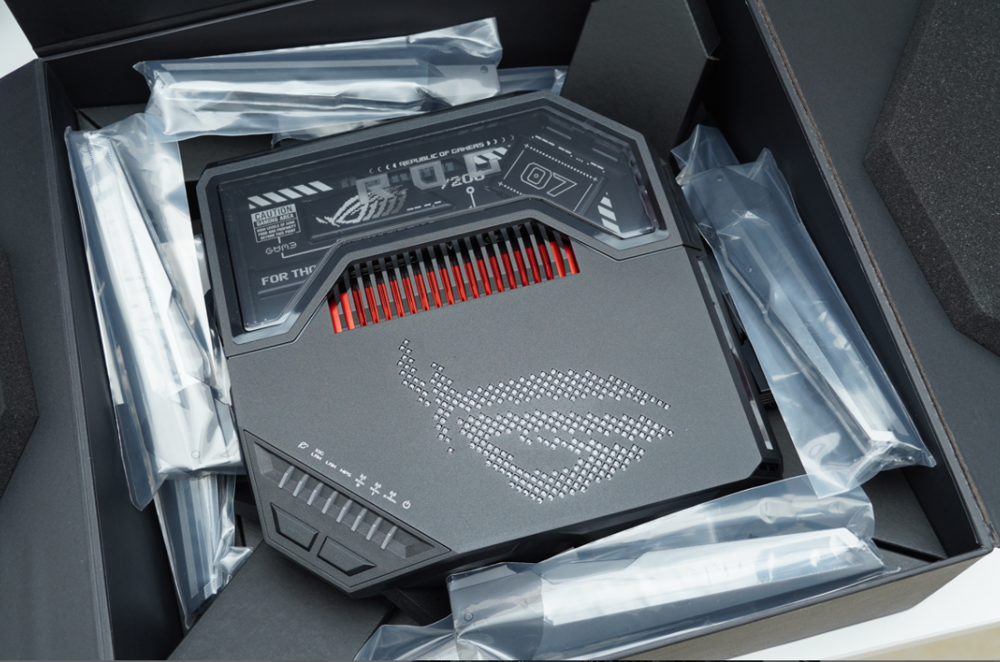

补充无线覆盖的子节点路由则是选用了华硕RP-AX58小飞侠，两颗5G独立FEM，双频Wi-Fi 6，5G频段160MHz满血。再加上1.7GHz的博通四核处理器，这个性能相当强了。虽然造型挺像电力猫，但它真的不是电力猫。

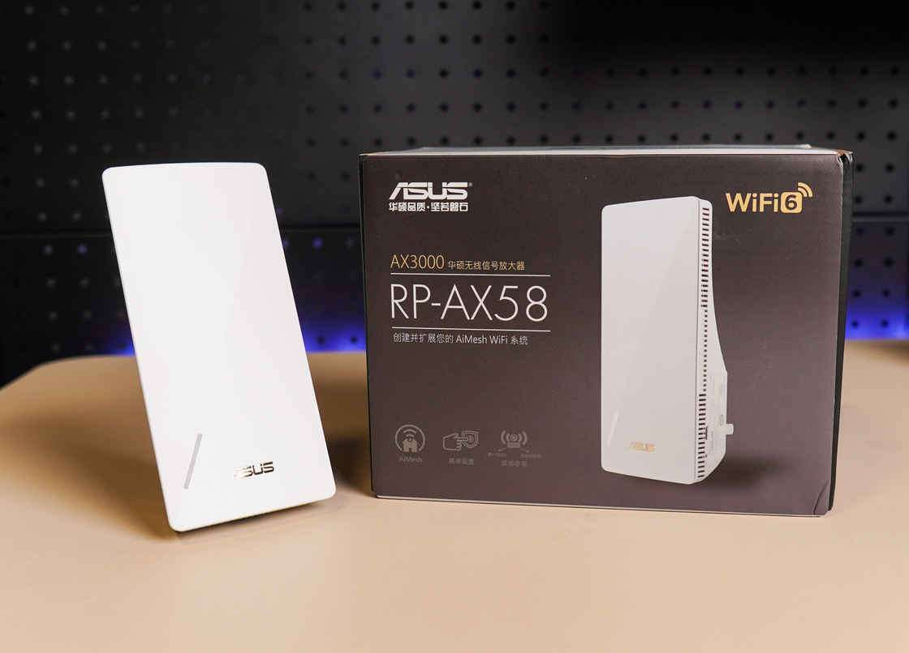

小飞侠不需要单独的适配器，直接插到插板上就能用了。不需要拖着电源线和网线，一大堆坨在那。以补充覆盖无线的中继节点来看，不过这个尺寸也着实不算小。但看后续实测的数据，这个体积一点没浪费。独立FEM和全尺寸内置天线，你把它当做路由，这个尺寸那是真小。

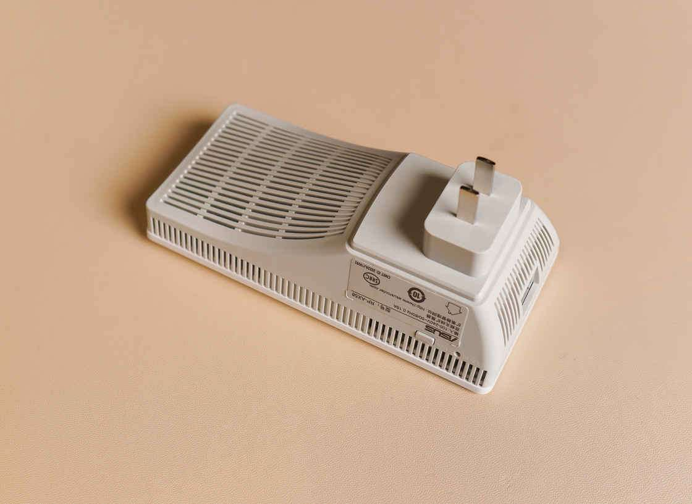

前两年五口2.5G交换机还得小五百，现在这个价完全可以买八口2.5G带1个万兆电口的交换机了。挑个便宜的随便买，完全不会踩雷。

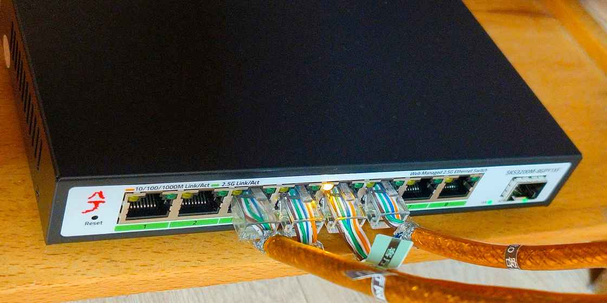

## **3.组网后实测**

组网情况就如与上节的拓扑图所示，笔者的需求很简单：书房、客厅满足2.5G有线+2.4G无线即300MB/s级的传输速度，主院、东小院及东西厢房保证500Mbps即60MB/s级的传输速度。这个要求不算太高，尤其是拢共只有3个节点来保证300平左右院落的网络覆盖。测试定点选择了书房-主节点，客厅-子节点，主卧-主节点，东/西厢房，正院，东小院-小飞侠子节点这些代表性点位进行测试。

另外为了保持ROG幻魔方组的这套网，能够完美发挥实力。故还购买两台小米AX3000T接入软路由，作为二级路由，提供访客网络服务，防止污染DHCP影响正常网络的使用。之前使用领势套装就有这个问题，加起来就那么多设备，结果时不时网就要假死下。也没办法挨个审查接入设备，索性全都换了完事。顺便限制了上传速度，后续研究下估计要做个隔离。这部分的测试就不做展开了。

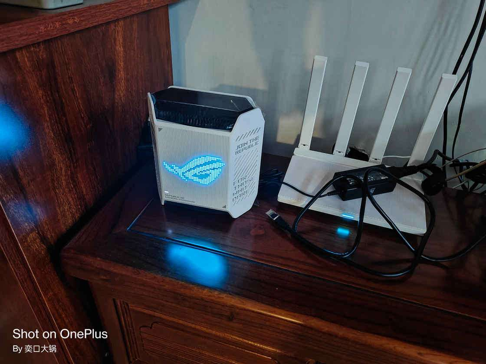

主节点放在了书房角落，因为北京的联通测速点经常性跑不满，所以直接切换了联通河南5G的测速点。可以看到下载速度终于破千兆了，下载达到了1068Mbps，信号强度-6dB，链接速度2401Mbps。后面实测发现最高的下载速度基本在1200-1300Mbps左右，不过文章中还是以连续的测试结果为准。

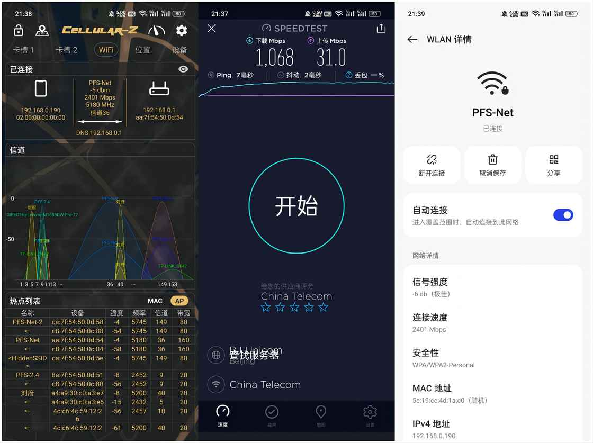

客厅部署子节点，与主节点隔了一堵墙。在客厅测得的下载速度在1172Mbps，信号强度-6dB，链接速度2401Mbps。这个测试时间更早，所以下载速度比书房主节点和卧室的速度都要快上100Mbps左右。现在测试外网速率就比较麻烦，不容易找到能够跑满的节点。子节点基本是多了10ms左右的延迟，是相当优秀的表现了。

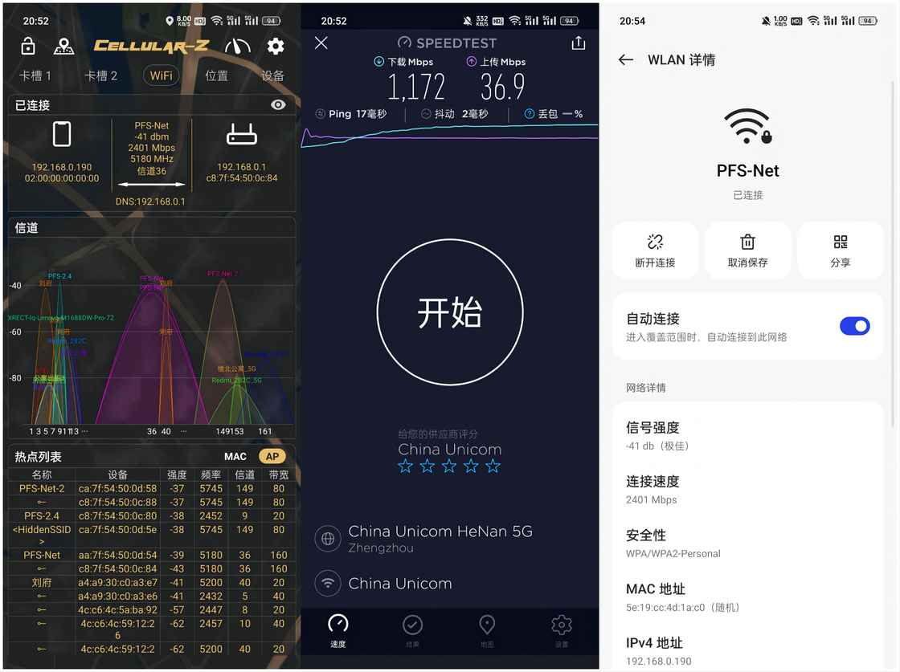

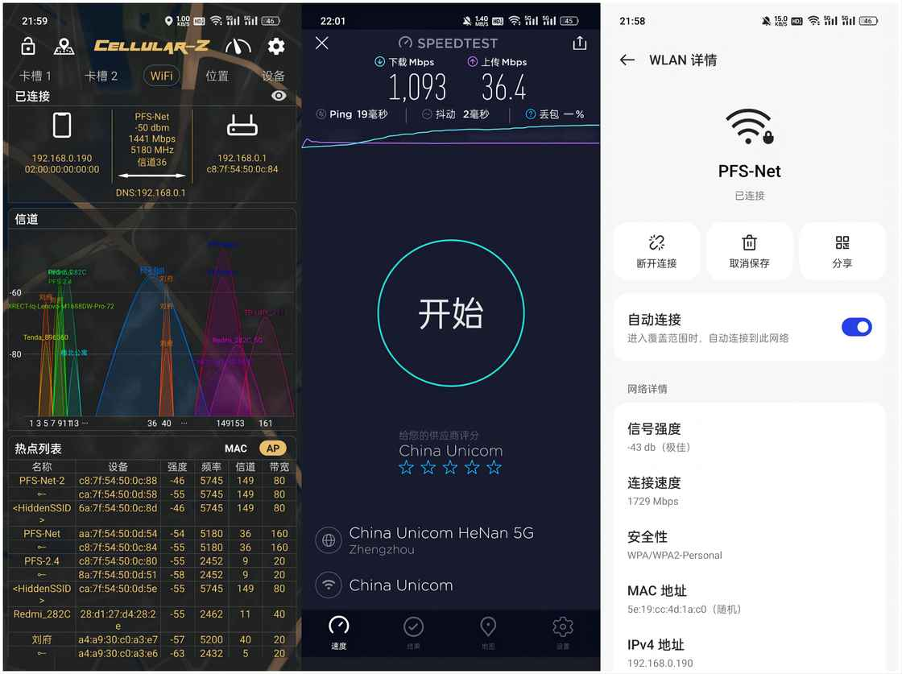

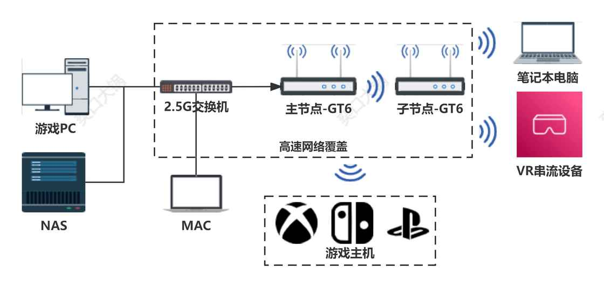

正房部分的测试做完了，就可以开始测试厢房和院子里了。在院内影壁前进行测试，中间隔了一层玻璃隔断，一层砖墙和一层铁皮，测得下行速度为874Mbps，信号强度-51dB，链接速度864Mbps。应该是连接到了子节点，相比原有情况增加了6ms的延迟，也是完全可以接受的。

厨房在东厢房南侧，遮挡是最多的，等于是两堵37砖墙，传输速度自然也就是最低的，下行速度为506Mbps，信号强度-61dB，链接速度576Mbps。强度和连接速度基本匹配。厨房/西厢房想要获得更好的网络，就得继续在影壁到门楼的位置多布置一个子节点了。

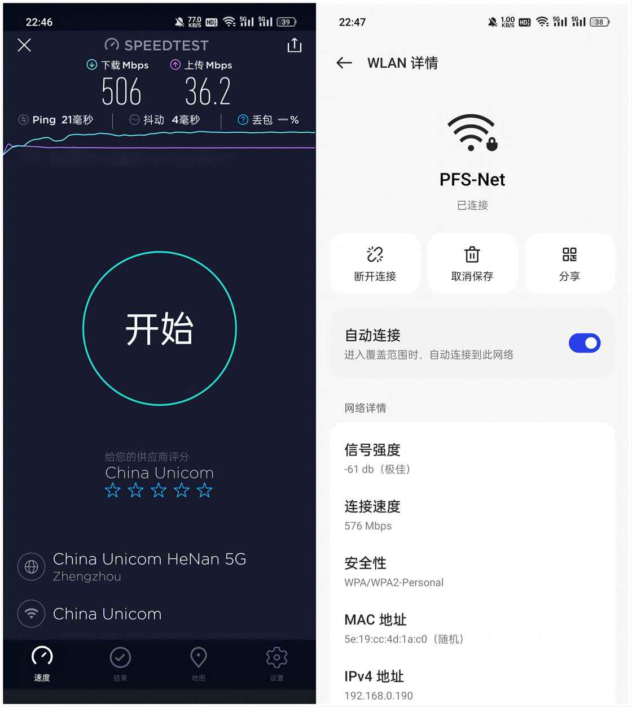

再来看看东小院，直接把小飞侠布置到东小院库房的吊顶中，在东小院院中测得的，下行速度为749Mbps，信号强度-47dB，链接速度1152Mbps。RP-AX58是挂载到子节点之下的，而二者之间相隔两堵12砖墙，一堵37砖墙，而且角度还有相当程度的偏离。加上之后的实测判断， 二者间的传输速度也就是在800Mbps左右，对于普通用户而言是个完全可用的状态，也完全满足了笔者的预估需求。

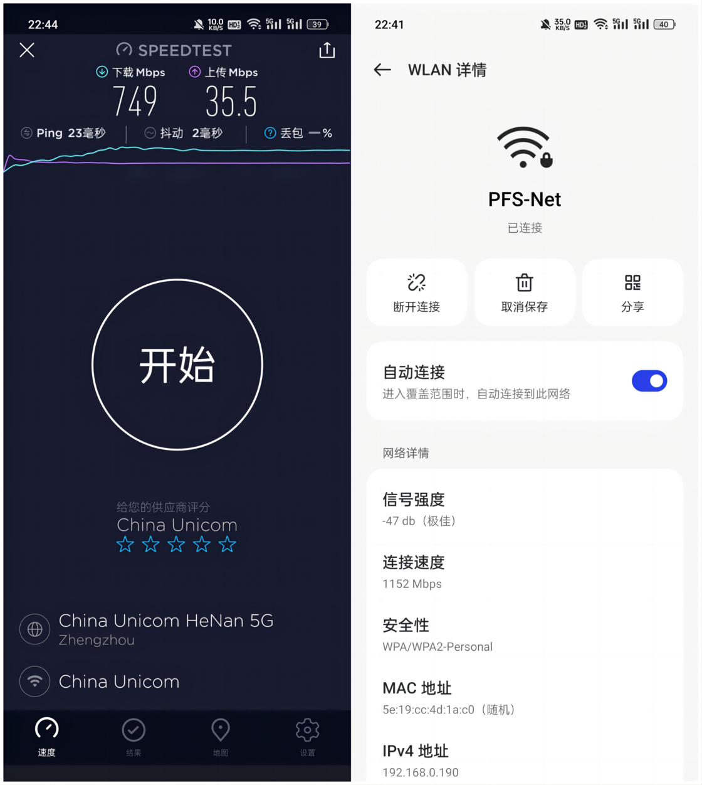

## **4.无线补充设备的选择**

华硕在售支持AiMesh的路由器，最多可以9台路由设备组网。所以具体选择哪款还是得根据使用环境出发，笔者是库房吊顶做了个插座，小飞侠做好网口与底部防尘即可。小飞侠是和RT-AX57同配的，或许之后也会出个联发科方案的小飞侠热血版，按照AX57和热血版的定价思路，那绝对能杀疯。

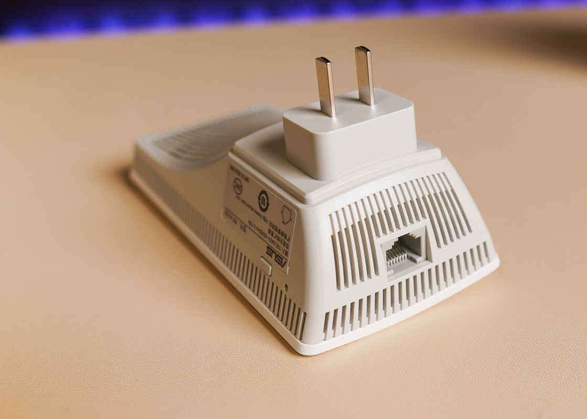

只要支持AiMesh 2.0华硕路由器，就能接入组网补充无线覆盖。笔者家这种一个大院一个小院，加起来也就三百多平，使用ROG魔方幻双支+华硕小飞侠，完全能够满足使用需求了。除了三个大对角的位置，传输速度都很OK。如果需要上墙节点的话，也可以选择华硕RT-AX57热血版，这应该是最便宜的支持AiMesh 2.0的满血Wi-Fi 6路由器了。

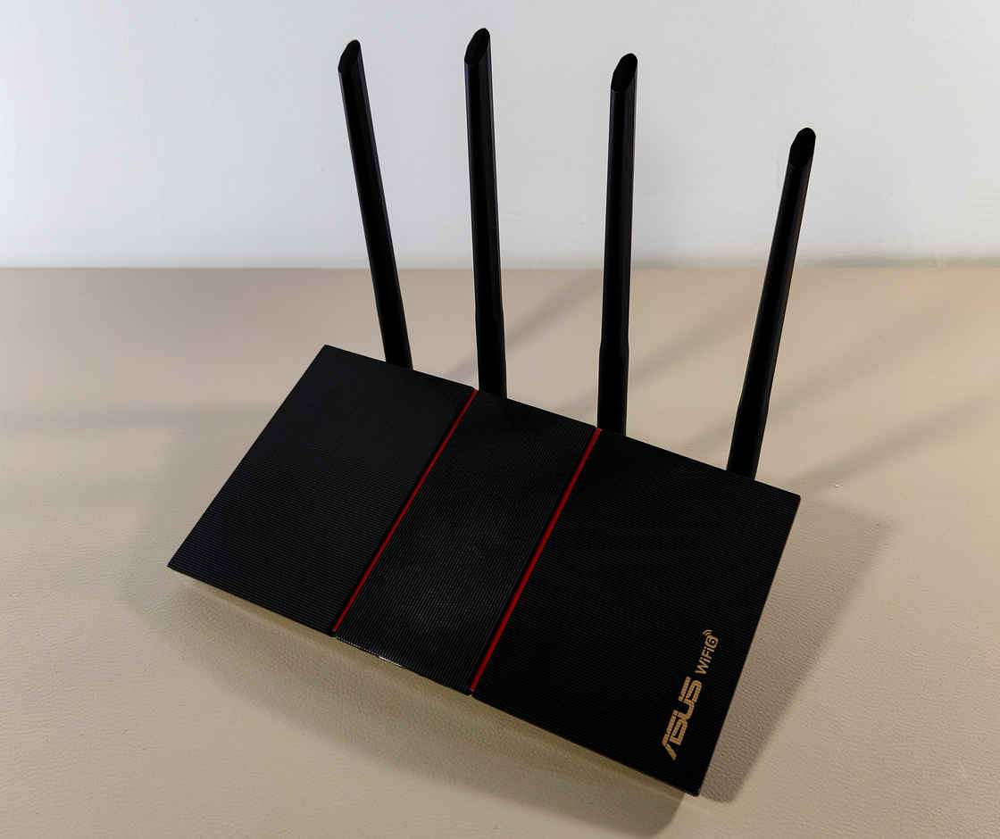

顶多是之后在门楼补充一个节点保证东南/西南角，厨房补充一个节点辅助覆盖东小院的前院，但是外面厕所已经拆了改室内了，这几个位置确实也不会有用机情况了。看看下一步更新之后，再怎么排布和补充吧。

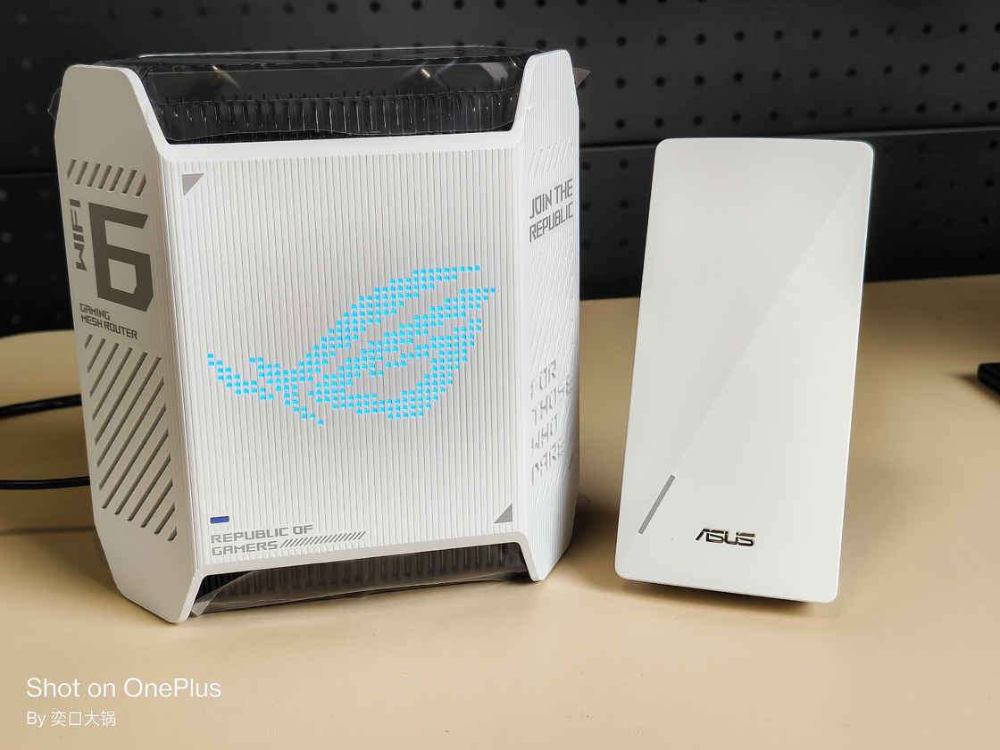

## **5.总结**

万兆分为光口和电口两种，一般需要单独装配接入，所以驱动和设置都会占用大量的时间和精力，碰上不支持速率自适应更是头疼。价格上的差距更是明显，2.5G的交换机现在基本是白菜价了，纯万兆的的交换机那价格就不多说了；而且你的终端设备，手机、平板、笔记本这些顶天是个2T2R能够跑满2.4Gbps的连接速度。对于普通用户而言，基本2.5G有线传输+满血Wi-Fi 6无线覆盖就已经是最优解了。不管是在配置难度，还是网络设备成本，抑或是终端设备支持上都是最合适的。

更何况万兆肯定是纯内网需求，国内运营商顶天有个2000Mbps的接入服务，2.5G有线全链路已经能够99.99%的人的需求了。更何况这个2000M的价格实在是，没啥人能承受的起，这定价都快顶笔者现在用的1000M+200M两条价格的三倍了，现在网上也没有相关的宣传了，只有在线下营业厅能够开行这项业务。

本文中除华硕BE96及交换机的实拍图片来自朋友，联通宣传图来自网络，ROG魔方幻商详来自商品截图外，其他所有图片表格均为本人实拍自制。

**如果觉得此篇文章对您有帮助的话，还请多多点赞、收藏评论。这里是老锅，我们下期再见！**
