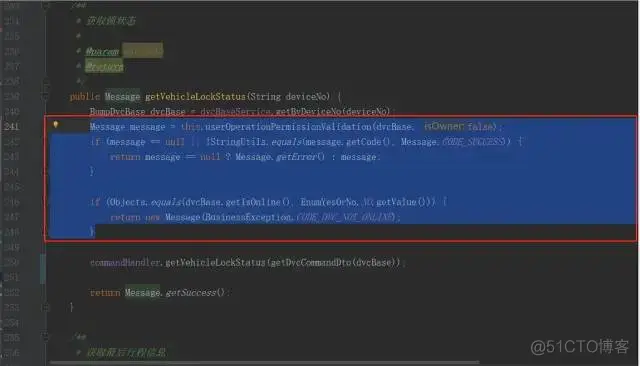
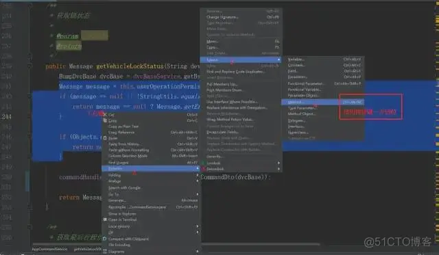
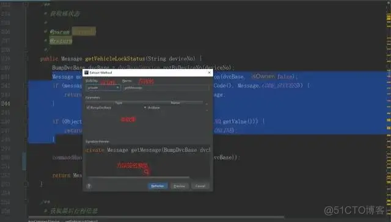
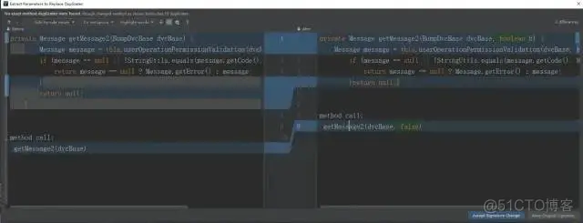
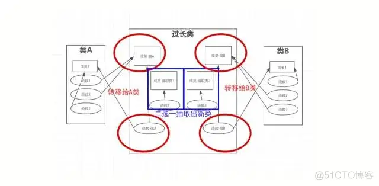
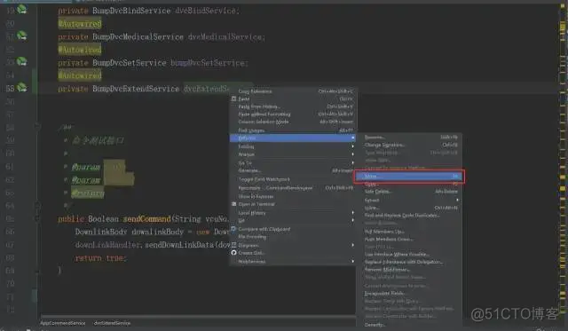
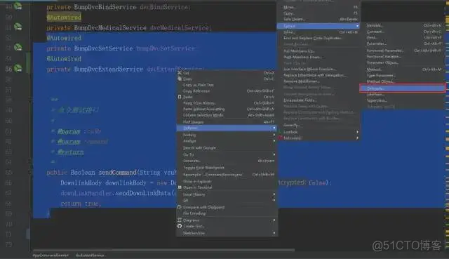
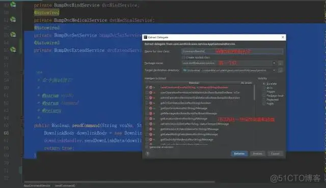
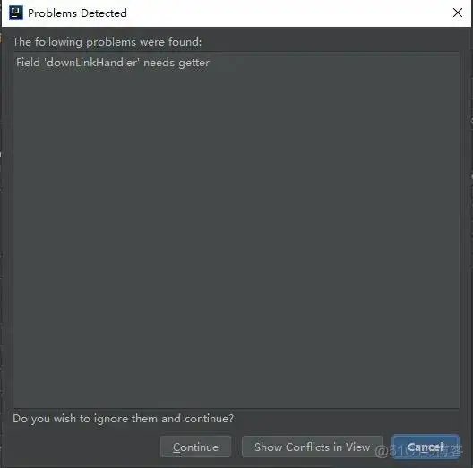

# 如何重构千行“又臭又长”的类，IntelliJ IDEA 几分钟搞定！

转载

最近在对已有项目进行扩展的时候，发现要改动的一个类它长766行，开放了近40个public接口，我流着泪把它给改完了。为了防止这样的惨剧再次发生在我的身上，我觉得有必要写一篇博客来让广大程序猿同胞知道代码重构的重要性

> 如果你身边有一个类写上千行的猿，一定要把此文转给ta

## 为什么类不能过长？

### 类过长——读不通，扩展不通

-   读不通——直接用滚轮滚都得好几秒，就算是原作者，时间长了恐怕也难以理清整个类，更不用说是其他的读者
    
-   扩展不通——一个类有过多的接口，会让扩展这个类变得异常困难，一动千行
    

### 类过长——可能有冗余代码

> 此时CV工程师打了个冷战

冗余代码，就是重复代码，通常出自使用Ctrl+C，Ctrl+V来生产代码的CV工程师之手，冗余代码的危害非常大：

1.  冗余代码使方法、类过长，不简洁
    
2.  冗余代码会造成发散式修改（冗余代码需要变动时，每一处Ctrl+V都需要修改）
    

### 类过长——多半是职责过多

一个类开放几十个接口，绝对存在职责过多的问题，就像图中的Tom猫一样手忙脚乱，一个类的职责过多也有巨大问题：

1.  违反设计原则——单一职责原则（单一职责原则要求一个类只实现一个职责，比如一只Tom只做扫地、擦桌、拖地中的一件事，而其他事的实现可以转移给史派克狗或肥胖女佣），违反了这个原则会导致发散式变化、发散式修改、类过长等代码问题，还会让你的类难以扩展，甚至会让其他程序猿认为你不专业
    
2.  发散式变化（指引发此类修改的地方很多），如果一个类的职责很多，那它的扇入（调用者）一定很多，每个调用者的修改都有可能让你这个类不得不随之修改，也就是发散式变化
    
    > 就是说不管哪儿出了问题，你这个类都得遭殃
    
3.  发散式修改（指此类修改引发修改的地方很多），相同的，如果一个类职责很多，那支撑它实现的下级，即扇出（被调用方）一定很多，如果此类逻辑发生变动，所有下级被调用者可能都得随之修改，也就是发散式修改
    
    > 就是说你这个类出了问题，不管哪儿都会遭殃
    
4.  难以扩展：如果你的一个类接口非常多，那它的子类怎么办？它的包装类怎么办？难道全部都要实现这么多接口，全部都要承担同样多的职责吗？扩展起来真的非常麻烦
    
5.  触发机关：【测试之怒】【运维之怒】
    

## 我已经写了几千行了，怎么办？

### 重构——抽取冗余代码

抽取冗余代码就是将重复代码抽取成一个独立的方法，之后再使用这段代码时就不再需要Ctrl + C，Ctrl + V，而是直接调用对应的方法即可

这样做也可以缩短原方法，使原方法更加简洁易懂

更值得一提的是如果这段代码需要修改，也只需修改一处，而不是发散式地到处修改

真是一箭三雕。

#### 使用IDEA进行冗余代码的抽取

1.找到重复代码

2.进行方法抽取 右键->选择重构->抽取->方法 （或者直接使用快捷键Ctrl + Alt + m）

自动检测出个别重复代码的细微差别，有些代码可能只改动一两个变量，IDEA会自动检测出来，并在抽取方法时提醒我们，选择左侧Accept Signature Change（接受签名变动）可以使抽取的方法自动替换更多的重复点

可以选择替换掉所有的重复代码（竟然有18处）

3.重构——更改方法签名

如果你对抽取出的方法的名字、参数、返回值或是修饰符不满意，不要使用Ctrl + R 修改，IDEA提供了重构方法——更改签名（快捷键Ctrl + F6）

注意：方法的名字指的是方法做了什么，而非怎么去做，最好是 动词+名词 格式

比如：Tom.扫地() √

Tom.扫地With扫把() ×

Tom.用扫把扫地() ×

### 重构——转移成员变量+函数（转移职责）

将不应该由自己管理的成员变量和函数转移出去

那就要考虑两个问题：该转移谁？转移给谁？

来看一个图

1.  图中成员【偏A】被类【A】调用两次，而只被它所在的类【过长类】调用1次，因而应该转移给【A】去管理
    
2.  由于函数【偏A】与成员【偏A】的亲密度较高（只调用了【偏A】），因而应与【偏A】共进退，同去留，转移给【A】
    
3.  成员【偏B】和函数【偏B】也是相同道理
    
4.  职责1（函数【1】和成员【偏职责1】）和职责2（函数【2】和成员【偏职责2】）由于找不到可转移的合适的类，所以应抽取出一个新的类
    

> 注意，先决定移动哪个成员变量，然后再决定移动哪个函数

#### 使用IDEA转移成员变量和函数

1.移动成员变量，鼠标选择成员变量->右键->Refactor->Move，然后选择转移至哪个类

2.移动函数（与移动成员变量步骤相同）

### 重构——抽取类

当你发现要转移的成员变量和函数找不到合适的类时（转移职责却找不到下家），要想起来，这里是程序世界，而我们程序猿就是类和对象的造物主，是时候创建一个新的类，让它来替我们分担职责（成员变量和函数）了

#### 使用IDEA抽取类

1.重构

选中要搬的成员变量和函数，右键->Refactor->Extract->Delegate（抽取一个委托者，委托他来管理这部分变量和函数，如果只有变量或只有函数，可以抽出参数对象Paramater Object或方法对象Method Object）

> 不推荐抽取参数对象，因为一般参数对象是给参数多的方法用的（用参数对象取代一长溜的参数），而且如果成员变量抽取了也不会影响任何函数的话，那就是无用对象了，不如直接把他们删除掉

2.为新类起个名，选个包吧

3.注意

抽取的函数和成员一定要符合一个原则，那就是被抽取函数使用被抽取成员的次数一定高于剩余函数的次数，不然违反亲密性原则（成员应归于调用它最多的类，没有理由你用的比我多还让我来管理）

4.一些小问题

由于抽取的函数直接使用了未抽取的对象而导致重构失败，涉及到另一个重构（使用get方法而非直接使用私有成员变量），使用此重构即可解决

## END

上一篇：[如何优雅的实现 try/catch 异常块？](https://blog.51cto.com/u_12302929/3000377)

下一篇：[图文并茂，详细讲解UML类图符号、各种关系说明以及举例](https://blog.51cto.com/u_12302929/3000547)
