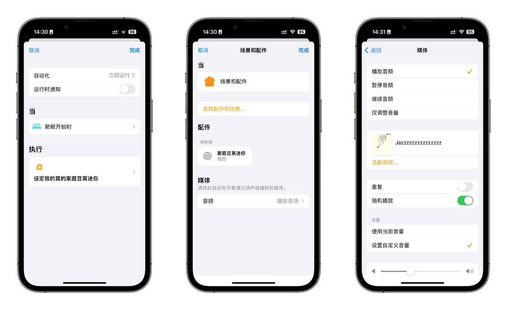

# 如果你也想在城堡里的交响乐中醒来——我的自动化及构建思路 - 少数派

**Matrix 首页推荐** 

[Matrix](https://sspai.com/matrix) 是少数派的写作社区，我们主张分享真实的产品体验，有实用价值的经验与思考。我们会不定期挑选 Matrix 最优质的文章，展示来自用户的最真实的体验和观点。

文章代表作者个人观点，少数派仅对标题和排版略作修改。

- - -

> 她慵懒地伸了个懒腰，打开了一双碧绿的眼睛，看到了自己的房间。她的房间是整个豪宅中最华丽的，有着金色的墙壁，红色的窗帘，和一张能容纳八个人的床。她的床上铺着最舒适的棉花被，最光滑的绸缎床单，还有最昂贵的珍珠枕头。她的床头柜上放着一台最高档的电脑，**每天早上都会自动播放她最爱的古典音乐。**她是这个城市的名媛，拥有着无人能及的才华，魅力，和地位。她的父亲是世界上最富有的商人，她的母亲是世界上最优雅的贵妇。她的身世就在那个风和日丽的早晨被揭开了，当她发现了自己的真实身份，以及那个男人的真实身份……
> 
> *——Generated by the New Bing.*

尽管「豪宅」以及其他奢华得不真实的部分与我们无关（毕竟我们不是皇甫家的[公主小妹](https://sspai.com/link?target=https%3A%2F%2Fzh.wikipedia.org%2Fzh-hans%2F%25E5%2585%25AC%25E4%25B8%25BB%25E5%25B0%258F%25E5%25A6%25B9_(%25E9%259B%25BB%25E8%25A6%2596%25E5%258A%2587)%3Fuseskin%3Dvector)😅)，但其中自动播放古典的部分还是可以实现的。由此出发，我来说说我的自动化，以及一些构建的思路。

本文讲述的内容限制在 Apple 生态内，需要有能够运行自动化的设备。如要实现音频播放还需要音频播放设备，本文以我的 HomePod mini 为例。另外，本文的示例场景高度个人化（手头设备有限+出租房场景），仅作为示例以输出自动化的设置思路，部分细节可能涉及要订阅服务。

## HomePod 联欢

受到玛丽苏文学和《公主小妹》的启发，我首先想到的是在 iPhone 的「睡眠」结束之后，以合适的音量播放传统意义上「优雅」的曲目。一来晨起后的洗漱、收拾、准备上班等等的一些列流程似乎都能在「优雅」的音乐中更「优雅」地进行；二来——我相信大家或多或少都有遇到过闹钟一按又睡过头的情况，我希望音乐能成为第二道保险，一定程度上减少这种情况的发生（尽管太轻柔舒缓的曲目反而可能更助眠，ooops）。

这便是我设置的第一条自动化——在「个人自动化」下的「睡眠」-「起床时」，让 HomePod mini 播放 Apple Music 的歌单「Classical AM」、立即运行、运行时不通知，尽量做到无感；重复和随机播放按需打开：

还想执行什么操作/更换歌单都可以添加、调整。

有了「起床时」，自然就会有「助眠开始时」，我设置的是让 HomePod mini 播放 Apple Music 的歌单「Jazzzzzzzzzzzzzzz」：助眠开始，在慵懒的爵士乐中慢慢平静自己的内心，以期收获更好的睡眠质量。

这里想要吐槽的一点是，尽管可能是设置流程上的需要，但弹出的卡片式设置页面也太多了，进来又要出去回到上一级，而且有时候点击项目之后出现勾勾，返回即可，有些却需要点按「完成」——返回在左，「完成」在右🙄，给人一种左点点、右按按的感觉。

**此处的构建思路是：在已有的功能的基础上，根据自己的「见闻」，选择自己喜欢的音乐或其他，让已有设备加入到自动化当中，让生活更加的精彩而做作（不是）。**

## 节电小巧思

### Apps

有一些应用程序，在使用的时候并不需要跑满 120 赫兹运行（我知道 Apple 做了很多工作让屏幕在更稳定、节能的状态下刷新，但我认为人为将最高刷新率压在 60 赫兹是更省电的），而有些程序则是打开之后就要使用较长时间，类似情况我也认为有必要开启低电量模式。

所以我设置的第二「组」自动化是：在「个人自动化」下的「App」，App 选择了第三方地图（持续使用）、「不 X 单词」（背单词没必要追求流畅的动效）、「X 团」（骑行期间省点电）、Ingress（基于地理位置的增强现实游戏），条件设置为「已打开」、立即运行、运行时不通知；随后再新增一条自动化，选择同样的应用程序，但条件设置为「已关闭」。

打开 app 时打开低电量模式

关闭 app 时关闭低电量模式

如此，便能做到启动相应应用时自启动低电量模式，关闭时（包括返回到主屏幕但不从 App 切换器中移除时）关闭低电量模式。

**此处的构建思路是：从使用场景和对应的 apps 下手，让某些功能（如低电量模式）适时启动。**

### Apple Watch

我使用的是一只 Apple Watch Series 7，人在南方气温巨高，加上平时监测睡眠、运动，全天候显示常开——尽管电池依旧比我健康，但续航已大不如前。

我思考了一下：我已经有了一个会在工作时段自动启动的「工作」专注模式，而自动化中有一组触发条件就是和专注模式相关的：

在公司使用电脑，对查看时间和其他即时通知的需求并不太高，抬腕查看也还算方便；加之也没有必要把亮起来的内容展示给周围的同事看，关闭全天候显示也算是一个节约 Apple Watch 电量的方法。所以我设置的第三条自动化是：在「个人自动化」下的「工作」，**同时勾选**「打开时」「关闭时」，「执行」中搜索「全天候」，选择 Watch 下的项目，「操作-切换」设置为「开/关」：

在这里我还加了一条「将（iPhone）媒体音量设到 0%」，这样就不会出现「在工位上摸鱼点开视频，结果音量超高」的尴尬情况。选择立即运行、运行时不通知。

这里偷了个懒，没有将打开和关闭分开两条来设置。使用下来，只要眼前的全天候显示是符合自己预期的，启闭就不会错乱。

**此处的构建思路是：根据自己的生活场景，结合实际情况和自身需求，用自动化启闭同一生态内其他设备的功能，以达到省电目的；如果可以，还可以给特定场景设置双保险，避免尴尬。**

## 强行唤醒

在前司办公室午休小睡，有时候醒来非常痛苦。针对在前司午休唤醒的场景，我设置了一条快捷指令+一条自动化，以让午休小睡和唤醒形成闭环。

我当时的场景和对应的想法是：躺办公椅睡下的时间**时早时晚（手动运行的快捷指令更适合这种情况）**，但起来的**时间固定**，是每个工作日的 12:58**（能够到点运行的自动化更适合这种情况）**；午休时会佩戴 AirPods Pro，需要切换到「降噪」，会播放 Apple Music 中的「助眠音乐」列表，音乐需要自动暂停；期间不想被电话或其他通知打扰（需要从「工作」专注模式切换到「勿扰模式」）

### 快捷指令部分

基于上述，我设计的快捷指令是：

在最开始设计这条快捷指令的时候我并没有想到，即便是戴上了耳机，有时候音乐还是会从扬声器中播放，在安静的办公室中这显得尤为尴尬，所以我将「播放位置」添加并放置在最开头，以最大限度减少这种情况出现的几率；而媒体音量也是多次实践之后才知道在办公室环境下多大的音量才不会影响入睡，同时又不会因为太小声听不到音乐；后来我还加入了「关闭全天候显示」这一条设置——毕竟都午休了，亮起来的手表别说同事了，我自己也看不到，能省一点电是一点。

我曾试过直接使用「设定专注模式」指令，试图将「勿扰模式」切换到「工作」，但在我实践中，切换是时而可以时而不行。所以才采取了图中「关闭工作-打开勿扰」的曲线实施方式。

### 自动化部分

在使用快捷指令过程中我又发现，「工作」和「勿扰模式」的「切换」的效果可以达成，但到设定时间点，「勿扰模式」自动关闭后，是回归到没有启用任何专注模式的状态中的；音乐会继续播放，耳机仍是降噪的状态。被手表的闹钟震醒之后，人本来就非常迷糊，放着音乐还降着噪非常容易又睡过去，老板来了可就完蛋了。即便是醒来后精神良好，也还要手动逐个调整，非常麻烦。

为了解决这些问题，我增添了一条自动化，这里用到了 if：

彼时手表续航还行，也没有意识到工作中打开全天候于我而言意义不大，所以做了全天候的开关

也因为直接切换的指令似乎不能达到专注模式的切换效果（上文所述），索性就用了「获取当前专注模式」+if函数，做一个简单判断，并执行相应动作。

音乐消失。随着耳机被自动切换到「通透模式」，那一声「咚铛~」提示音带着一种「醒」灌入耳道，外界的声音紧随其后重新输入大脑，我不醒谁醒。抓起手机，壁纸和主屏幕的排布都回到了工作状态，也在暗示着我也得赶紧打起精神来打下午的工。

图左：「勿扰模式」的壁纸和主屏幕排布；图右：「工作」专注模式的壁纸和主屏幕排布

**这部分的构建思路是：**

1.  **可以想想什么时候该用手动运行的快捷指令**，什么时候该用自动运行的自动化。他们对应的触发场景不一样。可以配合使用。
2.  **结合深处场景的实际情况和自身需求**，逐条设计快捷指令和自动化，并且在实践中不断迭代优化，方便又优雅的生活就此开始。

自动化的设置中还有非常多出触发条件可供选择，如基于地理位置的「到达」「离开」，与 Apple Watch 相关的「Apple Watch 体能训练」；如在最下方的「家庭自动化」中还能创建人人可用的自动化操作。我还设置了开启任意体能训练时关闭全天候显示，以及在最后一个人离开家时停止 HomePod mini 的音频播放。但受限于篇幅我没有展开，毕竟本篇文章并非教程，而是借我自己的一些例子和思考过程，给各位一些快捷指令和自动化方面的参考、提供一些设置上的思路。

\> 关注 [少数派公众号](https://sspai.com/s/J71e)，解锁全新阅读体验 📰

\> 实用、好用的 [正版软件](https://sspai.com/mall)，少数派为你呈现 🚀
